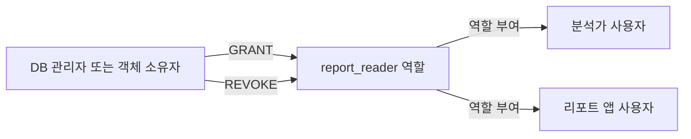
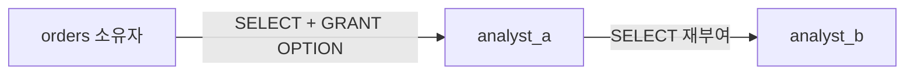

## 이번 편의 목표

- DCL이 데이터 값이 아니라 접근 권한을 제어한다는 점을 설명한다.
- 시스템 권한과 객체 권한을 구분한다.
- `GRANT`, `REVOKE`, 역할(Role)의 권한 흐름을 읽는다.
- `WITH GRANT OPTION`과 최소 권한 원칙의 위험을 판단한다.

## 먼저 알아둘 말

| 용어 | 쉬운 뜻 |
| --- | --- |
| DCL(Data Control Language) | 사용자에게 데이터베이스 권한을 주거나 회수하는 SQL |
| 권한(Privilege) | 특정 작업을 실행할 수 있는 허가 |
| 시스템 권한 | 접속·테이블 생성처럼 DB 수준 작업에 관한 권한 |
| 객체 권한 | 특정 테이블·뷰 등의 SELECT·INSERT에 관한 권한 |
| 역할(Role) | 여러 권한을 묶어 사용자에게 배정하는 이름 |
| 최소 권한 원칙 | 업무에 필요한 최소한의 권한만 주는 보안 원칙 |
| 권한 위임 | 받은 객체 권한을 다른 사용자에게 다시 줄 수 있게 하는 기능 |

## 선수지식과 핵심 질문

선수지식은 [33. DDL](./33_ddl)과 [34. DML](./34_dml)이다.

핵심 질문은 **누가 어느 객체에 어떤 작업을 할 수 있고, 그 권한을 다른 사람에게 다시 줄 수 있는가**이다.

## 권한 흐름



사용자마다 권한을 하나씩 반복 부여하기보다 업무 역할에 권한을 묶고 사용자를 역할에 연결하면 관리가 쉬워진다.

## 시스템 권한과 객체 권한

| 구분 | 질문 | 예시 |
| --- | --- | --- |
| 시스템 권한 | DB 안에서 어떤 종류의 작업을 할 수 있는가? | CREATE SESSION, CREATE TABLE |
| 객체 권한 | 어느 객체에서 어떤 작업을 할 수 있는가? | orders SELECT, members UPDATE |

Oracle 예시:

```sql
GRANT CREATE SESSION TO app_user;
GRANT SELECT ON orders TO app_user;
```

첫 문장은 `app_user`가 DB에 접속할 수 있게 하는 시스템 권한이다. 둘째는 특정 `orders` 객체를 조회할 수 있게 하는 객체 권한이다. 접속 권한만 있다고 모든 테이블을 조회할 수 있는 것은 아니다.

## 객체 권한 종류

```sql
GRANT SELECT, INSERT ON orders TO order_app;
```

| 작업 | 가능 여부 |
| --- | --- |
| orders 조회 | 가능 |
| orders 새 행 입력 | 가능 |
| orders 기존 행 수정 | 불가, UPDATE 미부여 |
| orders 행 삭제 | 불가, DELETE 미부여 |
| members 조회 | 불가, 다른 객체 |

권한은 객체와 작업의 조합으로 읽는다.

## 열 단위 권한

DBMS는 UPDATE나 INSERT 권한을 특정 열로 제한할 수 있다.

```sql
GRANT UPDATE (status) ON orders TO shipping_user;
```

배송 담당자는 `status`를 바꿀 수 있지만 `total_amount`를 수정할 수 없게 설계할 수 있다. 정확한 지원 문법은 DBMS별로 확인한다.

## REVOKE로 권한 회수

```sql
REVOKE INSERT ON orders FROM order_app;
```

이후 order_app은 SELECT는 유지하지만 INSERT는 할 수 없다. REVOKE가 사용자의 다른 역할이나 PUBLIC을 통해 받은 같은 권한까지 반드시 모두 제거하는 것은 아니다.

<Callout type="warning">
  권한을 회수했는데도 작업이 가능하면 직접 권한뿐 아니라 역할, PUBLIC, 다른 경로로 받은 권한을 함께 확인한다.
</Callout>

## 역할로 묶기

```sql
CREATE ROLE report_reader;
GRANT SELECT ON members TO report_reader;
GRANT SELECT ON orders TO report_reader;
GRANT report_reader TO analyst_a;
GRANT report_reader TO analyst_b;
```

| 주체 | 직접 관리 내용 |
| --- | --- |
| report_reader 역할 | members·orders 조회 권한 |
| analyst_a | report_reader 역할 보유 |
| analyst_b | report_reader 역할 보유 |

새 보고서 테이블 권한은 역할에 한 번 추가하면 역할 사용자에게 일관되게 제공할 수 있다. 역할 활성화 방식과 저장 프로시저 안의 권한 평가 등은 DBMS별 차이가 있다.

## WITH GRANT OPTION

```sql
GRANT SELECT ON orders TO analyst_a WITH GRANT OPTION;
```

analyst_a는 orders를 조회할 뿐 아니라 다른 사용자에게 그 SELECT 권한을 다시 줄 수 있다.



권한 전파 범위가 넓어지므로 꼭 필요한 관리자 역할이 아니라면 신중하게 사용한다. 원래 위임 권한을 REVOKE했을 때 하위 재부여 권한이 연쇄 회수되는 세부 규칙은 DBMS와 옵션에 따라 확인한다.

### WITH ADMIN OPTION

역할이나 시스템 권한을 다른 사용자에게 부여할 수 있게 하는 Oracle 옵션으로 `WITH ADMIN OPTION`이 있다. 객체 권한의 `WITH GRANT OPTION`과 대상을 구분한다.

| 옵션 | 대표 대상 | 의미 |
| --- | --- | --- |
| WITH GRANT OPTION | 객체 권한 | 받은 객체 권한을 재부여 |
| WITH ADMIN OPTION | 시스템 권한·역할 | 받은 권한·역할을 관리·재부여 |

## PUBLIC

```sql
GRANT SELECT ON public_codes TO PUBLIC;
```

PUBLIC은 모든 사용자에게 넓게 적용되는 공통 주체다. 편리하지만 민감한 객체에 사용하면 권한 범위가 지나치게 커진다. 공개 코드표처럼 정말 모든 접속 사용자에게 필요한지 검토한다.

## 최소 권한으로 계정 나누기

| 계정 | 필요한 작업 | 주지 않을 권한 |
| --- | --- | --- |
| order_app | 주문 SELECT·INSERT·UPDATE | DROP TABLE, 사용자 관리 |
| report_app | 업무 뷰 SELECT | 원본 테이블 UPDATE·DELETE |
| migration_user | 배포 시간의 DDL | 상시 로그인·무기한 권한 |

애플리케이션을 관리자 계정으로 연결하면 SQL 주입이나 프로그램 오류의 피해 범위가 DB 전체로 커질 수 있다.

## 뷰와 권한을 함께 사용하기

회원 테이블에 이메일·전화번호가 있지만 보고서에는 등급별 인원만 필요하다고 하자. 민감 열을 제외한 뷰를 만들고 그 뷰에만 SELECT를 부여하면 열 노출을 줄일 수 있다.

```sql
CREATE VIEW member_report AS
SELECT member_id, grade, points
FROM members;

GRANT SELECT ON member_report TO report_reader;
```

뷰가 항상 완벽한 보안 경계라는 뜻은 아니며 소유자 권한·실행자 권한과 DBMS 보안 규칙을 확인한다.

## 시험에서는 어떻게 묻나

- CREATE SESSION과 SELECT ON orders를 시스템·객체 권한으로 구분하게 한다.
- GRANT OPTION을 받은 사용자가 재부여할 수 있다는 점을 묻는다.
- 역할을 회수했어도 직접 권한이 남아 있을 수 있음을 함정으로 낸다.
- 최소 권한 원칙에 맞는 계정 설계를 고르게 한다.

## 짧은 확인

analyst가 report_reader 역할과 orders 직접 SELECT 권한을 모두 갖고 있다. report_reader 역할만 회수하면 orders 조회가 막힐까?

<Collapse title="확인하기">

막히지 않을 수 있다. 역할 경로는 사라져도 직접 받은 orders SELECT 권한이 남아 있기 때문이다. 권한의 모든 획득 경로를 확인해야 한다.

</Collapse>

## 흔한 실수와 진단법

| 증상 | 원인 | 확인 |
| --- | --- | --- |
| REVOKE 후에도 접근 가능 | 다른 역할·직접·PUBLIC 권한 | 권한 경로 전체 조회 |
| 접속은 되지만 테이블 오류 | 객체 권한 없음 | 대상 객체와 작업 권한 확인 |
| 불필요한 데이터 노출 | 테이블 전체 SELECT | 제한 뷰·열 권한 검토 |
| 권한이 예상 밖으로 확산 | GRANT/ADMIN OPTION | 재부여 계보 확인 |

## 다음 단계: 복습

[36-복습. DCL](./36_dcl-review)에서 사용자별 가능한 작업과 권한 경로를 판단하자.

## 정리

<Callout type="default">
  - 시스템 권한은 DB 수준 작업, 객체 권한은 특정 객체의 작업을 허용한다.
  - GRANT는 권한을 주고 REVOKE는 특정 경로의 권한을 회수한다.
  - 역할은 여러 권한을 묶어 사용자 집단에 일관되게 배정한다.
  - 최소 권한과 권한 위임 범위를 지켜 피해 범위를 줄인다.
</Callout>

다음 편에서는 DDL·DML·TCL·DCL을 한 업무 흐름에서 구분하는 관리 구문 통합 문제를 다룬다.

## 참고 자료

- [Oracle Database - GRANT](https://docs.oracle.com/en/database/oracle/oracle-database/21/sqlrf/GRANT.html)
- [Oracle Database - REVOKE](https://docs.oracle.com/en/database/oracle/oracle-database/21/sqlrf/REVOKE.html)
- [PostgreSQL - Database Roles](https://www.postgresql.org/docs/current/user-manag.html)
