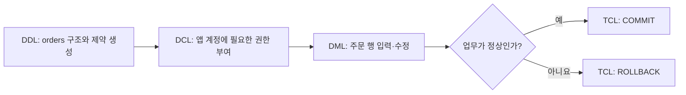
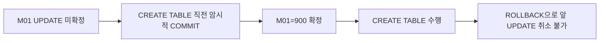

## 이번 편의 목표

- 관리 구문의 네 분류를 작업 대상과 결과로 구분한다.
- 구조 생성부터 권한 부여, 행 변경, 확정까지 올바른 순서를 설계한다.
- DELETE·TRUNCATE·DROP과 COMMIT·ROLLBACK의 경계를 종합 판단한다.
- Oracle 중심 시험 문제와 DBMS별 차이를 분리해 읽는다.

## 먼저 알아둘 말

| 분류 | 전체 이름 | 한 문장 뜻 |
| --- | --- | --- |
| DDL | Data Definition Language | 구조와 규칙을 정의한다. |
| DML | Data Manipulation Language | 구조 안의 행을 조회·변경한다. |
| TCL | Transaction Control Language | 미확정 DML을 확정·취소한다. |
| DCL | Data Control Language | 사용자와 역할의 접근 권한을 제어한다. |

## 선수지식과 핵심 질문

선수지식은 [33. DDL](./33_ddl)부터 [36. DCL](./36_dcl)까지다.

핵심 질문은 **이 명령이 구조·행·트랜잭션·권한 중 무엇을 바꾸며, 되돌릴 수 있는 경계는 어디인가**이다.

## 서비스 배포와 사용 흐름



네 분류는 따로 외우는 단어가 아니라 실제 시스템에서 순서대로 협력한다.

## 같은 대상도 질문이 다르다

| 업무 질문 | 명령 예 | 분류 |
| --- | --- | --- |
| 주문 금액 열이 있어야 한다 | `ALTER TABLE ... ADD` | DDL |
| 주문 금액을 50000으로 바꾼다 | `UPDATE ... SET` | DML |
| 금액 변경을 확정한다 | `COMMIT` | TCL |
| 배송 담당자에게 status 수정만 허용 | `GRANT UPDATE(status)` | DCL |

“무엇을 바꾼다”라는 말만 보고 DML이라고 정하지 않는다. 구조인지 행 값인지 권한인지 구체적인 대상을 본다.

## 명령 분류 지도

| 분류 | 대표 명령 | 변경 대상 | WHERE |
| --- | --- | --- | --- |
| DDL | CREATE, ALTER, DROP, TRUNCATE, RENAME | 객체 구조 | 일반적으로 없음 |
| DML | SELECT, INSERT, UPDATE, DELETE, MERGE | 데이터 행 | 조회·수정·삭제에서 사용 가능 |
| TCL | COMMIT, ROLLBACK, SAVEPOINT | 트랜잭션 상태 | 없음 |
| DCL | GRANT, REVOKE | 권한 관계 | 없음 |

일부 교재는 SELECT를 DQL(Data Query Language)로 따로 부르지만 KDATA의 SQL 정의와 시험 범주에서는 SQL 기본의 조회 문장으로 이해하면 된다. 문제에서 사용한 분류 체계를 따른다.

## 가장 많이 섞이는 삭제 명령

시작: `orders` 구조와 1000행이 존재한다.

| 명령 | 실행 후 행 | 실행 후 구조 | 조건부 삭제 | Oracle 시험상 롤백 |
| --- | ---: | --- | --- | --- |
| `DELETE FROM orders WHERE status='CANCELED'` | 일부 감소 | 유지 | 가능 | COMMIT 전 가능 |
| `DELETE FROM orders` | 0 | 유지 | 전체 대상 | COMMIT 전 가능 |
| `TRUNCATE TABLE orders` | 0 | 유지 | 불가 | 일반 DML처럼 불가 |
| `DROP TABLE orders` | 객체 없음 | 제거 | 불가 | 일반 DML처럼 불가 |

<Callout type="warning">
  DELETE·TRUNCATE·DROP은 모두 “없앤다”지만 삭제 단위와 트랜잭션 성격이 다르다. 행, 전체 내용, 객체 중 무엇이 사라지는지 먼저 적는다.
</Callout>

## Oracle 암시적 COMMIT 종합 문제

```sql
UPDATE members SET points = 900 WHERE member_id = 'M01';
CREATE TABLE temp_log (id NUMBER);
ROLLBACK;
```

Oracle 시험 관점의 흐름:



PostgreSQL처럼 많은 DDL을 트랜잭션 안에서 롤백할 수 있는 제품도 있으므로 실제 시스템에서는 해당 DBMS 문서를 확인한다.

## 제약조건과 DML의 만남

DDL로 `CHECK (amount >= 0)`을 만들고 DML로 음수를 입력하면 DML이 실패한다.

```text
DDL 규칙: amount는 0 이상
           ↓ 검사
DML 입력: amount = -100
           ↓
결과: 행 저장 거부, 기존 구조는 그대로
```

DDL은 한 번 실행하고 끝난 역사적 명령이 아니라 이후 DML마다 지켜야 할 규칙을 남긴다.

## 권한과 DML의 만남

```sql
GRANT SELECT ON orders TO report_user;
```

report_user가 할 수 있는 작업:

| SQL | 결과 |
| --- | --- |
| `SELECT * FROM orders` | 허용 |
| `UPDATE orders SET ...` | UPDATE 권한이 없어 거부 |
| `DROP TABLE orders` | 객체 소유·시스템 권한이 없어 거부 |

DML 문법이 올바르더라도 권한 검사는 별도다. 오류를 문법 문제로만 보지 않는다.

## 작업 전 안전 점검 순서

<Steps>

### 대상과 명령 분류를 확인한다

구조·행·트랜잭션·권한 중 무엇을 바꾸는지 적는다.

### DBMS와 자동 커밋 설정을 확인한다

특히 DDL과 TRUNCATE의 복구 가능성을 확인한다.

### DML 대상 행을 SELECT로 검증한다

WHERE 조건과 예상 영향 행 수를 확인한다.

### 실행 후 구조·데이터·권한을 각각 검증한다

데이터 사전, SELECT, 권한 조회를 목적에 맞게 사용한다.

</Steps>

## 시험에서는 어떻게 묻나

- 명령 이름을 네 분류에 연결하게 한다.
- Oracle에서 DML 뒤 DDL과 ROLLBACK의 최종 상태를 묻는다.
- DELETE·TRUNCATE·DROP의 구조와 로그·롤백 특성을 비교한다.
- 권한 부족 오류와 제약조건 오류를 구분하게 한다.

## 짧은 확인

“테이블은 남기고 모든 행을 조건 없이 비운다”는 요구에는 DELETE, TRUNCATE, DROP 중 무엇이 가장 직접적인가?

<Collapse title="확인하기">

TRUNCATE다. 구조는 유지하고 전체 행을 비운다. 다만 Oracle에서는 DDL이며 일반 DELETE처럼 롤백할 수 있다고 기대하면 안 된다.

</Collapse>

## 흔한 실수와 진단법

| 실수 | 바로 확인할 질문 |
| --- | --- |
| 바꾸는 명령은 모두 DML이라 생각 | 구조인가, 행 값인가? |
| ROLLBACK이면 항상 복구된다고 생각 | 이미 COMMIT·DDL·자동 커밋이 있었나? |
| 권한 오류를 문법 오류로 판단 | 현재 사용자에게 객체·작업 권한이 있나? |
| 제약 오류를 타입 오류로만 판단 | NOT NULL·UNIQUE·CHECK·FK 중 무엇을 위반했나? |

## 다음 단계: 복습

[37-복습. 관리 구문](./37_management-statements-review)에서 여러 명령의 최종 구조·행·권한 상태를 계산하자.

## 정리

<Callout type="default">
  - DDL은 구조, DML은 행, TCL은 확정 상태, DCL은 권한을 다룬다.
  - 네 분류는 구조 생성부터 권한·업무 처리·확정까지 하나의 흐름으로 연결된다.
  - 삭제 명령은 행·전체 내용·객체 중 무엇을 제거하는지 구분한다.
  - Oracle 시험의 암시적 COMMIT과 실제 DBMS 차이를 분리한다.
</Callout>

다음 편에서는 SQL 기본 범위 전체를 한 주문 조회 문제로 연결한다.

## 참고 자료

- [KDATA - SQL 개발자 시험 주요 내용](https://www.dataq.or.kr/www/sub/a_04.do)
- [Oracle Database - SQL Statements](https://docs.oracle.com/en/database/oracle/oracle-database/21/sqlrf/SQL-Statements.html)
- [PostgreSQL - SQL Commands](https://www.postgresql.org/docs/current/sql-commands.html)
