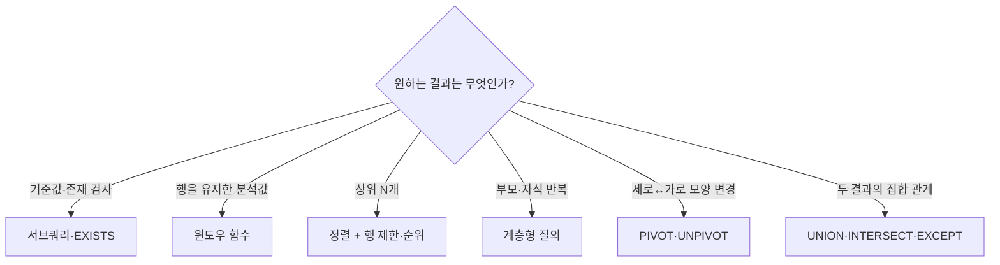

## 이번 편의 목표

- 요구사항의 핵심 동사를 보고 적합한 SQL 활용 기능을 선택한다.
- 서브쿼리와 윈도우 함수를 결합해 그룹별 상위 행을 구한다.
- 집합·계층·PIVOT의 입력과 출력 모양을 구분한다.
- 여러 단계 SQL에서 각 단계의 grain과 정보 손실을 추적한다.

## 먼저 알아둘 말

| 요구 표현 | 먼저 떠올릴 기능 |
| --- | --- |
| 평균보다 큰, 목록 중 하나 | 서브쿼리 |
| 두 결과를 합친·공통·제외 | 집합 연산자 |
| 소계·총계 | ROLLUP·CUBE·GROUPING SETS |
| 순위·누계·이전 행 | 윈도우 함수 |
| 상위 N개·그룹별 최신 한 건 | Top N + 윈도우 함수 |
| 모든 하위 조직·경로 | 계층형 질의 |
| 분류 값을 가로 열로 | PIVOT |
| 여러 열을 세로 행으로 | UNPIVOT |
| 문자열 모양 검사·추출 | 정규 표현식 |

## 선수지식과 핵심 질문

선수지식은 [23. 서브쿼리](./23_subqueries)부터 [32. 정규 표현식](./32_regular-expressions)까지다.

핵심 질문은 **요구사항을 결과 한 행의 모양으로 바꾼 뒤 어떤 기능을 어느 순서로 적용할 것인가**이다.

## 기능 선택 지도



한 문제에 기능이 둘 이상 필요할 수 있다. “회원별 상위 주문”은 회원별 파티션 순위와 상위 행 필터가 함께 필요하다.

## 통합 사례: 회원별 최고 금액 주문

`orders`

| order_id | member_id | ordered_at | amount |
| ---: | --- | --- | ---: |
| 1001 | M01 | 8/01 | 100 |
| 1002 | M01 | 8/03 | 300 |
| 1003 | M02 | 8/02 | 200 |
| 1004 | M02 | 8/04 | 200 |
| 1005 | M03 | 8/05 | 50 |

요구사항: 회원마다 금액이 가장 큰 주문 한 건만 보여 준다. 동점이면 최신 주문을 선택한다.

### 1단계: 행을 유지하며 순번 붙이기

```sql
SELECT o.*,
       ROW_NUMBER() OVER (
         PARTITION BY member_id
         ORDER BY amount DESC, ordered_at DESC, order_id DESC
       ) AS rn
FROM orders o;
```

| order_id | member_id | amount | rn | 이유 |
| ---: | --- | ---: | ---: | --- |
| 1002 | M01 | 300 | 1 | M01 최고 금액 |
| 1001 | M01 | 100 | 2 | 두 번째 |
| 1004 | M02 | 200 | 1 | 동점 중 최신 |
| 1003 | M02 | 200 | 2 | 동점 중 이전 |
| 1005 | M03 | 50 | 1 | 유일한 주문 |

### 2단계: rn=1만 선택

```sql
SELECT order_id, member_id, amount
FROM (
  SELECT o.*,
         ROW_NUMBER() OVER (
           PARTITION BY member_id
           ORDER BY amount DESC, ordered_at DESC, order_id DESC
         ) AS rn
  FROM orders o
) ranked
WHERE rn = 1
ORDER BY member_id;
```

| order_id | member_id | amount |
| ---: | --- | ---: |
| 1002 | M01 | 300 |
| 1004 | M02 | 200 |
| 1005 | M03 | 50 |

결과 grain은 회원 한 명당 한 행이다. 같은 SELECT의 WHERE에서 윈도우 결과를 쓸 수 없어 서브쿼리로 한 단계 감쌌다.

## 평균보다 크면서 회원별 최고인 주문

전체 평균은 `(100+300+200+200+50)/5 = 170`이다. 먼저 평균 초과를 WHERE로 거른 뒤 회원별 최고를 고를지, 회원별 최고를 먼저 고른 뒤 평균과 비교할지 요구사항을 확인해야 한다.


이 순서에서는 M01 300, M02의 최신 200이 남고 M03은 평균 초과 주문이 없어 결과 자체가 없다.

## EXISTS와 JOIN 선택

요구사항: 주문이 있는 회원의 이름만 한 번씩 보여 준다.

```sql
SELECT m.member_id, m.name
FROM members m
WHERE EXISTS (
  SELECT 1
  FROM orders o
  WHERE o.member_id = m.member_id
);
```

JOIN을 하면 주문 수만큼 회원 행이 반복되어 DISTINCT가 필요할 수 있다. 관련 행의 **존재 여부만** 필요한 요구에는 EXISTS가 의도를 직접 드러낸다. 반대로 주문 금액 열도 출력해야 하면 JOIN이 자연스럽다.

## 집합 연산자로 대상 목록 조합

마케팅 대상은 “서울 회원 또는 GOLD 회원”, 제외 대상은 “수신 거부 회원”이라고 하자.

```sql
(
  SELECT member_id FROM members WHERE city = '서울'
  UNION
  SELECT member_id FROM members WHERE grade = 'GOLD'
)
EXCEPT
SELECT member_id FROM opt_out_members;
```

먼저 합집합으로 중복 없는 후보를 만들고 차집합으로 수신 거부를 뺀다. Oracle에서는 EXCEPT 대신 MINUS를 사용한다. 괄호로 의도한 연산 순서를 분명히 한다.

## 상세·소계·총계를 한 결과로

```sql
SELECT city, status,
       SUM(amount) AS amount_sum,
       GROUPING(city) AS g_city,
       GROUPING(status) AS g_status
FROM sales
GROUP BY ROLLUP (city, status);
```

결과에는 상세 `(city,status)`, 지역 소계 `(city)`, 전체 총계 `()`가 섞인다. GROUPING 값으로 각 행 수준을 구분한 뒤 사용자용 레이블을 만든다.

## 분석 결과를 PIVOT하기

회원별 최고 주문을 분기별 열로 보여 준다고 하자.

```text
원본 주문
  ↓ 회원·분기별 ROW_NUMBER로 최고 한 건 선택
회원·분기별 최고 금액의 긴 표
  ↓ PIVOT SUM(amount) FOR quarter
회원 한 행 + Q1·Q2·Q3·Q4 열
```

순서를 바꿔 먼저 PIVOT으로 합계를 만들면 개별 최고 주문을 고를 정보가 사라질 수 있다. 정보가 축약되는 집계 단계 전에 필요한 상세 선택을 끝낸다.

## 계층과 순위 결합

조직 계층을 전개한 뒤 각 본부 안에서 매출 상위 팀을 구할 수 있다.

1. 계층형 질의에서 루트 본부와 각 하위 팀의 경로를 만든다.
2. 팀 매출을 집계한다.
3. `PARTITION BY root_department`로 본부별 순위를 매긴다.
4. 바깥에서 순위 N 이하를 고른다.

각 단계의 결과 한 행이 부서인지 주문인지 팀 집계인지 기록하지 않으면 중복 합계를 만들기 쉽다.

## 정규 표현식은 앞단 정제에 사용

외부 주문 코드 중 `ORD-숫자4자리-숫자4자리`만 추출한 뒤 분석한다.

```sql
WHERE REGEXP_LIKE(order_code, '^ORD-[0-9]{4}-[0-9]{4}$')
```

형식 검사를 통과했다고 실제 존재하는 주문이라는 뜻은 아니다. 이후 orders와 조인하거나 외래키·업무 검증으로 존재 여부를 확인한다.

## 복잡한 SQL을 설계하는 순서

<Steps>

### 최종 결과 한 행을 문장으로 적는다

예: 회원 한 명당 최고 주문 한 건.

### 상세 정보가 사라지는 시점을 표시한다

GROUP BY, DISTINCT, PIVOT 집계 전에 필요한 열을 확보한다.

### 단계마다 입력·출력 행 수와 키를 적는다

서브쿼리 이름도 `ranked_orders`, `city_totals`처럼 역할로 짓는다.

### 동점·NULL·빈 집합 정책을 정한다

ROW_NUMBER와 RANK, NOT IN과 NOT EXISTS, NULL과 0을 선택한다.

### 마지막에 정렬과 표시 형태를 적용한다

정확한 집합을 만든 뒤 Top N·PIVOT·레이블을 적용한다.

</Steps>

## 시험에서는 어떻게 묻나

- 윈도우 결과를 WHERE에서 바로 사용한 오류를 찾게 한다.
- 그룹별 Top N에서 PARTITION BY와 동점 정책을 묻는다.
- PIVOT 전에 집계해 상세 정보를 잃는 순서 문제를 낸다.
- NOT IN의 NULL, 집합 연산 방향, 계층 PRIOR 방향을 섞어 묻는다.

## 짧은 확인

회원별 최고 금액과 공동 최고 주문을 모두 보여 줘야 한다. ROW_NUMBER와 RANK 중 무엇이 알맞을까?

<Collapse title="확인하기">

RANK가 알맞다. 최고 금액 동점은 모두 1위가 되어 `rank_no = 1`로 함께 선택된다. ROW_NUMBER는 동점에도 번호가 달라 한 건만 남긴다.

</Collapse>

## 흔한 실수와 진단법

| 실수 | 진단 질문 |
| --- | --- |
| 기능 이름부터 고름 | 최종 결과 한 행은 무엇인가? |
| 집계 후 상세 열을 다시 찾음 | 어느 단계에서 정보가 합쳐졌는가? |
| 그룹별 순위가 전체 순위로 나옴 | PARTITION BY가 있는가? |
| 중간 결과가 중복됨 | 단계별 키가 고유한가? |

## 다음 단계: 복습

[39-복습. SQL 활용](./39_sql-advanced-summary-review)에서 요구사항을 SQL 기능과 실행 단계로 직접 설계하자.

## 정리

<Callout type="default">
  - 요구사항의 결과 grain과 핵심 동사를 먼저 정하고 기능을 고른다.
  - 윈도우 계산 후 필터는 서브쿼리로 단계를 나눈다.
  - 집계·PIVOT 전에 필요한 상세 정보를 먼저 선택한다.
  - 각 단계의 키, 행 수, NULL·동점 정책을 기록한다.
</Callout>

다음 편부터는 데이터 모델과 SQL 구조가 성능에 어떤 영향을 주는지 원리를 살펴본다.

## 참고 자료

- [KDATA - SQL 개발자 시험 주요 내용](https://www.dataq.or.kr/www/sub/a_04.do)
- [PostgreSQL - Window Functions](https://www.postgresql.org/docs/current/tutorial-window.html)
- [Oracle Database - SELECT](https://docs.oracle.com/en/database/oracle/oracle-database/21/sqlrf/SELECT.html)
