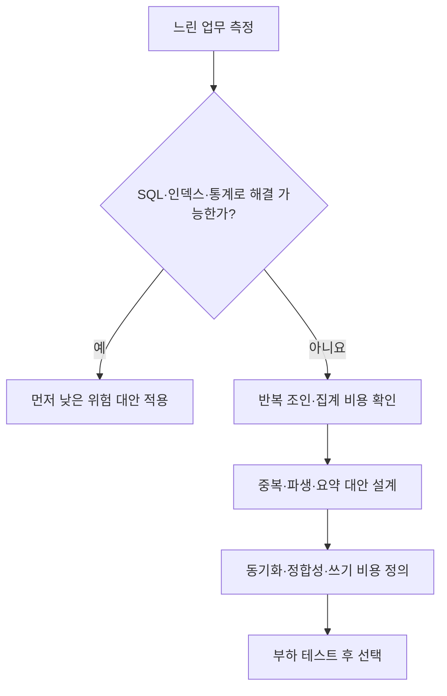
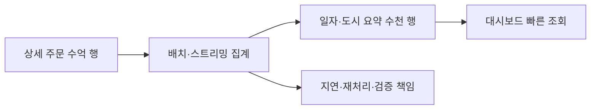

## 이번 편의 목표

- 반정규화의 목적과 선행 조건을 설명한다.
- 중복 열·파생 열·요약 테이블·테이블 통합의 효과와 위험을 구분한다.
- 원본과 중복 데이터의 동기화 방식을 비교한다.
- 반정규화 전후 읽기·쓰기 비용을 수치로 평가한다.

## 먼저 알아둘 말

| 용어 | 쉬운 뜻 |
| --- | --- |
| 반정규화(Denormalization) | 측정된 성능·가용성 목적을 위해 중복이나 요약 구조를 의도적으로 추가하는 설계 |
| 파생 값 | 다른 원본 값으로 계산할 수 있지만 조회 편의를 위해 저장한 값 |
| 요약 테이블 | 상세 행을 날짜·지역 등으로 미리 집계해 둔 테이블 |
| 동기화 | 원본이 바뀔 때 중복·요약 데이터도 일관되게 맞추는 작업 |
| 신선도(Freshness) | 요약·복제 데이터가 원본의 최신 상태를 얼마나 빨리 반영하는지 |
| 구체화 뷰(Materialized View) | 조회 결과를 실제로 저장하고 일정 방식으로 갱신하는 DB 객체 |

## 선수지식과 핵심 질문

선수지식은 [41. 정규화와 성능](./41_normalization-and-performance)이다.

핵심 질문은 **어떤 읽기 비용을 줄이려고 무엇을 중복하며, 원본 변경 시 누가 언제 그 값을 맞출 것인가**이다.

## 반정규화 결정 흐름



반정규화는 모델링 실수를 정당화하는 말이 아니다. 정규화된 기준 모델과 측정된 병목, 명확한 동기화 책임이 먼저 필요하다.

## 사례: 주문 목록의 회원명

정규화 구조에서는 주문 목록마다 members를 조인한다.

```sql
SELECT o.order_id, m.name, o.total_amount
FROM orders o
JOIN members m ON m.member_id = o.member_id;
```

주문에 `member_name_snapshot`을 중복 저장하면 조인을 피할 수 있다.

| 선택 | 장점 | 비용·의미 |
| --- | --- | --- |
| 매번 members 조인 | 현재 이름과 항상 일치 | 조인 필요 |
| 주문에 현재 이름 중복 | 단순 조회 | 이름 변경 시 모든 주문 동기화 필요 |
| 주문 당시 이름 스냅샷 | 과거 증빙 보존 | 현재 이름과 달라도 정상 |

“주문 당시 이름”이 법적 증빙이라면 단순 성능용 중복이 아니라 별도 시점 사실이다. “항상 현재 이름”을 중복한다면 동기화 대상이다.

## 반정규화 유형

### 중복 열 추가

orders에 `member_grade`를 넣어 회원 등급 조인을 줄인다.

- 읽기: 주문만 읽어 등급 표시 가능
- 쓰기: 회원 등급 변경 시 관련 주문을 갱신해야 할 수 있음
- 위험: 일부 주문만 이전 등급으로 남음

### 파생 열 저장

```text
order_items.line_amount = quantity × unit_price
orders.total_amount = 모든 line_amount의 합
```

매 조회마다 계산하지 않아도 되지만 수량·단가 변경 시 합계를 함께 갱신해야 한다. 같은 트랜잭션에서 원본과 파생값을 바꾸고 CHECK·검증 쿼리를 둔다.

### 요약 테이블

`daily_sales_summary(date, city, order_count, amount_sum)`를 만들어 대시보드가 수억 상세 주문 대신 날짜별 수천 행만 읽게 한다.



### 테이블 통합·분할

- 항상 1:1로 함께 읽는 두 테이블을 합치면 조인을 줄일 수 있다.
- 매우 큰 선택적 열을 별도 테이블로 수직 분할하면 자주 읽는 행 폭을 줄일 수 있다.
- 기간별·범위별 수평 분할은 다음 편의 파티셔닝과 연결된다.

테이블 통합이 무조건 반정규화는 아니며 원래 사실과 수명주기가 같다면 모델 자체를 바로잡는 것일 수 있다.

## 읽기와 쓰기 비용 계산

현재 상황:

- 주문 목록 조회: 하루 100만 회
- 회원 이름 변경: 하루 100회
- 회원당 평균 주문: 200건

이름 중복 시 하루 예상 추가 수정 행은 단순히 `100 × 200 = 2만 행`이다. 조회 조인 100만 회를 줄일 가능성과 2만 행 동기화·로그·잠금 비용을 함께 측정한다.

| 항목 | 정규화 | 이름 중복 |
| --- | --- | --- |
| 목록 조회 | 회원 조인 | 주문만 조회 가능 |
| 이름 변경 | 회원 1행 | 회원 1행 + 주문 평균 200행 |
| 불일치 가능성 | 낮음 | 동기화 실패 시 높음 |
| 저장공간 | 작음 | 주문마다 이름 반복 |

## 동기화 방식

| 방식 | 장점 | 주의점 |
| --- | --- | --- |
| 같은 애플리케이션 트랜잭션 | 업무 흐름 명확 | 다른 변경 경로 누락 가능 |
| DB 트리거 | DB에서 모든 경로 포착 | 숨은 동작·대량 변경 비용·디버깅 |
| 배치 갱신 | 쓰기 경로 단순 | 일정 시간 오래된 값 허용 |
| 이벤트·스트리밍 | 확장성과 비동기 처리 | 지연·중복 이벤트·재처리 설계 |
| 구체화 뷰 | DB가 저장·갱신 지원 | 지원 방식·갱신 비용·제약 확인 |

“언젠가 맞아진다”가 허용되는지, 결제 금액처럼 즉시 일치해야 하는지 업무 신선도 요구를 먼저 정한다.

## 검증 쿼리를 설계에 포함한다

중복 합계가 원본과 맞는지 주기적으로 찾는다.

```sql
SELECT o.order_id,
       o.total_amount AS stored_total,
       SUM(i.quantity * i.unit_price) AS calculated_total
FROM orders o
JOIN order_items i ON i.order_id = o.order_id
GROUP BY o.order_id, o.total_amount
HAVING o.total_amount <> SUM(i.quantity * i.unit_price);
```

결과가 0행이어야 정상이다. NULL·취소·할인·세금 규칙까지 실제 계산식에 반영한다.

## 반정규화하지 않아도 되는 대안

1. 누락된 인덱스와 잘못된 통계를 점검한다.
2. SELECT *와 불필요한 조인을 줄인다.
3. 캐시나 읽기 복제본을 검토한다.
4. 뷰로 SQL 복잡도만 숨길지, 구체화 뷰로 결과까지 저장할지 구분한다.
5. 요청 범위·페이지 크기를 줄인다.

일반 뷰는 쿼리 정의를 저장할 뿐 결과를 항상 물리 저장하는 것은 아니므로 그 자체가 조인 비용을 없앤다고 생각하면 안 된다.

## 시험·실무 연결

- 반정규화 대상과 목적을 명확히 연결하게 한다.
- 중복 열 추가가 조회를 줄이는 대신 수정과 일관성 비용을 늘림을 묻는다.
- 파생값과 원본을 같은 트랜잭션에서 맞춰야 하는 사례를 낸다.
- 일반 뷰와 구체화 뷰의 저장 여부를 구분한다.

## 짧은 확인

주문 총액을 orders에 저장했는데 주문상세 수량이 바뀌었다. 무엇을 함께 해야 할까?

<Collapse title="확인하기">

새 상세 기준으로 주문 총액을 다시 계산해 같은 트랜잭션에서 갱신하거나, 일관성을 보장하는 동기화 장치를 사용해야 한다. 그렇지 않으면 저장 총액과 상세 합계가 달라진다.

</Collapse>

## 흔한 실수와 진단법

| 실수 | 진단 질문 |
| --- | --- |
| 조인을 없애려 무조건 열 복사 | 원본 변경 시 누가 맞추는가? |
| 요약 지연을 장애로 오해 | 허용 신선도는 몇 분인가? |
| 뷰가 결과를 저장한다고 생각 | 일반 뷰인가 구체화 뷰인가? |
| 반정규화 후 읽기만 측정 | 쓰기·로그·잠금·불일치도 측정했나? |

## 다음 단계: 복습

[42-복습. 반정규화와 성능](./42_denormalization-and-performance-review)에서 읽기 절감과 동기화 비용을 비교하자.

## 정리

<Callout type="default">
  - 반정규화는 측정된 병목을 해결하기 위한 의도적 중복·요약 설계다.
  - 읽기 조인·집계를 줄이는 대신 쓰기·저장·동기화 비용이 생긴다.
  - 중복 값의 원본, 갱신 주체, 허용 지연과 검증 쿼리를 정의한다.
  - 인덱스·SQL·캐시 같은 더 낮은 위험 대안도 함께 비교한다.
</Callout>

다음 편에서는 행 수가 매우 커질 때 파티셔닝·배치·페이지 처리로 작업 범위를 줄이는 원리를 배운다.

## 참고 자료

- [PostgreSQL - Materialized Views](https://www.postgresql.org/docs/current/rules-materializedviews.html)
- [Oracle Database - Basic Materialized Views](https://docs.oracle.com/en/database/oracle/oracle-database/21/dwhsg/basic-materialized-views.html)
- [PostgreSQL - Trigger Definition](https://www.postgresql.org/docs/current/trigger-definition.html)
