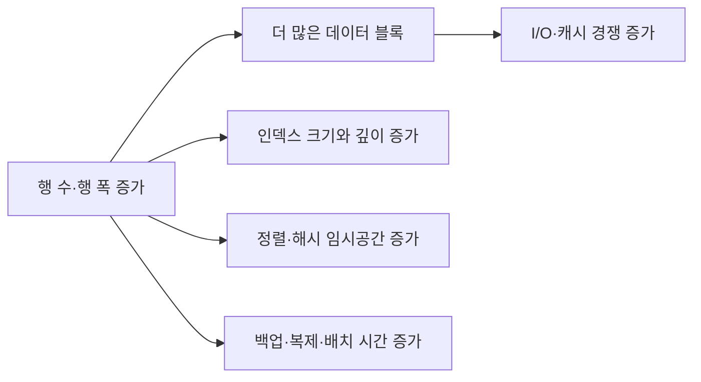
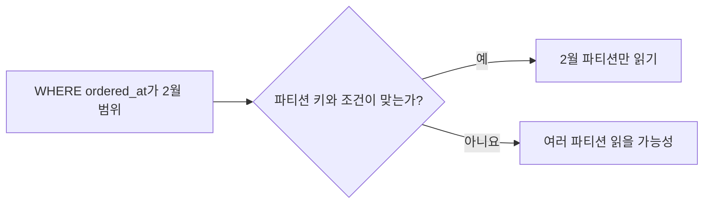

## 이번 편의 목표

- 데이터 양 증가가 I/O·인덱스·정렬·트랜잭션에 주는 영향을 설명한다.
- 파티셔닝과 파티션 프루닝의 차이를 이해한다.
- 대량 DML을 작은 배치로 나눌 때의 장단점을 판단한다.
- 보관 정책·통계·데이터 쏠림을 성능 설계에 연결한다.

## 먼저 알아둘 말

| 용어 | 쉬운 뜻 |
| --- | --- |
| 파티셔닝(Partitioning) | 큰 논리 테이블을 날짜·범위 등의 물리 구역으로 나누는 기능 |
| 파티션 프루닝 | 조건과 무관한 파티션을 읽기 대상에서 제외하는 최적화 |
| 데이터 쏠림(Skew) | 특정 값에 행이 지나치게 몰린 분포 |
| 배치(Batch) | 많은 행을 일정 크기 묶음으로 나누어 처리하는 방식 |
| 보관(Archive) | 자주 쓰지 않는 오래된 데이터를 별도 영역으로 옮기는 정책 |
| 통계 정보 | 값 분포·행 수 등을 옵티마이저가 추정에 사용하는 정보 |

## 선수지식과 핵심 질문

선수지식은 [40. 데이터 모델과 성능](./40_data-model-and-performance)과 [42. 반정규화와 성능](./42_denormalization-and-performance)이다.

핵심 질문은 **전체 데이터가 커져도 한 업무가 실제로 읽고 잠그고 정렬하는 범위를 어떻게 제한하는가**이다.

## 데이터 증가가 바꾸는 것



SQL 문장이 그대로여도 1만 행에서 10억 행으로 늘면 같은 전체 스캔·정렬의 비용은 달라진다. 데이터 성장률을 모델과 운영 설계에 포함한다.

## 먼저 업무 범위를 줄인다

주문 10억 행에서 사용자가 최근 30일만 본다면 날짜 조건이 반드시 있어야 한다.

```sql
SELECT order_id, member_id, total_amount
FROM orders
WHERE ordered_at >= CURRENT_DATE - INTERVAL '30 days'
ORDER BY ordered_at DESC;
```

필요한 열, 기간, 회원, 페이지 크기를 줄이는 것이 인덱스 추가보다 먼저인 경우가 많다.

<Callout type="info">
  대용량에서 가장 빠른 행은 읽지 않아도 되는 행이다. 업무 요구로 검색 범위를 명확히 제한한다.
</Callout>

## 범위 파티셔닝

연도·월별 주문을 물리 파티션으로 나눈다고 하자.

```text
orders 논리 테이블
├─ orders_2026_01
├─ orders_2026_02
├─ orders_2026_03
└─ ...
```

2026년 2월 조건이 파티션 키와 맞으면 DBMS는 1월·3월 파티션을 제외하고 2월만 읽을 수 있다. 이것이 파티션 프루닝이다.



### 파티션 종류

| 방식 | 나누는 기준 | 예시 |
| --- | --- | --- |
| Range | 값의 연속 범위 | 월별 주문 |
| List | 지정 값 목록 | 지역 코드 |
| Hash | 해시 결과 | 회원을 균등 분산 |
| Composite | 두 방식 조합 | 월별 범위 + 회원 해시 |

지원 문법과 제약은 DBMS별로 다르다.

## 파티셔닝이 자동 해결책은 아니다

- 파티션 키와 무관한 조건은 여러 파티션을 읽을 수 있다.
- 파티션이 지나치게 많으면 메타데이터·계획·운영 복잡도가 커진다.
- 각 파티션 안의 인덱스와 통계도 관리해야 한다.
- 고유 제약과 외래키 지원 방식이 제품마다 다르다.

파티셔닝은 전체 행 수를 없애지 않고 업무별 읽기·관리 범위를 나눈다.

## 조건에 함수를 쓰면 프루닝이 어려울 수 있다

```sql
-- 표현이 파티션 키 원형을 감쌈
WHERE TO_CHAR(ordered_at, 'YYYY-MM') = '2026-02'
```

다음 범위 조건은 의미가 명확하고 인덱스·파티션 경계 활용에 유리한 경우가 많다.

```sql
WHERE ordered_at >= DATE '2026-02-01'
  AND ordered_at <  DATE '2026-03-01'
```

옵티마이저가 어떤 표현을 변환하는지는 제품과 버전에 따라 실행계획으로 확인한다.

## 대량 UPDATE·DELETE를 배치로 나누기

1억 행을 한 트랜잭션으로 수정하면 큰 로그·긴 잠금·복구 공간·실패 재시작 비용이 생길 수 있다.

```text
전체 1억 행
  ↓ 기본키 범위 또는 작업 큐
10만 행 × 1000배치
  ↓ 배치별 검증·COMMIT
중단 지점부터 재시작 가능
```

### 얻는 것

- 트랜잭션과 잠금 유지 시간을 줄일 수 있다.
- 실패 시 전체를 처음부터 다시 하지 않을 수 있다.
- 진행률과 처리량을 관찰하기 쉽다.

### 잃는 것

- 전체가 하나의 원자적 트랜잭션이 아니게 된다.
- 중간 상태를 애플리케이션이 볼 수 있다.
- 중복 실행에도 안전한 멱등성·재시작 키가 필요하다.

## 페이지네이션

큰 OFFSET은 앞 행을 많이 건너뛰어야 할 수 있다.

```sql
ORDER BY ordered_at DESC, order_id DESC
OFFSET 1000000 ROWS FETCH NEXT 20 ROWS ONLY;
```

마지막으로 본 `(ordered_at, order_id)`보다 뒤인 행을 조건으로 찾는 키셋 페이지네이션은 깊은 페이지의 건너뛰기 비용을 줄일 수 있다.

```sql
WHERE (ordered_at, order_id) < (:last_date, :last_id)
ORDER BY ordered_at DESC, order_id DESC
FETCH FIRST 20 ROWS ONLY;
```

튜플 비교 문법 지원은 DBMS별로 다르며 동점까지 포함한 결정적 정렬 키가 필요하다.

## 데이터 쏠림과 통계

status 분포가 `PAID 95%, CANCELED 4%, ERROR 1%`라면 모든 값에 같은 평균 행 수를 가정하면 ERROR 조건의 예상 행이 크게 틀릴 수 있다.

| status | 행 수 | 비율 |
| --- | ---: | ---: |
| PAID | 950만 | 95% |
| CANCELED | 40만 | 4% |
| ERROR | 10만 | 1% |

히스토그램 같은 분포 통계가 옵티마이저의 추정을 돕는다. 대량 적재 후 통계가 오래되면 실행계획이 실제 분포를 반영하지 못할 수 있다.

## 행 폭과 큰 값

본문·이미지·JSON 같은 큰 열이 자주 조회하지 않는 목록 행에 포함되면 블록당 저장 행 수가 줄고 I/O가 늘 수 있다. 필요한 열만 SELECT하고, 수명주기와 접근 패턴이 다르면 별도 테이블·외부 객체 저장소를 검토한다. 무조건 분리하지 말고 실제 DB 저장 방식과 조회를 측정한다.

## 보관과 삭제 정책

오래된 데이터를 무조건 운영 테이블에 두면 인덱스·백업·통계 관리 범위가 커진다.

1. 법적 보존 기간과 조회 빈도를 정의한다.
2. 온라인·저빈도·삭제 가능 구간을 나눈다.
3. 파티션 이동·압축·별도 저장소를 검토한다.
4. 복원 시간과 검색 방법을 테스트한다.

파티션 단위 삭제는 대량 행 DELETE보다 빠를 수 있지만 제품의 DDL·잠금·복제 영향을 확인한다.

## 시험·실무 연결

- 파티션 키 조건이 있어야 프루닝이 가능하다는 점을 묻는다.
- 대량 배치의 짧은 트랜잭션과 전체 원자성 사이 trade-off를 판단한다.
- 데이터 쏠림이 평균값 기반 카디널리티 추정을 깨뜨리는 사례를 낸다.
- 깊은 OFFSET과 결정적 정렬 키의 문제를 연결한다.

## 짧은 확인

월별 파티션 테이블에서 ordered_at 전체에 함수를 적용한 조건이 느리다. 첫 점검은?

<Collapse title="확인하기">

파티션 키 원형의 범위 조건으로 표현할 수 있는지와 실제 실행계획에서 파티션 프루닝이 일어나는지 확인한다. 함수가 항상 프루닝을 막는다고 단정하지는 말고 제품의 계획을 본다.

</Collapse>

## 흔한 실수와 진단법

| 실수 | 진단법 |
| --- | --- |
| 파티션이면 모든 조회가 빨라짐 | 실제 읽은 파티션 수 확인 |
| 대량 DML을 무조건 한 번에 | 로그·잠금·재시작 요구 평가 |
| 깊은 페이지에 OFFSET만 사용 | 건너뛴 행 수와 키셋 대안 측정 |
| 데이터 분포를 균등으로 가정 | 값별 빈도와 통계 최신성 확인 |

## 다음 단계: 복습

[43-복습. 대용량 데이터에 따른 성능](./43_large-data-performance-review)에서 파티션·배치·선택 범위를 계산하자.

## 정리

<Callout type="default">
  - 대용량 성능의 핵심은 한 업무가 읽고 쓰는 범위를 줄이는 것이다.
  - 파티션 프루닝은 파티션 키와 조건이 연결될 때 효과가 난다.
  - 대량 DML 배치는 운영 부담을 줄이지만 전체 원자성과 재시작 설계가 필요하다.
  - 최신 통계와 실제 값 분포로 카디널리티 추정을 돕는다.
</Callout>

다음 편에서는 키 순서·슈퍼타입 모델·외래키와 물리 구조가 접근 경로에 주는 영향을 살펴본다.

## 참고 자료

- [PostgreSQL - Table Partitioning](https://www.postgresql.org/docs/current/ddl-partitioning.html)
- [PostgreSQL - Planner Statistics](https://www.postgresql.org/docs/current/planner-stats.html)
- [Oracle Database - Partitioning Concepts](https://docs.oracle.com/en/database/oracle/oracle-database/21/vldbg/partition-concepts.html)
