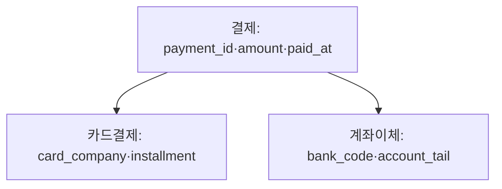

## 이번 편의 목표

- 슈퍼타입·서브타입 논리 모델을 세 가지 테이블 구조로 변환해 비교한다.
- 업무 조회 단위에 따라 통합·분리 구조의 장단점을 판단한다.
- 복합키 열 순서와 조건 형태의 관계를 설명한다.
- 외래키 열의 타입·인덱스·참조 작업을 성능과 연결한다.

## 먼저 알아둘 말

| 용어 | 쉬운 뜻 |
| --- | --- |
| 슈퍼타입 | 여러 하위 유형이 공통으로 갖는 속성을 모은 상위 유형 |
| 서브타입 | 상위 공통 속성을 물려받고 자신만의 속성을 갖는 하위 유형 |
| 복합키 | 두 개 이상 열을 조합해 행을 식별하는 키 |
| 선두 열 | 복합 인덱스·키에서 가장 앞에 정의된 열 |
| 클러스터링 | 비슷한 키 값의 행이 물리적으로 가까이 모인 정도 |
| 참조 작업 | 부모 삭제·변경 시 자식 행 존재를 확인하는 작업 |

## 선수지식과 핵심 질문

선수지식은 [4. 데이터 모델의 이해](./04_data-model-overview), [8. 식별자](./08_identifier), [21. 조인](./21_joins)이다.

핵심 질문은 **논리적으로 같은 업무 모델도 실제 조회·변경 단위에 따라 어떤 테이블 구조가 유리한가**이다.

## 슈퍼타입·서브타입 예시

결제에는 공통 결제번호·금액·일시가 있고 카드와 계좌이체에 서로 다른 속성이 있다.



논리 모델을 테이블로 옮기는 방식은 하나뿐이 아니다.

## 방식 1: 단일 테이블 통합

`payments`

| payment_id | type | amount | card_company | installment | bank_code | account_tail |
| --- | --- | ---: | --- | ---: | --- | --- |
| P1 | CARD | 50000 | ZENO | 3 | NULL | NULL |
| P2 | BANK | 80000 | NULL | NULL | K01 | 1234 |

### 장점

- 모든 결제를 한 테이블에서 조회한다.
- 하위 유형을 합친 보고서에 UNION·조인이 적다.

### 비용

- 유형별 미사용 열이 NULL이다.
- “CARD면 card_company 필수” 같은 조건부 제약이 복잡하다.
- 서브타입마다 열이 많으면 행이 넓어진다.

## 방식 2: 슈퍼타입과 서브타입 분리

```text
payments(payment_id, type, amount, paid_at)
card_payments(payment_id PK/FK, card_company, installment)
bank_payments(payment_id PK/FK, bank_code, account_tail)
```

카드 결제 한 건 조회:

```sql
SELECT p.payment_id, p.amount, c.card_company, c.installment
FROM payments p
JOIN card_payments c ON c.payment_id = p.payment_id
WHERE p.payment_id = 'P1';
```

### 장점

- 공통 속성과 유형별 속성이 명확하다.
- 유형별 NOT NULL·CHECK를 자연스럽게 적용한다.

### 비용

- 완전한 한 건을 볼 때 상위·하위 조인이 필요하다.
- 상위 type과 실제 하위 행의 일치를 별도로 보장해야 한다.

## 방식 3: 서브타입별 독립 테이블

```text
card_payments(payment_id, amount, paid_at, card_company, installment)
bank_payments(payment_id, amount, paid_at, bank_code, account_tail)
```

유형별 업무가 완전히 분리되면 단순하지만 전체 결제 보고서는 UNION ALL이 필요하고 공통 속성 정의가 반복된다.

## 업무 패턴으로 비교하기

| 주 사용 패턴 | 먼저 검토할 구조 |
| --- | --- |
| 전체 유형을 항상 함께 조회 | 단일 통합 테이블 |
| 공통 조회와 유형별 상세 모두 많음 | 슈퍼+서브 분리 |
| 유형별 프로세스·수명주기가 완전히 독립 | 독립 서브 테이블 |

절대적인 정답은 없다. 행 수, 유형별 열 수, NULL 비율, 조회·입력 비율과 제약조건을 측정한다.

<Callout type="info">
  논리 모델의 상속 관계를 물리 테이블로 바꿀 때는 “항상 같이 처리하는가, 유형별로 처리하는가”가 핵심 질문이다.
</Callout>

## 복합키 순서와 조회 조건

주문상세 기본키가 `(order_id, product_id)`이고 같은 순서의 인덱스가 있다고 하자.

| 조건 | 인덱스 선두 열 사용 | 설명 |
| --- | --- | --- |
| `order_id = 1001` | 예 | 한 주문의 상세 조회 |
| `order_id = 1001 AND product_id = 'P10'` | 예 | 상세 한 건 조회 |
| `product_id = 'P10'` | 아니거나 제한적 | 선두 order_id 조건 없음 |

상품별 주문상세 조회가 매우 빈번하면 `(product_id, order_id)` 별도 인덱스를 검토한다. 기본키 열 순서를 무조건 바꾸면 주문별 상세 조회와 외래키·고유성 의미에 영향을 줄 수 있다.


## 열 순서 규칙을 과도하게 외우지 않기

복합 인덱스의 선두 열 원칙은 중요하지만 DBMS는 스킵 스캔, 비트맵, 인덱스 결합 등 다른 접근을 선택할 수 있다. 또한 equality 조건 뒤 range 조건, 정렬 요구, 포함 열, 데이터 분포가 함께 작용한다.

시험에서는 보통 선두 열 조건 유무를 기본 원리로 판단하고, 실무에서는 실제 계획을 확인한다.

## 외래키와 성능

`orders.member_id` 외래키는 다음 작업에 사용된다.

- 특정 회원의 주문 조회
- 회원 삭제·키 변경 시 참조 자식 존재 검사
- 회원과 주문 조인

외래키 자체가 모든 DBMS에서 자동으로 인덱스를 만든다고 가정하면 안 된다. 자식 열 인덱스는 조회와 부모 변경·삭제의 잠금·검사에 도움을 줄 수 있지만, 각 주문 입력마다 인덱스도 갱신해야 한다.

| 상황 | FK 인덱스 후보 가치 |
| --- | --- |
| 부모별 자식 조회가 잦음 | 높음 |
| 부모 삭제·키 변경이 있음 | 높을 수 있음 |
| 자식이 작고 부모 변경 없음 | 측정 필요 |
| 쓰기량이 매우 큼 | 인덱스 유지 비용 비교 |

## 연결 열 타입을 맞춘다

부모 `members.member_id`는 VARCHAR(10), 자식 `orders.member_id`는 숫자나 길이가 다른 타입이면 암시적 변환·비교 오류·제약 생성 문제가 생긴다. 의미가 같은 키는 타입·길이·문자 규칙을 일관되게 설계한다.

```sql
-- 타입이 맞는 연결
members.member_id VARCHAR(10)
orders.member_id  VARCHAR(10)
```

## 물리적 행 배치와 클러스터링

같은 member_id의 주문이 물리적으로 가까이 있으면 회원별 범위 조회가 적은 블록을 읽을 수 있다. 흩어져 있으면 인덱스로 많은 행 위치를 찾더라도 여러 블록을 방문한다. 옵티마이저의 클러스터링 관련 통계는 인덱스 비용 판단에 영향을 준다.

물리 배치는 INSERT 패턴·재구성·DBMS 저장 방식에 따라 변하므로 한 번 정렬 적재했다고 영구 보장되지 않는다.

## 구조 변경 전 검증

1. 주 업무 SQL과 결과 grain을 수집한다.
2. 슈퍼·서브 유형별 행 수와 NULL 비율을 측정한다.
3. 현재·후보 구조의 SQL과 실행계획을 비교한다.
4. 데이터 이관·제약·롤백 계획을 만든다.
5. 읽기뿐 아니라 쓰기와 운영 복잡도를 부하 테스트한다.

## 시험·실무 연결

- 슈퍼·서브타입 변환 세 방식과 업무 패턴을 연결하게 한다.
- 복합키 선두 열이 빠진 조건의 접근 한계를 묻는다.
- 외래키 인덱스가 자동 생성된다고 단정하는 선지를 구분한다.
- 연결 키 타입 불일치가 변환과 계획에 미치는 영향을 판단한다.

## 짧은 확인

인덱스가 `(city, joined_at)` 순서다. `WHERE joined_at >= ...`만 있는 조회가 선두 열을 충분히 활용할까?

<Collapse title="확인하기">

기본 원리상 선두 city 조건이 없어 연속된 한 범위를 바로 찾기 어렵다. joined_at 조회가 핵심이면 그 열이 선두인 인덱스를 후보로 삼되 실제 분포·계획·쓰기 비용을 측정한다.

</Collapse>

## 흔한 실수와 진단법

| 실수 | 진단법 |
| --- | --- |
| 슈퍼·서브는 무조건 한 구조 | 전체·유형별 업무 비율 확인 |
| 복합키에 열만 있으면 순서 무관 | 선두 조건과 범위 확인 |
| FK가 자동 인덱스라고 가정 | 실제 객체 목록 조회 |
| 논리키 타입이 서로 다름 | 부모·자식 타입·길이 비교 |

## 다음 단계: 복습

[44-복습. DB 구조와 성능](./44_database-structure-and-performance-review)에서 구조별 SQL과 복합키 접근을 판단하자.

## 정리

<Callout type="default">
  - 슈퍼·서브타입은 통합·상하 분리·독립 구조로 변환할 수 있다.
  - 업무 처리 단위와 유형별 속성·행 수로 구조를 선택한다.
  - 복합키·인덱스 열 순서는 자주 쓰는 조건과 정렬에 맞춰 검토한다.
  - 외래키 타입과 인덱스는 조인·부모 변경·쓰기 비용을 함께 평가한다.
</Callout>

다음 편에서는 데이터가 여러 노드·지역에 나뉠 때 얻는 가용성과 새로 생기는 일관성 비용을 다룬다.

## 참고 자료

- [PostgreSQL - Multicolumn Indexes](https://www.postgresql.org/docs/current/indexes-multicolumn.html)
- [PostgreSQL - Foreign Keys](https://www.postgresql.org/docs/current/ddl-constraints.html#DDL-CONSTRAINTS-FK)
- [Oracle Database - Optimizer Access Paths](https://docs.oracle.com/en/database/oracle/oracle-database/21/tgsql/optimizer-access-paths.html)
