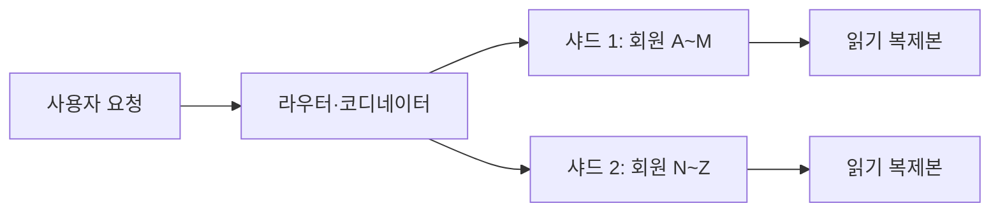
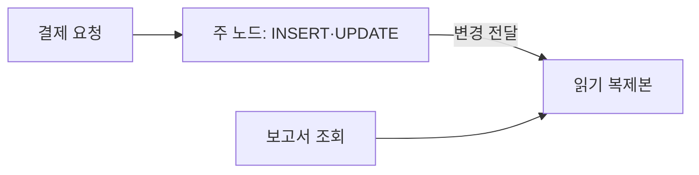

## 이번 편의 목표

- 복제와 분할(샤딩)의 목적을 구분한다.
- 네트워크 왕복과 데이터 지역성이 분산 쿼리 성능에 미치는 영향을 설명한다.
- 동기·비동기 복제의 일관성·지연 trade-off를 판단한다.
- 재시도·중복 처리·분산 트랜잭션의 설계 책임을 이해한다.

## 먼저 알아둘 말

| 용어 | 쉬운 뜻 |
| --- | --- |
| 분산 데이터베이스 | 데이터와 처리를 여러 노드·지역에 나누어 운영하는 시스템 |
| 복제(Replication) | 같은 데이터를 둘 이상의 노드에 사본으로 유지하는 방식 |
| 분할·샤딩(Sharding) | 서로 다른 데이터 행을 여러 노드에 나누어 저장하는 방식 |
| 데이터 지역성(Locality) | 데이터를 사용하는 사용자·서비스와 가까운 곳에 두는 성질 |
| 복제 지연(Replication Lag) | 원본 변경이 사본에 반영되기까지의 시간 차이 |
| 분산 트랜잭션 | 여러 노드의 데이터를 하나의 원자적 작업으로 묶는 트랜잭션 |
| 최종 일관성 | 즉시는 달라도 시간이 지나면 사본들이 같은 상태로 수렴하는 모델 |

## 선수지식과 핵심 질문

선수지식은 [35. TCL](./35_tcl), [43. 대용량 데이터에 따른 성능](./43_large-data-performance)이다.

핵심 질문은 **한 노드의 한계를 넘기 위해 데이터를 나누거나 복사할 때 네트워크·일관성·장애 처리 비용을 어떻게 감수할 것인가**이다.

## 한 노드에서 여러 노드로



분산은 CPU·저장공간·가용성을 확장할 수 있지만, 로컬 메모리 호출이던 작업 일부가 네트워크 요청과 합의로 바뀐다.

## 복제와 분할 비교

| 구분 | 무엇을 여러 곳에 두나 | 주요 목적 | 대표 비용 |
| --- | --- | --- | --- |
| 복제 | 같은 데이터 사본 | 읽기 확장·장애 대비 | 지연·동기화·일관성 |
| 분할 | 서로 다른 데이터 조각 | 저장·쓰기 부하 분산 | 샤드 키·재분배·교차 샤드 조회 |

한 시스템이 월별 파티션, 회원별 샤딩, 노드별 복제를 동시에 사용할 수도 있다. 용어의 층위를 구분한다.

## 읽기 복제본

주 노드에서 쓰고 복제본에서 보고서를 읽으면 주 노드의 읽기 부하를 줄일 수 있다.



비동기 복제라면 방금 결제한 주문이 복제본 보고서에 몇 초 뒤 나타날 수 있다. “쓰기 직후 자신의 값을 반드시 읽어야 하는가”라는 읽기 일관성 요구에 따라 주 노드 조회 또는 세션 고정 등을 설계한다.

## 동기와 비동기 복제

| 방식 | 쓰기 완료 시점 | 장점 | 비용 |
| --- | --- | --- | --- |
| 동기 복제 | 필요한 복제 확인까지 기다림 | 데이터 손실 위험 감소·강한 일관성 | 네트워크 지연이 쓰기 응답에 포함 |
| 비동기 복제 | 주 노드 반영 후 먼저 응답 가능 | 낮은 쓰기 지연 | 복제 지연·장애 시 최신 변경 손실 가능 |

실제 시스템은 다수결 합의, 지역별 정책, 동기 복제본 수 등 더 다양한 설정을 제공한다.

## 샤드 키가 경로를 결정한다

회원 번호로 샤딩했다고 하자.

| 쿼리 | 라우팅 |
| --- | --- |
| `WHERE member_id = 'M01'` | 한 샤드로 직접 이동 가능 |
| `WHERE city = '서울'` | 여러 샤드에 흩어져 전체 요청 가능 |
| 전체 매출 SUM | 각 샤드 부분합 후 합치기 |

좋은 샤드 키는 부하를 고르게 나누면서 주요 쿼리를 한 샤드 안에서 처리하게 돕는다.

<Callout type="warning">
  단순히 값 종류가 많다고 좋은 샤드 키는 아니다. 특정 대형 고객에 쓰기가 몰리면 키 종류가 많아도 한 샤드가 뜨거워질 수 있다.
</Callout>

## 데이터 지역성

한국 사용자의 주문과 주문상세가 같은 한국 지역·샤드에 있으면 대부분의 트랜잭션을 가까운 노드에서 처리할 수 있다. 주문은 한국, 상세는 무작위 다른 지역에 흩어지면 한 주문 INSERT가 여러 지역 왕복을 요구한다.

```text
같은 지역: 앱 → 주문 → 상세              짧은 왕복
교차 지역: 앱 → 주문(서울) ↔ 상세(미국)   긴 네트워크 지연
```

관련 데이터의 배치 키를 맞추는 코로케이션(Co-location)을 검토하되, 전체 부하 쏠림과 장애 도메인도 함께 본다.

## 교차 샤드 조인과 집계

여러 샤드의 결과를 코디네이터가 모을 때 다음 비용이 생긴다.

1. 각 샤드에 요청을 전송한다.
2. 가장 느린 샤드 응답을 기다린다.
3. 중간 결과를 네트워크로 이동한다.
4. 전체 정렬·집계·조인을 합친다.

부분 집계를 각 샤드에서 먼저 수행해 이동 행을 줄일 수 있다.

```text
나쁜 흐름: 각 샤드 상세 1억 행 → 중앙 전송 → SUM
개선 흐름: 각 샤드 SUM 1행 → 중앙 전송 → 최종 SUM
```

## 분산 트랜잭션

A 샤드 계좌에서 차감하고 B 샤드 계좌에 입금하는 송금은 두 노드에 걸친 원자성이 필요하다. 합의·2단계 커밋 같은 프로토콜은 정확성을 높이지만 네트워크 왕복과 장애 복구 복잡도를 늘린다.

업무에 따라 예약 상태·이벤트·보상 트랜잭션을 사용하는 사가(Saga) 패턴을 검토할 수 있지만, 중간 상태와 실패 보상 규칙을 명확히 설계해야 한다.

## 재시도와 멱등성

클라이언트가 응답을 못 받았다고 서버 작업이 실패한 것은 아니다.

```text
클라이언트 INSERT 전송
  → 서버 COMMIT 성공
  → 응답 네트워크 유실
  → 클라이언트 재시도
```

고유한 요청 ID와 UNIQUE 제약으로 같은 주문이 두 번 생기지 않게 한다.

```sql
INSERT INTO orders (request_id, ...)
VALUES (:request_id, ...);
-- request_id UNIQUE
```

## 장애와 CAP를 과도하게 단순화하지 않기

네트워크 분할 상황에서는 모든 노드가 즉시 같은 값을 보이게 하면서 모든 요청에 항상 성공 응답하기 어렵다는 trade-off가 있다. 하지만 실제 시스템은 쿼럼, 타임아웃, 일관성 수준, 지역 정책 등 연속적인 선택을 제공한다.

“분산 DB는 무조건 최종 일관성” 또는 “CAP의 셋 중 항상 두 개만 선택” 같은 한 문장 암기보다 장애 상황에서 어떤 읽기·쓰기를 허용하는지 제품 보장을 확인한다.

## 운영 관찰 지표

- 노드·샤드별 QPS와 저장량 쏠림
- 복제 지연과 로그 적체
- 교차 지역 왕복시간
- 교차 샤드 쿼리의 전송 행 수
- 재시도·충돌·타임아웃 비율
- 리밸런싱 진행률과 영향

## 시험·실무 연결

- 복제와 분할의 목적을 바꿔 낸 선지를 구분한다.
- 샤드 키가 없는 조회가 여러 노드를 방문할 수 있음을 묻는다.
- 비동기 복제본의 오래된 읽기를 판단한다.
- 네트워크 재시도에 멱등성 키가 필요한 이유를 묻는다.

## 짧은 확인

회원번호로 샤딩된 DB에서 전체 도시별 매출을 조회하면 한 샤드만 보면 될까?

<Collapse title="확인하기">

일반적으로 여러 회원 샤드에 각 도시 주문이 흩어져 있으므로 각 샤드의 부분 집계를 모아야 한다. 도시가 샤드 키와 함께 배치된 특별한 구조라면 다를 수 있다.

</Collapse>

## 흔한 실수와 진단법

| 실수 | 진단법 |
| --- | --- |
| 복제본은 항상 최신이라고 가정 | replication lag 측정 |
| 샤드 키 종류만 많으면 균등 | 실제 키별 트래픽 분포 확인 |
| 타임아웃이면 실패로 단정 | 서버 커밋 여부·요청 ID 조회 |
| 분산으로 무조건 빨라짐 | 교차 노드 왕복·전송량 측정 |

## 다음 단계: 복습

[45-복습. 분산 DB에 따른 성능](./45_distributed-database-performance-review)에서 복제 지연과 샤드 라우팅을 판단하자.

## 정리

<Callout type="default">
  - 복제는 같은 데이터 사본, 샤딩은 서로 다른 데이터 조각을 여러 노드에 둔다.
  - 샤드 키와 데이터 지역성이 네트워크 범위와 부하 균형을 좌우한다.
  - 동기·비동기 복제는 쓰기 지연과 최신성 사이의 선택이다.
  - 분산 재시도와 트랜잭션에는 멱등성·보상·관찰 설계가 필요하다.
</Callout>

다음 편에서는 옵티마이저가 통계와 비용을 이용해 실행계획을 선택하는 과정을 읽는다.

## 참고 자료

- [Google Cloud Spanner - Replication](https://cloud.google.com/spanner/docs/replication)
- [PostgreSQL - Logical Replication](https://www.postgresql.org/docs/current/logical-replication.html)
- [Google Cloud Spanner - Schema Design Best Practices](https://cloud.google.com/spanner/docs/schema-design)
