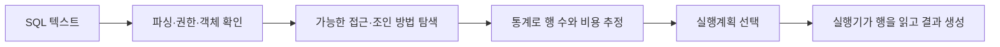
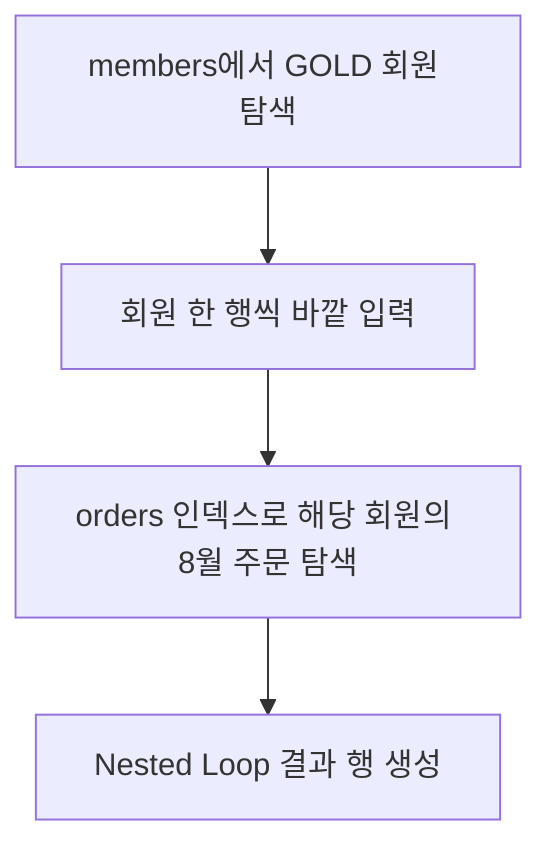

## 이번 편의 목표

- SQL 결과의 의미와 물리 실행 방법을 구분한다.
- 비용 기반 옵티마이저의 입력과 선택 과정을 설명한다.
- 실행계획을 자식 노드부터 읽고 예상·실제 행 차이를 찾는다.
- 계획이 바뀌는 원인을 통계·파라미터·데이터 분포와 연결한다.

## 먼저 알아둘 말

| 용어 | 쉬운 뜻 |
| --- | --- |
| 옵티마이저(Optimizer) | 같은 SQL 결과를 만들 여러 방법 중 비용이 낮다고 추정한 실행 방법을 고르는 DBMS 구성요소 |
| 실행계획(Execution Plan) | 테이블 읽기·필터·조인·정렬 작업의 선택된 트리 |
| 비용(Cost) | CPU·I/O 등의 상대적 작업량을 DBMS 모델로 추정한 값 |
| 추정 행 수 | 통계로 예상한 각 단계 출력 행 수 |
| 실제 행 수 | 쿼리를 실행해 실제로 나온 각 단계 행 수 |
| 통계 정보 | 테이블 행 수·서로 다른 값·분포 등을 요약한 정보 |
| Predicate | 행을 연결하거나 거르는 조건식 |

## 선수지식과 핵심 질문

선수지식은 [40. 데이터 모델과 성능](./40_data-model-and-performance), [21. 조인](./21_joins)이다.

핵심 질문은 **DBMS는 어떤 행부터 얼마나 읽고 어떤 순서로 연결할지 무엇을 근거로 선택하는가**이다.

## SQL에서 실행까지



SQL은 “무엇을 원하는가”를 선언하고, 옵티마이저는 “어떻게 만들 것인가”를 선택한다. 같은 결과 SQL도 인덱스·통계·데이터량에 따라 다른 계획을 가질 수 있다.

## 규칙 기반과 비용 기반

과거의 규칙 기반 옵티마이저(RBO)는 미리 정한 우선순위 규칙을 중심으로 선택했다. 현대 DBMS는 주로 비용 기반 옵티마이저(CBO)를 사용해 여러 후보의 예상 비용을 비교한다.

| 입력 | 옵티마이저가 추정하는 내용 |
| --- | --- |
| 테이블 행 수 | 전체 스캔 규모 |
| 열의 서로 다른 값 수 | equality 조건 선택도 |
| 히스토그램 | 값 쏠림 |
| 인덱스 구조·클러스터링 | 인덱스 후 테이블 방문 비용 |
| 메모리·CPU·I/O 설정 | 정렬·해시·읽기 상대 비용 |

비용 숫자는 실제 밀리초가 아니라 후보끼리 비교하기 위한 내부 단위인 경우가 많다.

## 예제 쿼리

```sql
SELECT m.name, o.order_id, o.total_amount
FROM members m
JOIN orders o ON o.member_id = m.member_id
WHERE m.grade = 'GOLD'
  AND o.ordered_at >= DATE '2026-08-01';
```

가능한 계획 후보:

1. GOLD 회원을 먼저 찾고 회원별 최근 주문을 인덱스로 찾는다.
2. 8월 주문을 먼저 찾고 각 회원을 기본키로 찾는다.
3. 양쪽을 넓게 스캔해 해시 조인한다.

GOLD 회원 수, 8월 주문 비율, 인덱스와 데이터 배치에 따라 유리한 후보가 달라진다.

## 실행계획 트리 읽기

PostgreSQL의 단순화한 예:

```text
Nested Loop
  -> Index Scan on members using idx_members_grade
       Index Cond: grade = 'GOLD'
  -> Index Scan on orders using idx_orders_member_date
       Index Cond: member_id = members.member_id
                   AND ordered_at >= '2026-08-01'
```

들여쓰기된 자식부터 읽는다.



안쪽 orders 탐색은 바깥 회원 행 수만큼 반복될 수 있다. 실행계획의 `loops`를 곱해 총 처리량을 판단한다.

## EXPLAIN과 실제 실행

### EXPLAIN

```sql
EXPLAIN
SELECT ...;
```

쿼리를 실제로 끝까지 수행하지 않고 추정 계획을 보여 주는 용도다.

### EXPLAIN ANALYZE

```sql
EXPLAIN (ANALYZE, BUFFERS)
SELECT ...;
```

실제로 실행해 실제 시간·행 수·반복·버퍼 읽기 등을 보여 준다.

<Callout type="error">
  EXPLAIN ANALYZE를 UPDATE·DELETE에 사용하면 실제 데이터가 변경될 수 있다. 안전한 테스트 환경과 트랜잭션·롤백 계획 없이 운영에서 실행하지 않는다.
</Callout>

Oracle은 `EXPLAIN PLAN`, `DBMS_XPLAN`, 실제 커서 통계 등 도구와 읽는 열이 다르다. 제품별 공식 도구를 사용한다.

## 예상 행과 실제 행 비교

```text
Index Scan on orders
  estimated rows=100
  actual rows=100000
```

100배가 아니라 1000배 차이다. 이 오차는 이후 조인 방법과 메모리 예상까지 잘못 선택하게 할 수 있다.

### 가능한 원인

- 통계가 오래됨
- 값이 한쪽에 몰렸지만 히스토그램 없음
- 서로 연관된 두 열을 독립적으로 추정
- 함수·표현식의 분포 정보 부족
- 파라미터 값마다 선택도가 크게 다름

첫 대응은 “힌트로 강제”보다 통계와 조건·데이터 분포를 확인하는 것이다.

## 주요 접근 노드

| 노드 | 쉬운 의미 | 언제 후보인가 |
| --- | --- | --- |
| Sequential/Full Scan | 테이블 전체 블록 읽기 | 많은 행 필요·작은 테이블 |
| Index Scan | 인덱스로 위치 찾고 행 읽기 | 선택도 낮은 조건 |
| Index Only Scan | 필요한 열을 인덱스에서 해결 | 가시성·포함 열 조건 충족 |
| Bitmap Scan | 여러 인덱스 위치를 묶어 블록 단위 접근 | 중간 선택도·여러 조건 |

전체 스캔은 “나쁜 계획”이 아니다. 100만 행 중 90만 행이 필요하면 인덱스로 90만 위치를 오가는 것보다 순차 읽기가 유리할 수 있다.

## 필터와 접근 조건 구분

```text
Index Cond: member_id = 'M01'
Filter: status <> 'CANCELED'
```

Index Cond는 인덱스 탐색 범위를 줄이는 조건이고 Filter는 읽은 뒤 행을 제거하는 조건이다. Filter로 제거된 행이 많다면 인덱스 열 구성이나 SQL 조건을 검토할 근거가 된다.

## 정렬과 임시 공간

ORDER BY, GROUP BY, DISTINCT, 윈도우 함수는 정렬·해시 메모리를 사용할 수 있다. 메모리를 넘으면 디스크 임시 공간으로 spill되어 느려질 수 있다.

```text
Sort Method: external merge  Disk: ...
```

정렬 행 수를 앞 단계에서 줄일 수 있는지, 적절한 인덱스 순서를 이용할 수 있는지, 메모리 설정이 합리적인지 함께 본다.

## 계획이 갑자기 바뀌는 이유

- 데이터 증가와 분포 변화
- 통계 갱신
- 인덱스 생성·삭제
- DBMS 버전·설정 변경
- 파라미터 바인딩과 계획 캐시
- 메모리·병렬도·가용 노드 변화

좋았던 계획의 모양 자체를 목표로 고정하기보다 응답시간·I/O·처리량과 결과 정확성을 관찰한다.

## 실행계획 점검 순서

<Steps>

### 실제로 느린 SQL과 파라미터를 확보한다

다른 값으로 재현하면 전혀 다른 선택도가 나올 수 있다.

### 가장 큰 행 수·반복·I/O 노드를 찾는다

총 비용만 보지 않고 어디서 행이 폭증하는지 본다.

### 예상과 실제 행 수를 비교한다

오차가 시작되는 첫 노드를 찾는다.

### 조건·통계·인덱스·조인 순서를 검토한다

원인에 맞는 대안을 세운다.

### 같은 부하에서 전후를 재측정한다

다른 파라미터와 쓰기 비용의 회귀도 확인한다.

</Steps>

## 시험·실무 연결

- 비용이 실제 시간과 같은 단위가 아님을 묻는다.
- 전체 스캔과 인덱스 스캔을 선택도에 따라 판단하게 한다.
- 예상·실제 행 차이가 후속 조인 선택을 왜곡함을 묻는다.
- 실행계획을 자식 노드부터 읽고 loops를 반영하게 한다.

## 짧은 확인

안쪽 인덱스 스캔의 actual rows가 3이고 loops가 100이면 총 출력 행 방문 규모는 단순히 얼마인가?

<Collapse title="확인하기">

약 3 × 100 = 300행이다. actual rows가 반복당 평균인지 전체인지 제품 표시 방식을 확인하지만 PostgreSQL 계획 읽기에서는 loops와 함께 곱해 총량을 판단한다.

</Collapse>

## 흔한 실수와 진단법

| 실수 | 진단법 |
| --- | --- |
| cost를 밀리초로 읽음 | 실제 실행시간과 별도 비교 |
| 인덱스 스캔이면 무조건 좋음 | 반환 행·테이블 방문·I/O 확인 |
| 계획 첫 줄만 읽음 | 자식 노드와 반복부터 추적 |
| 추정 오류에 힌트부터 사용 | 통계·분포·조건 상관성 확인 |

## 다음 단계: 복습

[46-복습. 옵티마이저와 실행계획](./46_optimizer-and-execution-plan-review)에서 계획 노드와 예상·실제 행을 해석하자.

## 정리

<Callout type="default">
  - 옵티마이저는 통계와 비용 모델로 접근·조인 후보를 비교한다.
  - 실행계획은 들여쓰기된 자식부터 읽고 행 수·loops·I/O를 본다.
  - 예상과 실제 행 차이가 시작되는 지점은 중요한 원인 단서다.
  - 전체 스캔과 인덱스 스캔은 필요한 데이터 비율에 따라 모두 정상 선택이다.
</Callout>

다음 편에서는 인덱스가 값을 정렬한 탐색 구조로 유지하면서 어떤 읽기를 줄이고 어떤 쓰기 비용을 만드는지 살펴본다.

## 참고 자료

- [PostgreSQL - Using EXPLAIN](https://www.postgresql.org/docs/current/using-explain.html)
- [PostgreSQL - EXPLAIN](https://www.postgresql.org/docs/current/sql-explain.html)
- [Oracle Database - Reading Execution Plans](https://docs.oracle.com/en/database/oracle/oracle-database/21/tgsql/reading-execution-plans.html)
