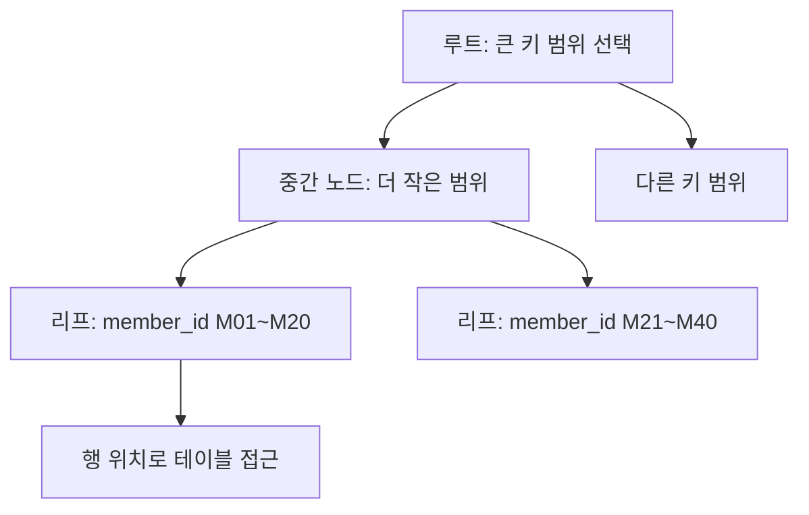

## 이번 편의 목표

- 인덱스가 정렬된 키와 행 위치를 이용해 검색 범위를 줄이는 원리를 설명한다.
- equality·range 조건과 복합 인덱스 열 순서를 연결한다.
- 함수·암시적 변환이 인덱스 접근을 어렵게 하는 이유를 판단한다.
- 읽기 이익과 INSERT·UPDATE·DELETE 유지 비용을 함께 평가한다.

## 먼저 알아둘 말

| 용어 | 쉬운 뜻 |
| --- | --- |
| 인덱스(Index) | 특정 열 값과 행 위치를 탐색하기 쉽게 따로 정리한 구조 |
| B-tree | 루트·중간·리프 노드를 따라 정렬된 키 범위를 찾는 대표 인덱스 구조 |
| 리프(Leaf) | 실제 인덱스 키와 행 위치 정보가 있는 끝 단계 |
| 범위 스캔 | 시작 키를 찾은 뒤 정렬된 리프를 일정 범위까지 읽는 방식 |
| 커버링 | 쿼리에 필요한 열을 인덱스만으로 충족할 수 있는 상태 |
| SARGable | 조건을 인덱스 탐색 범위로 바꾸기 쉬운 형태 |
| 중복 인덱스 | 열 구성이 같거나 다른 인덱스에 대부분 포함되어 이익이 겹치는 인덱스 |

## 선수지식과 핵심 질문

선수지식은 [44. DB 구조와 성능](./44_database-structure-and-performance), [46. 옵티마이저와 실행계획](./46_optimizer-and-execution-plan)이다.

핵심 질문은 **전체 행을 훑지 않고 원하는 키 범위를 어떻게 찾으며, 그 탐색 구조를 유지하기 위해 쓰기 때 무엇을 더 하는가**이다.

## 책의 색인처럼 시작점을 찾는다



인덱스는 원본 테이블의 축소 복사본이 아니다. 키와 행 위치, 필요에 따라 추가 열을 별도 순서로 유지한다.

## equality와 범위 탐색

인덱스: `(member_id)`

```sql
WHERE member_id = 'M01'
```

루트에서 M01이 있는 리프 위치까지 내려가 소수 키를 찾는다.

```sql
WHERE member_id >= 'M100'
  AND member_id <  'M200'
```

M100 시작점을 찾은 뒤 M200 전까지 정렬된 리프를 연속해서 읽는다.

| 조건 | 대표 탐색 형태 |
| --- | --- |
| `=` | 특정 키 또는 같은 키 범위 |
| `BETWEEN`, `>=`, `<` | 시작점부터 범위 |
| `LIKE 'ABC%'` | 접두사 범위가 가능한 경우 |
| `LIKE '%ABC'` | 시작점을 정하기 어려움 |

문자 정렬 규칙과 DBMS 기능에 따라 구체 계획은 달라진다.

## 인덱스 후 테이블 방문

```sql
SELECT member_id, name, profile_text
FROM members
WHERE member_id = 'M01';
```

인덱스에 member_id만 있다면 키를 찾은 뒤 name과 profile_text를 읽으러 테이블 행을 방문한다. 결과가 수십만 행이면 무작위 테이블 방문 비용이 커질 수 있다.

<Callout type="info">
  인덱스로 키를 빨리 찾는 비용과 찾은 행의 나머지 열을 테이블에서 읽는 비용을 함께 본다.
</Callout>

## 커버링과 Index Only Scan

인덱스가 `(member_id, name)`을 포함하고 쿼리가 두 열만 요구하면 테이블 방문을 줄일 수 있다.

```sql
SELECT member_id, name
FROM members
WHERE member_id = 'M01';
```

PostgreSQL의 Index Only Scan은 필요한 열뿐 아니라 행 가시성 조건도 충족해야 실제 테이블 방문을 피할 수 있다. INCLUDE 열 등 지원 문법은 DBMS마다 다르다.

필요한 모든 열을 무조건 인덱스에 넣으면 인덱스가 커지고 쓰기 비용이 늘어난다.

## 복합 인덱스 열 순서

인덱스: `(member_id, ordered_at)`

| 조건 | 활용 직관 |
| --- | --- |
| member_id = M01 | 한 회원 범위 탐색 |
| member_id = M01 AND ordered_at >= 날짜 | 회원 범위 안 날짜 범위 |
| ordered_at >= 날짜만 | 선두 회원 값이 없어 하나의 연속 범위를 잡기 어려움 |


일반적으로 동등 조건 열 뒤에 범위 조건 열을 두는 설계를 자주 검토하지만, 열 순서는 선택도 하나만이 아니라 쿼리 조합·정렬·그룹·쓰기 패턴으로 결정한다.

## 함수와 암시적 변환

```sql
WHERE UPPER(email) = 'USER@EXAMPLE.COM'
```

일반 email 인덱스의 원본 값 대신 함수 결과를 비교하므로 그대로는 탐색 범위를 만들기 어려울 수 있다. 함수 기반 인덱스·표현식 인덱스를 지원하는 DBMS에서는 같은 표현을 인덱싱할 수 있다.

```sql
WHERE TO_CHAR(ordered_at, 'YYYY-MM') = '2026-08'
```

날짜 원형 범위로 표현하면 일반 날짜 인덱스에 더 자연스럽다.

```sql
WHERE ordered_at >= DATE '2026-08-01'
  AND ordered_at <  DATE '2026-09-01'
```

열은 문자, 바인드 값은 숫자처럼 타입이 다르면 어느 쪽이 변환되는지에 따라 인덱스 사용과 오류가 달라질 수 있다. 모델과 파라미터 타입을 맞춘다.

## 선택도와 전체 스캔

| 조건 결과 | 인덱스 후보 직관 |
| --- | --- |
| 100만 중 1행 | 강한 후보 |
| 100만 중 1만행 | 행 폭·클러스터링에 따라 후보 |
| 100만 중 90만행 | 전체 스캔이 유리할 수 있음 |

인덱스가 존재해도 옵티마이저가 전체 스캔을 선택하는 것은 오류가 아닐 수 있다.

## 클러스터링과 테이블 방문

같은 키 범위의 행이 테이블 블록에 모여 있으면 적은 블록으로 여러 행을 읽는다. 흩어져 있으면 각 인덱스 키마다 다른 블록을 방문할 수 있다. 같은 선택도라도 물리적 배치에 따라 비용이 달라진다.

## UNIQUE 인덱스와 제약조건

PRIMARY KEY·UNIQUE 제약을 구현하기 위해 고유 인덱스를 사용하는 DBMS가 많다. 하지만 논리 제약조건과 물리 인덱스는 개념적으로 다르다.

- 제약조건: 어떤 데이터가 유효한지 선언
- 인덱스: 데이터를 찾고 고유성을 검사하는 물리 구조

인덱스만 만들었다고 외래키 의미나 업무 규칙이 모두 선언되는 것은 아니다.

## 쓰기 비용

주문 한 행 INSERT 시 관련 인덱스마다 새 키를 삽입해야 한다.

```text
테이블 INSERT 1회
  + PK 인덱스 갱신
  + member_date 인덱스 갱신
  + status 인덱스 갱신
  + ...
```

인덱스가 많으면 쓰기 CPU·로그·저장공간·페이지 분할·잠금 부담이 늘 수 있다. UPDATE가 인덱스 열을 바꾸면 기존 키 제거와 새 키 추가가 필요하다.

## 중복·미사용 인덱스 점검

| 인덱스 | 검토 |
| --- | --- |
| `(member_id)` | 기본 회원 조회 |
| `(member_id, ordered_at)` | 첫 인덱스의 일부 역할도 가능할 수 있음 |
| `(ordered_at)` | 날짜만 조회에 별도 가치 |

긴 복합 인덱스가 짧은 인덱스를 항상 완전히 대체하는 것은 아니다. 크기·커버링·고유성·계획을 확인하고 실제 사용 통계를 본다.

## 인덱스 설계 순서

1. 느리고 중요한 실제 SQL과 바인드 값을 확보한다.
2. WHERE·JOIN·ORDER BY·GROUP BY 열을 역할별로 표시한다.
3. 선택도와 반환 행·열을 계산한다.
4. 후보 인덱스로 실행계획과 I/O를 비교한다.
5. 쓰기 부하와 중복 인덱스를 함께 측정한다.

## 시험·실무 연결

- B-tree의 equality·range 탐색을 묻는다.
- 복합 인덱스 선두 열이 없는 조건을 함정으로 낸다.
- 인덱스가 있어도 많은 행이면 전체 스캔이 가능함을 묻는다.
- 함수 적용·암시적 변환과 인덱스 접근의 관계를 판단한다.

## 짧은 확인

인덱스가 `(grade, points)`이고 `WHERE grade='GOLD' AND points >= 1000`이면 어떻게 읽는가?

<Collapse title="확인하기">

선두 grade의 GOLD 구간을 찾은 뒤 그 안에서 points 1000 이상 범위를 읽는 형태를 기대할 수 있다. 실제 계획은 통계·반환 열·분포에 따라 확인한다.

</Collapse>

## 흔한 실수와 진단법

| 실수 | 진단법 |
| --- | --- |
| 인덱스가 있으면 반드시 사용 | 반환 비율과 계획 확인 |
| 열 포함 여부만 보고 복합 인덱스 판단 | 선두와 범위 순서 확인 |
| 함수 조건인데 일반 인덱스만 기대 | 표현식·범위 변환 검토 |
| 읽기만 개선하고 쓰기 무시 | DML 지연·로그·공간 측정 |

## 다음 단계: 복습

[47-복습. 인덱스 기본](./47_index-basics-review)에서 복합 인덱스와 탐색 범위를 직접 판단하자.

## 정리

<Callout type="default">
  - B-tree 인덱스는 정렬된 키에서 시작점을 찾아 범위를 줄인다.
  - 인덱스 후 테이블 방문과 결과 행 수까지 비용에 포함한다.
  - 복합 인덱스는 선두 열과 equality·range 조건 순서를 함께 본다.
  - 인덱스는 읽기를 돕지만 모든 쓰기에서 유지 비용을 낸다.
</Callout>

마지막 편에서는 이 인덱스와 행 수를 바탕으로 Nested Loop·Hash·Sort Merge 조인이 선택되는 원리를 배운다.

## 참고 자료

- [PostgreSQL - Indexes](https://www.postgresql.org/docs/current/indexes.html)
- [PostgreSQL - Multicolumn Indexes](https://www.postgresql.org/docs/current/indexes-multicolumn.html)
- [Oracle Database - Optimizer Access Paths](https://docs.oracle.com/en/database/oracle/oracle-database/21/tgsql/optimizer-access-paths.html)
