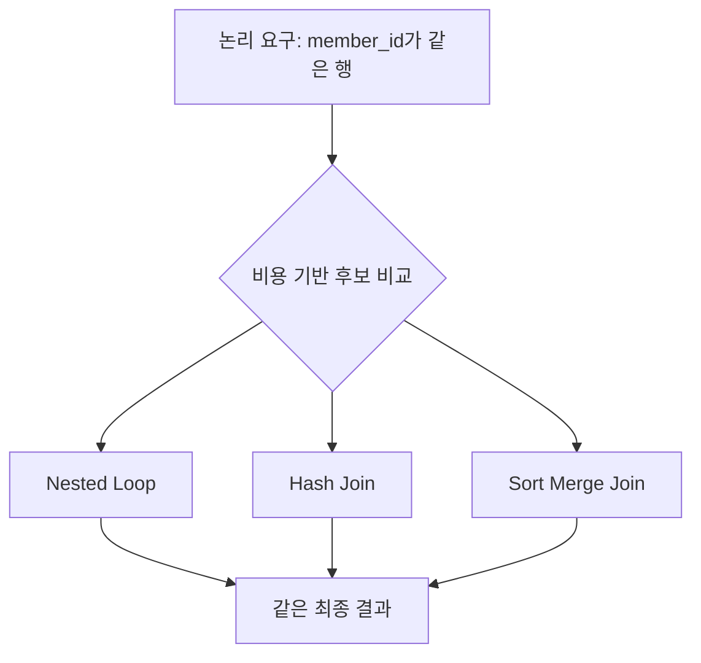
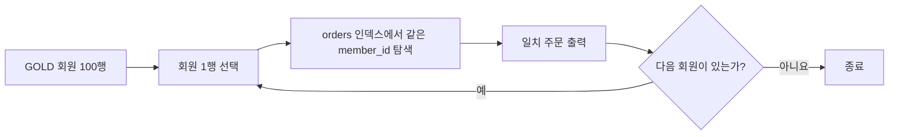
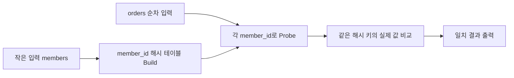
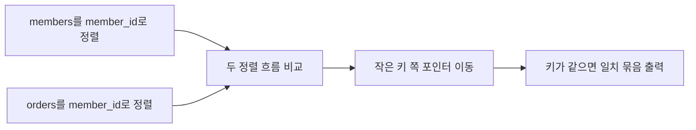

## 이번 편의 목표

- 논리 조인 종류와 물리 조인 알고리즘을 구분한다.
- Nested Loop, Hash, Sort Merge 조인의 수행 단계를 설명한다.
- 입력 행 수·인덱스·조인 조건·메모리에 따라 적합한 후보를 판단한다.
- 실행계획의 바깥·안쪽 입력, build·probe와 spill을 해석한다.

## 먼저 알아둘 말

| 용어 | 쉬운 뜻 |
| --- | --- |
| 논리 조인 | INNER·LEFT처럼 어떤 행을 결과에 남길지 정하는 의미 |
| 물리 조인 | 그 결과를 실제로 만드는 Nested Loop·Hash·Merge 같은 알고리즘 |
| Outer Input | 물리 조인에서 먼저 한 행씩 또는 한 집합으로 읽는 바깥 입력 |
| Inner Input | 바깥 행에 맞춰 반복 탐색되는 안쪽 입력 |
| Build Input | Hash Join에서 해시 테이블을 만드는 입력 |
| Probe Input | 해시 키를 조회하며 짝을 찾는 입력 |
| Spill | 메모리가 부족해 해시·정렬 중간 데이터를 디스크에 쓰는 현상 |

## 선수지식과 핵심 질문

선수지식은 [21. 조인](./21_joins), [46. 옵티마이저와 실행계획](./46_optimizer-and-execution-plan), [47. 인덱스 기본](./47_index-basics)이다.

핵심 질문은 **같은 조인 결과를 만들 때 작은 입력의 각 행으로 반복 탐색할지, 해시표를 만들지, 양쪽을 정렬해 합칠지**이다.

## 논리와 물리를 분리한다

```sql
SELECT m.name, o.order_id
FROM members m
JOIN orders o ON o.member_id = m.member_id;
```

SQL은 두 테이블의 member_id가 같은 내부 조인 결과를 요구한다. 옵티마이저는 데이터와 비용에 따라 여러 물리 방법 중 하나를 선택한다.



“INNER JOIN은 항상 Hash Join”처럼 논리 종류와 물리 알고리즘을 일대일로 외우면 안 된다.

## 공통 데이터 규모

| 입력 | 전체 행 | 조건 후 행 | 관련 구조 |
| --- | ---: | ---: | --- |
| GOLD members | 100만 | 100 | member_id PK |
| 8월 orders | 1억 | 2천만 | `(member_id, ordered_at)` 인덱스 후보 |

GOLD 회원 100명의 8월 주문을 찾는 상황으로 알고리즘을 비교한다.

## Nested Loop Join

작은 바깥 입력의 행을 하나씩 읽고 안쪽에서 짝을 찾는다.



### 수행 직관

```text
for each GOLD 회원 100행:
    orders 인덱스에서 해당 회원의 8월 주문 찾기
    찾은 주문마다 결과 출력
```

### 유리한 후보

- 바깥 입력이 작다.
- 안쪽 조인 열에 효율적인 인덱스가 있다.
- 첫 결과를 빨리 반환해야 한다.
- 온라인 조회처럼 소수 행을 반복 탐색한다.

### 불리한 후보

- 바깥 행이 수백만인데 안쪽 탐색도 비싸다.
- 안쪽에 적절한 인덱스가 없어 매번 전체를 읽는다.
- 추정 바깥 100행이 실제 100만 행으로 크게 틀렸다.

총 안쪽 탐색 비용은 대략 `바깥 행 수 × 안쪽 1회 탐색 비용`으로 생각한다.

<Callout type="info">
  Nested Loop 자체가 느린 것이 아니다. 작은 바깥 입력과 빠른 인덱스 탐색이 만나면 매우 효율적이다.
</Callout>

## Hash Join

한쪽 입력으로 메모리 해시 테이블을 만들고 다른 쪽 행의 조인 키로 짝을 조회한다.



### 수행 단계

1. 보통 더 작은 입력의 조인 키와 필요한 열로 해시 테이블을 만든다.
2. 큰 입력을 읽으며 각 조인 키의 해시 버킷을 찾는다.
3. 해시 충돌 가능성이 있으므로 실제 키 값도 비교한다.
4. 일치 행을 출력한다.

### 유리한 후보

- `=` 등가 조인이다.
- 양쪽에서 많은 행을 읽어야 한다.
- 유용한 안쪽 인덱스가 없거나 반복 탐색보다 한 번 스캔이 낫다.
- 작은 build 입력이 메모리에 잘 들어간다.

### 불리한 후보

- `<`, `BETWEEN` 같은 일반 비등가 조건이다.
- build 입력이 예상보다 커 메모리를 넘는다.
- 이미 소수 행 인덱스 탐색으로 끝날 수 있다.

메모리를 넘으면 해시 파티션을 디스크에 쓰고 다시 읽는 spill이 생길 수 있다.

## Sort Merge Join

양쪽 입력을 조인 키 순서로 정렬한 뒤 두 정렬 목록을 동시에 앞으로 이동하며 일치 범위를 합친다.



### 간단한 병합

```text
members: M01, M03, M05
orders : M01, M01, M02, M05

M01 = M01 → 두 주문 출력
M03 > M02 → orders를 M05로 이동
M03 < M05 → members를 M05로 이동
M05 = M05 → 한 주문 출력
```

### 유리한 후보

- 입력이 이미 인덱스나 앞 단계로 정렬돼 있다.
- 큰 두 입력을 순차적으로 합칠 수 있다.
- DBMS가 지원하는 범위·비등가 조인에서 정렬 병합이 적합하다.
- 결과 자체에도 같은 정렬이 필요하다.

### 비용

정렬되지 않은 입력은 먼저 정렬해야 하며 메모리를 넘으면 디스크 spill이 생긴다. 등가 대량 조인에서는 Hash Join이 더 단순한 후보일 수 있다.

## 세 방식 비교

| 기준 | Nested Loop | Hash Join | Sort Merge |
| --- | --- | --- | --- |
| 핵심 동작 | 바깥 행마다 안쪽 탐색 | 작은 쪽 해시 후 큰 쪽 조회 | 양쪽 정렬 후 병합 |
| 대표 조건 | 여러 조건 가능 | 주로 등가 | 등가·일부 범위 |
| 작은 바깥 + 안쪽 인덱스 | 강점 | 준비 비용이 과할 수 있음 | 정렬 비용이 과할 수 있음 |
| 큰 입력 두 개 | 반복이 커질 수 있음 | 강점 후보 | 정렬 상태에 따라 후보 |
| 메모리 부족 | 반복 I/O | 해시 spill | 정렬 spill |
| 첫 행 반환 | 빠를 수 있음 | build 완료 후 | 정렬 완료 후일 수 있음 |

이 표는 절대 선택 규칙이 아니라 비용 직관이다. DBMS 구현·병렬도·캐시·데이터 분포에 따라 달라진다.

## 조인 순서가 중요한 이유

세 테이블 A·B·C가 있을 때 `(A join B) join C`와 `(B join C) join A`는 논리 결과가 같아도 중간 행 수가 다를 수 있다.

```text
A 100만 행 -- 선택 조건 → 10행
B 1억 행
C 100행

좋은 후보: A를 10행으로 줄임 → B와 키 탐색 → C 연결
나쁜 후보: B와 넓은 입력부터 연결 → 큰 중간 결과
```

옵티마이저는 가능한 조인 순서를 탐색하지만 테이블 수가 많으면 모든 조합을 전부 평가하기 어렵다. 정확한 카디널리티 추정이 중요하다.

## 드라이빙과 build 쪽을 혼동하지 않기

- Nested Loop의 바깥 입력은 반복을 주도한다.
- Hash Join의 build 입력은 해시 테이블을 만든다.
- 실행계획 표시 순서가 항상 자연어의 왼쪽 테이블 순서와 같지는 않다.

SQL의 `FROM members JOIN orders` 작성 순서만 보고 실제 바깥·build 입력을 확정하지 말고 계획을 읽는다. 옵티마이저는 내부 조인 순서를 바꿀 수 있다.

## 외부 조인과 알고리즘

LEFT JOIN은 왼쪽 보존이라는 논리 의미를 유지해야 한다. DBMS는 Nested Loop, Hash, Merge의 외부 조인 변형을 사용할 수 있지만 짝 없는 왼쪽 행에 NULL을 채워 결과에 남겨야 한다.

알고리즘을 바꿔도 SQL의 보존 결과가 달라져서는 안 된다.

## 실행계획에서 보기

PostgreSQL 단순 예:

```text
Hash Join
  Hash Cond: orders.member_id = members.member_id
  -> Seq Scan on orders
  -> Hash
       -> Index Scan on members
            Index Cond: grade = 'GOLD'
```

아래 Hash 자식이 GOLD 회원으로 해시를 만들고 orders 스캔이 probe한다. 다음을 확인한다.

- build 실제 행과 메모리·batches
- probe 실제 행과 필터 제거 행
- 예상·실제 행 오차
- temp read/write 또는 spill
- 최종 출력 행 수

Nested Loop이면 안쪽 노드의 loops, Sort Merge면 양쪽 Sort의 메모리·디스크 사용을 본다.

## 어떤 방법을 선택하게 만들까

보통 알고리즘 이름을 직접 강제하기보다 다음 입력을 개선한다.

1. 정확한 통계와 제약조건을 제공한다.
2. 조건으로 불필요한 행을 일찍 줄인다.
3. 중요한 소수 탐색에 적절한 인덱스를 만든다.
4. 데이터 타입과 조인 조건을 일치시킨다.
5. 메모리·병렬도 설정을 전체 시스템 기준으로 조정한다.

힌트나 계획 고정은 데이터 변화 후 나쁜 선택을 강제할 수 있으므로 근거와 모니터링이 필요하다.

## 1회독 전체 연결


SQLD 1회독의 핵심은 문법을 따로 외우는 것이 아니라 업무 사실이 테이블이 되고, SQL 결과 행이 되고, DBMS의 물리 실행으로 이어지는 흐름을 연결하는 것이다.

## 시험·실무 연결

- 작은 바깥 입력과 안쪽 인덱스에 Nested Loop가 유리할 수 있음을 묻는다.
- Hash Join은 주로 등가 조인이고 build 입력 크기가 중요함을 묻는다.
- Sort Merge의 정렬 비용과 이미 정렬된 입력의 장점을 묻는다.
- 예상 행 오차가 잘못된 조인 순서·알고리즘을 유발할 수 있음을 판단한다.

## 짧은 확인

바깥 입력 실제 100만 행, 안쪽은 인덱스 없이 매번 1억 행 전체를 읽는 Nested Loop 계획이라면 무엇이 문제인가?

<Collapse title="확인하기">

안쪽 전체 읽기를 최대 100만 번 반복하는 비현실적으로 큰 비용이 생긴다. 예상 바깥 행이 왜 작게 틀렸는지, 조인 열 인덱스·Hash Join 후보·조건으로 바깥 행을 줄일 방법을 확인한다.

</Collapse>

## 흔한 실수와 진단법

| 실수 | 진단법 |
| --- | --- |
| Nested Loop는 항상 나쁨 | 바깥 행과 안쪽 1회 비용 계산 |
| Hash Join은 모든 조건 가능 | 등가 조건과 build 메모리 확인 |
| Merge는 정렬비용 없음 | 입력 정렬 상태·spill 확인 |
| SQL 작성 순서가 실제 조인 순서 | 실행계획의 자식·build·loops 읽기 |

## 다음 단계: 복습

[48-복습. 조인 수행 원리](./48_join-mechanisms-review)에서 세 알고리즘의 행 처리와 적합한 상황을 최종 점검하자.

## 정리

<Callout type="default">
  - 논리 조인은 결과 의미, 물리 조인은 그 결과를 만드는 알고리즘이다.
  - Nested Loop는 작은 바깥과 빠른 안쪽 탐색, Hash는 큰 등가 조인, Merge는 정렬된 큰 입력에 강점이 있다.
  - 실제 선택은 행 수·인덱스·메모리·분포·병렬도에 따라 달라진다.
  - 계획의 loops·build 크기·spill·예상과 실제 행을 함께 읽는다.
</Callout>

이제 같은 번호의 복습편을 풀고, 틀린 주제는 해당 본편의 입력표와 실행 흐름부터 다시 확인하자.

## 참고 자료

- [PostgreSQL - Using EXPLAIN](https://www.postgresql.org/docs/current/using-explain.html)
- [PostgreSQL - Planner Method Configuration](https://www.postgresql.org/docs/current/runtime-config-query.html#RUNTIME-CONFIG-QUERY-ENABLE)
- [Oracle Database - Joins](https://docs.oracle.com/en/database/oracle/oracle-database/21/tgsql/joins.html)
