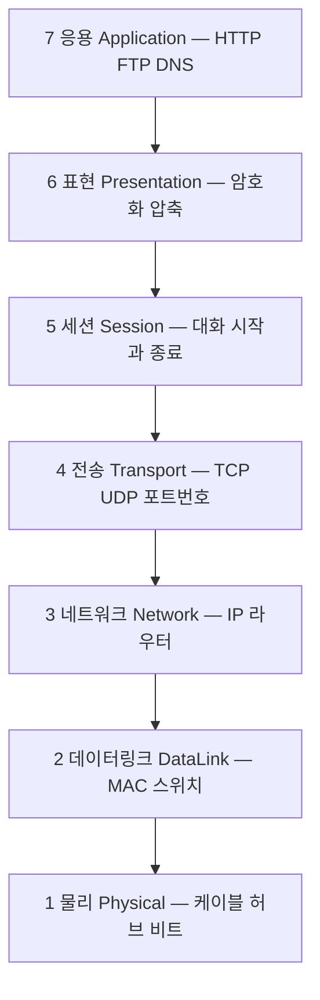
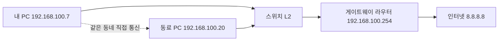
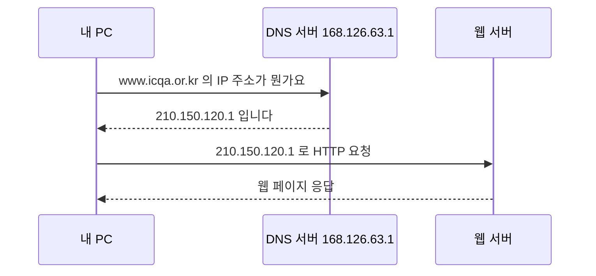

<Callout type="info">
  **이번 문서의 목표:** 이 파일을 다 읽으면 시험지의 "IP address: 10101100.00010000.10010110.01110011, Subnet mask: 22bit"라는 한 줄을 보고, 윈도우 네트워크 속성 창의 어느 칸에 어떤 숫자를 적어야 하는지 계산 과정까지 손으로 써낼 수 있다.
</Callout>

## 0. 실기 시험이 실제로 요구하는 것

네트워크관리사 2급 **실기**는 필기와 성격이 완전히 다릅니다. 필기가 "RIP의 최대 홉 수는?"을 묻는다면, 실기는 **화면 앞에 앉혀 놓고 값을 직접 넣게 합니다.** 채점자는 여러분의 머릿속을 보지 않고, **입력칸에 남은 값과 저장 여부**만 봅니다.

기출 8회분을 늘어놓으면 구성이 거의 고정되어 있습니다.

| 구역 | 문항 수 | 형태 | 무엇을 보나 |
|------|--------|------|------------|
| 랜케이블 제작 | 1 | 실물 작업 | 8가닥 색 순서, 압착 상태 |
| 윈도우 서버 작업형 | 8 | GUI 조작 | 입력값 + 확인/적용 클릭 여부 |
| 단답형·선택형 | 6 | 용어 입력 | 정확한 철자 |
| 라우터 설정 | 3 | CLI 입력 | 명령어 + 저장 명령 |

> **쉽게 말하면:** 실기는 "알고 있는가"가 아니라 "**정확한 칸에 정확한 값을 넣고 저장 버튼을 눌렀는가**"를 봅니다.

이 문서는 그 18문제를 풀기 위해 반드시 머리에 들어 있어야 할 **최소한의 개념 골격**만 다룹니다. 필기처럼 계층별 프로토콜을 전부 외우지 않습니다. 대신 **개념 하나하나를 시험 화면의 입력칸과 짝지어** 익힙니다.

## 1. 네트워크란 무엇인가 — 우편 시스템 비유

### 왜 필요한가

컴퓨터 두 대가 있습니다. A의 파일을 B로 보내고 싶습니다. 두 대를 전선으로 직접 이으면 됩니다. 그런데 컴퓨터가 100대라면? 전선을 4,950가닥 깔 수는 없습니다.

그래서 **중간에 배달을 대신해 주는 장치**를 두고, 모든 컴퓨터가 그 장치에 한 가닥씩만 연결합니다. 이것이 네트워크(network, 그물망)의 출발점입니다.

> **쉽게 말하면:** 네트워크는 우편 시스템입니다. 모든 집이 서로에게 직접 길을 낼 수는 없으니, 우체국을 두고 주소를 적어 보냅니다.

이 비유는 실기 내내 유효하므로 용어를 미리 짝지어 둡니다.

| 우편 세계 | 네트워크 세계 | 실기에서 만나는 곳 |
|-----------|--------------|------------------|
| 집 주소 | IP 주소(IP address) | 윈도우 IP 주소 입력칸 |
| 우편번호로 구분되는 동네 | 네트워크 대역 | 서브넷 마스크 입력칸 |
| 동네 밖으로 나가는 우체국 | 게이트웨이(gateway) | 기본 게이트웨이 입력칸 |
| 이름으로 주소를 찾는 전화번호부 | DNS(Domain Name System) | 기본 설정 DNS 서버 입력칸 |
| 편지 봉투 | 패킷(packet) | ping 결과 해석 |
| 집 고유의 문패 번호 | MAC 주소(Media Access Control) | arp 명령 결과 |

## 2. OSI 7계층 — 실기에 필요한 만큼만

### 왜 계층으로 나누는가

편지를 보낼 때 우리는 "글을 쓰는 사람", "봉투에 주소를 적는 사람", "우체국 분류 기계", "트럭 운전기사", "실제 도로"를 각각 따로 생각합니다. 각자 자기 일만 하면 되고, 트럭이 오토바이로 바뀌어도 편지 내용은 그대로입니다.

네트워크도 같은 이유로 층(layer, 레이어)을 나눕니다. **OSI**(Open Systems Interconnection, 개방형 시스템 상호연결) 7계층은 국제표준화기구가 정한 7층짜리 분업표입니다.

실기 단답형·선택형에서는 이 표에서 **딱 세 가지**만 반복해서 나옵니다.

1. **어떤 장비가 몇 계층인가** — 허브 1계층, 스위치 2계층, 라우터 3계층
2. **비트(bit) 단위 전송은 몇 계층인가** — 1계층 물리 계층(Physical Layer)
3. **세션 수립·유지·종료는 몇 계층인가** — 5계층 세션 계층(Session Layer)

실제로 2023년 1회 기출은 "(A) 세션 수립·유지·종료를 관리하는 계층 / (B) 비트 단위 전송을 담당하는 계층"을 물었고 답은 각각 세션 계층과 물리 계층이었습니다.

### 각 계층을 그 자리에서 이해하기

- **1계층 물리(Physical)**: 전기 신호와 빛 신호 그 자체. 다루는 단위는 **비트**(bit, 0과 1 한 자리). UTP 케이블, 리피터(repeater, 신호 증폭기), **허브**(hub)가 여기 삽니다. 허브는 들어온 신호를 아무 생각 없이 모든 포트로 복사해 뿌립니다.
- **2계층 데이터링크(Data Link)**: 같은 동네(같은 LAN) 안에서 옆집까지 배달. 단위는 **프레임**(frame). 주소는 **MAC 주소**(Media Access Control address, 랜카드에 공장에서 새겨진 48비트 고유번호, `00-11-22-33-44-55` 형태). **스위치**(switch)가 여기 삽니다. 스위치는 MAC 주소를 외워 두었다가 목적지 포트로만 보냅니다. **VLAN**(Virtual LAN, 가상 랜)도 2계층 기술입니다.
- **3계층 네트워크(Network)**: 동네와 동네 사이 배달. 단위는 **패킷**(packet). 주소는 **IP 주소**. **라우터**(router)가 여기 삽니다. 경로를 고르는 일이 라우팅(routing)입니다.
- **4계층 전송(Transport)**: 같은 컴퓨터 안에서 어느 프로그램에게 줄지 결정. 단위는 세그먼트(segment). 주소는 **포트 번호**(port number, 0부터 65535까지의 숫자). 웹은 80번, HTTPS는 443번, FTP는 21번, 여기서 **TCP**(Transmission Control Protocol, 확인하며 보내는 방식)와 **UDP**(User Datagram Protocol, 확인 없이 던지는 방식)가 갈립니다.
- **5계층 세션(Session)**: 두 프로그램 사이 대화 한 판의 시작·유지·종료 관리.
- **6계층 표현(Presentation)**: 문자 인코딩, 압축, 암호화 형식 맞추기.
- **7계층 응용(Application)**: 사람이 쓰는 프로그램이 직접 만나는 층. HTTP, FTP, DNS, SMTP가 여기 삽니다.

> **쉽게 말하면:** 1·2계층은 "동네 안 배달", 3계층은 "동네 밖 배달", 4계층은 "집 안에서 누구에게 줄지", 5–7계층은 "편지 내용 자체"입니다.

**자주 틀리는 점:** 스위치를 3계층이라고 답하는 실수가 많습니다. 일반 스위치는 2계층이고, **L3 스위치**라고 명시된 것만 3계층입니다. 라우터는 언제나 3계층입니다.

## 3. TCP/IP — 실제로 돌아가는 4층 모델

OSI 7계층은 교과서 모델이고, 인터넷이 실제로 쓰는 것은 **TCP/IP 모델**입니다. 층을 4개로 뭉쳤을 뿐 개념은 같습니다.

| TCP/IP 4계층 | 대응하는 OSI 계층 | 대표 프로토콜 |
|--------------|------------------|--------------|
| 응용 계층 | 5–7 | HTTP, HTTPS, FTP, DNS, SMTP, SNMP |
| 전송 계층 | 4 | TCP, UDP |
| 인터넷 계층 | 3 | IP, ICMP, ARP |
| 네트워크 접근 계층 | 1–2 | 이더넷, UTP 배선 |

실기에서 이름이 반복해서 등장하는 프로토콜만 그 자리에서 풀어 둡니다.

- **HTTP**(HyperText Transfer Protocol) — 하이퍼텍스트, 즉 링크로 이어진 문서를 옮기는 규약. 포트 80번.
- **HTTPS** — HTTP에 **SSL/TLS**(Secure Sockets Layer / Transport Layer Security, 암호화 계층)를 씌운 것. 포트 443번. 기출 단답형에 자주 나옵니다.
- **FTP**(File Transfer Protocol) — 파일 전송 규약. 제어용 21번 포트, 데이터용 20번 포트를 씁니다. 작업형에서 FTP 사이트를 직접 만들게 합니다.
- **DNS**(Domain Name System) — 도메인 이름을 IP 주소로 바꿔주는 전화번호부. 포트 53번.
- **DHCP**(Dynamic Host Configuration Protocol) — IP 주소를 자동으로 빌려주는 규약. **DORA** 4단계(Discover 찾기 → Offer 제안 → Request 요청 → Ack 승인)로 동작합니다. 이 DORA 4단계는 단답형 단골입니다.
- **ICMP**(Internet Control Message Protocol) — 통신 상태를 알리는 제어용 규약. `ping` 명령이 쓰는 Echo Request(메아리 요청)와 Echo Reply(메아리 응답)가 대표 메시지입니다.
- **ARP**(Address Resolution Protocol) — IP 주소를 알 때 그에 해당하는 MAC 주소를 알아내는 규약. "IP → MAC" 방향입니다. 반대 방향은 **RARP**(Reverse ARP)입니다.
- **SNMP**(Simple Network Management Protocol) — 장비 상태를 원격으로 감시·관리하는 규약. 라우터 문제에서 `snmp-server community` 명령으로 나옵니다.

**자주 틀리는 점:** ARP의 방향을 거꾸로 답하는 실수입니다. "**논리적 주소(IP)를 알고 물리적 주소(MAC)를 알아낸다**"가 ARP입니다.

## 4. IP 주소 — 32비트를 네 토막으로

### 왜 필요한가

편지를 보내려면 주소가 있어야 합니다. 네트워크에서 그 주소가 **IP 주소**(Internet Protocol address)입니다. IPv4(Internet Protocol version 4)는 **32비트**, 즉 0과 1이 32자리인 숫자입니다.

32자리 이진수는 사람이 읽기 어렵습니다. 그래서 **8비트씩 네 토막**으로 잘라, 각 토막을 십진수로 바꾸고 점으로 잇습니다. 이 표기법을 **점 십진 표기**(dotted decimal notation)라고 합니다.

8비트로 표현 가능한 값은 $2^8 = 256$가지, 즉 0부터 255까지입니다. 그래서 IP 주소의 각 칸은 절대 255를 넘지 않습니다.

### 실기 핵심 — 2진수를 십진수로 바꾸는 훈련

2026년 3회 기출은 IP 주소를 아예 **2진수로 던져 놓고** 윈도우 네트워크 속성 창에 입력하게 했습니다.

제시값: `10101100.00010000.10010110.01110011`

8비트 한 토막을 십진수로 바꾸는 방법은 자리마다 정해진 가중치를 더하는 것입니다. 왼쪽부터 가중치는 128, 64, 32, 16, 8, 4, 2, 1입니다.

첫 번째 토막 `10101100`을 풀어 봅니다.

| 자리 가중치 | 128 | 64 | 32 | 16 | 8 | 4 | 2 | 1 |
|------------|-----|----|----|----|---|---|---|---|
| 비트 | 1 | 0 | 1 | 0 | 1 | 1 | 0 | 0 |
| 더할 값 | 128 | 0 | 32 | 0 | 8 | 4 | 0 | 0 |

$$
128 + 32 + 8 + 4 = 172
$$

- 128: 첫째 자리 비트가 1이므로 더합니다
- 32: 셋째 자리 비트가 1이므로 더합니다
- 8과 4: 다섯째·여섯째 자리 비트가 1이므로 더합니다

같은 방법으로 나머지 세 토막을 처리합니다.

두 번째 토막 `00010000` — 1이 있는 자리는 넷째 자리(가중치 16) 하나뿐입니다.

$$
16 = 16
$$

세 번째 토막 `10010110` — 1이 있는 자리는 128, 16, 4, 2입니다.

$$
128 + 16 + 4 + 2 = 150
$$

네 번째 토막 `01110011` — 1이 있는 자리는 64, 32, 16, 2, 1입니다.

$$
64 + 32 + 16 + 2 + 1 = 115
$$

네 값을 점으로 이으면 **172.16.150.115**입니다. 이것이 IP 주소 칸에 넣을 값입니다.

> **쉽게 말하면:** 8칸짜리 저울에 128·64·32·16·8·4·2·1짜리 추가 놓여 있고, 비트가 1인 자리의 추만 골라 더하면 그 토막의 십진수입니다.

**결과 해석:** 172.16으로 시작하는 주소는 B 클래스 사설(private) IP 대역(172.16.0.0부터 172.31.255.255까지)에 속합니다. 2023년 4회 선택형이 정확히 이 범위를 물었습니다. 172.15는 사설이 아니고, 172.31까지가 사설입니다.

### 클래스 — 실기에 필요한 정도

IPv4 주소는 첫 번째 토막 값에 따라 전통적으로 등급(class)을 나눕니다.

| 클래스 | 첫 토막 범위 | 기본 서브넷 마스크 | 사설 IP 대역 |
|--------|------------|------------------|-------------|
| A | 1–126 | 255.0.0.0 (/8) | 10.0.0.0 – 10.255.255.255 |
| B | 128–191 | 255.255.0.0 (/16) | 172.16.0.0 – 172.31.255.255 |
| C | 192–223 | 255.255.255.0 (/24) | 192.168.0.0 – 192.168.255.255 |
| D | 224–239 | 없음 (멀티캐스트 전용) | 없음 |
| E | 240–255 | 없음 (연구용 예약) | 없음 |

127로 시작하는 주소는 **루프백**(loopback, 자기 자신)으로 예약되어 있습니다. `ping 127.0.0.1`이 성공하면 내 컴퓨터의 TCP/IP 기능 자체는 정상이라는 뜻입니다.

**사설 IP**(private IP)는 회사·집 내부에서만 쓰는 주소로, 인터넷에 그대로 나갈 수 없습니다. 그래서 밖으로 나갈 때 공인 IP로 바꿔주는 장치가 필요한데 그것이 **NAT**(Network Address Translation, 주소 변환)입니다. 자세한 내용은 08편에서 다룹니다.

## 5. 서브넷 마스크 — 주소를 동네와 집으로 자르는 가위

### 왜 필요한가

주소 `192.168.100.7`만 보고는 "어느 동네의 몇 번지"인지 알 수 없습니다. 앞의 몇 자리까지가 동네 이름(네트워크 부분)이고 뒤가 번지(호스트 부분)인지 알려주는 표시가 필요합니다. 그 표시가 **서브넷 마스크**(subnet mask)입니다.

> **쉽게 말하면:** 서브넷 마스크는 IP 주소 위에 덮는 가위 자국입니다. 1로 덮인 부분은 동네 이름, 0으로 남은 부분은 집 번호입니다.

서브넷 마스크도 32비트이고, **왼쪽부터 1이 연달아 나오다가 그 뒤는 전부 0**이어야 합니다. 중간에 1과 0이 섞이는 마스크는 존재하지 않습니다.

**CIDR 표기**(Classless Inter-Domain Routing, 클래스 없는 도메인 간 라우팅)는 이 1의 개수를 슬래시 뒤에 적는 방식입니다. `/24`는 1이 24개라는 뜻입니다.

### 실기 핵심 — 비트 수를 마스크로 바꾸는 계산

2026년 3회는 "Subnet mask: 22bit"라고만 줬습니다. 22비트짜리 마스크를 만들어 봅니다.

1이 22개, 나머지 10개는 0입니다. 8비트씩 끊습니다.

| 토막 | 비트 배열 | 1의 개수 | 십진수 |
|------|----------|---------|--------|
| 1번째 | 11111111 | 8 (누적 8) | 255 |
| 2번째 | 11111111 | 8 (누적 16) | 255 |
| 3번째 | 11111100 | 6 (누적 22) | 252 |
| 4번째 | 00000000 | 0 | 0 |

세 번째 토막 `11111100`의 십진수를 확인합니다. 1인 자리의 가중치는 128, 64, 32, 16, 8, 4입니다.

$$
128 + 64 + 32 + 16 + 8 + 4 = 252
$$

따라서 **255.255.252.0**이 서브넷 마스크 칸에 들어갈 값입니다.

### 더 빠른 방법 — 256에서 빼기

토막 하나에서 1이 $n$개일 때, 그 토막의 십진수는 다음과 같이 구합니다.

$$
256 - 2^{(8-n)}
$$

- $256$: 한 토막이 표현하는 값의 총 개수
- $n$: 그 토막 안에 있는 1의 개수
- `2^(8-n)`: 0으로 남은 자리가 만드는 블록의 크기 (2를 8에서 n을 뺀 횟수만큼 곱한 값)

22비트라면 세 번째 토막의 1은 6개이므로 $n = 6$입니다.

$$
256 - 2^{2} = 256 - 4 = 252
$$

이 공식을 외워 두면 자주 나오는 값들을 즉시 씁니다.

| CIDR | 서브넷 마스크 | 블록 크기 | 서브넷당 총 주소 | 사용 가능 호스트 |
|------|--------------|----------|----------------|----------------|
| /24 | 255.255.255.0 | 256 | 256 | 254 |
| /25 | 255.255.255.128 | 128 | 128 | 126 |
| /26 | 255.255.255.192 | 64 | 64 | 62 |
| /27 | 255.255.255.224 | 32 | 32 | 30 |
| /28 | 255.255.255.240 | 16 | 16 | 14 |
| /29 | 255.255.255.248 | 8 | 8 | 6 |
| /30 | 255.255.255.252 | 4 | 4 | 2 |

### 사용 가능 호스트가 2개 적은 이유

한 서브넷 안에서 **첫 주소와 마지막 주소는 쓸 수 없습니다.**

- **네트워크 주소**(network address): 호스트 부분이 전부 0인 주소. 동네 이름 그 자체이므로 특정 컴퓨터에 줄 수 없습니다.
- **브로드캐스트 주소**(broadcast address): 호스트 부분이 전부 1인 주소. "이 동네 전원에게"라는 뜻이므로 역시 줄 수 없습니다.

그래서 사용 가능 호스트 수는 다음과 같습니다.

$$
2^{(32-\text{프리픽스})} - 2
$$

- $32$: IPv4 주소 전체 비트 수
- 프리픽스: 슬래시 뒤의 숫자, 즉 1의 개수
- $-2$: 네트워크 주소와 브로드캐스트 주소를 뺀 것

### 실기 핵심 — 첫 주소와 마지막 주소 구하기

기출은 "사용 가능한 첫 번째 주소", "사용 가능한 마지막 주소"를 즐겨 묻습니다. 2023년 1회는 `192.168.100.0/27`에서 첫 주소를 IP로, 마지막 주소를 게이트웨이로 넣게 했습니다.

<Steps>

### 블록 크기를 구한다

/27이므로 마지막 토막에 남은 호스트 비트는 $32 - 27 = 5$개입니다. 블록 크기는 $2^5 = 32$입니다.

### 네트워크 주소를 확인한다

블록이 32이므로 경계는 0, 32, 64, 96, 128, 160, 192, 224입니다. `192.168.100.0`은 그 자체가 경계이므로 네트워크 주소입니다.

### 브로드캐스트 주소를 구한다

네트워크 주소에 블록 크기를 더하고 1을 뺍니다. $0 + 32 - 1 = 31$이므로 `192.168.100.31`입니다.

### 첫·마지막 사용 가능 주소를 구한다

네트워크 주소 바로 다음이 첫 주소 `192.168.100.1`, 브로드캐스트 바로 앞이 마지막 주소 `192.168.100.30`입니다.

</Steps>

**결과 해석:** 따라서 IP 주소 칸에 `192.168.100.1`, 서브넷 마스크 칸에 `255.255.255.224`, 기본 게이트웨이 칸에 `192.168.100.30`을 넣습니다.

2024년 1회는 `210.100.100.0/28`에서 **마지막 사용 가능 주소**를 IP로 요구했습니다. 블록 크기 $2^4 = 16$, 브로드캐스트는 `210.100.100.15`, 마지막 사용 가능 주소는 **210.100.100.14**입니다.

**자주 틀리는 점:** 브로드캐스트 주소를 그대로 게이트웨이로 적는 실수입니다. `.31`이 아니라 `.30`, `.15`가 아니라 `.14`입니다. 1을 빼는 단계를 절대 건너뛰지 마십시오.

## 6. 게이트웨이 — 동네 밖으로 나가는 문

### 왜 필요한가

내 컴퓨터가 `192.168.100.7/24`이고 상대가 `192.168.100.20`이라면, 둘은 같은 동네이므로 스위치를 통해 바로 대화합니다. 그런데 상대가 `8.8.8.8`이라면 동네가 다릅니다. 이때 내 컴퓨터는 **동네 밖으로 나가는 문**에게 편지를 맡깁니다. 그 문이 **기본 게이트웨이**(default gateway)입니다.

> **쉽게 말하면:** 게이트웨이는 우리 동네 담장에 난 유일한 대문이고, 보통 그 자리를 라우터가 맡습니다.

게이트웨이는 **반드시 내 IP와 같은 서브넷 안**에 있어야 합니다. 내가 `192.168.100.7/24`인데 게이트웨이를 `192.168.200.1`로 적으면 문이 우리 동네 안에 없는 셈이라 통신이 나가지 못합니다.

**실기 주의:** 2026년 3회처럼 **추가 게이트웨이**를 요구하는 문제가 나옵니다. 윈도우 네트워크 속성 창의 기본 화면에는 게이트웨이 칸이 하나뿐이므로, 두 번째 게이트웨이는 반드시 **고급(Advanced) 버튼**을 눌러 들어간 창에서 추가해야 합니다. 이 단계를 놓치면 통째로 오답 처리됩니다.

## 7. DNS — 이름을 주소로 바꾸는 전화번호부

### 왜 필요한가

사람은 `www.icqa.or.kr`을 기억하지만 컴퓨터는 IP 주소로만 배달합니다. 이름을 주소로 바꿔 주는 통역사가 **DNS**(Domain Name System)입니다.

동작은 이렇습니다.

실기에서 DNS는 두 얼굴로 등장합니다.

1. **클라이언트 쪽** — 네트워크 속성 창의 "기본 설정 DNS 서버", "보조 DNS 서버" 칸에 값을 넣는 문제. 기출에 나온 값은 `168.126.63.1`(KT), `8.8.8.8`과 `8.8.4.4`(Google), `200.100.100.200` 등입니다. **문제에 적힌 숫자를 그대로** 넣으면 됩니다.
2. **서버 쪽** — 윈도우 서버에서 DNS 역할을 열고 **정방향 조회 영역**(forward lookup zone)을 만든 뒤 레코드를 추가하는 작업형 문제.

DNS 레코드 종류 중 실기에 나오는 것만 정리합니다.

| 레코드 | 이름 뜻 | 하는 일 | 기출 예 |
|--------|--------|--------|--------|
| A | Address | 호스트 이름을 IPv4 주소로 연결 | `main` → 192.168.1.100 |
| CNAME | Canonical Name | 별칭을 정식 이름으로 연결 | `www` → main.icqa.or.kr |
| SOA | Start of Authority | 영역의 관리 정보(일련번호, 새로 고침 간격 등) | 일련번호 10, Refresh 1200초 |
| NS | Name Server | 그 영역을 책임지는 DNS 서버 지정 | ns.icqa.or.kr. |
| MX | Mail eXchanger | 메일 서버 지정 | 실기 출제 빈도 낮음 |

**자주 틀리는 점:** SOA 레코드의 주 서버·책임자 이름에서 **맨 끝의 점**을 빠뜨리는 실수입니다. `ns.icqa.or.kr.`처럼 마지막 점까지 문제에 적혀 있다면 그대로 입력해야 합니다.

## 8. 이 골격이 18문제와 만나는 지점

지금까지의 개념이 실제 문제와 어떻게 연결되는지 한 장으로 묶습니다.

| 이 문서의 개념 | 실기 문제 유형 | 관련 편 |
|--------------|--------------|--------|
| IP 주소 2진수 변환 | 작업형 네트워크 속성 설정 | 09 |
| 서브넷 마스크 계산 | 작업형, 라우터 인터페이스 IP | 06, 09 |
| 첫·마지막 사용 가능 주소 | 작업형 IP·게이트웨이 지정 | 09 |
| 게이트웨이의 의미 | 작업형, 정적 라우팅 | 08, 09 |
| DNS 레코드 | 작업형 DNS 서버 설정 | 09 |
| OSI 계층과 장비 | 단답형·선택형, 구성도 읽기 | 04 |
| ARP·ICMP | 단답형, ping/arp 명령 해석 | 09, 10 |
| 이더넷과 물리 계층 | 케이블 제작 | 02, 03 |

## 핵심 정리

- 실기는 지식 확인이 아니라 **정확한 칸에 정확한 값을 넣고 저장했는가**를 채점한다. 계산은 반드시 손으로 검산한다.
- IP 주소는 32비트를 8비트씩 네 토막으로 나눈 것이고, 각 토막은 128·64·32·16·8·4·2·1 가중치의 합으로 십진수가 된다.
- 서브넷 마스크는 왼쪽부터 1이 연속하는 32비트이며, 한 토막의 십진수는 `256 - 2^(8-n)`으로 즉시 구한다.
- 한 서브넷의 첫 주소는 네트워크 주소, 마지막 주소는 브로드캐스트 주소여서 쓸 수 없다. 사용 가능 호스트는 총 주소에서 2를 뺀 값이다.
- 게이트웨이는 반드시 내 IP와 같은 서브넷 안에 있어야 하고, 추가 게이트웨이는 고급 창에서 넣는다.
- 장비 계층은 허브 1, 스위치 2, 라우터 3이며 ARP는 IP에서 MAC을 찾는 방향이다.

## 마무리 복습

<Quiz
  questionNumber={1}
  question="2진수 IP 주소 10101100.00010000.10010110.01110011 을 점 십진 표기로 바꾼 값은?"
  options={['172.16.150.115', '172.16.148.113', '170.16.150.115', '172.32.150.119']}
  correctAnswer={1}
  explanation="각 토막을 128 64 32 16 8 4 2 1 가중치로 더한다. 10101100은 128+32+8+4=172, 00010000은 16, 10010110은 128+16+4+2=150, 01110011은 64+32+16+2+1=115 이므로 172.16.150.115 이다."
  optionExplanations={['정답 — 네 토막 모두 가중치 합으로 검산하면 일치한다', '세 번째와 네 번째 토막 계산에서 가중치 2와 4를 빠뜨린 값이다', '첫 토막에서 32 대신 30을 더한 셈이며 10101100은 172가 맞다', '두 번째 토막 00010000은 16이지 32가 아니다']}
/>

<Quiz
  questionNumber={2}
  question="서브넷 마스크가 22bit로 주어졌을 때 점 십진 표기로 옳은 것은?"
  options={['255.255.255.192', '255.255.252.0', '255.255.240.0', '255.252.0.0']}
  correctAnswer={2}
  explanation="1이 22개이므로 앞의 두 토막은 255 255 로 16개를 채우고 세 번째 토막에 6개가 남는다. 11111100 은 256에서 2의 2승인 4를 뺀 252 이므로 255.255.252.0 이다."
  optionExplanations={['이 값은 26bit 마스크에 해당한다', '정답 — 세 번째 토막의 1이 6개여서 252가 된다', '이 값은 20bit 마스크이며 세 번째 토막의 1이 4개다', '이 값은 14bit 마스크로 두 번째 토막부터 잘린다']}
/>

<Quiz
  questionNumber={3}
  question="네트워크 192.168.100.0/27 에서 사용 가능한 마지막 IP 주소는?"
  options={['192.168.100.31', '192.168.100.30', '192.168.100.32', '192.168.100.29']}
  correctAnswer={2}
  explanation="/27은 호스트 비트가 5개여서 블록 크기가 32다. 브로드캐스트 주소는 192.168.100.31 이고 그 바로 앞인 192.168.100.30 이 마지막 사용 가능 주소다."
  optionExplanations={['이 주소는 브로드캐스트 주소여서 호스트에 배정할 수 없다', '정답 — 브로드캐스트에서 1을 뺀 값이다', '이 주소는 다음 서브넷의 네트워크 주소다', '한 칸을 더 빼서 잘못 계산한 값이다']}
/>

<Quiz
  questionNumber={4}
  question="OSI 7계층에서 비트 단위의 데이터를 물리적 매체로 전송하는 계층과 그 대표 장비의 짝으로 옳은 것은?"
  options={['물리 계층 - 허브', '데이터링크 계층 - 라우터', '네트워크 계층 - 스위치', '전송 계층 - 리피터']}
  correctAnswer={1}
  explanation="비트 단위 전송은 1계층 물리 계층이며 허브와 리피터가 여기 속한다. 스위치는 2계층 라우터는 3계층이다."
  optionExplanations={['정답 — 허브는 신호를 모든 포트로 복사하는 1계층 장비다', '라우터는 3계층 네트워크 계층 장비다', '일반 스위치는 2계층 데이터링크 계층 장비다', '리피터는 4계층이 아니라 1계층 장비다']}
/>

<Quiz
  questionNumber={5}
  question="논리적인 IP 주소를 이용해 해당 장비의 물리적 MAC 주소를 알아내는 프로토콜은?"
  options={['RARP', 'ARP', 'ICMP', 'DHCP']}
  correctAnswer={2}
  explanation="ARP는 Address Resolution Protocol로 IP 주소에서 MAC 주소를 알아낸다. RARP는 그 반대 방향이고 ICMP는 통신 상태 제어 메시지 DHCP는 IP 자동 할당 프로토콜이다."
  optionExplanations={['RARP는 MAC 주소로 IP 주소를 알아내는 반대 방향이다', '정답 — 논리 주소에서 물리 주소를 얻는 것이 ARP다', 'ICMP는 ping이 사용하는 제어 메시지 프로토콜이다', 'DHCP는 DORA 4단계로 IP를 자동 배정한다']}
/>

<Quiz
  questionNumber={6}
  question="다음 중 B 클래스 사설 IP 주소에 해당하는 것은?"
  options={['172.15.31.255', '10.12.0.154', '172.31.10.192', '192.168.0.255']}
  correctAnswer={3}
  explanation="B 클래스 사설 대역은 172.16.0.0 부터 172.31.255.255 까지다. 172.31.10.192는 이 범위 안에 있다. 10 으로 시작하면 A 클래스 사설 192.168 로 시작하면 C 클래스 사설이다."
  optionExplanations={['172.15는 사설 대역 시작인 172.16보다 앞이라 공인 주소다', '10 으로 시작하므로 A 클래스 사설 대역이다', '정답 — 172.16부터 172.31 사이에 들어간다', '192.168 로 시작하므로 C 클래스 사설 대역이다']}
/>

<Quiz
  questionNumber={7}
  question="기본 게이트웨이를 설정할 때 반드시 지켜야 하는 조건은?"
  options={['DNS 서버와 같은 주소여야 한다', '내 IP 주소와 같은 서브넷 안의 주소여야 한다', '항상 해당 대역의 마지막 사용 가능 주소여야 한다', '공인 IP 주소여야 한다']}
  correctAnswer={2}
  explanation="게이트웨이는 내 컴퓨터가 직접 도달할 수 있어야 하므로 같은 서브넷 안에 있어야 한다. 첫 주소든 마지막 주소든 상관없고 사설 IP여도 무방하다."
  optionExplanations={['DNS 서버와 게이트웨이는 서로 다른 역할이며 주소가 같을 이유가 없다', '정답 — 같은 서브넷이 아니면 패킷이 게이트웨이에 도달하지 못한다', '문제 조건에 따라 첫 주소를 게이트웨이로 쓰는 기출도 많다', '사내망에서는 사설 IP 게이트웨이가 일반적이다']}
/>

<Quiz
  questionNumber={8}
  question="DNS 레코드 중 별칭 이름을 정식 호스트 이름으로 연결하는 데 사용하는 것은?"
  options={['A 레코드', 'CNAME 레코드', 'SOA 레코드', 'NS 레코드']}
  correctAnswer={2}
  explanation="CNAME은 Canonical Name의 약자로 www 같은 별칭을 main.icqa.or.kr 같은 정식 이름에 연결한다. A는 이름을 IPv4 주소에 연결하고 SOA는 영역 관리 정보 NS는 담당 DNS 서버를 지정한다."
  optionExplanations={['A 레코드는 호스트 이름을 IPv4 주소에 직접 연결한다', '정답 — 별칭 지정 전용 레코드다', 'SOA는 일련번호와 새로 고침 간격 등을 담는다', 'NS는 해당 영역을 책임지는 네임 서버를 지정한다']}
/>

## 참고 자료

- [ICQA - 국가공인자격증 네트워크관리사 2급](https://www.icqa.or.kr/cn/page/network)
- [ANSI/TIA-568 표준 개요](https://fr.wikipedia.org/wiki/ANSI/TIA-568)
- [네트워크관리사 2급 실기 정리 자료](https://devbirdfeet.tistory.com/296)
