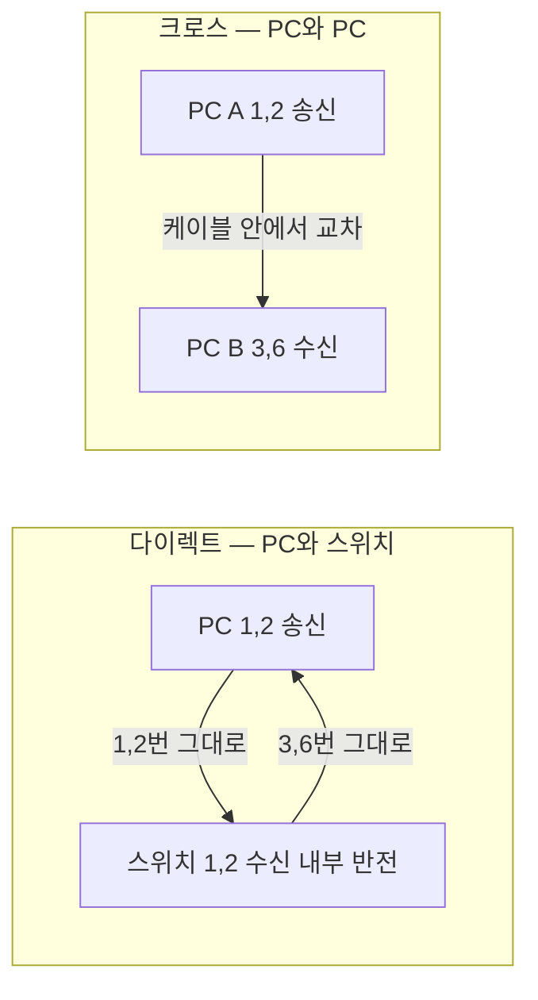
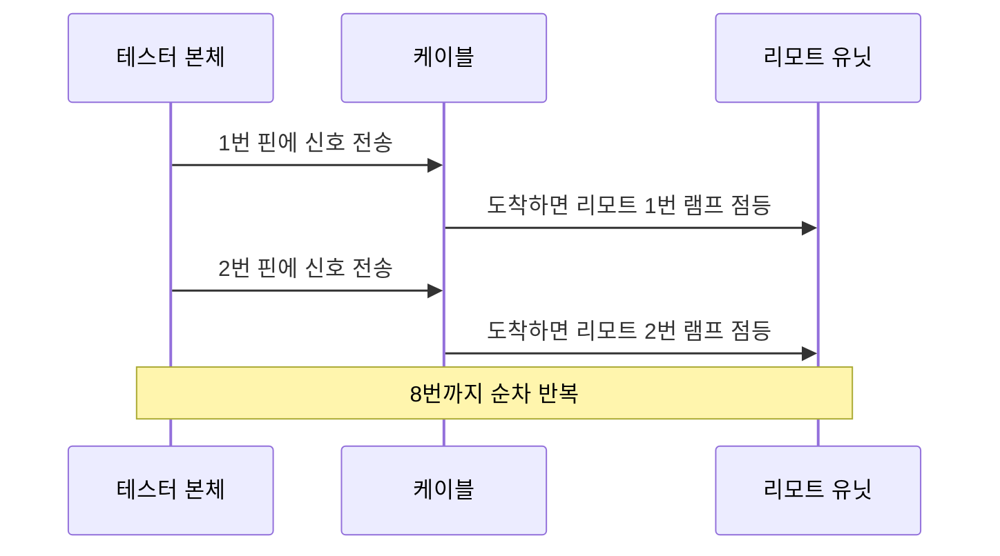

<Callout type="info">
  **이번 문서의 목표:** 이 파일을 다 읽으면 "공유기와 IP Phone을 연결하시오" 같은 문장 하나만 보고 다이렉트인지 크로스인지 즉시 판별하고, 규격대로 제작한 뒤 테스터 램프를 보고 불량 유형까지 짚어낼 수 있다.
</Callout>

## 0. 실기 1번 문제의 정체

케이블 문제의 지시문은 두 가지 형태로 나옵니다.

- **직접 지정형** — "다이렉트 케이블(T568B)을 제작하시오" (2024년 1회)
- **상황 판별형** — "공유기와 사내 IP Phone을 연결하기 위한 UTP 케이블을 제작하시오" (2026년 3회)

직접 지정형은 색 순서만 맞추면 됩니다. 무서운 것은 **상황 판별형**입니다. 여기서 다이렉트와 크로스를 거꾸로 판단하면, 아무리 예쁘게 압착해도 0점입니다. 그래서 이번 편은 판별 규칙부터 시작합니다.

## 1. 왜 두 종류의 케이블이 필요한가

### 문제 상황 — 입과 귀가 마주 봐야 한다

02편에서 봤듯이 100Mbps 이더넷에서 1·2번은 **송신**(TX, Transmit), 3·6번은 **수신**(RX, Receive)입니다.

두 대의 PC를 랜선으로 직접 이었다고 생각해 봅시다. 양쪽 모두 1·2번이 송신입니다. 그러면 A의 입(1·2번)이 B의 입(1·2번)에 연결됩니다. **둘 다 말만 하고 아무도 듣지 않습니다.** 통신이 될 리가 없습니다.

> **쉽게 말하면:** 전화기 두 대를 이을 때는 한쪽의 입이 반대쪽의 귀에 닿아야 합니다. 입끼리, 귀끼리 이으면 대화가 안 됩니다.

### 해결책 두 가지

이 문제를 푸는 방법은 두 가지입니다.

**방법 1 — 케이블 안에서 꼬아 준다.** 한쪽 끝은 T568A, 반대쪽 끝은 T568B로 배열하면 1·2번과 3·6번이 서로 자리를 바꿔 연결됩니다. 이것이 **크로스 케이블**(crossover cable, 교차 케이블)입니다.

**방법 2 — 장비 안에서 꼬아 준다.** 허브와 스위치는 애초에 포트 내부에서 송수신이 뒤집혀 있습니다. 그래서 PC와 스위치를 이을 때는 케이블을 꼬을 필요가 없습니다. 양쪽 다 T568B로 만든 **다이렉트 케이블**(direct cable, 스트레이트 케이블 straight-through cable)을 씁니다.

## 2. 다이렉트와 크로스 판별 규칙

### 계층으로 나누는 전통 규칙

장비를 두 무리로 나눕니다.

| 무리 | 장비 | 특징 |
|------|------|------|
| 단말 쪽 (DTE) | PC, 라우터, 서버, IP Phone, 프린터, IP 카메라 | 1·2번으로 송신 |
| 중계 쪽 (DCE) | 허브, 스위치, 공유기의 LAN 포트, AP | 포트 내부에서 송수신 반전 |

DTE는 Data Terminal Equipment(데이터 단말 장치), DCE는 Data Circuit-terminating Equipment(회선 종단 장치)의 약자입니다.

판별 규칙은 딱 한 줄입니다.

> **서로 다른 무리끼리 연결하면 다이렉트, 같은 무리끼리 연결하면 크로스.**

| 연결 상황 | 무리 조합 | 케이블 |
|----------|----------|--------|
| PC ↔ 스위치 | 단말 + 중계 | 다이렉트 |
| PC ↔ 허브 | 단말 + 중계 | 다이렉트 |
| PC ↔ 공유기 LAN 포트 | 단말 + 중계 | 다이렉트 |
| 공유기 ↔ IP Phone | 중계 + 단말 | 다이렉트 |
| 라우터 ↔ 스위치 | 단말 + 중계 | 다이렉트 |
| 스위치 ↔ 허브 | 중계 + 중계 | 크로스 |
| PC ↔ PC | 단말 + 단말 | 크로스 |
| 라우터 ↔ 라우터 | 단말 + 단말 | 크로스 |
| 스위치 ↔ 스위치 | 중계 + 중계 | 크로스 |

**라우터를 단말 무리에 넣는 것**이 처음에는 어색합니다. 라우터는 크고 중요한 장비지만, 이더넷 포트의 전기적 배치만 놓고 보면 PC와 똑같이 1·2번으로 송신합니다. 그래서 "PC와 같은 편"이라고 외우면 됩니다.

> **쉽게 말하면:** 라우터는 덩치는 크지만 랜 포트 성격은 PC와 같습니다.

### 기출 문장을 판별해 보기

기출 8회분에서 케이블 문제 상황이 어떻게 나왔는지, 각각을 판별해 봅니다.

<Steps>

### "허브·스위치와 PC를 연결하여 정상 통신이 가능하도록"

중계 장비와 단말 장비의 조합입니다. 서로 다른 무리이므로 **다이렉트**, 양쪽 모두 T568B입니다.

### "공유기와 PC를 연결하여 정상 통신이 가능하도록"

공유기의 LAN 포트는 내부적으로 스위치입니다. 중계 + 단말이므로 **다이렉트**입니다.

### "새로운 식권 발급기를 네트워크(공유기)에 연결하려고 합니다"

식권 발급기는 낯설지만, 네트워크에 접속하는 최종 장치이므로 단말입니다. 공유기는 중계입니다. 따라서 **다이렉트**입니다.

### "공유기와 사내 IP Phone을 연결하기 위한 UTP 케이블"

IP Phone은 IP 주소를 받아 통신하는 단말입니다. 중계 + 단말이므로 **다이렉트**입니다.

</Steps>

**결과 해석:** 기출에서 요구된 것은 전부 다이렉트였습니다. 그렇다고 크로스를 버리면 안 됩니다. "두 대의 스위치를 직접 연결" 같은 문장이 언제든 나올 수 있고, 크로스 핀맵 자체가 단답형·선택형 소재이기도 합니다.

### Auto MDI/MDIX — 현실과 시험의 차이

요즘 장비는 대부분 **Auto MDI/MDIX** 기능이 있습니다. MDI는 Medium Dependent Interface(매체 종속 인터페이스), MDIX는 그 X(crossover, 교차) 버전입니다. 이 기능이 있으면 장비가 상대의 배선을 감지해 스스로 송수신을 뒤집어 줍니다. 그래서 **현실에서는 스위치끼리를 다이렉트로 이어도 통신이 됩니다.**

**시험에서는 이 사실을 근거로 답을 바꾸면 안 됩니다.** 실기 채점은 규격상 올바른 케이블 종류와 핀맵을 봅니다. "요즘은 아무거나 되니까"는 채점표에 없습니다.

## 3. 두 케이블의 핀맵을 눈으로 확인하기

### 다이렉트 케이블 — 양쪽 모두 T568B

| 핀 | A쪽 (T568B) | B쪽 (T568B) | 연결 |
|----|-----------|-----------|------|
| 1 | 주황띠 | 주황띠 | 1번 대 1번 |
| 2 | 주황 | 주황 | 2번 대 2번 |
| 3 | 초록띠 | 초록띠 | 3번 대 3번 |
| 4 | 파랑 | 파랑 | 4번 대 4번 |
| 5 | 파랑띠 | 파랑띠 | 5번 대 5번 |
| 6 | 초록 | 초록 | 6번 대 6번 |
| 7 | 갈색띠 | 갈색띠 | 7번 대 7번 |
| 8 | 갈색 | 갈색 | 8번 대 8번 |

같은 번호끼리 곧게(straight) 이어지므로 스트레이트 케이블이라고도 부릅니다.

### 크로스 케이블 — 한쪽 T568A, 반대쪽 T568B

| 핀 | A쪽 (T568A) | B쪽 (T568B) | 실제 연결 |
|----|-----------|-----------|----------|
| 1 | 초록띠 | 주황띠 | A의 1번이 B의 3번에 도달 |
| 2 | 초록 | 주황 | A의 2번이 B의 6번에 도달 |
| 3 | 주황띠 | 초록띠 | A의 3번이 B의 1번에 도달 |
| 4 | 파랑 | 파랑 | 4번 대 4번 |
| 5 | 파랑띠 | 파랑띠 | 5번 대 5번 |
| 6 | 주황 | 초록 | A의 6번이 B의 2번에 도달 |
| 7 | 갈색띠 | 갈색띠 | 7번 대 7번 |
| 8 | 갈색 | 갈색 | 8번 대 8번 |

여기서 "실제 연결" 열의 의미를 정확히 이해해야 합니다. 케이블 안의 **같은 색 가닥끼리** 이어져 있습니다. A쪽에서 초록띠는 1번 자리에 꽂혀 있고, B쪽에서 같은 초록띠 가닥은 3번 자리에 꽂혀 있습니다. 그래서 A의 1번 핀 신호가 B의 3번 핀으로 나옵니다.

**결과 해석:** A의 송신(1·2번)이 B의 수신(3·6번)에 정확히 닿습니다. 이것이 크로스가 하는 일 전부입니다.

### 롤오버 케이블 — 참고로만

**롤오버 케이블**(rollover cable)은 양 끝의 핀 순서를 완전히 뒤집은(1↔8, 2↔7, 3↔6, 4↔5) 케이블로, 라우터·스위치의 **콘솔 포트**에 PC를 연결해 CLI를 조작할 때 씁니다. 보통 하늘색 납작한 선입니다. 실기에서 직접 제작하라고 나오지는 않지만, 05편에서 라우터 CLI에 접속할 때 개념적으로 등장하므로 이름은 기억해 두십시오.

## 4. 제작 순서 — 탈피부터 압착까지

실기장에서 지급되는 도구는 보통 UTP 케이블, RJ-45 커넥터, **크림핑 툴**(crimping tool, 압착 공구), 케이블 테스터입니다. 크림핑 툴에는 대개 피복을 벗기는 칼날과 케이블을 자르는 칼날이 함께 달려 있습니다.

<Steps>

### 1단계 — 케이블 끝을 깨끗이 자른다

크림핑 툴의 절단 칼날로 케이블 끝을 **수직으로** 자릅니다. 비스듬히 잘리면 8가닥의 길이가 제각각이 되어 나중에 앞까지 닿지 않는 가닥이 생깁니다.

### 2단계 — 바깥 피복을 약 2센티미터 벗긴다

탈피 홈에 케이블을 넣고 가볍게 쥔 뒤 한 바퀴 돌려 피복만 끊고 잡아 뺍니다. **속선의 피복까지 벗기면 안 됩니다.** 힘을 세게 주면 구리선에 상처가 나고, 그 자리가 나중에 끊어집니다. 상처가 의심되면 아깝다 생각 말고 잘라내고 다시 하십시오.

### 3단계 — 4쌍의 꼬임을 푼다

파랑·주황·초록·갈색 네 쌍을 하나씩 풀어 8가닥을 분리합니다. 이때 **꼬임을 푸는 길이는 최소한**으로 합니다.

### 4단계 — T568B 순서로 나란히 배열한다

왼쪽부터 **주황띠 – 주황 – 초록띠 – 파랑 – 파랑띠 – 초록 – 갈색띠 – 갈색**입니다. 엄지와 검지로 눌러 8가닥을 한 평면에 납작하게 폅니다. 배열 후 **한 번 더 소리 내어 색을 읽으며 검산**하십시오. 이 검산이 케이블 문제의 합격을 좌우합니다.

### 5단계 — 끝을 일직선으로 자른다

배열이 끝나면 8가닥 끝을 절단 칼날로 한 번에 잘라 **길이를 똑같이** 맞춥니다. 피복 끝에서 약 13밀리미터가 남도록 자릅니다. 길이가 들쭉날쭉하면 짧은 가닥이 접점에 닿지 않습니다.

### 6단계 — 커넥터에 밀어 넣는다

RJ-45 커넥터를 걸쇠가 아래를 향하게 잡고, 배열한 8가닥을 흐트러뜨리지 않은 채 밀어 넣습니다. **두 가지를 눈으로 확인**합니다.

- 8가닥 모두가 커넥터 맨 앞 투명 부분까지 닿아 있는가
- 바깥 피복이 커넥터 안쪽 턱까지 들어가 있는가

### 7단계 — 크림핑 툴로 압착한다

커넥터를 툴의 8핀 홈에 넣고 **딸깍 소리가 날 때까지 끝까지** 눌러 줍니다. 압착은 되돌릴 수 없습니다. 반드시 6단계 확인을 마친 뒤에 누르십시오.

### 8단계 — 반대쪽도 같은 방법으로

다이렉트라면 반대쪽도 T568B로, 크로스라면 반대쪽을 T568A로 만듭니다.

### 9단계 — 테스터로 검사한다

두 커넥터를 테스터 본체와 리모트에 각각 꽂고 전원을 켜 램프를 확인합니다.

</Steps>

**자주 틀리는 점 정리**

| 실수 | 결과 | 예방법 |
|------|------|-------|
| 걸쇠 방향을 반대로 잡고 배열 | 8핀 전체가 좌우 반전 | 걸쇠를 아래로, 금속 면을 위로 고정 |
| 4번과 5번을 파랑띠–파랑 순으로 배열 | 규격 위반, 기가비트 링크 실패 | 4번은 단색 파랑 |
| 8가닥을 끝까지 밀지 않음 | 일부 핀 미접촉, 테스터에서 불 안 켜짐 | 압착 전 앞면 투명 부분 육안 확인 |
| 피복을 너무 많이 벗김 | 피복이 커넥터에 안 물려 선이 빠짐 | 피복 끝에서 약 13밀리미터 |
| 속선 피복까지 벗김 | 구리선 손상, 단선 | 탈피 시 힘을 약하게 |
| 반대쪽 배열을 확인 없이 진행 | 다이렉트를 만들려다 크로스가 됨 | 두 커넥터를 나란히 놓고 색 비교 |

## 5. 케이블 테스터 결과 읽기

### 테스터의 구조

**케이블 테스터**(cable tester)는 본체(마스터)와 리모트(원격 유닛) 두 조각으로 되어 있습니다. 케이블 한쪽 끝을 본체에, 반대쪽 끝을 리모트에 꽂고 전원을 켜면, 본체가 1번 핀부터 8번 핀까지 차례로 신호를 흘려보냅니다. 신호가 반대쪽에 도착하면 양쪽 램프가 그 번호에서 동시에 켜집니다.

### 정상 판정

- **다이렉트 케이블**: 본체와 리모트의 램프가 **1-1, 2-2, 3-3, … 8-8** 순서로 나란히 켜집니다.
- **크로스 케이블**: **1-3, 2-6, 3-1, 4-4, 5-5, 6-2, 7-7, 8-8** 순서로 켜집니다. 1·2·3·6번 자리가 교차하고 나머지는 그대로입니다.

크로스인데 1-1로 켜졌다면 다이렉트를 만든 것이고, 다이렉트인데 1-3으로 켜졌다면 크로스를 만든 것입니다.

### 불량 유형별 판정

| 램프 상태 | 불량 이름 | 원인 | 조치 |
|----------|----------|------|------|
| 특정 번호에서 양쪽 모두 불이 안 켜짐 | 단선 (Open) | 그 가닥이 접점에 닿지 않음, 압착 불량, 구리선 끊김 | 그쪽 커넥터를 잘라내고 재제작 |
| 아무 번호도 안 켜짐 | 전체 단선 | 커넥터가 덜 물림, 케이블 자체 절단 | 양쪽 재제작, 테스터 배터리도 확인 |
| 두 번호가 서로 뒤바뀌어 켜짐 | 오배선 (Miswire) | 색 순서를 잘못 배열 | 잘못된 쪽 재제작 |
| 두 가닥이 동시에 켜짐 | 단락 (Short) | 구리선끼리 닿음, 탈피 시 피복 손상 | 손상 구간 잘라내고 재제작 |
| 쌍 단위로 자리가 바뀜 (예: 1-3, 2-6이 아닌 1-2, 3-6 방식) | 스플릿 페어 (Split Pair) | 쌍을 지키지 않고 색만 자리 맞춤 | 쌍 구성부터 다시 확인 |

**스플릿 페어**를 조금 더 설명하겠습니다. 도통 검사만 하는 저가 테스터는 "1번 신호가 1번으로 나온다"까지만 봅니다. 그런데 신호가 **꼬인 쌍을 타고** 가지 않고 서로 다른 쌍의 가닥을 하나씩 빌려 타고 가면, 도통은 정상인데 누화 상쇄가 무너져 실제 통신에서 오류가 폭증합니다. 색 순서를 지키면 자동으로 예방되므로, 결국 답은 같습니다. **색 순서를 정확히 지키십시오.**

**자주 틀리는 점:** 테스터에서 1·2·3·6번만 켜지는 것을 보고 "100Mbps는 이 네 가닥만 쓰니까 정상"이라고 판단하는 실수입니다. 실기 채점은 **8핀 전부**를 봅니다. 4·5·7·8번이 안 켜지면 불합격 케이블입니다.

## 6. 시험장 시간 배분 요령

케이블 문제 하나에 지나치게 오래 매달리면 뒤의 17문제가 무너집니다. 권장 흐름은 이렇습니다.

1. **먼저 판별을 확정**합니다 (30초). 다이렉트인지 크로스인지 종이 귀퉁이에 적어 둡니다.
2. **한쪽 커넥터를 제작**합니다 (3분).
3. **반대쪽을 제작**합니다 (3분).
4. **테스터로 검사**합니다 (1분). 정상이면 제출하고 다음 문제로 넘어갑니다.
5. 불량이면 **문제 쪽 커넥터만** 잘라 다시 만듭니다. 양쪽을 다 버리지 마십시오.

재료는 보통 여유 있게 지급되지만 무한하지 않습니다. 커넥터를 낭비하지 않으려면 **압착 전 육안 확인**이 최선의 절약입니다.

## 핵심 정리

- 케이블 종류 판별은 무리 규칙 한 줄로 끝난다. 단말(PC·라우터·IP Phone)과 중계(허브·스위치·공유기 LAN 포트)가 서로 다르면 다이렉트, 같으면 크로스다.
- 다이렉트는 양쪽 모두 T568B, 크로스는 한쪽 T568A와 반대쪽 T568B다.
- 크로스는 1·2번 송신을 3·6번 수신에 연결해 준다. 4·5·7·8번은 그대로다.
- 제작 순서는 절단 → 탈피 → 꼬임 풀기 → 배열 → 길이 맞춰 자르기 → 삽입 → 육안 확인 → 압착 → 테스트다. 압착은 되돌릴 수 없으므로 확인이 먼저다.
- 테스터에서 다이렉트는 1-1부터 8-8까지, 크로스는 1-3, 2-6, 3-1, 6-2 형태로 켜져야 정상이다.
- Auto MDI/MDIX 덕에 현실에서는 아무 케이블이나 통해도, 채점은 규격만 본다.

## 마무리 복습

<Quiz
  questionNumber={1}
  question="공유기의 LAN 포트와 사내 IP Phone을 연결할 때 제작해야 하는 케이블과 배열은?"
  options={['크로스 케이블, 한쪽 T568A 반대쪽 T568B', '다이렉트 케이블, 양쪽 모두 T568B', '롤오버 케이블, 양쪽 핀 순서를 반대로', '크로스 케이블, 양쪽 모두 T568A']}
  correctAnswer={2}
  explanation="공유기 LAN 포트는 내부가 스위치인 중계 장비이고 IP Phone은 단말 장비다. 서로 다른 무리를 연결하므로 다이렉트 케이블을 양쪽 T568B로 제작한다."
  optionExplanations={['크로스는 같은 무리끼리 연결할 때 쓴다', '정답 — 중계와 단말의 조합이므로 다이렉트다', '롤오버는 콘솔 포트 접속용이며 데이터 통신용이 아니다', '양쪽 모두 T568A로 만들면 크로스가 아니라 다이렉트가 된다']}
/>

<Quiz
  questionNumber={2}
  question="다음 중 크로스 케이블을 사용해야 하는 연결은?"
  options={['PC와 스위치', '라우터와 스위치', '스위치와 스위치', 'PC와 공유기 LAN 포트']}
  correctAnswer={3}
  explanation="스위치와 스위치는 둘 다 중계 장비로 같은 무리이므로 크로스가 필요하다. 나머지는 모두 단말과 중계의 조합이라 다이렉트를 쓴다."
  optionExplanations={['단말과 중계의 조합이므로 다이렉트다', '라우터는 랜 포트 성격이 PC와 같은 단말 무리다', '정답 — 같은 무리끼리이므로 교차가 필요하다', '공유기 LAN 포트는 스위치와 같은 중계 장비다']}
/>

<Quiz
  questionNumber={3}
  question="크로스 케이블에서 A쪽 1번 핀의 신호는 B쪽 몇 번 핀으로 도달하는가?"
  options={['1번', '2번', '3번', '6번']}
  correctAnswer={3}
  explanation="크로스는 송신 쌍 1번 2번을 수신 쌍 3번 6번에 연결한다. 1번은 3번으로 2번은 6번으로 간다. 4 5 7 8번은 자리가 바뀌지 않는다."
  optionExplanations={['1번 대 1번은 다이렉트 케이블의 연결 방식이다', '2번은 1번의 짝 가닥이지 목적지가 아니다', '정답 — 1번 송신 플러스가 3번 수신 플러스로 간다', '6번으로 가는 것은 A쪽 2번 핀이다']}
/>

<Quiz
  questionNumber={4}
  question="케이블 테스터 검사 결과 5번 자리에서만 양쪽 램프가 켜지지 않았다. 가장 가능성이 높은 원인은?"
  options={['서브넷 마스크 설정 오류', '파랑띠 가닥이 커넥터 접점까지 닿지 않은 단선', '두 가닥이 서로 닿아 발생한 단락', '케이블 길이가 100미터를 초과함']}
  correctAnswer={2}
  explanation="특정 번호 하나에서만 램프가 켜지지 않는 것은 그 가닥의 단선을 뜻한다. T568B에서 5번은 파랑띠이며 밀어 넣기 부족이나 구리선 손상이 원인이다. 단락이라면 두 램프가 동시에 켜진다."
  optionExplanations={['테스터는 물리적 도통만 검사하며 IP 설정과 무관하다', '정답 — 단일 핀 미점등은 그 가닥의 단선이다', '단락일 경우 램프가 안 켜지는 것이 아니라 둘이 동시에 켜진다', '길이 초과는 특정 핀만 죽는 증상을 만들지 않는다']}
/>

<Quiz
  questionNumber={5}
  question="다이렉트 케이블 제작 시 8가닥의 끝 길이를 똑같이 잘라야 하는 이유로 가장 알맞은 것은?"
  options={['커넥터의 걸쇠가 잠기지 않기 때문', '짧은 가닥이 커넥터 앞 접점까지 닿지 못해 단선이 되기 때문', '케이블 색 구분이 어려워지기 때문', '전송 속도가 자동으로 낮아지기 때문']}
  correctAnswer={2}
  explanation="8가닥 길이가 다르면 짧은 가닥이 커넥터 맨 앞 금속 접점에 닿지 못한다. 압착 후에는 되돌릴 수 없으므로 자르기 단계에서 길이를 맞추고 삽입 후 육안으로 확인해야 한다."
  optionExplanations={['걸쇠 잠금은 상대 포트와의 결합 문제이지 가닥 길이와 무관하다', '정답 — 미접촉이 곧 단선으로 나타난다', '색 구분은 길이와 관계없다', '속도 저하는 결과일 수 있으나 직접적 이유는 접점 미접촉이다']}
/>

<Quiz
  questionNumber={6}
  question="Auto MDI/MDIX 기능에 대한 설명으로 옳지 않은 것은?"
  options={['장비가 상대의 배선을 감지해 송수신을 스스로 뒤집는 기능이다', '이 기능 덕분에 현실에서는 스위치끼리 다이렉트로 이어도 통신된다', '이 기능이 있으므로 실기 시험에서도 케이블 종류를 자유롭게 선택해도 된다', 'MDI는 매체 종속 인터페이스를 뜻한다']}
  correctAnswer={3}
  explanation="Auto MDI/MDIX는 현실의 편의 기능일 뿐이며 실기 채점은 규격상 올바른 케이블 종류와 핀맵을 본다. 통신이 되더라도 종류를 잘못 고르면 오답이다."
  optionExplanations={['기능의 정의로 맞는 설명이다', '실제 현장에서 자주 관찰되는 맞는 설명이다', '정답(옳지 않은 설명) — 채점 기준은 규격 준수다', 'Medium Dependent Interface의 우리말 풀이가 맞다']}
/>

<Quiz
  questionNumber={7}
  question="라우터나 스위치의 콘솔 포트에 PC를 연결해 CLI를 조작할 때 사용하는 케이블은?"
  options={['다이렉트 케이블', '크로스 케이블', '롤오버 케이블', '광 점퍼 케이블']}
  correctAnswer={3}
  explanation="롤오버 케이블은 양 끝의 핀 순서를 완전히 뒤집은 케이블로 콘솔 접속 전용이다. 다이렉트와 크로스는 데이터 통신용이다."
  optionExplanations={['다이렉트는 단말과 중계를 잇는 데이터용이다', '크로스는 같은 무리끼리 잇는 데이터용이다', '정답 — 1번과 8번이 뒤집힌 콘솔 전용 케이블이다', '광 점퍼는 광 모듈 간 연결용으로 콘솔과 무관하다']}
/>

<Quiz
  questionNumber={8}
  question="테스터에서 1번부터 8번까지 모두 켜졌지만 실제 기가비트 통신 시 오류가 많다. 의심할 수 있는 불량은?"
  options={['스플릿 페어', '전체 단선', '커넥터 걸쇠 파손', '서브넷 불일치']}
  correctAnswer={1}
  explanation="스플릿 페어는 도통 검사에서는 정상으로 보이지만 신호가 꼬인 쌍을 타지 않아 누화 상쇄가 무너진다. 색 순서를 규격대로 지키면 예방된다."
  optionExplanations={['정답 — 도통은 정상인데 쌍 구성이 어긋난 상태다', '전체 단선이면 램프가 아예 켜지지 않는다', '걸쇠 파손은 물리적 고정 문제일 뿐 신호 품질과 무관하다', '서브넷 불일치는 IP 설정 문제이며 테스터와 무관하다']}
/>

## 참고 자료

- [ANSI/TIA-568 표준 개요](https://fr.wikipedia.org/wiki/ANSI/TIA-568)
- [TIA/EIA-568-B 개요](https://cs.wikipedia.org/wiki/TIA/EIA-568-B)
- [네트워크관리사 2급 실기 정리 자료](https://devbirdfeet.tistory.com/296)
