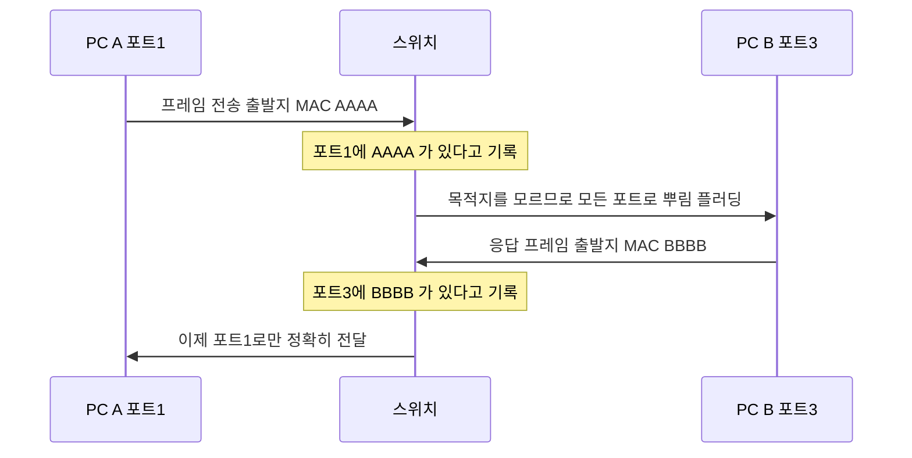
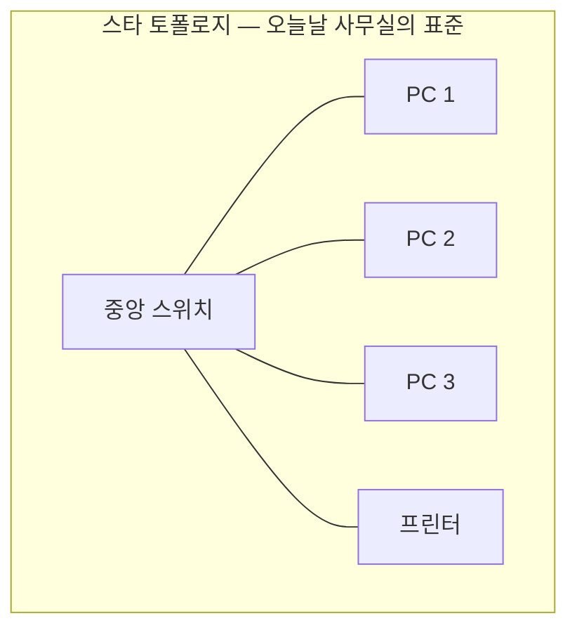
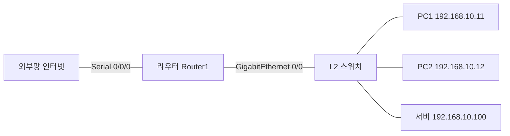
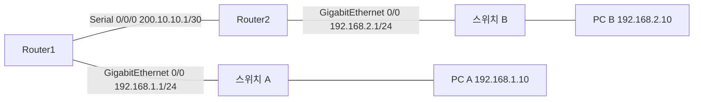

<Callout type="info">
  **이번 문서의 목표:** 이 파일을 다 읽으면 시험지에 그려진 네트워크 구성도를 보고 어떤 장비가 몇 계층인지, 각 구간에 어떤 케이블이 필요한지, 어느 인터페이스에 어떤 IP를 넣어야 하는지를 종이에 옮겨 적을 수 있다.
</Callout>

## 0. 구성도를 읽는 일이 왜 채점과 직결되는가

실기 문제지에는 라우터·스위치·PC가 그려진 그림이 함께 나옵니다. 이 그림은 장식이 아닙니다. 그림 안에 **어느 인터페이스에 무슨 IP를 넣을지, 어떤 케이블을 만들지**가 숨어 있습니다.

기출을 보면 이런 문장이 나옵니다.

- "ROUTER2의 Serial 0/0 인터페이스에 아래 조건에 따라 IP를 설정하고" (2024년 2회)
- "GigabitEthernet 0/0 방향: 192.70.100.0/24, Serial 0/3/0 방향: 193.170.60.0/24" (2026년 3회)
- "새로운 식권 발급기를 네트워크(공유기)에 연결하기 위해" (2023년 4회)

세 문장 모두 **어느 장비의 어느 포트인가**를 정확히 짚어야 답이 나옵니다. 이번 편은 그 독해력을 만듭니다.

## 1. 장비를 계층으로 구분하기

### 왜 계층으로 구분하는가

같은 "네트워크 장비"라도 하는 일이 전혀 다릅니다. 어느 계층에서 일하는지를 알면 **그 장비가 무엇을 보고 판단하는지**가 저절로 결정됩니다.

> **쉽게 말하면:** 1계층 장비는 신호만 보고, 2계층 장비는 MAC 주소를 보고, 3계층 장비는 IP 주소를 봅니다. 무엇을 보느냐가 곧 그 장비의 능력 한계입니다.

### 장비별 정리표

| 장비 | 계층 | 판단 기준 | 충돌 도메인 | 브로드캐스트 도메인 |
|------|------|----------|-----------|------------------|
| 리피터 (Repeater) | 1 | 없음, 신호 증폭만 | 1개로 유지 | 1개로 유지 |
| 허브 (Hub) | 1 | 없음, 모든 포트로 복사 | 1개로 유지 | 1개로 유지 |
| 브리지 (Bridge) | 2 | MAC 주소 | 포트마다 분리 | 1개로 유지 |
| 스위치 (Switch) | 2 | MAC 주소 | 포트마다 분리 | 1개로 유지 (VLAN으로 분리 가능) |
| 라우터 (Router) | 3 | IP 주소 | 포트마다 분리 | 포트마다 분리 |
| L3 스위치 | 3 | IP 주소 | 포트마다 분리 | VLAN마다 분리 |
| 게이트웨이 (Gateway) | 4–7 | 프로토콜 변환 | 분리 | 분리 |

### 충돌 도메인과 브로드캐스트 도메인 — 그 자리에서 풀기

표에 나온 두 용어를 지금 이해하고 갑니다.

**충돌 도메인**(collision domain, 충돌 영역)은 **두 장비가 동시에 말하면 신호가 부딪히는 범위**입니다. 옛 이더넷은 하나의 선을 여럿이 나눠 쓰는 구조라, 동시에 신호를 보내면 파형이 섞여 둘 다 못 알아듣습니다. 이를 충돌(collision)이라 하고, 그 범위가 충돌 도메인입니다.

허브는 들어온 신호를 **모든 포트로 그대로 복사**하므로, 허브에 물린 모든 장비가 하나의 충돌 도메인에 들어갑니다. 8포트 허브에 8대가 물려 있으면 8대가 한 방에서 동시에 떠드는 셈입니다.

스위치는 다릅니다. 스위치는 **포트마다 충돌 도메인을 나눕니다.** 각 포트가 독립된 방이 되어, 1번 포트와 2번 포트가 동시에 말해도 부딪히지 않습니다. 이것이 허브가 사라지고 스위치가 표준이 된 이유입니다.

**브로드캐스트 도메인**(broadcast domain, 브로드캐스트 영역)은 **"모두에게"라고 외친 신호가 도달하는 범위**입니다. ARP 요청처럼 "이 IP 쓰는 사람 누구냐"를 물을 때 브로드캐스트를 씁니다.

스위치는 브로드캐스트를 막지 못합니다. 목적지 MAC이 브로드캐스트 주소(`FF-FF-FF-FF-FF-FF`)면 모든 포트로 뿌립니다. 그래서 스위치만 잔뜩 늘리면 브로드캐스트가 전 구간에 퍼져 성능이 떨어집니다.

**라우터는 브로드캐스트를 통과시키지 않습니다.** 라우터의 각 포트가 서로 다른 브로드캐스트 도메인이 됩니다. 그리고 스위치에서 브로드캐스트 도메인을 논리적으로 나누는 기술이 바로 **VLAN**입니다. 07편의 주제입니다.

| 목표 | 쓰는 장비·기술 |
|------|--------------|
| 충돌 도메인을 나누고 싶다 | 스위치 |
| 브로드캐스트 도메인을 나누고 싶다 | 라우터 또는 VLAN |

### 스위치는 어떻게 목적지를 아는가

스위치가 MAC 주소를 보고 판단한다고 했는데, 처음에는 아무것도 모릅니다. 학습 과정은 이렇습니다.

이 표를 **MAC 주소 테이블**(MAC address table) 또는 CAM 테이블이라고 합니다. 목적지를 모를 때 모든 포트로 뿌리는 동작을 **플러딩**(flooding, 범람)이라고 합니다.

> **쉽게 말하면:** 스위치는 처음 온 편지의 발신인 주소를 보고 "이 사람은 3번 방 사람이구나"를 적어 두는 경비원입니다.

### 무선 장비

**AP**(Access Point, 무선 접속 장치)는 무선 신호와 유선 이더넷을 이어 주는 장비로, 기본적으로 2계층에서 동작합니다. 무선 구간을 유선 랜에 다리 놓아 주는 역할입니다.

**공유기**(SOHO router, 가정용 라우터)는 한 몸에 여러 기능이 들어 있습니다.

- WAN 포트 쪽: 라우터 기능 + NAT(주소 변환)
- LAN 포트 쪽: 스위치 기능
- 무선 쪽: AP 기능
- 부가: DHCP 서버 기능

그래서 케이블 판별 문제에서 "공유기"가 나오면, **LAN 포트에 무엇을 연결하는가**를 봐야 합니다. LAN 포트는 스위치, 즉 중계 장비입니다. 03편의 판별 규칙대로 단말과 연결하면 다이렉트입니다.

## 2. LAN·WAN·MAN — 규모로 나눈 이름

| 이름 | 풀이 | 범위 | 예 |
|------|------|------|-----|
| LAN | Local Area Network | 건물·층 단위 | 사무실 하나의 유선망 |
| MAN | Metropolitan Area Network | 도시 단위 | 도시 내 캠퍼스 연결망 |
| WAN | Wide Area Network | 도시·국가를 넘는 범위 | 본사와 지사 전용선, 인터넷 |

실기에서 이 구분이 실제로 쓰이는 자리는 **인터페이스 이름**입니다.

- **이더넷 계열 인터페이스**(FastEthernet, GigabitEthernet)는 주로 LAN 쪽에 붙습니다.
- **시리얼 인터페이스**(Serial)는 주로 WAN 쪽, 즉 통신사 전용선 쪽에 붙습니다.

그래서 구성도에서 라우터의 어느 포트에 무엇이 그려져 있는지를 보면, 그 구간이 사내망인지 외부 연결인지 바로 읽힙니다.

## 3. 토폴로지 — 연결 모양

**토폴로지**(topology)는 장비를 어떤 모양으로 연결했는가를 뜻합니다.

| 토폴로지 | 모양 | 장점 | 단점 |
|---------|------|------|------|
| 버스 (Bus) | 하나의 굵은 선에 모두 매달림 | 배선이 간단하고 저렴 | 선 하나가 끊기면 전체 마비 |
| 스타 (Star) | 중앙 장비에 모두 연결 | 한 가닥 고장이 다른 곳에 영향 없음 | 중앙 장비 고장 시 전체 마비 |
| 링 (Ring) | 고리 모양으로 순환 | 충돌이 없고 예측 가능 | 한 곳이 끊기면 전체 영향 |
| 메시 (Mesh) | 서로가 서로에게 직접 연결 | 경로가 여러 개라 매우 튼튼 | 선이 폭발적으로 늘어 비쌈 |
| 트리 (Tree) | 스타를 계층으로 쌓음 | 확장이 쉬움 | 상위 노드 고장 시 하위 전체 영향 |

오늘날 사무실 유선망은 **거의 전부 스타 토폴로지**입니다. 중앙에 스위치를 놓고 각 자리로 한 가닥씩 뻗습니다. 그리고 층마다 있는 스위치를 상위 스위치에 묶으면 자연스럽게 트리 구조가 됩니다.

메시 토폴로지에서 장비가 $n$대일 때 필요한 링크 수는 다음과 같습니다.

$$
\frac{n(n-1)}{2}
$$

- $n$: 연결할 장비의 대수
- 분자 부분: 각 장비가 자신을 뺀 나머지 모두와 연결되는 경우의 수
- 2로 나누는 이유: A와 B의 연결, B와 A의 연결은 같은 한 가닥이므로 중복을 제거

장비가 10대라면 이렇게 됩니다.

$$
\frac{10 \times 9}{2} = 45
$$

**결과 해석:** 10대만 되어도 45가닥이 필요합니다. 100대면 4,950가닥입니다. 메시가 현실에서 잘 쓰이지 않고, 대신 중앙 집중형인 스타·트리가 표준이 된 이유가 이 계산에 있습니다.

## 4. 구성도에서 단서 읽기

### 시험에 나오는 전형적인 구성도

기출 문제가 전제하는 그림은 대체로 이런 형태입니다.

이 한 장에서 읽어야 할 단서는 다섯 가지입니다.

<Steps>

### 단서 1 — 인터페이스 이름을 그대로 옮겨 적는다

`GigabitEthernet 0/0`인지 `FastEthernet 0/0`인지, 슬래시 뒤 숫자가 `0/0`인지 `0/1`인지를 **글자 그대로** 적습니다. 라우터 문제는 인터페이스 이름 하나만 틀려도 오답입니다.

### 단서 2 — 각 구간의 네트워크 대역을 확인한다

라우터의 이더넷 쪽에 `192.168.10.0/24`가 붙어 있다면, 그 구간의 PC들은 전부 `192.168.10.x`여야 합니다. PC 하나만 `192.168.20.5`로 적혀 있다면 그건 문제의 함정이거나 다른 구간입니다.

### 단서 3 — 게이트웨이가 될 주소를 찾는다

PC들의 게이트웨이는 **같은 구간에 있는 라우터 인터페이스의 IP**입니다. 라우터의 `GigabitEthernet 0/0`이 `192.168.10.1`이라면, 그 아래 PC들의 기본 게이트웨이는 전부 `192.168.10.1`입니다.

### 단서 4 — 케이블 종류를 구간마다 판정한다

라우터와 스위치 사이는 단말 + 중계이므로 다이렉트, 스위치와 PC 사이도 다이렉트입니다. 스위치가 두 대 나란히 그려져 있다면 그 사이만 크로스입니다.

### 단서 5 — 시리얼 구간이 있으면 WAN이다

`Serial`이라는 이름이 보이면 그쪽은 외부 연결이며, 정적 라우팅이나 기본 경로 설정 문제로 이어질 가능성이 높습니다.

</Steps>

### 실전 독해 연습

다음 구성도를 보고 표를 채워 봅시다.

읽어야 할 값들입니다.

| 항목 | 값 | 근거 |
|------|-----|------|
| PC A의 기본 게이트웨이 | 192.168.1.1 | 같은 구간 라우터 인터페이스 IP |
| PC B의 기본 게이트웨이 | 192.168.2.1 | 같은 구간 라우터 인터페이스 IP |
| PC A의 서브넷 마스크 | 255.255.255.0 | /24 표기 |
| Router1과 Router2 사이 마스크 | 255.255.255.252 | /30 표기 |
| Router1이 알아야 할 원격 대역 | 192.168.2.0/24 | Router2 쪽 LAN |
| Router1과 스위치 A 사이 케이블 | 다이렉트 | 단말(라우터) + 중계(스위치) |
| PC A와 스위치 A 사이 케이블 | 다이렉트 | 단말(PC) + 중계(스위치) |

**왜 라우터 사이를 /30으로 잡는가?** /30은 사용 가능 호스트가 2개뿐인 가장 작은 서브넷입니다. 라우터 두 대를 잇는 구간에는 정확히 2개의 주소만 필요하므로 주소 낭비가 없습니다. 실무와 시험 모두에서 라우터 간 링크에 흔히 쓰입니다.

$$
2^{(32-30)} - 2 = 4 - 2 = 2
$$

- 32: IPv4 전체 비트 수
- 30: 프리픽스 길이, 즉 네트워크 부분의 비트 수
- $-2$: 네트워크 주소와 브로드캐스트 주소를 제외

**Router1에 필요한 정적 경로**는 이렇게 도출됩니다. Router1은 자기에게 직접 붙은 `192.168.1.0/24`와 `200.10.10.0/30`은 알지만, `192.168.2.0/24`는 모릅니다. 그래서 "그 대역으로 가려면 200.10.10.2에게 넘겨라"라고 알려 줘야 합니다. 구체적인 명령은 08편에서 다룹니다.

## 5. 구성도를 답안으로 옮기는 체크리스트

시험장에서 구성도를 만나면 다음 순서로 종이에 정리하십시오. 머릿속으로만 하면 반드시 하나를 놓칩니다.

<Steps>

### 1. 장비 목록과 이름을 적는다

Router1, Router2, Switch1처럼 문제에 적힌 이름을 그대로 씁니다. hostname 설정 문제로 이어질 수 있습니다.

### 2. 인터페이스 이름을 장비별로 적는다

`GigabitEthernet 0/0`, `Serial 0/3/0`처럼 슬래시 숫자까지 그대로 옮깁니다.

### 3. 각 인터페이스의 IP와 마스크를 적는다

CIDR로 주어졌다면 점 십진 마스크로 바꿔 함께 적어 둡니다. `/24`는 255.255.255.0, `/30`은 255.255.255.252입니다.

### 4. 각 LAN 구간의 게이트웨이를 적는다

그 구간에 붙은 라우터 인터페이스 IP가 곧 게이트웨이입니다.

### 5. 구간별 케이블 종류를 적는다

무리 규칙(단말 대 중계)으로 다이렉트·크로스를 판정합니다.

### 6. 원격 대역 목록을 적는다

각 라우터가 직접 붙어 있지 않은 대역을 뽑습니다. 이것이 곧 정적 라우팅에 넣을 목적지입니다.

</Steps>

**자주 틀리는 점:** 구성도에 `GigabitEthernet 0/0`이라고 되어 있는데 습관적으로 `fastethernet 0/0`을 입력하는 실수가 대단히 흔합니다. 기출을 보면 회차마다 인터페이스 종류가 다릅니다. 2023년 1회는 FastEthernet, 2023년 4회는 GigabitEthernet, 2026년 3회는 GigabitEthernet과 Serial 0/3/0이 함께 나왔습니다. **문제지에 적힌 이름을 그대로** 치십시오.

## 핵심 정리

- 장비 계층은 허브·리피터가 1, 브리지·스위치·AP가 2, 라우터·L3 스위치가 3이다. 무엇을 보고 판단하는지가 계층을 결정한다.
- 스위치는 포트마다 충돌 도메인을 나누지만 브로드캐스트는 막지 못한다. 브로드캐스트 도메인을 나누려면 라우터나 VLAN이 필요하다.
- 공유기는 WAN 쪽 라우터, LAN 쪽 스위치, 무선 쪽 AP, 여기에 DHCP와 NAT까지 겸한 복합 장비다.
- 이더넷 계열 인터페이스는 LAN 쪽, Serial 인터페이스는 WAN 쪽에 붙는 것이 일반적이다.
- 구성도에서는 인터페이스 이름, 구간별 대역, 게이트웨이 주소, 케이블 종류, 원격 대역 목록 다섯 가지를 반드시 뽑아 적는다.
- 라우터 간 링크는 사용 가능 호스트가 2개인 /30을 쓰는 것이 관례다.

## 마무리 복습

<Quiz
  questionNumber={1}
  question="스위치와 허브의 가장 본질적인 차이로 옳은 것은?"
  options={['스위치는 무선 신호를 처리할 수 있다', '스위치는 포트마다 충돌 도메인을 분리하지만 허브는 전체가 하나의 충돌 도메인이다', '허브는 IP 주소를 보고 전달 경로를 결정한다', '스위치는 브로드캐스트 도메인도 포트마다 나눈다']}
  correctAnswer={2}
  explanation="허브는 들어온 신호를 모든 포트로 복사하므로 전체가 하나의 충돌 도메인이다. 스위치는 MAC 주소 테이블로 목적지 포트에만 전달하며 포트마다 충돌 도메인이 분리된다. 다만 브로드캐스트 도메인은 스위치도 나누지 못한다."
  optionExplanations={['무선 처리는 AP의 역할이다', '정답 — 충돌 도메인 분리가 스위치의 핵심 이점이다', '허브는 1계층 장비로 주소를 전혀 보지 않는다', '브로드캐스트 도메인 분리는 라우터나 VLAN이 담당한다']}
/>

<Quiz
  questionNumber={2}
  question="브로드캐스트 도메인을 나누는 방법으로 알맞은 것을 고르면?"
  options={['허브를 추가로 설치한다', '리피터로 신호를 증폭한다', '라우터를 두거나 스위치에 VLAN을 구성한다', '케이블을 크로스로 교체한다']}
  correctAnswer={3}
  explanation="브로드캐스트는 2계층 범위 안에서 전파되므로 3계층 장비인 라우터가 경계가 되거나 스위치에서 VLAN으로 논리 분할해야 나뉜다. 허브와 리피터는 오히려 같은 도메인을 넓힌다."
  optionExplanations={['허브는 도메인을 넓힐 뿐 나누지 못한다', '리피터는 신호만 증폭하는 1계층 장비다', '정답 — 라우터 또는 VLAN이 해답이다', '케이블 종류는 도메인 크기와 무관하다']}
/>

<Quiz
  questionNumber={3}
  question="구성도에서 라우터의 GigabitEthernet 0/0 이 192.168.10.1/24 로 표시되어 있다. 이 구간에 연결된 PC의 기본 게이트웨이로 알맞은 값은?"
  options={['192.168.10.1', '192.168.10.254', '192.168.10.255', '255.255.255.0']}
  correctAnswer={1}
  explanation="PC의 기본 게이트웨이는 자신과 같은 구간에 있는 라우터 인터페이스의 IP다. 구성도에 그 값이 192.168.10.1 로 명시되어 있으므로 그대로 사용한다."
  optionExplanations={['정답 — 같은 구간 라우터 인터페이스 주소다', '문제에서 제시되지 않은 임의의 주소다', '이 값은 해당 대역의 브로드캐스트 주소다', '이것은 서브넷 마스크이지 게이트웨이가 아니다']}
/>

<Quiz
  questionNumber={4}
  question="라우터 두 대를 직접 연결하는 구간에 흔히 /30 서브넷을 사용하는 이유는?"
  options={['라우터는 /30만 지원하기 때문', '사용 가능 호스트가 정확히 2개여서 주소 낭비가 없기 때문', '브로드캐스트가 발생하지 않기 때문', '기본 게이트웨이를 생략할 수 있기 때문']}
  correctAnswer={2}
  explanation="/30은 총 4개 주소 중 네트워크와 브로드캐스트를 뺀 2개만 사용 가능하다. 라우터 두 대를 잇는 구간에 필요한 주소가 정확히 2개이므로 낭비가 전혀 없다."
  optionExplanations={['라우터는 모든 프리픽스를 지원한다', '정답 — 필요한 만큼만 정확히 할당하는 관례다', '/30 구간에서도 브로드캐스트 주소는 존재한다', '게이트웨이 설정 여부와 프리픽스 길이는 무관하다']}
/>

<Quiz
  questionNumber={5}
  question="오늘날 사무실 유선 네트워크에서 가장 널리 쓰이는 토폴로지는?"
  options={['버스 토폴로지', '스타 토폴로지', '링 토폴로지', '풀 메시 토폴로지']}
  correctAnswer={2}
  explanation="중앙 스위치에 각 자리를 한 가닥씩 연결하는 스타 토폴로지가 표준이다. 한 가닥이 끊겨도 다른 자리에 영향이 없고 배선 관리가 쉽다. 메시는 링크 수가 폭증해 비용이 감당되지 않는다."
  optionExplanations={['버스는 옛 동축 케이블 시절 방식으로 선 하나가 끊기면 전체가 마비된다', '정답 — 중앙 집중형 배선이 관리와 장애 격리에 유리하다', '링은 특수 목적 백본에서 제한적으로 쓰인다', '메시는 장비 10대에 45가닥이 필요해 사무실에 부적합하다']}
/>

<Quiz
  questionNumber={6}
  question="공유기에 대한 설명으로 옳지 않은 것은?"
  options={['WAN 포트 쪽에서 라우터와 NAT 기능을 수행한다', 'LAN 포트 쪽은 스위치처럼 동작한다', 'DHCP 서버 기능을 내장하는 경우가 많다', 'LAN 포트에 PC를 연결할 때는 크로스 케이블을 사용해야 한다']}
  correctAnswer={4}
  explanation="공유기의 LAN 포트는 스위치 즉 중계 장비이므로 단말인 PC와 연결할 때는 다이렉트 케이블을 사용한다. 나머지 설명은 모두 공유기의 실제 기능이다."
  optionExplanations={['WAN 쪽에서 사설 주소를 공인 주소로 바꾸는 NAT가 동작한다', 'LAN 포트 여러 개는 내부 스위치로 묶여 있다', '가정용 공유기는 대부분 DHCP로 IP를 자동 배분한다', '정답(옳지 않음) — 중계와 단말의 조합이므로 다이렉트다']}
/>

<Quiz
  questionNumber={7}
  question="스위치가 목적지 MAC 주소를 아직 모를 때 취하는 동작은?"
  options={['프레임을 폐기한다', '수신한 포트를 제외한 모든 포트로 프레임을 내보낸다', '라우터에게 물어본다', 'ARP 테이블을 갱신하고 대기한다']}
  correctAnswer={2}
  explanation="목적지를 모를 때 모든 포트로 내보내는 동작을 플러딩이라 한다. 응답이 돌아오면 그 출발지 MAC과 포트를 MAC 주소 테이블에 기록해 다음부터는 해당 포트로만 전달한다."
  optionExplanations={['폐기하면 최초 통신 자체가 성립하지 않는다', '정답 — 플러딩 후 학습하는 것이 스위치의 기본 동작이다', '스위치는 2계층 장비여서 라우터에 질의하지 않는다', 'ARP 테이블은 호스트와 라우터가 관리하는 IP 대 MAC 매핑표다']}
/>

## 참고 자료

- [ICQA - 국가공인자격증 네트워크관리사 2급](https://www.icqa.or.kr/cn/page/network)
- [Cisco IOS Commands 참조 자료](https://germanna.edu/sites/default/files/2026-02/Cisco%20IOS%20Commands.pdf)
- [네트워크관리사 2급 실기 정리 자료](https://devbirdfeet.tistory.com/296)
