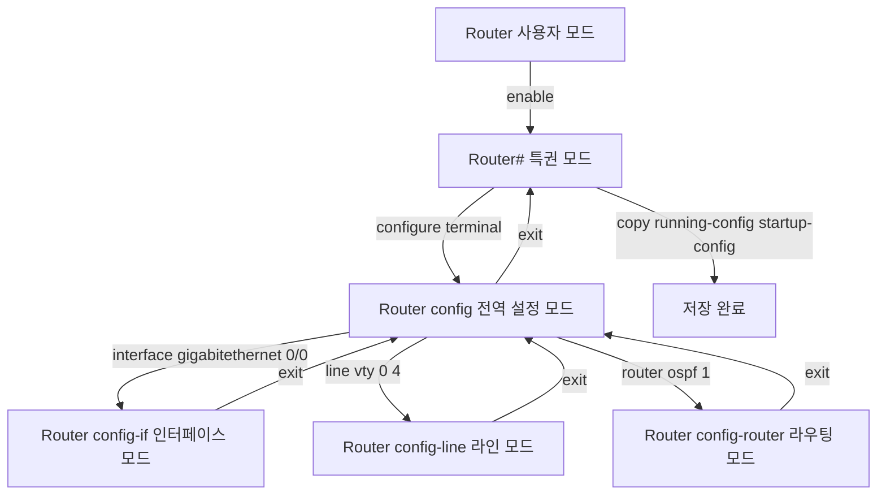
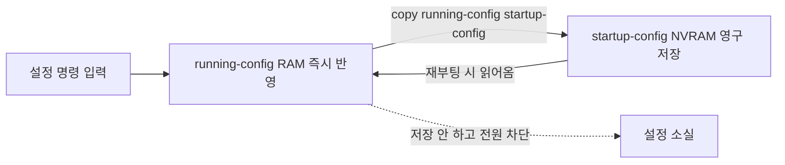

<Callout type="info">
  **이번 문서의 목표:** 이 파일을 다 읽으면 라우터 문제를 받았을 때 어느 모드에서 어떤 명령을 쳐야 하는지 프롬프트 단계까지 정확히 쓸 수 있고, 저장 명령을 절대 빠뜨리지 않는 루틴이 몸에 붙는다.
</Callout>

## 0. 라우터 문제 3문항의 정체

실기 마지막 구역은 라우터 설정 3문항입니다. 기출 8회분에 등장한 문제 유형을 모아 보면 놀랄 만큼 좁습니다.

| 유형 | 등장 회차 | 대표 명령 |
|------|----------|----------|
| 인터페이스 IP 설정과 활성화 | 2023-1, 2023-3, 2024-2, 2024-3 | `ip address`, `no shutdown` |
| 보조 IP 설정 | 2023-4, 2026-3 | `ip address ... secondary` |
| 정적 라우팅 | 2023-3, 2024-3 | `ip route` |
| 조회 명령 후 저장 | 2023-1, 2023-4, 2024-1, 2024-2, 2024-3, 2026-3 | `show version`, `show ip route`, `show processes cpu` |
| hostname·도메인 이름 | 2023-4 | `hostname`, `ip domain-name` |
| 기본 네트워크·기본 게이트웨이 | 2024-1, 2024-2, 2024-3 | `ip default-network`, `ip default-gateway` |
| VTY 라인 설정 | 2024-1 | `line vty 0 4` |
| SNMP 커뮤니티 | 2023-1 | `snmp-server community` |
| OSPF 설정 | 2026-3 | `router ospf` |

여기서 무엇이 보이십니까? **모든 회차, 모든 문제에 예외 없이 등장하는 명령이 하나** 있습니다.

```text
Router# copy running-config startup-config
```

기출 문제지의 유의사항에도 매번 이렇게 적혀 있습니다. "라우터: 설정 및 조회 완료 후 반드시 특권 모드에서 `copy running-config startup-config`를 실행하여 저장을 완료해야 **정답 처리**됩니다."

<Callout type="warning">
  **저장 명령을 빠뜨리면 나머지를 모두 맞혀도 0점입니다.** 이번 편의 진짜 주제는 이 한 줄을 절대 잊지 않는 루틴을 만드는 것입니다.
</Callout>

## 1. IOS와 CLI — 그 자리에서 용어 풀기

**IOS**는 Internetwork Operating System(인터네트워크 운영체제)의 약자로, 시스코 라우터·스위치에서 돌아가는 운영체제입니다. 애플의 iOS와는 이름만 같고 전혀 다른 것입니다.

**CLI**는 Command Line Interface(명령줄 인터페이스)의 약자입니다. 마우스로 클릭하는 그래픽 화면(GUI, Graphical User Interface)과 달리, 키보드로 명령어를 한 줄씩 입력합니다.

> **쉽게 말하면:** 라우터에는 화면도 마우스도 없습니다. 그래서 글자로 명령을 적어 넣고 글자로 답을 받습니다.

라우터에 접속하는 방법은 세 가지입니다.

| 방법 | 연결 수단 | 특징 |
|------|----------|------|
| 콘솔 (Console) | 롤오버 케이블로 콘솔 포트에 직결 | IP 설정 전에도 접속 가능. 초기 설정용 |
| 텔넷 (Telnet) | 네트워크로 원격 접속, 포트 23 | 암호가 평문으로 흘러 보안 취약 |
| SSH (Secure Shell) | 네트워크로 암호화 원격 접속, 포트 22 | 텔넷의 안전한 대체 |

**시험 환경에서는 대개 화면에 라우터 CLI 창이 이미 열려 있습니다.** 접속 과정 자체를 요구하지는 않지만, 텔넷과 SSH의 차이는 단답형 소재로 나옵니다.

## 2. 프롬프트 단계 — 이것이 채점 포인트다

### 왜 모드가 나뉘어 있는가

라우터에는 위험한 명령이 많습니다. 인터페이스를 내리거나 설정을 지우는 명령을 실수로 치면 회사 네트워크가 멈춥니다. 그래서 IOS는 **권한 수준을 계단처럼 나눠 두고**, 위험한 일을 하려면 한 계단씩 올라가게 만들었습니다.

> **쉽게 말하면:** 건물 로비에서는 구경만 되고, 사무실에 들어가려면 카드를 찍어야 하고, 서버실에 들어가려면 또 한 번 문을 열어야 합니다.

### 네 개의 프롬프트

| 프롬프트 표기 | 모드 이름 | 할 수 있는 일 | 진입 명령 |
|--------------|----------|-------------|----------|
| `Router>` | 사용자 모드 (User EXEC) | 아주 기본적인 조회만 | 접속하면 여기서 시작 |
| `Router#` | 특권 모드 (Privileged EXEC) | 모든 show 명령, 저장, 재부팅 | `enable` |
| `Router(config)#` | 전역 설정 모드 (Global Config) | 장비 전체 설정 변경 | `configure terminal` |
| `Router(config-if)#` | 인터페이스 설정 모드 | 특정 포트 설정 | `interface 이름` |

프롬프트의 생김새 자체가 지금 어느 모드인지를 알려 줍니다.

- 부등호 기호로 끝나면 사용자 모드
- 우물 정 기호로 끝나면 특권 모드
- 괄호 안에 config가 보이면 설정 모드



세부 설정 모드는 더 있습니다. 실기에 나오는 것만 정리합니다.

| 프롬프트 | 모드 | 언제 들어가나 |
|---------|------|-------------|
| `Router(config-if)#` | 인터페이스 | `interface gigabitethernet 0/0` |
| `Router(config-line)#` | 라인 (콘솔·VTY) | `line vty 0 4`, `line console 0` |
| `Router(config-router)#` | 라우팅 프로토콜 | `router ospf 1`, `router rip` |
| `Router(config-subif)#` | 서브인터페이스 | `interface gigabitethernet 0/0.10` |

**자주 틀리는 점:** 답안에 프롬프트를 적을 때 모드를 잘못 표기하는 실수입니다. `ip address` 명령은 인터페이스 모드에서만 동작하므로 `Router(config-if)#`로 적어야 합니다. `Router(config)#`로 적으면 실제로는 실행되지 않는 명령이 됩니다.

### 모드를 빠져나오는 명령

| 명령 | 동작 |
|------|------|
| `exit` | 한 단계 위로 |
| `end` | 어느 설정 모드에 있든 특권 모드로 한 번에 |
| `Ctrl` + `Z` | `end`와 같은 동작 |
| `disable` | 특권 모드에서 사용자 모드로 |

시험 답안에서는 `exit`를 단계마다 적는 방식이 안전합니다. 채점자가 모드 이동을 명확히 볼 수 있고, 자기 검산에도 유리합니다.

## 3. running-config와 startup-config — 저장이 필수인 진짜 이유

### 두 개의 설정 파일

라우터 안에는 설정이 **두 벌** 있습니다.

| 이름 | 저장 위치 | 성격 | 전원을 끄면 |
|------|----------|------|-----------|
| running-config | RAM (Random Access Memory) | 지금 이 순간 동작 중인 설정 | 사라짐 |
| startup-config | NVRAM (Non-Volatile RAM) | 부팅할 때 읽어오는 설정 | 남아 있음 |

**RAM**은 전원이 끊기면 내용이 지워지는 메모리입니다. **NVRAM**의 NV는 Non-Volatile(비휘발성), 즉 전원이 없어도 내용이 남는다는 뜻입니다.

명령을 입력하면 그 즉시 **running-config에만** 반영됩니다. 동작은 바로 되지만, 전원을 껐다 켜면 전부 날아갑니다.



> **쉽게 말하면:** running-config는 아직 저장 안 한 워드 문서이고, startup-config는 저장 버튼을 누른 파일입니다.

### 저장 명령과 축약형

```text
Router# copy running-config startup-config
```

이 명령은 "실행 중 설정을 시작 설정 자리로 복사하라"는 뜻입니다. 축약형도 인정됩니다.

| 표기 | 설명 |
|------|------|
| `copy running-config startup-config` | 정식 표기. 답안에는 이것을 쓰는 것이 안전 |
| `copy run start` | 흔히 쓰는 축약 |
| `copy r s` | 최소 축약. 기출 해설에도 언급됨 |
| `write memory` 또는 `wr` | 구형 IOS의 저장 명령. 여전히 동작 |

IOS는 **명령을 구분할 수 있는 최소 글자만 쳐도** 인식합니다. `conf t`가 `configure terminal`로, `int g0/0`이 `interface gigabitethernet 0/0`으로 해석되는 것이 그 예입니다. 다만 **답안에는 정식 표기를 쓰십시오.** 축약이 채점 스크립트에서 인정되지 않을 위험을 굳이 감수할 이유가 없습니다.

**자주 틀리는 점:** 저장 명령을 **전역 설정 모드에서** 치는 실수입니다. `copy` 명령은 특권 모드 명령이므로, 설정 모드에 있다면 반드시 `exit`나 `end`로 `Router#`까지 올라온 뒤 실행해야 합니다.

### 조회만 하는 문제에도 저장이 필요한가

기출을 보면 "라우터의 버전 정보를 조회하고 저장하시오", "라우팅 테이블을 확인하고 저장하시오" 같은 문제가 반복됩니다. 조회는 설정을 바꾸지 않으니 저장할 것이 없어 보입니다.

그런데 **문제가 저장을 요구하면 저장합니다.** 시험 시스템은 저장 명령의 실행 여부까지 채점 항목으로 잡습니다. 논리적으로 따지지 말고 지시를 그대로 따르십시오. 기출 8회분에서 조회 문제의 정답에도 예외 없이 저장 명령이 붙어 있습니다.

## 4. 기본 설정 명령 — 문제별로 정확히

### hostname — 장비 이름 바꾸기

라우터를 여러 대 다루면 프롬프트가 전부 `Router#`라 헷갈립니다. 그래서 이름을 붙입니다.

```text
Router> enable
Router# configure terminal
Router(config)# hostname Router1
Router1(config)# exit
Router1# copy running-config startup-config
```

**중요한 관찰:** `hostname Router1`을 친 순간 **프롬프트가 즉시 `Router1(config)#`으로 바뀝니다.** 답안을 적을 때 이 변화를 반영해야 정확합니다. 2023년 4회 기출 해설이 정확히 이렇게 표기하고 있습니다.

hostname에는 공백을 넣을 수 없고, 대소문자를 구분합니다. 문제가 `Router1`이라고 했으면 `router1`이 아니라 `Router1`입니다.

### ip domain-name — 도메인 이름 설정

```text
Router1(config)# ip domain-name example.com
```

이 명령은 장비가 속한 도메인 이름을 지정합니다. SSH 키를 만들 때도 도메인 이름이 필요하므로 실무에서 자주 함께 설정합니다.

### enable 암호 — 특권 모드 진입 보호

특권 모드로 올라가는 문을 잠그는 두 가지 명령이 있습니다.

| 명령 | 저장 방식 | 권장 여부 |
|------|----------|----------|
| `enable password 암호` | 설정 파일에 평문으로 저장 | 취약. 구형 방식 |
| `enable secret 암호` | 해시로 암호화되어 저장 | 권장. 둘 다 있으면 secret이 우선 |

```text
Router> enable
Router# configure terminal
Router(config)# enable secret cisco123
Router(config)# exit
Router# copy running-config startup-config
```

**해시**(hash)란 원문을 되돌릴 수 없는 형태로 변환한 값입니다. 설정 파일을 누가 훔쳐봐도 원래 암호를 알 수 없습니다. 그래서 `enable password`보다 `enable secret`이 안전합니다.

### 콘솔 암호 — 물리적 접속 보호

```text
Router(config)# line console 0
Router(config-line)# password consolepw
Router(config-line)# login
Router(config-line)# exit
```

`line console 0`은 콘솔 포트(0번) 설정으로 들어가는 명령입니다. `password`로 암호를 정하고, **`login`을 반드시 함께 쳐야** 실제로 암호를 물어봅니다.

**자주 틀리는 점:** `password`만 치고 `login`을 빠뜨리는 실수입니다. `login`이 없으면 암호는 설정되어 있으나 검사하지 않아 그냥 통과됩니다.

### VTY 암호 — 원격 접속 보호

**VTY**는 Virtual TeletYpe(가상 터미널)의 약자로, 텔넷·SSH 같은 원격 접속이 들어오는 가상의 회선입니다. 기본적으로 0번부터 4번까지 5개가 있어 동시에 5명이 접속할 수 있습니다.

```text
Router> enable
Router# configure terminal
Router(config)# line vty 0 4
Router(config-line)# password telnetpw
Router(config-line)# login
Router(config-line)# exit
Router(config)# exit
Router# copy running-config startup-config
```

2024년 1회 기출은 "가상 터미널 라인 0부터 4까지의 설정을 적용하고 저장하시오"라고만 요구했고, 정답은 `line vty 0 4`로 진입한 뒤 저장하는 것이었습니다. **`0 4`에서 0과 4 사이는 공백**입니다. 하이픈이나 쉼표가 아닙니다.

### 배너 — 접속 시 표시되는 안내문

**MOTD**는 Message Of The Day(오늘의 메시지)의 약자입니다.

```text
Router(config)# banner motd #인가된 사용자만 접속하십시오#
```

문구의 앞뒤를 감싸는 기호를 **구분자**(delimiter)라고 합니다. 위 예에서는 우물 정 기호를 썼습니다. 구분자는 문구 안에 없는 아무 기호나 쓸 수 있고, 시작과 끝이 같아야 합니다.

## 5. 확인 명령 — show 계열

설정이 제대로 들어갔는지 확인하는 명령들입니다. 전부 **특권 모드**에서 실행합니다.

| 명령 | 보여 주는 것 | 기출 등장 |
|------|------------|----------|
| `show running-config` | 현재 동작 중인 전체 설정 | 검산용 필수 |
| `show startup-config` | 저장된 설정. 저장 여부 확인 | 검산용 |
| `show version` | IOS 버전, 부팅 정보, 메모리, 업타임 | 2023-1, 2024-1 |
| `show ip interface brief` | 모든 인터페이스의 IP와 상태를 한 줄씩 | 06편 필수 |
| `show ip route` | 라우팅 테이블 | 2024-2, 2024-3 |
| `show ip protocols` | 동작 중인 라우팅 프로토콜 정보 | 2026-3 |
| `show processes cpu` | CPU를 쓰는 프로세스 상태 | 2026-3 |
| `show interfaces` | 인터페이스 상세 통계 | 문제 해결용 |
| `show vlan brief` | VLAN 목록과 소속 포트 | 07편 |

**한 화면을 넘어가면** IOS는 화면 아래에 `--More--`를 표시하고 멈춥니다. 스페이스바를 누르면 다음 화면, 엔터를 누르면 한 줄씩, `q`를 누르면 종료입니다. 시험 중 화면이 멈췄다고 당황하지 마십시오.

## 6. 저장 루틴 — 몸에 새길 다섯 단계

라우터 문제를 만나면 **문제 내용과 무관하게** 다음 뼈대를 먼저 종이나 머릿속에 깔아 놓고 시작하십시오.

<Steps>

### 1단계 — enable로 특권 모드 진입

```text
Router> enable
```

조회만 하는 문제라도 대부분의 show 명령은 특권 모드가 필요합니다.

### 2단계 — 조회 문제라면 여기서 바로 실행

`show version`, `show ip route`처럼 조회 명령은 `Router#`에서 실행합니다. 설정 모드로 들어갈 필요가 없습니다.

### 3단계 — 설정 문제라면 configure terminal

```text
Router# configure terminal
```

여기서부터 프롬프트가 `Router(config)#`입니다.

### 4단계 — 요구된 설정을 입력하고 특권 모드로 복귀

인터페이스 설정이었다면 `exit`를 두 번(인터페이스 모드에서 전역으로, 전역에서 특권으로) 치거나 `end`를 한 번 칩니다.

### 5단계 — 저장

```text
Router# copy running-config startup-config
```

**이 줄을 쓰지 않으면 앞의 네 단계가 전부 무의미해집니다.**

</Steps>

### 완성 예시 — hostname과 도메인 설정

2023년 4회 기출 18번을 이 루틴대로 풀면 이렇게 됩니다.

```text
Router> enable
Router# configure terminal
Router(config)# hostname Router1
Router1(config)# ip domain-name example.com
Router1(config)# exit
Router1# copy running-config startup-config
```

프롬프트가 `Router(config)#`에서 `Router1(config)#`으로 바뀌는 지점을 다시 확인하십시오.

### 완성 예시 — 조회 후 저장

2024년 1회 기출 16번입니다.

```text
Router> enable
Router# show version
Router# copy running-config startup-config
```

설정 모드에 들어가지 않았으므로 `configure terminal`도 `exit`도 없습니다. 군더더기를 넣으면 오히려 감점 위험이 생깁니다.

## 7. 실기 감점 포인트 정리

| 감점 유형 | 구체적 상황 | 예방책 |
|----------|-----------|-------|
| 저장 누락 | `copy running-config startup-config` 미실행 | 모든 문제의 마지막 줄로 고정 |
| 모드 오류 | 전역 모드에서 `ip address` 입력 | 명령마다 필요한 모드를 확인 |
| 저장 위치 오류 | 설정 모드에서 `copy` 실행 | 저장 전 `end`로 특권 모드 복귀 |
| 대소문자 오류 | `Router1`을 `router1`로 입력 | 문제지 표기를 그대로 복사 |
| 인터페이스 이름 오류 | Gigabit인데 fastethernet 입력 | 구성도의 이름을 그대로 사용 |
| login 누락 | `password`만 설정 | 라인 설정에는 `login`을 항상 함께 |
| 불필요한 명령 추가 | 조회 문제에 `configure terminal` 추가 | 요구된 것만 정확히 |

## 핵심 정리

- IOS는 시스코 장비의 운영체제이고 CLI는 글자로 명령을 주고받는 인터페이스다.
- 프롬프트는 사용자 모드, 특권 모드, 전역 설정 모드, 세부 설정 모드 순으로 올라가며 각 명령마다 필요한 모드가 정해져 있다.
- running-config는 RAM에서 지금 동작 중인 설정, startup-config는 NVRAM에 저장되어 부팅 때 읽히는 설정이다.
- `copy running-config startup-config`는 특권 모드에서 실행하며, 조회 문제라도 요구되면 반드시 붙인다. 이 한 줄이 없으면 정답 처리되지 않는다.
- 라인 설정에서는 `password`와 `login`이 짝이다. `login`이 없으면 암호를 물어보지 않는다.
- `enable secret`은 해시 저장이라 `enable password`보다 안전하며 둘이 함께 있으면 secret이 우선한다.

## 마무리 복습

<Quiz
  questionNumber={1}
  question="Cisco 라우터에서 인터페이스에 IP 주소를 설정하는 명령을 입력할 수 있는 프롬프트는?"
  options={['Router 사용자 모드 프롬프트', 'Router# 특권 모드 프롬프트', 'Router(config)# 전역 설정 모드 프롬프트', 'Router(config-if)# 인터페이스 설정 모드 프롬프트']}
  correctAnswer={4}
  explanation="ip address 명령은 특정 인터페이스에 대한 설정이므로 interface 명령으로 진입한 인터페이스 설정 모드에서만 동작한다. 전역 설정 모드에서 입력하면 인식되지 않는다."
  optionExplanations={['사용자 모드는 기본 조회만 가능하다', '특권 모드는 show 와 저장 명령을 실행하는 자리다', '전역 설정 모드는 장비 전체 설정을 다루며 인터페이스 IP는 여기서 지정할 수 없다', '정답 — interface 명령으로 진입한 뒤 입력한다']}
/>

<Quiz
  questionNumber={2}
  question="running-config 와 startup-config 의 차이로 옳은 것은?"
  options={['running-config 는 NVRAM 에 startup-config 는 RAM 에 저장된다', 'running-config 는 RAM 에서 동작 중인 설정이고 startup-config 는 NVRAM 에 저장되어 부팅 시 읽힌다', '둘은 같은 파일의 다른 이름일 뿐이다', 'startup-config 는 전원을 끄면 사라진다']}
  correctAnswer={2}
  explanation="설정 명령은 즉시 running-config 에만 반영되며 RAM 은 전원이 끊기면 지워진다. copy 명령으로 NVRAM 의 startup-config 에 복사해야 재부팅 후에도 설정이 남는다."
  optionExplanations={['저장 위치가 서로 뒤바뀐 설명이다', '정답 — RAM 과 NVRAM 의 차이가 핵심이다', '별개의 두 파일이며 내용이 다를 수 있다', 'NVRAM 은 비휘발성이라 전원이 없어도 내용이 남는다']}
/>

<Quiz
  questionNumber={3}
  question="설정을 마친 뒤 실기에서 반드시 실행해야 하는 저장 명령과 실행 모드로 옳은 것은?"
  options={['전역 설정 모드에서 copy running-config startup-config', '특권 모드에서 copy running-config startup-config', '사용자 모드에서 write terminal', '인터페이스 모드에서 save config']}
  correctAnswer={2}
  explanation="copy 는 특권 모드 명령이다. 설정 모드에 있다면 exit 나 end 로 특권 모드까지 나온 뒤 실행해야 한다. 이 명령을 빠뜨리면 다른 항목을 모두 맞혀도 정답 처리되지 않는다."
  optionExplanations={['설정 모드에서는 copy 명령이 동작하지 않는다', '정답 — 특권 모드에서 실행하는 것이 정석이다', 'write terminal 은 설정을 화면에 출력하는 옛 명령이며 저장이 아니다', 'save config 라는 명령은 IOS 에 없다']}
/>

<Quiz
  questionNumber={4}
  question="line vty 0 4 명령의 의미로 가장 알맞은 것은?"
  options={['콘솔 포트 0번부터 4번까지 설정한다', '가상 터미널 회선 0번부터 4번까지 동시 설정 모드로 들어간다', '4초 후 접속을 끊도록 설정한다', 'VLAN 0번부터 4번까지 생성한다']}
  correctAnswer={2}
  explanation="VTY 는 Virtual TeletYpe 의 약자로 텔넷과 SSH 원격 접속이 들어오는 가상 회선이다. 기본 5개인 0번부터 4번까지를 한꺼번에 설정 대상으로 잡는 명령이다."
  optionExplanations={['콘솔은 line console 0 으로 설정한다', '정답 — 원격 접속 회선 다섯 개를 한 번에 설정한다', '시간 제한은 exec-timeout 명령으로 설정한다', 'VLAN 생성은 vlan 명령으로 한다']}
/>

<Quiz
  questionNumber={5}
  question="라인 설정에서 password 만 지정하고 login 을 입력하지 않았을 때 일어나는 일은?"
  options={['암호가 설정되었지만 접속 시 암호를 묻지 않는다', '접속 자체가 완전히 차단된다', '암호가 자동으로 해시 처리된다', '설정이 오류로 거부된다']}
  correctAnswer={1}
  explanation="password 는 암호 값을 정할 뿐이고 실제로 인증을 수행하게 만드는 것은 login 이다. login 이 없으면 암호 검사가 이루어지지 않아 그대로 통과된다."
  optionExplanations={['정답 — 두 명령은 반드시 짝으로 입력해야 한다', '차단되는 것이 아니라 오히려 무방비로 통과된다', '해시 저장은 service password-encryption 이나 enable secret 의 역할이다', '문법 오류가 아니므로 설정 자체는 받아들여진다']}
/>

<Quiz
  questionNumber={6}
  question="enable password 와 enable secret 에 대한 설명으로 옳은 것은?"
  options={['enable password 가 더 강력한 암호화를 사용한다', 'enable secret 은 해시로 저장되며 둘이 모두 설정되면 secret 이 우선한다', '두 명령은 완전히 동일하게 동작한다', 'enable secret 은 콘솔 접속 전용이다']}
  correctAnswer={2}
  explanation="enable password 는 설정 파일에 평문으로 남지만 enable secret 은 되돌릴 수 없는 해시로 저장된다. 두 값이 모두 설정된 경우 IOS 는 secret 을 사용한다."
  optionExplanations={['enable password 는 평문 저장이라 오히려 취약하다', '정답 — 해시 저장과 우선순위가 핵심 차이다', '저장 방식과 우선순위가 다르므로 동일하지 않다', '둘 다 특권 모드 진입을 보호하는 명령이며 콘솔 전용이 아니다']}
/>

<Quiz
  questionNumber={7}
  question="Router(config)# hostname Router1 을 입력한 직후 프롬프트는 어떻게 바뀌는가?"
  options={['Router(config)# 그대로 유지된다', 'Router1(config)# 으로 즉시 바뀐다', 'Router1# 으로 바뀌며 특권 모드로 나온다', '재부팅 후에야 바뀐다']}
  correctAnswer={2}
  explanation="hostname 은 입력 즉시 적용되므로 프롬프트의 장비 이름 부분이 바로 바뀐다. 모드는 그대로 전역 설정 모드이므로 괄호 안의 config 표기는 유지된다."
  optionExplanations={['이름이 즉시 반영되므로 그대로일 수 없다', '정답 — 이름만 바뀌고 모드는 유지된다', '모드가 저절로 특권 모드로 나오지는 않는다', '재부팅 없이 즉시 적용된다']}
/>

<Quiz
  questionNumber={8}
  question="문제가 라우터의 IOS 버전 정보만 확인하고 저장하라고 요구했다. 가장 적절한 명령 순서는?"
  options={['enable 다음 show version 다음 copy running-config startup-config', 'configure terminal 다음 show version 다음 exit', 'show version 만 실행하고 종료', 'enable 다음 configure terminal 다음 show version 다음 copy running-config startup-config']}
  correctAnswer={1}
  explanation="show version 은 특권 모드 명령이므로 enable 로 올라간 뒤 실행하고 문제가 요구한 저장 명령을 붙인다. 설정을 바꾸지 않으므로 configure terminal 은 불필요하며 넣으면 군더더기가 된다."
  optionExplanations={['정답 — 특권 모드 진입, 조회, 저장의 세 줄이면 충분하다', '설정 모드에서는 show version 이 정상 동작하지 않으며 저장도 빠졌다', '문제가 요구한 저장 명령이 빠져 정답 처리되지 않는다', 'configure terminal 이 불필요하게 들어가 있다']}
/>

## 참고 자료

- [Cisco IOS Commands 참조 자료](https://germanna.edu/sites/default/files/2026-02/Cisco%20IOS%20Commands.pdf)
- [Cisco IOS Command Reference 요약](https://courseiva.com/commands/cisco)
- [ICQA - 국가공인자격증 네트워크관리사 2급](https://www.icqa.or.kr/cn/page/network)
