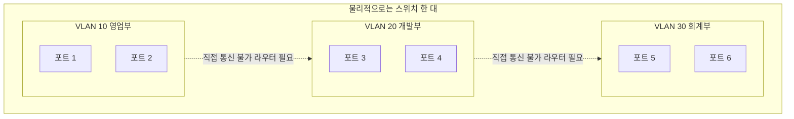
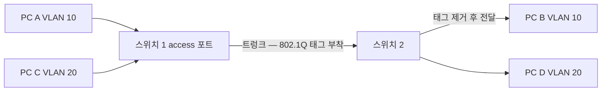
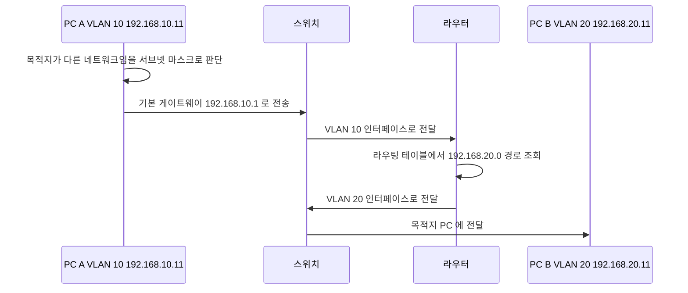

<Callout type="info">
  **이번 문서의 목표:** 이 파일을 다 읽으면 VLAN이 왜 필요한지 브로드캐스트 도메인 관점에서 설명할 수 있고, VLAN 생성부터 access 포트 지정과 트렁크 설정, 확인 명령까지 프롬프트 단계로 써낼 수 있다.
</Callout>

## 0. 실기에서 VLAN이 나오는 자리

VLAN은 라우터 CLI 문제보다 **단답형·선택형**으로 더 자주 나옵니다.

- "복수 개의 VLAN 프레임을 전송할 수 있는 링크를 의미하며 주로 스위치 간을 연결할 때 사용되는 것은?" → 답: **트렁크** (2026년 3회)
- "물리적 네트워크를 논리적으로 분할하여 스위치 상에서 서로 다른 독립된 브로드캐스트 도메인을 형성하는 기술은?" → 답: **VLAN** (2023년 4회)

두 문제 모두 **한 단어**를 정확히 적으면 되는 문제입니다. 그런데 그 한 단어를 자신 있게 쓰려면 개념을 제대로 알아야 하고, 나아가 스위치 CLI 문제로 확장되어도 대응할 수 있어야 합니다.

## 1. VLAN이 없던 시절의 문제

### 스위치는 브로드캐스트를 막지 못한다

04편에서 봤듯이 스위치는 충돌 도메인은 나누지만 **브로드캐스트 도메인은 나누지 못합니다.** 목적지가 브로드캐스트 주소(`FF-FF-FF-FF-FF-FF`)인 프레임은 모든 포트로 뿌려집니다.

24포트 스위치에 24대가 물려 있고 부서가 셋(영업·개발·회계)이라고 합시다. 영업부 PC가 ARP 요청을 뿌리면 개발부와 회계부의 22대가 전부 그 프레임을 받아 봉투를 뜯고 "나한테 온 게 아니네" 하고 버립니다.

문제는 두 가지입니다.

1. **성능** — 쓸데없는 트래픽이 모든 포트를 지나가고, 모든 PC의 랜카드와 CPU가 그것을 처리합니다.
2. **보안** — 회계부의 브로드캐스트가 영업부 PC에 그대로 도달합니다. 부서를 나누고 싶어도 물리적으로 나뉘어 있지 않습니다.

### 옛 해결책 — 스위치를 따로 산다

부서마다 스위치를 따로 사서 물리적으로 분리하면 해결됩니다. 하지만 이 방식은 비쌉니다.

- 부서마다 스위치 한 대씩, 포트가 남아도 낭비
- 사람이 자리를 옮기면 케이블 배선을 새로 해야 함
- 부서가 생기거나 없어질 때마다 장비를 사고 버려야 함

> **쉽게 말하면:** 사무실을 나누려고 벽을 콘크리트로 세우면, 조직이 바뀔 때마다 벽을 부숴야 합니다.

## 2. VLAN — 소프트웨어로 세우는 벽

### 정의

**VLAN**은 Virtual Local Area Network(가상 근거리 통신망)의 약자입니다. 단어를 풀면 "가상의 랜"입니다.

물리적으로는 스위치 한 대인데, 설정으로 **포트를 여러 그룹으로 나누어** 각 그룹이 서로 다른 독립된 스위치처럼 동작하게 만듭니다.

> **쉽게 말하면:** VLAN은 소프트웨어로 세우는 파티션입니다. 벽을 부수지 않고 설정 한 줄로 자리를 옮길 수 있습니다.



### VLAN이 만들어 내는 결과

| 항목 | VLAN 적용 전 | VLAN 적용 후 |
|------|-------------|-------------|
| 브로드캐스트 도메인 | 스위치 전체가 1개 | VLAN 개수만큼 분리 |
| 부서 간 통신 | 자유롭게 가능 | 3계층 장비를 거쳐야 가능 |
| 자리 이동 시 작업 | 배선 변경 | 포트의 VLAN 번호만 변경 |
| 필요 장비 | 부서 수만큼의 스위치 | 스위치 한 대 |

**핵심 결론:** VLAN이 다르면 **같은 스위치에 꽂혀 있어도 서로 통신할 수 없습니다.** 통신하게 하려면 라우터나 L3 스위치를 거쳐야 하고, 이를 **VLAN 간 라우팅**(inter-VLAN routing)이라고 합니다.

### VLAN 번호 규칙

| 번호 범위 | 이름 | 용도 |
|----------|------|------|
| 0, 4095 | 예약 | 사용자가 쓸 수 없음 |
| 1 | 기본 VLAN (default) | 모든 포트의 초기 소속. 삭제 불가 |
| 2 – 1001 | 일반 범위 (normal range) | 사용자 정의 VLAN. 실기 범위 |
| 1002 – 1005 | 예약 | 옛 토큰링·FDDI용. 삭제 불가 |
| 1006 – 4094 | 확장 범위 (extended range) | 대규모 환경용 |

**VLAN 1**은 특별합니다. 아무 설정도 하지 않은 스위치의 모든 포트는 VLAN 1에 속합니다. 삭제할 수 없고, 관리 트래픽의 기본 통로이기도 합니다. 보안 관점에서는 **업무용으로 VLAN 1을 쓰지 않는 것**이 권장됩니다.

## 3. 포트의 두 가지 모드 — access와 trunk

### access 포트

**액세스 포트**(access port)는 **단 하나의 VLAN에만 속하는 포트**입니다. PC, 프린터, 서버처럼 VLAN을 모르는 최종 장치를 연결합니다.

액세스 포트로 들어온 프레임에는 아무 표시가 없습니다. 스위치가 "이 포트는 VLAN 10 소속"이라고 내부적으로 기억할 뿐입니다.

> **쉽게 말하면:** 액세스 포트는 한 부서 전용 문입니다. 그 문으로 들어온 사람은 무조건 그 부서 사람입니다.

### trunk 포트

문제 상황을 봅시다. 스위치가 두 대이고 두 대 모두에 영업부(VLAN 10)와 개발부(VLAN 20) PC가 물려 있습니다. 1층 영업부 PC가 2층 영업부 PC와 통신하려면 두 스위치 사이에 선이 필요합니다.

VLAN마다 선을 따로 깔면 어떨까요? VLAN이 10개면 스위치 사이에 10가닥이 필요합니다. 낭비입니다.

**트렁크 포트**(trunk port)는 **여러 VLAN의 프레임을 한 가닥으로 실어 나르는 포트**입니다.

> **쉽게 말하면:** 트렁크는 여러 부서의 우편물을 한 트럭에 싣고 가는 것입니다. 대신 봉투마다 어느 부서 것인지 꼬리표를 붙입니다.

그 꼬리표가 **태그**(tag)이고, 태그를 붙이는 표준 방식이 **IEEE 802.1Q**입니다.



### 802.1Q 태그의 구조

트렁크를 지나는 프레임에는 4바이트짜리 태그가 이더넷 헤더 안에 끼워집니다.

| 필드 | 크기 | 내용 |
|------|------|------|
| TPID (Tag Protocol Identifier) | 2바이트 | 고정값 0x8100. 이것이 802.1Q 태그임을 표시 |
| PCP (Priority Code Point) | 3비트 | 우선순위 0부터 7까지 |
| DEI (Drop Eligible Indicator) | 1비트 | 혼잡 시 버려도 되는지 표시 |
| VID (VLAN Identifier) | 12비트 | VLAN 번호 |

VID가 12비트이므로 표현 가능한 VLAN 개수는 다음과 같습니다.

$$
2^{12} = 4096
$$

- 12: VID 필드의 비트 수
- 4096: 0번부터 4095번까지의 개수

여기서 0번과 4095번이 예약되어 있으므로, 실제로 쓸 수 있는 VLAN은 1번부터 4094번까지입니다. 앞의 VLAN 번호 표에서 확장 범위가 4094에서 끝나는 이유가 바로 이 계산입니다.

### 네이티브 VLAN

트렁크에는 예외가 하나 있습니다. **네이티브 VLAN**(native VLAN)에 속한 프레임만은 **태그 없이** 통과합니다. 기본값은 VLAN 1입니다.

이 규칙은 옛 장비와의 호환을 위해 남아 있습니다. 양쪽 스위치의 네이티브 VLAN 번호가 서로 다르면 트래픽이 엉뚱한 VLAN으로 새므로, 실무에서는 반드시 양쪽을 맞춥니다.

## 4. 시험형 설정 명령

### VLAN 생성과 이름 붙이기

```text
Switch> enable
Switch# configure terminal
Switch(config)# vlan 10
Switch(config-vlan)# name SALES
Switch(config-vlan)# exit
Switch(config)# vlan 20
Switch(config-vlan)# name DEVELOP
Switch(config-vlan)# exit
Switch(config)# exit
Switch# copy running-config startup-config
```

`vlan 10`을 치면 프롬프트가 `Switch(config-vlan)#`으로 바뀝니다. 이 안에서 `name` 명령으로 이름을 붙입니다. 이름은 사람이 알아보기 위한 것이고, 실제 동작에는 번호만 쓰입니다.

### access 포트 지정

```text
Switch> enable
Switch# configure terminal
Switch(config)# interface fastethernet 0/1
Switch(config-if)# switchport mode access
Switch(config-if)# switchport access vlan 10
Switch(config-if)# exit
Switch(config)# exit
Switch# copy running-config startup-config
```

두 줄의 역할이 다릅니다.

- `switchport mode access` — 이 포트를 액세스 모드로 고정합니다. 이 줄이 없으면 포트가 자동 협상(dynamic auto) 상태로 남아 상대에 따라 트렁크가 될 수도 있습니다.
- `switchport access vlan 10` — 이 포트를 VLAN 10에 소속시킵니다.

**여러 포트를 한꺼번에** 설정하려면 `interface range`를 씁니다.

```text
Switch(config)# interface range fastethernet 0/1 - 4
Switch(config-if-range)# switchport mode access
Switch(config-if-range)# switchport access vlan 10
```

`0/1 - 4`에서 하이픈 양옆에 **공백**이 있어야 합니다.

**자주 틀리는 점:** 존재하지 않는 VLAN 번호를 포트에 지정하는 실수입니다. 최신 IOS는 VLAN을 자동 생성해 주기도 하지만, 시험에서는 **`vlan 10`으로 먼저 만든 뒤 포트에 지정**하는 순서를 지키십시오.

### trunk 포트 설정

```text
Switch> enable
Switch# configure terminal
Switch(config)# interface gigabitethernet 0/1
Switch(config-if)# switchport trunk encapsulation dot1q
Switch(config-if)# switchport mode trunk
Switch(config-if)# switchport trunk allowed vlan 10,20
Switch(config-if)# exit
Switch(config)# exit
Switch# copy running-config startup-config
```

줄마다 뜻을 봅니다.

- `switchport trunk encapsulation dot1q` — 태그 방식을 802.1Q로 지정합니다. `dot1q`는 802.1Q를 키보드로 칠 수 있게 바꾼 표기입니다. **802.1Q만 지원하는 스위치에서는 이 줄이 없거나 오류가 납니다.** 그럴 때는 생략합니다.
- `switchport mode trunk` — 이 포트를 트렁크로 고정합니다.
- `switchport trunk allowed vlan 10,20` — 이 트렁크로 지나갈 수 있는 VLAN을 제한합니다. 쉼표 양옆에 공백을 넣지 않습니다. 생략하면 모든 VLAN이 허용됩니다.

네이티브 VLAN을 바꾸려면 이렇게 합니다.

```text
Switch(config-if)# switchport trunk native vlan 99
```

## 5. 확인 명령 읽기

### show vlan brief

```text
Switch# show vlan brief
```

출력은 이런 형태입니다.

```text
VLAN Name                             Status    Ports
---- -------------------------------- --------- -------------------------------
1    default                          active    Fa0/5, Fa0/6, Fa0/7, Fa0/8
10   SALES                            active    Fa0/1, Fa0/2
20   DEVELOP                          active    Fa0/3, Fa0/4
```

읽는 법입니다.

- **VLAN** — 번호
- **Name** — 이름. 붙이지 않으면 `VLAN0010` 형태로 자동 생성됩니다
- **Status** — `active`가 정상입니다
- **Ports** — 그 VLAN에 속한 액세스 포트 목록

**주의:** **트렁크 포트는 이 목록에 나타나지 않습니다.** 트렁크는 특정 VLAN의 소속이 아니라 모든 VLAN을 실어 나르는 통로이기 때문입니다. 트렁크로 설정한 포트가 목록에서 사라졌다고 당황하지 마십시오. 오히려 정상 동작의 증거입니다.

### show interfaces trunk

```text
Switch# show interfaces trunk
```

```text
Port        Mode         Encapsulation  Status        Native vlan
Gi0/1       on           802.1q         trunking      1

Port        Vlans allowed on trunk
Gi0/1       10,20
```

- **Mode** — `on`이면 수동으로 트렁크 고정
- **Status** — `trunking`이 정상. `not-trunking`이면 협상 실패
- **Native vlan** — 태그 없이 지나가는 VLAN 번호. 양쪽이 같아야 합니다

### show interfaces switchport

특정 포트의 모드와 VLAN 소속을 자세히 봅니다.

```text
Switch# show interfaces fastethernet 0/1 switchport
```

주요 줄만 읽으면 됩니다.

- `Administrative Mode: static access` — 관리자가 지정한 모드
- `Operational Mode: static access` — 실제로 동작 중인 모드
- `Access Mode VLAN: 10 (SALES)` — 소속 VLAN

**관리자 모드와 동작 모드가 다르면** 협상이 실패한 것입니다. 상대 포트의 설정을 확인해야 합니다.

## 6. VLAN 간 통신 — 왜 라우터가 필요한가

VLAN 10의 PC(`192.168.10.11`)가 VLAN 20의 PC(`192.168.20.11`)와 통신하려 합니다.



**핵심:** VLAN을 나눈다는 것은 **네트워크 대역도 나눈다는 뜻**입니다. VLAN 10에 `192.168.10.0/24`, VLAN 20에 `192.168.20.0/24`를 배정하고, 각 VLAN의 PC는 자기 VLAN에 해당하는 라우터 인터페이스를 게이트웨이로 씁니다.

라우터 포트가 하나뿐인데 VLAN이 여러 개면 **서브인터페이스**(subinterface)를 만듭니다. 이 방식을 라우터의 팔에 여러 손이 달린 모습에 빗대어 **Router on a Stick**이라고 부릅니다.

```text
Router(config)# interface gigabitethernet 0/0
Router(config-if)# no shutdown
Router(config-if)# exit
Router(config)# interface gigabitethernet 0/0.10
Router(config-subif)# encapsulation dot1q 10
Router(config-subif)# ip address 192.168.10.1 255.255.255.0
Router(config-subif)# exit
Router(config)# interface gigabitethernet 0/0.20
Router(config-subif)# encapsulation dot1q 20
Router(config-subif)# ip address 192.168.20.1 255.255.255.0
Router(config-subif)# exit
Router(config)# exit
Router# copy running-config startup-config
```

- `gigabitethernet 0/0.10` — 점 뒤의 숫자가 서브인터페이스 번호입니다. 관례적으로 VLAN 번호와 같게 맞춥니다
- `encapsulation dot1q 10` — 이 서브인터페이스가 VLAN 10의 태그를 처리한다고 선언합니다
- **물리 인터페이스에 `no shutdown`을 먼저 해야** 서브인터페이스도 살아납니다

**자주 틀리는 점:** 서브인터페이스만 만들고 물리 인터페이스의 `no shutdown`을 빠뜨리는 실수입니다. 서브인터페이스는 물리 포트 위에 얹힌 논리적 존재이므로, 아래가 죽어 있으면 위도 죽습니다.

## 7. 감점 포인트 체크리스트

| 감점 유형 | 상황 | 예방책 |
|----------|------|-------|
| 저장 누락 | `copy running-config startup-config` 미실행 | 마지막 줄로 고정 |
| VLAN 미생성 | 만들지 않은 VLAN 번호를 포트에 지정 | `vlan 번호`로 먼저 생성 |
| 모드 미지정 | `switchport mode access` 생략 | 액세스 포트는 모드와 VLAN 두 줄 모두 |
| 트렁크 협상 실패 | 한쪽만 트렁크로 설정 | 양쪽 모두 `switchport mode trunk` |
| 네이티브 VLAN 불일치 | 양쪽 번호가 다름 | `show interfaces trunk`로 확인 |
| 서브인터페이스 미동작 | 물리 포트가 shutdown 상태 | 물리 포트 먼저 `no shutdown` |
| range 문법 오류 | `0/1-4`처럼 공백 없이 입력 | 하이픈 양옆에 공백 |

## 핵심 정리

- VLAN은 하나의 스위치를 논리적으로 나누어 각각 독립된 브로드캐스트 도메인을 만드는 2계층 기술이다.
- VLAN이 다르면 같은 스위치에 꽂혀 있어도 직접 통신할 수 없고, 3계층 장비를 거쳐야 한다.
- 액세스 포트는 하나의 VLAN에만 속하며 최종 장치를 연결한다. 트렁크 포트는 여러 VLAN의 프레임을 802.1Q 태그를 붙여 한 가닥으로 실어 나른다.
- 802.1Q의 VID는 12비트여서 이론상 4096개, 실제로는 1번부터 4094번까지 쓸 수 있다. 네이티브 VLAN만 태그 없이 지나간다.
- `show vlan brief`에는 액세스 포트만 나오고 트렁크 포트는 나오지 않는다. 이는 정상이다.
- 라우터 포트 하나로 여러 VLAN을 라우팅하려면 서브인터페이스에 `encapsulation dot1q`를 지정하고, 물리 포트를 먼저 활성화해야 한다.

## 마무리 복습

<Quiz
  questionNumber={1}
  question="복수 개의 VLAN 프레임을 한 가닥의 링크로 전송할 수 있으며 주로 스위치 간 연결에 사용되는 것은?"
  options={['액세스 링크', '트렁크 링크', '이더채널', '콘솔 링크']}
  correctAnswer={2}
  explanation="트렁크 링크는 여러 VLAN 의 프레임에 802.1Q 태그를 붙여 한 물리 링크로 전달한다. 액세스 링크는 단 하나의 VLAN 만 담당한다."
  optionExplanations={['액세스 링크는 하나의 VLAN 만 전달한다', '정답 — 스위치 간 연결의 표준 방식이다', '이더채널은 여러 물리 링크를 하나로 묶는 대역폭 확장 기술이다', '콘솔 링크는 장비 관리용 접속 경로다']}
/>

<Quiz
  questionNumber={2}
  question="VLAN 을 사용하는 가장 본질적인 효과로 알맞은 것은?"
  options={['충돌 도메인을 포트마다 분리한다', '브로드캐스트 도메인을 논리적으로 분리한다', '케이블 최대 길이를 늘린다', '라우팅 프로토콜을 자동으로 설정한다']}
  correctAnswer={2}
  explanation="충돌 도메인 분리는 스위치가 이미 수행하는 일이다. VLAN 의 고유한 효과는 하나의 스위치 안에서 브로드캐스트 도메인을 여러 개로 나누는 것이다."
  optionExplanations={['그것은 VLAN 없이도 스위치가 기본 제공하는 기능이다', '정답 — 논리적 분할로 독립된 브로드캐스트 영역을 만든다', 'VLAN 은 물리적 전송 거리와 무관하다', 'VLAN 설정은 라우팅 프로토콜과 별개다']}
/>

<Quiz
  questionNumber={3}
  question="스위치 포트를 VLAN 10 의 액세스 포트로 만들 때 필요한 두 명령의 조합으로 옳은 것은?"
  options={['switchport mode trunk 와 switchport access vlan 10', 'switchport mode access 와 switchport access vlan 10', 'vlan 10 과 name SALES', 'switchport trunk allowed vlan 10 과 no shutdown']}
  correctAnswer={2}
  explanation="포트를 액세스 모드로 고정하는 명령과 소속 VLAN 을 지정하는 명령이 짝을 이룬다. 모드 지정을 빠뜨리면 포트가 자동 협상 상태로 남아 의도치 않게 트렁크가 될 수 있다."
  optionExplanations={['트렁크 모드는 여러 VLAN 을 실어 나르는 설정이라 액세스 지정과 맞지 않는다', '정답 — 모드 고정과 VLAN 소속 지정 두 줄이 필요하다', '이 두 줄은 VLAN 자체를 만들고 이름을 붙이는 명령이다', 'allowed vlan 은 트렁크 포트에서 사용하는 명령이다']}
/>

<Quiz
  questionNumber={4}
  question="show vlan brief 결과에서 트렁크로 설정한 포트가 어느 VLAN 목록에도 보이지 않는다. 이 상황의 올바른 해석은?"
  options={['설정이 잘못되어 포트가 비활성 상태다', '트렁크 포트는 특정 VLAN 소속이 아니므로 표시되지 않는 정상 동작이다', 'VLAN 이 삭제된 것이다', '해당 포트가 셧다운 상태다']}
  correctAnswer={2}
  explanation="show vlan brief 의 Ports 열은 각 VLAN 에 속한 액세스 포트만 나열한다. 트렁크는 모든 VLAN 의 통로 역할이라 특정 VLAN 아래에 표시되지 않으며 show interfaces trunk 로 확인해야 한다."
  optionExplanations={['표시되지 않는 것과 비활성은 무관하다', '정답 — 정상이며 확인은 show interfaces trunk 로 한다', 'VLAN 목록 자체는 그대로 남아 있다', '셧다운 여부는 show ip interface brief 로 판단한다']}
/>

<Quiz
  questionNumber={5}
  question="802.1Q 태그의 VID 필드가 12비트라는 사실에서 도출되는 결론으로 옳은 것은?"
  options={['VLAN 은 최대 256개까지 만들 수 있다', '이론상 4096개 중 예약을 제외해 1번부터 4094번까지 사용할 수 있다', 'VLAN 번호는 1번부터 1005번까지만 가능하다', '태그 크기는 12바이트다']}
  correctAnswer={2}
  explanation="2의 12승은 4096 이므로 0번부터 4095번까지 표현된다. 0번과 4095번이 예약되어 실제 사용 범위는 1번부터 4094번이다. 태그 전체 크기는 4바이트다."
  optionExplanations={['256은 8비트로 표현되는 개수다', '정답 — 12비트 계산과 예약 번호를 함께 고려한 값이다', '1005까지는 일반 범위와 옛 예약 구간의 경계일 뿐 전체 한계가 아니다', '태그 전체는 4바이트이며 12비트는 VID 필드만의 크기다']}
/>

<Quiz
  questionNumber={6}
  question="라우터 포트 하나로 여러 VLAN 을 라우팅할 때 서브인터페이스에 반드시 필요한 설정은?"
  options={['switchport mode trunk', 'encapsulation dot1q VLAN번호', 'no ip address', 'clock rate 64000']}
  correctAnswer={2}
  explanation="서브인터페이스가 어느 VLAN 의 태그를 처리할지 알려주는 명령이 encapsulation dot1q 다. 여기에 IP 주소를 부여하면 그 VLAN 의 게이트웨이가 된다. switchport 계열은 스위치 명령이라 라우터에서 사용하지 않는다."
  optionExplanations={['switchport 명령은 스위치 인터페이스 전용이다', '정답 — VLAN 태그와 서브인터페이스를 연결하는 필수 명령이다', 'IP 주소를 지워버리면 게이트웨이 역할을 할 수 없다', 'clock rate 는 시리얼 DCE 쪽 설정이다']}
/>

<Quiz
  questionNumber={7}
  question="아무 설정도 하지 않은 시스코 스위치에서 모든 포트가 기본적으로 속하는 VLAN 번호는?"
  options={['0번', '1번', '10번', '1002번']}
  correctAnswer={2}
  explanation="VLAN 1은 기본 VLAN 으로 초기 상태의 모든 포트가 여기 속하며 삭제할 수 없다. 0번과 4095번은 예약 번호이고 1002번부터 1005번은 옛 토큰링과 FDDI 용 예약 구간이다."
  optionExplanations={['0번은 사용자가 쓸 수 없는 예약 번호다', '정답 — 기본 VLAN 이며 삭제 불가다', '10번은 사용자가 직접 만들어야 하는 번호다', '1002번은 옛 규격용 예약 VLAN 이다']}
/>

<Quiz
  questionNumber={8}
  question="트렁크 링크에서 태그가 붙지 않은 채로 전달되는 VLAN 을 무엇이라 하는가?"
  options={['기본 VLAN', '네이티브 VLAN', '관리 VLAN', '확장 VLAN']}
  correctAnswer={2}
  explanation="네이티브 VLAN 의 프레임만 802.1Q 태그 없이 트렁크를 지난다. 기본값은 VLAN 1이며 양쪽 스위치의 네이티브 VLAN 번호가 다르면 트래픽이 엉뚱한 VLAN 으로 새게 된다."
  optionExplanations={['기본 VLAN 은 초기 소속 VLAN 을 가리키는 다른 개념이다', '정답 — 태그 없이 통과하는 유일한 VLAN 이다', '관리 VLAN 은 장비 관리용 주소를 두는 VLAN 을 뜻한다', '확장 VLAN 은 1006번부터의 번호 범위를 가리킨다']}
/>

## 참고 자료

- [Cisco IOS Commands 참조 자료](https://germanna.edu/sites/default/files/2026-02/Cisco%20IOS%20Commands.pdf)
- [Cisco IOS Command Reference 요약](https://courseiva.com/commands/cisco)
- [ICQA - 국가공인자격증 네트워크관리사 2급](https://www.icqa.or.kr/cn/page/network)
