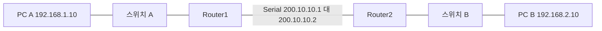
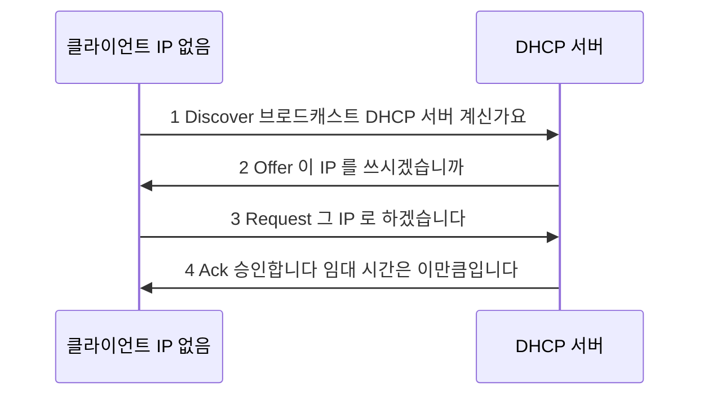
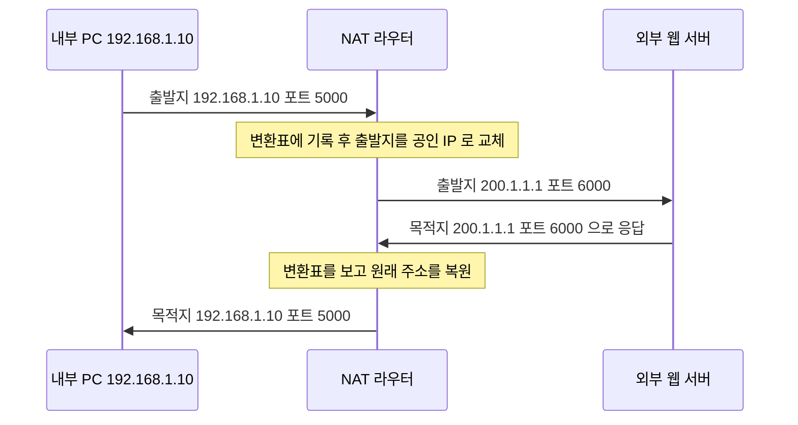

<Callout type="info">
  **이번 문서의 목표:** 이 파일을 다 읽으면 구성도만 보고 어느 라우터에 어떤 정적 경로를 넣어야 하는지 도출하고, ip route·ip default-network·ip default-gateway를 구분해 쓸 수 있으며, DHCP의 DORA 4단계와 NAT의 주소 변환 흐름을 설명할 수 있다.
</Callout>

## 0. 이 편이 실기에서 나오는 자리

세 주제 모두 기출에 등장합니다.

| 주제 | 등장 형태 | 회차 |
|------|----------|------|
| 정적 라우팅 | 라우터 CLI 문제 | 2023-3, 2024-3 |
| 기본 네트워크·기본 게이트웨이 | 라우터 CLI 문제 | 2024-1, 2024-2, 2024-3 |
| 라우팅 프로토콜 비교 | 단답형·선택형 | 2023-1, 2023-4, 2024-1, 2024-2 |
| DHCP | 윈도우 서버 작업형 + 단답형 | 전 회차 |
| NAT | 개념 이해 (공유기 문제의 전제) | 간접 |

특히 **DHCP는 8회분 전부에 등장**합니다. 윈도우 서버 작업형에서 범위·배제·임대 시간을 설정하는 문제로 나오고(09편에서 화면 조작을 다룹니다), 단답형에서는 DORA 4단계를 묻습니다.

## 1. 라우팅이란 무엇인가

### 왜 필요한가

라우터에는 인터페이스가 몇 개 붙어 있고, 각 인터페이스에는 IP와 마스크가 설정되어 있습니다. 라우터는 **자기에게 직접 붙은 대역은 자동으로 압니다.** 이것을 **직접 연결된 경로**(directly connected route)라고 하며, 라우팅 테이블에 `C`로 표시됩니다.

문제는 직접 붙지 않은 대역입니다. Router1에 `192.168.1.0/24`만 붙어 있는데 `192.168.2.0/24`로 가는 패킷이 오면, Router1은 "그런 동네는 모릅니다" 하고 패킷을 버립니다.

> **쉽게 말하면:** 우체국은 자기 관할 동네 주소만 압니다. 다른 동네로 가는 편지는 "어느 우체국에 넘길지"를 누군가 알려 줘야 합니다.

### 라우팅 테이블 읽기

```text
Router# show ip route
```

```text
Codes: C - connected, S - static, R - RIP, O - OSPF

C    192.168.1.0/24 is directly connected, GigabitEthernet0/0
C    200.10.10.0/30 is directly connected, Serial0/0/0
S    192.168.2.0/24 [1/0] via 200.10.10.2
S*   0.0.0.0/0 [1/0] via 200.10.10.2
```

각 줄을 해부합니다.

- **맨 앞 글자** — 이 경로를 어떻게 알게 됐는지. `C`는 직접 연결, `S`는 정적(static), `R`은 RIP, `O`는 OSPF
- **대역/프리픽스** — 목적지 네트워크
- **대괄호 안 두 숫자** — 앞이 **관리 거리**(AD, Administrative Distance), 뒤가 **메트릭**(metric)
- **via 뒤 주소** — 이 대역으로 가려면 넘겨야 할 다음 라우터의 IP, 즉 **넥스트 홉**(next hop)
- `S*`의 별표 — 기본 경로(default route)로 지정되었다는 표시

**관리 거리**는 "이 정보를 얼마나 믿을 만한가"를 나타내는 숫자로, **작을수록 더 신뢰**합니다.

| 경로 종류 | 관리 거리 |
|----------|----------|
| 직접 연결 | 0 |
| 정적 경로 | 1 |
| EIGRP | 90 |
| OSPF | 110 |
| RIP | 120 |
| 신뢰할 수 없음 | 255 |

같은 목적지에 대해 정적 경로와 RIP 경로가 함께 있다면, 관리 거리가 1인 정적 경로가 이깁니다.

## 2. 정적 라우팅 — 손으로 길을 알려주기

### 명령 문법

```text
Router(config)# ip route [목적지 네트워크] [서브넷 마스크] [넥스트 홉 IP]
```

각 자리의 뜻입니다.

- **목적지 네트워크** — 가고 싶은 대역의 **네트워크 주소**. 호스트 주소가 아닙니다
- **서브넷 마스크** — 점 십진 표기. CIDR 표기는 받지 않습니다
- **넥스트 홉 IP** — 그 대역으로 가려면 넘겨야 할 이웃 라우터의 IP

넥스트 홉 대신 나가는 인터페이스를 적을 수도 있습니다.

```text
Router(config)# ip route 192.168.2.0 255.255.255.0 serial 0/0/0
```

**시험에서는 문제가 넥스트 홉 IP를 주면 IP를, 인터페이스를 주면 인터페이스를 씁니다.** 기출은 전부 넥스트 홉 IP 방식이었습니다.

### 기출 완성 답안

2023년 3회 기출 17번입니다. 목적지 `10.10.20.0/24`, 넥스트 홉 `192.168.10.2`입니다.

```text
Router> enable
Router# configure terminal
Router(config)# ip route 10.10.20.0 255.255.255.0 192.168.10.2
Router(config)# exit
Router# copy running-config startup-config
```

`/24`를 `255.255.255.0`으로 바꾼 것을 확인하십시오.

2024년 3회 기출 17번은 인터페이스 설정과 정적 라우팅을 한 문제에 묶었습니다.

```text
Router> enable
Router# configure terminal
Router(config)# interface fastethernet 0/0
Router(config-if)# ip address 192.168.10.1 255.255.255.0
Router(config-if)# no shutdown
Router(config-if)# exit
Router(config)# ip route 192.168.20.0 255.255.255.0 192.168.10.2
Router(config)# exit
Router# copy running-config startup-config
```

**순서에 주목하십시오.** `ip route`는 인터페이스 명령이 아니라 **전역 설정 모드 명령**입니다. 그래서 인터페이스 모드에서 `exit`로 나온 뒤 `Router(config)#`에서 입력합니다.

**자주 틀리는 점:** `ip route`를 인터페이스 모드에서 입력하는 실수입니다. 프롬프트가 `Router(config-if)#`인 상태로 `ip route`를 치면 인식되지 않습니다.

### 구성도에서 정적 경로 도출하기



각 라우터가 아는 것과 모르는 것을 정리합니다.

| 라우터 | 직접 연결로 아는 대역 | 모르는 대역 | 넣어야 할 정적 경로 |
|--------|---------------------|-----------|-------------------|
| Router1 | 192.168.1.0/24, 200.10.10.0/30 | 192.168.2.0/24 | `ip route 192.168.2.0 255.255.255.0 200.10.10.2` |
| Router2 | 192.168.2.0/24, 200.10.10.0/30 | 192.168.1.0/24 | `ip route 192.168.1.0 255.255.255.0 200.10.10.1` |

**결과 해석:** 통신은 왕복이므로 **양쪽 라우터 모두에** 경로를 넣어야 합니다. 한쪽만 넣으면 편지는 가는데 답장이 오지 않습니다. `ping`이 전혀 응답하지 않는 흔한 원인이 이것입니다.

### 기본 경로 — 모르는 곳은 전부 이쪽으로

인터넷에 있는 대역을 전부 정적 경로로 넣는 것은 불가능합니다. 그래서 "여기 적힌 것 말고는 전부 이쪽으로 보내라"는 만능 경로를 씁니다.

```text
Router(config)# ip route 0.0.0.0 0.0.0.0 200.10.10.2
```

- `0.0.0.0` 목적지 — 아무 대역이나
- `0.0.0.0` 마스크 — 비교할 비트가 0개, 즉 모든 주소가 일치
- 결과 — 다른 어떤 경로에도 맞지 않는 패킷이 전부 여기로 갑니다

이것을 **기본 경로**(default route) 또는 **최후의 수단 게이트웨이**(gateway of last resort)라고 합니다.

### 헷갈리는 세 명령 구분하기

기출에 `ip default-network`와 `ip default-gateway`가 각각 나왔습니다. `ip route 0.0.0.0 0.0.0.0`까지 셋을 정확히 구분해야 합니다.

| 명령 | 쓰는 장비·상황 | 의미 |
|------|-------------|------|
| `ip route 0.0.0.0 0.0.0.0 넥스트홉` | 라우팅이 켜진 라우터 | 가장 표준적인 기본 경로 설정 |
| `ip default-network 대역` | 라우팅이 켜진 라우터 | 이미 알고 있는 대역 하나를 기본 경로처럼 지정. 구형 방식 |
| `ip default-gateway 주소` | 라우팅이 꺼진 장비 (스위치, 라우팅 비활성 라우터) | 자기 자신이 보낼 패킷의 게이트웨이 지정 |

`ip default-gateway`의 핵심은 "**자기 자신이 보내는 트래픽**"이라는 점입니다. L2 스위치는 라우팅을 하지 않지만, 관리자가 원격 접속할 수 있게 관리용 IP를 갖습니다. 그 스위치가 다른 대역의 관리자에게 응답하려면 게이트웨이를 알아야 하고, 그때 쓰는 명령이 `ip default-gateway`입니다.

기출 답안입니다.

2024년 1회 17번 — Default network 설정, IP `192.168.0.100`:

```text
Router> enable
Router# configure terminal
Router(config)# ip default-network 192.168.0.100
Router(config)# exit
Router# copy running-config startup-config
```

2024년 3회 18번 — Default Gateway 설정, IP `192.168.10.254`:

```text
Router> enable
Router# configure terminal
Router(config)# ip default-gateway 192.168.10.254
Router(config)# exit
Router# copy running-config startup-config
```

**문제가 쓴 용어를 그대로 명령으로 옮기십시오.** "Default network"라고 했으면 `ip default-network`, "Default Gateway"라고 했으면 `ip default-gateway`입니다. 문제의 용어가 곧 정답의 명령입니다.

## 3. 동적 라우팅 — 개념과 비교

정적 라우팅은 경로가 몇 개일 때는 편하지만, 라우터가 수십 대면 관리가 불가능합니다. 그래서 라우터끼리 경로 정보를 주고받는 **동적 라우팅 프로토콜**을 씁니다.

### 실기 단답형·선택형에 나오는 비교표

| 프로토콜 | 알고리즘 | 메트릭 | 특징 | 관리 거리 |
|---------|---------|--------|------|----------|
| RIP (Routing Information Protocol) | 거리 벡터 | 홉 수 | 최대 15홉, 30초마다 전체 테이블 교환 | 120 |
| IGRP (Interior Gateway Routing Protocol) | 거리 벡터 | 대역폭·지연 등 | 시스코 전용, 현재는 퇴역 | 100 |
| EIGRP (Enhanced IGRP) | 하이브리드 | 대역폭·지연 등 | 거리 벡터와 링크 상태의 장점 결합 | 90 |
| OSPF (Open Shortest Path First) | 링크 상태 | 코스트 (대역폭 기반) | 대규모 네트워크용, 개방 표준 | 110 |
| BGP (Border Gateway Protocol) | 경로 벡터 | 경로 속성 | 인터넷 사업자 간 라우팅 | 20 또는 200 |

기출에서 실제로 물었던 조합입니다.

- "홉 수를 메트릭으로 쓰는 것과 코스트·대역폭을 쓰는 것" → RIP와 OSPF (2023년 1회)
- "거리 벡터, 최대 홉 15" → RIP / "시스코 전용 거리 벡터" → IGRP / "하이브리드" → EIGRP / "링크 상태, 대규모" → OSPF (2024년 1회)
- "30초 주기 교환, 최대 홉 15" → RIP (2023년 4회)

### 거리 벡터와 링크 상태를 그 자리에서 이해하기

**거리 벡터**(distance vector)는 "목적지까지 몇 걸음이고 어느 방향인가"만 이웃에게 알려 주는 방식입니다. 각 라우터는 전체 지도를 모르고 이웃이 알려 준 말만 믿습니다.

> **쉽게 말하면:** 길을 물었더니 "저쪽으로 세 블록"이라고만 알려 주는 것입니다. 왜 그 길인지는 모릅니다.

**링크 상태**(link state)는 모든 라우터가 **전체 지도를 공유**하고 각자 최단 경로를 계산합니다. 계산에는 다익스트라(Dijkstra) 최단 경로 알고리즘을 씁니다.

> **쉽게 말하면:** 동네 전체 지도를 모두가 나눠 갖고 각자 최단 경로를 그립니다.

### OSPF 시험형 설정

2026년 3회 기출 18번에 OSPF가 나왔습니다.

```text
Router> enable
Router# configure terminal
Router(config)# router ospf 1
Router(config-router)# network 192.70.100.0 0.0.0.255 area 1
Router(config-router)# network 193.170.60.0 0.0.0.255 area 1
Router(config-router)# exit
Router(config)# exit
Router# show ip protocols
Router# copy running-config startup-config
```

명령을 해부합니다.

- `router ospf 1` — OSPF를 켭니다. 1은 **프로세스 ID**로, 그 라우터 안에서만 의미가 있는 번호입니다. 이웃과 같을 필요가 없습니다
- `network 192.70.100.0 0.0.0.255 area 1` — 이 대역에 속한 인터페이스에서 OSPF를 동작시킵니다
- `0.0.0.255` — **와일드카드 마스크**(wildcard mask)
- `area 1` — 이 대역이 속한 영역(area) 번호. 이웃과 **같아야** 인접 관계가 맺어집니다

### 와일드카드 마스크 — 서브넷 마스크의 반대

**와일드카드 마스크**는 서브넷 마스크를 비트 단위로 뒤집은 값입니다. 0은 "이 자리는 정확히 일치해야 함", 1은 "이 자리는 아무래도 좋음"을 뜻합니다.

계산은 간단합니다. 255에서 각 자리를 빼면 됩니다.

$$
255 - 255 = 0
$$

$$
255 - 0 = 255
$$

- 첫 식: 서브넷 마스크의 255인 자리는 와일드카드에서 0이 됩니다
- 둘째 식: 서브넷 마스크의 0인 자리는 와일드카드에서 255가 됩니다

| 서브넷 마스크 | 와일드카드 마스크 | CIDR |
|--------------|-----------------|------|
| 255.255.255.0 | 0.0.0.255 | /24 |
| 255.255.255.240 | 0.0.0.15 | /28 |
| 255.255.0.0 | 0.0.255.255 | /16 |
| 255.255.255.252 | 0.0.0.3 | /30 |

`255.255.255.240`의 마지막 자리를 확인해 봅니다.

$$
255 - 240 = 15
$$

**자주 틀리는 점:** OSPF의 `network` 명령에 서브넷 마스크를 그대로 쓰는 실수입니다. `255.255.255.0`이 아니라 `0.0.0.255`입니다. 반면 `ip route`는 **서브넷 마스크**를 씁니다. 두 명령이 요구하는 형식이 정반대라는 점을 기억하십시오.

### RIP 시험형 설정

```text
Router> enable
Router# configure terminal
Router(config)# router rip
Router(config-router)# version 2
Router(config-router)# network 192.168.1.0
Router(config-router)# network 192.168.2.0
Router(config-router)# no auto-summary
Router(config-router)# exit
Router(config)# exit
Router# copy running-config startup-config
```

RIP의 `network` 명령은 마스크를 쓰지 않고 **주 클래스 대역만** 적습니다. `version 2`는 서브넷 정보를 함께 보내는 RIPv2를 쓰겠다는 선언이고, `no auto-summary`는 자동 요약을 끄는 명령입니다.

## 4. DHCP — IP를 자동으로 빌려주기

### 왜 필요한가

PC 100대에 IP를 손으로 넣으려면 100번 작업해야 하고, 실수로 같은 IP를 두 번 넣으면 **IP 충돌**이 나서 둘 다 통신이 끊깁니다.

**DHCP**(Dynamic Host Configuration Protocol, 동적 호스트 구성 프로토콜)는 서버가 IP를 자동으로 빌려주는 규약입니다. 서버는 IP뿐 아니라 서브넷 마스크, 게이트웨이, DNS 서버 주소까지 함께 내려 줍니다.

> **쉽게 말하면:** 호텔 프런트에서 방 키를 받는 것과 같습니다. 며칠간 쓸 방 번호를 빌려주고, 기간이 끝나면 반납하거나 연장합니다.

### DORA 4단계

기출 단답형이 정확히 이 4단계를 물었습니다.



| 단계 | 이름 | 보내는 쪽 | 뜻 |
|------|------|----------|-----|
| D | Discover | 클라이언트 | 서버를 찾는 브로드캐스트 |
| O | Offer | 서버 | 사용 가능한 IP를 제안 |
| R | Request | 클라이언트 | 그 IP를 쓰겠다고 요청 |
| A | Ack (Acknowledgement) | 서버 | 승인과 임대 정보 전달 |

**첫 단계가 브로드캐스트인 이유**는 클라이언트에게 아직 IP가 없어서 특정 서버를 지목할 수 없기 때문입니다. 그래서 "이 동네 DHCP 서버 계신가요"를 모두에게 외칩니다.

### 시험에 나오는 DHCP 용어

기출 작업형에서 요구된 항목들입니다.

| 용어 | 뜻 | 기출 예시 값 |
|------|-----|------------|
| 범위 (Scope) | 나눠 줄 IP 구간 | 192.168.201.2 부터 192.168.201.254 |
| 배제 (Exclusion) | 범위 안에서 나눠 주지 않을 구간 | 192.168.1.10 부터 192.168.1.20 |
| 임대 기간 (Lease) | 빌려주는 기간 | 8시간, 24시간 |
| 예약 (Reservation) | 특정 MAC에 고정 IP 배정 | MAC 00-11-22-33-44-55 에 192.168.1.50 |
| 라우터 옵션 | 클라이언트에 알려줄 게이트웨이 | 192.168.201.1 |
| DNS 옵션 | 클라이언트에 알려줄 DNS | 8.8.8.8, 8.8.4.4 |

**배제**를 쓰는 이유는, 범위 안에 이미 고정 IP로 쓰고 있는 서버나 프린터가 있을 때 그 주소를 다른 PC에 나눠 주지 않기 위해서입니다.

### 라우터의 DHCP 서버 설정

```text
Router> enable
Router# configure terminal
Router(config)# ip dhcp excluded-address 192.168.1.1 192.168.1.10
Router(config)# ip dhcp pool OFFICE
Router(dhcp-config)# network 192.168.1.0 255.255.255.0
Router(dhcp-config)# default-router 192.168.1.1
Router(dhcp-config)# dns-server 8.8.8.8
Router(dhcp-config)# lease 0 8 0
Router(dhcp-config)# exit
Router(config)# exit
Router# copy running-config startup-config
```

- `ip dhcp excluded-address` — 배제할 구간. **풀을 만들기 전에** 지정하는 것이 관례입니다
- `ip dhcp pool 이름` — 풀 생성. 프롬프트가 `Router(dhcp-config)#`으로 바뀝니다
- `network` — 나눠 줄 대역
- `default-router` — 클라이언트에게 알려줄 게이트웨이
- `dns-server` — 클라이언트에게 알려줄 DNS
- `lease 0 8 0` — 임대 기간을 일, 시, 분 순으로. 이 예는 8시간입니다

## 5. NAT — 사설 주소를 공인 주소로

### 왜 필요한가

IPv4 주소는 32비트여서 이론상 약 43억 개입니다.

$$
2^{32} = 4294967296
$$

- 32: IPv4 주소의 전체 비트 수
- 결과: 약 43억 개

전 세계 인구와 기기 수를 생각하면 턱없이 모자랍니다. 그래서 회사·가정 내부에서는 **사설 IP**를 쓰고, 인터넷으로 나갈 때만 공인 IP로 바꿉니다. 이 변환이 **NAT**(Network Address Translation, 네트워크 주소 변환)입니다.

> **쉽게 말하면:** 회사 대표 전화번호 하나로 직원 100명이 외부와 통화하는 것과 같습니다. 교환대가 내선 번호를 기억해 두었다가 걸려온 전화를 맞는 자리로 돌려줍니다.

### 동작 흐름



### NAT의 종류

| 종류 | 방식 | 특징 |
|------|------|------|
| 정적 NAT (Static NAT) | 사설 IP 하나를 공인 IP 하나에 고정 매핑 | 외부에서 내부 서버로 접속시킬 때 |
| 동적 NAT (Dynamic NAT) | 공인 IP 풀에서 남는 것을 골라 매핑 | 공인 IP가 여러 개 있을 때 |
| PAT (Port Address Translation) | 공인 IP 하나에 포트 번호로 여러 사설 IP 구분 | 가정용 공유기가 쓰는 방식. NAT 오버로드라고도 함 |

가정용 공유기가 쓰는 것이 **PAT**입니다. 공인 IP 하나로 수십 대가 인터넷을 쓸 수 있는 이유가 포트 번호로 구분하기 때문입니다.

### 시험형 PAT 설정

```text
Router> enable
Router# configure terminal
Router(config)# access-list 1 permit 192.168.1.0 0.0.0.255
Router(config)# ip nat inside source list 1 interface serial 0/0/0 overload
Router(config)# interface gigabitethernet 0/0
Router(config-if)# ip nat inside
Router(config-if)# exit
Router(config)# interface serial 0/0/0
Router(config-if)# ip nat outside
Router(config-if)# exit
Router(config)# exit
Router# copy running-config startup-config
```

- `access-list 1 permit 192.168.1.0 0.0.0.255` — 변환 대상이 될 내부 대역을 지정합니다. 여기도 **와일드카드 마스크**를 씁니다
- `ip nat inside source list 1 interface serial 0/0/0 overload` — 목록 1에 해당하는 출발지를 시리얼 인터페이스의 IP로 바꾸고, `overload`가 PAT를 뜻합니다
- `ip nat inside` — 내부 쪽 인터페이스 지정
- `ip nat outside` — 외부 쪽 인터페이스 지정

**자주 틀리는 점:** `ip nat inside`와 `ip nat outside`를 인터페이스에 지정하지 않는 실수입니다. 어느 쪽이 안이고 밖인지 라우터가 모르면 변환이 일어나지 않습니다.

## 핵심 정리

- 라우터는 직접 붙은 대역만 자동으로 알며, 나머지는 정적 경로나 동적 라우팅 프로토콜로 알려 줘야 한다.
- `ip route 목적지 서브넷마스크 넥스트홉`은 전역 설정 모드 명령이며, 서브넷 마스크는 점 십진으로 푼다.
- 통신은 왕복이므로 양쪽 라우터 모두에 경로를 넣어야 한다.
- `ip route 0.0.0.0 0.0.0.0`은 표준 기본 경로, `ip default-network`는 구형 방식, `ip default-gateway`는 라우팅이 꺼진 장비가 자기 트래픽을 보낼 때 쓴다. 문제의 용어가 곧 명령이다.
- OSPF의 `network` 명령은 와일드카드 마스크를, `ip route`는 서브넷 마스크를 쓴다. 형식이 정반대다.
- DHCP는 Discover, Offer, Request, Ack의 DORA 4단계로 동작하며 첫 단계는 브로드캐스트다.
- NAT는 사설 IP를 공인 IP로 바꾸는 기술이며, 포트 번호로 여러 사설 IP를 구분하는 방식이 PAT다.

## 마무리 복습

<Quiz
  questionNumber={1}
  question="목적지 네트워크 10.10.20.0/24 로 가는 정적 경로를 넥스트 홉 192.168.10.2 로 설정하는 명령으로 옳은 것은?"
  options={['ip route 10.10.20.0/24 192.168.10.2', 'ip route 10.10.20.0 255.255.255.0 192.168.10.2', 'ip route 10.10.20.0 0.0.0.255 192.168.10.2', 'route add 10.10.20.0 mask 255.255.255.0 192.168.10.2']}
  correctAnswer={2}
  explanation="ip route 명령은 목적지 네트워크 주소 다음에 점 십진 서브넷 마스크 그리고 넥스트 홉 IP 순서로 입력한다. CIDR 표기나 와일드카드 마스크는 사용하지 않는다."
  optionExplanations={['IOS 는 슬래시 표기를 받지 않는다', '정답 — 마스크를 점 십진으로 풀어 쓴 형태다', '와일드카드 마스크는 OSPF 의 network 명령에서 쓴다', 'route add 는 윈도우 명령 프롬프트의 문법이다']}
/>

<Quiz
  questionNumber={2}
  question="ip route 명령을 입력해야 하는 프롬프트는?"
  options={['Router# 특권 모드', 'Router(config)# 전역 설정 모드', 'Router(config-if)# 인터페이스 설정 모드', 'Router(config-router)# 라우팅 프로토콜 모드']}
  correctAnswer={2}
  explanation="정적 경로는 장비 전체의 라우팅 테이블에 등록되는 항목이므로 전역 설정 모드에서 입력한다. 인터페이스 모드에서 입력하면 인식되지 않는다."
  optionExplanations={['특권 모드에서는 설정 명령을 입력할 수 없다', '정답 — 전역 설정 모드 명령이다', '인터페이스 모드에서 흔히 저지르는 실수다', '이 모드는 router ospf 나 router rip 진입 후의 자리다']}
/>

<Quiz
  questionNumber={3}
  question="DHCP 의 동작 4단계 DORA 의 순서로 옳은 것은?"
  options={['Discover Offer Request Ack', 'Offer Discover Ack Request', 'Request Offer Discover Ack', 'Discover Request Offer Ack']}
  correctAnswer={1}
  explanation="클라이언트가 브로드캐스트로 서버를 찾고 Discover 서버가 IP 를 제안하며 Offer 클라이언트가 그것을 요청하고 Request 서버가 승인한다 Ack. 앞글자를 따 DORA 라고 부른다."
  optionExplanations={['정답 — 찾기 제안 요청 승인의 순서다', '제안이 찾기보다 먼저 올 수 없다', '요청이 첫 단계가 될 수 없다', '요청은 제안을 받은 뒤에 이루어진다']}
/>

<Quiz
  questionNumber={4}
  question="OSPF 설정에서 network 192.70.100.0 0.0.0.255 area 1 의 0.0.0.255 가 의미하는 것은?"
  options={['서브넷 마스크', '와일드카드 마스크', '브로드캐스트 주소', '넥스트 홉 주소']}
  correctAnswer={2}
  explanation="OSPF 의 network 명령은 와일드카드 마스크를 사용한다. 서브넷 마스크 255.255.255.0 을 비트 단위로 뒤집으면 0.0.0.255 가 된다. 0은 정확히 일치해야 하는 자리 255는 무시해도 되는 자리를 뜻한다."
  optionExplanations={['서브넷 마스크였다면 255.255.255.0 으로 적었을 것이다', '정답 — 서브넷 마스크를 뒤집은 값이다', '브로드캐스트 주소는 대역의 마지막 주소다', '넥스트 홉은 OSPF network 명령에 들어가지 않는다']}
/>

<Quiz
  questionNumber={5}
  question="라우팅 프로토콜과 메트릭의 짝으로 옳은 것은?"
  options={['RIP 는 코스트 OSPF 는 홉 수', 'RIP 는 홉 수 OSPF 는 코스트', '둘 다 홉 수를 사용한다', '둘 다 지연 시간만 사용한다']}
  correctAnswer={2}
  explanation="RIP 는 거리 벡터 방식으로 홉 수를 메트릭으로 쓰며 최대 15홉으로 제한된다. OSPF 는 링크 상태 방식으로 대역폭에 기반한 코스트를 사용한다."
  optionExplanations={['둘의 메트릭이 서로 뒤바뀐 설명이다', '정답 — 기출에서 반복 출제된 조합이다', 'OSPF 는 홉 수를 쓰지 않는다', 'RIP 는 지연 시간을 고려하지 않는다']}
/>

<Quiz
  questionNumber={6}
  question="라우팅 기능을 사용하지 않는 L2 스위치가 자기 자신의 관리 트래픽을 다른 대역으로 보낼 때 지정하는 명령은?"
  options={['ip route 0.0.0.0 0.0.0.0 주소', 'ip default-network 대역', 'ip default-gateway 주소', 'ip nat outside']}
  correctAnswer={3}
  explanation="ip default-gateway 는 라우팅이 꺼진 장비가 자기 자신이 보내는 패킷의 게이트웨이를 지정할 때 사용한다. 라우팅이 켜진 라우터에서는 ip route 0.0.0.0 0.0.0.0 을 쓴다."
  optionExplanations={['이 명령은 라우팅이 활성화된 라우터의 기본 경로 설정이다', 'ip default-network 는 라우터에서 쓰는 구형 기본 경로 지정 방식이다', '정답 — 라우팅 비활성 장비 전용 명령이다', 'NAT 인터페이스 지정과는 무관하다']}
/>

<Quiz
  questionNumber={7}
  question="가정용 공유기가 하나의 공인 IP 로 여러 대의 내부 기기를 인터넷에 연결시킬 때 사용하는 기술은?"
  options={['정적 NAT', 'PAT 즉 NAT 오버로드', '동적 라우팅', '프록시 ARP']}
  correctAnswer={2}
  explanation="PAT 는 Port Address Translation 의 약자로 포트 번호를 이용해 여러 사설 IP 를 하나의 공인 IP 에 매핑한다. 시스코 명령에서는 overload 키워드로 활성화한다."
  optionExplanations={['정적 NAT 는 사설 하나와 공인 하나를 고정 매핑한다', '정답 — 포트 번호로 구분해 다대일 변환을 수행한다', '동적 라우팅은 경로 정보 교환 기술로 주소 변환과 무관하다', '프록시 ARP 는 다른 목적의 기술이다']}
/>

<Quiz
  questionNumber={8}
  question="Router1 에만 상대 대역으로 가는 정적 경로를 넣고 Router2 에는 넣지 않았다. 예상되는 결과는?"
  options={['양방향 통신이 정상 동작한다', 'ping 이 나가더라도 응답이 돌아오지 못해 통신에 실패한다', '자동으로 경로가 학습되어 문제없다', 'Router1 의 인터페이스가 down 된다']}
  correctAnswer={2}
  explanation="통신은 왕복이므로 요청이 도달해도 응답 패킷이 돌아올 경로를 Router2 가 모르면 실패한다. 정적 라우팅은 자동 학습이 없으므로 양쪽 모두에 경로를 넣어야 한다."
  optionExplanations={['한쪽 경로만으로는 왕복이 성립하지 않는다', '정답 — 응답 경로 부재가 실패 원인이다', '정적 경로는 자동 학습되지 않는다', '경로 부재는 인터페이스 상태를 바꾸지 않는다']}
/>

## 참고 자료

- [Cisco IOS Commands 참조 자료](https://germanna.edu/sites/default/files/2026-02/Cisco%20IOS%20Commands.pdf)
- [Cisco IOS Command Reference 요약](https://courseiva.com/commands/cisco)
- [ICQA - 국가공인자격증 네트워크관리사 2급](https://www.icqa.or.kr/cn/page/network)
