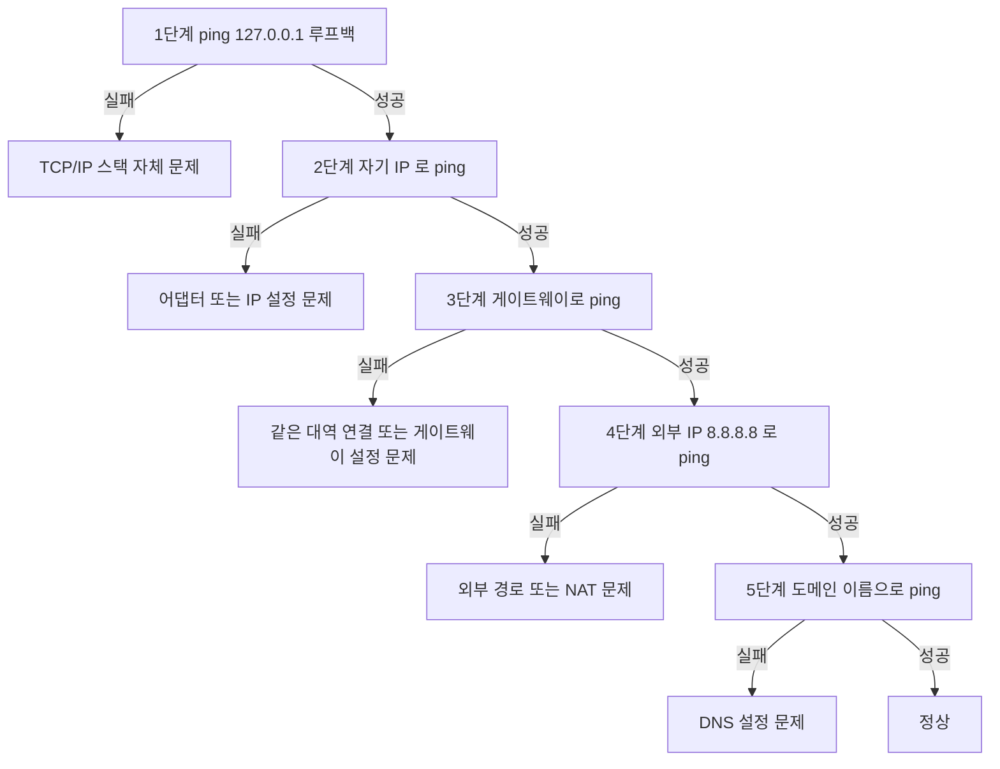

<Callout type="info">
  **이번 문서의 목표:** 이 파일을 다 읽으면 윈도우 진단 명령의 출력 한 줄 한 줄을 해석할 수 있고, 2진수로 주어진 IP와 비트 수로 주어진 마스크를 변환해 네트워크 속성 창의 어느 칸에 무엇을 넣을지 순서대로 실행할 수 있다.
</Callout>

## 0. 실기에서 윈도우가 차지하는 비중

18문제 중 **8문제가 윈도우 서버 작업형**입니다. 그중에서도 **2번 문제는 8회분 전부에서 네트워크 속성 설정**이었습니다.

| 회차 | 제시 형태 | 정답 IP | 정답 마스크 |
|------|----------|--------|-----------|
| 2023-1 | 192.168.100.0/27, 첫 주소 | 192.168.100.1 | 255.255.255.224 |
| 2023-2 | 192.168.10.0/28, 첫 주소 | 192.168.10.1 | 255.255.255.240 |
| 2023-4 | 192.168.1.0/27, 첫 주소 | 192.168.1.1 | 255.255.255.224 |
| 2024-1 | 210.100.100.0/28, 마지막 주소 | 210.100.100.14 | 255.255.255.240 |
| 2026-3 | 2진수 IP + 22bit 마스크 | 172.16.150.115 | 255.255.252.0 |

**이 한 문제가 실기 전체에서 가장 계산량이 많고, 가장 배점이 확실한 문제**입니다. 여기부터 확실히 잡습니다.

## 1. 네트워크 속성 설정 — 작업형 완전 공략

### 화면에 도달하는 경로

<Steps>

### 1단계 — 네트워크 연결 창 열기

`Windows` 키 + `R`을 눌러 실행 창을 띄우고 `ncpa.cpl`을 입력한 뒤 확인을 누릅니다. 제어판을 거치는 것보다 훨씬 빠릅니다.

### 2단계 — 어댑터 속성 열기

사용 중인 어댑터(보통 `이더넷` 또는 `Ethernet0`)를 마우스 오른쪽 버튼으로 클릭하고 `속성`을 선택합니다.

### 3단계 — IPv4 속성 열기

목록에서 `인터넷 프로토콜 버전 4(TCP/IPv4)`를 **더블클릭**하거나, 선택한 뒤 `속성` 버튼을 누릅니다.

### 4단계 — 수동 입력 모드로 전환

`다음 IP 주소 사용`과 `다음 DNS 서버 주소 사용`을 각각 선택합니다. **이 라디오 버튼을 누르지 않으면 입력칸이 회색으로 잠겨 값을 넣을 수 없습니다.**

### 5단계 — 값 입력

IP 주소, 서브넷 마스크, 기본 게이트웨이, 기본 설정 DNS 서버, 보조 DNS 서버를 채웁니다.

### 6단계 — 추가 게이트웨이가 있으면 고급 창으로

`고급` 버튼을 눌러 `IP 설정` 탭의 `기본 게이트웨이` 영역에서 `추가`를 눌러 두 번째 게이트웨이를 넣습니다.

### 7단계 — 확인을 눌러 닫는다

고급 창의 `확인`, IPv4 속성 창의 `확인`, 어댑터 속성 창의 `확인`까지 **세 번** 눌러야 실제로 적용됩니다.

</Steps>

<Callout type="warning">
  **확인·적용 버튼 미클릭은 8회분 기출 모두가 첫머리에 경고하는 감점 원인입니다.** 값을 정확히 넣고도 창을 그냥 닫으면 아무것도 저장되지 않습니다. 창이 닫히는 것을 눈으로 확인하십시오.
</Callout>

### 계산 유형 1 — CIDR에서 첫·마지막 주소 구하기

2023년 1회 유형입니다. 조건은 `192.168.100.0/27`, IP는 사용 가능한 첫 주소, 게이트웨이는 사용 가능한 마지막 주소, DNS는 `168.126.63.1`입니다.

<Steps>

### 마스크를 구한다

/27이므로 세 번째 토막까지 24비트를 채우고 네 번째 토막에 3비트가 남습니다. 마지막 토막의 1이 3개이므로 십진수는 다음과 같습니다.

$$
256 - 2^{5} = 256 - 32 = 224
$$

따라서 마스크는 `255.255.255.224`입니다.

### 블록 크기를 구한다

호스트 비트는 32에서 27을 뺀 5개이므로 블록 크기는 다음과 같습니다.

$$
2^{5} = 32
$$

### 경계를 나열한다

블록이 32이므로 네 번째 토막의 경계는 0, 32, 64, 96, 128, 160, 192, 224입니다. 주어진 `192.168.100.0`은 첫 블록의 네트워크 주소입니다.

### 브로드캐스트를 구한다

네트워크 주소에 블록 크기를 더하고 1을 뺍니다.

$$
0 + 32 - 1 = 31
$$

브로드캐스트는 `192.168.100.31`입니다.

### 첫·마지막 사용 가능 주소를 확정한다

첫 주소는 `192.168.100.1`, 마지막 주소는 `192.168.100.30`입니다.

</Steps>

**입력할 값**

| 칸 이름 | 넣을 값 |
|--------|--------|
| IP 주소 | 192.168.100.1 |
| 서브넷 마스크 | 255.255.255.224 |
| 기본 게이트웨이 | 192.168.100.30 |
| 기본 설정 DNS 서버 | 168.126.63.1 |

### 계산 유형 2 — 2진수 IP와 비트 마스크

2026년 3회 유형입니다. 조건은 다음과 같습니다.

- IP address: `10101100.00010000.10010110.01110011`
- Subnet mask: `22bit`
- Default gateway: `192.168.100.254`
- 추가 gateway: `192.168.100.253`
- DNS 서버: `200.100.100.200`
- 보조 DNS: `201.100.100.201`

**IP 변환**을 토막별로 표로 풀어냅니다. 가중치는 왼쪽부터 128, 64, 32, 16, 8, 4, 2, 1입니다.

| 토막 | 2진수 | 1인 자리의 가중치 | 십진수 |
|------|-------|-----------------|--------|
| 1번째 | 10101100 | 128, 32, 8, 4 | 172 |
| 2번째 | 00010000 | 16 | 16 |
| 3번째 | 10010110 | 128, 16, 4, 2 | 150 |
| 4번째 | 01110011 | 64, 32, 16, 2, 1 | 115 |

각 토막의 계산을 확인합니다.

$$
128 + 32 + 8 + 4 = 172
$$

$$
128 + 16 + 4 + 2 = 150
$$

$$
64 + 32 + 16 + 2 + 1 = 115
$$

따라서 IP 주소는 `172.16.150.115`입니다.

**마스크 변환**입니다. 22비트이므로 1이 22개입니다.

| 토막 | 비트 배열 | 누적 1의 개수 | 십진수 |
|------|----------|-------------|--------|
| 1번째 | 11111111 | 8 | 255 |
| 2번째 | 11111111 | 16 | 255 |
| 3번째 | 11111100 | 22 | 252 |
| 4번째 | 00000000 | 22 | 0 |

세 번째 토막은 1이 6개이므로 이렇게 계산됩니다.

$$
256 - 2^{2} = 256 - 4 = 252
$$

따라서 마스크는 `255.255.252.0`입니다.

**입력할 값 전체**

| 칸 이름 | 넣을 값 | 위치 |
|--------|--------|------|
| IP 주소 | 172.16.150.115 | 기본 화면 |
| 서브넷 마스크 | 255.255.252.0 | 기본 화면 |
| 기본 게이트웨이 | 192.168.100.254 | 기본 화면 |
| 추가 게이트웨이 | 192.168.100.253 | 고급 버튼 안 IP 설정 탭 |
| 기본 설정 DNS 서버 | 200.100.100.200 | 기본 화면 |
| 보조 DNS 서버 | 201.100.100.201 | 기본 화면 |

**자주 틀리는 점 세 가지**

1. **추가 게이트웨이를 기본 화면에서 찾다가 포기하는 것.** 기본 화면에는 게이트웨이 칸이 하나뿐입니다. 반드시 `고급` 버튼으로 들어가십시오.
2. **마스크를 22비트가 아니라 24비트로 착각하는 것.** 세 번째 토막이 255가 아니라 252입니다.
3. **보조 DNS를 비워 두는 것.** 문제가 값을 줬으면 넣습니다. 2024년 1회처럼 `0.0.0.0`을 주는 경우도 그대로 넣거나 비워 두는 것이 정답 처리되었습니다.

## 2. ipconfig — 내 상태를 보는 첫 번째 명령

명령 프롬프트는 `Windows` 키 + `R`에서 `cmd`를 입력해 엽니다.

### 기본 사용

```text
C:\> ipconfig
```

```text
이더넷 어댑터 이더넷:

   연결별 DNS 접미사. . . . :
   IPv4 주소 . . . . . . . . : 192.168.100.1
   서브넷 마스크 . . . . . . : 255.255.255.224
   기본 게이트웨이 . . . . . : 192.168.100.30
```

설정한 값이 그대로 나오는지 **검산**하는 용도로 씁니다. 작업형 문제를 풀고 이 명령으로 확인하면 실수를 잡아낼 수 있습니다.

### 옵션별 정리

| 명령 | 하는 일 | 언제 쓰나 |
|------|--------|----------|
| `ipconfig` | IP, 마스크, 게이트웨이 요약 | 빠른 확인 |
| `ipconfig /all` | MAC 주소, DNS 서버, DHCP 정보까지 전부 | 상세 확인, MAC 주소 조회 |
| `ipconfig /release` | DHCP로 받은 IP를 반납 | IP 재할당 전 |
| `ipconfig /renew` | DHCP 서버에 IP를 다시 요청 | 반납 후 재취득 |
| `ipconfig /flushdns` | DNS 캐시를 비움 | 이름 해석이 옛 값으로 남을 때 |
| `ipconfig /displaydns` | DNS 캐시 내용 표시 | 캐시 확인 |

`ipconfig /all`에서 확인할 수 있는 추가 정보입니다.

```text
   물리적 주소 . . . . . . . : 00-11-22-33-44-55
   DHCP 사용 . . . . . . . . : 아니요
   DNS 서버. . . . . . . . . : 200.100.100.200
                               201.100.100.201
```

**물리적 주소**가 곧 MAC 주소입니다. 윈도우는 하이픈으로 구분해 표시합니다.

> **쉽게 말하면:** `ipconfig`는 "내 명함 보여 줘", `ipconfig /all`은 "명함 뒷면까지 다 보여 줘"입니다.

### 자기 자신을 부여받은 특수 주소

`ipconfig` 결과에 `169.254.x.x`가 보인다면 **APIPA**(Automatic Private IP Addressing, 자동 사설 IP 주소 지정) 주소입니다. DHCP 서버를 찾지 못했을 때 윈도우가 스스로 붙이는 임시 주소로, 이 주소로는 외부 통신이 되지 않습니다. **DHCP 서버가 죽었거나 랜선이 빠졌다는 신호**입니다.

## 3. ping — 살아 있는지 두드려 보기

### 원리

`ping`은 **ICMP**(Internet Control Message Protocol, 인터넷 제어 메시지 프로토콜)의 Echo Request(메아리 요청)를 보내고 Echo Reply(메아리 응답)를 기다립니다. 응답이 오면 목적지가 살아 있고 경로도 뚫려 있다는 뜻입니다.

기출 단답형에 그대로 나왔습니다. "ICMP Echo Request 패킷을 보낼 때 사용하는 명령어"의 답은 `ping`입니다.

```text
C:\> ping 192.168.100.30
```

```text
192.168.100.30에 ping을 보내는 중 32바이트 데이터:
192.168.100.30의 응답: 바이트=32 시간=1ms TTL=128
192.168.100.30의 응답: 바이트=32 시간=1ms TTL=128

192.168.100.30에 대한 Ping 통계:
    패킷: 보냄 = 4, 받음 = 4, 손실 = 0 (0% 손실),
왕복 시간(밀리초):
    최소 = 1ms, 최대 = 2ms, 평균 = 1ms
```

- **시간** — 왕복 지연(RTT, Round Trip Time). 밀리초 단위입니다
- **TTL**(Time To Live, 생존 시간) — 패킷이 지날 수 있는 라우터 수의 잔량. 라우터를 하나 지날 때마다 1씩 줄고 0이 되면 폐기됩니다. 초기값이 128이면 윈도우, 64면 리눅스, 255면 네트워크 장비인 경우가 많습니다
- **손실** — 0퍼센트가 정상입니다

### 실패 메시지 읽기

| 메시지 | 뜻 | 원인 추정 |
|-------|-----|----------|
| 요청 시간이 만료되었습니다 (Request timed out) | 응답이 오지 않음 | 목적지가 꺼짐, 방화벽 차단, 경로 단절 |
| 대상 호스트에 연결할 수 없습니다 (Destination host unreachable) | 경로 자체를 모름 | 게이트웨이 설정 오류, 라우팅 경로 부재 |
| 전송 실패, 일반 오류 | 로컬 어댑터 문제 | 랜선 분리, 어댑터 비활성 |
| 알 수 없는 호스트 | 이름 해석 실패 | DNS 설정 오류 |

**진단 순서**를 익혀 두면 문제를 빠르게 좁힐 수 있습니다.



**5단계가 중요합니다.** `ping 8.8.8.8`은 되는데 `ping www.google.com`이 안 되면, 네트워크는 정상이고 **DNS만 잘못된 것**입니다.

### 주요 옵션

| 옵션 | 뜻 |
|------|-----|
| `-t` | 중지할 때까지 계속. `Ctrl` + `C`로 종료 |
| `-n 횟수` | 보낼 개수 지정 |
| `-l 크기` | 패킷 크기 지정 (바이트) |
| `-a` | IP를 호스트 이름으로 역조회 |

## 4. tracert와 pathping — 경로 추적

### tracert

기출 단답형이 두 번이나 물었습니다. "네트워크 경로를 추적하여 각 구간의 응답 시간을 측정하는 도구"의 답은 `tracert`입니다. 리눅스에서는 `traceroute`입니다.

```text
C:\> tracert 8.8.8.8
```

```text
최대 30홉 이상의
8.8.8.8(으)로 가는 경로 추적:

  1     1 ms     1 ms     1 ms  192.168.100.30
  2    12 ms    11 ms    12 ms  10.20.30.1
  3    15 ms    14 ms    15 ms  203.248.x.x
  4     *        *        *     요청 시간이 만료되었습니다.
  5    18 ms    17 ms    18 ms  8.8.8.8

추적을 완료했습니다.
```

**동작 원리**가 흥미롭습니다. TTL을 1로 설정해 보내면 첫 라우터에서 TTL이 0이 되어 폐기되고, 그 라우터가 "시간 초과" 메시지를 보내옵니다. 그 메시지의 출발지가 곧 첫 라우터의 주소입니다. TTL을 2, 3, 4로 늘려가며 반복하면 경로 전체가 드러납니다.

> **쉽게 말하면:** 연료를 딱 1리터만 넣어 보내면 첫 주유소에서 멈추고 거기서 전화가 옵니다. 2리터를 넣으면 두 번째 주유소에서 전화가 옵니다.

**별표(`*`)가 나오는 이유**는 그 라우터가 ICMP 응답을 하지 않도록 설정되어 있기 때문입니다. **별표가 있어도 그 뒤 홉이 정상적으로 응답한다면 통신에는 문제가 없습니다.** 이 점을 모르면 멀쩡한 경로를 장애로 오판합니다.

### pathping

`pathping`은 `tracert`와 `ping`을 합친 명령입니다. 경로를 추적한 뒤, 각 홉마다 여러 번 패킷을 보내 **구간별 손실률**을 계산합니다.

```text
C:\> pathping 8.8.8.8
```

경로 추적 후 통계 수집에 시간이 걸리므로(기본 약 5분) 시험 중에는 개념만 알면 충분합니다. **어느 구간에서 패킷이 새는지**를 찾아내는 것이 목적입니다.

| 명령 | 속도 | 알려주는 것 |
|------|------|-----------|
| `ping` | 즉시 | 목적지 도달 여부와 지연 |
| `tracert` | 수초 | 거쳐 가는 라우터 목록 |
| `pathping` | 수분 | 구간별 손실률까지 |

## 5. arp — IP와 MAC의 대응표

### 원리

같은 네트워크 안에서 실제 배달은 MAC 주소로 이루어집니다. IP는 알지만 MAC을 모를 때 **ARP**(Address Resolution Protocol, 주소 결정 프로토콜)로 물어봅니다.

기출 단답형이 물었습니다. "논리적인 IP 주소를 기반으로 물리적인 MAC 주소를 알아내는 프로토콜"의 답은 `ARP`입니다.

```text
C:\> arp -a
```

```text
인터페이스: 192.168.100.1 --- 0x5
  인터넷 주소           물리적 주소           유형
  192.168.100.30        00-11-22-33-44-55     동적
  192.168.100.255       ff-ff-ff-ff-ff-ff     정적
```

- **동적**(dynamic) — 통신하면서 자동으로 학습된 항목. 일정 시간 후 사라집니다
- **정적**(static) — 손으로 등록했거나 시스템이 고정한 항목

| 명령 | 하는 일 |
|------|--------|
| `arp -a` | ARP 캐시 전체 표시 |
| `arp -d` | ARP 캐시 삭제 (관리자 권한 필요) |
| `arp -s IP MAC` | 정적 항목 추가 |

**ARP의 반대 방향**은 **RARP**(Reverse ARP)로, MAC을 알 때 IP를 알아냅니다. 선택형에서 방향을 뒤집어 출제하므로 주의하십시오.

## 6. netstat — 지금 열려 있는 연결 보기

기출 단답형이 물었습니다. "활성화된 네트워크 연결과 각 연결의 상태, 포트 정보, 라우팅 테이블 등을 표시하는 도구"의 답은 `netstat`입니다.

```text
C:\> netstat -an
```

```text
프로토콜  로컬 주소              외부 주소              상태
  TCP    0.0.0.0:80             0.0.0.0:0              LISTENING
  TCP    192.168.100.1:5000     93.184.216.34:443      ESTABLISHED
  UDP    0.0.0.0:53             *:*
```

| 옵션 | 하는 일 |
|------|--------|
| `-a` | 모든 연결과 대기 중인 포트 표시 |
| `-n` | 이름을 해석하지 않고 숫자로 표시 (빠름) |
| `-o` | 프로세스 ID를 함께 표시 |
| `-r` | 라우팅 테이블 표시. `route print`와 같음 |
| `-s` | 프로토콜별 통계 |

**연결 상태**의 뜻입니다.

| 상태 | 뜻 |
|------|-----|
| LISTENING | 접속을 기다리는 중 |
| ESTABLISHED | 연결이 수립되어 통신 중 |
| TIME_WAIT | 종료 후 잔여 패킷을 기다리는 중 |
| SYN_SENT | 연결 요청을 보내고 응답 대기 중 |
| CLOSE_WAIT | 상대가 종료를 알려와 정리 대기 중 |

`0.0.0.0:80`이 LISTENING이면 **모든 인터페이스의 80번 포트에서 접속을 기다린다**는 뜻입니다. 웹 서버가 정상 동작 중이라는 신호입니다.

## 7. nslookup — DNS에게 직접 물어보기

기출 단답형이 물었습니다. "DNS 질의를 통해 IP 주소나 호스트 이름을 조회하는 진단 명령어"의 답은 `nslookup`입니다.

```text
C:\> nslookup www.icqa.or.kr
```

```text
서버:    dns.kt.com
Address:  168.126.63.1

권한 없는 응답:
이름:    www.icqa.or.kr
Address:  211.253.x.x
```

- **서버** — 질문을 받은 DNS 서버. 내 PC에 설정된 DNS입니다
- **권한 없는 응답**(Non-authoritative answer) — 캐시에서 온 답이라는 뜻으로, 정상입니다

특정 DNS 서버에게 물어보려면 뒤에 서버 주소를 붙입니다.

```text
C:\> nslookup www.icqa.or.kr 8.8.8.8
```

**진단 활용:** `ping 도메인이름`이 실패할 때 `nslookup 도메인이름`을 해 보면, 이름 해석 자체가 안 되는 것인지 해석은 되는데 통신이 안 되는 것인지 구분할 수 있습니다.

## 8. route — 내 PC의 라우팅 테이블

```text
C:\> route print
```

```text
IPv4 경로 테이블
활성 경로:
네트워크 대상       네트워크 마스크    게이트웨이       인터페이스     메트릭
      0.0.0.0          0.0.0.0   192.168.100.30  192.168.100.1     25
192.168.100.0  255.255.255.224          연결됨   192.168.100.1    281
```

- 첫 줄의 `0.0.0.0 / 0.0.0.0` — 기본 경로입니다. 게이트웨이 열의 값이 곧 기본 게이트웨이입니다
- 둘째 줄의 `연결됨`(On-link) — 직접 붙은 대역이라 게이트웨이를 거치지 않는다는 뜻입니다
- **메트릭** — 여러 경로가 있을 때 작은 쪽을 선택합니다

| 명령 | 하는 일 |
|------|--------|
| `route print` | 라우팅 테이블 표시 |
| `route add 대역 mask 마스크 게이트웨이` | 경로 추가 (관리자 권한) |
| `route delete 대역` | 경로 삭제 |
| `route add ... -p` | 재부팅 후에도 유지되는 영구 경로 |

**자주 틀리는 점:** `-p` 없이 추가한 경로는 재부팅하면 사라집니다. 라우터의 `copy running-config startup-config`와 같은 개념입니다.

## 9. netsh — 명령으로 설정 바꾸기

`netsh`는 Network Shell의 약자로, GUI 없이 네트워크 설정을 바꾸는 명령입니다.

```text
C:\> netsh interface ip show config
```

IP를 명령으로 설정할 수도 있습니다.

```text
C:\> netsh interface ip set address name="이더넷" static 192.168.100.1 255.255.255.224 192.168.100.30
```

- `name="이더넷"` — 어댑터 이름
- `static` — 수동 설정 (자동으로 돌리려면 `dhcp`)
- 뒤의 세 값 — IP, 마스크, 게이트웨이 순서

DNS 설정입니다.

```text
C:\> netsh interface ip set dns name="이더넷" static 168.126.63.1
```

방화벽 상태 확인입니다.

```text
C:\> netsh advfirewall show allprofiles
```

**실기에서는 GUI 조작이 요구되는 경우가 대부분**이므로, `netsh`는 개념과 대표 문법만 알아 두면 충분합니다.

## 10. 명령어 한눈에 정리

| 명령 | 계층·용도 | 단답형 출제 여부 |
|------|----------|----------------|
| `ipconfig` | 내 설정 확인 | 간접 |
| `ping` | ICMP 도달 확인 | 출제됨 (2023-1) |
| `tracert` | 경로 추적 | 출제됨 (2024-1, 2024-2) |
| `pathping` | 경로 + 손실률 | 간접 |
| `arp` | IP 대 MAC 대응 | 출제됨 (2023-1) |
| `netstat` | 연결·포트 상태 | 출제됨 (2024-1) |
| `nslookup` | DNS 조회 | 출제됨 (2023-2) |
| `route` | 라우팅 테이블 | 간접 |
| `netsh` | 설정 변경 | 간접 |

## 핵심 정리

- 네트워크 속성 설정은 8회분 전부에 나온 최다 출제 항목이며, 값을 넣은 뒤 확인 버튼을 세 번 눌러야 적용된다.
- CIDR이 주어지면 마스크, 블록 크기, 브로드캐스트, 첫·마지막 사용 가능 주소를 순서대로 계산한다.
- 2진수 IP는 128·64·32·16·8·4·2·1 가중치로, 비트 마스크는 `256 - 2^(8-n)`으로 변환한다.
- 추가 게이트웨이는 반드시 고급 버튼 안의 IP 설정 탭에서 넣는다.
- `ping`은 ICMP, `arp`는 IP에서 MAC, `netstat`은 연결 상태, `nslookup`은 DNS 조회, `tracert`는 경로 추적이다. 단답형은 이 대응을 그대로 묻는다.
- `169.254.x.x`가 보이면 APIPA로, DHCP 서버를 찾지 못했다는 신호다.

## 마무리 복습

<Quiz
  questionNumber={1}
  question="IP address 가 10101100.00010000.10010110.01110011 이고 Subnet mask 가 22bit 로 주어졌을 때 네트워크 속성 창에 입력할 IP 주소와 서브넷 마스크는?"
  options={['172.16.150.115 와 255.255.252.0', '172.16.150.115 와 255.255.255.0', '172.16.148.113 와 255.255.252.0', '172.32.150.115 와 255.255.248.0']}
  correctAnswer={1}
  explanation="각 토막을 가중치 합으로 바꾸면 172 16 150 115 가 된다. 22비트 마스크는 세 번째 토막에 1이 6개 남아 256에서 4를 뺀 252 이므로 255.255.252.0 이다."
  optionExplanations={['정답 — 두 변환이 모두 일치한다', '마스크를 24비트로 잘못 계산한 값이다', 'IP 변환에서 가중치를 빠뜨린 값이다', '두 번째 토막과 마스크가 모두 틀렸다']}
/>

<Quiz
  questionNumber={2}
  question="문제가 기본 게이트웨이 외에 추가 게이트웨이를 요구했다. 어디에 입력해야 하는가?"
  options={['기본 화면의 기본 게이트웨이 칸에 쉼표로 이어서', 'IPv4 속성 창의 고급 버튼 안 IP 설정 탭에서 추가', 'DNS 서버 칸에 함께 입력', 'netsh 명령으로만 가능하며 GUI 에서는 불가능']}
  correctAnswer={2}
  explanation="기본 화면에는 게이트웨이 입력칸이 하나뿐이므로 두 번째 게이트웨이는 고급 버튼으로 들어가 IP 설정 탭의 기본 게이트웨이 영역에서 추가한다."
  optionExplanations={['한 칸에 두 값을 넣을 수 없다', '정답 — 고급 창에서 추가한다', 'DNS 칸은 이름 해석 서버를 넣는 자리다', 'GUI 에서 정상적으로 추가할 수 있다']}
/>

<Quiz
  questionNumber={3}
  question="ipconfig 결과에 169.254.10.25 라는 주소가 나타났다. 무엇을 뜻하는가?"
  options={['정상적으로 DHCP 에서 IP 를 받은 상태', 'DHCP 서버를 찾지 못해 윈도우가 스스로 붙인 APIPA 주소', '공인 IP 를 할당받은 상태', '루프백 주소가 잘못 설정된 상태']}
  correctAnswer={2}
  explanation="169.254 로 시작하는 주소는 APIPA 로 DHCP 서버 응답이 없을 때 윈도우가 임시로 부여한다. 이 주소로는 외부 통신이 되지 않으므로 랜선 연결과 DHCP 서버 상태를 확인해야 한다."
  optionExplanations={['정상 할당이라면 설정한 대역의 주소가 나온다', '정답 — DHCP 실패의 대표 신호다', '169.254 대역은 공인 주소가 아니다', '루프백은 127.0.0.1 이다']}
/>

<Quiz
  questionNumber={4}
  question="ping 8.8.8.8 은 성공하는데 ping www.google.com 은 실패한다. 가장 유력한 원인은?"
  options={['기본 게이트웨이 설정 오류', 'DNS 서버 설정 오류', '서브넷 마스크 오류', '랜 케이블 단선']}
  correctAnswer={2}
  explanation="IP 로는 도달하므로 경로와 게이트웨이는 정상이다. 도메인 이름만 실패한다면 이름을 IP 로 바꾸는 DNS 단계에 문제가 있다는 뜻이다."
  optionExplanations={['게이트웨이가 문제라면 IP 로 보낸 ping 도 실패한다', '정답 — 이름 해석 단계만 실패한 상황이다', '마스크 오류였다면 같은 대역 통신부터 어긋난다', '단선이면 어떤 ping 도 나가지 못한다']}
/>

<Quiz
  questionNumber={5}
  question="tracert 결과 중간 홉에 별표가 표시되었다. 올바른 해석은?"
  options={['그 지점에서 경로가 완전히 끊긴 것이다', '해당 라우터가 ICMP 응답을 하지 않도록 설정된 것일 수 있으며 이후 홉이 정상이면 통신에 문제없다', 'DNS 설정이 잘못된 것이다', '케이블 불량이다']}
  correctAnswer={2}
  explanation="많은 라우터가 보안상 ICMP 시간 초과 응답을 보내지 않도록 설정되어 있다. 별표 뒤의 홉이 정상 응답하고 최종 목적지에 도달했다면 경로는 정상이다."
  optionExplanations={['끊겼다면 그 뒤 홉도 모두 응답하지 않는다', '정답 — 응답 억제 설정일 가능성이 높다', 'DNS 는 이름 해석 단계의 문제로 별표와 무관하다', '케이블 불량이면 첫 홉부터 실패한다']}
/>

<Quiz
  questionNumber={6}
  question="시스템에서 활성화된 네트워크 연결과 포트 상태를 확인하는 윈도우 명령은?"
  options={['ipconfig', 'netstat', 'nslookup', 'arp']}
  correctAnswer={2}
  explanation="netstat 은 열린 포트와 연결 상태 그리고 라우팅 테이블까지 표시한다. ipconfig 는 내 IP 설정 nslookup 은 DNS 조회 arp 는 IP 와 MAC 대응표를 다룬다."
  optionExplanations={['ipconfig 는 인터페이스 설정만 보여준다', '정답 — 연결과 포트 상태 확인용 명령이다', 'nslookup 은 이름 해석 전용이다', 'arp 는 물리 주소 대응표 전용이다']}
/>

<Quiz
  questionNumber={7}
  question="netstat -an 출력에서 로컬 주소 0.0.0.0:80 의 상태가 LISTENING 이었다. 무엇을 뜻하는가?"
  options={['80번 포트로 나가는 연결이 수립되었다', '모든 인터페이스의 80번 포트에서 접속을 기다리고 있다', '80번 포트가 차단되어 있다', '연결이 종료 대기 중이다']}
  correctAnswer={2}
  explanation="0.0.0.0 은 특정 인터페이스가 아닌 모든 인터페이스를 뜻하고 LISTENING 은 접속을 기다리는 상태다. 웹 서버가 정상적으로 동작 중이라는 신호다."
  optionExplanations={['연결 수립 상태는 ESTABLISHED 로 표시된다', '정답 — 서버가 대기 중인 상태다', '차단 여부는 netstat 이 알려주지 않는다', '종료 대기는 TIME_WAIT 이나 CLOSE_WAIT 이다']}
/>

<Quiz
  questionNumber={8}
  question="route add 명령으로 추가한 경로가 재부팅 후 사라졌다. 원인과 해결로 옳은 것은?"
  options={['관리자 권한이 없었기 때문이며 다시 실행하면 된다', '영구 옵션을 붙이지 않았기 때문이며 -p 옵션을 함께 사용해야 한다', '서브넷 마스크가 틀렸기 때문이다', '윈도우는 정적 경로를 지원하지 않는다']}
  correctAnswer={2}
  explanation="route add 는 기본적으로 메모리에만 반영되어 재부팅 시 사라진다. -p 옵션을 붙여야 영구 경로로 저장된다. 라우터에서 copy running-config startup-config 를 실행하는 것과 같은 개념이다."
  optionExplanations={['권한이 없으면 애초에 추가 자체가 실패한다', '정답 — 영구 저장 옵션이 필요하다', '마스크 오류는 재부팅과 무관한 즉시 오류다', '윈도우도 정적 경로를 지원한다']}
/>

## 참고 자료

- [ICQA - 국가공인자격증 네트워크관리사 2급](https://www.icqa.or.kr/cn/page/network)
- [네트워크관리사 2급 실기 준비 후기](https://velog.io/@paramad/%EB%84%A4%ED%8A%B8%EC%9B%8C%ED%81%AC-%EA%B4%80%EB%A6%AC%EC%82%AC-2%EA%B8%89-%EC%8B%A4%EA%B8%B0-%EC%A4%80%EB%B9%84)
- [네트워크관리사 2급 실기 정리 자료](https://devbirdfeet.tistory.com/296)
