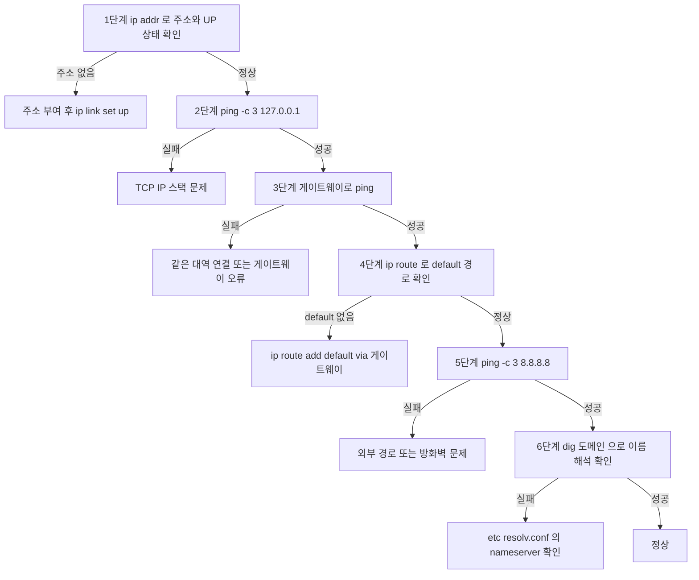

<Callout type="info">
  **이번 문서의 목표:** 이 파일을 다 읽으면 리눅스 콘솔에서 IP를 확인·설정하고 인터페이스를 활성화하는 명령을 순서대로 입력할 수 있으며, `ip`·`ss`·`traceroute`·`dig` 출력의 각 열이 무엇을 뜻하는지 해석하고, 같은 일을 하는 윈도우 명령과 짝지어 답할 수 있다.
</Callout>

## 0. 실기에서 리눅스는 어떻게 나오는가

네트워크관리사 2급 실기는 18문제로 구성되고, 그중 리눅스가 등장하는 자리는 **단답형·선택형 6문제 구간**입니다. 윈도우처럼 GUI 작업형으로 나오지는 않지만, **명령어 이름 하나를 정확히 쓰는 문제**로 반복 출제됩니다.

| 회차 | 출제된 리눅스 관련 항목 | 정답 |
|------|----------------------|------|
| 2023-4 | CPU·메모리·프로세스를 실시간 모니터링하는 명령 | top |
| 2024-1 | 경로를 추적하고 구간 응답 시간을 재는 도구 | tracert 또는 traceroute |
| 2024-3 | 경로 추적 도구 | tracert 또는 traceroute |
| 2026-3 | 즉시 시스템을 종료하는 `init` 뒤의 런레벨 숫자 | 0 |

<Callout type="warning">
  **채점은 철자 단위입니다.** `traceroute`를 `tracerout`으로, `ifconfig`를 `ifcofig`로 쓰면 오답입니다. 리눅스 명령은 대소문자도 구분하므로 전부 소문자로 씁니다.
</Callout>

리눅스 편을 윈도우 편과 따로 두는 이유는 **이름은 비슷한데 출력 형식과 옵션이 다르기 때문**입니다. 예를 들어 윈도우의 `ipconfig`와 리눅스의 `ifconfig`는 글자 두 개 차이인데 서로 다른 운영체제에서만 동작합니다. 시험에서 운영체제를 지정해 물으면 반드시 그쪽 명령을 써야 합니다.

## 1. 두 세대의 명령어 — net-tools와 iproute2

리눅스 네트워크 명령은 **옛 도구 묶음**(net-tools)과 **새 도구 묶음**(iproute2)이 공존합니다. 최근 배포판은 새 도구를 기본으로 설치하고 옛 도구는 빠져 있는 경우도 많습니다.

| 하는 일 | 옛 명령 (net-tools) | 새 명령 (iproute2) |
|--------|-------------------|------------------|
| 인터페이스·주소 확인 | `ifconfig` | `ip addr` |
| 인터페이스 올리기·내리기 | `ifconfig eth0 up` | `ip link set eth0 up` |
| 라우팅 테이블 확인 | `route -n` | `ip route` |
| ARP 캐시 확인 | `arp -a` | `ip neigh` |
| 소켓·포트 상태 확인 | `netstat -tuln` | `ss -tuln` |

> **쉽게 말하면:** `ifconfig` 계열은 종이 지도, `ip` 계열은 내비게이션입니다. 둘 다 같은 곳을 알려주지만 새 기능은 내비게이션에만 들어갑니다.

**시험에서는 둘 다 정답으로 인정되는 경우가 많습니다.** 다만 문제에 "최신 명령" 같은 단서가 붙으면 `ip` 계열을 씁니다. 반대로 "`ifconfig`와 같은 역할을 하는 윈도우 명령"을 물으면 답은 `ipconfig`입니다.

## 2. ip addr — 내 주소 확인하기

### 기본 출력 읽기

```text
$ ip addr show
```

```text
1: lo: <LOOPBACK,UP,LOWER_UP> mtu 65536 state UNKNOWN
    inet 127.0.0.1/8 scope host lo
2: eth0: <BROADCAST,MULTICAST,UP,LOWER_UP> mtu 1500 state UP
    link/ether 00:11:22:33:44:55 brd ff:ff:ff:ff:ff:ff
    inet 192.168.100.1/27 brd 192.168.100.31 scope global eth0
```

한 줄씩 뜯어봅니다.

| 표시 | 뜻 |
|------|-----|
| `lo` | 루프백 인터페이스. 자기 자신을 가리키는 `127.0.0.1` |
| `eth0` | 실제 이더넷 인터페이스 이름 |
| `UP` | 관리자가 인터페이스를 켠 상태 |
| `LOWER_UP` | 실제로 케이블이 꽂혀 링크가 살아 있는 상태 |
| `mtu 1500` | 한 프레임에 실을 수 있는 최대 바이트. 이더넷 기본값 |
| `link/ether` | MAC 주소. 윈도우의 물리적 주소와 같은 값 |
| `inet 192.168.100.1/27` | IPv4 주소와 프리픽스 |
| `brd 192.168.100.31` | 브로드캐스트 주소 |

<Callout type="warning">
  **`UP`은 있는데 `LOWER_UP`이 없다면 케이블이 빠졌거나 상대 포트가 죽은 것입니다.** 설정은 맞는데 통신이 안 될 때 가장 먼저 볼 자리입니다. 라우터의 `show ip interface brief`에서 `administratively down`과 `down`을 구분하는 것과 같은 개념입니다.
</Callout>

### 짧게 보는 요령

```text
$ ip -br addr
```

```text
lo      UNKNOWN   127.0.0.1/8
eth0    UP        192.168.100.1/27
```

`-br`은 brief의 약자로 한 줄 요약을 보여줍니다. IP만 빠르게 확인할 때 유용합니다.

### 옛 명령 ifconfig

```text
$ ifconfig eth0
```

```text
eth0: flags=4163<UP,BROADCAST,RUNNING,MULTICAST>  mtu 1500
        inet 192.168.100.1  netmask 255.255.255.224  broadcast 192.168.100.31
        ether 00:11:22:33:44:55  txqueuelen 1000  (Ethernet)
        RX packets 1024  bytes 98304
        TX packets 980   bytes 76288
```

**`ifconfig`는 마스크를 십진수로 보여주고 `ip addr`는 프리픽스로 보여줍니다.** `/27`과 `255.255.255.224`가 같은 값이라는 것을 즉시 떠올릴 수 있어야 합니다.

- `RX` — 받은 패킷 (Receive)
- `TX` — 보낸 패킷 (Transmit)
- `errors`나 `dropped`가 계속 늘어나면 케이블 불량이나 속도 협상 문제를 의심합니다

## 3. 주소 설정과 인터페이스 활성화

라우터 문제에서 `no shutdown`을 빠뜨리면 감점이듯, 리눅스에서도 **주소만 주고 인터페이스를 올리지 않으면 통신되지 않습니다.**

<Steps>

### 1단계 — 기존 주소 확인

```text
$ ip addr show eth0
```

이미 붙어 있는 주소가 있으면 다음 단계에서 지웁니다.

### 2단계 — 기존 주소 제거

```text
$ sudo ip addr del 192.168.0.5/24 dev eth0
```

`del` 뒤에는 지울 주소를 프리픽스까지 정확히 씁니다.

### 3단계 — 새 주소 부여

```text
$ sudo ip addr add 192.168.100.1/27 dev eth0
```

마스크는 프리픽스로 씁니다. `255.255.255.224`를 쓰려면 `ifconfig` 문법을 써야 합니다.

### 4단계 — 인터페이스 활성화

```text
$ sudo ip link set eth0 up
```

**이 단계가 라우터의 `no shutdown`에 해당합니다.** 빠뜨리면 주소는 붙었는데 링크가 죽어 있습니다.

### 5단계 — 기본 게이트웨이 등록

```text
$ sudo ip route add default via 192.168.100.30
```

`default`는 목적지가 정해지지 않은 모든 트래픽을 뜻합니다.

### 6단계 — 검증

```text
$ ip addr show eth0
$ ip route
$ ping -c 3 192.168.100.30
```

주소, 경로, 도달 가능 여부를 순서대로 확인합니다.

</Steps>

같은 일을 옛 명령으로 하면 다음과 같습니다.

```text
$ sudo ifconfig eth0 192.168.100.1 netmask 255.255.255.224
$ sudo ifconfig eth0 up
$ sudo route add default gw 192.168.100.30
```

<Callout type="warning">
  **위 명령들은 모두 메모리에만 반영되어 재부팅하면 사라집니다.** 라우터에서 `copy running-config startup-config`를 실행해야 설정이 남는 것과 똑같습니다. 영구 설정은 배포판별 설정 파일에 적어야 합니다.
</Callout>

### 영구 설정 파일

| 계열 | 파일 위치 | 적용 명령 |
|------|----------|----------|
| RHEL·CentOS·Rocky | `/etc/sysconfig/network-scripts/ifcfg-eth0` | `systemctl restart network` |
| Ubuntu 최신 | `/etc/netplan/01-netcfg.yaml` | `netplan apply` |
| Debian 계열 옛 방식 | `/etc/network/interfaces` | `systemctl restart networking` |

RHEL 계열 파일의 대표적인 내용입니다.

```text
DEVICE=eth0
BOOTPROTO=static
ONBOOT=yes
IPADDR=192.168.100.1
NETMASK=255.255.255.224
GATEWAY=192.168.100.30
DNS1=168.126.63.1
```

- `BOOTPROTO=static` — 수동 설정. DHCP를 쓰려면 `dhcp`
- `ONBOOT=yes` — 부팅할 때 자동으로 올림. **이 값이 `no`면 재부팅 후 인터페이스가 내려간 상태로 뜹니다**

## 4. ping — 리눅스에서 달라지는 점

원리는 윈도우와 같습니다. ICMP Echo Request를 보내고 Echo Reply를 기다립니다. **차이는 기본 동작입니다.**

| 항목 | 윈도우 | 리눅스 |
|------|-------|-------|
| 기본 횟수 | 4번 보내고 자동 종료 | 중지할 때까지 무한 반복 |
| 횟수 지정 | `ping -n 4 주소` | `ping -c 4 주소` |
| 크기 지정 | `-l 크기` | `-s 크기` |
| 계속 보내기 | `-t` | 옵션 없이 기본 동작 |

```text
$ ping -c 3 192.168.100.30
```

```text
PING 192.168.100.30 (192.168.100.30) 56(84) bytes of data.
64 bytes from 192.168.100.30: icmp_seq=1 ttl=64 time=0.412 ms
64 bytes from 192.168.100.30: icmp_seq=2 ttl=64 time=0.388 ms
64 bytes from 192.168.100.30: icmp_seq=3 ttl=64 time=0.401 ms

--- 192.168.100.30 ping statistics ---
3 packets transmitted, 3 received, 0% packet loss, time 2003ms
rtt min/avg/max/mdev = 0.388/0.400/0.412/0.009 ms
```

- `icmp_seq` — 몇 번째로 보낸 패킷인지. 번호가 건너뛰면 그 패킷이 유실된 것입니다
- `ttl=64` — 리눅스의 기본 TTL. **윈도우는 128, 네트워크 장비는 255인 경우가 많습니다.** 응답의 TTL만 보고 상대 운영체제를 추정하는 문제가 나올 수 있습니다
- `mdev` — 지연의 표준편차. 값이 크면 지터가 심한 회선입니다

<Callout type="warning">
  **리눅스에서 `ping 주소`만 입력하면 멈추지 않습니다.** `Ctrl` + `C`로 중단하거나 반드시 `-c` 옵션을 붙이십시오. 윈도우 습관대로 4번 후 끝나기를 기다리면 시간만 낭비합니다.
</Callout>

## 5. traceroute — 경로 추적

윈도우의 `tracert`에 해당하는 명령입니다. 기출 단답형이 세 번 물었고, 정답은 두 이름 모두 인정되었습니다.

```text
$ traceroute 8.8.8.8
```

```text
traceroute to 8.8.8.8 (8.8.8.8), 30 hops max, 60 byte packets
 1  192.168.100.30 (192.168.100.30)  0.412 ms  0.388 ms  0.401 ms
 2  10.20.30.1 (10.20.30.1)  11.2 ms  11.4 ms  11.1 ms
 3  * * *
 4  8.8.8.8 (8.8.8.8)  17.8 ms  17.6 ms  17.9 ms
```

**중요한 구현 차이**가 하나 있습니다.

| 명령 | 기본 프로브 | 결과 |
|------|-----------|------|
| 윈도우 `tracert` | ICMP Echo Request | ICMP를 막으면 응답 없음 |
| 리눅스 `traceroute` | UDP 패킷 (기본) | UDP를 막으면 응답 없음 |
| 리눅스 `traceroute -I` | ICMP로 전환 | 윈도우와 같은 방식 |

같은 경로인데 윈도우에서는 보이고 리눅스에서는 별표가 뜨는 일이 생기는 이유가 이것입니다. 별표가 있어도 **그 뒤 홉이 정상 응답하고 목적지에 도달했다면 경로는 정상**입니다.

`mtr` 명령은 `traceroute`와 `ping`을 합쳐 실시간으로 구간별 손실률을 보여줍니다. 윈도우의 `pathping`에 해당합니다.

```text
$ mtr -r -c 10 8.8.8.8
```

## 6. ss와 netstat — 열려 있는 포트 보기

`netstat`은 리눅스에서도 동작하지만 최신 배포판은 `ss`(socket statistics)를 권장합니다. **출력이 훨씬 빠릅니다.**

```text
$ ss -tuln
```

```text
Netid State   Local Address:Port   Peer Address:Port
tcp   LISTEN  0.0.0.0:22           0.0.0.0:*
tcp   LISTEN  0.0.0.0:80           0.0.0.0:*
udp   UNCONN  0.0.0.0:53           0.0.0.0:*
```

옵션은 붙여 쓰며 각 글자가 하나씩 의미를 갖습니다.

| 옵션 | 뜻 |
|------|-----|
| `-t` | TCP 소켓만 |
| `-u` | UDP 소켓만 |
| `-l` | 대기 중(LISTEN) 소켓만 |
| `-n` | 이름을 풀지 않고 숫자 포트로 표시 |
| `-p` | 소켓을 쓰는 프로세스 표시 (관리자 권한) |
| `-a` | 모든 소켓 |

`ss -tuln`은 "TCP와 UDP 중 대기 중인 것을 숫자로 보여 달라"는 뜻으로, **서버가 제대로 떠 있는지 확인하는 표준 조합**입니다.

UDP 줄의 상태가 `UNCONN`인 이유는 UDP가 비연결 프로토콜이라 연결 상태 자체가 없기 때문입니다. TCP의 `LISTEN`과 같은 자리라고 보면 됩니다.

**상태 값의 뜻**은 윈도우와 동일합니다.

| 상태 | 뜻 |
|------|-----|
| LISTEN | 접속을 기다리는 중 |
| ESTAB | 연결이 수립되어 통신 중 |
| TIME-WAIT | 종료 후 잔여 패킷을 기다리는 중 |
| SYN-SENT | 연결 요청을 보내고 응답 대기 중 |
| CLOSE-WAIT | 상대가 종료를 알려와 정리 대기 중 |

## 7. arp와 ip neigh — IP와 MAC 대응표

같은 네트워크 안에서 실제 배달은 MAC 주소로 이루어집니다. IP는 아는데 MAC을 모를 때 ARP로 물어봅니다.

```text
$ ip neigh show
```

```text
192.168.100.30 dev eth0 lladdr 00-aa-bb-cc-dd-ee REACHABLE
192.168.100.5  dev eth0 lladdr 00-11-22-33-44-66 STALE
```

| 상태 | 뜻 |
|------|-----|
| REACHABLE | 최근에 통신이 확인된 살아 있는 항목 |
| STALE | 오래되어 재확인이 필요한 항목 |
| FAILED | 응답이 없어 해석에 실패한 항목 |

옛 명령은 다음과 같습니다.

```text
$ arp -a
$ arp -n
$ sudo arp -d 192.168.100.5
```

- `-n` — 이름을 풀지 않고 숫자로 표시
- `-d` — 특정 항목 삭제

**같은 IP를 두 장비가 쓰면** ARP 항목이 계속 바뀌면서 통신이 끊겼다 이어졌다 합니다. IP 충돌 진단의 출발점입니다.

## 8. ip route — 리눅스의 라우팅 테이블

```text
$ ip route
```

```text
default via 192.168.100.30 dev eth0 proto static metric 100
192.168.100.0/27 dev eth0 proto kernel scope link src 192.168.100.1
10.10.20.0/24 via 192.168.100.2 dev eth0 proto static
```

한 줄씩 읽습니다.

| 줄 | 해석 |
|----|------|
| `default via 192.168.100.30` | 기본 게이트웨이. 윈도우 `route print`의 `0.0.0.0` 줄과 같은 자리 |
| `192.168.100.0/27 dev eth0 ... scope link` | 직접 연결된 대역. 게이트웨이를 거치지 않음 |
| `10.10.20.0/24 via 192.168.100.2` | 정적 경로. 라우터의 `ip route 10.10.20.0 255.255.255.0 192.168.100.2`와 같은 뜻 |

`proto kernel`은 주소를 붙이는 순간 커널이 자동으로 만든 경로, `proto static`은 사람이 넣은 경로라는 표시입니다.

**경로를 손으로 다루는 명령**입니다.

| 명령 | 하는 일 |
|------|--------|
| `ip route add 10.10.20.0/24 via 192.168.100.2` | 정적 경로 추가 |
| `ip route del 10.10.20.0/24` | 경로 삭제 |
| `ip route add default via 192.168.100.30` | 기본 게이트웨이 등록 |
| `ip route get 8.8.8.8` | 특정 목적지로 갈 때 실제로 선택될 경로 확인 |

`ip route get`은 **여러 경로가 겹칠 때 어느 것이 이기는지 즉시 보여주므로 진단에 매우 유용**합니다.

옛 명령은 `route -n`입니다. `-n`을 붙이지 않으면 이름 해석을 시도하느라 출력이 느려집니다.

## 9. 이름 해석 — dig, nslookup, host

### 관련 파일 두 개

| 파일 | 역할 |
|------|------|
| `/etc/resolv.conf` | 사용할 DNS 서버 목록. `nameserver 168.126.63.1` 형식 |
| `/etc/hosts` | 이름과 IP를 손으로 고정하는 표. DNS보다 먼저 참조됨 |

`/etc/hosts`에 잘못된 줄이 남아 있으면 DNS가 정상이어도 엉뚱한 곳으로 연결됩니다. 이름 해석이 이상할 때 두 번째로 볼 자리입니다.

### dig — 가장 자세한 조회

```text
$ dig www.icqa.or.kr
```

```text
;; QUESTION SECTION:
;www.icqa.or.kr.        IN  A

;; ANSWER SECTION:
www.icqa.or.kr.  300  IN  A  211.253.10.10

;; Query time: 12 msec
;; SERVER: 168.126.63.1#53
```

- `QUESTION SECTION` — 무엇을 물었는지
- `ANSWER SECTION` — 답. `300`은 TTL(초), `A`는 레코드 종류
- `SERVER` — 답을 준 DNS 서버와 포트. **DNS는 53번 포트**를 씁니다

특정 서버에 직접 묻거나 레코드 종류를 지정할 수 있습니다.

```text
$ dig @8.8.8.8 www.icqa.or.kr
$ dig icqa.or.kr MX
$ dig +short www.icqa.or.kr
```

`+short`는 IP 한 줄만 출력해 빠르게 확인할 때 씁니다.

### nslookup과 host

`nslookup`은 윈도우와 리눅스 양쪽에 있어 시험에서 가장 안전한 답입니다.

```text
$ nslookup www.icqa.or.kr
$ host www.icqa.or.kr
```

| 명령 | 특징 |
|------|------|
| `nslookup` | 두 운영체제 공통. 단답형 정답으로 가장 무난 |
| `dig` | 출력이 가장 상세. 리눅스 표준 진단 도구 |
| `host` | 한 줄 요약. 빠른 확인용 |

**DNS 레코드 종류**는 윈도우 서버 작업형에서도 그대로 쓰이므로 함께 외웁니다.

| 레코드 | 뜻 |
|-------|-----|
| A | 이름을 IPv4 주소로 |
| AAAA | 이름을 IPv6 주소로 |
| CNAME | 이름의 별칭. `www`를 `main.icqa.or.kr`로 넘김 |
| MX | 메일 서버 지정 |
| NS | 해당 영역을 담당하는 네임서버 |
| SOA | 영역의 기준 정보. 일련번호·새로 고침 간격 등 |
| PTR | IP를 이름으로 (역방향 조회) |

## 10. 단답형에 그대로 나온 리눅스 항목

### 런레벨과 init

2026년 3회 10번이 물었습니다. `halt`나 `shutdown -h now`와 같이 즉시 시스템을 끄는 명령은 `init 0`입니다.

| 런레벨 | 뜻 |
|-------|-----|
| 0 | 시스템 종료 (halt) |
| 1 | 단일 사용자 모드. 복구용 |
| 2 | 다중 사용자 모드, 네트워크 없음 |
| 3 | 다중 사용자 모드, 네트워크 있음. 콘솔 |
| 5 | 그래픽 모드 |
| 6 | 재시작 (reboot) |

<Callout type="warning">
  **0과 6을 뒤집어 쓰는 실수가 가장 흔합니다.** 0이 종료, 6이 재시작입니다. 6은 "한 바퀴 돌아 다시 온다"로 외우면 헷갈리지 않습니다.
</Callout>

최신 배포판은 `systemctl poweroff`와 `systemctl reboot`을 쓰지만, **시험은 `init` 숫자를 묻습니다.**

### 시스템 모니터링

2023년 4회 12번이 물었습니다. CPU 사용률, 메모리 사용량, 프로세스 상태를 실시간으로 보여주는 명령은 `top`입니다.

| 명령 | 하는 일 |
|------|--------|
| `top` | CPU·메모리·프로세스를 실시간 갱신 표시 |
| `ps -ef` | 현재 프로세스 목록을 한 번만 출력 |
| `free -h` | 메모리 사용량을 사람이 읽기 쉬운 단위로 |
| `df -h` | 디스크 사용량 |
| `uname -a` | 커널 버전 등 시스템 정보 |

`top`은 실시간, `ps`는 한 장면이라는 차이가 선택형으로 나옵니다.

### 방화벽

| 계열 | 명령 | 상태 확인 |
|------|------|----------|
| RHEL 계열 | `firewall-cmd` | `firewall-cmd --list-all` |
| Ubuntu 계열 | `ufw` | `ufw status` |
| 저수준 공통 | `iptables` | `iptables -L -n` |

리눅스에서 `ping`이 안 될 때 **ICMP를 방화벽이 막고 있는 경우**가 흔합니다. 설정을 다 맞췄는데 응답이 없으면 방화벽을 의심합니다.

## 11. 윈도우와 리눅스 대조표

시험이 가장 좋아하는 형태입니다. 왼쪽을 보면 오른쪽이 즉시 나와야 합니다.

| 하는 일 | 윈도우 | 리눅스 |
|--------|-------|-------|
| IP 설정 확인 | `ipconfig /all` | `ip addr` 또는 `ifconfig` |
| 도달 확인 | `ping -n 4 주소` | `ping -c 4 주소` |
| 경로 추적 | `tracert` | `traceroute` |
| 경로 + 손실률 | `pathping` | `mtr` |
| 포트·연결 상태 | `netstat -an` | `ss -tuln` 또는 `netstat -an` |
| ARP 캐시 | `arp -a` | `ip neigh` 또는 `arp -a` |
| 라우팅 테이블 | `route print` | `ip route` 또는 `route -n` |
| DNS 조회 | `nslookup` | `dig` 또는 `nslookup` |
| DNS 캐시 비우기 | `ipconfig /flushdns` | `systemd-resolve --flush-caches` |
| 인터페이스 활성화 | 어댑터 사용 설정 | `ip link set eth0 up` |
| 이름 고정 파일 | `C:\Windows\System32\drivers\etc\hosts` | `/etc/hosts` |

## 12. 진단 순서 — 리눅스 판

윈도우와 논리는 같지만 명령만 바뀝니다.



**5단계는 되는데 6단계가 안 되면 DNS만 잘못된 것**입니다. 윈도우 편에서 익힌 판단 기준이 그대로 통합니다.

## 핵심 정리

- 리눅스 명령은 옛 도구(`ifconfig`, `route`, `netstat`, `arp`)와 새 도구(`ip addr`, `ip route`, `ss`, `ip neigh`)가 짝을 이루며, 시험은 대부분 둘 다 인정한다.
- 주소를 붙인 뒤 `ip link set eth0 up`으로 인터페이스를 올려야 통신된다. 라우터의 `no shutdown`과 같은 자리다.
- 명령으로 넣은 설정은 재부팅하면 사라진다. 영구 적용은 `ifcfg` 파일이나 netplan에 기록해야 하며, 이는 `copy running-config startup-config`와 같은 개념이다.
- 리눅스 `ping`은 무한 반복이므로 `-c` 옵션을 붙인다. 응답의 TTL이 64면 리눅스, 128이면 윈도우다.
- `traceroute`는 기본이 UDP, `tracert`는 ICMP다. 같은 경로에서 결과가 달라 보일 수 있다.
- `init 0`은 종료, `init 6`은 재시작이고, 실시간 자원 모니터링은 `top`이다. 단답형으로 그대로 출제되었다.

## 마무리 복습

<Quiz
  questionNumber={1}
  question="Linux 시스템에서 halt 및 shutdown -h now 와 동일하게 즉시 시스템을 종료하려면 init 뒤에 어떤 숫자를 써야 하는가?"
  options={['0', '1', '3', '6']}
  correctAnswer={1}
  explanation="런레벨 0 이 시스템 종료다. 1 은 단일 사용자 복구 모드 3 은 네트워크가 있는 다중 사용자 콘솔 모드 6 은 재시작이다. 0 과 6 을 뒤집어 쓰는 실수가 가장 많다."
  optionExplanations={['정답 — 런레벨 0 은 halt 에 해당한다', '1 은 복구용 단일 사용자 모드다', '3 은 콘솔 다중 사용자 모드로 종료와 무관하다', '6 은 재시작이므로 시스템이 다시 켜진다']}
/>

<Quiz
  questionNumber={2}
  question="리눅스에서 CPU 사용률과 메모리 사용량 프로세스 상태를 실시간으로 갱신하며 보여주는 명령은?"
  options={['ps -ef', 'top', 'df -h', 'uname -a']}
  correctAnswer={2}
  explanation="top 은 화면을 주기적으로 갱신하며 자원 사용 현황을 보여준다. ps 는 실행 시점의 목록을 한 번만 출력하고 df 는 디스크 사용량 uname 은 커널 정보를 보여준다."
  optionExplanations={['ps 는 한 번만 출력하고 갱신하지 않는다', '정답 — 실시간 모니터링 명령이다', 'df 는 디스크 용량 전용이다', 'uname 은 시스템 정보만 표시한다']}
/>

<Quiz
  questionNumber={3}
  question="ip addr 출력에서 eth0 이 UP 으로 표시되는데 LOWER_UP 이 없다. 가장 유력한 원인은?"
  options={['IP 주소가 잘못 설정되었다', '케이블이 빠졌거나 상대 포트가 죽어 물리 링크가 없다', 'DNS 서버가 응답하지 않는다', '기본 게이트웨이가 등록되지 않았다']}
  correctAnswer={2}
  explanation="UP 은 관리자가 인터페이스를 켰다는 뜻이고 LOWER_UP 은 실제 물리 링크가 살아 있다는 뜻이다. UP 만 있고 LOWER_UP 이 없으면 설정은 되어 있으나 케이블 또는 상대 포트에 문제가 있는 것이다."
  optionExplanations={['주소 오류는 링크 상태 표시와 무관하다', '정답 — 물리 계층 문제를 가리킨다', 'DNS 문제는 이름 해석 단계에서만 나타난다', '게이트웨이 누락은 외부 통신에서만 문제가 된다']}
/>

<Quiz
  questionNumber={4}
  question="리눅스에서 인터페이스에 주소를 부여한 뒤 반드시 실행해야 통신이 시작되는 명령으로 라우터의 no shutdown 에 해당하는 것은?"
  options={['ip route add default via 게이트웨이', 'ip link set eth0 up', 'systemctl restart sshd', 'ip neigh flush all']}
  correctAnswer={2}
  explanation="ip link set eth0 up 이 인터페이스를 활성화한다. 라우터에서 IP 를 넣고 no shutdown 을 빠뜨리면 인터페이스가 down 상태로 남는 것과 정확히 같은 상황이다."
  optionExplanations={['기본 경로 등록은 외부 통신용이며 링크를 올리지는 않는다', '정답 — 인터페이스 활성화 명령이다', 'sshd 재시작은 원격 접속 서비스와만 관련이 있다', 'ARP 캐시 비우기는 링크 상태와 무관하다']}
/>

<Quiz
  questionNumber={5}
  question="리눅스에서 ping 을 4번만 보내고 종료하려면 어떤 옵션을 써야 하는가?"
  options={['ping -n 4 주소', 'ping -c 4 주소', 'ping -t 4 주소', 'ping -l 4 주소']}
  correctAnswer={2}
  explanation="리눅스는 -c 로 횟수를 지정한다. -n 은 리눅스에서 이름을 풀지 않는 옵션이고 윈도우에서만 횟수 옵션이다. -t 는 윈도우의 무한 반복 -l 은 윈도우의 크기 지정 옵션이다."
  optionExplanations={['-n 은 윈도우의 횟수 옵션이다', '정답 — count 의 c 로 기억한다', '-t 는 윈도우에서 무한 반복을 뜻한다', '-l 은 윈도우의 패킷 크기 옵션이다']}
/>

<Quiz
  questionNumber={6}
  question="ping 응답에 ttl=64 로 표시되었다. 상대 호스트의 운영체제로 가장 유력한 것은?"
  options={['윈도우', '리눅스 또는 유닉스 계열', '시스코 라우터', '판단할 근거가 전혀 없다']}
  correctAnswer={2}
  explanation="초기 TTL 값은 리눅스 계열이 64 윈도우가 128 네트워크 장비가 255 인 경우가 많다. 중간 라우터를 지나며 값이 줄어들므로 64 에 가까운 값이면 리눅스 계열로 추정한다."
  optionExplanations={['윈도우는 보통 128 에서 시작한다', '정답 — 리눅스 계열의 기본 초기값이다', '시스코 장비는 보통 255 에서 시작한다', '초기값 관례로 추정이 가능하다']}
/>

<Quiz
  questionNumber={7}
  question="ss -tuln 명령의 각 옵션이 뜻하는 바로 옳은 것은?"
  options={['TCP 와 UDP 중 대기 중인 소켓을 숫자 포트로 표시한다', '모든 연결을 이름으로 해석해 표시한다', 'TCP 만 프로세스 정보와 함께 표시한다', '라우팅 테이블을 표시한다']}
  correctAnswer={1}
  explanation="t 는 TCP u 는 UDP l 은 LISTEN 상태만 n 은 이름 해석 없이 숫자 표시를 뜻한다. 서버가 제대로 떠 있는지 확인하는 표준 조합이다."
  optionExplanations={['정답 — 각 글자의 의미가 그대로 조합된 것이다', 'n 옵션은 오히려 이름 해석을 하지 않는다', '프로세스 정보는 p 옵션이 있어야 나온다', '라우팅 테이블은 ip route 로 본다']}
/>

<Quiz
  questionNumber={8}
  question="리눅스 traceroute 에서는 별표가 뜨는데 같은 경로를 윈도우 tracert 로 추적하면 응답이 보인다. 가장 유력한 이유는?"
  options={['리눅스 traceroute 는 기본적으로 UDP 를 쓰고 tracert 는 ICMP 를 쓰기 때문', '리눅스 traceroute 는 최대 홉 수가 더 짧기 때문', '리눅스는 DNS 해석을 하지 않기 때문', '두 명령은 완전히 다른 목적지를 추적하기 때문']}
  correctAnswer={1}
  explanation="리눅스 traceroute 는 기본 프로브가 UDP 이고 윈도우 tracert 는 ICMP 다. 중간 장비가 UDP 만 차단하면 리눅스에서만 별표가 나타난다. traceroute -I 옵션으로 ICMP 를 쓰게 하면 결과가 같아진다."
  optionExplanations={['정답 — 기본 프로브 프로토콜의 차이다', '두 명령 모두 기본 최대 홉 수는 30 이다', 'DNS 해석 여부는 응답 유무와 무관하다', '같은 목적지를 추적한 전제의 문제다']}
/>

<Quiz
  questionNumber={9}
  question="ip route 출력의 첫 줄이 default via 192.168.100.30 dev eth0 이었다. 이 줄이 뜻하는 것은?"
  options={['192.168.100.30 이 DNS 서버라는 뜻', '목적지가 다른 경로에 없을 때 192.168.100.30 으로 보낸다는 기본 게이트웨이 설정', 'eth0 인터페이스가 비활성 상태라는 뜻', '192.168.100.30 과 직접 연결된 대역이라는 뜻']}
  correctAnswer={2}
  explanation="default 는 목적지가 특정되지 않은 모든 트래픽을 뜻하고 via 뒤가 다음 홉 즉 기본 게이트웨이다. 윈도우 route print 의 0.0.0.0 줄과 같은 자리다."
  optionExplanations={['DNS 서버는 etc resolv.conf 에 기록된다', '정답 — 기본 게이트웨이를 나타내는 줄이다', '비활성 상태는 ip link 출력의 DOWN 으로 표시된다', '직접 연결 대역은 scope link 로 표시된다']}
/>

<Quiz
  questionNumber={10}
  question="ip addr add 와 ip route add 로 설정을 마쳤는데 재부팅하니 모두 사라졌다. 올바른 설명은?"
  options={['명령 문법이 틀렸으므로 다시 입력해야 한다', '이 명령들은 메모리에만 반영되므로 ifcfg 파일이나 netplan 설정에 기록해야 영구 적용된다', '리눅스는 정적 IP 를 지원하지 않는다', '관리자 권한이 없어 적용되지 않은 것이다']}
  correctAnswer={2}
  explanation="ip 명령의 결과는 실행 중인 커널에만 반영된다. 라우터에서 copy running-config startup-config 를 하지 않은 것과 같은 상황으로 배포판별 설정 파일에 적어야 부팅 후에도 유지된다."
  optionExplanations={['문법이 틀렸다면 즉시 오류가 났을 것이다', '정답 — 영구 설정 파일 기록이 필요하다', '리눅스도 정적 IP 를 정상 지원한다', '권한이 없으면 명령 실행 시점에 거부된다']}
/>

## 참고 자료

- [ICQA - 국가공인자격증 네트워크관리사 2급](https://www.icqa.or.kr/cn/page/network)
- [네트워크관리사 2급 실기 준비 후기](https://velog.io/@paramad/%EB%84%A4%ED%8A%B8%EC%9B%8C%ED%81%AC-%EA%B4%80%EB%A6%AC%EC%82%AC-2%EA%B8%89-%EC%8B%A4%EA%B8%B0-%EC%A4%80%EB%B9%84)
- [네트워크관리사 2급 실기 정리 자료](https://devbirdfeet.tistory.com/296)
