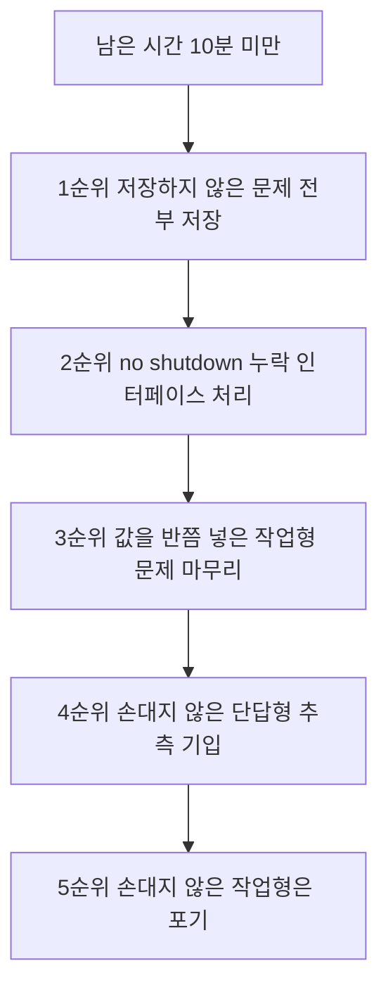

<Callout type="info">
  **이번 문서의 목표:** 이 파일을 다 읽으면 시험 시작 직후 무엇을 먼저 하고 무엇을 마지막에 할지 순서가 정해지고, 각 문제 유형마다 "여기서 끝내면 안 된다"는 마지막 한 동작을 자동으로 떠올릴 수 있다.
</Callout>

## 0. 실기에서 점수가 새는 곳

실기에서 떨어지는 사람의 대부분은 **몰라서 틀리지 않습니다.** 값을 정확히 계산해 놓고 확인 버튼을 안 눌러서, 명령을 정확히 입력해 놓고 저장을 안 해서 잃습니다.

여덟 회분 기출 자료가 하나같이 문제 앞에 같은 경고를 붙여 두었습니다.

| 유형 | 기출 자료가 첫머리에 붙인 경고 |
|-----|---------------------------|
| 윈도우 작업형 | 설정 완료 후 창 아래 확인 또는 적용을 눌러야 저장이 완료된다 |
| 라우터 | 특권 모드에서 `copy running-config startup-config`를 실행해야 정답 처리된다 |

<Callout type="warning">
  **출제 기관이 문제지 맨 앞에 경고를 쓴다는 것은 실제로 그 실수로 떨어지는 사람이 많다는 뜻입니다.** 이 편의 절반은 이 두 문장을 몸에 새기는 데 씁니다.
</Callout>

## 1. 시험의 전체 구조

| 구분 | 문항 수 | 형태 |
|-----|--------|------|
| 랜케이블 제작 | 1 | 실물 제작. 별도 채점 |
| 윈도우 서버 작업형 | 8 | 가상 화면에서 GUI 조작 |
| 단답형·선택형 | 6 | 용어·명령어 입력 또는 보기 선택 |
| 라우터 설정 | 3 | 시뮬레이터 CLI 입력 |
| 합계 | 18 | – |

문항 배분은 회차마다 조금씩 달라질 수 있으므로 **최종 확인은 반드시 ICQA 공식 안내 페이지에서** 합니다. 다만 여덟 회분에서 이 구성이 유지되었으므로 준비 기준으로 삼기에 충분합니다.


## 2. 권장 진행 순서

문제 번호 순서대로 푸는 것이 반드시 최선은 아닙니다. **확실한 점수부터 빠르게 확보**하는 순서가 유리합니다.

<Steps>

### 1단계 — 케이블부터 끝낸다 (약 10분)

케이블은 손이 필요한 작업이고 **다시 만들 시간이 필요할 수 있는 유일한 문제**입니다. 가장 먼저 제작해 테스터로 확인까지 마칩니다. 불량이면 남은 시간이 많을 때 다시 만들 수 있습니다.

### 2단계 — 단답형·선택형을 훑는다 (약 10분)

6문제는 아는 것만 골라 즉시 답하고 모르는 것은 넘깁니다. **한 문제에 1분 이상 붙잡지 않습니다.** 계산이 필요 없어 가장 빠르게 점수가 쌓이는 구간입니다.

### 3단계 — 라우터 3문제를 처리한다 (약 15분)

명령이 정해져 있어 실수만 없으면 확실한 점수입니다. **세 문제를 다 푼 뒤가 아니라 각 문제마다 저장 명령을 실행**합니다.

### 4단계 — 윈도우 작업형 8문제 (약 40분)

가장 오래 걸리는 구간입니다. 그중에서도 IP 속성 설정 문제를 먼저 처리합니다. 계산이 들어가지만 배점이 확실하고 여덟 회분 전부에 나왔습니다.

### 5단계 — 넘겼던 문제로 돌아간다

2단계에서 넘긴 단답형과 4단계에서 막힌 작업형을 다시 봅니다.

### 6단계 — 검증 회차 (약 10분)

**모든 문제를 다시 열어 저장 여부만 확인합니다.** 값을 다시 계산하지 말고 저장 흔적만 봅니다. 이 10분이 합격과 불합격을 가릅니다.

</Steps>

### 왜 라우터를 작업형보다 먼저 두는가

윈도우 작업형은 화면이 많고 클릭 경로가 길어 시간을 예측하기 어렵습니다. 반면 라우터는 **입력할 명령 줄 수가 정해져 있어 소요 시간이 거의 고정**입니다. 시간이 부족해질 때 잘려 나가는 쪽은 예측 가능한 쪽이 아니라 예측 불가능한 쪽이어야 합니다.

## 3. 라우터 문제의 고정 루틴

라우터 3문제는 **모두 같은 뼈대**를 갖습니다. 이 뼈대를 통째로 외워 두면 문제마다 가운데만 바꿔 끼우면 됩니다.

```text
Router> enable
Router# configure terminal
Router(config)# [여기에 문제가 요구하는 설정]
Router(config)# exit
Router# copy running-config startup-config
```

프롬프트가 바뀌는 지점을 정확히 알아야 합니다.

| 프롬프트 | 모드 이름 | 진입 명령 | 여기서 할 수 있는 일 |
|---------|----------|----------|-------------------|
| `Router>` | 사용자 모드 | 접속 직후 | 일부 조회만 |
| `Router#` | 특권 모드 | `enable` | 모든 조회, `show`, 저장 |
| `Router(config)#` | 전역 설정 모드 | `configure terminal` | 호스트 이름, 정적 경로, 라우팅 프로토콜 |
| `Router(config-if)#` | 인터페이스 설정 모드 | `interface fastethernet 0/0` | IP 부여, `no shutdown` |
| `Router(config-line)#` | 라인 설정 모드 | `line vty 0 4` | 원격 접속 라인 설정 |
| `Router(config-router)#` | 라우팅 설정 모드 | `router ospf 1` | `network` 문 입력 |

<Callout type="warning">
  **`copy running-config startup-config`는 특권 모드에서만 실행됩니다.** 설정 모드에서 그대로 입력하면 명령을 알아듣지 못합니다. `exit`으로 `Router#`까지 빠져나온 뒤 저장하십시오.
</Callout>

### 유형별 가운데 부분

| 요구 사항 | 입력할 줄 |
|----------|----------|
| 호스트 이름 변경 | `hostname Router1` |
| 인터페이스 IP 부여 | `interface fastethernet 0/0` 다음 `ip address 192.168.10.1 255.255.255.0` 다음 `no shutdown` |
| 보조 IP 추가 | `ip address 192.168.10.101 255.255.255.0 secondary` |
| 정적 라우팅 | `ip route 10.10.20.0 255.255.255.0 192.168.10.2` |
| 기본 게이트웨이 | `ip default-gateway 192.168.100.254` |
| 기본 네트워크 | `ip default-network 192.168.0.100` |
| SNMP 읽기 전용 | `snmp-server community ICQA ro` |
| 가상 터미널 라인 | `line vty 0 4` |
| OSPF | `router ospf 1` 다음 `network 192.70.100.0 0.0.0.255 area 1` |

**조회만 요구하는 문제**는 설정 모드에 들어가지 않습니다.

| 요구 사항 | 입력할 줄 |
|----------|----------|
| IOS 버전·부팅 정보·업타임 확인 | `show version` |
| 라우팅 테이블 확인 | `show ip route` |
| 인터페이스 요약 상태 확인 | `show ip interface brief` |
| CPU 프로세스 상태 확인 | `show processes cpu` |
| 동작 중인 라우팅 프로토콜 확인 | `show ip protocols` |

<Callout type="warning">
  **조회 문제에도 저장 명령을 요구하는 경우가 많습니다.** 기출 여러 회차에서 `show version` 뒤에 `copy running-config startup-config`를 실행하도록 지시했습니다. 문제가 "확인하고 저장하시오"라고 쓰여 있으면 조회만 하고 끝내지 마십시오.
</Callout>

### 라우터 감점 포인트 다섯 가지

| 실수 | 결과 | 방지책 |
|-----|------|-------|
| 저장 명령 누락 | 설정이 재부팅 시 사라져 오답 처리 | 문제마다 마지막 줄로 고정 |
| `no shutdown` 누락 | 인터페이스가 `administratively down` 상태 | IP 부여 다음 줄에 붙여 쓰는 습관 |
| 설정 모드에서 저장 시도 | 명령 인식 실패 | `exit`으로 `Router#` 확인 후 저장 |
| 마스크를 프리픽스로 입력 | `ip address 192.168.10.1/24`는 문법 오류 | 라우터는 점 십진수 마스크만 사용 |
| 대소문자 오류 | `snmp-server community icqa ro`는 오답 | 문제가 대소문자를 지정하면 그대로 |

`no shutdown`을 빠뜨렸는지 확인하는 명령입니다.

```text
Router# show ip interface brief
```

```text
Interface              IP-Address      OK? Method Status                Protocol
FastEthernet0/0        192.168.10.1    YES manual up                    up
FastEthernet0/1        unassigned      YES unset  administratively down down
```

| 표시 | 뜻 |
|-----|-----|
| `up` / `up` | 정상 |
| `administratively down` | `shutdown` 상태. `no shutdown`이 필요함 |
| `down` / `down` | 케이블 또는 상대 포트 문제 |

**`administratively down`을 보면 명령을 안 넣은 것이고, 그냥 `down`이면 물리 문제입니다.** 이 구분이 진단의 핵심입니다.

## 4. 윈도우 작업형의 고정 루틴

여덟 문제가 다루는 대상은 다르지만 **끝내는 방식은 하나**입니다.

<Steps>

### 1단계 — 문제가 요구한 값을 모두 적어 둔다

이름, 경로, IP, 포트, 숫자 조건을 빠짐없이 확인합니다. **한 항목이라도 빠지면 부분 점수를 잃습니다.**

### 2단계 — 해당 관리 도구를 연다

문제 유형별 도구는 다음 절의 표로 정리했습니다.

### 3단계 — 값을 입력한다

**대소문자와 확장자까지 그대로** 옮깁니다. `index.html`과 `index.htm`은 다른 답입니다.

### 4단계 — 확인 또는 적용을 누른다

창이 실제로 닫히거나 목록이 갱신되는 것을 눈으로 확인합니다.

### 5단계 — 목록에서 결과를 다시 본다

만든 사이트가 목록에 보이는지, 설정한 값이 속성에 남아 있는지 확인합니다.

</Steps>

### 문제 유형별 도구와 마지막 한 동작

| 문제 유형 | 여는 도구 | 놓치기 쉬운 마지막 동작 |
|----------|----------|---------------------|
| 네트워크 속성(IP·마스크·게이트웨이·DNS) | 실행 창에서 `ncpa.cpl` | 확인을 세 번 눌러 창 세 개를 모두 닫기 |
| 추가 게이트웨이 | 위와 같은 창의 고급 버튼 | 고급 창 안 IP 설정 탭에서 추가 후 확인 |
| IIS 웹사이트 | 인터넷 정보 서비스 관리자 | 기본 문서 목록에서 요구한 파일을 최상위로 이동 |
| FTP 사이트 | 같은 관리자에서 FTP 사이트 추가 | 익명 인증 허용 여부와 읽기·쓰기 권한 체크 |
| DNS 영역·레코드 | DNS 관리자 | 정방향 조회 영역인지 확인, SOA 값은 속성 탭에서 |
| DHCP 범위 | DHCP 관리자 | 범위를 만든 뒤 활성화, 배제 범위는 별도 항목 |
| 로컬 사용자 | 컴퓨터 관리의 로컬 사용자 및 그룹 | 소속 그룹 추가와 전화 접속 권한은 다른 탭 |
| 로컬 보안 정책 | 실행 창에서 `secpol.msc` | 항목마다 더블클릭해 값을 넣고 각각 확인 |
| 서비스 | 실행 창에서 `services.msc` | 시작 유형 변경 후 적용, 그다음 시작 또는 중지 |

<Callout type="warning">
  **서비스 문제는 두 가지를 모두 해야 합니다.** 시작 유형을 `자동`으로 바꾸는 것과 서비스를 실제로 `시작`하는 것은 별개 동작입니다. 한쪽만 하면 절반만 맞습니다. 반대로 중지 문제도 `중지`와 `사용 안 함`을 모두 처리해야 합니다.
</Callout>

### 윈도우 작업형 감점 포인트 여섯 가지

| 실수 | 예시 | 방지책 |
|-----|------|-------|
| 확인·적용 미클릭 | 값만 넣고 창을 닫음 | 창이 닫히는 것을 눈으로 확인 |
| 라디오 버튼 미선택 | 다음 IP 주소 사용을 안 눌러 칸이 잠김 | 입력칸이 흰색인지 확인 |
| 추가 게이트웨이를 기본 화면에서 찾음 | 칸이 하나뿐이라 포기 | 고급 버튼으로 진입 |
| 확장자 혼동 | `index.htm`을 `index.html`로 입력 | 문제 문구를 글자 단위로 대조 |
| 경로 오타 | `C:\Websites\company`를 `C:\Website\company`로 | 복사 대신 천천히 타이핑 |
| 두 동작 중 하나만 수행 | 서비스 시작 유형만 바꾸고 시작 안 함 | 문제 문장의 동사를 모두 세기 |

**마지막 방지책이 특히 유용합니다.** 문제 문장에서 동사를 세어 보십시오. "찾아 시작 유형을 자동으로 설정하고 서비스를 시작하시오"에는 동사가 두 개입니다. 두 개를 다 했는지 확인하면 됩니다.

## 5. IP 계산 문제의 검산 루틴

여덟 회분 전부에 나온 문제이므로 별도로 루틴을 만듭니다. 계산 자체는 09편에서 다뤘고, 여기서는 **틀렸는지 알아내는 방법**을 다룹니다.

<Steps>

### 1단계 — 마스크를 프리픽스로 되돌려 본다

`255.255.255.224`를 다시 프리픽스로 바꿔 보고 문제가 준 값과 일치하는지 봅니다.

| 프리픽스 | 마스크 마지막 토막 | 블록 크기 | 사용 가능 호스트 수 |
|---------|-----------------|----------|------------------|
| /24 | 0 | 256 | 254 |
| /25 | 128 | 128 | 126 |
| /26 | 192 | 64 | 62 |
| /27 | 224 | 32 | 30 |
| /28 | 240 | 16 | 14 |
| /29 | 248 | 8 | 6 |
| /30 | 252 | 4 | 2 |

### 2단계 — 네트워크 주소가 블록 경계인지 확인한다

`/27`이면 블록이 32이므로 네 번째 토막은 0, 32, 64, 96, 128, 160, 192, 224 중 하나여야 합니다. `192.168.100.56/29`처럼 경계가 0이 아닌 문제도 나옵니다. 블록 8의 경계는 0, 8, 16, ..., 56, 64이므로 56은 정상적인 네트워크 주소입니다.

### 3단계 — 마지막 사용 가능 주소를 두 번 계산한다

방법 A는 네트워크 주소에 블록 크기를 더하고 2를 빼는 것입니다.

$$
56 + 8 - 2 = 62
$$

방법 B는 브로드캐스트에서 1을 빼는 것입니다.

$$
(56 + 8 - 1) - 1 = 62
$$

**두 방법의 답이 같아야 합니다.** 다르면 어딘가 틀린 것입니다.

### 4단계 — 첫 주소와 마지막 주소를 문제 요구와 대조한다

문제가 IP로 첫 주소를 요구했는지 마지막 주소를 요구했는지 다시 읽습니다. 2024년 1회는 IP가 마지막 주소, 게이트웨이가 첫 주소였습니다. **관례를 믿지 말고 문장을 읽으십시오.**

</Steps>

<Callout type="warning">
  **네트워크 주소와 브로드캐스트 주소는 호스트에 줄 수 없습니다.** `/27`의 첫 블록에서 `192.168.100.0`은 네트워크 주소, `192.168.100.31`은 브로드캐스트이므로 쓸 수 있는 범위는 1부터 30까지입니다. 0이나 31을 답으로 쓰면 오답입니다.
</Callout>

## 6. 케이블 문제의 확인 루틴

여덟 회분 전부에서 **다이렉트 케이블**이 출제되었습니다. 그러나 크로스가 나올 가능성이 사라진 것은 아니므로 판별 기준을 먼저 세웁니다.

| 연결하는 두 장비 | 케이블 종류 | 양쪽 배선 |
|----------------|-----------|----------|
| PC와 스위치·허브·공유기 | 다이렉트 | 양쪽 T568B |
| 공유기와 IP 전화기·지문인식기 등 단말 | 다이렉트 | 양쪽 T568B |
| 라우터와 스위치 | 다이렉트 | 양쪽 T568B |
| PC와 PC | 크로스 | 한쪽 T568A, 반대쪽 T568B |
| 스위치와 스위치 | 크로스 | 한쪽 T568A, 반대쪽 T568B |
| PC와 라우터 | 크로스 | 한쪽 T568A, 반대쪽 T568B |

> **쉽게 말하면:** 서로 성격이 다른 장비끼리는 다이렉트, 같은 성격끼리는 크로스입니다.

T568B 배열은 다음과 같습니다.

| 핀 번호 | 색 |
|--------|-----|
| 1 | 주황띠 |
| 2 | 주황 |
| 3 | 초록띠 |
| 4 | 파랑 |
| 5 | 파랑띠 |
| 6 | 초록 |
| 7 | 갈색띠 |
| 8 | 갈색 |

T568A는 **주황 계열과 초록 계열을 통째로 맞바꾼 것**입니다. 1번이 초록띠, 2번이 초록, 3번이 주황띠, 6번이 주황이 되고 파랑과 갈색 자리는 그대로입니다.

### 제작 후 확인 항목

<Steps>

### 1단계 — 색 순서를 커넥터 밖에서 확인한다

커넥터의 걸쇠를 아래로 두고 위에서 보면 왼쪽이 1번입니다. 압착 전에 순서를 반드시 눈으로 확인합니다.

### 2단계 — 8가닥이 모두 끝까지 들어갔는지 본다

커넥터 앞쪽 끝에 여덟 가닥의 구리선 끝이 나란히 보여야 합니다. **한 가닥이라도 짧으면 그 핀은 접촉되지 않습니다.**

### 3단계 — 피복이 커넥터 안까지 물렸는지 본다

피복이 커넥터 안에서 물려야 잡아당길 때 빠지지 않습니다.

### 4단계 — 압착 후 테스터로 점등 순서를 확인한다

다이렉트라면 양쪽이 1부터 8까지 같은 번호로 순서대로 켜집니다.

</Steps>

### 테스터 결과 읽기

| 증상 | 원인 |
|-----|------|
| 특정 번호만 안 켜짐 | 그 핀의 심선이 끝까지 안 들어갔거나 단선 |
| 1과 3, 2와 6이 서로 바뀌어 켜짐 | 한쪽을 T568A로 만들었음. 크로스가 된 상태 |
| 전부 안 켜짐 | 커넥터 압착 불량 또는 심선 순서 전체 오류 |
| 두 번호가 동시에 켜짐 | 심선이 꼬여 단락된 상태 |

## 7. 마지막 10분 검증 체크리스트

시험 종료 10분 전에 아래를 순서대로 확인합니다. **값을 다시 계산하지 마십시오.** 저장 흔적만 봅니다.

| 순서 | 확인 대상 | 확인 방법 |
|-----|----------|----------|
| 1 | 라우터 3문제 저장 | 각 문제 화면에서 마지막 줄이 `copy running-config startup-config`인지 |
| 2 | 인터페이스 활성화 | `show ip interface brief`에 `administratively down`이 없는지 |
| 3 | 네트워크 속성 | `ncpa.cpl`로 다시 열어 값이 남아 있는지 |
| 4 | 추가 게이트웨이 | 고급 창을 열어 두 번째 값이 목록에 있는지 |
| 5 | IIS·FTP 사이트 | 관리자 목록에 사이트 이름이 보이는지 |
| 6 | DNS 레코드 | 영역을 펼쳐 레코드가 실제로 있는지 |
| 7 | DHCP 범위 | 범위가 만들어졌고 활성 상태인지 |
| 8 | 서비스 | 시작 유형과 상태 두 열이 모두 요구대로인지 |
| 9 | 사용자 계정 | 목록에 계정이 있고 소속 그룹이 반영되었는지 |
| 10 | 케이블 | 테스터 점등 순서를 마지막으로 한 번 더 |

<Callout type="warning">
  **검증 중에 값을 고치고 싶어지면 반드시 저장까지 다시 하십시오.** 검증하다 고친 뒤 저장을 잊는 것이 가장 억울한 실패 경로입니다.
</Callout>

## 8. 시간이 부족할 때의 우선순위

남은 시간이 10분 미만이라면 아래 순서로 버립니다.



**이미 푼 문제의 저장이 새 문제를 푸는 것보다 항상 우선합니다.** 저장 안 된 문제는 노력을 전부 쏟고도 0점이지만, 새 문제는 애초에 0점이기 때문입니다.

## 핵심 정리

- 라우터 문제는 `enable` 다음 `configure terminal` 다음 설정 다음 `exit` 다음 `copy running-config startup-config`가 고정 뼈대이며, 조회 문제에도 저장을 요구하는 경우가 많다.
- 인터페이스에 IP를 부여하면 다음 줄에 곧바로 `no shutdown`을 쓰는 습관을 들이고, `show ip interface brief`로 검증한다.
- 윈도우 작업형은 값 입력이 아니라 확인·적용 클릭으로 끝난다. 창이 닫히는 것을 눈으로 확인한다.
- 서비스 문제처럼 동작을 두 개 요구하는 문제는 문제 문장의 동사 개수를 세어 빠뜨린 것이 없는지 확인한다.
- IP 계산은 마지막 사용 가능 주소를 두 가지 방법으로 구해 교차 검산하고, 문제가 첫 주소를 요구했는지 마지막 주소를 요구했는지 문장을 다시 읽는다.
- 마지막 10분은 새 문제를 푸는 시간이 아니라 저장 여부를 확인하는 시간이다.

## 마무리 복습

<Quiz
  questionNumber={1}
  question="라우터 문제에서 설정을 모두 마친 뒤 반드시 실행해야 정답으로 인정되는 명령과 그 실행 위치로 옳은 것은?"
  options={['전역 설정 모드에서 copy running-config startup-config', '특권 모드에서 copy running-config startup-config', '사용자 모드에서 write memory', '인터페이스 설정 모드에서 save config']}
  correctAnswer={2}
  explanation="저장 명령은 특권 모드 즉 Router# 프롬프트에서 실행한다. 설정 모드에서 입력하면 명령을 인식하지 못하므로 exit 으로 빠져나온 뒤 실행해야 한다."
  optionExplanations={['설정 모드에서는 이 명령이 인식되지 않는다', '정답 — Router# 에서 실행한다', '사용자 모드에서는 저장 명령을 쓸 수 없다', '인터페이스 모드에서도 저장할 수 없다']}
/>

<Quiz
  questionNumber={2}
  question="show ip interface brief 결과에서 어떤 인터페이스의 Status 가 administratively down 으로 표시되었다. 원인과 조치로 옳은 것은?"
  options={['케이블이 빠진 것이므로 물리 연결을 확인한다', 'shutdown 상태이므로 인터페이스 모드에서 no shutdown 을 입력한다', 'IP 주소가 중복된 것이므로 주소를 바꾼다', '저장이 되지 않은 것이므로 copy 명령을 실행한다']}
  correctAnswer={2}
  explanation="administratively down 은 관리자가 내려 둔 상태 즉 no shutdown 을 입력하지 않았다는 뜻이다. 케이블 문제라면 Status 는 그냥 down 으로 표시된다."
  optionExplanations={['물리 문제일 때는 administratively 라는 말이 붙지 않는다', '정답 — no shutdown 누락이 원인이다', '주소 중복은 이 표시와 무관하다', '저장 여부는 인터페이스 상태에 영향을 주지 않는다']}
/>

<Quiz
  questionNumber={3}
  question="윈도우 작업형에서 네트워크 속성 값을 정확히 입력했는데 채점에서 점수를 받지 못했다. 가장 유력한 원인은?"
  options={['입력값의 순서를 바꿔 넣었기 때문', '확인 또는 적용 버튼을 누르지 않고 창을 닫았기 때문', '명령 프롬프트로 검증하지 않았기 때문', 'DNS 서버를 두 개 넣었기 때문']}
  correctAnswer={2}
  explanation="기출 자료 전 회차가 첫머리에 경고하는 항목이다. 값만 넣고 창을 닫으면 아무것도 저장되지 않는다. IPv4 속성 창과 어댑터 속성 창의 확인을 모두 눌러야 적용된다."
  optionExplanations={['각 칸이 정해져 있어 순서 개념이 없다', '정답 — 확인 미클릭이 대표적 감점 원인이다', '검증은 권장 사항이지 채점 대상이 아니다', '문제가 요구하면 두 개를 넣는 것이 맞다']}
/>

<Quiz
  questionNumber={4}
  question="192.168.100.56/29 네트워크에서 사용 가능한 첫 번째 IP 와 마지막 IP 는?"
  options={['192.168.100.56 과 192.168.100.63', '192.168.100.57 과 192.168.100.62', '192.168.100.57 과 192.168.100.63', '192.168.100.56 과 192.168.100.62']}
  correctAnswer={2}
  explanation="프리픽스 29 는 블록 크기가 8 이므로 이 블록은 56 부터 63 까지다. 56 은 네트워크 주소 63 은 브로드캐스트이므로 호스트에 줄 수 있는 범위는 57 부터 62 까지다."
  optionExplanations={['네트워크 주소와 브로드캐스트를 그대로 쓴 값이다', '정답 — 양 끝 두 주소를 제외한 범위다', '마지막 값이 브로드캐스트라 사용할 수 없다', '첫 값이 네트워크 주소라 사용할 수 없다']}
/>

<Quiz
  questionNumber={5}
  question="프리픽스 27 의 서브넷 마스크와 한 블록에서 사용 가능한 호스트 수로 옳은 것은?"
  options={['255.255.255.224 와 30개', '255.255.255.240 와 14개', '255.255.255.224 와 32개', '255.255.255.192 와 62개']}
  correctAnswer={1}
  explanation="27 비트이므로 마지막 토막에 1 이 3 개 남아 256 에서 32 를 뺀 224 가 된다. 호스트 비트는 5 개라 블록 크기가 32 이고 네트워크와 브로드캐스트를 빼면 30 개를 쓸 수 있다."
  optionExplanations={['정답 — 마스크와 호스트 수가 모두 맞다', '이 값은 프리픽스 28 의 결과다', '32 는 블록 크기이지 사용 가능 수가 아니다', '이 값은 프리픽스 26 의 결과다']}
/>

<Quiz
  questionNumber={6}
  question="서비스 관리자 문제에서 특정 서비스의 시작 유형을 자동으로 설정하고 서비스를 시작하라고 요구했다. 올바른 수행 방법은?"
  options={['시작 유형만 자동으로 바꾸면 다음 부팅 때 시작되므로 충분하다', '시작 유형을 자동으로 바꾸고 적용한 뒤 시작 버튼까지 눌러 상태를 실행 중으로 만든다', '서비스를 시작만 하면 시작 유형은 자동으로 바뀐다', '레지스트리를 직접 수정해야 한다']}
  correctAnswer={2}
  explanation="시작 유형 변경과 서비스 시작은 서로 다른 동작이다. 문제 문장에 동사가 두 개이면 두 동작을 모두 수행하고 각각 적용해야 한다. 중지 문제도 마찬가지로 중지와 사용 안 함을 모두 처리한다."
  optionExplanations={['현재 상태가 중지이면 점수를 잃는다', '정답 — 두 동작을 모두 수행한다', '시작한다고 시작 유형이 바뀌지는 않는다', 'GUI 에서 정상적으로 처리할 수 있다']}
/>

<Quiz
  questionNumber={7}
  question="라우터 인터페이스에 IP 를 부여할 때 입력 방식으로 옳은 것은?"
  options={['ip address 192.168.10.1/24 처럼 프리픽스로 입력한다', 'ip address 192.168.10.1 255.255.255.0 처럼 마스크를 점 십진수로 입력한다', 'ip address 192.168.10.1 만 입력하면 자동으로 마스크가 정해진다', 'ip addr add 192.168.10.1/24 를 입력한다']}
  correctAnswer={2}
  explanation="Cisco IOS 는 인터페이스 IP 설정에서 점 십진수 마스크를 요구한다. 프리픽스 표기는 문법 오류이며 ip addr add 는 리눅스 명령이다."
  optionExplanations={['IOS 는 이 표기를 받아들이지 않는다', '정답 — 점 십진수 마스크가 필요하다', '마스크는 반드시 명시해야 한다', '리눅스 명령이라 라우터에서 동작하지 않는다']}
/>

<Quiz
  questionNumber={8}
  question="시험 종료 10분 전에 가장 먼저 해야 할 일은?"
  options={['아직 손대지 않은 작업형 문제를 새로 시작한다', '이미 푼 문제들의 저장 여부를 확인한다', 'IP 계산을 처음부터 다시 검산한다', '케이블을 다시 만든다']}
  correctAnswer={2}
  explanation="저장되지 않은 문제는 정확히 풀고도 0 점이 된다. 새 문제는 원래 0 점이므로 기대 손실이 더 작다. 따라서 저장 확인이 항상 우선한다."
  optionExplanations={['시간이 부족하면 절반만 하다 끝나 점수가 없다', '정답 — 저장 확인이 최우선이다', '검산은 시간이 충분할 때 할 일이다', '케이블 재제작은 초반에 끝냈어야 한다']}
/>

<Quiz
  questionNumber={9}
  question="케이블 테스터에서 한쪽은 1 2 3 4 5 6 7 8 순서로 켜지는데 반대쪽은 3 6 1 4 5 2 7 8 순서로 켜졌다. 만들어진 케이블은 무엇인가?"
  options={['다이렉트 케이블', '크로스 케이블', '롤오버 케이블', '단선된 불량 케이블']}
  correctAnswer={2}
  explanation="1 과 3 2 와 6 이 서로 바뀐 배열은 한쪽을 T568A 다른 쪽을 T568B 로 만든 것으로 크로스 케이블이다. 다이렉트를 요구한 문제였다면 오답이므로 다시 만들어야 한다."
  optionExplanations={['다이렉트라면 양쪽 점등 순서가 같아야 한다', '정답 — T568A 와 T568B 조합의 전형적 결과다', '롤오버는 순서가 완전히 역순으로 나타난다', '단선이면 특정 번호가 아예 켜지지 않는다']}
/>

<Quiz
  questionNumber={10}
  question="문제가 기본 게이트웨이 외에 두 번째 게이트웨이를 추가로 요구했을 때 올바른 입력 위치는?"
  options={['IPv4 속성 기본 화면의 게이트웨이 칸에 이어서 입력', 'IPv4 속성 창의 고급 버튼을 눌러 IP 설정 탭에서 추가', '명령 프롬프트에서만 가능', 'DNS 서버 칸에 함께 입력']}
  correctAnswer={2}
  explanation="기본 화면에는 게이트웨이 입력칸이 하나뿐이다. 두 번째 값은 고급 버튼 안 IP 설정 탭의 기본 게이트웨이 영역에서 추가하고 고급 창의 확인까지 눌러야 반영된다."
  optionExplanations={['한 칸에 두 값을 넣을 수 없다', '정답 — 고급 창에서 추가한다', 'GUI 에서 정상적으로 추가할 수 있다', 'DNS 칸은 이름 해석 서버 자리다']}
/>

## 참고 자료

- [ICQA - 국가공인자격증 네트워크관리사 2급](https://www.icqa.or.kr/cn/page/network)
- [Cisco IOS Commands 요약 자료](https://germanna.edu/sites/default/files/2026-02/Cisco%20IOS%20Commands.pdf)
- [네트워크관리사 2급 실기 정리 자료](https://devbirdfeet.tistory.com/296)
- [네트워크관리사 2급 실기 준비 후기](https://velog.io/@paramad/%EB%84%A4%ED%8A%B8%EC%9B%8C%ED%81%AC-%EA%B4%80%EB%A6%AC%EC%82%AC-2%EA%B8%89-%EC%8B%A4%EA%B8%B0-%EC%A4%80%EB%B9%84)
