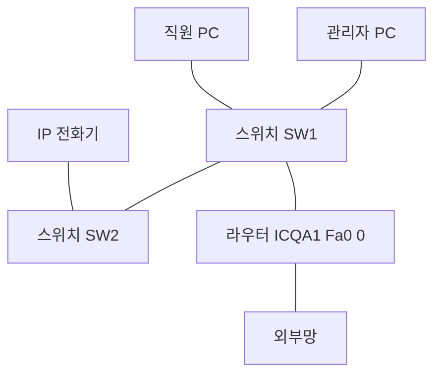

<Callout type="warning">
  **이 문서의 문제는 실제 기출문제를 그대로 옮긴 것이 아닙니다.** 공개된 회차별 출제 형식과 난이도를 참고해 값과 상황을 **새로 구성한 유사문제**이며, 원문의 값이나 조건이 서로 어긋나는 부분은 표준에 맞게 바로잡아 재구성했습니다. 실제 시험의 문항 수·배점·화면 구성은 반드시 ICQA 공식 안내에서 확인하십시오.
</Callout>

<Callout type="info">
  **이번 문서의 목표:** 이 파일을 다 읽으면 케이블 종류 판별부터 라우터 저장까지 한 세트를 끊김 없이 수행할 수 있고, 각 과제에서 점수를 잃는 정확한 지점을 미리 알고 피할 수 있다.
</Callout>

## 이 세트의 전제 구성도

모든 과제는 아래 구성을 배경으로 합니다. 문제를 읽기 전에 그림을 먼저 머리에 넣어 두십시오.



- 관리자 PC가 속한 대역은 과제 2에서 계산해 정합니다
- 라우터 `Fa0/0`은 그 대역의 첫 사용 가능 주소를 씁니다
- 스위치끼리는 같은 성격의 장비끼리 연결되는 구간입니다

## 과제 1. 랜케이블 제작

### 문제

제공된 UTP 케이블, RJ-45 커넥터, 탈피기, 압착기를 사용하여 아래 두 구간에 쓸 케이블을 각각 판별하고, 요구된 구간의 케이블을 제작하시오.

- 구간 A: 스위치 SW1의 일반 포트와 스위치 SW2의 일반 포트를 연결
- 구간 B: 스위치 SW2의 일반 포트와 IP 전화기를 연결
- 제작 대상: **구간 A**

### 정답

| 항목 | 값 |
|-----|-----|
| 구간 A 케이블 종류 | 크로스 케이블 (Cross-over) |
| 구간 B 케이블 종류 | 다이렉트 케이블 (Direct) |
| 구간 A 한쪽 배선 | T568A: 초록띠 – 초록 – 주황띠 – 파랑 – 파랑띠 – 주황 – 갈색띠 – 갈색 |
| 구간 A 반대쪽 배선 | T568B: 주황띠 – 주황 – 초록띠 – 파랑 – 파랑띠 – 초록 – 갈색띠 – 갈색 |

### 이 답이 나온 판단 과정

<Steps>

### 1단계 — 두 장비의 성격을 비교한다

케이블 종류는 장비 이름이 아니라 **송신 핀과 수신 핀의 배치가 같은가 다른가**로 결정됩니다. 전통적으로 PC와 라우터는 1·2번으로 보내고 3·6번으로 받으며, 허브와 스위치는 그 반대입니다.

### 2단계 — 같은 성격이면 크로스

구간 A는 스위치와 스위치이므로 **양쪽 모두 3·6번으로 보내고 1·2번으로 받으려 합니다.** 그대로 이으면 송신끼리, 수신끼리 만나 통신이 되지 않습니다. 케이블 안에서 1과 3, 2와 6을 바꿔 줘야 합니다.

### 3단계 — 다른 성격이면 다이렉트

구간 B는 스위치와 IP 전화기(단말)이므로 성격이 다릅니다. 핀을 그대로 이어 주는 다이렉트가 정답입니다.

### 4단계 — 크로스는 한쪽만 T568A로 만든다

양쪽을 모두 T568A로 만들면 그것은 크로스가 아니라 **또 다른 다이렉트**입니다. 규격만 다를 뿐 1번이 1번으로, 3번이 3번으로 이어지기 때문입니다. 반드시 **한쪽 T568A, 반대쪽 T568B**입니다.

</Steps>

### 두 규격의 핀 배열 대조

| 핀 번호 | T568B | T568A |
|--------|-------|-------|
| 1 | 주황띠 | 초록띠 |
| 2 | 주황 | 초록 |
| 3 | 초록띠 | 주황띠 |
| 4 | 파랑 | 파랑 |
| 5 | 파랑띠 | 파랑띠 |
| 6 | 초록 | 주황 |
| 7 | 갈색띠 | 갈색띠 |
| 8 | 갈색 | 갈색 |

**바뀌는 자리는 1·2·3·6번 네 개뿐이고 4·5·7·8번은 동일**합니다. 주황 계열과 초록 계열을 통째로 맞바꾼 것이라고 기억하면 시험장에서 헷갈리지 않습니다.

### 자주 하는 실수

| 실수 | 결과 |
|-----|------|
| 양쪽 모두 T568A로 제작 | 크로스가 아니라 다이렉트가 됨 |
| 4번과 5번을 뒤집어 넣음 | 테스터에서 4와 5가 뒤바뀌어 점등 |
| 심선을 커넥터 끝까지 밀지 않음 | 해당 핀이 접촉되지 않아 점등 안 됨 |
| 피복을 커넥터 밖에서 자름 | 잡아당기면 심선이 빠짐 |
| 압착기를 끝까지 누르지 않음 | 전부 점등되지 않음 |

<Callout type="warning">
  **최근 회차는 다이렉트만 출제되었지만 크로스가 사라진 것은 아닙니다.** 문제 문장에서 연결 대상 두 장비를 먼저 읽고 판별하는 습관을 들이십시오. 종류를 잘못 고르면 배선을 아무리 정확히 해도 0점입니다.
</Callout>

## 과제 2. 네트워크 속성 설정

### 문제

관리자 PC의 네트워크 속성을 아래 조건대로 설정하시오.

- IP 주소(2진수): `11000000.10101000.00101100.01001010`
- 서브넷 마스크: `26bit`
- 기본 게이트웨이: 이 PC가 속한 네트워크에서 **사용 가능한 마지막 주소**
- 기본 설정 DNS 서버: `168.126.63.1`
- 보조 DNS 서버: `8.8.8.8`

### 정답

| 입력칸 | 넣을 값 |
|-------|--------|
| IP 주소 | 192.168.44.74 |
| 서브넷 마스크 | 255.255.255.192 |
| 기본 게이트웨이 | 192.168.44.126 |
| 기본 설정 DNS 서버 | 168.126.63.1 |
| 보조 DNS 서버 | 8.8.8.8 |

### 이 값이 나온 계산 과정

**1. 2진수 IP를 십진수로 바꾼다.** 가중치는 왼쪽부터 128, 64, 32, 16, 8, 4, 2, 1입니다.

| 토막 | 2진수 | 1인 자리의 가중치 | 십진수 |
|------|-------|-----------------|--------|
| 1번째 | 11000000 | 128, 64 | 192 |
| 2번째 | 10101000 | 128, 32, 8 | 168 |
| 3번째 | 00101100 | 32, 8, 4 | 44 |
| 4번째 | 01001010 | 64, 8, 2 | 74 |

$$
128 + 64 = 192
$$

$$
128 + 32 + 8 = 168
$$

$$
32 + 8 + 4 = 44
$$

$$
64 + 8 + 2 = 74
$$

IP 주소는 `192.168.44.74`입니다.

**2. 26비트 마스크를 십진수로 바꾼다.**

| 토막 | 비트 배열 | 누적 1의 개수 | 십진수 |
|------|----------|-------------|--------|
| 1번째 | 11111111 | 8 | 255 |
| 2번째 | 11111111 | 16 | 255 |
| 3번째 | 11111111 | 24 | 255 |
| 4번째 | 11000000 | 26 | 192 |

마지막 토막은 1이 2개이므로 다음과 같이 구합니다.

$$
256 - 2^{6} = 256 - 64 = 192
$$

마스크는 `255.255.255.192`입니다.

**3. 이 PC가 속한 블록을 찾는다.** 호스트 비트가 6개이므로 블록 크기는 다음과 같습니다.

$$
2^{6} = 64
$$

네 번째 토막의 경계는 0, 64, 128, 192입니다. IP의 마지막 토막이 74이므로 **64 이상 128 미만 구간**, 즉 네트워크 주소는 `192.168.44.64`입니다.

**4. 브로드캐스트와 사용 가능 범위를 구한다.**

$$
64 + 64 - 1 = 127
$$

브로드캐스트는 `192.168.44.127`이므로 사용 가능한 범위는 `192.168.44.65`부터 `192.168.44.126`까지입니다. 문제가 요구한 **사용 가능한 마지막 주소는 `192.168.44.126`**입니다.

### 입력 절차

<Steps>

### 1단계 — 네트워크 연결 창 열기

`Windows` 키와 `R`을 눌러 실행 창에 `ncpa.cpl`을 입력하고 확인을 누릅니다.

### 2단계 — 어댑터 속성으로 진입

사용 중인 어댑터를 오른쪽 클릭하고 `속성`을 선택합니다.

### 3단계 — IPv4 속성 열기

`인터넷 프로토콜 버전 4(TCP/IPv4)`를 더블클릭합니다.

### 4단계 — 수동 입력으로 전환

`다음 IP 주소 사용`과 `다음 DNS 서버 주소 사용`을 각각 클릭합니다. 누르지 않으면 입력칸이 회색으로 잠긴 채 남습니다.

### 5단계 — 다섯 개 값을 입력

위 표의 다섯 값을 순서대로 채웁니다.

### 6단계 — 확인을 눌러 닫기

IPv4 속성 창의 `확인`, 어댑터 속성 창의 `확인`을 모두 눌러 창이 닫히는 것을 확인합니다.

</Steps>

### 자주 하는 실수

| 실수 | 잘못된 값 | 바른 값 |
|-----|----------|--------|
| 마스크를 24비트로 착각 | 255.255.255.0 | 255.255.255.192 |
| 네트워크 주소를 게이트웨이로 사용 | 192.168.44.64 | 192.168.44.126 |
| 브로드캐스트를 게이트웨이로 사용 | 192.168.44.127 | 192.168.44.126 |
| 대역 전체의 마지막 주소로 계산 | 192.168.44.254 | 192.168.44.126 |
| 보조 DNS를 비워 둠 | 빈칸 | 8.8.8.8 |

**네 번째 실수가 가장 흔합니다.** 프리픽스를 무시하고 `.254`를 습관적으로 적는 경우인데, `/26`에서 `.254`는 완전히 다른 블록의 주소입니다.

## 과제 3. IIS 웹사이트 추가

### 문제

웹 서버에 아래 조건으로 새 웹사이트를 추가하시오.

- 사이트 이름: `icqa_portal`
- 실제 경로: `C:\Websites\portal`
- 바인딩 IP 주소: `192.168.44.74`
- 포트: `8080`
- 호스트 이름: `portal.icqa.or.kr`
- 기본 문서: `main.html`만 남기고 나머지 항목 제거

### 정답 수행 절차

<Steps>

### 1단계 — 관리자 실행

실행 창에 `inetmgr`을 입력해 인터넷 정보 서비스 관리자를 엽니다.

### 2단계 — 사이트 추가

왼쪽 트리에서 `사이트`를 오른쪽 클릭하고 `웹 사이트 추가`를 선택합니다.

### 3단계 — 값 입력

사이트 이름에 `icqa_portal`, 실제 경로에 `C:\Websites\portal`, IP 주소 목록에서 `192.168.44.74`, 포트에 `8080`, 호스트 이름에 `portal.icqa.or.kr`을 넣습니다.

### 4단계 — 확인

확인을 눌러 사이트를 만들고, 왼쪽 목록에 `icqa_portal`이 나타나는지 봅니다.

### 5단계 — 기본 문서 설정

만든 사이트를 선택한 뒤 가운데 화면에서 `기본 문서`를 더블클릭합니다.

### 6단계 — 요구한 문서만 남기기

`main.html`을 `추가`로 넣고, 목록의 나머지 항목을 각각 선택해 `제거`합니다.

### 7단계 — 목록 확인

기본 문서 목록에 `main.html` 하나만 남았는지 확인합니다.

</Steps>

### 자주 하는 실수

| 실수 | 결과 |
|-----|------|
| 포트를 80으로 그대로 둠 | 요구값 8080과 달라 오답 |
| 호스트 이름 칸을 비움 | 바인딩 조건 미충족 |
| 확장자를 `main.htm`으로 입력 | 글자 하나 차이로 오답 |
| 기본 문서를 추가만 하고 나머지를 지우지 않음 | "만 남기고"라는 조건 미충족 |
| 실제 경로 폴더를 만들지 않고 이름만 입력 | 경로가 없으면 오류 창이 뜸 |

## 과제 4. DNS 서버 설정

### 문제

DNS 서버에 아래 조건으로 정방향 조회 영역과 레코드를 구성하시오.

- 영역 이름: `icqa.or.kr`
- 호스트 레코드(A): `portal`을 `192.168.44.74`로
- 별칭 레코드(CNAME): `www`를 `portal.icqa.or.kr`로
- 영역 속성의 일련번호: `20`
- 새로 고침 간격: `1200초`

### 정답 수행 절차

<Steps>

### 1단계 — DNS 관리자 열기

실행 창에 `dnsmgmt.msc`를 입력합니다.

### 2단계 — 정방향 조회 영역 만들기

`정방향 조회 영역`을 오른쪽 클릭하고 `새 영역`을 선택한 뒤, 주 영역으로 `icqa.or.kr`을 만듭니다.

### 3단계 — A 레코드 추가

만든 영역을 오른쪽 클릭하고 `새 호스트(A 또는 AAAA)`를 선택합니다. 이름에 `portal`, IP 주소에 `192.168.44.74`를 넣고 `호스트 추가`를 누릅니다.

### 4단계 — CNAME 레코드 추가

같은 영역에서 `새 별칭(CNAME)`을 선택합니다. 별칭 이름에 `www`, 대상 호스트에 `portal.icqa.or.kr`을 넣습니다.

### 5단계 — 영역 속성에서 SOA 값 수정

영역을 오른쪽 클릭해 `속성`을 열고 `권한 시작(SOA)` 탭에서 일련번호를 `20`, 새로 고침 간격을 `1200초`(20분)로 바꿉니다.

### 6단계 — 적용과 확인

`적용`을 누른 뒤 `확인`으로 창을 닫습니다.

</Steps>

### 레코드 종류를 헷갈리지 않는 기준

| 레코드 | 왼쪽에 오는 것 | 오른쪽에 오는 것 |
|-------|--------------|---------------|
| A | 이름 | IPv4 주소 |
| AAAA | 이름 | IPv6 주소 |
| CNAME | 별칭 이름 | **다른 이름** (주소가 아님) |
| MX | 도메인 | 메일 서버 이름 |
| PTR | IP | 이름 |

<Callout type="warning">
  **CNAME의 대상에 IP 주소를 넣으면 오답입니다.** CNAME은 이름을 다른 이름으로 넘기는 레코드이므로 대상은 반드시 `portal.icqa.or.kr` 같은 이름이어야 합니다. IP를 넣고 싶다면 그것은 A 레코드입니다.
</Callout>

### 자주 하는 실수

| 실수 | 결과 |
|-----|------|
| 역방향 조회 영역에 만듦 | 정방향 조건 미충족 |
| CNAME 대상에 IP 입력 | 레코드 종류 오해로 오답 |
| SOA 값을 새 영역 마법사에서 찾음 | 마법사에는 없고 속성 탭에 있음 |
| 새로 고침 간격 단위를 분으로 입력 | 1200초를 1200분으로 넣으면 오답 |
| 적용을 누르지 않고 창을 닫음 | 값이 저장되지 않음 |

## 과제 5. DHCP 범위 설정

### 문제

DHCP 서버에 아래 조건으로 새 범위를 구성하시오.

- 범위 이름: `icqa_scope`
- 설명: `네트워크관리사`
- 시작 IP 주소: `192.168.44.80`
- 끝 IP 주소: `192.168.44.120`
- 길이(프리픽스): `26`
- 배제 범위: `192.168.44.80`부터 `192.168.44.85`까지
- 임대 기간: `8시간`
- 기본 게이트웨이(라우터): `192.168.44.126`
- DNS 서버: `168.126.63.1`

### 정답

| 입력 항목 | 값 |
|----------|-----|
| 이름 | icqa_scope |
| 설명 | 네트워크관리사 |
| 시작 IP | 192.168.44.80 |
| 끝 IP | 192.168.44.120 |
| 길이 | 26 |
| 서브넷 마스크(자동 채워짐) | 255.255.255.192 |
| 배제 시작–끝 | 192.168.44.80 – 192.168.44.85 |
| 임대 기간 | 0일 8시간 0분 |
| 라우터(기본 게이트웨이) | 192.168.44.126 |
| DNS 서버 | 168.126.63.1 |

### 확인할 계산

배포 범위 80부터 120까지가 **과제 2에서 구한 블록 안에 들어가는지** 검산합니다. 블록은 64부터 127까지이고 사용 가능 범위는 65부터 126까지이므로, 80–120은 모두 그 안에 들어갑니다. 게이트웨이 `192.168.44.126`도 같은 블록의 마지막 사용 가능 주소이므로 일관됩니다.

실제 배포되는 주소 개수는 다음과 같습니다.

$$
(120 - 80 + 1) - (85 - 80 + 1) = 41 - 6 = 35
$$

### 자주 하는 실수

| 실수 | 결과 |
|-----|------|
| 길이에 24를 입력 | 마스크가 255.255.255.0으로 채워져 대역이 어긋남 |
| 배제 범위를 추가하고 `추가` 버튼을 안 누름 | 목록에 반영되지 않아 배제 미적용 |
| 임대 기간을 8일로 입력 | 일·시간·분 칸을 혼동 |
| 범위를 만들고 활성화하지 않음 | 범위가 존재해도 배포되지 않음 |
| 라우터 옵션을 건너뜀 | 마법사에서 넘기면 옵션 003이 비어 있음 |

## 과제 6. 로컬 사용자 추가

### 문제

아래 조건으로 로컬 사용자를 추가하고 세부 설정을 완료하시오.

- 사용자 이름: `icqa_admin`
- 전체 이름: `한국정보통신자격협회`
- 설명: `네트워크관리사 실기`
- 암호: `Icqa2025net`
- 다음 로그온 시 암호를 반드시 변경해야 함: 체크 해제
- 암호 사용 기간 제한 없음: 체크
- 소속 그룹: 기본 `Users` 외에 `Backup Operators` 추가
- 전화 접속(로그온) 네트워크 액세스 권한: 액세스 거부

### 정답 수행 절차

<Steps>

### 1단계 — 컴퓨터 관리 열기

실행 창에 `lusrmgr.msc`를 입력합니다.

### 2단계 — 새 사용자 만들기

`사용자` 폴더를 오른쪽 클릭하고 `새 사용자`를 선택해 이름, 전체 이름, 설명, 암호를 입력합니다.

### 3단계 — 체크박스 조정

`다음 로그온 시 사용자가 반드시 암호를 변경해야 함`의 체크를 **해제**한 뒤 `암호 사용 기간 제한 없음`을 **체크**합니다.

### 4단계 — 만들기와 닫기

`만들기`를 누르고 `닫기`를 누릅니다. 만들기를 누르지 않고 닫으면 계정이 생기지 않습니다.

### 5단계 — 소속 그룹 추가

만든 계정을 더블클릭해 `소속 그룹` 탭에서 `추가`를 눌러 `Backup Operators`를 넣습니다.

### 6단계 — 전화 접속 권한 설정

같은 속성 창의 `전화 접속` 탭에서 네트워크 액세스 권한을 `액세스 거부`로 지정합니다.

### 7단계 — 적용과 확인

`적용`을 누른 뒤 `확인`으로 닫습니다.

</Steps>

<Callout type="warning">
  **체크박스 순서에 함정이 있습니다.** `다음 로그온 시 암호 변경`이 체크되어 있으면 `암호 사용 기간 제한 없음`이 회색으로 잠겨 선택되지 않습니다. 먼저 앞의 체크를 해제해야 뒤의 항목을 누를 수 있습니다.
</Callout>

## 과제 7. 서비스 설정

### 문제

다음 설명에 해당하는 서비스를 찾아 **시작 유형을 사용 안 함으로 바꾸고 서비스를 중지**하시오.

- 설명: 원격 사용자가 이 컴퓨터의 레지스트리 설정을 변경할 수 있게 하는 서비스입니다. 보안을 위해 사용하지 않도록 설정해야 합니다.

### 정답

| 항목 | 값 |
|-----|-----|
| 서비스 이름 | Remote Registry |
| 시작 유형 | 사용 안 함 |
| 서비스 상태 | 중지 |

### 수행 절차와 순서의 이유

<Steps>

### 1단계 — 서비스 관리자 열기

실행 창에 `services.msc`를 입력합니다.

### 2단계 — 서비스 찾기

목록에서 `Remote Registry`를 찾아 더블클릭합니다. 목록에서 아무 항목이나 클릭한 뒤 `R`을 여러 번 누르면 빠르게 이동합니다.

### 3단계 — 시작 유형을 먼저 바꾼다

`시작 유형`을 `사용 안 함`으로 바꾸고 `적용`을 누릅니다.

### 4단계 — 그다음 중지한다

`중지` 버튼을 눌러 서비스 상태를 `중지됨`으로 만듭니다.

### 5단계 — 확인

`확인`을 눌러 창을 닫고, 목록에서 상태와 시작 유형 두 열을 눈으로 확인합니다.

</Steps>

**순서를 이렇게 잡는 이유**가 있습니다. 시작 유형이 `자동`인 상태에서 중지만 하면 다른 서비스가 호출할 때 다시 시작될 수 있습니다. 먼저 사용 안 함으로 막고 나서 중지해야 확실합니다.

### 서비스 문제 빈출 항목

| 설명 키워드 | 서비스 이름 |
|-----------|-----------|
| 인쇄 작업을 백그라운드에서 관리 | Print Spooler |
| 도메인 이름을 로컬에 캐시 | DNS Client |
| 원격에서 레지스트리를 수정 | Remote Registry |
| 가상 머신의 상태를 하트비트로 보고 | Hyper-V 하트비트 서비스 |
| 실시간 푸시 알림을 전달 | Windows Push Notifications System Service |

## 과제 8. 라우터 기본 설정

### 문제

라우터에 아래 조건을 설정하고 저장하시오.

- 호스트 이름: `ICQA1`
- 특권 모드 암호(암호화 저장): `icqa1234`
- 콘솔 접속 암호: `console9`
- 접속 시 표시할 배너 문구: `Authorized Access Only`

### 정답

```text
Router> enable
Router# configure terminal
Router(config)# hostname ICQA1
ICQA1(config)# enable secret icqa1234
ICQA1(config)# line console 0
ICQA1(config-line)# password console9
ICQA1(config-line)# login
ICQA1(config-line)# exit
ICQA1(config)# banner motd #Authorized Access Only#
ICQA1(config)# exit
ICQA1# copy running-config startup-config
```

### 각 줄의 의미와 주의점

| 줄 | 의미 | 주의점 |
|----|------|-------|
| `hostname ICQA1` | 장치 이름 변경 | 입력 직후 프롬프트가 `ICQA1(config)#`으로 바뀜 |
| `enable secret icqa1234` | 특권 모드 암호를 암호화해 저장 | `enable password`는 평문 저장이라 문제가 암호화를 요구하면 오답 |
| `line console 0` | 콘솔 포트 설정 모드 진입 | 콘솔은 항상 0번 하나뿐 |
| `password console9` | 콘솔 암호 지정 | 대소문자 구분 |
| `login` | 암호를 실제로 물어보게 함 | **이 줄을 빠뜨리면 암호를 걸어도 묻지 않음** |
| `banner motd #...#` | 접속 시 문구 표시 | 시작과 끝을 같은 구분 문자로 감쌈. 문구 안에 그 문자를 쓰면 안 됨 |
| `copy running-config startup-config` | 저장 | 반드시 특권 모드에서 |

<Callout type="warning">
  **`password`만 넣고 `login`을 빠뜨리는 것이 이 유형의 대표 감점 포인트입니다.** 암호를 설정했더라도 `login`이 없으면 접속 시 아무것도 묻지 않아 설정이 무의미해집니다.
</Callout>

### enable password와 enable secret의 차이

| 명령 | 저장 형태 | 우선순위 |
|-----|----------|---------|
| `enable password` | 설정 파일에 평문으로 보임 | 둘 다 있으면 무시됨 |
| `enable secret` | 해시로 암호화되어 저장 | 둘 다 있으면 이쪽이 적용됨 |

문제가 "암호화하여" 또는 "보안된"이라는 표현을 쓰면 `secret`입니다.

## 과제 9. 인터페이스 IP 설정과 활성화

### 문제

라우터 `ICQA1`의 `FastEthernet 0/0`에 아래 조건을 설정하고 활성화한 뒤 저장하시오.

- 주 IP 주소: 과제 2에서 계산한 네트워크의 **사용 가능한 첫 번째 주소**
- 서브넷 마스크: 과제 2와 동일
- 보조 IP 주소: `192.168.60.1`, 마스크 `255.255.255.0`
- 인터페이스 설명: `LAN-SEGMENT`

### 정답

주 IP는 `192.168.44.64` 블록의 첫 사용 가능 주소이므로 `192.168.44.65`입니다.

```text
Router> enable
Router# configure terminal
Router(config)# interface fastethernet 0/0
Router(config-if)# description LAN-SEGMENT
Router(config-if)# ip address 192.168.44.65 255.255.255.192
Router(config-if)# ip address 192.168.60.1 255.255.255.0 secondary
Router(config-if)# no shutdown
Router(config-if)# exit
Router(config)# exit
ICQA1# copy running-config startup-config
```

### 이 답이 나온 판단 과정

<Steps>

### 1단계 — 네트워크 주소를 확인한다

과제 2에서 `192.168.44.74/26`의 네트워크 주소가 `192.168.44.64`임을 이미 구했습니다.

### 2단계 — 첫 사용 가능 주소를 구한다

네트워크 주소에 1을 더합니다.

$$
64 + 1 = 65
$$

### 3단계 — 마스크는 점 십진수로 쓴다

라우터는 프리픽스 표기를 받지 않습니다. `/26`이 아니라 `255.255.255.192`로 입력합니다.

### 4단계 — 보조 IP는 secondary 키워드로

같은 인터페이스에 두 번째 주소를 붙일 때는 명령 끝에 `secondary`를 붙입니다. **붙이지 않으면 앞의 주 IP를 덮어씁니다.**

### 5단계 — 활성화한다

`no shutdown`으로 인터페이스를 올립니다.

</Steps>

### 자주 하는 실수

| 실수 | 결과 |
|-----|------|
| `192.168.44.64`를 IP로 입력 | 네트워크 주소라 호스트에 줄 수 없음 |
| `192.168.44.1`을 입력 | 다른 블록(0–63)의 주소라 대역이 어긋남 |
| 마스크를 `/26`으로 입력 | 문법 오류로 명령 거부 |
| `secondary`를 빠뜨림 | 주 IP가 보조 IP로 교체됨 |
| `no shutdown` 누락 | `administratively down` 상태로 남음 |
| 저장 누락 | 재부팅 시 전부 소실 |

## 과제 10. 설정 검증과 저장

### 문제

라우터 `ICQA1`의 인터페이스 상태 요약과 현재 실행 중인 설정을 확인하고 저장하시오.

### 정답

```text
Router> enable
ICQA1# show ip interface brief
ICQA1# show running-config
ICQA1# copy running-config startup-config
```

### 출력에서 확인할 것

```text
Interface              IP-Address       OK? Method Status                Protocol
FastEthernet0/0        192.168.44.65    YES manual up                    up
FastEthernet0/1        unassigned       YES unset  administratively down down
```

| 확인 항목 | 정상 표시 |
|----------|----------|
| 요구한 인터페이스의 IP-Address | 설정한 주소가 그대로 |
| Method | `manual` (손으로 넣었다는 뜻) |
| Status | `up` |
| Protocol | `up` |

<Callout type="warning">
  **`show ip interface brief`에는 보조 IP가 표시되지 않습니다.** 보조 주소까지 확인하려면 `show running-config`를 보거나 `show ip interface fastethernet 0/0`을 써야 합니다. 요약 화면에 안 보인다고 다시 입력하면 오히려 설정이 꼬입니다.
</Callout>

**조회만 하는 문제에도 저장을 요구하는 경우가 많으므로**, 문제 문장에 "저장하시오"가 있으면 `show` 뒤에 반드시 저장 명령을 붙입니다.

## 세트 전체 최종 점검표

| 과제 | 마지막 한 동작 | 확인 방법 |
|-----|--------------|----------|
| 1 케이블 | 테스터 점등 순서 | 1과 3, 2와 6이 교차하는지 |
| 2 네트워크 속성 | 확인 두 번 클릭 | `ncpa.cpl`로 다시 열어 값 확인 |
| 3 IIS | 기본 문서 목록 정리 | 목록에 `main.html`만 남았는지 |
| 4 DNS | 속성 탭 적용 | 영역에 A와 CNAME이 보이는지 |
| 5 DHCP | 범위 활성화 | 배제 범위가 목록에 있는지 |
| 6 사용자 | 소속 그룹 추가 후 적용 | 속성 창의 두 탭 모두 |
| 7 서비스 | 사용 안 함 적용 후 중지 | 목록의 두 열 모두 |
| 8 라우터 기본 | `login` 입력과 저장 | `show running-config` |
| 9 인터페이스 | `no shutdown`과 저장 | `show ip interface brief` |
| 10 검증 | 저장 명령 | 프롬프트가 `ICQA1#`인지 |

## 마무리 복습

<Quiz
  questionNumber={1}
  question="스위치 SW1 의 일반 포트와 스위치 SW2 의 일반 포트를 연결할 때 필요한 케이블과 배선 방식으로 옳은 것은?"
  options={['다이렉트 케이블 양쪽 모두 T568B', '크로스 케이블 한쪽 T568A 반대쪽 T568B', '크로스 케이블 양쪽 모두 T568A', '롤오버 케이블 양쪽 역순 배열']}
  correctAnswer={2}
  explanation="같은 성격의 장비끼리는 송신과 수신 핀 배치가 같아 그대로 이으면 통신되지 않는다. 한쪽을 T568A 반대쪽을 T568B 로 만들어 1 과 3 2 와 6 을 교차시켜야 한다."
  optionExplanations={['양쪽 동일 규격은 다이렉트가 되어 스위치 간 연결에 맞지 않는다', '정답 — 크로스는 두 규격을 섞어 만든다', '양쪽 모두 T568A 이면 규격만 다른 다이렉트가 된다', '롤오버는 콘솔 접속용으로 용도가 다르다']}
/>

<Quiz
  questionNumber={2}
  question="T568A 와 T568B 를 비교할 때 핀 배열이 서로 다른 번호만 모은 것은?"
  options={['1 2 3 6', '4 5 7 8', '1 4 5 8', '전체 8개 모두']}
  correctAnswer={1}
  explanation="주황 계열과 초록 계열이 통째로 맞바뀌므로 1 2 3 6 번만 달라지고 파랑과 갈색이 들어가는 4 5 7 8 번은 두 규격이 동일하다."
  optionExplanations={['정답 — 교차되는 네 자리다', '이 네 자리는 두 규격에서 동일하다', '4 5 8 은 동일한 자리다', '절반만 달라진다']}
/>

<Quiz
  questionNumber={3}
  question="IP 주소가 11000000.10101000.00101100.01001010 로 주어졌을 때 십진수 표기는?"
  options={['192.168.44.74', '192.168.44.72', '192.168.46.74', '190.168.44.74']}
  correctAnswer={1}
  explanation="각 토막을 가중치 합으로 바꾸면 128 더하기 64 는 192 128 더하기 32 더하기 8 은 168 32 더하기 8 더하기 4 는 44 64 더하기 8 더하기 2 는 74 가 된다."
  optionExplanations={['정답 — 네 토막의 변환이 모두 일치한다', '마지막 토막에서 2 의 자리를 빠뜨린 값이다', '세 번째 토막 계산이 틀렸다', '첫 토막 계산이 틀렸다']}
/>

<Quiz
  questionNumber={4}
  question="서브넷 마스크가 26bit 로 주어졌을 때 점 십진수 표기와 한 블록의 크기로 옳은 것은?"
  options={['255.255.255.192 와 블록 크기 64', '255.255.255.224 와 블록 크기 32', '255.255.255.128 와 블록 크기 128', '255.255.255.240 와 블록 크기 16']}
  correctAnswer={1}
  explanation="26 비트는 마지막 토막에 1 이 2 개이므로 256 에서 64 를 뺀 192 다. 호스트 비트가 6 개이므로 블록 크기는 2 의 6 제곱인 64 다."
  optionExplanations={['정답 — 마스크와 블록 크기가 모두 맞다', '이 값은 27 비트의 결과다', '이 값은 25 비트의 결과다', '이 값은 28 비트의 결과다']}
/>

<Quiz
  questionNumber={5}
  question="192.168.44.74/26 이 속한 네트워크의 사용 가능한 마지막 주소는?"
  options={['192.168.44.126', '192.168.44.127', '192.168.44.254', '192.168.44.63']}
  correctAnswer={1}
  explanation="블록 크기가 64 이므로 이 주소는 64 부터 127 까지의 블록에 속한다. 64 는 네트워크 주소 127 은 브로드캐스트이므로 사용 가능한 마지막 주소는 126 이다."
  optionExplanations={['정답 — 브로드캐스트 바로 앞 주소다', '127 은 브로드캐스트라 호스트에 줄 수 없다', '254 는 프리픽스를 무시한 습관적 오답이다', '63 은 앞 블록의 브로드캐스트다']}
/>

<Quiz
  questionNumber={6}
  question="같은 네트워크에서 라우터 FastEthernet 0/0 에 부여할 사용 가능한 첫 번째 주소는?"
  options={['192.168.44.64', '192.168.44.65', '192.168.44.1', '192.168.44.66']}
  correctAnswer={2}
  explanation="네트워크 주소 192.168.44.64 는 호스트에 줄 수 없으므로 여기에 1 을 더한 65 가 첫 사용 가능 주소다. 192.168.44.1 은 0 부터 63 까지인 다른 블록에 속한다."
  optionExplanations={['네트워크 주소라 호스트에 배정할 수 없다', '정답 — 네트워크 주소 다음 값이다', '프리픽스를 무시한 값으로 다른 블록의 주소다', '첫 주소가 아니라 두 번째 주소다']}
/>

<Quiz
  questionNumber={7}
  question="라우터 인터페이스에 두 번째 IP 주소를 추가할 때 반드시 붙여야 하는 키워드와 그 이유로 옳은 것은?"
  options={['secondary 를 붙여야 하며 붙이지 않으면 기존 주 IP 를 덮어쓰기 때문', 'backup 을 붙여야 하며 장애 시 전환되기 때문', 'virtual 을 붙여야 하며 가상 인터페이스가 생성되기 때문', '키워드 없이 두 번 입력하면 자동으로 추가되기 때문']}
  correctAnswer={1}
  explanation="ip address 명령은 기본적으로 인터페이스의 주 IP 를 설정한다. secondary 를 붙이지 않고 다시 입력하면 앞의 주소가 새 주소로 교체된다."
  optionExplanations={['정답 — 주 IP 보존을 위해 필요하다', 'backup 이라는 키워드는 없다', 'virtual 이라는 키워드는 없다', '두 번 입력하면 덮어써진다']}
/>

<Quiz
  questionNumber={8}
  question="라우터 인터페이스 설정에서 ip address 192.168.44.65/26 을 입력했더니 오류가 났다. 원인은?"
  options={['프리픽스가 잘못 계산되었기 때문', 'Cisco IOS 는 점 십진수 마스크를 요구하므로 255.255.255.192 로 써야 하기 때문', '인터페이스 모드가 아니라 전역 설정 모드였기 때문', '해당 주소가 네트워크 주소이기 때문']}
  correctAnswer={2}
  explanation="IOS 의 ip address 명령은 주소와 마스크를 공백으로 구분한 점 십진수 형식만 받는다. 프리픽스 표기는 리눅스 ip 명령이나 문제 지문에서 쓰는 표기다."
  optionExplanations={['프리픽스 값 자체는 맞다', '정답 — 표기 형식이 문제다', '모드가 틀렸다면 명령 자체를 인식하지 못한다', '65 는 사용 가능한 첫 주소로 정상이다']}
/>

<Quiz
  questionNumber={9}
  question="콘솔 포트에 암호를 설정했는데 접속 시 암호를 묻지 않는다. 누락된 명령은?"
  options={['enable secret', 'login', 'service password-encryption', 'no shutdown']}
  correctAnswer={2}
  explanation="line console 0 아래에서 password 로 암호를 지정하더라도 login 을 입력해야 실제로 인증을 요구한다. 이 한 줄 누락이 대표적인 감점 포인트다."
  optionExplanations={['enable secret 은 특권 모드 진입 암호로 콘솔 인증과 다르다', '정답 — 인증을 활성화하는 명령이다', '암호 암호화 옵션일 뿐 인증 여부와 무관하다', '인터페이스 활성화 명령으로 콘솔과 무관하다']}
/>

<Quiz
  questionNumber={10}
  question="문제가 특권 모드 암호를 암호화하여 저장하라고 요구했다. 사용할 명령은?"
  options={['enable password icqa1234', 'enable secret icqa1234', 'line vty 0 4 다음 password icqa1234', 'username icqa1234 privilege 15']}
  correctAnswer={2}
  explanation="enable secret 은 암호를 해시로 저장하고 enable password 는 평문으로 남는다. 두 명령이 함께 있으면 secret 이 우선 적용된다."
  optionExplanations={['평문으로 저장되어 암호화 조건을 충족하지 못한다', '정답 — 해시로 저장된다', 'vty 는 원격 접속 라인 설정이다', '사용자 계정 생성 명령으로 요구와 다르다']}
/>

<Quiz
  questionNumber={11}
  question="DNS 에서 www 를 portal.icqa.or.kr 로 넘기려면 어떤 레코드를 만들어야 하는가?"
  options={['A 레코드', 'CNAME 레코드', 'MX 레코드', 'PTR 레코드']}
  correctAnswer={2}
  explanation="CNAME 은 이름을 다른 이름으로 넘기는 별칭 레코드다. A 는 이름을 IPv4 주소로 MX 는 메일 서버 지정 PTR 은 IP 를 이름으로 되돌리는 역방향 레코드다."
  optionExplanations={['A 는 대상이 IP 주소여야 한다', '정답 — 대상이 다른 이름인 별칭 레코드다', 'MX 는 메일 라우팅용이다', 'PTR 은 역방향 조회 영역에서 쓴다']}
/>

<Quiz
  questionNumber={12}
  question="DHCP 범위에서 시작 192.168.44.80 끝 192.168.44.120 을 만들고 192.168.44.80 부터 85 까지를 배제했다. 실제로 배포되는 주소 개수는?"
  options={['35개', '41개', '40개', '46개']}
  correctAnswer={1}
  explanation="전체 범위는 120 빼기 80 더하기 1 로 41 개이고 배제 범위는 85 빼기 80 더하기 1 로 6 개다. 41 에서 6 을 빼면 35 개가 남는다."
  optionExplanations={['정답 — 전체에서 배제분을 뺀 값이다', '배제를 반영하지 않은 값이다', '양 끝 포함 계산에서 1 을 빠뜨린 값이다', '배제분을 더해 버린 값이다']}
/>

<Quiz
  questionNumber={13}
  question="DHCP 범위 마법사에서 길이를 26 이 아니라 24 로 입력하면 어떤 일이 생기는가?"
  options={['서브넷 마스크가 255.255.255.0 으로 채워져 요구한 대역 조건과 어긋난다', '아무 영향이 없다', '범위가 자동으로 활성화된다', '배제 범위가 자동으로 설정된다']}
  correctAnswer={1}
  explanation="길이 값이 곧 서브넷 마스크를 결정한다. 26 은 255.255.255.192 24 는 255.255.255.0 이므로 클라이언트가 받는 마스크가 달라져 게이트웨이와 대역 계산이 어긋난다."
  optionExplanations={['정답 — 마스크가 달라져 조건을 충족하지 못한다', '마스크가 바뀌므로 영향이 크다', '활성화는 별도 동작이다', '배제는 사용자가 직접 추가해야 한다']}
/>

<Quiz
  questionNumber={14}
  question="서비스 관리자에서 Remote Registry 를 중지 및 사용 안 함으로 설정할 때 권장되는 순서와 그 이유는?"
  options={['중지 먼저 하고 시작 유형을 바꾼다 — 중지해야 유형 변경이 가능하기 때문', '시작 유형을 사용 안 함으로 먼저 바꾸고 중지한다 — 자동 상태에서 중지하면 다른 서비스가 다시 켤 수 있기 때문', '순서와 무관하며 둘 중 하나만 해도 된다', '레지스트리를 직접 편집해야 한다']}
  correctAnswer={2}
  explanation="시작 유형이 자동인 상태에서는 중지해도 다른 구성 요소의 호출로 재시작될 수 있다. 사용 안 함으로 먼저 막은 뒤 중지해야 확실하며 두 항목 모두 채점 대상이다."
  optionExplanations={['중지하지 않아도 유형은 변경할 수 있다', '정답 — 재시작을 먼저 막는 순서다', '두 항목 모두 요구되므로 하나만 하면 감점이다', 'GUI 에서 정상적으로 처리된다']}
/>

<Quiz
  questionNumber={15}
  question="show ip interface brief 결과에 FastEthernet0/0 의 보조 IP 가 보이지 않는다. 올바른 대처는?"
  options={['보조 IP 설정이 실패한 것이므로 다시 입력한다', '이 명령은 주 IP 만 표시하므로 show running-config 나 show ip interface 로 확인한다', '인터페이스를 껐다 켜야 표시된다', '보조 IP 는 저장 후 재부팅해야 보인다']}
  correctAnswer={2}
  explanation="show ip interface brief 는 인터페이스별 주 IP 와 상태만 요약한다. 보조 주소는 상세 출력에서 확인해야 하며 요약 화면만 보고 다시 입력하면 설정이 중복되거나 덮어써진다."
  optionExplanations={['요약 화면에 없다고 실패한 것이 아니다', '정답 — 상세 출력에서 확인한다', '재기동은 표시 여부와 무관하다', '저장 여부와 표시 여부는 별개다']}
/>

<Quiz
  questionNumber={16}
  question="show version 이나 show ip interface brief 처럼 조회만 하는 라우터 문제에서 흔히 놓치는 마지막 동작은?"
  options={['configure terminal 로 설정 모드에 들어가는 것', '문제가 저장을 지시했다면 copy running-config startup-config 를 실행하는 것', 'exit 으로 로그아웃하는 것', 'reload 로 재부팅하는 것']}
  correctAnswer={2}
  explanation="기출 여러 회차가 조회 문제에도 저장을 함께 지시했다. 문제 문장에 저장하시오가 들어 있으면 show 명령만으로 끝내지 말고 특권 모드에서 저장 명령까지 실행해야 한다."
  optionExplanations={['조회 문제에서는 설정 모드에 들어갈 이유가 없다', '정답 — 저장 지시가 있으면 반드시 실행한다', '로그아웃은 채점과 무관하다', '재부팅하면 저장 전 설정이 사라질 수 있다']}
/>

## 참고 자료

- [ICQA - 국가공인자격증 네트워크관리사 2급](https://www.icqa.or.kr/cn/page/network)
- [TIA/EIA-568 계열 표준 요약](https://fr.wikipedia.org/wiki/ANSI/TIA-568)
- [Cisco IOS Commands 요약 자료](https://germanna.edu/sites/default/files/2026-02/Cisco%20IOS%20Commands.pdf)
- [네트워크관리사 2급 실기 정리 자료](https://devbirdfeet.tistory.com/296)
