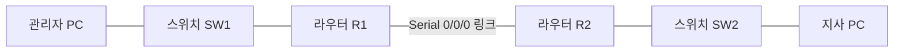
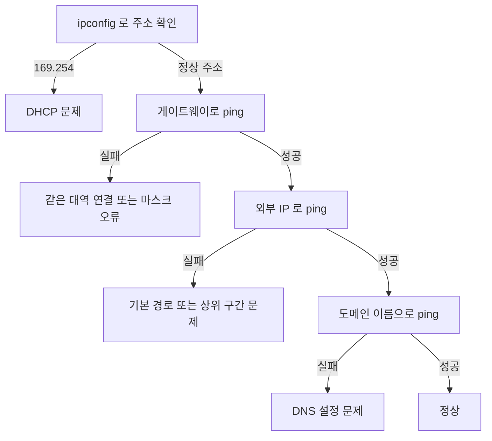

<Callout type="warning">
  **이 문서의 문제는 실제 기출문제를 그대로 옮긴 것이 아닙니다.** 공개된 회차별 출제 형식과 난이도를 참고해 값과 상황을 **새로 구성한 유사문제**이며, 원문에서 조건과 정답이 서로 어긋나거나 표기가 부정확했던 부분은 표준에 맞게 바로잡아 재구성했습니다. 실제 시험의 문항 수·배점·화면 구성은 반드시 ICQA 공식 안내에서 확인하십시오.
</Callout>

<Callout type="info">
  **이번 문서의 목표:** 이 파일을 다 읽으면 두 라우터로 이루어진 망에서 경로를 직접 설계해 명령으로 옮길 수 있고, 통신이 안 될 때 어느 명령의 어느 줄을 보고 원인을 특정할지 판단할 수 있다.
</Callout>

## 이 세트의 전제 구성도



| 구간 | 대역 | 비고 |
|-----|------|------|
| 본사 LAN (R1 쪽) | 210.100.50.128/27 | 과제 1에서 계산 |
| 라우터 간 시리얼 링크 | 10.10.10.0/30 | R1은 `.1`, R2는 `.2` |
| 지사 LAN (R2 쪽) | 192.168.70.0/24 | R2의 `Fa0/0`이 `.1` |
| OSPF 대상 대역 | 172.30.8.0/22 | 과제 4에서 사용 |

## 과제 1. 네트워크 속성 설정

### 문제

관리자 PC의 네트워크 속성을 아래 조건대로 설정하시오.

- 네트워크 범위: `210.100.50.128/27`
- IP 주소: 사용 가능한 **첫 번째** 주소
- 기본 게이트웨이: 사용 가능한 **마지막** 주소
- 추가 게이트웨이: `210.100.50.157`
- 기본 설정 DNS 서버: `168.126.63.1`
- 보조 DNS 서버: `210.220.163.82`

### 정답

| 입력칸 | 넣을 값 | 입력 위치 |
|-------|--------|----------|
| IP 주소 | 210.100.50.129 | 기본 화면 |
| 서브넷 마스크 | 255.255.255.224 | 기본 화면 |
| 기본 게이트웨이 | 210.100.50.158 | 기본 화면 |
| 추가 게이트웨이 | 210.100.50.157 | 고급 버튼 안 IP 설정 탭 |
| 기본 설정 DNS 서버 | 168.126.63.1 | 기본 화면 |
| 보조 DNS 서버 | 210.220.163.82 | 기본 화면 |

### 이 값이 나온 계산 과정

**1. 프리픽스를 마스크로 바꾼다.** `/27`은 마지막 토막에 1이 3개 남습니다.

| 토막 | 비트 배열 | 누적 1의 개수 | 십진수 |
|------|----------|-------------|--------|
| 1번째 | 11111111 | 8 | 255 |
| 2번째 | 11111111 | 16 | 255 |
| 3번째 | 11111111 | 24 | 255 |
| 4번째 | 11100000 | 27 | 224 |

$$
256 - 2^{5} = 256 - 32 = 224
$$

**2. 블록 크기를 구한다.** 호스트 비트가 5개이므로 다음과 같습니다.

$$
2^{5} = 32
$$

**3. 블록의 경계를 확인한다.** 네 번째 토막의 경계는 0, 32, 64, 96, 128, 160, 192, 224입니다. 주어진 네트워크 주소 128은 정확히 경계 위에 있으므로 이 블록은 **128부터 159까지**입니다.

**4. 브로드캐스트와 사용 범위를 구한다.**

$$
128 + 32 - 1 = 159
$$

| 항목 | 값 |
|-----|-----|
| 네트워크 주소 | 210.100.50.128 |
| 첫 사용 가능 주소 | 210.100.50.129 |
| 마지막 사용 가능 주소 | 210.100.50.158 |
| 브로드캐스트 주소 | 210.100.50.159 |

**5. 검산한다.** 마지막 주소를 두 방법으로 구해 일치하는지 봅니다.

$$
128 + 32 - 2 = 158
$$

$$
159 - 1 = 158
$$

두 값이 같으므로 계산이 맞습니다.

### 자주 하는 실수

| 실수 | 잘못된 값 | 왜 틀렸나 |
|-----|----------|----------|
| 대역 마지막을 습관적으로 씀 | 210.100.50.254 | `/27` 블록은 159에서 끝남 |
| 브로드캐스트를 게이트웨이로 씀 | 210.100.50.159 | 호스트에 배정할 수 없는 주소 |
| 네트워크 주소를 IP로 씀 | 210.100.50.128 | 호스트에 배정할 수 없는 주소 |
| 마스크를 `/28`로 계산 | 255.255.255.240 | 블록 크기가 16이 되어 범위가 어긋남 |
| 추가 게이트웨이를 기본 화면에서 찾음 | 입력 못 함 | 고급 버튼 안 IP 설정 탭에 있음 |

<Callout type="warning">
  **추가 게이트웨이는 기본 화면에 칸이 없습니다.** IPv4 속성 창에서 `고급` 버튼을 누르고 `IP 설정` 탭의 기본 게이트웨이 영역에서 `추가`를 눌러 넣은 뒤, 고급 창의 확인과 속성 창의 확인을 모두 눌러야 반영됩니다.
</Callout>

## 과제 2. 라우터 인터페이스와 정적 라우팅

### 문제

라우터 R1에 아래 조건을 설정하고 저장하시오.

- `FastEthernet 0/0`: 본사 LAN의 사용 가능한 마지막 주소, 마스크는 과제 1과 동일
- `Serial 0/0/0`: `10.10.10.1`, 마스크 `255.255.255.252`
- 지사 LAN `192.168.70.0/24`로 가는 정적 경로를 설정 (다음 홉은 `10.10.10.2`)
- 두 인터페이스 모두 활성화

### 정답

```text
Router> enable
Router# configure terminal
Router(config)# hostname R1
R1(config)# interface fastethernet 0/0
R1(config-if)# ip address 210.100.50.158 255.255.255.224
R1(config-if)# no shutdown
R1(config-if)# exit
R1(config)# interface serial 0/0/0
R1(config-if)# ip address 10.10.10.1 255.255.255.252
R1(config-if)# no shutdown
R1(config-if)# exit
R1(config)# ip route 192.168.70.0 255.255.255.0 10.10.10.2
R1(config)# exit
R1# copy running-config startup-config
```

### 각 값의 근거

<Steps>

### 1단계 — Fa0/0 주소를 정한다

관리자 PC의 게이트웨이가 `210.100.50.158`이었습니다. **게이트웨이는 곧 라우터의 LAN 쪽 인터페이스 주소**이므로 `Fa0/0`에 같은 값을 넣습니다. PC의 게이트웨이와 라우터 인터페이스가 다르면 통신되지 않습니다.

### 2단계 — 시리얼 링크의 마스크를 확인한다

`/30`은 마지막 토막에 1이 6개 남습니다.

$$
256 - 2^{2} = 256 - 4 = 252
$$

블록 크기가 4이므로 `10.10.10.0`부터 `10.10.10.3`까지이고, 사용 가능한 주소는 `.1`과 `.2` 두 개뿐입니다. 라우터끼리 잇는 구간에 딱 맞는 크기라 실무와 시험 모두에서 `/30`을 씁니다.

### 3단계 — 정적 경로의 세 요소를 채운다

`ip route` 명령은 **목적지 네트워크 주소**, **목적지의 서브넷 마스크**, **다음 홉 주소** 세 개를 순서대로 받습니다.

```text
ip route 192.168.70.0 255.255.255.0 10.10.10.2
```

- `192.168.70.0` — 어디로 가는 트래픽인가
- `255.255.255.0` — 그 목적지의 크기
- `10.10.10.2` — 누구에게 넘길 것인가

### 4단계 — 다음 홉은 반드시 직접 닿는 주소여야 한다

`10.10.10.2`는 R1의 시리얼 인터페이스와 같은 `/30` 대역에 있습니다. **직접 연결되지 않은 주소를 다음 홉으로 쓰면 경로가 라우팅 테이블에 올라가지 않습니다.**

</Steps>

### 자주 하는 실수

| 실수 | 결과 |
|-----|------|
| 다음 홉에 목적지 대역의 주소(`192.168.70.1`)를 씀 | 직접 닿지 않아 경로가 활성화되지 않음 |
| 목적지에 호스트 주소(`192.168.70.5`)를 씀 | 네트워크 주소가 아니면 의도와 다른 경로가 됨 |
| 마스크를 프리픽스로 씀 | 문법 오류 |
| 시리얼 쪽 `no shutdown` 누락 | 링크가 죽어 정적 경로가 무효 |
| 저장 누락 | 재부팅 시 소실 |

### R2에도 반대 방향 경로가 필요하다

**정적 경로는 한쪽만 설정하면 절반만 통합니다.** R1이 지사로 보낼 줄 알아도, R2가 본사로 돌아오는 길을 모르면 응답이 도착하지 못합니다.

```text
R2(config)# ip route 210.100.50.128 255.255.255.224 10.10.10.1
```

<Callout type="warning">
  **`ping`이 실패하는데 원인을 못 찾을 때 가장 먼저 의심할 자리가 이것입니다.** 요청은 갔는데 응답이 못 오는 상황도 사용자에게는 똑같이 "실패"로 보입니다. 경로는 항상 왕복으로 생각하십시오.
</Callout>

## 과제 3. 기본 경로 설정

### 문제

R1에서 라우팅 테이블에 없는 모든 목적지를 `10.10.10.2`로 보내도록 기본 경로를 설정하고 저장하시오.

### 정답

```text
R1> enable
R1# configure terminal
R1(config)# ip route 0.0.0.0 0.0.0.0 10.10.10.2
R1(config)# exit
R1# copy running-config startup-config
```

### 왜 0이 여덟 개인가

| 자리 | 값 | 의미 |
|-----|-----|------|
| 목적지 네트워크 | 0.0.0.0 | 어떤 주소든 |
| 서브넷 마스크 | 0.0.0.0 | 어떤 비트도 비교하지 않음 |
| 다음 홉 | 10.10.10.2 | 그럴 때 여기로 보냄 |

마스크가 전부 0이므로 **모든 주소가 이 경로에 일치**합니다. 라우터는 가장 자세히 일치하는 경로를 먼저 고르므로(longest match), 구체적인 경로가 있으면 그쪽이 이기고 아무것도 없을 때만 기본 경로가 쓰입니다.

### 비슷해 보이는 세 명령의 구분

| 명령 | 쓰는 장비 | 뜻 |
|-----|----------|-----|
| `ip route 0.0.0.0 0.0.0.0 다음홉` | 라우팅이 켜진 라우터 | 기본 경로. 가장 널리 쓰임 |
| `ip default-gateway 주소` | 라우팅이 꺼진 장비나 스위치 | 관리 트래픽이 나갈 문 |
| `ip default-network 주역대` | 옛 방식 | 특정 대역을 기본 후보로 지정 |

<Callout type="warning">
  **문제가 "Default Gateway를 설정하시오"라고 쓰면 `ip default-gateway`를, "라우팅 테이블에 없는 모든 트래픽"이라고 쓰면 `ip route 0.0.0.0 0.0.0.0`을 씁니다.** 기출에서 두 표현이 모두 등장했으므로 문장을 그대로 읽고 고르는 것이 안전합니다.
</Callout>

## 과제 4. OSPF 설정과 확인

### 문제

R1에 아래 조건으로 OSPF를 설정하고, 동작 중인 라우팅 프로토콜을 확인한 뒤 저장하시오.

- 프로세스 ID: `1`
- Area ID: `0`
- 포함할 네트워크: `172.30.8.0/22`, `10.10.10.0/30`

### 정답

```text
R1> enable
R1# configure terminal
R1(config)# router ospf 1
R1(config-router)# network 172.30.8.0 0.0.3.255 area 0
R1(config-router)# network 10.10.10.0 0.0.0.3 area 0
R1(config-router)# exit
R1(config)# exit
R1# show ip protocols
R1# copy running-config startup-config
```

### 와일드카드 마스크를 구하는 법

OSPF의 `network` 문은 서브넷 마스크가 아니라 **와일드카드 마스크**를 받습니다. 서브넷 마스크의 각 토막을 255에서 빼면 됩니다.

| 대역 | 서브넷 마스크 | 계산 | 와일드카드 마스크 |
|-----|--------------|------|-----------------|
| 172.30.8.0/22 | 255.255.252.0 | 255에서 각 토막을 뺌 | 0.0.3.255 |
| 10.10.10.0/30 | 255.255.255.252 | 255에서 각 토막을 뺌 | 0.0.0.3 |
| 192.168.70.0/24 | 255.255.255.0 | 255에서 각 토막을 뺌 | 0.0.0.255 |

세 번째 토막의 계산을 확인합니다.

$$
255 - 252 = 3
$$

$$
255 - 0 = 255
$$

> **쉽게 말하면:** 서브넷 마스크의 1은 "여기는 반드시 같아야 한다", 와일드카드 마스크의 0이 같은 뜻입니다. 두 값은 서로 뒤집은 관계입니다.

### show ip protocols에서 볼 것

```text
Routing Protocol is "ospf 1"
  Router ID 210.100.50.158
  Routing for Networks:
    172.30.8.0 0.0.3.255 area 0
    10.10.10.0 0.0.0.3 area 0
```

| 항목 | 확인할 내용 |
|-----|-----------|
| 프로토콜 이름과 프로세스 ID | 문제가 준 값과 같은지 |
| Routing for Networks | 두 대역이 모두 올라왔는지 |
| area | 문제가 준 Area ID와 같은지 |

### 자주 하는 실수

| 실수 | 결과 |
|-----|------|
| 와일드카드 자리에 서브넷 마스크를 씀 | 의도한 인터페이스가 포함되지 않음 |
| `/22`의 와일드카드를 `0.0.0.255`로 씀 | 세 번째 토막을 계산하지 않은 오류 |
| Area ID를 생략 | 명령이 불완전해 거부됨 |
| 프로세스 ID를 이웃과 맞추려 함 | 프로세스 ID는 장비 내부용이라 달라도 됨 |
| 확인 명령을 빠뜨림 | 문제가 확인을 요구하면 그것도 채점 대상 |

**프로세스 ID는 이웃 라우터와 같을 필요가 없습니다.** 반대로 **Area ID는 반드시 같아야** 인접 관계가 맺어집니다. 이 둘을 뒤집어 아는 경우가 많습니다.

## 과제 5. VLAN과 트렁크

### 문제

스위치 SW1에 아래 조건을 설정하고 저장하시오.

- VLAN 10의 이름: `OFFICE`
- VLAN 20의 이름: `SERVER`
- `FastEthernet 0/1`을 VLAN 10의 액세스 포트로
- `FastEthernet 0/2`를 VLAN 20의 액세스 포트로
- `FastEthernet 0/24`를 트렁크 포트로

### 정답

```text
Switch> enable
Switch# configure terminal
Switch(config)# hostname SW1
SW1(config)# vlan 10
SW1(config-vlan)# name OFFICE
SW1(config-vlan)# exit
SW1(config)# vlan 20
SW1(config-vlan)# name SERVER
SW1(config-vlan)# exit
SW1(config)# interface fastethernet 0/1
SW1(config-if)# switchport mode access
SW1(config-if)# switchport access vlan 10
SW1(config-if)# exit
SW1(config)# interface fastethernet 0/2
SW1(config-if)# switchport mode access
SW1(config-if)# switchport access vlan 20
SW1(config-if)# exit
SW1(config)# interface fastethernet 0/24
SW1(config-if)# switchport mode trunk
SW1(config-if)# exit
SW1(config)# exit
SW1# copy running-config startup-config
```

### 액세스와 트렁크의 차이

| 구분 | 액세스 포트 | 트렁크 포트 |
|-----|-----------|-----------|
| 나르는 VLAN | 하나 | 여러 개 |
| 연결 대상 | PC, 프린터 등 단말 | 다른 스위치, 라우터 |
| 태그 | 붙이지 않음 | VLAN 번호 태그를 붙임 |
| 대표 명령 | `switchport access vlan 10` | `switchport mode trunk` |

2026년 3회 단답형이 그대로 물었습니다. **여러 VLAN의 프레임을 함께 전달하며 주로 스위치 사이를 잇는 링크**를 트렁크라고 합니다.

### 확인 명령

```text
SW1# show vlan brief
SW1# show interfaces trunk
```

`show vlan brief`에는 각 VLAN에 어떤 포트가 속했는지가 나옵니다. **트렁크 포트는 특정 VLAN에 속하지 않으므로 이 목록에 나타나지 않습니다.** 없다고 다시 설정하면 안 되고 `show interfaces trunk`로 확인해야 합니다.

## 과제 6. Windows 진단 명령 해석

### 문제

관리자 PC에서 아래 결과를 얻었다. 각 상황의 원인을 판단하고 다음에 실행할 명령을 쓰시오.

**상황 A**

```text
C:\> ipconfig

   IPv4 주소 . . . . . . . . : 169.254.88.12
   서브넷 마스크 . . . . . . : 255.255.0.0
   기본 게이트웨이 . . . . . :
```

**상황 B**

```text
C:\> ping 210.100.50.158
210.100.50.158의 응답: 바이트=32 시간=1ms TTL=255

C:\> ping 8.8.8.8
요청 시간이 만료되었습니다.
```

**상황 C**

```text
C:\> ping 8.8.8.8
8.8.8.8의 응답: 바이트=32 시간=32ms TTL=113

C:\> ping www.icqa.or.kr
www.icqa.or.kr을(를) 찾을 수 없습니다.
```

### 정답과 판단 근거

| 상황 | 원인 | 다음에 실행할 명령 |
|-----|------|-----------------|
| A | DHCP 서버 응답이 없어 APIPA 주소가 자동 부여됨 | `ipconfig /release` 다음 `ipconfig /renew` |
| B | 게이트웨이까지는 도달하나 외부로 나가는 경로가 없음 | `tracert 8.8.8.8`과 `route print` |
| C | 통신은 되나 이름 해석만 실패 | `nslookup www.icqa.or.kr`과 `ipconfig /all`의 DNS 항목 확인 |

**상황 A의 근거.** `169.254`로 시작하는 주소는 APIPA(Automatic Private IP Addressing)입니다. DHCP 서버를 찾지 못했을 때 윈도우가 스스로 붙이는 임시 주소이며, 게이트웨이 칸이 비어 있는 것도 같은 이유입니다. **이 주소로는 외부 통신이 되지 않습니다.**

**상황 B의 근거.** 게이트웨이 응답의 TTL이 255라는 점에 주목합니다. 초기 TTL이 255인 것은 네트워크 장비의 관례이므로 상대가 라우터임을 확인할 수 있습니다. 게이트웨이까지는 정상이므로 **문제는 그 너머**에 있습니다. R1의 기본 경로 누락이나 상위 링크 장애를 의심합니다.

**상황 C의 근거.** IP로는 응답이 오므로 물리·경로·게이트웨이 모두 정상입니다. 도메인 이름만 실패한다면 **이름을 IP로 바꾸는 단계**의 문제입니다.

### 진단의 뼈대



**각 단계는 앞 단계가 성공했을 때만 의미가 있습니다.** 순서를 건너뛰면 엉뚱한 곳을 고치게 됩니다.

## 과제 7. Linux 진단 명령 해석

### 문제

지사 PC(리눅스)에서 아래 결과를 얻었다. 원인을 판단하고 필요한 조치 명령을 쓰시오.

```text
$ ip -br addr
lo      UNKNOWN   127.0.0.1/8
eth0    UP        192.168.70.50/24

$ ip route
192.168.70.0/24 dev eth0 proto kernel scope link src 192.168.70.50

$ ping -c 2 192.168.70.1
2 packets transmitted, 2 received, 0% packet loss

$ ping -c 2 210.100.50.129
connect: Network is unreachable
```

### 정답

| 항목 | 내용 |
|-----|------|
| 원인 | 라우팅 테이블에 `default` 경로가 없어 다른 대역으로 나갈 길이 없음 |
| 조치 명령 | `sudo ip route add default via 192.168.70.1` |
| 영구 적용 | 배포판 설정 파일에 게이트웨이 기록 후 서비스 재시작 |

### 판단 근거

<Steps>

### 1단계 — 주소와 링크는 정상이다

`ip -br addr` 결과에서 `eth0`이 `UP`이고 주소가 붙어 있습니다. 물리·설정 계층은 문제가 없습니다.

### 2단계 — 같은 대역 통신도 정상이다

`192.168.70.1`(게이트웨이) 응답이 손실 0퍼센트로 돌아옵니다. 스위치 구간까지 정상입니다.

### 3단계 — 라우팅 테이블에 default가 없다

`ip route` 출력에 직접 연결 대역 한 줄만 있고 `default via` 줄이 없습니다. **리눅스는 갈 길을 모르는 목적지에 대해 패킷을 아예 내보내지 않고 `Network is unreachable`을 즉시 반환합니다.**

### 4단계 — 오류 메시지가 원인을 특정한다

`Request timed out`이 아니라 `Network is unreachable`이라는 점이 결정적입니다. 전자는 보냈는데 답이 없는 것이고, 후자는 **보내지도 못한 것**입니다.

</Steps>

### 두 오류 메시지의 구분

| 메시지 | 어디까지 진행되었나 | 의심할 곳 |
|-------|-------------------|----------|
| Network is unreachable | 패킷을 보내지도 못함 | 로컬 라우팅 테이블, 기본 경로 |
| Destination host unreachable | 보냈으나 중간에서 반송 | 경로상 라우터의 경로 부재 |
| Request timed out / 응답 없음 | 보냈으나 응답이 안 옴 | 목적지 상태, 방화벽, 돌아오는 경로 |

### 조치 후 검증 순서

```text
$ sudo ip route add default via 192.168.70.1
$ ip route
$ ping -c 3 210.100.50.129
$ traceroute 210.100.50.129
$ dig +short www.icqa.or.kr
```

<Callout type="warning">
  **`ip route add`로 넣은 경로는 재부팅하면 사라집니다.** 라우터에서 `copy running-config startup-config`를 하지 않은 것과 같은 상황입니다. 영구 적용은 RHEL 계열이면 `/etc/sysconfig/network-scripts/ifcfg-eth0`의 `GATEWAY` 항목, Ubuntu 최신이면 netplan 설정에 기록해야 합니다.
</Callout>

## 과제 8. 단답형 모음

| 문제 | 정답 | 근거 |
|-----|------|------|
| 여러 VLAN의 프레임을 함께 전달하며 주로 스위치 간을 잇는 링크 | 트렁크 | 액세스는 VLAN 하나만 나름 |
| 리눅스에서 즉시 시스템을 종료하는 `init` 뒤 런레벨 숫자 | 0 | 6은 재시작 |
| 리눅스에서 CPU와 메모리를 실시간 모니터링하는 명령 | top | ps는 한 번만 출력 |
| 경로를 추적하고 구간별 응답 시간을 재는 윈도우 명령 | tracert | 리눅스는 traceroute |
| 활성 연결과 포트 상태, 라우팅 테이블을 보여주는 명령 | netstat | 리눅스 대체 명령은 ss |
| 사설 IP를 공인 IP로 바꿔 주소를 절약하는 기술 | NAT | 포트까지 함께 바꾸면 PAT |
| Discover–Offer–Request–Ack 4단계로 IP를 자동 배정하는 프로토콜 | DHCP | DORA로 외움 |
| 링크 상태 알고리즘을 쓰고 코스트를 메트릭으로 쓰는 라우팅 프로토콜 | OSPF | RIP는 거리 벡터에 홉 수 |
| IP로 MAC 주소를 알아내는 프로토콜 | ARP | 반대 방향은 RARP |
| IPv4와 IPv6를 한 장비에서 동시에 쓰는 전환 기술 | 듀얼 스택 | 터널링과 구분 |

## 라우팅 프로토콜 비교 정리

선택형에서 반복 출제되는 표입니다.

| 프로토콜 | 방식 | 메트릭 | 특징 |
|---------|------|-------|------|
| RIP | 거리 벡터 | 홉 수 | 최대 15홉. 소규모 |
| IGRP | 거리 벡터 | 대역폭·지연 | 시스코 전용. 구형 |
| EIGRP | 하이브리드 | 대역폭·지연 등 | 시스코 계열. 빠른 수렴 |
| OSPF | 링크 상태 | 코스트(대역폭) | 대규모. Area 개념 |
| BGP | 경로 벡터 | 경로 속성 | 인터넷 사업자 간 |

## 세트 전체 최종 점검표

| 과제 | 마지막 한 동작 |
|-----|--------------|
| 1 네트워크 속성 | 고급 창의 확인까지 세 번 클릭 |
| 2 인터페이스·정적 경로 | 두 인터페이스 모두 `no shutdown`, 그리고 저장 |
| 3 기본 경로 | 0이 여덟 개인지 확인 후 저장 |
| 4 OSPF | 와일드카드 마스크 확인, `show ip protocols`, 저장 |
| 5 VLAN·트렁크 | 액세스 포트의 VLAN 번호 확인 후 저장 |
| 6 Windows 해석 | 판단 근거를 TTL과 오류 메시지에서 찾기 |
| 7 Linux 해석 | `default` 경로 유무 확인 |
| 8 단답형 | 철자와 대소문자 |

## 마무리 복습

<Quiz
  questionNumber={1}
  question="210.100.50.128/27 네트워크에서 사용 가능한 첫 번째 주소와 마지막 주소는?"
  options={['210.100.50.128 과 210.100.50.159', '210.100.50.129 과 210.100.50.158', '210.100.50.129 과 210.100.50.159', '210.100.50.1 과 210.100.50.254']}
  correctAnswer={2}
  explanation="프리픽스 27 은 블록 크기가 32 이므로 이 블록은 128 부터 159 까지다. 128 은 네트워크 주소 159 는 브로드캐스트이므로 사용 가능한 범위는 129 부터 158 까지다."
  optionExplanations={['양 끝은 네트워크 주소와 브로드캐스트다', '정답 — 양 끝을 제외한 범위다', '마지막 값이 브로드캐스트라 쓸 수 없다', '프리픽스를 무시한 값이다']}
/>

<Quiz
  questionNumber={2}
  question="관리자 PC의 기본 게이트웨이를 210.100.50.158 로 설정했다면 라우터 FastEthernet 0/0 에 넣어야 할 IP 주소는?"
  options={['210.100.50.129', '210.100.50.158', '210.100.50.159', '10.10.10.1']}
  correctAnswer={2}
  explanation="기본 게이트웨이는 그 대역으로 나가는 문 즉 라우터의 LAN 쪽 인터페이스 주소다. PC 가 가리키는 주소와 라우터 인터페이스 주소가 다르면 통신되지 않는다."
  optionExplanations={['이 값은 PC 자신의 IP 로 쓰인 주소다', '정답 — 게이트웨이가 곧 라우터 인터페이스다', '브로드캐스트라 인터페이스에 줄 수 없다', '시리얼 링크 쪽 주소다']}
/>

<Quiz
  questionNumber={3}
  question="192.168.70.0/24 로 가는 트래픽을 10.10.10.2 에게 넘기는 정적 경로 명령으로 옳은 것은?"
  options={['ip route 192.168.70.0 255.255.255.0 10.10.10.2', 'ip route 192.168.70.0/24 10.10.10.2', 'ip route 10.10.10.2 255.255.255.0 192.168.70.0', 'ip default-gateway 10.10.10.2']}
  correctAnswer={1}
  explanation="ip route 는 목적지 네트워크 주소 목적지의 서브넷 마스크 다음 홉 주소를 순서대로 받는다. 프리픽스 표기는 문법 오류이며 목적지와 다음 홉의 순서를 바꾸면 전혀 다른 경로가 된다."
  optionExplanations={['정답 — 세 요소의 순서와 형식이 모두 맞다', 'IOS 는 프리픽스 표기를 받지 않는다', '목적지와 다음 홉이 뒤바뀐 값이다', 'default-gateway 는 라우팅이 꺼진 장비용이다']}
/>

<Quiz
  questionNumber={4}
  question="R1 에만 지사로 가는 정적 경로를 넣었더니 ping 이 실패했다. 가장 유력한 원인은?"
  options={['R1 의 경로 문법이 틀렸다', 'R2 에 본사로 돌아오는 반대 방향 경로가 없다', 'ping 명령의 옵션이 잘못되었다', '정적 라우팅은 원래 양방향을 자동 생성한다']}
  correctAnswer={2}
  explanation="정적 경로는 한 방향만 정의한다. 요청은 지사에 도착해도 응답이 돌아올 경로가 없으면 사용자에게는 실패로 보인다. R2 에도 ip route 210.100.50.128 255.255.255.224 10.10.10.1 이 필요하다."
  optionExplanations={['문법 오류였다면 입력 시점에 거부되었을 것이다', '정답 — 경로는 왕복으로 설계해야 한다', '옵션 문제라면 다른 목적지도 실패한다', '자동 생성되지 않는다']}
/>

<Quiz
  questionNumber={5}
  question="라우팅 테이블에 없는 모든 목적지를 10.10.10.2 로 보내는 기본 경로 명령은?"
  options={['ip route 0.0.0.0 0.0.0.0 10.10.10.2', 'ip route 255.255.255.255 0.0.0.0 10.10.10.2', 'ip default-network 10.10.10.2', 'ip route any any 10.10.10.2']}
  correctAnswer={1}
  explanation="목적지와 마스크를 모두 0.0.0.0 으로 두면 어떤 주소와도 일치하는 경로가 된다. 라우터는 더 자세히 일치하는 경로를 우선하므로 구체적 경로가 있으면 그쪽이 선택된다."
  optionExplanations={['정답 — 0 이 여덟 개인 기본 경로다', '255.255.255.255 는 목적지 자리에 쓰지 않는다', 'default-network 는 옛 방식으로 용도가 다르다', 'any 라는 키워드는 없다']}
/>

<Quiz
  questionNumber={6}
  question="OSPF 에서 172.30.8.0/22 를 포함시킬 때 network 문에 쓸 와일드카드 마스크는?"
  options={['255.255.252.0', '0.0.3.255', '0.0.0.255', '0.0.255.255']}
  correctAnswer={2}
  explanation="와일드카드 마스크는 서브넷 마스크의 각 토막을 255 에서 뺀 값이다. 255.255.252.0 에서 세 번째 토막은 255 빼기 252 로 3 네 번째는 255 빼기 0 으로 255 가 된다."
  optionExplanations={['이것은 서브넷 마스크 그대로다', '정답 — 255 에서 뺀 값이다', '이것은 프리픽스 24 의 와일드카드다', '이것은 프리픽스 16 의 와일드카드다']}
/>

<Quiz
  questionNumber={7}
  question="OSPF 의 프로세스 ID 와 Area ID 에 대한 설명으로 옳은 것은?"
  options={['둘 다 이웃 라우터와 반드시 같아야 한다', '프로세스 ID 는 장비 내부용이라 달라도 되고 Area ID 는 같아야 인접 관계가 맺어진다', '둘 다 달라도 아무 문제가 없다', 'Area ID 는 장비 내부용이고 프로세스 ID 를 맞춰야 한다']}
  correctAnswer={2}
  explanation="프로세스 ID 는 한 장비 안에서 여러 OSPF 인스턴스를 구분하는 지역 값이라 이웃과 달라도 된다. 반면 같은 구간의 Area ID 가 다르면 인접 관계가 형성되지 않는다."
  optionExplanations={['프로세스 ID 는 맞출 필요가 없다', '정답 — 두 값의 성격이 반대다', 'Area ID 가 다르면 인접이 맺어지지 않는다', '두 값의 설명이 뒤바뀌었다']}
/>

<Quiz
  questionNumber={8}
  question="FastEthernet 0/1 을 VLAN 10 의 액세스 포트로 지정하는 명령 조합으로 옳은 것은?"
  options={['switchport mode trunk 다음 switchport access vlan 10', 'switchport mode access 다음 switchport access vlan 10', 'vlan 10 다음 switchport trunk allowed vlan 10', 'ip address 로 VLAN 10 주소를 부여']}
  correctAnswer={2}
  explanation="인터페이스를 액세스 모드로 지정한 뒤 소속 VLAN 번호를 지정한다. 트렁크 모드는 여러 VLAN 을 함께 나르는 스위치 간 링크에 쓰므로 단말 포트에는 맞지 않는다."
  optionExplanations={['트렁크 모드는 단말 연결용이 아니다', '정답 — 모드 지정 후 VLAN 번호를 준다', 'allowed vlan 은 트렁크 포트의 옵션이다', '액세스 포트에는 IP 를 부여하지 않는다']}
/>

<Quiz
  questionNumber={9}
  question="show vlan brief 결과에 트렁크로 설정한 FastEthernet 0/24 가 보이지 않는다. 올바른 판단은?"
  options={['설정이 실패했으므로 다시 입력한다', '트렁크 포트는 특정 VLAN 에 속하지 않아 이 목록에 나타나지 않으며 show interfaces trunk 로 확인한다', '포트가 비활성 상태다', 'VLAN 번호를 지정하지 않아 생긴 오류다']}
  correctAnswer={2}
  explanation="show vlan brief 는 각 VLAN 에 속한 액세스 포트를 보여준다. 트렁크 포트는 여러 VLAN 을 함께 나르므로 특정 VLAN 소속이 아니어서 목록에 표시되지 않는다."
  optionExplanations={['재입력하면 오히려 설정이 꼬일 수 있다', '정답 — 확인 명령이 다르다', '비활성 여부는 다른 명령으로 확인한다', '트렁크는 VLAN 번호를 지정하지 않는다']}
/>

<Quiz
  questionNumber={10}
  question="ipconfig 결과가 169.254.88.12 이고 기본 게이트웨이 칸이 비어 있다. 원인은?"
  options={['공인 IP 를 정상적으로 할당받은 상태', 'DHCP 서버 응답이 없어 윈도우가 임시로 부여한 APIPA 주소', '서브넷 마스크를 잘못 입력한 상태', '루프백 주소가 잘못 설정된 상태']}
  correctAnswer={2}
  explanation="169.254 로 시작하는 대역은 APIPA 로 DHCP 서버를 찾지 못했을 때 자동 부여된다. 게이트웨이가 비는 것도 같은 이유이며 이 주소로는 외부 통신이 되지 않는다."
  optionExplanations={['169.254 대역은 공인 주소가 아니다', '정답 — DHCP 실패의 대표 신호다', '마스크 오류라면 설정한 대역의 주소가 남는다', '루프백은 127.0.0.1 이다']}
/>

<Quiz
  questionNumber={11}
  question="게이트웨이 ping 은 성공하는데 8.8.8.8 로 보낸 ping 이 모두 시간 초과다. 가장 먼저 의심할 곳은?"
  options={['PC 의 랜 케이블 단선', 'DNS 서버 설정', '라우터의 기본 경로 누락이나 상위 구간 장애', 'PC 의 서브넷 마스크']}
  correctAnswer={3}
  explanation="게이트웨이까지 정상 응답이므로 물리 연결 마스크 게이트웨이 설정은 모두 문제가 없다. 그 너머로 나가지 못하는 것이므로 라우터의 외부 경로를 확인해야 한다."
  optionExplanations={['단선이면 게이트웨이 ping 도 실패한다', 'DNS 문제라면 IP 로 보낸 ping 은 성공한다', '정답 — 게이트웨이 너머 구간의 문제다', '마스크 오류면 같은 대역 통신부터 어긋난다']}
/>

<Quiz
  questionNumber={12}
  question="ping 응답의 TTL 이 255 로 표시되었다. 응답한 장비로 가장 유력한 것은?"
  options={['윈도우 PC', '리눅스 서버', '네트워크 장비(라우터·스위치)', '판단 근거가 없다']}
  correctAnswer={3}
  explanation="초기 TTL 은 리눅스 계열이 64 윈도우가 128 네트워크 장비가 255 인 경우가 많다. 255 에 가까운 값이면 중간 라우터를 거의 지나지 않은 네트워크 장비의 응답으로 추정한다."
  optionExplanations={['윈도우는 보통 128 에서 시작한다', '리눅스는 보통 64 에서 시작한다', '정답 — 장비 관례상 255 에서 시작한다', '초기값 관례로 추정할 수 있다']}
/>

<Quiz
  questionNumber={13}
  question="리눅스에서 ping 을 실행했더니 connect: Network is unreachable 이 즉시 출력되었다. 이 메시지가 뜻하는 것은?"
  options={['패킷을 보냈으나 응답이 오지 않았다', '보낼 경로 자체가 라우팅 테이블에 없어 패킷을 내보내지도 못했다', '목적지 방화벽이 ICMP 를 차단했다', 'DNS 이름 해석에 실패했다']}
  correctAnswer={2}
  explanation="Network is unreachable 은 커널이 해당 목적지로 갈 경로를 찾지 못해 전송 자체를 포기한 상태다. 보냈으나 답이 없는 경우는 시간 초과로 표시되므로 두 상황을 구분해야 한다."
  optionExplanations={['그 경우는 시간 초과로 표시된다', '정답 — 로컬 라우팅 테이블 문제다', '차단이면 보내기는 하고 응답만 없다', '이름 해석 실패는 별도 메시지로 나온다']}
/>

<Quiz
  questionNumber={14}
  question="ip route 출력에 직접 연결 대역 한 줄만 있고 default 줄이 없다. 필요한 조치 명령은?"
  options={['ip addr add 192.168.70.50/24 dev eth0', 'ip route add default via 192.168.70.1', 'ip link set eth0 up', 'ip neigh flush all']}
  correctAnswer={2}
  explanation="기본 경로가 없으면 다른 대역으로 나갈 수 없다. 게이트웨이를 다음 홉으로 하는 default 경로를 추가해야 하며 이 설정은 메모리에만 남으므로 영구 적용은 설정 파일에 기록해야 한다."
  optionExplanations={['주소는 이미 정상적으로 붙어 있다', '정답 — 기본 경로를 추가한다', '인터페이스는 이미 UP 상태다', 'ARP 캐시 비우기는 경로 문제와 무관하다']}
/>

<Quiz
  questionNumber={15}
  question="복수 개의 VLAN 프레임을 함께 전송할 수 있으며 주로 스위치 간을 연결할 때 사용하는 링크를 무엇이라 하는가?"
  options={['액세스 링크', '트렁크 링크', '루프백 링크', '롤오버 링크']}
  correctAnswer={2}
  explanation="트렁크는 VLAN 번호 태그를 붙여 여러 VLAN 의 프레임을 한 링크로 함께 나른다. 액세스 링크는 하나의 VLAN 만 담당하며 단말 연결에 쓴다."
  optionExplanations={['액세스는 VLAN 하나만 담당한다', '정답 — 여러 VLAN 을 함께 나르는 링크다', '루프백은 자기 자신을 가리키는 가상 인터페이스다', '롤오버는 콘솔 접속용 케이블이다']}
/>

<Quiz
  questionNumber={16}
  question="링크 상태 알고리즘을 사용하며 코스트를 메트릭으로 삼아 최단 경로를 계산하는 라우팅 프로토콜은?"
  options={['RIP', 'OSPF', 'IGRP', 'BGP']}
  correctAnswer={2}
  explanation="OSPF 는 링크 상태 방식으로 전체 지도를 만들고 대역폭 기반 코스트로 최단 경로를 계산한다. RIP 는 거리 벡터에 홉 수 IGRP 는 시스코 전용 거리 벡터 BGP 는 사업자 간 경로 벡터 프로토콜이다."
  optionExplanations={['RIP 는 홉 수를 쓰는 거리 벡터 방식이다', '정답 — 링크 상태에 코스트 메트릭이다', 'IGRP 는 거리 벡터 계열이다', 'BGP 는 경로 속성을 쓰는 사업자 간 프로토콜이다']}
/>

<Quiz
  questionNumber={17}
  question="Discover Offer Request Ack 4단계 메시지 교환으로 클라이언트에 IP 를 자동 할당하는 프로토콜은?"
  options={['DNS', 'DHCP', 'ARP', 'NAT']}
  correctAnswer={2}
  explanation="DHCP 의 DORA 4 단계다. DNS 는 이름을 IP 로 바꾸고 ARP 는 IP 로 MAC 을 알아내며 NAT 는 사설 주소를 공인 주소로 바꾼다."
  optionExplanations={['DNS 는 이름 해석 프로토콜이다', '정답 — DORA 4 단계를 쓰는 프로토콜이다', 'ARP 는 MAC 주소 해석용이다', 'NAT 는 주소 변환 기술이다']}
/>

<Quiz
  questionNumber={18}
  question="라우터에서 설정과 조회를 마친 뒤 저장하지 않고 시험을 끝냈다. 결과는?"
  options={['running-config 에 남아 있으므로 정상 채점된다', 'startup-config 에 반영되지 않아 저장을 요구한 문제는 오답 처리된다', '조회 명령은 저장이 필요 없으므로 문제없다', '자동으로 저장된다']}
  correctAnswer={2}
  explanation="기출 자료 전 회차가 특권 모드에서 copy running-config startup-config 를 실행해야 정답 처리된다고 명시한다. 조회만 하는 문제에도 저장을 지시하는 경우가 많으므로 문제 문장을 그대로 따라야 한다."
  optionExplanations={['실행 중 설정만으로는 인정되지 않는다', '정답 — 저장 명령이 채점 조건이다', '조회 문제에도 저장을 요구하는 경우가 많다', 'IOS 는 자동 저장하지 않는다']}
/>

## 참고 자료

- [ICQA - 국가공인자격증 네트워크관리사 2급](https://www.icqa.or.kr/cn/page/network)
- [Cisco IOS Commands 요약 자료](https://germanna.edu/sites/default/files/2026-02/Cisco%20IOS%20Commands.pdf)
- [Cisco IOS Command Reference 요약](https://courseiva.com/commands/cisco)
- [네트워크관리사 2급 실기 정리 자료](https://devbirdfeet.tistory.com/296)
