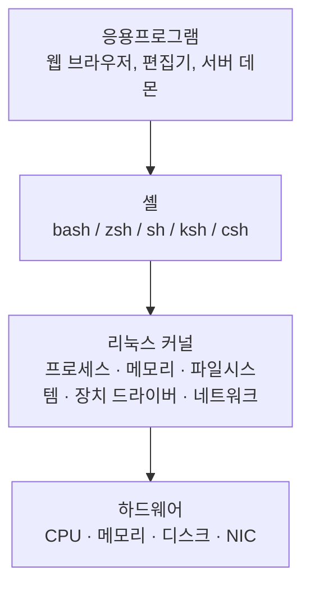

<Callout type="info">
  **이번 문서의 목표:** 리눅스의 계층 구조(하드웨어 → 커널 → 셸 → 응용프로그램)와 배포판 계열을 구분하고, 커널 및 배포판 정보를 확인하는 명령어를 익힌다.
</Callout>

## 리눅스 아키텍처 계층 구조

리눅스는 아래 4개 계층으로 구성된다. 상위 계층은 하위 계층의 서비스를 호출하며, 사용자는 셸을 통해 커널에 간접적으로 접근한다.



## 커널(Kernel)

커널은 하드웨어와 소프트웨어 사이의 핵심 중간자다. 사용자 공간(User Space)과 커널 공간(Kernel Space)을 분리하여 시스템 안정성을 보장한다.

| 기능 | 설명 |
|------|------|
| 프로세스 관리 | 프로세스 생성(fork), 스케줄링, 종료 |
| 메모리 관리 | 가상 메모리, 페이징, 스왑 |
| 파일시스템 | ext4, xfs, btrfs 등의 파일 I/O 추상화 |
| 장치 드라이버 | 하드웨어 장치를 파일처럼 접근 |
| 네트워크 스택 | TCP/IP, 소켓 인터페이스 |

## 셸(Shell)

셸은 사용자의 명령을 해석하여 커널에 전달하는 **명령 해석기(Command Interpreter)**다.

| 셸 | 특징 |
|----|------|
| bash | Bourne Again Shell. 리눅스 기본 셸, 스크립트 호환성 우수 |
| zsh | bash 확장판. 자동완성, 플러그인 지원 강력 |
| sh | 최초의 Bourne Shell. POSIX 표준 |
| ksh | Korn Shell. 유닉스 환경에서 많이 사용 |
| csh / tcsh | C 문법 기반 셸 |

### 터미널 vs 셸

- **터미널(Terminal):** 입출력을 처리하는 인터페이스. 물리적 단말기, 터미널 에뮬레이터(gnome-terminal, iTerm2), 가상 콘솔(tty) 등
- **셸(Shell):** 터미널 안에서 실행되는 **명령 해석 프로그램**. 터미널이 없으면 셸도 입력을 받을 수 없다.

현재 사용 중인 셸 확인:

```bash
echo $SHELL
# 출력 예시
/bin/bash

cat /etc/shells
# 출력 예시
/bin/sh
/bin/bash
/usr/bin/bash
/bin/zsh
/usr/bin/zsh
```

## 배포판(Distribution)

리눅스 배포판은 커널 + 패키지 관리자 + 기본 도구의 조합이다. 크게 3개 계열로 나뉜다.

### Red Hat 계열

패키지 형식: **RPM(.rpm)**, 패키지 관리: **YUM / DNF**

| 배포판 | 특징 |
|--------|------|
| RHEL | Red Hat Enterprise Linux. 유료 기업용 |
| CentOS | RHEL 무료 클론. CentOS 8 이후 Stream으로 전환 |
| Fedora | Red Hat 실험적 최신 기능 배포판 |
| Rocky Linux | CentOS 대체를 목적으로 만든 RHEL 클론 |
| AlmaLinux | CentOS 대체, CloudLinux가 지원 |

### Debian 계열

패키지 형식: **DEB(.deb)**, 패키지 관리: **APT**

| 배포판 | 특징 |
|--------|------|
| Debian | 안정성 중심. 장기 지원 사이클 |
| Ubuntu | Debian 기반 가장 널리 쓰이는 배포판 |
| Linux Mint | Ubuntu 기반. 데스크탑 친화적 |

### Slackware 계열

- 가장 오래된 배포판 계열 중 하나
- 자동 의존성 해결 없음, 직접 패키지 관리
- SUSE Linux는 Slackware에서 독립 발전

## 커널 버전 확인 명령어

```bash
# 커널 버전만 확인
uname -r
# 출력 예시
5.15.0-91-generic

# 전체 시스템 정보 확인
uname -a
# 출력 예시
Linux hostname 5.15.0-91-generic #101-Ubuntu SMP Tue Nov 14 13:30:08 UTC 2023 x86_64 x86_64 x86_64 GNU/Linux
```

`uname -a` 출력 필드 해석:
1. 운영체제 이름 (Linux)
2. 호스트명
3. 커널 버전
4. 커널 빌드 정보
5. 빌드 날짜
6. 하드웨어 아키텍처 (x86_64)

## 배포판 정보 확인

```bash
# 표준 배포판 정보 파일 (대부분의 배포판 지원)
cat /etc/os-release
# 출력 예시 (Ubuntu)
NAME="Ubuntu"
VERSION="22.04.3 LTS (Jammy Jellyfish)"
ID=ubuntu
ID_LIKE=debian
PRETTY_NAME="Ubuntu 22.04.3 LTS"
VERSION_ID="22.04"

# Red Hat 계열 전용 파일
cat /etc/redhat-release
# 출력 예시 (Rocky Linux)
Rocky Linux release 9.3 (Blue Onyx)

# 로그인 사용자 확인
whoami
# 출력 예시
root

# 현재 로그인된 사용자 목록
who
# 출력 예시
zenok    pts/0        2024-01-15 09:30 (192.168.1.10)
```

## 핵심 정리

- 리눅스 계층: 하드웨어 → 커널 → 셸 → 응용프로그램 (상위가 하위를 호출)
- 커널은 프로세스·메모리·파일시스템·장치·네트워크를 관리
- 셸은 명령 해석기이며, 터미널은 셸을 실행하는 입출력 인터페이스
- Red Hat 계열: RPM/YUM, RHEL·CentOS·Fedora·Rocky Linux
- Debian 계열: DEB/APT, Debian·Ubuntu
- `uname -r`: 커널 버전, `uname -a`: 전체 시스템 정보
- `cat /etc/os-release`: 배포판 정보 확인

## 마무리 복습

<Quiz
  questionNumber={1}
  question="리눅스 커널의 주요 기능이 아닌 것은?"
  options={['프로세스 관리', '메모리 관리', 'HTML 렌더링', '장치 드라이버 관리']}
  correctAnswer={3}
  explanation="HTML 렌더링은 웹 브라우저(응용프로그램)가 수행하는 작업이며, 커널의 역할이 아닙니다."
  optionExplanations={['커널은 프로세스 생성(fork), 스케줄링, 종료를 관리합니다.', '커널은 가상 메모리, 페이징, 스왑을 관리합니다.', '맞습니다. HTML 렌더링은 응용프로그램 계층의 역할입니다.', '커널은 하드웨어 장치를 파일처럼 추상화하여 관리합니다.']}
/>

<Quiz
  questionNumber={2}
  question="Red Hat 계열 리눅스 배포판이 아닌 것은?"
  options={['CentOS', 'Rocky Linux', 'Ubuntu', 'Fedora']}
  correctAnswer={3}
  explanation="Ubuntu는 Debian 계열 배포판입니다. CentOS, Rocky Linux, Fedora는 모두 Red Hat 계열입니다."
  optionExplanations={['CentOS는 RHEL의 무료 클론으로 Red Hat 계열입니다.', 'Rocky Linux는 CentOS 대체를 목적으로 만든 RHEL 클론입니다.', '맞습니다. Ubuntu는 Debian 기반의 배포판입니다.', 'Fedora는 Red Hat이 후원하는 실험적 배포판입니다.']}
/>

<Quiz
  questionNumber={3}
  question="현재 시스템의 커널 버전만 확인하는 명령어는?"
  options={['uname -a', 'uname -r', 'cat /etc/os-release', 'cat /etc/redhat-release']}
  correctAnswer={2}
  explanation="uname -r은 커널 버전(릴리스)만 출력합니다. uname -a는 전체 시스템 정보를 출력합니다."
  optionExplanations={['uname -a는 커널 버전 외에도 호스트명, 아키텍처 등 전체 정보를 출력합니다.', '맞습니다. uname -r은 커널 릴리스 버전만 출력합니다.', 'cat /etc/os-release는 배포판 이름과 버전을 확인하는 파일입니다.', 'cat /etc/redhat-release는 Red Hat 계열 배포판 전용 정보 파일입니다.']}
/>

## 참고 자료

- [KAIT 리눅스마스터 안내](https://kait.or.kr/user/MainMenuList.do?cateSeq=5&menuSeq=119)
- [Linux man-pages project](https://man7.org/linux/man-pages/)
- [GNU Bash Reference Manual](https://www.gnu.org/software/bash/manual/)
