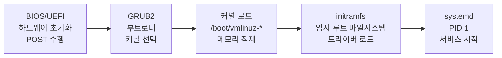

<Callout type="info">
  **이번 문서의 목표:** 리눅스 부팅 과정을 단계별로 이해하고, GRUB2 설정 파일을 편집하며, 시스템 복구 모드에서 루트 비밀번호를 재설정하는 방법을 익힙니다.
</Callout>

## 부팅 5단계 과정

리눅스의 부팅은 다음 5단계로 진행됩니다.

```
BIOS/UEFI → GRUB2 → 커널 로드 → initramfs → systemd(PID 1)
```



| 단계 | 역할 |
|---|---|
| BIOS/UEFI | 하드웨어 초기화, POST(Power-On Self Test), 부트 장치 탐색 |
| GRUB2 | 부트로더, 커널 이미지와 initramfs를 메모리에 로드 |
| 커널 로드 | `/boot/vmlinuz-*` 커널 이미지 실행, 하드웨어 감지 |
| initramfs | 임시 루트 파일시스템, 실제 루트 마운트에 필요한 드라이버 제공 |
| systemd | PID 1로 실행, 타깃에 따라 서비스 순차 시작 |

## GRUB2 설정

GRUB2(GRand Unified Bootloader 2)는 현재 리눅스 표준 부트로더입니다.

### 설정 파일 구조

```bash
/etc/default/grub          # 주요 설정 파일 (편집 대상)
/etc/grub.d/               # 메뉴 항목 생성 스크립트
/boot/grub2/grub.cfg       # 최종 생성된 설정 파일 (RHEL/CentOS)
/boot/grub/grub.cfg        # 최종 생성된 설정 파일 (Debian/Ubuntu)
```

### /etc/default/grub 주요 설정

```bash
cat /etc/default/grub

GRUB_TIMEOUT=5                        # 메뉴 표시 시간 (초), 0이면 바로 부팅
GRUB_TIMEOUT_STYLE=menu               # menu: 항상 표시, countdown: 카운트다운
GRUB_DEFAULT=0                        # 기본 부팅 항목 (0부터 시작)
GRUB_CMDLINE_LINUX="quiet rhgb"       # 커널에 전달할 파라미터
GRUB_CMDLINE_LINUX_DEFAULT="quiet"    # 기본 커널 파라미터 (Debian)
GRUB_DISABLE_RECOVERY=false           # 복구 항목 표시 여부
```

### GRUB 설정 적용

설정 파일을 편집한 후 반드시 grub.cfg를 재생성해야 합니다.

```bash
# RHEL/CentOS/Rocky Linux
grub2-mkconfig -o /boot/grub2/grub.cfg

# UEFI 시스템 (RHEL)
grub2-mkconfig -o /boot/efi/EFI/redhat/grub.cfg

# Debian/Ubuntu
update-grub
# 또는
grub-mkconfig -o /boot/grub/grub.cfg
```

## GRUB 메뉴 편집 (부팅 중)

부팅 시 GRUB 메뉴가 표시될 때 단축키로 편집 모드에 진입할 수 있습니다.

| 키 | 동작 |
|---|---|
| `e` | 선택한 항목 편집 |
| `c` | GRUB 명령줄 모드 진입 |
| `Ctrl+X` | 편집 후 부팅 실행 |
| `Esc` | 편집 취소, 메뉴로 복귀 |

## 싱글 유저 모드와 루트 비밀번호 재설정

루트 비밀번호를 잊어버렸을 때 복구하는 절차입니다.

### 방법 1: init=/bin/bash 사용

```bash
# 1. 부팅 시 GRUB 메뉴에서 e 키를 눌러 편집 모드 진입
# 2. linux 또는 linuxefi로 시작하는 줄 끝에 추가:
#    init=/bin/bash rd.break
# 예:
#    linux /boot/vmlinuz-5.14.0 root=/dev/sda1 ro quiet init=/bin/bash

# 3. Ctrl+X로 부팅

# 4. 루트 파일시스템을 읽기/쓰기로 재마운트
mount -o remount,rw /

# 5. 루트 비밀번호 변경
passwd root

# 6. SELinux 레이블 재설정 (SELinux 사용 시 필수)
touch /.autorelabel

# 7. 재부팅
exec /sbin/init
# 또는
reboot -f
```

### 방법 2: rd.break 사용 (RHEL 계열 권장)

```bash
# 1. GRUB 편집 모드에서 linux 줄에 rd.break 추가
# linux /boot/vmlinuz... ro quiet rd.break

# 2. Ctrl+X로 부팅 → initramfs 쉘 진입

# 3. 실제 루트를 /sysroot에 읽기/쓰기로 마운트
mount -o remount,rw /sysroot

# 4. chroot로 실제 루트로 전환
chroot /sysroot

# 5. 비밀번호 변경
passwd root

# 6. SELinux 레이블 재설정
touch /.autorelabel

# 7. chroot 탈출 후 재부팅
exit
exit
```

### 파일시스템 읽기/쓰기 재마운트

```bash
# 읽기 전용으로 마운트된 루트를 읽기/쓰기로 전환
mount -o remount,rw /

# 특정 파티션 재마운트
mount -o remount,rw /dev/sda1 /
```

## initramfs 재생성

커널 업데이트 또는 드라이버 추가 후 initramfs를 재생성해야 할 수 있습니다.

```bash
# RHEL/CentOS/Rocky Linux — dracut 사용
dracut -f                              # 현재 커널용 강제 재생성
dracut -f /boot/initramfs-$(uname -r).img $(uname -r)  # 특정 버전 지정

# Debian/Ubuntu — update-initramfs 사용
update-initramfs -u                   # 현재 커널용 업데이트
update-initramfs -u -k all            # 모든 커널 업데이트
update-initramfs -c -k $(uname -r)   # 새로 생성
```

## 파일시스템 검사와 복구

```bash
# fsck는 반드시 언마운트된 상태에서 실행해야 합니다
umount /dev/sda1

# 파일시스템 검사 (자동 수정)
fsck /dev/sda1
fsck -y /dev/sda1    # 모든 질문에 자동으로 yes 응답
fsck -n /dev/sda1    # 수정 없이 검사만 (dry-run)

# ext4 전용 검사
e2fsck -f /dev/sda1   # 강제 검사
e2fsck -p /dev/sda1   # 자동 수정 모드

# XFS 파일시스템
xfs_repair /dev/sda1
xfs_check /dev/sda1   # 검사만 (구버전)
```

<Callout type="warning">
  **fsck 주의사항:** 마운트된 파일시스템에서 fsck를 실행하면 데이터 손상이 발생할 수 있습니다. 루트 파티션 검사는 싱글 유저 모드 또는 라이브 미디어에서 실행하세요.
</Callout>

## systemd 타깃과 런레벨

```bash
# 현재 타깃 확인
systemctl get-default

# 타깃 변경 (런레벨 변경)
systemctl set-default multi-user.target   # 런레벨 3 (텍스트 모드)
systemctl set-default graphical.target    # 런레벨 5 (GUI 모드)

# 즉시 타깃 전환 (재부팅 불필요)
systemctl isolate rescue.target           # 싱글 유저 모드

# 런레벨과 타깃 대응
# 런레벨 0 = poweroff.target
# 런레벨 1 = rescue.target
# 런레벨 3 = multi-user.target
# 런레벨 5 = graphical.target
# 런레벨 6 = reboot.target
```

## 핵심 정리

- 부팅 5단계: **BIOS/UEFI → GRUB2 → 커널 로드(`/boot/vmlinuz-*`) → initramfs → systemd(PID 1)**
- GRUB2 설정 파일: `/etc/default/grub` (편집), `grub2-mkconfig -o /boot/grub2/grub.cfg` (적용)
- GRUB 메뉴에서 `e`키로 편집, `Ctrl+X`로 부팅
- 루트 비밀번호 재설정: linux 줄에 `init=/bin/bash` 또는 `rd.break` 추가
- 루트 파일시스템 읽기/쓰기 재마운트: `mount -o remount,rw /`
- initramfs 재생성: RHEL은 `dracut -f`, Debian은 `update-initramfs -u`
- 파일시스템 검사: `fsck /dev/sda1` — **반드시 언마운트 상태에서 실행**

## 마무리 복습

<Quiz
  questionNumber={1}
  question="리눅스 부팅 과정에서 systemd가 실행되기 직전 단계는?"
  options={['BIOS/UEFI', 'GRUB2', '커널 로드', 'initramfs']}
  correctAnswer={4}
  explanation="부팅 순서는 BIOS/UEFI → GRUB2 → 커널 로드 → initramfs → systemd(PID 1) 입니다. initramfs는 실제 루트 파일시스템 마운트에 필요한 드라이버를 제공하는 임시 파일시스템으로, 이후 systemd가 PID 1로 실행됩니다."
  optionExplanations={['BIOS/UEFI는 부팅의 가장 첫 단계입니다.', 'GRUB2는 부트로더로 두 번째 단계입니다.', '커널 로드는 세 번째 단계입니다.', '맞습니다. initramfs가 끝난 후 systemd가 시작됩니다.']}
/>

<Quiz
  questionNumber={2}
  question="GRUB2 설정 파일 /etc/default/grub을 편집한 후 변경 내용을 적용하는 명령은? (RHEL 기준)"
  options={['grub2-install /dev/sda', 'grub2-mkconfig -o /boot/grub2/grub.cfg', 'systemctl restart grub2', 'grub2-update']}
  correctAnswer={2}
  explanation="RHEL/CentOS 계열에서는 /etc/default/grub을 편집한 후 grub2-mkconfig -o /boot/grub2/grub.cfg 명령으로 최종 설정 파일을 재생성해야 변경 내용이 반영됩니다."
  optionExplanations={['grub2-install은 MBR에 GRUB을 설치하는 명령입니다.', '맞습니다. grub2-mkconfig로 grub.cfg를 재생성합니다.', 'GRUB2는 systemctl로 재시작하지 않습니다.', 'grub2-update 명령은 존재하지 않습니다.']}
/>

<Quiz
  questionNumber={3}
  question="루트 비밀번호 재설정을 위해 GRUB 편집 모드에서 linux 줄에 추가하는 파라미터는?"
  options={['single', 'init=/bin/bash', 'rescue', '위 항목 중 둘 다 사용 가능']}
  correctAnswer={4}
  explanation="루트 비밀번호 재설정 시 GRUB 편집 모드에서 linux 줄에 'init=/bin/bash' 또는 'rd.break'를 추가하는 방법 모두 사용 가능합니다. 진입 후 mount -o remount,rw /로 루트를 읽기/쓰기로 재마운트한 뒤 passwd root로 비밀번호를 변경합니다."
  optionExplanations={['single만으로는 비밀번호 없이 루트 쉘에 진입하지 못할 수 있습니다.', 'init=/bin/bash는 유효한 방법입니다.', 'rescue는 타깃 이름이지 GRUB 파라미터가 아닙니다.', '맞습니다. init=/bin/bash와 rd.break 모두 사용 가능합니다.']}
/>

## 참고 자료

- [KAIT 리눅스마스터 안내](https://kait.or.kr/user/MainMenuList.do?cateSeq=5&menuSeq=119)
- [Linux man-pages project](https://man7.org/linux/man-pages/)
