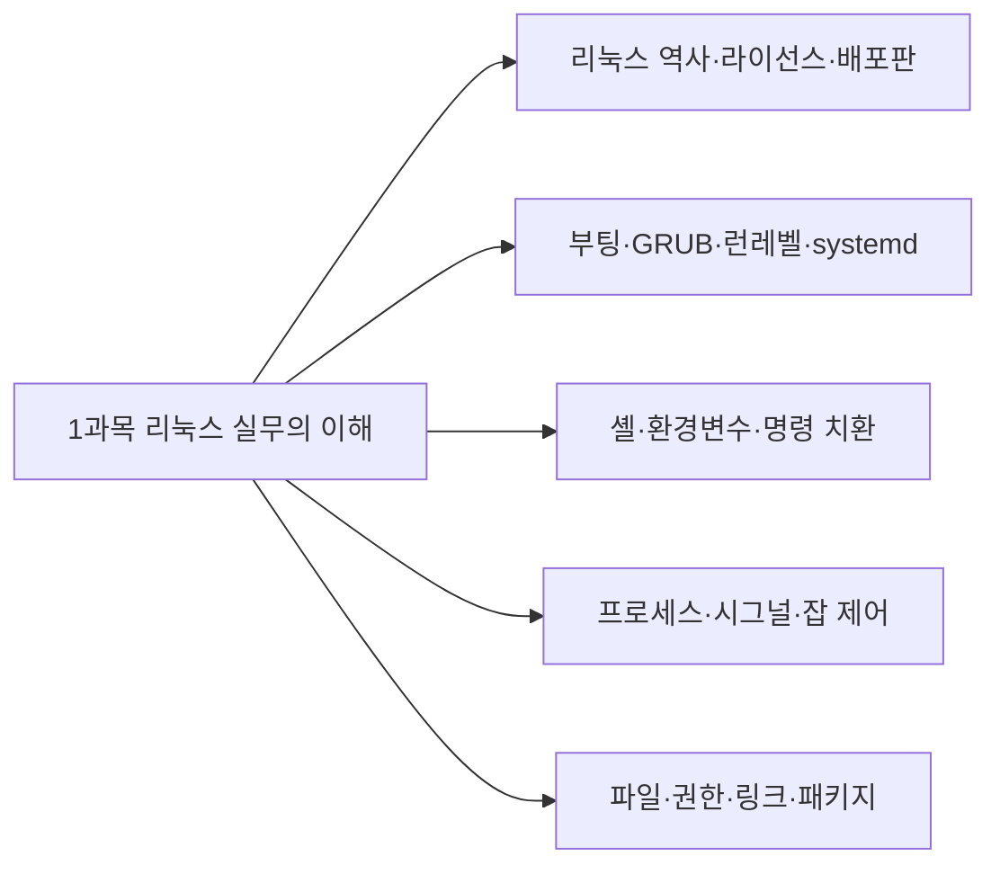
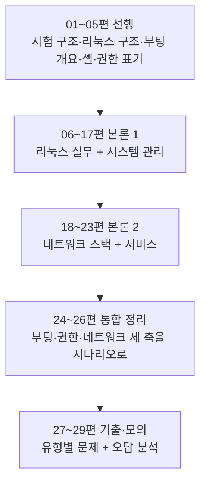

<Callout type="info">
  **이번 문서의 목표:** 이 파일을 다 읽으면 리눅스마스터 1급 1차가 "무엇을, 어떤 문장 형식으로, 몇 문제씩" 묻는 시험인지 설명할 수 있고, 어느 과목에 몇 시간을 쓸지 스스로 배분할 수 있게 된다.
</Callout>

## 왜 시험 구조부터 보는가

리눅스 공부를 먼저 시작하고 시험 정보를 나중에 찾는 사람이 많습니다. 그런데 이 시험은 **범위가 넓고, 문항당 배점이 균등하며, 과목별 과락이 있는** 구조입니다. 이 세 가지 성질이 합쳐지면 "좋아하는 영역만 깊게 파는 전략"이 곧바로 불합격으로 이어집니다.

> **쉽게 말하면:** 이 시험은 한 과목을 100점 받아도 다른 과목이 39점이면 떨어지는 시험입니다. 그래서 공부 순서보다 **공부 배분**이 먼저입니다.

그리고 더 중요한 이유가 하나 더 있습니다. 리눅스마스터 1급 1차는 **문제 문장의 형식이 매우 정형화되어 있습니다.** 뒤에서 자세히 뜯어보겠지만, 대부분의 문항이 다음 네 가지 틀 안에 들어옵니다.

1. `다음 ( 괄호 ) 안에 들어갈 내용으로 알맞은 것은?` — 괄호 채우기
2. `다음 설명에 해당하는 ○○으로 알맞은 것은?` — 설명을 주고 용어를 고르기
3. `다음 결과에 해당하는 명령어로 알맞은 것은?` — 터미널 출력 화면을 보고 명령을 역추적
4. `다음 중 ○○에 대한 설명으로 틀린 것은?` — 넷 중 하나만 거짓인 진위 판별

이 형식을 미리 알면, 개념을 읽을 때 **"이건 괄호로 뚫리겠다"**, **"이건 비슷한 명령과 짝지어 나오겠다"** 하는 감각이 생깁니다. 이 문서 이후의 모든 편은 그 감각을 전제로 쓰였습니다.

## 1. 시험의 기본 골격

리눅스마스터는 **KAIT**(Korea Association for ICT Promotion, 한국정보통신진흥협회)가 시행하는 국가공인 민간자격입니다. 1급은 **1차 필기**와 **2차 실기**로 나뉘며, 1차에 합격해야 2차에 응시할 수 있습니다. 이 과목이 다루는 것은 그중 **1차 필기**입니다.

| 항목 | 내용 |
|------|------|
| 문항 형식 | 4지선다 객관식 |
| 문항 수 | 100문항 |
| 시험 시간 | 100분 |
| 총점 | 100점 (문항당 1점) |
| 합격 기준 | 전 과목 평균 60점 이상 |
| 과락 기준 | 한 과목이라도 만점의 40퍼센트 미만이면 불합격 |

여기서 반드시 붙잡아야 할 숫자는 **100문항 / 100분**입니다. 한 문항에 쓸 수 있는 시간이 평균 **60초**라는 뜻입니다. 계산 문제(서브넷 계산, umask 계산, RAID 용량 계산)는 60초로 부족하므로, 나머지 단순 암기·용어 문항을 20~30초 안에 끊어야 시간이 남습니다. 이 시간 감각은 뒤쪽 모의고사 편에서 다시 훈련합니다.

### 과락이 실제로 어떻게 작동하는가

과락은 "평균은 넘겼는데 한 과목이 무너져 떨어지는" 상황을 만듭니다. 숫자로 확인해 봅시다. 세 과목이 각각 몇 문항인지는 회차마다 조금씩 조정되지만, 실제 기출 기준으로 다음과 같은 비중이 유지됩니다.

| 과목 | 영역명 | 대략 문항 수 |
|------|--------|--------------|
| 1과목 | 리눅스 실무의 이해 | 40문항 |
| 2과목 | 리눅스 시스템 관리 | 20문항 |
| 3과목 | 네트워크 및 서비스 활용 | 40문항 |

<DataBarChart
  title="과목별 문항 수 비중"
  data={[
    { label: '1과목 리눅스 실무의 이해', value: 40 },
    { label: '2과목 리눅스 시스템 관리', value: 20 },
    { label: '3과목 네트워크 및 서비스 활용', value: 40 },
  ]}
/>

2과목은 20문항이므로 **40퍼센트 과락선이 8문항**입니다. 즉 2과목에서 7개 이하로 맞으면, 1·3과목을 아무리 잘 봐도 그 자리에서 불합격입니다. 2과목은 커널 컴파일·모듈·RAID·LVM·로그·백업처럼 "손에 익지 않으면 전부 낯선" 주제가 몰려 있어서 실제로 과락이 가장 자주 발생하는 과목입니다.

> **쉽게 말하면:** 문항 수가 적은 과목일수록 과락선까지의 여유가 좁습니다. 20문항짜리 과목에서 8개는 생각보다 빨리 무너집니다.

## 2. 과목별로 무엇을 묻는가

### 1과목 — 리눅스 실무의 이해

리눅스라는 운영체제 자체를 다룹니다. 실제 기출에서 이 과목의 문항은 크게 다섯 덩어리로 나뉩니다.



- **역사와 라이선스** — 리누스 토발즈(Linus Torvalds), 리처드 스톨먼(Richard Stallman), 앤드루 타넨바움(Andrew S. Tanenbaum)과 미닉스(MINIX), GPL·LGPL·BSD·Apache License·MPL의 공개 의무 차이. 인물과 라이선스를 짝짓는 문제가 거의 매 회차 출제됩니다.
- **부팅과 시스템 상태** — GRUB의 커널 인자, `init=/bin/sh`로 root 패스워드 복구, 런레벨과 systemd 타깃 매핑.
- **셸** — 백틱(`` ` ``)을 이용한 명령 치환, 종료 상태값 `$?`, 리다이렉션과 파이프의 차이.
- **프로세스** — `fork`와 `exec`의 차이, 시그널 번호(SIGINT 2, SIGQUIT 3, SIGKILL 9, SIGSTOP 19), `jobs`·`fg`·`bg`, `nice`와 `renice`.
- **파일과 패키지** — 하드 링크와 심볼릭 링크, `touch`가 바꿀 수 있는 시각과 바꿀 수 없는 시각, `rpm` 질의 옵션, `ldd`.

### 2과목 — 리눅스 시스템 관리

서버를 실제로 운영·관리하는 관점의 주제입니다. 문항 수는 가장 적지만 난도는 가장 높습니다.

- **커널 모듈** — `insmod`·`rmmod`·`modprobe`·`depmod`의 역할 구분. 특히 "의존성까지 처리하는가"가 정답을 가릅니다.
- **커널 컴파일 순서** — `make mrproper` → `make menuconfig` → `make bzImage`.
- **디스크와 RAID** — fdisk 파티션 타입 코드(82 swap, 83 Linux, 8e LVM, fd RAID), `mdadm` 옵션, `/proc/mdstat`, LVM의 `pvscan`·`vgscan`·`lvscan`.
- **로그** — rsyslog의 facility와 priority, `/var/log` 아래 텍스트 로그와 바이너리 로그의 구분, `logger`.
- **백업** — 전체·증분·차등 백업, `tar` 옵션, `dump`가 XFS에서 못 쓰인다는 사실.

### 3과목 — 네트워크 및 서비스 활용

네트워크 이론과 서버 서비스가 절반씩입니다.

- **네트워크 기초** — OSI 7계층과 계층별 PDU(Protocol Data Unit) 이름, 서브넷 계산, 표준화 기구(IEEE·ISO·IANA·ICANN).
- **네트워크 명령** — `arp`, `ss`, `netstat`, `ethtool`, `mii-tool`의 용도 구분.
- **서버 서비스** — Apache의 `DocumentRoot`, vsftpd의 `local_enable`, NFS의 `root_squash`와 `all_squash`, Samba의 `path`, BIND의 `forwarders`와 PTR 레코드, Sendmail의 `/etc/mail/access`와 `/etc/aliases`.
- **보안과 가상화** — iptables 체인과 기본 정책 문법, nftables, TCP Wrapper와 `libwrap.so`, SYN Flooding과 `SYN_RECV`, KVM·XEN·Docker·Kubernetes.

## 3. 기출 문장의 네 가지 형식 — 이 시험의 진짜 정체

개념을 아는 것과 문제를 맞히는 것은 다릅니다. 왜 다른지는 실제 출제 형식을 뜯어보면 바로 보입니다.

### 형식 A — 괄호 채우기

가장 많이 나오는 형식입니다. 문장이나 명령 한 줄에서 핵심 단어 하나를 뚫어 놓습니다.

```bash
# ( 괄호 ) -r iptable_filter
```

보기는 `insmod`, `depmod`, `rmmod`, `modprobe`가 나옵니다. 여기서 `rmmod`도 모듈을 제거하지만, **의존 모듈까지 함께 제거하는** `modprobe -r`가 정답입니다. 즉 이 형식은 "그 명령을 아는가"가 아니라 **"비슷한 명령 넷 중 이 상황에 맞는 하나를 고를 수 있는가"** 를 묻습니다.

> **쉽게 말하면:** 괄호 채우기는 암기 문제처럼 보이지만, 실제로는 "비슷한 것들 사이의 차이"를 묻는 비교 문제입니다.

이 형식에 대비하려면 명령을 하나씩 외우는 게 아니라 **비슷한 것끼리 표로 묶어** 두어야 합니다. 이 과목의 모든 편이 명령을 비교표로 정리하는 이유가 여기 있습니다.

### 형식 B — 설명 → 용어 매칭

문장으로 개념을 서술하고 이름을 고르게 합니다.

> 하나의 프로세스가 다른 프로세스를 실행할 때 사용하는 시스템 호출 방법의 하나로서, 새롭게 생성된 프로세스는 호출한 프로세스의 자식 프로세스가 된다.

정답은 `fork`입니다. 핵심 단서는 "자식 프로세스가 된다"입니다. `exec`는 자식을 만들지 않고 **현재 프로세스의 메모리 이미지를 새 프로그램으로 덮어씁니다.** 이 형식은 **정의 문장 안에 결정적 단서 한 조각**이 반드시 박혀 있습니다. 개념을 공부할 때 "이 개념만이 가진 유일한 특징 한 문장"을 만들어 두면 그대로 답이 됩니다.

### 형식 C — 출력 화면 역추적

터미널 출력을 던져 주고 어떤 명령의 결과인지 고르게 합니다.

```
 22:42:18 up 9:01,  3 users,  load average: 0.00, 0.03, 0.05
USER     TTY      FROM             LOGIN@   IDLE   JCPU   PCPU WHAT
root     :0       :0               Mon21   7xdm?  1:19   0.20s /usr/libexec/gn
```

정답은 `w`입니다. 판별 단서는 **`load average` 줄과 `WHAT` 컬럼**입니다. `who`는 부하 평균도 WHAT 컬럼도 보여주지 않고, `users`는 이름만 한 줄로 나열합니다. 이 형식에 대비하려면 주요 명령의 **출력 헤더 한 줄**을 눈에 익혀 두어야 합니다. 그래서 이 과목은 명령을 설명할 때 실제 출력 예시를 함께 싣습니다.

### 형식 D — 틀린 것 고르기

넷 중 셋이 참, 하나가 거짓입니다. `touch` 문제가 대표적입니다. `touch`는 접근 시각(atime)과 수정 시각(mtime)은 바꿀 수 있지만 **변경 시각(ctime)은 커널이 자동으로만 갱신**하므로 사용자가 지정할 수 없습니다. 이 형식은 개념의 **경계**를 묻습니다. "할 수 있는 것"만 외우고 "할 수 없는 것"을 안 외우면 반드시 틀립니다.

### 네 형식을 한 장으로

| 형식 | 문항 문장 신호 | 진짜로 묻는 것 | 대비법 |
|------|----------------|-----------------|--------|
| A 괄호 채우기 | `( 괄호 ) 안에 들어갈` | 유사 명령·옵션 간의 차이 | 비교표로 묶어 암기 |
| B 설명 매칭 | `다음 설명에 해당하는` | 그 개념만의 결정적 특징 | 개념마다 한 줄 정의 |
| C 출력 역추적 | `다음 결과에 해당하는` | 출력 형태 인지 | 헤더·컬럼 눈에 익히기 |
| D 틀린 것 | `설명으로 틀린 것은` | 개념의 경계와 예외 | 못 하는 것도 함께 정리 |

## 4. 난이도 분포와 시간 배분 전략

기출 100문항을 체감 난도로 나누면 대략 이런 비율입니다.

<DataBarChart
  title="체감 난이도별 문항 분포 (기출 기준 추정)"
  data={[
    { label: '즉답 가능 (용어·기본 명령)', value: 45 },
    { label: '비교 필요 (유사 명령·옵션 구분)', value: 35 },
    { label: '계산·심화 (서브넷·umask·RAID·시나리오)', value: 20 },
  ]}
/>

합격선은 평균 60점입니다. 즉답 45문항을 모두 맞히고 비교 문항 35개 중 절반만 건져도 62점입니다. **계산·심화 20문항을 전부 버려도 합격이 가능한 구조**라는 뜻입니다. 그러나 과락 때문에 그 20문항이 특정 과목에 몰려 있으면 곤란해집니다.

그래서 권장 전략은 다음과 같습니다.

<Steps>
1. **2과목을 가장 먼저, 가장 오래 본다.** 문항 수가 적어 과락 위험이 가장 크고, 주제가 낯설어 학습 곡선이 가파릅니다.
2. **1과목은 암기 밀도로 승부한다.** 인물·라이선스·시그널 번호·rpm 옵션처럼 외우면 그대로 점수가 되는 항목이 많습니다.
3. **3과목은 설정 파일 위치와 지시자 이름에 집중한다.** 서비스 하나당 "설정 파일 경로 + 핵심 지시자 2~3개 + 기본 포트"만 잡아도 대부분 맞습니다.
4. **계산 문항은 마지막에 몰아서 푼다.** 시험장에서 서브넷 계산이 막히면 표시하고 넘어간 뒤, 남는 시간에 돌아옵니다.
5. **모의고사는 반드시 100분 타이머를 켜고 푼다.** 문항당 60초 감각이 없으면 아는 문제를 못 풀고 끝납니다.
</Steps>

### 자주 틀리는 점

- **"평균 60점이면 되니까 한 과목 버리자"** — 과락 때문에 성립하지 않는 전략입니다. 특히 20문항짜리 2과목은 절대 버릴 수 없습니다.
- **명령을 하나씩 외우기** — 기출은 항상 유사 명령 넷을 나란히 놓습니다. `insmod`만 외우면 `modprobe`가 답인 문제를 틀립니다.
- **설정 파일 내용만 외우고 경로를 안 외우기** — 3과목은 "이 설정을 확인할 수 있는 파일은?" 형태로 **경로 자체**를 묻는 문항이 많습니다.
- **최신 배포판 기준으로만 공부하기** — 이 시험은 여전히 CentOS 7 계열, SysV init, `ifconfig`, `iptables`, Sendmail 같은 전통 도구를 함께 출제합니다. 신구 도구를 **대비표로** 잡아야 합니다.

## 5. 이 과목을 어떻게 읽을 것인가

이 사이트의 리눅스마스터 1급 1차 과목은 29편으로 구성되어 있습니다. 큰 흐름은 다음과 같습니다.



선행 5편(01~05)은 **지도**입니다. 여기서는 각 주제를 얕게 훑고, 본론에서 같은 주제를 훨씬 깊게 다시 팝니다. 예를 들어 부팅은 03편에서 "큰 흐름"만 보고, 10편에서 런레벨과 systemd 타깃을 비트 단위로 비교합니다. 권한도 05편에서 표기법만 익히고, 11편에서 umask 계산과 ACL 상속까지 파고듭니다. **같은 주제가 두 번 나오는 것은 중복이 아니라 설계**입니다.

## 핵심 정리

- 리눅스마스터 1급 1차는 4지선다 **100문항 100분**, 평균 60점 이상 합격, 한 과목이라도 **40퍼센트 미만이면 과락**입니다.
- 과목 비중은 1과목(리눅스 실무) 40문항, 2과목(시스템 관리) 20문항, 3과목(네트워크·서비스) 40문항이며, **문항이 적은 2과목의 과락 위험이 가장 큽니다.**
- 기출 문장은 괄호 채우기, 설명 매칭, 출력 역추적, 틀린 것 고르기의 **네 형식**으로 수렴하며, 모두 "유사한 것들 사이의 차이"를 묻습니다.
- 명령은 하나씩 외우지 말고 **비교표로 묶어** 익히고, 명령의 **출력 헤더**를 눈에 익혀야 합니다.
- 합격선 자체는 즉답·비교 문항만으로 도달 가능하므로, 계산 문항보다 **과락 방지와 시간 관리**가 우선입니다.

## 마무리 복습

<Quiz
  questionNumber={1}
  question="다음 ( 괄호 ) 안에 들어갈 내용으로 알맞은 것은? 리눅스마스터 1급 1차 필기는 4지선다 ( ㉠ )문항을 ( ㉡ )분 동안 치르며, 전 과목 평균 60점 이상이어야 합격한다."
  options={['㉠ 50, ㉡ 50', '㉠ 100, ㉡ 100', '㉠ 100, ㉡ 60', '㉠ 80, ㉡ 100']}
  correctAnswer={2}
  explanation="1급 1차 필기는 100문항을 100분 동안 푸는 구성으로, 문항당 평균 1분이 주어진다. 총점 100점 기준 평균 60점 이상이 합격선이다."
  optionExplanations={['50문항 50분은 2급 필기 등 다른 구성과 혼동한 것이다', '정답 — 100문항 100분이며 문항당 평균 60초가 배정된다', '문항 수는 맞지만 시험 시간이 100분이 아니라 60분으로 잘못되었다', '문항 수가 100문항이 아니라 80문항으로 잘못되었다']}
/>

<Quiz
  questionNumber={2}
  question="리눅스마스터 1급 1차의 과락 기준에 대한 설명으로 알맞은 것은?"
  options={['전 과목 평균이 60점 이상이면 개별 과목 점수는 보지 않는다', '한 과목이라도 만점의 40퍼센트 미만이면 평균과 무관하게 불합격이다', '한 과목이라도 만점의 60퍼센트 미만이면 불합격이다', '가장 낮은 과목 점수만으로 합격 여부를 결정한다']}
  correctAnswer={2}
  explanation="합격 조건은 평균 60점 이상이면서 동시에 어느 과목도 만점의 40퍼센트 미만이 아니어야 한다는 두 조건의 결합이다. 두 조건 중 하나라도 어기면 불합격이다."
  optionExplanations={['평균만 보는 것이 아니라 과목별 과락 조건이 함께 적용된다', '정답 — 평균 조건과 과락 조건을 동시에 만족해야 합격이다', '과락 기준은 40퍼센트이며 60퍼센트는 평균 합격선이다', '합격 판정은 평균과 과락 두 조건으로 하며 최저 과목 점수만 보지는 않는다']}
/>

<Quiz
  questionNumber={3}
  question="다음 설명에 해당하는 기출 문항 형식으로 알맞은 것은? 터미널에 출력된 결과 화면을 제시하고 그러한 결과를 만들어 낸 명령어를 보기에서 고르게 한다."
  options={['괄호 채우기형', '설명 용어 매칭형', '출력 화면 역추적형', '틀린 설명 고르기형']}
  correctAnswer={3}
  explanation="출력 화면을 제시하고 명령을 되짚게 하는 형식이 출력 역추적형이며, 명령의 출력 헤더와 컬럼 구성을 알아야 풀 수 있다."
  optionExplanations={['괄호 채우기는 명령이나 문장의 일부를 비워 두고 채우게 하는 형식이다', '설명 매칭형은 개념 서술을 주고 용어 이름을 고르게 한다', '정답 — load average 줄이나 컬럼 헤더 같은 출력 단서로 명령을 특정한다', '틀린 것 고르기는 네 설명 중 거짓인 하나를 찾는 형식이다']}
/>

<Quiz
  questionNumber={4}
  question="다음 중 과목별 문항 수와 과락선에 대한 설명으로 틀린 것은?"
  options={['1과목 리눅스 실무의 이해는 약 40문항이 출제된다', '2과목 리눅스 시스템 관리는 약 20문항이 출제된다', '2과목의 과락선은 8문항 수준이므로 과락 위험이 가장 크다', '3과목은 문항 수가 가장 적어 과락 위험이 가장 낮다']}
  correctAnswer={4}
  explanation="3과목 네트워크 및 서비스 활용은 약 40문항으로 문항 수가 가장 많은 축에 속한다. 문항 수가 가장 적은 과목은 2과목이며 그만큼 과락 여유가 좁다."
  optionExplanations={['1과목은 약 40문항으로 출제 비중이 큰 과목이 맞다', '2과목은 약 20문항으로 세 과목 중 가장 적다', '20문항의 40퍼센트는 8문항이므로 여유가 가장 좁다는 설명은 맞다', '정답(틀린 설명) — 3과목은 약 40문항으로 문항 수가 적지 않다']}
/>

<Quiz
  questionNumber={5}
  question="기출에서 유사 명령 네 개를 보기로 제시하는 괄호 채우기 문항에 대비하는 학습 방법으로 가장 알맞은 것은?"
  options={['명령을 알파벳 순서로 하나씩 외운다', '역할이 비슷한 명령끼리 묶어 동작 차이를 비교표로 정리한다', '명령의 전체 옵션 목록을 통째로 암기한다', '최신 배포판에서 권장되는 명령만 골라 외운다']}
  correctAnswer={2}
  explanation="괄호 채우기 문항의 보기는 거의 항상 역할이 비슷한 명령들로 채워지므로, 개별 암기가 아니라 차이를 가르는 비교 정리가 정답률을 좌우한다."
  optionExplanations={['알파벳 순 암기는 보기 사이의 차이를 구분하는 데 도움이 되지 않는다', '정답 — 예를 들어 rmmod와 modprobe -r의 차이처럼 경계를 잡아야 한다', '옵션 전수 암기는 분량 대비 효율이 낮고 실제로는 몇 개 옵션만 반복 출제된다', '이 시험은 전통 도구와 최신 도구를 함께 출제하므로 최신만 보면 절반을 잃는다']}
/>

<Quiz
  questionNumber={6}
  question="다음 중 이 시험의 시간 관리 전략으로 가장 알맞은 것은?"
  options={['문항당 평균 1분이므로 계산 문항도 1분 안에 반드시 끝낸다', '용어 문항을 빠르게 처리해 시간을 벌고 계산 문항은 표시 후 나중에 푼다', '1번 문항부터 순서대로 풀고 막히면 풀릴 때까지 붙잡는다', '3과목부터 역순으로 풀어 네트워크 계산을 먼저 끝낸다']}
  correctAnswer={2}
  explanation="서브넷이나 umask 계산은 1분을 넘기기 쉬우므로, 20~30초에 끝나는 용어 문항으로 시간을 확보한 뒤 남은 시간에 계산 문항을 처리하는 편이 총점에 유리하다."
  optionExplanations={['계산 문항은 평균 시간을 초과하는 것이 정상이며 억지로 맞추면 실수가 늘어난다', '정답 — 평균 60초는 전체 평균일 뿐 문항별로 시간을 다르게 써야 한다', '한 문항에 오래 매달리면 뒤쪽의 쉬운 문항을 못 풀고 끝난다', '푸는 순서를 바꾸는 것 자체가 계산 시간을 줄여 주지는 않는다']}
/>

<Quiz
  questionNumber={7}
  question="다음 중 이 과목 구성에 대한 설명으로 알맞은 것은?"
  options={['선행 5편에서 다룬 주제는 본론에서 다시 다루지 않는다', '선행 5편은 지도 역할이며 같은 주제를 본론에서 더 깊게 다시 다룬다', '기출 편은 본론을 모두 읽지 않아도 먼저 풀도록 앞쪽에 배치되어 있다', '통합 정리 편은 새로운 개념만을 다루고 앞 내용은 참조하지 않는다']}
  correctAnswer={2}
  explanation="선행 편은 용어와 흐름을 지도 수준으로 잡아 두는 역할이고, 부팅이나 권한 같은 핵심 주제는 본론에서 계산과 내부 동작까지 다시 깊게 다룬다."
  optionExplanations={['부팅과 권한은 선행과 본론에서 두 번 다루도록 설계되어 있다', '정답 — 반복은 중복이 아니라 깊이를 단계적으로 올리는 장치다', '기출 편은 전체 학습 후 푸는 것을 전제로 맨 뒤에 배치되어 있다', '통합 정리 편은 앞서 배운 개념들을 하나의 시나리오로 엮는 것이 목적이다']}
/>

## 참고 자료

- [한국정보통신진흥협회(KAIT) 리눅스마스터 자격 안내](https://www.ihd.or.kr/)
- [man7.org — runlevel(8) 매뉴얼 페이지](https://man7.org/linux/man-pages/man8/runlevel.8.html)
