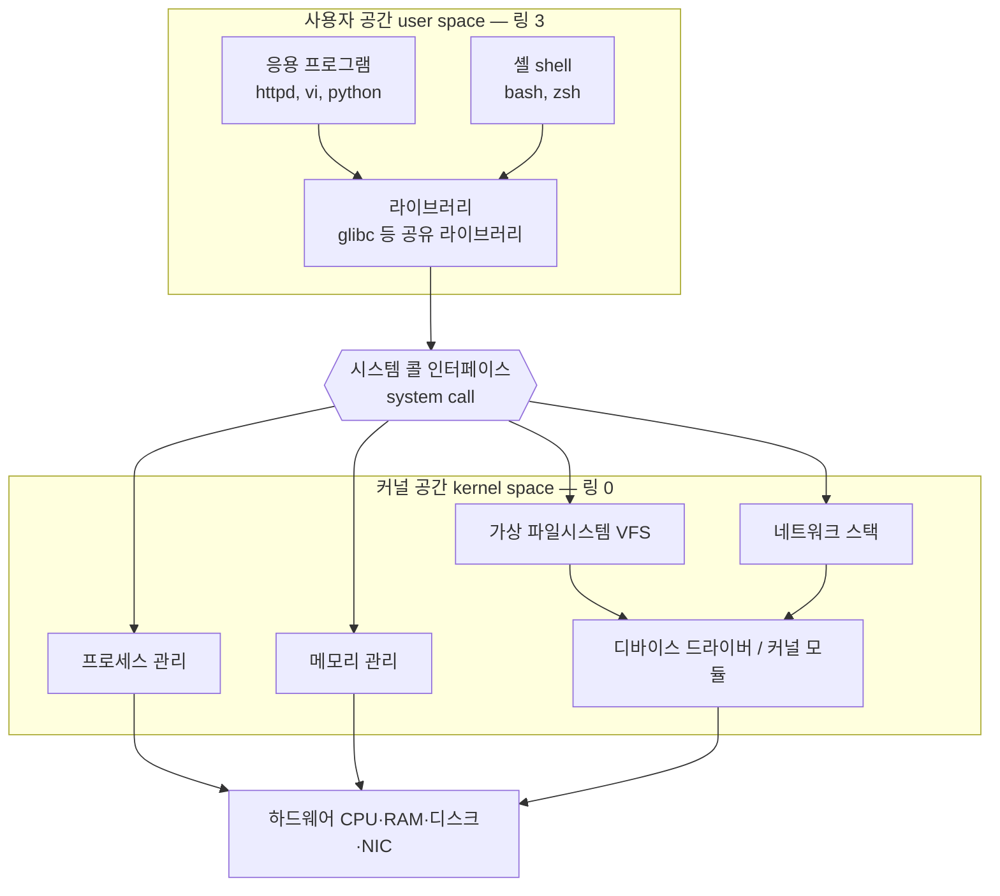
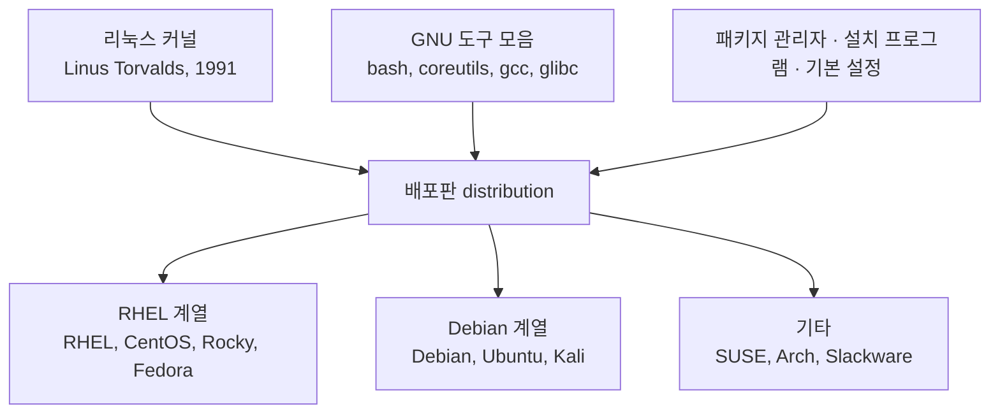

<Callout type="info">
  **이번 문서의 목표:** 이 파일을 다 읽으면 "리눅스는 커널이고 우분투는 배포판"이라는 문장의 의미를 구조적으로 설명할 수 있고, 커널·라이브러리·셸·응용 프로그램이 어느 층에 있으며 서로 무엇을 주고받는지 그림으로 그릴 수 있게 된다.
</Callout>

## 왜 이 구조부터 잡아야 하는가

1급 1차 기출을 펼치면 첫 문항부터 이런 것이 나옵니다.

> 리눅스 커널은 ( ㉠ )(이)가 만들었는데, 이것은 ( ㉡ )(이)가 개발한 교육용 유닉스인 미닉스를 참고해서 만들었다.

이 문장은 "리눅스 = 커널"이라는 전제 위에 서 있습니다. 그런데 많은 수험생이 리눅스를 "우분투 화면"으로 기억하고 있어서, 커널과 배포판과 GNU 도구가 뒤섞인 채로 문제를 읽습니다. 그 상태에서는 뒤에 나오는 시스템 콜·모듈·라이브러리·패키지 문항이 전부 흐릿해집니다.

> **쉽게 말하면:** 리눅스는 엔진(커널)이고, 우분투나 로키 리눅스는 그 엔진에 바퀴·핸들·시트를 붙여 파는 완성차(배포판)입니다.

## 1. 운영체제는 무엇을 하는 물건인가

### 문제 상황부터

컴퓨터에는 CPU 하나(또는 몇 개), 메모리 한 덩어리, 디스크 몇 개, 네트워크 카드 하나가 있습니다. 그런데 그 위에서 웹 서버, 데이터베이스, 로그 수집기, 사용자의 셸이 **동시에** 돌아가야 합니다. 프로그램들이 각자 알아서 하드웨어를 만지면 어떻게 될까요?

- A 프로그램이 쓰고 있는 메모리 영역을 B가 덮어씁니다.
- 두 프로그램이 동시에 디스크 헤드를 다른 곳으로 움직이라고 명령합니다.
- 아무나 다른 사람의 파일을 읽습니다.

그래서 **하드웨어를 만질 권한을 가진 단 하나의 관리자 프로그램**을 두고, 나머지 프로그램은 전부 그 관리자에게 "부탁"만 하게 만듭니다. 이 관리자가 **운영체제**(OS, Operating System)의 핵심, 곧 **커널**(kernel)입니다. kernel은 원래 견과류의 "알맹이"를 뜻하는 영어 단어로, 시스템의 가장 안쪽 알맹이라는 의미로 쓰입니다.

### 커널이 관리하는 네 가지 자원

| 관리 대상 | 커널이 하는 일 | 관련 개념 |
|-----------|----------------|-----------|
| CPU | 어떤 프로세스를 언제 얼마나 실행할지 결정 | 스케줄링, 우선순위(NI·PRI) |
| 메모리 | 프로세스마다 독립된 주소 공간 부여, 스왑 관리 | 가상 메모리, 페이지 |
| 파일시스템 | 디스크의 블록을 파일과 디렉터리로 추상화 | inode, 마운트, VFS |
| 장치·네트워크 | 디바이스 드라이버로 하드웨어 제어, 패킷 처리 | 커널 모듈, 네트워크 스택 |

이 네 가지는 기출에서 "커널의 역할로 알맞은 것은?" 형태로 그대로 물어봅니다. 프로세스 관리·메모리 관리·파일시스템 관리·장치 관리 — 네 단어를 세트로 기억하십시오.

## 2. 커널 공간과 사용자 공간 — 이 시험의 뼈대

### 두 개의 방으로 나눈다

CPU는 하드웨어 차원에서 **특권 수준**(privilege level)이라는 것을 지원합니다. 인텔 계열 CPU는 링 0부터 링 3까지 네 단계를 제공하는데, 리눅스는 그중 두 개만 씁니다.

- **링 0 = 커널 모드**(kernel mode) — 모든 명령을 실행할 수 있고 모든 메모리에 접근할 수 있습니다.
- **링 3 = 사용자 모드**(user mode) — 하드웨어를 직접 만지는 명령이 CPU 차원에서 차단됩니다.

커널 코드가 도는 영역을 **커널 공간**(kernel space), 일반 프로그램이 도는 영역을 **사용자 공간**(user space)이라고 부릅니다.



> **쉽게 말하면:** 사용자 공간은 손님 자리, 커널 공간은 주방입니다. 손님은 주방에 들어갈 수 없고, 오직 **주문서**(시스템 콜)를 통해서만 요리를 요청합니다.

### 시스템 콜 — 두 방을 잇는 유일한 문

**시스템 콜**(system call, 시스템 호출)은 사용자 공간 프로그램이 커널에게 작업을 요청하는 **공식 창구**입니다. 파일을 열고 싶으면 `open`, 읽고 싶으면 `read`, 새 프로세스를 만들고 싶으면 `fork`, 다른 프로그램으로 갈아타고 싶으면 `execve`를 호출합니다.

시스템 콜이 일어나면 CPU는 특별한 명령을 통해 **사용자 모드에서 커널 모드로 전환**되고, 커널이 요청을 처리한 뒤 다시 사용자 모드로 돌아옵니다. 이 전환에는 비용이 들기 때문에, 시스템 콜을 많이 호출하는 프로그램은 느립니다. 이것이 나중에 성능 모니터링에서 "시스템 시간(sy)"이 높다는 지표의 의미가 됩니다.

기출에서는 이렇게 나옵니다.

> 하나의 프로세스가 다른 프로세스를 실행할 때 사용하는 시스템 호출 방법의 하나로서, 새롭게 생성된 프로세스는 호출한 프로세스의 자식 프로세스가 된다.

| 시스템 콜 | 하는 일 | 결정적 특징 |
|-----------|---------|-------------|
| `fork` | 현재 프로세스를 복제해 새 프로세스 생성 | **자식 프로세스가 생긴다** |
| `exec` 계열 | 현재 프로세스의 메모리 이미지를 새 프로그램으로 교체 | **새 프로세스가 생기지 않는다** |
| `wait` | 자식이 끝날 때까지 부모가 기다림 | 좀비 프로세스 회수 |
| `exit` | 프로세스 종료, 종료 상태값 반환 | `$?`로 읽는 그 값 |

셸에서 `ls`를 입력하면 실제로는 bash가 `fork`로 자기 자신을 복제한 뒤, 그 자식 안에서 `exec`로 `ls` 프로그램을 덮어씌우고, 부모는 `wait`으로 기다립니다. 이 "fork 후 exec" 패턴은 9편의 프로세스 트리 설명에서 다시 쓰입니다.

### 라이브러리 — 시스템 콜을 감싼 포장지

프로그래머가 매번 시스템 콜을 직접 호출하지는 않습니다. C 언어로 `printf("hello")`를 쓰면, 그 안에서 표준 C 라이브러리(glibc)가 결국 `write` 시스템 콜을 부릅니다. 즉 **라이브러리는 사용자 공간에 있고, 시스템 콜은 커널로 넘어가는 경계**입니다. 이 구분이 헷갈리면 아래 문항을 틀립니다.

기출에서 `ldd` 명령의 출력을 보여 주고 명령 이름을 묻는 문항이 나온 적이 있습니다.

```
$ ldd /bin/ls
    linux-vdso.so.1 =>  (0x00007ffd730da000)
    libselinux.so.1 => /lib64/libselinux.so.1 (0x00007f0b420bf000)
    libcap.so.2 => /lib64/libcap.so.2 (0x00007f0b41eba000)
    libc.so.6 => /lib64/libc.so.6 (0x00007f0b418e3000)
```

`ldd`는 **List Dynamic Dependencies**의 약자로, 실행 파일이 어떤 **공유 라이브러리**(shared library, 확장자 `.so` = shared object)에 의존하는지 보여 줍니다. 비슷한 이름의 `ldconfig`는 공유 라이브러리 **캐시를 갱신**하는 명령입니다. 이 둘은 기출에서 나란히 보기로 나옵니다.

| 명령 | 역할 | 헷갈리는 짝 |
|------|------|-------------|
| `ldd` | 실행 파일의 공유 라이브러리 의존성 **출력** | 출력 화면 역추적 문항에 자주 등장 |
| `ldconfig` | `/etc/ld.so.conf` 기준으로 라이브러리 캐시 **갱신** | `ldd`와 혼동 유도 |
| `depmod` | 커널 **모듈**의 의존성 파일 갱신 | 라이브러리가 아니라 모듈이다 |

### 커널 모듈 — 커널을 끄지 않고 기능을 붙이는 법

커널은 통째로 하나의 큰 프로그램이지만, 모든 드라이버를 미리 넣어 두면 덩치가 감당이 안 됩니다. 그래서 리눅스는 **모놀리식 커널**(monolithic kernel, 단일형 커널)이면서도 **동적 적재 모듈**(LKM, Loadable Kernel Module)을 지원합니다. 필요할 때 커널에 기능 조각을 끼워 넣고, 필요 없으면 뺍니다.

| 명령 | 하는 일 | 의존성 처리 |
|------|---------|-------------|
| `insmod` | 지정한 모듈 파일 하나를 적재 | 처리하지 않음 |
| `rmmod` | 지정한 모듈 하나를 제거 | 처리하지 않음 |
| `modprobe` | 모듈 적재 (`-r` 옵션이면 제거) | **의존 모듈까지 함께 처리** |
| `depmod` | `modules.dep` 의존성 파일 생성·갱신 | 의존성 정보 자체를 만듦 |
| `lsmod` | 현재 적재된 모듈 목록 출력 | – |

기출은 정확히 이 표의 차이를 노립니다. `# ( 괄호 ) -r iptable_filter` 의 정답이 `rmmod`가 아니라 `modprobe`인 이유는, 보기의 다른 명령들과 비교했을 때 **의존성까지 정리하는 표준 방법**을 묻고 있기 때문입니다. 자세한 모듈·커널 컴파일 내용은 07편에서 이어집니다.

## 3. 배포판 — 커널 + GNU 도구 + 패키지 관리자

### 커널만으로는 아무것도 못 한다

커널을 컴파일해서 부팅해도, 사용자는 명령 하나 칠 수 없습니다. `ls`, `cp`, `bash`, `gcc` 같은 도구가 하나도 없기 때문입니다. 이 도구 모음을 만든 것이 **GNU 프로젝트**입니다. GNU는 "GNU is Not Unix"의 재귀적 약어로, 리처드 스톨먼(Richard Stallman)이 1983년 시작한 자유 소프트웨어 운동입니다. GNU는 유닉스 호환 도구를 거의 다 만들었지만 **커널만은 완성하지 못했고**, 1991년 리누스 토발즈(Linus Torvalds)가 만든 리눅스 커널이 그 빈자리를 채웠습니다. 그래서 엄밀히 말하면 우리가 쓰는 시스템은 **GNU/Linux**입니다.

여기에 설치 프로그램, 기본 설정, 패키지 저장소를 묶어 하나의 제품으로 만든 것이 **배포판**(distribution, 디스트리뷰션)입니다.



### 두 계열의 차이 — 기출이 노리는 지점

시험은 배포판의 철학 같은 것을 묻지 않습니다. **어느 계열이 어떤 명령·파일을 쓰는가**를 묻습니다.

| 구분 | RHEL 계열 (Red Hat, CentOS, Rocky, Fedora) | Debian 계열 (Debian, Ubuntu, Kali) |
|------|--------------------------------------------|-------------------------------------|
| 패키지 파일 | `.rpm` | `.deb` |
| 저수준 도구 | `rpm` | `dpkg` |
| 의존성 해결 도구 | `yum`, `dnf` | `apt`, `apt-get` |
| 네트워크 설정 위치 | `/etc/sysconfig/network-scripts/` | `/etc/network/interfaces`, netplan |
| 기본 파일시스템 (7 계열 기준) | XFS | ext4 |
| 방화벽 프런트엔드 | firewalld | ufw |

기출 문항 하나를 그대로 옮기면 이렇습니다.

> 패키지 설치 및 업데이트할 때 dpkg 또는 apt-get 명령을 사용하고, 칼리 리눅스도 이 리눅스 배포판을 기반으로 만들었다.

보기에는 Rocky Linux, CentOS, Debian, Ubuntu가 나옵니다. 함정은 **Ubuntu도 dpkg·apt-get을 쓴다**는 점입니다. 정답이 Debian인 이유는 "칼리 리눅스의 기반"이라는 단서 때문입니다. 칼리(Kali)와 우분투는 **둘 다 데비안에서 갈라져 나왔습니다.** 계보를 알아야 풀리는 문항입니다.

### 자주 틀리는 점

- **"리눅스 = 우분투 화면"** 으로 기억하면 커널·GNU·배포판을 나누는 문항에서 흔들립니다.
- `yum`과 `apt-get`은 **의존성을 자동 해결**하지만 `rpm`과 `dpkg`는 하지 않습니다. "저수준 vs 고수준" 축으로 외우십시오.
- Fedora는 RHEL 계열이지만 **RHEL의 상류(upstream) 실험판**이라는 위치가 별도로 출제될 수 있습니다.

## 4. 라이선스 — 왜 필기 시험이 라이선스를 묻는가

리눅스와 그 위 소프트웨어는 대부분 **FOSS**(Free and Open Source Software, 자유·오픈소스 소프트웨어)입니다. 실무에서 라이선스를 잘못 고르면 회사의 소스 코드를 공개해야 하는 상황이 생기므로, 시험은 **소스 공개 의무의 범위**를 반복 출제합니다.

| 라이선스 | 소스 공개 의무 | 특징 | 대표 소프트웨어 |
|----------|----------------|------|------------------|
| GPL | 강함 – 수정·배포 시 전체 소스 공개 | 전염성(copyleft)이 가장 강함 | 리눅스 커널, GCC, bash |
| LGPL | 중간 – 라이브러리 자체 수정분만 공개 | 링크만 하면 자사 코드 비공개 가능 | glibc |
| BSD | 없음 | 저작권 표시만 유지하면 됨 | FreeBSD, OpenSSH |
| Apache License | 없음 | 특허권 조항이 명시됨 | Hadoop, Tomcat |
| MPL | 파일 단위 – 수정한 파일만 공개 | 파일 경계로 의무가 끊김 | Firefox |

기출 문항의 표현을 그대로 보면 판별 단서가 뚜렷합니다.

> 이 라이선스가 부여된 소프트웨어는 누구든 자유롭게 부분 혹은 전체를 개인적 또는 상업적 목적으로 이용할 수 있다. 또한 재배포 시에도 소스 코드 또는 수정한 소스 코드를 포함하여 반드시 공개할 필요가 없다. 대표적인 프로그램에는 Hadoop, Tomcat 등이 있다.

"공개할 필요가 없다" + "Hadoop, Tomcat" 이 두 단서가 곧 **Apache License**입니다. BSD도 공개 의무가 없지만 대표 프로그램이 다릅니다. **라이선스 문항은 대표 소프트웨어 이름으로 갈리는 경우가 많으므로, 라이선스마다 대표작 한두 개를 반드시 함께 외우십시오.**

## 5. 리눅스의 기술적 특징 — 자주 출제되는 용어 다섯

기출은 리눅스의 특징을 용어로 묻습니다. 아래 다섯은 매 회차 후보입니다.

| 용어 | 뜻 | 판별 단서 |
|------|-----|-----------|
| 파이프(pipe) | 한 프로세스의 표준 출력을 다른 프로세스의 표준 입력으로 연결 | **프로세스 간 통신**이라는 표현 |
| 리다이렉션(redirection) | 표준 입출력의 방향을 파일 등으로 바꿈 | 파일로 저장·읽기 |
| 가상 콘솔(virtual console) | 하나의 물리 화면에서 여러 개의 독립 로그인 터미널 제공 | Alt와 기능키로 전환 |
| 다중 사용자·다중 작업 | 여러 사용자가 동시에 여러 작업 수행 | multi-user, multi-tasking |
| 공유 라이브러리 | 여러 프로그램이 같은 코드 덩어리를 공유 | `.so` 파일, `ldd` |

파이프와 리다이렉션은 매우 자주 짝지어 출제되므로, 정의 문장 안에서 **"프로세스 간 통신"** 이라는 표현이 보이면 파이프라고 반응하도록 훈련해 두십시오. 셸 관점의 자세한 설명은 04편에서 이어집니다.

## 6. 전체 그림 한 번 더

지금까지 나온 층을 아래에서 위로 다시 세워 봅니다.

<Steps>
1. **하드웨어** — CPU, 메모리, 디스크, 네트워크 카드.
2. **커널** — 하드웨어를 독점 관리하며 프로세스·메모리·파일시스템·네트워크를 담당. 모듈로 기능 확장.
3. **시스템 콜 인터페이스** — 사용자 공간이 커널에게 요청하는 유일한 창구.
4. **라이브러리** — glibc 등이 시스템 콜을 감싸 편한 함수로 제공.
5. **셸과 응용 프로그램** — 사용자가 실제로 만지는 층. 셸은 명령을 받아 fork·exec로 프로그램을 실행.
6. **배포판** — 위의 2~5를 하나로 묶고 패키지 관리자와 설치 도구를 얹은 제품.
</Steps>

## 핵심 정리

- 리눅스는 정확히는 **커널**이며, 커널은 프로세스·메모리·파일시스템·장치와 네트워크를 관리합니다.
- CPU의 특권 수준을 이용해 **커널 공간과 사용자 공간**이 분리되고, 둘을 잇는 유일한 문이 **시스템 콜**입니다. `fork`는 자식을 만들고 `exec`는 자신을 교체합니다.
- 커널 기능은 **모듈**로 동적으로 붙입니다. 의존성까지 처리하는 표준 명령은 `modprobe`이고, 의존성 파일을 갱신하는 명령은 `depmod`입니다.
- **배포판 = 커널 + GNU 도구 + 패키지 관리자**이며, RHEL 계열은 `rpm`·`yum`·`dnf`, Debian 계열은 `dpkg`·`apt`를 씁니다. 우분투와 칼리는 모두 데비안 계열입니다.
- 라이선스는 **소스 공개 의무의 범위**로 갈립니다. GPL은 강하고, LGPL은 라이브러리 수정분만, BSD와 Apache는 공개 의무가 없으며, MPL은 파일 단위입니다.

## 마무리 복습

<Quiz
  questionNumber={1}
  question="다음 ( 괄호 ) 안에 들어갈 내용으로 알맞은 것은? 리눅스 커널은 ( ㉠ )가 만들었고, GNU 프로젝트를 시작해 bash와 GCC 등 유닉스 호환 도구를 만든 인물은 ( ㉡ )이다."
  options={['㉠ 리처드 스톨먼, ㉡ 리누스 토발즈', '㉠ 리누스 토발즈, ㉡ 리처드 스톨먼', '㉠ 켄 톰슨, ㉡ 데니스 리치', '㉠ 앤드루 타넨바움, ㉡ 리누스 토발즈']}
  correctAnswer={2}
  explanation="리눅스 커널은 1991년 리누스 토발즈가 만들었고, GNU 프로젝트는 1983년 리처드 스톨먼이 시작했다. 두 사람의 역할을 바꾸어 출제하는 것이 전형적인 함정이다."
  optionExplanations={['두 인물의 역할이 정확히 뒤바뀐 보기다', '정답 — 커널은 토발즈, GNU 도구는 스톨먼이다', '켄 톰슨과 데니스 리치는 유닉스와 C 언어를 만든 인물로 리눅스 커널 개발자가 아니다', '앤드루 타넨바움은 미닉스를 만든 인물이며 리눅스 커널 개발자가 아니다']}
/>

<Quiz
  questionNumber={2}
  question="다음 설명에 해당하는 리눅스의 기술적 특징으로 알맞은 것은? 특정 프로세스의 표준 출력을 다른 프로세스의 표준 입력으로 쓰이게 하는 것으로 대표적인 프로세스 간 통신 기술이다."
  options={['리다이렉션', '파이프', '가상 콘솔', '공유 라이브러리']}
  correctAnswer={2}
  explanation="한 프로세스의 표준 출력을 다른 프로세스의 표준 입력으로 이어 주는 것이 파이프이며, 문제 문장의 프로세스 간 통신이라는 표현이 결정적 단서다."
  optionExplanations={['리다이렉션은 표준 입출력의 방향을 파일 등으로 바꾸는 것으로 프로세스끼리 잇는 기술이 아니다', '정답 — 파이프는 프로세스 간 통신 방식의 하나다', '가상 콘솔은 하나의 화면에서 여러 로그인 터미널을 제공하는 기능이다', '공유 라이브러리는 코드 재사용을 위한 것으로 입출력 연결과 무관하다']}
/>

<Quiz
  questionNumber={3}
  question="사용자 공간 프로그램이 커널의 기능을 사용하기 위해 거쳐야 하는 경계에 해당하는 것으로 알맞은 것은?"
  options={['공유 라이브러리', '시스템 콜', '커널 모듈', '디바이스 드라이버']}
  correctAnswer={2}
  explanation="사용자 모드와 커널 모드를 잇는 공식 창구는 시스템 콜이다. 라이브러리는 사용자 공간에서 시스템 콜을 감싸는 층이고, 모듈과 드라이버는 커널 공간 내부의 구성 요소다."
  optionExplanations={['공유 라이브러리는 사용자 공간에 있으며 그 내부에서 다시 시스템 콜을 부른다', '정답 — 모드 전환이 일어나는 지점이 시스템 콜이다', '커널 모듈은 커널 기능을 확장하는 조각으로 경계 자체가 아니다', '디바이스 드라이버는 커널 공간에서 하드웨어를 제어하는 코드다']}
/>

<Quiz
  questionNumber={4}
  question="다음 중 fork와 exec에 대한 설명으로 틀린 것은?"
  options={['fork는 호출한 프로세스를 복제해 자식 프로세스를 만든다', 'exec는 현재 프로세스의 메모리 이미지를 새 프로그램으로 교체한다', 'exec를 호출하면 항상 새로운 자식 프로세스가 생성된다', '셸은 명령 실행 시 fork로 복제한 뒤 자식에서 exec를 수행한다']}
  correctAnswer={3}
  explanation="exec 계열 시스템 콜은 새 프로세스를 만들지 않고 현재 프로세스를 덮어쓴다. 자식 프로세스를 만드는 것은 fork의 역할이다."
  optionExplanations={['fork의 정의 그대로이며 부모 자식 관계가 만들어진다', 'exec의 정의 그대로다', '정답(틀린 설명) — exec는 프로세스를 새로 만들지 않는다', '셸의 명령 실행은 fork 후 exec라는 표준 패턴을 따른다']}
/>

<Quiz
  questionNumber={5}
  question="다음 설명에 해당하는 라이선스로 알맞은 것은? 개인적 상업적 이용이 모두 자유롭고 재배포 시 소스 코드를 공개할 의무가 없으며 대표적인 프로그램으로 Hadoop과 Tomcat이 있다."
  options={['Apache License', 'GPL', 'LGPL', 'MPL']}
  correctAnswer={1}
  explanation="소스 공개 의무가 없다는 점과 Hadoop 및 Tomcat이라는 대표 프로그램이 함께 제시되면 아파치 라이선스다."
  optionExplanations={['정답 — 공개 의무 없음과 대표 프로그램 두 단서가 모두 맞는다', 'GPL은 수정 배포 시 전체 소스 공개 의무가 있는 강한 카피레프트 라이선스다', 'LGPL은 라이브러리 자체의 수정분에 대해 공개 의무가 있다', 'MPL은 수정한 파일 단위로 공개 의무가 발생한다']}
/>

<Quiz
  questionNumber={6}
  question="다음 중 커널 모듈 관리 명령에 대한 설명으로 알맞은 것은?"
  options={['insmod는 의존 모듈까지 자동으로 함께 적재한다', 'rmmod는 의존 관계에 있는 모듈을 함께 제거한다', 'modprobe는 의존성을 고려해 모듈을 적재하며 -r 옵션으로 제거한다', 'depmod는 적재된 모듈 목록을 화면에 출력한다']}
  correctAnswer={3}
  explanation="의존성을 자동으로 처리하는 표준 모듈 관리 명령이 modprobe이며 제거는 -r 옵션으로 수행한다. insmod와 rmmod는 지정한 모듈 하나만 다루고 의존성을 처리하지 않는다."
  optionExplanations={['insmod는 지정한 모듈 파일 하나만 적재하며 의존성을 처리하지 않는다', 'rmmod 역시 의존 모듈을 함께 제거하지 않는다', '정답 — modprobe가 의존성까지 처리하는 표준 명령이다', 'depmod는 modules.dep 의존성 파일을 갱신하며 목록 출력은 lsmod의 역할이다']}
/>

<Quiz
  questionNumber={7}
  question="실행 파일이 어떤 공유 라이브러리에 의존하는지 목록을 출력하는 명령으로 알맞은 것은?"
  options={['rpm', 'ldconfig', 'ldd', 'depmod']}
  correctAnswer={3}
  explanation="ldd는 실행 파일이나 공유 라이브러리가 의존하는 동적 라이브러리 목록을 출력한다. ldconfig는 라이브러리 캐시를 갱신하고 depmod는 커널 모듈 의존성 파일을 갱신한다."
  optionExplanations={['rpm은 RHEL 계열의 패키지 관리 도구다', 'ldconfig는 라이브러리 캐시를 갱신하는 명령으로 의존성 목록을 보여주지 않는다', '정답 — 출력에 so 확장자 라이브러리 경로가 나열되면 ldd다', 'depmod는 라이브러리가 아니라 커널 모듈의 의존성을 다룬다']}
/>

<Quiz
  questionNumber={8}
  question="다음 설명에 해당하는 배포판으로 알맞은 것은? 패키지 관리에 dpkg와 apt-get을 사용하며 칼리 리눅스와 우분투가 모두 이 배포판을 기반으로 만들어졌다."
  options={['Rocky Linux', 'CentOS', 'Debian', 'Fedora']}
  correctAnswer={3}
  explanation="dpkg와 apt-get 계열이면서 우분투와 칼리 리눅스의 공통 모체가 되는 배포판은 데비안이다. 우분투도 같은 도구를 쓰지만 우분투 자체가 데비안에서 파생된 배포판이므로 모체는 데비안이다."
  optionExplanations={['Rocky Linux는 RHEL 계열로 rpm과 dnf를 사용한다', 'CentOS 역시 RHEL 계열로 yum과 rpm을 사용한다', '정답 — 우분투와 칼리의 공통 기반이라는 단서가 데비안을 가리킨다', 'Fedora는 RHEL 계열의 상류 배포판이다']}
/>

## 참고 자료

- [The Linux Kernel Archives](https://www.kernel.org/)
- [GNU Operating System — What is GNU?](https://www.gnu.org/gnu/gnu.html)
- [man7.org — ldd(1) 매뉴얼 페이지](https://man7.org/linux/man-pages/man1/ldd.1.html)
