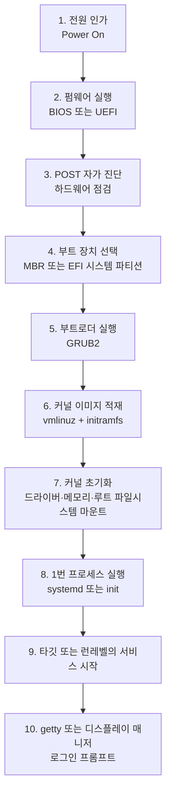

<Callout type="info">
  **이번 문서의 목표:** 이 파일을 다 읽으면 전원 인가부터 로그인 화면까지의 부팅 단계를 순서대로 말할 수 있고, 각 단계에서 무엇이 무엇을 읽어 다음 단계를 부르는지, 그리고 런레벨·타깃이 어느 단계에서 결정되는지 설명할 수 있게 된다.
</Callout>

## 왜 부팅을 이렇게 자세히 보는가

부팅은 이 시험에서 **가장 자주, 가장 다양한 각도로** 출제되는 주제입니다. 이유는 단순합니다. 부팅 과정 안에 커널·프로세스·파일시스템·서비스·로그가 전부 등장하기 때문에, 한 문항으로 여러 개념을 동시에 물어볼 수 있습니다.

실제 기출을 보면 이런 문항이 나옵니다.

> 리눅스 시스템의 root 패스워드를 잊어버린 상태로 GRUB 환경 설정 파일에서 커널 인자값을 변경하려고 한다. 밑줄 친 부분을 대체해야 할 커널 인자값으로 알맞은 것은?

이 문항을 풀려면 **부트로더가 커널에 인자를 넘긴다는 사실**, **커널이 마지막에 1번 프로세스를 실행한다는 사실**, **그 1번 프로세스를 셸로 바꿔치기할 수 있다는 사실**을 모두 알아야 합니다. 부팅 흐름을 하나의 사슬로 이해하지 않으면 절대 풀리지 않습니다.

> **쉽게 말하면:** 부팅은 "작은 프로그램이 자기보다 큰 프로그램을 불러오는 일"을 여러 번 반복하는 릴레이 경주입니다. 각 주자가 다음 주자에게 바통을 어떻게 넘기는지가 시험의 핵심입니다.

## 1. 부팅 전체 흐름 한 장



이 열 단계를 순서대로 외우는 것이 아니라, **각 단계가 다음 단계를 어떻게 찾아내는지**를 이해해야 합니다. 하나씩 내려가 봅시다.

## 2. 펌웨어 — BIOS와 UEFI

전원을 넣으면 CPU는 메인보드의 롬(ROM)에 새겨진 **펌웨어**(firmware)를 실행합니다. 펌웨어는 하드웨어와 소프트웨어의 중간에 있는 프로그램으로, 메인보드에 붙어 나오는 초기 실행 코드입니다.

### POST — 자가 진단

펌웨어가 가장 먼저 하는 일은 **POST**(Power-On Self-Test, 전원 인가 자가 진단)입니다. CPU가 살아 있는지, 메모리가 인식되는지, 키보드와 디스크가 붙어 있는지 확인합니다. 메모리가 없으면 "삐 삐" 하는 경고음이 나는 그 단계입니다.

### BIOS와 UEFI의 차이

| 구분 | BIOS (Basic Input Output System) | UEFI (Unified Extensible Firmware Interface) |
|------|----------------------------------|----------------------------------------------|
| 등장 시기 | 1980년대부터 | 2000년대 이후 표준화 |
| 디스크 분할 방식 | MBR (Master Boot Record) | GPT (GUID Partition Table) |
| 최대 디스크 용량 | 약 2TB 제한 | 사실상 제한 없음 |
| 최대 기본 파티션 | 4개 (확장 파티션으로 우회) | 128개 이상 |
| 부트로더 위치 | 디스크 첫 512바이트의 MBR 영역 | EFI 시스템 파티션(ESP)의 `.efi` 파일 |
| 보안 기능 | 없음 | 시큐어 부트(Secure Boot) |

BIOS 방식에서 부트로더가 들어가는 자리는 디스크 맨 앞 **512바이트**입니다. 그중 앞 446바이트가 부트 코드, 뒤 64바이트가 파티션 테이블(16바이트 x 4개), 마지막 2바이트가 서명입니다. **파티션 테이블에 4개밖에 못 들어가서 기본 파티션이 4개로 제한**되는 것이 여기서 나옵니다. 이 숫자는 13편의 파티션 설명에서 다시 씁니다.

> **쉽게 말하면:** BIOS는 디스크 맨 앞 아주 좁은 방에 "다음에 실행할 프로그램 위치"를 적어 두는 방식이고, UEFI는 아예 전용 파티션을 하나 만들어 거기에 부팅용 프로그램 파일을 통째로 두는 방식입니다.

## 3. 부트로더 — GRUB

**부트로더**(boot loader)는 커널을 디스크에서 찾아 메모리에 올리고 실행권을 넘기는 프로그램입니다. 리눅스의 사실상 표준은 **GRUB**(GRand Unified Bootloader)이며, 현재는 GRUB2 버전이 쓰입니다.

### GRUB이 하는 일

<Steps>
1. **부팅 메뉴 표시** — 여러 커널 버전이나 다른 운영체제 중에서 고르게 합니다.
2. **커널 이미지 적재** — `/boot/vmlinuz-...` 파일을 메모리에 올립니다. `vmlinuz`는 "virtual memory linux, gzip 압축됨"이라는 뜻입니다.
3. **초기 램디스크 적재** — `/boot/initramfs-....img`를 함께 올립니다.
4. **커널 인자 전달** — 커널에게 넘길 문자열을 붙여서 실행합니다.
</Steps>

### 초기 램디스크가 왜 필요한가

여기서 한 가지 닭과 달걀 문제가 있습니다. 커널이 루트 파일시스템(`/`)을 마운트하려면 **디스크 컨트롤러 드라이버와 파일시스템 드라이버**가 필요합니다. 그런데 그 드라이버는 대개 `/lib/modules` 아래, 즉 아직 마운트되지 않은 루트 파일시스템 안에 있습니다.

이 순환을 끊는 것이 **initramfs**(initial RAM filesystem, 초기 램 파일시스템)입니다. GRUB이 커널과 함께 메모리에 올려 주는 작은 임시 루트 파일시스템으로, 진짜 루트를 마운트하는 데 필요한 최소한의 드라이버와 도구가 들어 있습니다. 커널은 이걸 임시 루트로 삼아 드라이버를 적재하고, 진짜 루트를 마운트한 뒤 그쪽으로 갈아탑니다.

### GRUB 설정과 커널 인자

CentOS 7 계열의 GRUB2 메뉴 항목은 대략 이렇게 생겼습니다.

```
linux16 /boot/vmlinuz-3.10.0-862.el7.x86_64 root=UUID=800f7aa2-83b0-4b18-a4ce-7de8ede7c014 ro rhgb quiet LANG=ko_KR.UTF-8
initrd16 /boot/initramfs-3.10.0-862.el7.x86_64.img
```

각 인자의 뜻은 다음과 같습니다.

| 인자 | 의미 |
|------|------|
| `root=UUID=...` | 루트 파일시스템이 있는 장치를 UUID로 지정 |
| `ro` | 루트를 읽기 전용(read only)으로 먼저 마운트 |
| `rw` | 루트를 읽기 쓰기(read write) 가능하게 마운트 |
| `rhgb` | Red Hat Graphical Boot – 그래픽 부팅 화면 |
| `quiet` | 부팅 메시지를 화면에 거의 출력하지 않음 |
| `single` 또는 `1` | 단일 사용자 모드로 부팅 |
| `init=/bin/sh` | **1번 프로세스로 systemd 대신 셸을 실행** |

기출의 root 패스워드 복구 문항이 여기서 풀립니다. `ro`를 `rw init=/bin/sh`로 바꾸면, 루트 파일시스템을 쓰기 가능하게 마운트한 상태에서 **인증 절차 없이 곧바로 root 권한 셸**이 뜹니다. 그 셸에서 `passwd`로 비밀번호를 바꿉니다. `rw`가 반드시 함께 필요한 이유는 읽기 전용 상태에서는 `/etc/shadow` 파일을 수정할 수 없기 때문입니다.

### 자주 틀리는 점

- `init=/bin/sh`와 `single`(단일 사용자 모드)은 다릅니다. `single`은 systemd가 정상 실행되어 `rescue.target`으로 가지만, `init=/bin/sh`는 **systemd 자체를 실행하지 않고** 셸을 1번 프로세스로 띄웁니다.
- 보기에 `systemd=/bin/sh` 같은 것이 섞여 나오지만, 커널이 인식하는 인자 이름은 `init`입니다.
- 부트로더는 커널을 **실행**하는 것이지 커널의 일부가 아닙니다. GRUB은 커널이 뜨기 전에 이미 종료됩니다.

## 4. 커널 초기화

커널이 실행되면 다음을 순서대로 처리합니다.

<Steps>
1. **압축 해제** — `vmlinuz`는 압축된 이미지이므로 자기 자신을 메모리에서 풀어냅니다.
2. **하드웨어 검출과 드라이버 초기화** — CPU 개수, 메모리 크기, 버스에 붙은 장치를 인식합니다. 이때 나오는 메시지가 `dmesg`로 볼 수 있는 커널 링 버퍼 내용입니다.
3. **메모리 관리 초기화** — 페이지 테이블을 세우고 가상 메모리를 활성화합니다.
4. **initramfs를 임시 루트로 마운트** — 필요한 드라이버를 적재합니다.
5. **진짜 루트 파일시스템 마운트** — `root=` 인자가 가리키는 장치를 `/`에 마운트합니다.
6. **1번 프로세스 실행** — `/sbin/init`을 실행합니다. 현대 배포판에서 이 파일은 `/lib/systemd/systemd`를 가리키는 심볼릭 링크입니다.
</Steps>

여기서 **PID 1**(Process ID 1, 1번 프로세스)이라는 개념이 태어납니다. 커널이 직접 만든 최초의 사용자 공간 프로세스이고, 이후 모든 프로세스는 이 프로세스의 자손입니다. PID 1이 죽으면 시스템은 커널 패닉에 빠집니다. 프로세스 트리와 고아 프로세스 이야기는 09편에서 이어집니다.

## 5. 시스템 상태 — 런레벨과 타깃

### 왜 "상태"라는 개념이 필요한가

서버를 켤 때마다 항상 같은 서비스를 띄우는 것은 아닙니다.

- 점검할 때는 네트워크도 끄고 최소한의 것만 띄우고 싶습니다.
- 평소에는 웹 서버·데이터베이스·SSH를 전부 띄우고 싶습니다.
- 데스크톱이라면 거기에 그래픽 로그인 화면까지 띄우고 싶습니다.

이렇게 **"어떤 서비스 묶음을 띄운 상태인가"** 를 이름 붙여 관리하는 것이 시스템 상태 개념입니다. 전통 SysV init에서는 숫자로 된 **런레벨**(runlevel)이라 불렀고, systemd에서는 이름이 붙은 **타깃**(target)이라 부릅니다.

### 런레벨 0부터 6까지

| 런레벨 | 의미 | 대응 systemd 타깃 |
|--------|------|--------------------|
| 0 | 시스템 종료(halt) | `poweroff.target` |
| 1 | 단일 사용자 모드(관리·복구용) | `rescue.target` |
| 2 | 다중 사용자 모드, 네트워크 파일시스템 없음 | `multi-user.target` |
| 3 | 다중 사용자 모드, 텍스트 콘솔 (서버 기본) | `multi-user.target` |
| 4 | 사용 안 함(사용자 정의용) | `multi-user.target` |
| 5 | 다중 사용자 모드 + 그래픽 로그인 | `graphical.target` |
| 6 | 재부팅(reboot) | `reboot.target` |

여기서 **0은 종료, 6은 재부팅**이라는 사실이 특히 자주 출제됩니다. 그리고 systemd 쪽으로 오면 2·3·4가 전부 `multi-user.target` 하나로 합쳐진다는 점도 함정으로 쓰입니다.

> **쉽게 말하면:** 런레벨은 "서버를 어느 모드로 켜 둘 것인가"를 정하는 다이얼이고, 0과 6은 그 다이얼의 양 끝에 있는 "끄기"와 "다시 켜기"입니다.

### 상태를 확인하고 바꾸는 명령

| 목적 | SysV 방식 | systemd 방식 |
|------|-----------|---------------|
| 현재 상태 확인 | `runlevel` | `systemctl get-default`, `systemctl list-units --type=target` |
| 즉시 상태 전환 | `init 3`, `telinit 3` | `systemctl isolate multi-user.target` |
| 기본 상태 설정 | `/etc/inittab` 수정 | `systemctl set-default multi-user.target` |
| 종료 | `init 0`, `shutdown -h now` | `systemctl poweroff` |
| 재부팅 | `init 6`, `reboot` | `systemctl reboot` |

`runlevel` 명령을 실행하면 이런 출력이 나옵니다.

```
$ runlevel
N 3
```

앞의 `N`은 **이전 런레벨이 없다**(None)는 뜻이고, 뒤의 `3`이 현재 런레벨입니다. 부팅 후 한 번도 전환하지 않았다면 앞이 항상 `N`입니다. systemd가 도입된 뒤에도 이 명령은 **호환 계층**으로 남아 있어서, 활성 타깃을 보고 대응하는 숫자를 되돌려 줍니다. 자세한 systemd 유닛 구조와 의존성 그래프는 10편과 14편에서 다룹니다.

## 6. 마지막 단계 — 로그인 프롬프트

타깃에 속한 서비스가 모두 올라오면 마지막으로 로그인 창구가 열립니다.

- **텍스트 콘솔** — `getty`(또는 `agetty`) 프로세스가 각 가상 콘솔에 로그인 프롬프트를 띄웁니다. 사용자가 이름과 비밀번호를 입력하면 `login` 프로그램이 인증하고, 성공하면 그 사용자의 로그인 셸을 실행합니다.
- **그래픽 로그인** — **디스플레이 매니저**(display manager)가 그래픽 로그인 화면을 띄웁니다. GNOME 환경의 디스플레이 매니저는 **GDM**(GNOME Display Manager), KDE 환경은 **KDM** 또는 **SDDM**입니다.

기출에서 사용자 목록이 나열된 그래픽 로그인 화면 그림을 주고 프로그램 이름을 묻는 문항이 나왔습니다. 정답은 GDM이었고, 오답으로 KDE와 GNOME이 섞여 나왔습니다. **GNOME은 데스크톱 환경 전체의 이름이고, GDM은 그중 로그인 화면을 담당하는 프로그램**이라는 구분이 정답을 가릅니다. Mutter는 GNOME의 창 관리자(window manager)입니다.

| 이름 | 정체 |
|------|------|
| GNOME, KDE | 데스크톱 환경(desktop environment) 전체 |
| GDM, KDM, SDDM | 디스플레이 매니저 – 그래픽 로그인 담당 |
| Mutter, KWin | 윈도 매니저 – 창 테두리와 배치 담당 |
| X.Org, Wayland | 디스플레이 서버 – 화면 출력의 토대 |

## 7. 전체를 한 문장으로 잇기

지금까지의 흐름을 문장으로 이어 봅니다.

전원을 넣으면 펌웨어(BIOS 또는 UEFI)가 POST로 하드웨어를 점검하고, 부팅 장치의 MBR 또는 EFI 파티션에서 **GRUB**을 실행합니다. GRUB은 `/boot`에서 커널 이미지와 initramfs를 메모리에 올리고 `root=`, `ro` 같은 **커널 인자**를 붙여 커널에 실행권을 넘깁니다. 커널은 자신을 압축 해제하고 하드웨어를 검출한 뒤 initramfs를 임시 루트로 써서 드라이버를 올리고, 진짜 루트 파일시스템을 마운트한 다음 **PID 1로 systemd**를 실행합니다. systemd는 기본 타깃(`multi-user.target` 또는 `graphical.target`)에 딸린 서비스들을 의존성 순서대로 시작하고, 마지막으로 `getty` 또는 디스플레이 매니저가 **로그인 프롬프트**를 띄웁니다.

이 한 단락을 눈 감고 말할 수 있으면, 부팅 관련 기출의 절반은 이미 풀린 것입니다.

## 핵심 정리

- 부팅은 **펌웨어 → POST → 부트로더(GRUB) → 커널 → PID 1(systemd/init) → 타깃 서비스 → 로그인**의 릴레이입니다.
- BIOS는 **MBR 512바이트**를 쓰고 기본 파티션이 4개로 제한되며, UEFI는 **GPT와 EFI 시스템 파티션**을 씁니다.
- **initramfs**는 루트 파일시스템을 마운트하는 데 필요한 드라이버를 담은 임시 루트로, 닭과 달걀 문제를 해결합니다.
- GRUB에서 `ro`를 `rw init=/bin/sh`로 바꾸면 인증 없이 root 셸이 떠서 **패스워드 복구**가 가능합니다.
- 런레벨 **0은 종료, 1은 단일 사용자, 3은 텍스트 다중 사용자, 5는 그래픽, 6은 재부팅**이며 systemd에서는 각각 타깃으로 매핑됩니다.
- 그래픽 로그인 화면을 띄우는 프로그램은 데스크톱 환경 이름(GNOME)이 아니라 **디스플레이 매니저**(GDM)입니다.

## 마무리 복습

<Quiz
  questionNumber={1}
  question="다음 중 리눅스 부팅 과정의 순서로 알맞은 것은?"
  options={['펌웨어 POST 부트로더 커널 PID 1 로그인 프롬프트', '부트로더 펌웨어 POST 커널 PID 1 로그인 프롬프트', '펌웨어 커널 부트로더 POST PID 1 로그인 프롬프트', '커널 펌웨어 POST 부트로더 PID 1 로그인 프롬프트']}
  correctAnswer={1}
  explanation="전원 인가 후 펌웨어가 실행되어 POST로 하드웨어를 점검하고 부트로더를 불러오며, 부트로더가 커널을 적재하고 커널이 마지막에 1번 프로세스를 실행한 뒤 로그인 프롬프트가 뜬다."
  optionExplanations={['정답 — 각 단계가 다음 단계를 불러오는 릴레이 구조다', '부트로더는 펌웨어가 불러오는 것이므로 펌웨어보다 앞설 수 없다', '커널은 부트로더가 적재하므로 부트로더보다 앞설 수 없다', '커널이 가장 먼저 실행될 수는 없으며 펌웨어가 첫 주자다']}
/>

<Quiz
  questionNumber={2}
  question="다음 ( 괄호 ) 안에 들어갈 커널 인자값으로 알맞은 것은? root 패스워드를 잊어버려 GRUB 메뉴 편집 화면에서 기존의 ro 부분을 ( 괄호 )로 바꾸어 인증 없이 셸을 얻으려고 한다."
  options={['rw single', 'rw rescue', 'rw systemd=/bin/sh', 'rw init=/bin/sh']}
  correctAnswer={4}
  explanation="커널이 인식하는 1번 프로세스 지정 인자는 init이며, init=/bin/sh로 지정하면 systemd 대신 셸이 1번 프로세스로 실행되어 인증 없이 root 셸을 얻는다. shadow 파일을 수정해야 하므로 rw가 함께 필요하다."
  optionExplanations={['single은 단일 사용자 모드로 가지만 systemd가 정상 실행되며 인증을 요구할 수 있다', 'rescue는 커널 인자가 아니라 systemd 타깃 이름 계열의 표현이다', '커널이 인식하는 인자 이름은 systemd가 아니라 init이다', '정답 — rw로 쓰기 가능하게 하고 init을 셸로 대체하는 것이 정석이다']}
/>

<Quiz
  questionNumber={3}
  question="다음 설명에 해당하는 것으로 알맞은 것은? 커널이 진짜 루트 파일시스템을 마운트하는 데 필요한 드라이버를 담아 부트로더가 메모리에 함께 올려 주는 임시 루트 파일시스템이다."
  options={['vmlinuz', 'initramfs', 'MBR', 'grub.cfg']}
  correctAnswer={2}
  explanation="루트를 마운트하려면 드라이버가 필요한데 그 드라이버가 루트 안에 있는 순환 문제를 해결하기 위해 메모리에 먼저 올리는 임시 루트가 initramfs다."
  optionExplanations={['vmlinuz는 압축된 커널 이미지 자체다', '정답 — 초기 램 파일시스템으로 최소한의 드라이버와 도구를 담는다', 'MBR은 디스크 첫 512바이트의 부트 레코드 영역이다', 'grub.cfg는 부트로더의 설정 파일이다']}
/>

<Quiz
  questionNumber={4}
  question="다음 중 런레벨과 systemd 타깃의 대응으로 틀린 것은?"
  options={['런레벨 0은 poweroff.target에 대응한다', '런레벨 3은 multi-user.target에 대응한다', '런레벨 5는 graphical.target에 대응한다', '런레벨 6은 rescue.target에 대응한다']}
  correctAnswer={4}
  explanation="런레벨 6은 재부팅이므로 reboot.target에 대응한다. rescue.target에 대응하는 것은 단일 사용자 모드인 런레벨 1이다."
  optionExplanations={['런레벨 0은 시스템 종료이며 poweroff.target이 맞다', '런레벨 3은 텍스트 다중 사용자 모드로 multi-user.target이 맞다', '런레벨 5는 그래픽 로그인 모드로 graphical.target이 맞다', '정답(틀린 설명) — 런레벨 6은 재부팅이므로 reboot.target이다']}
/>

<Quiz
  questionNumber={5}
  question="그래픽 로그인 화면에서 사용자 목록을 보여 주고 패스워드를 입력받아 그래픽 세션을 시작하는 프로그램으로 알맞은 것은?"
  options={['GDM', 'KDE', 'GNOME', 'Mutter']}
  correctAnswer={1}
  explanation="그래픽 로그인 화면을 담당하는 프로그램은 디스플레이 매니저이며 GNOME 환경의 디스플레이 매니저가 GDM이다. GNOME과 KDE는 데스크톱 환경 전체의 이름이고 Mutter는 창 관리자다."
  optionExplanations={['정답 — GNOME Display Manager의 약자로 로그인 세션을 관리한다', 'KDE는 데스크톱 환경 이름이며 로그인 프로그램 이름이 아니다', 'GNOME 역시 데스크톱 환경 전체의 이름이다', 'Mutter는 GNOME의 윈도 매니저로 창 배치를 담당한다']}
/>

<Quiz
  questionNumber={6}
  question="다음 중 BIOS 방식과 UEFI 방식에 대한 설명으로 알맞은 것은?"
  options={['BIOS는 GPT를 사용하고 UEFI는 MBR을 사용한다', 'BIOS 방식의 MBR은 512바이트이며 기본 파티션이 4개로 제한된다', 'UEFI는 디스크 용량이 2TB로 제한된다', 'UEFI는 시큐어 부트를 지원하지 않는다']}
  correctAnswer={2}
  explanation="MBR은 디스크 첫 512바이트로 그중 64바이트의 파티션 테이블에 16바이트짜리 항목 4개만 들어가므로 기본 파티션이 4개로 제한된다."
  optionExplanations={['BIOS가 MBR, UEFI가 GPT로 서로 뒤바뀐 설명이다', '정답 — 파티션 테이블 크기가 기본 파티션 개수 제한의 원인이다', '2TB 제한은 MBR 방식의 한계이며 GPT는 사실상 제한이 없다', '시큐어 부트는 UEFI가 제공하는 대표적인 보안 기능이다']}
/>

<Quiz
  questionNumber={7}
  question="runlevel 명령을 실행했더니 N 3 이라는 결과가 출력되었다. 이에 대한 설명으로 알맞은 것은?"
  options={['이전 런레벨이 없고 현재 런레벨이 3이다', '이전 런레벨이 3이고 현재 런레벨은 없다', '런레벨 N과 3이 동시에 활성화되어 있다', '런레벨 전환에 실패해 오류가 발생한 상태다']}
  correctAnswer={1}
  explanation="runlevel 명령은 이전 런레벨과 현재 런레벨을 순서대로 출력하며, 부팅 후 런레벨을 바꾼 적이 없으면 이전 값 자리에 없음을 뜻하는 N이 표시된다."
  optionExplanations={['정답 — 앞이 이전 런레벨 뒤가 현재 런레벨이며 N은 이전 값이 없음을 뜻한다', '출력 순서가 이전 값 다음 현재 값이므로 반대로 해석한 것이다', '런레벨은 한 번에 하나만 활성화되며 N은 런레벨 이름이 아니다', 'N은 오류 표시가 아니라 이전 런레벨 없음을 뜻한다']}
/>

## 참고 자료

- [man7.org — runlevel(8) 매뉴얼 페이지](https://man7.org/linux/man-pages/man8/runlevel.8.html)
- [man7.org — bootup(7) 시스템 부팅 과정 매뉴얼](https://man7.org/linux/man-pages/man7/bootup.7.html)
- [GNU GRUB Manual](https://www.gnu.org/software/grub/manual/grub/grub.html)
