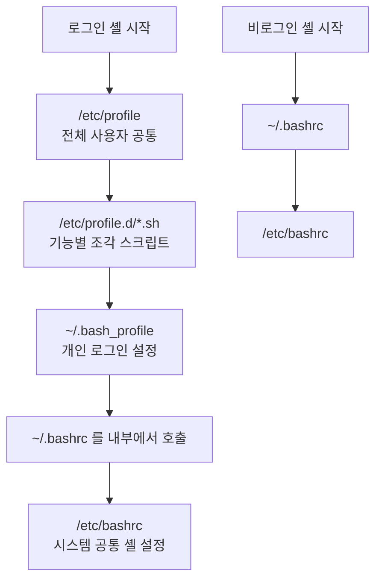

<Callout type="info">
  **이번 문서의 목표:** 이 파일을 다 읽으면 셸이 명령 한 줄을 어떤 순서로 해석하는지 단계별로 말할 수 있고, 로그인 셸과 비로그인 셸이 각각 어떤 프로파일 파일을 읽는지, 환경변수와 셸 변수가 어떻게 다른지 구분할 수 있게 된다.
</Callout>

## 왜 셸을 원리로 이해해야 하는가

셸 관련 기출은 명령어를 묻지 않습니다. **셸이 문자열을 어떻게 해석하는지**를 묻습니다. 실제 기출 두 문항을 봅시다.

```bash
$ echo "My Home is `pwd`"
```

보기에는 `My Home is 'pwd'`, `My Home is /home/ihd`, `My Home is pwd` 등이 나옵니다. 정답을 고르려면 **큰따옴표 안에서 백틱이 살아 있는가**를 알아야 합니다.

```bash
$ test 20 -gt 30
$ echo $?
( 괄호 )
```

정답을 고르려면 **종료 상태값의 규칙**(성공은 0, 실패는 0이 아닌 값)을 알아야 합니다.

> **쉽게 말하면:** 셸은 "명령을 실행하는 프로그램"이기 전에 **"문자열을 가공해서 실행할 명령을 만들어 내는 프로그램"** 입니다. 시험은 후자를 묻습니다.

## 1. 셸이란 무엇인가

**셸**(shell, 껍데기)은 사용자와 커널 사이에 있는 **명령 해석기**(command interpreter)입니다. 이름 그대로, 커널이라는 알맹이를 둘러싼 껍데기입니다. 사용자가 친 문자열을 해석해 적절한 프로그램을 실행하고, 결과를 다시 사용자에게 보여 줍니다.


### 주요 셸의 계보

| 셸 | 이름 유래 | 특징 | 프롬프트(일반 사용자) |
|----|-----------|------|------------------------|
| sh | Bourne Shell | 스티븐 본이 만든 원조 유닉스 셸 | `$` |
| csh | C Shell | C 언어 유사 문법, 히스토리·별칭 도입 | `%` |
| ksh | Korn Shell | sh 호환에 csh 기능 결합 | `$` |
| bash | Bourne Again Shell | GNU가 만든 sh의 확장판, 리눅스 기본 | `$` |
| tcsh | TENEX C Shell | csh 개선판, 명령 완성 지원 | `%` |
| zsh | Z Shell | 강력한 자동 완성과 확장 기능 | `%` |

리눅스의 기본 셸은 거의 예외 없이 **bash**입니다. 이름이 "Bourne Again"인 것은 원조 Bourne Shell을 다시 만들었다는 말장난입니다. 기출은 **셸 이름과 그 정체를 짝짓는 문항**과 **root 프롬프트가 `#`, 일반 사용자가 `$`** 라는 구분을 묻습니다.

### 사용 가능한 셸 확인과 변경

| 목적 | 명령 또는 파일 |
|------|-----------------|
| 시스템에 설치된 셸 목록 | `/etc/shells` 파일, `cat /etc/shells` |
| 현재 사용 중인 셸 확인 | `echo $SHELL` |
| 로그인 셸 변경 | `chsh -s /bin/zsh` 또는 `usermod -s /bin/zsh 사용자` |
| 사용자별 로그인 셸이 기록된 곳 | `/etc/passwd`의 **7번째 필드** |

`/etc/passwd`의 7번째 필드가 로그인 셸이라는 점은 12편에서 다시 다루지만, 여기서 미리 붙잡아 두면 좋습니다. 로그인 셸을 `/sbin/nologin`이나 `/bin/false`로 지정하면 **그 계정으로는 로그인할 수 없게** 됩니다. 서비스 전용 계정에 쓰는 기법입니다.

## 2. 셸이 명령 한 줄을 처리하는 순서

이 절이 이 문서의 핵심입니다. bash는 입력된 한 줄을 다음 순서로 가공합니다.

<Steps>
1. **단어 분리 준비** — 공백과 메타문자를 기준으로 토큰을 나눕니다.
2. **중괄호 확장**(brace expansion) — `file{1,2,3}` 같은 표기를 `file1 file2 file3`으로 펼칩니다.
3. **틸데 확장**(tilde expansion) — `~`를 홈 디렉터리 경로로 바꿉니다.
4. **매개변수·변수 확장** — `$HOME`이나 `${HOME}` 같은 변수를 값으로 바꿉니다.
5. **명령 치환**(command substitution) — 백틱이나 `$(...)` 안의 명령을 실행하고 그 출력으로 바꿉니다.
6. **산술 확장** — `$((2+3))`을 `5`로 바꿉니다.
7. **경로명 확장**(globbing) — `*.c` 같은 와일드카드를 실제 파일 이름 목록으로 펼칩니다.
8. **리다이렉션 설정** — 표준 입출력의 방향을 바꿉니다.
9. **실행** — 내장 명령이면 셸이 직접, 외부 명령이면 fork 후 exec로 실행합니다.
</Steps>

> **쉽게 말하면:** 셸은 요리사에게 주문을 전달하기 전에 주문서를 여러 번 고쳐 씁니다. 시험은 "고쳐 쓴 최종 주문서가 무엇인가"를 묻습니다.

### 인용 부호 세 가지 — 기출 단골

확장과 치환을 **어디까지 막을 것인가**를 정하는 것이 인용 부호입니다.

| 부호 | 이름 | 안쪽에서 살아 있는 것 | 죽는 것 |
|------|------|------------------------|---------|
| `'...'` | 작은따옴표(single quote) | 없음 – 전부 문자 그대로 | 변수, 명령 치환, 와일드카드 모두 |
| `"..."` | 큰따옴표(double quote) | **변수 확장, 명령 치환, 백슬래시** | 와일드카드, 단어 분리 |
| `` `...` `` | 백틱(back quote) | 안쪽을 **명령으로 실행**해 출력으로 치환 | – |

이제 기출 문항이 풀립니다.

```bash
$ echo "My Home is `pwd`"
My Home is /home/ihd
```

큰따옴표는 명령 치환을 막지 않으므로, 백틱 안의 `pwd`가 실행되어 현재 디렉터리 경로로 바뀝니다. 만약 작은따옴표였다면 어떻게 될까요?

```bash
$ echo 'My Home is `pwd`'
My Home is `pwd`
```

작은따옴표는 모든 것을 문자 그대로 만들기 때문에 백틱도 살아나지 못합니다. **작은따옴표는 완전 차단, 큰따옴표는 부분 차단**이라는 한 문장으로 기억하십시오.

백틱은 현대 문법에서 `$(pwd)` 형태로도 씁니다. 두 표기는 같은 일을 하지만 `$(...)`가 중첩이 쉬워 권장됩니다. 시험에는 백틱 표기가 여전히 나옵니다.

### 리다이렉션과 파이프

| 기호 | 이름 | 하는 일 |
|------|------|---------|
| `>` | 출력 리다이렉션 | 표준 출력을 파일에 덮어쓰기 |
| `>>` | 추가 리다이렉션 | 표준 출력을 파일 끝에 덧붙이기 |
| `<` | 입력 리다이렉션 | 파일 내용을 표준 입력으로 넣기 |
| `2>` | 오류 리다이렉션 | 표준 오류만 파일로 |
| `&>` | 통합 리다이렉션 | 표준 출력과 표준 오류를 함께 |
| 세로 막대(파이프 기호) | 파이프 | 앞 명령의 표준 출력을 뒤 명령의 표준 입력으로 |

셸은 세 개의 기본 통로를 열어 둡니다. 각각 번호가 붙어 있습니다.

| 번호 | 이름 | 약칭 | 기본 연결 대상 |
|------|------|------|-----------------|
| 0 | 표준 입력 | stdin | 키보드 |
| 1 | 표준 출력 | stdout | 화면 |
| 2 | 표준 오류 | stderr | 화면 |

`2> /dev/null`이 "오류 메시지를 버린다"는 뜻인 이유가 여기 있습니다. `/dev/null`은 무엇을 써도 사라지는 특수 장치 파일입니다. 리다이렉션과 파이프의 차이는 02편에서 본 대로 **파일 대상이냐 프로세스 대상이냐**입니다.

### 종료 상태값

모든 명령은 끝날 때 0부터 255 사이의 숫자를 남깁니다. 이것이 **종료 상태값**(exit status)이며, 셸 변수 `$?`로 읽습니다.

| 값 | 의미 |
|----|------|
| 0 | 성공 또는 참(true) |
| 0이 아닌 값 | 실패 또는 거짓(false), 보통 1 |
| 126 | 실행 권한 없음 |
| 127 | 명령을 찾을 수 없음 |

일상 언어와 반대라서 헷갈립니다. **0이 성공**입니다. 실패 원인이 여러 가지일 수 있으니 실패 쪽에 여러 숫자를 배정하고, 성공은 한 가지뿐이니 0 하나를 주었다고 이해하면 외우기 쉽습니다.

```bash
$ test 20 -gt 30
$ echo $?
1
```

`test 20 -gt 30`은 "20이 30보다 큰가"(greater than)를 묻는 조건입니다. 거짓이므로 종료 상태값은 1입니다. 이 문항은 **거짓이 1**이라는 점을 노립니다.

## 3. 변수 — 셸 변수와 환경변수

### 두 종류의 변수

```bash
$ 이름=철수          # 셸 변수 (현재 셸에서만 유효)
$ export 이름        # 환경변수로 승격 (자식 프로세스에도 전달)
$ export 나이=20     # 선언과 동시에 환경변수로
```

| 구분 | 셸 변수(shell variable) | 환경변수(environment variable) |
|------|-------------------------|--------------------------------|
| 유효 범위 | 선언한 셸 안에서만 | 그 셸이 만드는 **자식 프로세스까지 전달** |
| 만드는 법 | `이름=값` | `export 이름=값` |
| 목록 확인 | `set` | `env`, `printenv` |
| 삭제 | `unset 이름` | `unset 이름` |

핵심은 **전달 방향이 한쪽뿐**이라는 점입니다. 부모 셸의 환경변수는 자식에게 복사되지만, 자식이 바꾼 값은 부모로 돌아오지 않습니다. 스크립트 안에서 `cd`를 해도 스크립트를 끝내면 원래 디렉터리로 돌아와 있는 이유가 이것입니다. 스크립트가 별도의 자식 셸에서 실행되기 때문입니다. 같은 셸에서 실행하려면 `source 파일명` 또는 `. 파일명`을 씁니다.

> **쉽게 말하면:** 환경변수는 부모가 자식에게 싸 주는 도시락입니다. 자식이 도시락 내용을 바꿔도 부모 냉장고는 그대로입니다.

### 시험에 나오는 주요 환경변수

| 변수 | 뜻 |
|------|-----|
| `PATH` | 명령을 찾을 디렉터리 목록. 콜론으로 구분 |
| `HOME` | 현재 사용자의 홈 디렉터리 |
| `PWD` | 현재 작업 디렉터리 |
| `SHELL` | 로그인 셸의 경로 |
| `USER`, `LOGNAME` | 로그인한 사용자 이름 |
| `TERM` | 터미널 종류 |
| `LANG` | 언어와 문자 인코딩 설정 |
| `PS1` | 기본 프롬프트 문자열 |
| `DISPLAY` | X 윈도 출력 대상 서버와 화면 번호 |
| `HISTSIZE` | 히스토리에 보관할 명령 개수 |

`DISPLAY`는 기출에서 반복 출제됩니다.

> 원격지 X 서버에 응용 프로그램을 전송하기 위해 X 클라이언트에서 진행해야 하는 과정으로 알맞은 것은?

정답은 `DISPLAY` 값을 원격 X 서버 주소로 바꾸는 것입니다. 여기서 헷갈리는 점은 X 윈도의 **서버와 클라이언트가 일상 감각과 반대**라는 것입니다. 화면을 가진 쪽(사용자 앞의 컴퓨터)이 **X 서버**이고, 프로그램이 실행되는 쪽이 **X 클라이언트**입니다. 클라이언트가 "내 화면을 저 서버로 보내라"고 지정하는 변수가 `DISPLAY`입니다.

| 명령·변수 | 역할 | 어느 쪽에서 실행 |
|-----------|------|------------------|
| `DISPLAY` 환경변수 | 출력할 X 서버 주소 지정 | **X 클라이언트** |
| `xhost` | 어떤 호스트의 접속을 허용할지 설정 | **X 서버** |
| `xauth` | 매직 쿠키 기반 접근 권한 관리 | 주로 X 서버 |

### PATH — 명령을 찾는 방법

명령을 입력하면 셸은 다음 순서로 찾습니다.

<Steps>
1. **별칭**(alias)인지 확인합니다.
2. **셸 내장 명령**(builtin)인지 확인합니다. `cd`, `echo`, `export` 등이 여기 해당합니다.
3. `PATH`에 나열된 디렉터리를 **앞에서부터 차례로** 뒤져 실행 파일을 찾습니다.
4. 못 찾으면 `command not found` 오류와 함께 종료 상태값 127을 남깁니다.
</Steps>

`PATH`에 현재 디렉터리를 뜻하는 `.`을 넣는 것은 **보안상 위험**합니다. 공격자가 `/tmp` 같은 곳에 `ls`라는 이름의 악성 스크립트를 두면, 그 디렉터리에서 `ls`를 칠 때 그 스크립트가 실행되기 때문입니다. 그래서 현재 디렉터리의 실행 파일은 `./프로그램`처럼 명시적으로 지정하는 것이 원칙입니다.

명령이 어디에 있는지 확인하는 명령들도 구분해서 나옵니다.

| 명령 | 하는 일 |
|------|---------|
| `which 명령` | PATH에서 찾은 실행 파일 경로 하나 |
| `whereis 명령` | 실행 파일, 소스, 매뉴얼 페이지 위치 |
| `type 명령` | 별칭인지 내장 명령인지 외부 명령인지 판별 |

## 4. 로그인 셸과 비로그인 셸 — 어떤 파일을 읽는가

### 셸의 두 가지 축

셸은 두 가지 축으로 분류됩니다. 이 둘이 조합되어 읽는 파일이 달라집니다.

- **로그인 셸**(login shell) — 로그인 과정을 거쳐 시작된 셸. 콘솔 로그인, `ssh` 접속, `su -` 등.
- **비로그인 셸**(non-login shell) — 이미 로그인한 상태에서 새로 띄운 셸. 터미널 창을 새로 열거나 `bash`를 그냥 입력한 경우.
- **대화형 셸**(interactive) — 사용자와 주고받는 셸.
- **비대화형 셸**(non-interactive) — 스크립트 실행처럼 입력 없이 도는 셸.

### 읽는 파일의 순서



| 파일 | 적용 범위 | 언제 읽히는가 |
|------|-----------|----------------|
| `/etc/profile` | 전체 사용자 | **로그인 셸**에서만 |
| `/etc/profile.d/` 아래 스크립트 | 전체 사용자 | `/etc/profile`이 순서대로 실행 |
| `~/.bash_profile` | 해당 사용자 | **로그인 셸**에서만 |
| `~/.bashrc` | 해당 사용자 | **비로그인 셸**마다, 그리고 로그인 셸에서는 `~/.bash_profile`이 불러 줌 |
| `/etc/bashrc` | 전체 사용자 | `~/.bashrc`가 불러 줌 |
| `~/.bash_logout` | 해당 사용자 | 로그인 셸을 **종료할 때** |

여기서 자주 나오는 실수가 있습니다. **별칭(alias)은 `~/.bashrc`에 써야 합니다.** `~/.bash_profile`에 쓰면 로그인할 때 한 번만 적용되고, 그 뒤에 새로 여는 터미널에는 적용되지 않습니다. 반대로 **환경변수는 `~/.bash_profile`에 씁니다.** 어차피 `export`된 환경변수는 자식 셸로 상속되므로 로그인 시 한 번만 설정하면 충분하기 때문입니다.

> **쉽게 말하면:** `profile` 계열은 "로그인할 때 한 번", `bashrc` 계열은 "셸을 띄울 때마다"입니다. 상속되는 것(환경변수)은 앞쪽에, 상속되지 않는 것(별칭·함수)은 뒤쪽에 둡니다.

### 자주 틀리는 점

- `~/.bash_profile`과 `~/.profile`을 혼동합니다. bash는 `~/.bash_profile`을 먼저 찾고, 없으면 `~/.bash_login`, 그다음 `~/.profile` 순으로 찾습니다. 데비안 계열은 `~/.profile`을 기본으로 두는 경우가 많습니다.
- `su`와 `su -`는 다릅니다. `su -`는 **로그인 셸**로 전환하므로 대상 사용자의 프로파일을 새로 읽고 환경변수와 작업 디렉터리까지 바뀝니다. 그냥 `su`는 환경을 대부분 유지합니다.
- 설정 파일을 고친 뒤 즉시 반영하려면 `source ~/.bashrc`를 실행해야 합니다. 그냥 실행하면 자식 셸에서만 적용되고 사라집니다.

## 핵심 정리

- 셸은 **명령 해석기**로, 입력 문자열을 확장·치환·글로빙으로 가공한 뒤 fork와 exec로 실행합니다.
- **작은따옴표는 모든 확장을 차단**하고, **큰따옴표는 변수 확장과 명령 치환을 허용**합니다. 백틱과 `$(...)`는 명령 치환입니다.
- 종료 상태값 `$?`는 **성공이 0, 실패나 거짓이 0이 아닌 값**이며 명령을 못 찾으면 127입니다.
- 셸 변수는 현재 셸에서만, `export`한 **환경변수는 자식 프로세스까지** 전달됩니다. 목록은 `set`과 `env`로 각각 봅니다.
- X 윈도에서 화면을 가진 쪽이 **X 서버**이고, 프로그램 쪽인 X 클라이언트가 `DISPLAY`로 출력 대상을 지정합니다.
- 로그인 셸은 `/etc/profile`과 `~/.bash_profile`을, 비로그인 셸은 `~/.bashrc`를 읽습니다. **별칭은 bashrc, 환경변수는 profile**이 원칙입니다.

## 마무리 복습

<Quiz
  questionNumber={1}
  question="다음 명령의 결과로 알맞은 것은? 사용자의 현재 디렉터리는 /home/ihd 이며 명령은 echo 큰따옴표 My Home is 백틱 pwd 백틱 큰따옴표 이다."
  options={['My Home is 백틱 pwd 백틱', 'My Home is /home/ihd', 'My Home is pwd', 'My Home is 작은따옴표 pwd 작은따옴표']}
  correctAnswer={2}
  explanation="큰따옴표 안에서는 명령 치환이 차단되지 않으므로 백틱 안의 pwd가 실행되어 현재 디렉터리 경로로 바뀐다."
  optionExplanations={['백틱이 그대로 출력되려면 작은따옴표로 감싸야 한다', '정답 — 큰따옴표는 명령 치환과 변수 확장을 허용한다', 'pwd라는 문자열이 그대로 남는 것은 치환이 일어나지 않은 경우다', '작은따옴표가 새로 생기는 일은 없다']}
/>

<Quiz
  questionNumber={2}
  question="다음 ( 괄호 ) 안에 출력될 값으로 알맞은 것은? test 20 -gt 30 을 실행한 직후 echo 달러물음표 를 실행하였다."
  options={['0', '1', '20', '30']}
  correctAnswer={2}
  explanation="test 20 -gt 30 은 20이 30보다 크다는 조건이므로 거짓이다. 셸에서 성공과 참은 0이고 실패와 거짓은 0이 아닌 값으로 보통 1이 반환된다."
  optionExplanations={['0은 조건이 참이거나 명령이 성공했을 때의 값이다', '정답 — 조건이 거짓이므로 1이 반환된다', '비교에 사용된 피연산자 값이 그대로 반환되지는 않는다', '비교 대상 숫자가 종료 상태값이 되지는 않는다']}
/>

<Quiz
  questionNumber={3}
  question="다음 중 셸 변수와 환경변수에 대한 설명으로 틀린 것은?"
  options={['export 명령으로 셸 변수를 환경변수로 승격할 수 있다', '환경변수는 자식 프로세스에 전달된다', '자식 프로세스가 변경한 환경변수 값은 부모 셸에도 반영된다', 'env 명령으로 환경변수 목록을 확인할 수 있다']}
  correctAnswer={3}
  explanation="환경변수는 부모에서 자식으로 복사될 뿐 자식이 바꾼 값이 부모로 돌아오지 않는다. 같은 셸에 적용하려면 source 명령을 사용해야 한다."
  optionExplanations={['export는 셸 변수를 환경변수로 만드는 명령이 맞다', '환경변수의 정의 그 자체다', '정답(틀린 설명) — 전달은 부모에서 자식 방향으로만 일어난다', 'env 또는 printenv로 환경변수 목록을 볼 수 있다']}
/>

<Quiz
  questionNumber={4}
  question="다음 중 원격지의 X 서버로 응용 프로그램 화면을 출력하기 위해 X 클라이언트에서 설정해야 하는 환경변수로 알맞은 것은?"
  options={['TERM', 'DISPLAY', 'PATH', 'SHELL']}
  correctAnswer={2}
  explanation="X 클라이언트는 DISPLAY 환경변수에 출력할 X 서버의 주소와 디스플레이 번호를 지정한다. 화면을 가진 쪽이 X 서버이고 프로그램이 도는 쪽이 X 클라이언트라는 점에 유의한다."
  optionExplanations={['TERM은 터미널 종류를 지정하는 변수다', '정답 — 출력 대상 X 서버를 지정하는 변수다', 'PATH는 명령을 찾을 디렉터리 목록이다', 'SHELL은 로그인 셸 경로를 담는 변수다']}
/>

<Quiz
  questionNumber={5}
  question="다음 설명에 해당하는 파일로 알맞은 것은? 개인 사용자의 별칭과 셸 함수를 정의하는 곳으로 새 터미널을 열어 비로그인 셸이 시작될 때마다 읽힌다."
  options={['/etc/profile', '~/.bash_profile', '~/.bashrc', '~/.bash_logout']}
  correctAnswer={3}
  explanation="별칭과 함수는 자식 셸로 상속되지 않으므로 셸이 시작될 때마다 읽히는 bashrc 계열에 두어야 한다. profile 계열은 로그인 시 한 번만 읽힌다."
  optionExplanations={['전체 사용자 공통이며 로그인 셸에서만 읽힌다', '개인용이지만 로그인 셸에서만 읽히므로 별칭 정의에는 부적절하다', '정답 — 비로그인 셸이 시작될 때마다 읽히므로 별칭 정의 위치로 적합하다', '로그인 셸을 종료할 때 실행되는 파일이다']}
/>

<Quiz
  questionNumber={6}
  question="사용자별 로그인 셸 정보가 기록되어 있는 /etc/passwd 파일의 필드 번호로 알맞은 것은?"
  options={['5번째 필드', '6번째 필드', '7번째 필드', '4번째 필드']}
  correctAnswer={3}
  explanation="etc passwd 파일은 콜론으로 구분된 7개 필드로 이루어지며 마지막인 7번째 필드가 로그인 셸이다. 6번째는 홈 디렉터리다."
  optionExplanations={['5번째는 주석 또는 사용자 정보를 담는 필드다', '6번째는 홈 디렉터리 경로 필드다', '정답 — 마지막 필드가 로그인 셸이며 nologin을 지정하면 로그인이 차단된다', '4번째는 기본 그룹 식별자인 GID 필드다']}
/>

<Quiz
  questionNumber={7}
  question="다음 중 표준 스트림과 번호의 연결로 틀린 것은?"
  options={['표준 입력은 0번이다', '표준 출력은 1번이다', '표준 오류는 2번이다', '표준 오류를 버리려면 1번을 dev null로 보낸다']}
  correctAnswer={4}
  explanation="표준 오류를 버리려면 2번을 dev null로 보내야 한다. 1번은 표준 출력이므로 이를 버리면 정상 출력이 사라지고 오류 메시지는 그대로 화면에 남는다."
  optionExplanations={['표준 입력은 0번이 맞다', '표준 출력은 1번이 맞다', '표준 오류는 2번이 맞다', '정답(틀린 설명) — 오류를 버리려면 2번을 리다이렉션해야 한다']}
/>

<Quiz
  questionNumber={8}
  question="다음 중 su 명령과 su 하이픈 명령의 차이에 대한 설명으로 알맞은 것은?"
  options={['둘의 동작은 완전히 동일하다', 'su 하이픈은 대상 사용자의 로그인 셸로 전환해 프로파일을 새로 읽는다', 'su 하이픈은 비밀번호 입력을 요구하지 않는다', 'su 는 root 계정으로만 전환할 수 있다']}
  correctAnswer={2}
  explanation="하이픈을 붙이면 로그인 셸로 전환되어 대상 사용자의 profile 계열 파일을 새로 읽고 환경변수와 작업 디렉터리까지 그 사용자 기준으로 바뀐다."
  optionExplanations={['환경 승계 여부가 다르므로 동일하지 않다', '정답 — 로그인 셸로 전환되는 것이 핵심 차이다', '두 방식 모두 대상 계정의 비밀번호 인증이 필요하다', 'su 는 대상 사용자 이름을 지정해 어떤 계정으로도 전환할 수 있다']}
/>

## 참고 자료

- [GNU Bash Reference Manual — Shell Expansions](https://www.gnu.org/software/bash/manual/bash.html#Shell-Expansions)
- [GNU Bash Reference Manual — Bash Startup Files](https://www.gnu.org/software/bash/manual/bash.html#Bash-Startup-Files)
- [man7.org — bash(1) 매뉴얼 페이지](https://man7.org/linux/man-pages/man1/bash.1.html)
