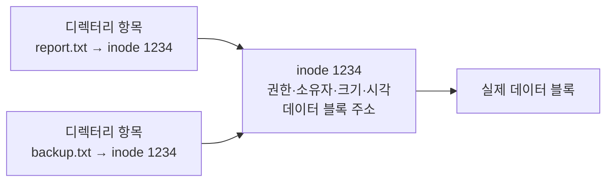

<Callout type="info">
  **이번 문서의 목표:** 이 파일을 다 읽으면 `ls -l` 출력 한 줄을 왼쪽부터 오른쪽까지 전부 해석할 수 있고, 기호식과 8진수식 권한 표기를 서로 변환하며, 하드 링크와 심볼릭 링크의 동작 차이를 inode 수준에서 설명할 수 있게 된다.
</Callout>

## 왜 권한 표기부터인가

리눅스에서 "권한이 없습니다"라는 메시지는 세상에서 가장 자주 보는 오류입니다. 그리고 이 시험에서는 권한이 **1과목과 2과목에 걸쳐** 반복 출제됩니다. 기출을 보면 이런 문항이 나옵니다.

```
# ls -l /usr/bin/passwd
-rwsr-xr-x. 1 root root 27856 Apr 1 2020 /usr/bin/passwd
```

이 한 줄에서 `s` 하나를 알아채야 "일반 사용자가 실행해도 root 권한으로 동작한다"는 답을 고를 수 있습니다. 즉 이 시험의 권한 문항은 **`ls -l` 출력을 읽는 문제**로 환원됩니다. 그래서 이 편에서는 그 한 줄을 완전히 해부합니다.

> **쉽게 말하면:** `ls -l` 한 줄은 파일의 신분증입니다. 신분증 읽는 법을 배우면 권한 문제의 대부분이 풀립니다.

이 편은 표기법과 기본 개념까지만 다룹니다. umask 계산, 특수 비트의 실제 효과, ACL 상속 같은 심화 내용은 **11편**에서 이어집니다.

## 1. `ls -l` 한 줄 완전 해부

```
-rwxr-xr--  1  posein  ihd  4096  Mar 11 09:30  report.txt
```

이 한 줄은 공백으로 구분된 여덟 덩어리입니다.

| 위치 | 예시 값 | 의미 |
|------|---------|------|
| 1 | `-rwxr-xr--` | 파일 유형 1글자 + 권한 9글자 |
| 2 | `1` | 하드 링크 개수 |
| 3 | `posein` | 소유자(owner, user) |
| 4 | `ihd` | 소유 그룹(group) |
| 5 | `4096` | 파일 크기(바이트) |
| 6 | `Mar 11 09:30` | 최종 수정 시각(mtime) |
| 7 | `report.txt` | 파일 이름 |

### 첫 글자 — 파일 유형

맨 앞 한 글자가 **파일 유형**(file type)입니다. 리눅스는 "모든 것이 파일"이라는 철학을 따르므로, 디렉터리도 장치도 전부 파일로 표현되고 이 한 글자로 구분됩니다.

| 기호 | 유형 | 설명 |
|------|------|------|
| `-` | 일반 파일(regular file) | 텍스트, 바이너리, 이미지 등 |
| `d` | 디렉터리(directory) | 파일 이름과 inode 번호의 목록 |
| `l` | 심볼릭 링크(symbolic link) | 다른 경로를 가리키는 바로가기 |
| `b` | 블록 장치(block device) | 디스크처럼 블록 단위 입출력. `/dev/sda` |
| `c` | 문자 장치(character device) | 키보드처럼 문자 단위 입출력. `/dev/tty` |
| `p` | 명명 파이프(named pipe, FIFO) | 프로세스 간 통신용 파일 |
| `s` | 소켓(socket) | 네트워크·로컬 통신 종단점 |

### 나머지 아홉 글자 — 권한 비트

첫 글자 뒤의 아홉 글자는 **세 글자씩 세 묶음**입니다.

```
 -   rwx      r-x      r--
 ↑    ↑        ↑        ↑
유형 소유자   그룹     기타
     user     group    other
```

각 묶음의 세 자리는 항상 **읽기, 쓰기, 실행** 순서입니다.

| 기호 | 이름 | 파일에서의 의미 | 디렉터리에서의 의미 |
|------|------|------------------|----------------------|
| `r` | read, 읽기 | 내용을 읽을 수 있음 | **목록을 볼 수 있음** (`ls`) |
| `w` | write, 쓰기 | 내용을 고칠 수 있음 | **파일을 만들고 지울 수 있음** |
| `x` | execute, 실행 | 프로그램으로 실행 가능 | **그 디렉터리 안으로 들어갈 수 있음** (`cd`) |

디렉터리에서의 의미가 파일과 완전히 다르다는 점이 결정적입니다. 특히 두 가지를 붙잡으십시오.

- 디렉터리에 `x`가 없으면 `cd`로 들어갈 수 없고, 그 안의 파일에 접근할 수도 없습니다. 이름을 알아도 소용없습니다.
- 파일을 **삭제할 권한은 그 파일이 아니라 파일이 들어 있는 디렉터리의 `w` 권한**에 달려 있습니다. 읽기 전용 파일도 디렉터리 쓰기 권한이 있으면 지울 수 있습니다.

> **쉽게 말하면:** 디렉터리는 "이름표가 붙은 사물함 목록"입니다. `r`은 목록을 훑어보는 권한, `x`는 사물함 문 앞까지 가는 권한, `w`는 사물함을 새로 놓거나 치우는 권한입니다.

### 소유자, 그룹, 기타 — 어느 묶음이 적용되는가

접근을 시도한 사용자에게 적용되는 묶음은 **딱 하나**입니다. 커널은 위에서부터 순서대로 판정합니다.

<Steps>
1. 접근자가 파일의 **소유자**인가? 그렇다면 소유자 권한만 적용하고 끝냅니다.
2. 아니라면 접근자가 파일의 **소유 그룹에 속하는가**? 그렇다면 그룹 권한만 적용하고 끝냅니다.
3. 둘 다 아니면 **기타** 권한을 적용합니다.
</Steps>

여기서 흔한 착각이 하나 있습니다. 소유자 권한이 `---`이고 기타 권한이 `rwx`인 파일은, **소유자가 오히려 읽지 못합니다.** "소유자니까 더 넓은 권한이 자동으로 적용되겠지"라고 생각하면 틀립니다. 첫 번째로 매칭된 묶음에서 판정이 끝나기 때문입니다. 시험에서 이런 극단적인 권한을 주고 판정을 묻는 문항이 나옵니다.

## 2. 8진수 표기 — 기호와 숫자 사이의 변환

권한 세 자리 `rwx`는 각각 켜짐과 꺼짐뿐이므로 **3비트 이진수**입니다. 이것을 8진수 한 자리로 표현합니다.

| 권한 | 이진수 | 8진수 |
|------|--------|-------|
| `---` | 000 | 0 |
| `--x` | 001 | 1 |
| `-w-` | 010 | 2 |
| `-wx` | 011 | 3 |
| `r--` | 100 | 4 |
| `r-x` | 101 | 5 |
| `rw-` | 110 | 6 |
| `rwx` | 111 | 7 |

즉 **읽기 4, 쓰기 2, 실행 1**을 더하면 됩니다. 이 세 숫자만 외우면 표 전체가 재구성됩니다.

$$
r = 4,\quad w = 2,\quad x = 1
$$

각 기호의 뜻은 다음과 같습니다.

- $r$ — 읽기 권한 비트의 값
- $w$ — 쓰기 권한 비트의 값
- $x$ — 실행 권한 비트의 값

예를 들어 `rwxr-xr--`를 변환해 봅시다.

$$
\text{소유자}: r+w+x = 4+2+1 = 7
$$

$$
\text{그룹}: r+x = 4+1 = 5
$$

$$
\text{기타}: r = 4
$$

따라서 `rwxr-xr--`는 **754**입니다. 반대 방향도 연습해 둡시다. **640**은 소유자 6이므로 `rw-`, 그룹 4이므로 `r--`, 기타 0이므로 `---` — 합치면 `rw-r-----`입니다.

시험에 자주 나오는 대표 값들을 정리해 둡니다.

| 8진수 | 기호 | 흔한 용도 |
|-------|------|-----------|
| 777 | `rwxrwxrwx` | 모두에게 전부 허용 – 위험 |
| 755 | `rwxr-xr-x` | 실행 파일, 디렉터리의 기본 |
| 700 | `rwx------` | 개인 전용 디렉터리 |
| 666 | `rw-rw-rw-` | 파일 생성 시 기준값 |
| 644 | `rw-r--r--` | 일반 파일의 기본 |
| 640 | `rw-r-----` | 그룹까지만 읽기 허용 |
| 600 | `rw-------` | 개인 전용 파일. SSH 개인키 등 |

## 3. chmod — 권한 바꾸기

`chmod`는 change mode의 줄임말입니다. 두 가지 표기법을 모두 씁니다.

### 8진수 방식

```bash
$ chmod 755 script.sh
$ chmod 600 ~/.ssh/id_rsa
$ chmod -R 750 /data/project      # -R 은 하위 전체에 재귀 적용
```

8진수 방식은 **기존 권한을 무시하고 통째로 덮어씁니다.**

### 기호 방식

```bash
$ chmod u+x script.sh        # 소유자에게 실행 권한 추가
$ chmod go-w report.txt      # 그룹과 기타의 쓰기 권한 제거
$ chmod a=r public.txt       # 모두에게 읽기만 (나머지는 제거)
$ chmod u+s /usr/local/bin/tool   # setuid 비트 부여
```

| 대상 | 뜻 | 연산자 | 뜻 |
|------|-----|--------|-----|
| `u` | user, 소유자 | `+` | 권한 추가 |
| `g` | group, 그룹 | `-` | 권한 제거 |
| `o` | other, 기타 | `=` | 지정한 권한으로 설정 |
| `a` | all, 전체 | | |

기호 방식은 **기존 권한을 유지한 채 일부만 조정**합니다. `+`와 `-`는 다른 비트를 건드리지 않고, `=`만 나머지를 밀어 버립니다. 이 차이를 묻는 문항이 나옵니다.

## 4. chown과 chgrp — 소유권 바꾸기

```bash
# chown posein report.txt            # 소유자만 변경
# chown posein:ihd report.txt        # 소유자와 그룹 동시 변경
# chown :ihd report.txt              # 그룹만 변경
# chgrp ihd report.txt               # 그룹만 변경 (전용 명령)
# chown -R posein:ihd /data          # 하위 전체 재귀 변경
```

여기서 중요한 규칙이 있습니다. **소유자를 바꾸는 것은 root만 가능합니다.** 일반 사용자는 자기 파일이라도 다른 사람에게 넘길 수 없습니다. 만약 가능하다면 디스크 쿼터(사용량 제한)를 피하려고 다른 사람에게 파일을 떠넘기는 일이 생기기 때문입니다. 다만 그룹 변경은 **자기가 속한 그룹으로 바꾸는 경우에 한해** 소유자도 할 수 있습니다.

## 5. 특수 권한 비트 맛보기

`ls -l`에서 실행 자리에 `x` 대신 `s`나 `t`가 보이면 특수 비트가 걸린 것입니다.

| 비트 | 8진수 | 표시 위치 | 효과 요약 |
|------|-------|-----------|-----------|
| setuid | 4000 | 소유자의 실행 자리 `s` | 실행하는 동안 **파일 소유자의 권한**으로 동작 |
| setgid | 2000 | 그룹의 실행 자리 `s` | 실행 시 그룹 권한 획득. 디렉터리면 **하위 생성 파일이 그룹 상속** |
| sticky bit | 1000 | 기타의 실행 자리 `t` | 디렉터리에서 **자기 파일만 삭제 가능** |

기출 문항을 다시 봅시다.

```
-rwsr-xr-x. 1 root root 27856 Apr 1 2020 /usr/bin/passwd
```

소유자 실행 자리가 `x`가 아니라 `s`이므로 **setuid**가 걸려 있습니다. 소유자는 root입니다. 따라서 일반 사용자 `ihduser`가 이 프로그램을 실행하면, 실행되는 동안 **root 권한으로 동작**합니다. 이것이 일반 사용자가 자기 비밀번호를 바꿀 수 있는 이유입니다. 비밀번호는 root만 쓸 수 있는 `/etc/shadow`에 저장되기 때문에, setuid 없이는 스스로 바꿀 수 없습니다.

`/tmp` 디렉터리는 `drwxrwxrwt`처럼 마지막이 `t`입니다. 모두가 쓸 수 있지만 **남의 파일은 지울 수 없게** 하는 sticky bit입니다. 이 세 비트의 정확한 동작과 8진수 계산은 11편에서 깊게 다룹니다.

## 6. umask 맛보기 — "빼는 마스크"

새로 만든 파일이 항상 644, 디렉터리가 755로 나오는 이유가 있습니다.

- 리눅스는 새 **파일**의 기준값을 **666**(`rw-rw-rw-`)으로 잡습니다. 실행 권한은 위험하므로 처음부터 주지 않습니다.
- 새 **디렉터리**의 기준값은 **777**(`rwxrwxrwx`)입니다. 들어가려면 `x`가 필요하기 때문입니다.
- 여기서 **umask 값에 켜진 비트를 제거**합니다.

기본 umask가 **022**라면 이렇게 됩니다.

$$
\text{파일}: 666 - 022 = 644
$$

$$
\text{디렉터리}: 777 - 022 = 755
$$

umask는 "user file creation mask", 곧 **파일 생성 마스크**입니다. 이름 그대로 **가리는 것**이지 더하는 것이 아닙니다. 보안을 강화하려면 umask를 키웁니다. umask 027이면 파일은 640, 디렉터리는 750이 되어 기타 사용자가 아무것도 못 합니다.

> **쉽게 말하면:** umask는 뺄셈용 마스크입니다. 숫자가 클수록 더 많이 가려져 권한이 좁아집니다.

여기서 주의할 점은 위 계산이 **단순 뺄셈이 아니라 비트 단위 제거**라는 것입니다. umask가 홀수 자리를 포함하면 뺄셈과 결과가 달라집니다. 정확한 비트 연산과 계산 예제는 11편에서 다룹니다.

## 7. 링크 — 하드 링크와 심볼릭 링크

### inode부터

파일 이름은 파일 자체가 아닙니다. 리눅스 파일시스템에서 파일의 실체는 **inode**(index node, 아이노드)라는 구조체이고, 여기에 권한·소유자·크기·시각·데이터 블록 위치가 들어 있습니다. **파일 이름은 inode 번호를 가리키는 이름표**일 뿐이며, 디렉터리는 "이름 → inode 번호" 쌍의 목록입니다.

중요한 사실 하나 — **inode 안에는 파일 이름이 들어 있지 않습니다.**



### 두 링크의 차이

| 구분 | 하드 링크(hard link) | 심볼릭 링크(symbolic link, soft link) |
|------|----------------------|----------------------------------------|
| 만드는 법 | `ln 원본 링크명` | `ln -s 원본 링크명` |
| 정체 | 같은 inode를 가리키는 **또 하나의 이름** | 원본 **경로 문자열**을 담은 별도 파일 |
| inode 번호 | 원본과 **동일** | 원본과 **다름** |
| 파일 유형 표시 | `-` (원본과 같음) | `l` |
| 링크 카운트 | 만들 때마다 증가 | 원본의 링크 카운트 불변 |
| 원본 삭제 시 | 데이터 **유지** (다른 이름이 남아 있으므로) | **깨진 링크**가 됨 |
| 다른 파일시스템 | **불가** (inode 번호는 파일시스템 안에서만 유효) | 가능 |
| 디렉터리 대상 | **불가** (일반 사용자) | 가능 |

하드 링크가 다른 파일시스템으로 넘어갈 수 없는 이유가 핵심입니다. inode 번호는 **그 파일시스템 안에서만 의미가 있는 번호**이므로, 다른 디스크의 inode 1234를 가리킬 방법이 없습니다. 반면 심볼릭 링크는 그냥 경로 문자열을 저장할 뿐이라 어디든 가리킬 수 있습니다.

### 기출이 노리는 인자 순서

> 아파치 웹 문서가 위치한 디렉터리가 `/usr/local/apache/htdocs`인데, `/var/www/html`이라는 디렉터리명으로 접근할 수 있도록 설정하려고 한다.

`ln`의 문법은 항상 **`ln -s 원본 링크명`** 입니다. 원본이 먼저입니다. 그러므로 정답은 다음과 같습니다.

```bash
# ln -s /usr/local/apache/htdocs /var/www/html
```

디렉터리를 대상으로 하므로 `-s`가 반드시 필요하다는 점도 함께 판정 근거가 됩니다. 보기에서 순서를 뒤집은 것과 `-s`를 뺀 것이 나란히 나오므로, **"원본 먼저, 새 이름 나중"** 을 소리 내어 외워 두십시오.

## 8. 파일 시각 세 가지 — atime, mtime, ctime

파일마다 세 개의 시각이 기록됩니다.

| 이름 | 정식 명칭 | 언제 갱신되는가 | 직접 지정 가능? |
|------|-----------|------------------|------------------|
| atime | access time, 접근 시각 | 파일 내용을 **읽을 때** | `touch -a` 로 가능 |
| mtime | modify time, 수정 시각 | 파일 **내용**이 바뀔 때 | `touch -m` 로 가능 |
| ctime | change time, 변경 시각 | **inode 정보**가 바뀔 때 (권한, 소유자, 링크 수) | **불가 – 커널이 자동 갱신** |

기출은 이 표의 마지막 열을 노립니다.

> 다음 중 touch 명령어에 대한 설명으로 틀린 것은?

정답 보기는 "파일의 Change Time을 변경할 때 사용한다"입니다. `touch`는 atime과 mtime은 원하는 값으로 바꿀 수 있지만, ctime은 **커널이 관리하는 메타데이터 변경 시각**이라 사용자가 임의로 지정할 수 없습니다. 오히려 `touch`로 시각을 바꾸는 행위 자체가 inode를 건드리므로 ctime은 **현재 시각으로 갱신**되어 버립니다.

`ls -l`이 기본으로 보여 주는 시각은 mtime입니다. `ls -lu`는 atime을, `ls -lc`는 ctime을 보여 줍니다.

## 핵심 정리

- `ls -l` 첫 글자는 파일 유형(`-` 일반, `d` 디렉터리, `l` 심볼릭 링크, `b`·`c` 장치)이고, 이어지는 아홉 글자는 **소유자·그룹·기타 각각의 rwx**입니다.
- 권한 판정은 소유자 → 그룹 → 기타 순으로 **처음 매칭된 묶음 하나만** 적용됩니다.
- 8진수는 **읽기 4, 쓰기 2, 실행 1**의 합이며, 파일 기본은 644, 디렉터리 기본은 755입니다.
- 디렉터리에서 `r`은 목록 보기, `x`는 진입, `w`는 파일 생성·삭제이며 **파일 삭제 권한은 디렉터리의 w**에 달려 있습니다.
- **하드 링크는 같은 inode의 다른 이름**이라 파일시스템을 넘지 못하고, **심볼릭 링크는 경로를 담은 별도 파일**이라 원본이 사라지면 깨집니다. `ln -s 원본 링크명` 순서에 주의합니다.
- `touch`는 atime과 mtime은 지정할 수 있지만 **ctime은 지정할 수 없습니다.**

## 마무리 복습

<Quiz
  questionNumber={1}
  question="다음과 같이 허가권이 설정된 경우에 대한 설명으로 알맞은 것은? ls -l 결과가 -rwsr-xr-x 1 root root 27856 usr bin passwd 로 나타났다."
  options={['이 파일은 root 사용자만 실행할 수 있다', '일반 사용자가 실행하면 그 사용자 권한으로만 실행된다', '일반 사용자가 실행하면 실행되는 동안 root 권한으로 인정된다', '일반 사용자가 실행하면 실행되는 동안 root 그룹 권한으로 인정된다']}
  correctAnswer={3}
  explanation="소유자 실행 자리에 s가 표시된 것은 setuid가 설정되었다는 뜻이며, 파일 소유자가 root이므로 누가 실행하든 실행되는 동안 root 권한으로 동작한다."
  optionExplanations={['기타 자리에 x가 있으므로 일반 사용자도 실행할 수 있다', 'setuid가 없을 때의 동작이며 이 파일에는 setuid가 걸려 있다', '정답 — setuid는 파일 소유자의 권한을 실행 중에 부여한다', '그룹 권한을 부여하는 것은 그룹 실행 자리의 s인 setgid다']}
/>

<Quiz
  questionNumber={2}
  question="권한이 rwxr-x--- 로 표시된 파일을 8진수로 나타낸 값으로 알맞은 것은?"
  options={['750', '755', '740', '705']}
  correctAnswer={1}
  explanation="읽기 4 쓰기 2 실행 1을 각 묶음마다 더한다. 소유자는 4 더하기 2 더하기 1로 7, 그룹은 4 더하기 1로 5, 기타는 아무 권한도 없으므로 0이 되어 750이다."
  optionExplanations={['정답 — 소유자 7 그룹 5 기타 0의 조합이다', '755는 기타에도 읽기와 실행 권한이 있는 경우다', '740은 그룹에 읽기 권한만 있는 rwxr----- 이다', '705는 그룹 권한이 없고 기타에 읽기와 실행이 있는 경우다']}
/>

<Quiz
  questionNumber={3}
  question="다음 설명에 해당하는 명령으로 알맞은 것은? 웹 문서가 위치한 디렉터리가 usr local apache htdocs 인데 var www html 이라는 이름으로도 접근할 수 있게 하려고 한다."
  options={['ln /var/www/html /usr/local/apache/htdocs', 'ln -s /var/www/html /usr/local/apache/htdocs', 'ln /usr/local/apache/htdocs /var/www/html', 'ln -s /usr/local/apache/htdocs /var/www/html']}
  correctAnswer={4}
  explanation="ln 명령의 인자 순서는 원본이 먼저이고 새로 만들 링크 이름이 나중이다. 또한 디렉터리를 대상으로 하므로 심볼릭 링크를 만드는 -s 옵션이 반드시 필요하다."
  optionExplanations={['인자 순서가 반대이고 하드 링크는 디렉터리에 사용할 수 없다', '인자 순서가 반대다', '하드 링크는 디렉터리를 대상으로 만들 수 없다', '정답 — 원본을 먼저 쓰고 새 이름을 나중에 쓰며 -s로 심볼릭 링크를 만든다']}
/>

<Quiz
  questionNumber={4}
  question="다음 중 하드 링크와 심볼릭 링크에 대한 설명으로 틀린 것은?"
  options={['하드 링크는 원본과 동일한 inode 번호를 가진다', '심볼릭 링크는 원본이 삭제되면 깨진 링크가 된다', '하드 링크는 서로 다른 파일시스템에 걸쳐 만들 수 있다', '심볼릭 링크는 ls -l 결과의 첫 글자가 l 로 표시된다']}
  correctAnswer={3}
  explanation="inode 번호는 하나의 파일시스템 안에서만 유효한 값이므로 하드 링크는 파일시스템 경계를 넘을 수 없다. 파일시스템을 넘어 가리킬 수 있는 것은 경로 문자열을 저장하는 심볼릭 링크다."
  optionExplanations={['하드 링크는 같은 inode를 가리키는 또 하나의 이름이므로 맞는 설명이다', '심볼릭 링크는 경로만 저장하므로 원본이 사라지면 깨진다', '정답(틀린 설명) — 하드 링크는 같은 파일시스템 안에서만 가능하다', '심볼릭 링크의 파일 유형 표시는 l이 맞다']}
/>

<Quiz
  questionNumber={5}
  question="다음 중 touch 명령어에 대한 설명으로 틀린 것은?"
  options={['크기가 0인 빈 파일을 만들 때 사용할 수 있다', '파일의 접근 시각인 atime을 변경할 수 있다', '파일의 변경 시각인 ctime을 원하는 값으로 지정할 수 있다', '파일의 수정 시각인 mtime을 변경할 수 있다']}
  correctAnswer={3}
  explanation="ctime은 inode 메타데이터가 바뀔 때 커널이 자동으로 갱신하는 값이므로 사용자가 임의의 값으로 지정할 수 없다. touch로 시각을 바꾸는 행위 자체가 오히려 ctime을 현재 시각으로 갱신시킨다."
  optionExplanations={['존재하지 않는 이름을 지정하면 빈 파일이 만들어진다', 'touch의 -a 옵션으로 접근 시각을 조정할 수 있다', '정답(틀린 설명) — ctime은 사용자가 지정할 수 없다', 'touch의 -m 옵션으로 수정 시각을 조정할 수 있다']}
/>

<Quiz
  questionNumber={6}
  question="umask 값이 022로 설정된 상태에서 새로 생성되는 일반 파일과 디렉터리의 기본 권한 조합으로 알맞은 것은?"
  options={['파일 666 디렉터리 777', '파일 644 디렉터리 755', '파일 755 디렉터리 644', '파일 640 디렉터리 750']}
  correctAnswer={2}
  explanation="파일의 기준값 666과 디렉터리의 기준값 777에서 umask에 켜진 비트를 제거한다. 022를 제거하면 파일은 644 디렉터리는 755가 된다."
  optionExplanations={['umask를 적용하기 전의 기준값 자체다', '정답 — 기준값에서 022만큼 비트를 제거한 결과다', '파일과 디렉터리의 값이 뒤바뀐 보기다', '파일 640과 디렉터리 750은 umask가 027일 때의 결과다']}
/>

<Quiz
  questionNumber={7}
  question="어떤 파일의 소유자 권한이 없음이고 기타 권한이 읽기 쓰기 실행 전부인 경우 소유자가 그 파일을 읽으려 하면 어떻게 되는가?"
  options={['소유자이므로 더 넓은 기타 권한이 적용되어 읽을 수 있다', '소유자 권한이 먼저 적용되어 읽을 수 없다', '그룹 권한이 적용되어 읽을 수 있다', 'root가 아니면 판정이 보류되어 오류가 발생한다']}
  correctAnswer={2}
  explanation="권한 판정은 소유자 그룹 기타 순으로 진행되며 처음 일치한 묶음 하나만 적용되고 종료된다. 소유자로 판정된 순간 소유자 권한만 검사하므로 기타 권한은 참조되지 않는다."
  optionExplanations={['더 넓은 권한이 자동 적용되는 규칙은 존재하지 않는다', '정답 — 첫 매칭에서 판정이 끝나는 것이 권한 검사 규칙이다', '소유자로 이미 매칭되었으므로 그룹 권한은 검사되지 않는다', '판정 보류라는 동작은 없으며 접근 거부로 처리된다']}
/>

<Quiz
  questionNumber={8}
  question="다음 중 디렉터리에 대한 권한의 의미로 알맞은 것은?"
  options={['r 권한만 있으면 디렉터리 안으로 이동할 수 있다', 'x 권한은 디렉터리 안의 파일 목록을 보는 권한이다', 'w 권한이 있으면 그 디렉터리 안의 파일을 생성하거나 삭제할 수 있다', '파일 삭제 권한은 삭제하려는 파일 자체의 w 권한에 달려 있다']}
  correctAnswer={3}
  explanation="디렉터리의 w 권한은 디렉터리 목록 자체를 수정할 수 있다는 뜻이므로 파일 생성과 삭제가 가능해진다. 파일 삭제 여부는 파일의 권한이 아니라 그 파일이 들어 있는 디렉터리의 w 권한으로 결정된다."
  optionExplanations={['디렉터리 안으로 이동하려면 x 권한이 필요하다', '목록을 보는 권한은 r이고 x는 진입 권한이다', '정답 — 디렉터리의 w는 목록 수정 권한이므로 생성과 삭제가 가능하다', '삭제 권한은 파일이 아니라 상위 디렉터리의 w에 달려 있다']}
/>

## 참고 자료

- [Red Hat Enterprise Linux 9 문서 — Managing file permissions](https://docs.redhat.com/en/documentation/red_hat_enterprise_linux/9/html/managing_file_systems/)
- [man7.org — umask(2) 매뉴얼 페이지](https://man7.org/linux/man-pages/man2/umask.2.html)
- [man7.org — ln(1) 매뉴얼 페이지](https://man7.org/linux/man-pages/man1/ln.1.html)
