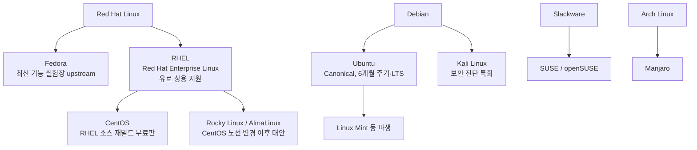

<Callout type="info">
  **이번 문서의 목표:** 이 파일을 다 읽으면 어떤 명령이 어느 배포판 계열의 것인지 즉시 판별하고, `rpm` 질의 옵션이 각각 무엇을 보여 주는지 구분하며, 라이선스별 소스 공개 의무의 범위를 대표 소프트웨어와 함께 말할 수 있게 된다.
</Callout>

## 왜 이 주제가 매 회차 나오는가

배포판·패키지·라이선스는 **암기 밀도가 가장 높은 구간**입니다. 원리를 몰라도 외우면 맞고, 외우지 않으면 원리를 알아도 틀립니다. 기출 100문항 중 대략 5~8문항이 여기서 나옵니다. 투자 대비 회수가 가장 좋은 구간이므로 반드시 확보해야 합니다.

02편에서는 "배포판이란 커널에 무엇을 더한 것인가"를 구조로 봤습니다. 이 편에서는 **시험이 실제로 묻는 세부 사항**까지 내려갑니다.

> **쉽게 말하면:** 02편이 지도였다면, 이 편은 그 지도 위 각 지점의 이름표를 정확히 외우는 단계입니다.

## 1. 배포판의 계보

### 왜 배포판이 갈라졌는가

리눅스 커널과 GNU 도구는 누구나 가져다 쓸 수 있습니다. 그러다 보니 "설치 프로그램은 어떻게 만들 것인가", "패키지를 어떤 형식으로 배포할 것인가", "안정성과 최신성 중 무엇을 우선할 것인가"에 대한 답이 갈리면서 계보가 나뉘었습니다.



### RHEL 계열의 내부 관계 — 시험이 노리는 지점

- **Fedora**는 레드햇이 후원하는 **상류**(upstream) 배포판입니다. 새 기술을 먼저 넣어 보고, 검증된 것이 RHEL로 내려갑니다. 즉 Fedora가 RHEL보다 **최신**입니다.
- **RHEL**은 유료 구독으로 기술 지원을 파는 상용 제품입니다. 소스 코드는 GPL 때문에 공개해야 합니다.
- **CentOS**는 그 공개된 소스를 그대로 다시 빌드해 무료로 배포하던 배포판입니다. RHEL과 **바이너리 호환**이 목표였습니다.
- 2020년 이후 CentOS가 CentOS Stream(RHEL의 상류)으로 노선을 바꾸면서, 기존 CentOS의 자리를 **Rocky Linux**와 **AlmaLinux**가 대체했습니다.

기출에서 "Rocky Linux, CentOS, Debian, Ubuntu" 넷을 나란히 보기로 놓는 이유가 여기 있습니다. **앞의 둘은 RHEL 계열, 뒤의 둘은 Debian 계열**입니다.

### Debian 계열의 내부 관계

- **Debian**은 자유 소프트웨어 원칙을 엄격히 지키는 커뮤니티 배포판입니다. 안정성 우선이라 패키지 버전이 보수적입니다.
- **Ubuntu**는 캐노니컬(Canonical)이 데비안을 기반으로 만든 배포판으로, 6개월마다 새 버전이 나오고 2년마다 **LTS**(Long Term Support, 장기 지원) 버전이 나옵니다.
- **Kali Linux**는 침투 테스트와 보안 진단 도구를 모아 둔 데비안 기반 배포판입니다.

여기서 기출의 함정이 나옵니다.

> 패키지 설치 및 업데이트할 때 dpkg 또는 apt-get 명령을 사용하고, 칼리 리눅스도 이 리눅스 배포판을 기반으로 만들었다.

우분투도 `dpkg`와 `apt-get`을 쓰지만, **칼리의 기반**은 우분투가 아니라 데비안입니다. 그리고 우분투 자신도 데비안 기반입니다. "여러 배포판의 공통 조상"을 묻는 문장이면 답은 데비안입니다.

## 2. 패키지 관리 — 두 계층 구조

### 왜 두 개의 도구가 있는가

패키지 관리는 두 가지 일을 합니다.

1. **파일 하나를 설치·제거하고 그 내용을 조회하는 일** — 저수준
2. **인터넷 저장소에서 필요한 패키지를 찾아 오고 의존성을 자동으로 해결하는 일** — 고수준

이 둘을 나눈 결과가 아래 표입니다.

| 계층 | RHEL 계열 | Debian 계열 | 하는 일 |
|------|-----------|-------------|---------|
| 저수준 | `rpm` | `dpkg` | 로컬 패키지 파일 설치·제거·조회. **의존성 자동 해결 없음** |
| 고수준 | `yum`, `dnf` | `apt`, `apt-get` | 저장소 검색·다운로드·**의존성 자동 해결** |
| 패키지 확장자 | `.rpm` | `.deb` | – |
| 저장소 설정 위치 | `/etc/yum.repos.d/` | `/etc/apt/sources.list` | – |

> **쉽게 말하면:** `rpm`은 "이 상자 하나를 뜯어 설치해"이고, `yum`은 "필요한 상자를 창고에서 다 찾아와서 순서대로 설치해"입니다.

`rpm`으로 설치할 때 "의존성 오류"가 나면서 필요한 패키지 이름만 알려 주고 멈추는 이유가 이것입니다. `yum install`은 그 필요한 패키지까지 알아서 가져옵니다. **dnf**는 yum의 차세대 버전으로, RHEL 8부터 기본이 되었고 명령 문법은 대부분 호환됩니다.

### rpm 질의 옵션 — 기출 최빈출

`rpm`의 옵션은 크게 설치(`-i`), 업그레이드(`-U`), 삭제(`-e`), 질의(`-q`), 검증(`-V`)으로 나뉩니다. 이 중 **질의 옵션**이 압도적으로 자주 나옵니다.

| 옵션 | 풀어 쓰면 | 무엇을 보여 주는가 |
|------|-----------|---------------------|
| `-qa` | query all | 설치된 **모든 패키지 목록** |
| `-qi` | query info | 패키지의 **상세 정보** (버전, 요약, 라이선스) |
| `-ql` | query list | 패키지가 설치한 **파일 전체 목록** |
| `-qc` | query config | 패키지의 **환경 설정 파일**만 |
| `-qd` | query documentation | 패키지의 **문서 파일**만 |
| `-qf` | query file | 이 **파일이 어느 패키지에 속하는지** 역추적 |
| `-qp` | query package | 아직 설치 안 된 **rpm 파일**을 대상으로 질의 |

기출 문항을 그대로 보면 이렇습니다.

```bash
# rpm ( 괄호 ) httpd
```

> httpd 패키지의 환경 설정 파일을 빠르고 간편하게 찾으려고 한다.

정답은 `-qc`입니다. `-ql`은 설정 파일뿐 아니라 바이너리·문서·라이브러리까지 전부 나열하므로 "빠르고 간편하게"라는 조건에 맞지 않습니다. **`c`가 config의 c**라는 연결만 잡으면 헷갈리지 않습니다.

`-qf`는 방향이 반대입니다. `rpm -qf /etc/httpd/conf/httpd.conf`처럼 **파일 경로를 주고 패키지 이름을 알아냅니다.** 목적이 정반대라는 점을 함께 기억하십시오.

### yum과 dnf 하위 명령

| 명령 | 하는 일 | 출력 특징 |
|------|---------|-----------|
| `yum install 패키지` | 설치 (의존성 포함) | – |
| `yum remove 패키지` | 삭제 | – |
| `yum update` | 전체 또는 지정 패키지 갱신 | – |
| `yum list 패키지` | 설치 가능·설치됨 여부와 **버전 한 줄** | 표 형태 한두 줄 |
| `yum info 패키지` | Name, Arch, Version, Size, Repo, **Summary, Description** | 항목별 여러 줄 |
| `yum search 키워드` | 이름·요약에서 **키워드 검색** | 후보 목록 |
| `yum provides 파일` | 그 파일을 제공하는 패키지 찾기 | – |
| `yum grouplist` | 패키지 그룹 목록 | – |

기출은 출력 화면을 던지고 명령을 되묻습니다.

```
Available Packages
Name        : telnet-server
Arch        : x86_64
Version     : 0.17
Release     : 66.el7
Size        : 41 k
Repo        : updates/7/x86_64
Summary     : The server program for the Telnet remote login protocol
Description : Telnet is a popular protocol for logging into remote systems ...
```

`Name`, `Arch`, `Summary`, `Description`이 **항목별로 줄바꿈되어 나오면 `yum info`** 입니다. `yum list`는 이런 상세 항목을 보여 주지 않고 패키지 이름·버전·저장소를 한 줄로 표시합니다. **출력 형태로 구분하는 훈련**을 해 두십시오.

### dpkg와 apt 대응표

| 목적 | RHEL 계열 | Debian 계열 |
|------|-----------|-------------|
| 로컬 파일 설치 | `rpm -ivh 파일.rpm` | `dpkg -i 파일.deb` |
| 삭제 | `rpm -e 패키지` | `dpkg -r 패키지` |
| 설치된 목록 | `rpm -qa` | `dpkg -l` |
| 파일 소속 패키지 찾기 | `rpm -qf 경로` | `dpkg -S 경로` |
| 저장소에서 설치 | `yum install`, `dnf install` | `apt install`, `apt-get install` |
| 저장소 정보 갱신 | (자동) | `apt update` |
| 캐시 검색 | `yum search` | `apt-cache search` |

**`apt update`는 설치가 아니라 저장소 목록 갱신**이라는 점이 함정입니다. 실제 업그레이드는 `apt upgrade`입니다. RHEL 계열의 `yum update`가 실제 갱신을 수행하는 것과 이름이 겹쳐 혼동을 유도합니다.

## 3. 소스 컴파일 설치와 아카이브

패키지 관리자를 쓰지 않고 소스를 직접 빌드하는 전통 방식도 출제됩니다.

<Steps>
1. **압축 해제** — `tar xvfz 소스.tar.gz`
2. **환경 설정** — `./configure --prefix=/usr/local/앱`
3. **컴파일** — `make`
4. **설치** — `make install`
</Steps>

`./configure`는 시스템에 필요한 라이브러리와 컴파일러가 있는지 검사하고 `Makefile`을 생성합니다. `--prefix`로 설치 경로를 지정합니다. 이 세 단계 순서 자체가 문항으로 나옵니다.

### tar 옵션 — 기출 단골

| 옵션 | 의미 | 기억 단서 |
|------|------|-----------|
| `c` | create, 새 아카이브 생성 | 만들기 |
| `x` | extract, 풀기 | 꺼내기 |
| `t` | list, 내용 목록만 보기 | 테이블 |
| `r` | append, **기존 아카이브에 추가** | 붙이기 |
| `u` | update, 더 최신 파일만 갱신 | – |
| `v` | verbose, 진행 상황 출력 | – |
| `f` | file, 아카이브 파일 이름 지정 | 항상 마지막에 |
| `z` | gzip 압축 함께 처리 | `.tar.gz` |
| `j` | bzip2 압축 함께 처리 | `.tar.bz2` |
| `J` | xz 압축 함께 처리 | `.tar.xz` |

기출 문항입니다.

```bash
# tar ( 괄호 ) text.tar *.c
```

> 현재 디렉터리 안에 존재하는 C 언어 파일을 **기존에 생성되어 있던** text.tar 파일에 묶는 과정이다.

여기서 결정적 단어는 **"기존에 생성되어 있던"** 입니다. 새로 만드는 것이 아니라 **추가**이므로 `c`가 아니라 `r`, 곧 `rvf`가 정답입니다. `cvf`를 쓰면 기존 내용이 통째로 날아갑니다. 백업 맥락의 `-g` 옵션(증분 백업)은 17편에서 다룹니다.

### 압축 명령 비교

| 명령 | 확장자 | 압축률 | 속도 |
|------|--------|--------|------|
| `compress` | `.Z` | 낮음 | 빠름 |
| `gzip` | `.gz` | 중간 | 빠름 |
| `bzip2` | `.bz2` | 높음 | 느림 |
| `xz` | `.xz` | 매우 높음 | 매우 느림 |

압축률 순서는 **compress 낮음 → gzip → bzip2 → xz 높음**입니다. 압축률이 높을수록 느리다는 반비례 관계를 함께 기억하십시오.

## 4. 라이선스 — 공개 의무의 범위가 전부다

### 자유 소프트웨어의 네 가지 자유

리처드 스톨먼이 정의한 자유 소프트웨어의 조건은 네 가지 자유입니다.

<Steps>
1. **실행의 자유** — 목적을 불문하고 프로그램을 실행할 자유.
2. **연구·수정의 자유** — 소스 코드를 살펴보고 고칠 자유. 소스 코드 접근이 전제입니다.
3. **재배포의 자유** — 복제본을 남에게 나눠 줄 자유.
4. **개선판 배포의 자유** — 수정한 버전을 공개할 자유.
</Steps>

여기서 "free"는 **무료가 아니라 자유**를 뜻합니다. 자유 소프트웨어도 돈을 받고 팔 수 있습니다. RHEL이 그 예입니다.

### 라이선스별 공개 의무

| 라이선스 | 유형 | 소스 공개 의무 | 특징 | 대표 소프트웨어 |
|----------|------|----------------|------|------------------|
| GPL v2/v3 | 강한 카피레프트 | 수정·배포 시 **전체 소스 공개** | 링크한 코드까지 GPL이 됨(전염성) | 리눅스 커널, GCC, bash, MySQL |
| LGPL | 약한 카피레프트 | **라이브러리 수정분만** 공개 | 동적 링크만 하면 자사 코드 비공개 가능 | glibc, LibreOffice 일부 |
| AGPL | 가장 강함 | 네트워크로 **서비스만 해도** 공개 | 웹 서비스 회피 봉쇄 | MongoDB 구버전 |
| MPL | 파일 단위 | **수정한 파일만** 공개 | 파일 경계에서 의무가 끊김 | Firefox, Thunderbird |
| BSD | 허용적 | **없음** | 저작권 표시와 면책 조항만 유지 | FreeBSD, OpenSSH, Nginx 일부 |
| Apache License 2.0 | 허용적 | **없음** | **특허권 조항**을 명시 | Hadoop, Tomcat, Android |
| MIT | 허용적 | **없음** | 가장 짧고 단순 | jQuery, Node.js 생태계 |

### 기출이 라이선스를 묻는 방식

라이선스 문항은 거의 항상 **설명 → 이름 매칭** 형식이고, 판별 단서가 두 개 들어갑니다.

| 문장 속 단서 | 가리키는 라이선스 |
|--------------|--------------------|
| 소스 공개 의무 없음 + Hadoop, Tomcat | Apache License |
| 소스 공개 의무 없음 + 저작권 표시만 유지 | BSD |
| 수정·배포 시 전체 공개 + 커널, GCC | GPL |
| 라이브러리 링크는 허용 + 공개는 라이브러리만 | LGPL |
| 수정한 파일만 공개 + Firefox | MPL |

**대표 소프트웨어를 함께 외우는 것**이 이 구간의 핵심 전략입니다. 공개 의무만 외우면 BSD와 Apache를 구분할 수 없습니다.

### 자주 틀리는 점

- **GPL은 "무조건 공개"가 아닙니다.** 배포할 때만 공개 의무가 생깁니다. 사내에서만 쓰고 배포하지 않으면 공개 의무가 없습니다.
- **Apache와 BSD를 구분하는 유일한 실전 단서는 대표 소프트웨어와 특허 조항**입니다.
- 오픈소스 라이선스와 **소프트웨어 배포 형태**(프리웨어, 셰어웨어, 상용)는 다른 축입니다. 프리웨어는 무료지만 소스가 공개되지 않은 경우가 많습니다.

## 5. 클러스터와 대규모 시스템 — 함께 출제되는 개념

배포판 이야기와 함께 나오는 것이 **클러스터**(cluster)입니다. 여러 대의 컴퓨터를 묶어 하나처럼 쓰는 구성입니다.

| 종류 | 목적 | 핵심 문장 단서 |
|------|------|-----------------|
| 고가용성 클러스터(HA, High Availability) | 장애가 나도 서비스가 끊기지 않게 | "**오류에 대비**", "이중화", "페일오버" |
| 부하분산 클러스터(LVS, Load Balancing) | 요청을 여러 서버로 분산 | "로드 밸런서", "부하 분산" |
| 고계산용 클러스터(HPC, High Performance Computing) | 대규모 연산을 나누어 처리 | "과학 계산", "슈퍼컴퓨터", **베어울프**(Beowulf) |

기출 문항입니다.

> 다수의 웹 서버를 운영 중에 웹 서버 앞단에 로드 밸런서를 이용하여 부하분산 역할을 수행하도록 구성하였다. **로드 밸런서 역할을 수행하는 시스템의 오류에 대비**하려고 한다.

문장 앞부분에 "부하분산"이 있어서 부하분산 클러스터를 고르기 쉽지만, 실제로 묻는 것은 **뒷문장의 "오류에 대비"** 입니다. 이미 부하분산은 구성되어 있고, 그 장비 자체가 죽었을 때를 대비하는 것이므로 정답은 **고가용성 클러스터**입니다. 이런 식으로 **문장의 마지막 요구사항이 정답을 정하는 구조**가 이 시험의 전형입니다.

## 핵심 정리

- RHEL 계열은 `rpm`·`yum`·`dnf`와 `.rpm`을, Debian 계열은 `dpkg`·`apt`와 `.deb`를 씁니다. **Fedora는 RHEL의 상류, CentOS와 Rocky는 RHEL 재빌드**, **우분투와 칼리는 데비안 기반**입니다.
- 저수준 도구(`rpm`, `dpkg`)는 의존성을 해결하지 않고, 고수준 도구(`yum`, `apt`)가 해결합니다.
- `rpm` 질의는 `-qa` 전체 목록, `-qi` 정보, `-ql` 파일 목록, **`-qc` 설정 파일**, `-qf` 파일의 소속 패키지 역추적입니다.
- `tar`에서 새로 만들기는 `c`, **기존 아카이브에 추가는 `r`** 입니다. 압축률은 gzip보다 bzip2, bzip2보다 xz가 높습니다.
- 라이선스는 **공개 의무 범위 + 대표 소프트웨어**로 판별합니다. GPL 전체, LGPL 라이브러리만, MPL 파일 단위, BSD와 Apache는 의무 없음입니다.
- 클러스터 문항은 문장 **마지막 요구사항**이 정답을 정합니다. "오류에 대비"가 있으면 고가용성입니다.

## 마무리 복습

<Quiz
  questionNumber={1}
  question="다음 설명에 해당하는 리눅스 배포판으로 알맞은 것은? 패키지 설치와 업데이트에 dpkg 또는 apt-get 명령을 사용하며 칼리 리눅스도 이 배포판을 기반으로 만들어졌다."
  options={['Rocky Linux', 'CentOS', 'Debian', 'Ubuntu']}
  correctAnswer={3}
  explanation="칼리 리눅스와 우분투는 모두 데비안에서 파생된 배포판이며 dpkg와 apt-get은 데비안 계열의 패키지 도구다. 우분투 자체도 데비안 기반이므로 공통 조상은 데비안이다."
  optionExplanations={['Rocky Linux는 RHEL 계열이며 dnf와 rpm을 사용한다', 'CentOS 역시 RHEL 계열이다', '정답 — 여러 배포판의 공통 기반을 묻는 문장이면 데비안이다', '우분투도 같은 도구를 쓰지만 우분투 자신이 데비안에서 파생된 배포판이다']}
/>

<Quiz
  questionNumber={2}
  question="다음 ( 괄호 ) 안에 들어갈 rpm 옵션으로 알맞은 것은? httpd 패키지의 환경 설정 파일만 빠르게 확인하려고 한다. 명령은 rpm ( 괄호 ) httpd 이다."
  options={['-qa', '-qf', '-qc', '-ql']}
  correctAnswer={3}
  explanation="질의 옵션 중 c는 config를 뜻하며 해당 패키지가 제공하는 환경 설정 파일 목록만 출력한다."
  optionExplanations={['-qa는 설치된 모든 패키지 목록을 출력한다', '-qf는 파일 경로를 주고 그 파일이 속한 패키지를 알아내는 옵션이다', '정답 — c는 config의 c로 설정 파일만 추린다', '-ql은 패키지가 설치한 모든 파일을 나열하므로 설정 파일만 빠르게 보기에는 부적합하다']}
/>

<Quiz
  questionNumber={3}
  question="다음 ( 괄호 ) 안에 들어갈 tar 옵션으로 알맞은 것은? 현재 디렉터리의 C 언어 소스 파일들을 기존에 이미 생성되어 있던 text.tar 파일에 추가로 묶으려고 한다."
  options={['cvf', 'xvf', 'tvf', 'rvf']}
  correctAnswer={4}
  explanation="기존 아카이브에 파일을 덧붙이는 옵션은 append를 뜻하는 r이다. c를 사용하면 새 아카이브를 만들면서 기존 내용이 사라진다."
  optionExplanations={['c는 새로 만들기이므로 기존 내용이 덮어써진다', 'x는 아카이브를 푸는 옵션이다', 't는 아카이브 내용 목록만 보는 옵션이다', '정답 — r은 기존 아카이브에 추가하는 옵션이다']}
/>

<Quiz
  questionNumber={4}
  question="다음 설명에 해당하는 라이선스로 알맞은 것은? 개인적 상업적 이용이 자유롭고 재배포 시 소스를 공개할 의무가 없으며 특허권 관련 조항이 명시되어 있고 대표 프로그램으로 Hadoop과 Tomcat이 있다."
  options={['Apache License', 'LGPL', 'BSD', 'MPL']}
  correctAnswer={1}
  explanation="공개 의무가 없다는 점만으로는 BSD와 구분되지 않지만 특허 조항과 Hadoop 및 Tomcat이라는 대표 프로그램이 함께 제시되면 아파치 라이선스다."
  optionExplanations={['정답 — 특허 조항과 대표 프로그램이 결정적 단서다', 'LGPL은 라이브러리 수정분에 대한 공개 의무가 있다', 'BSD도 공개 의무가 없지만 특허 조항이 없고 대표 프로그램이 다르다', 'MPL은 수정한 파일 단위로 공개 의무가 발생한다']}
/>

<Quiz
  questionNumber={5}
  question="다음 결과에 해당하는 명령으로 알맞은 것은? 출력에 Name Arch Epoch Version Release Size Repo Summary Description 항목이 줄마다 표시되었다."
  options={['yum list telnet-server', 'yum info telnet-server', 'yum check telnet-server', 'yum search telnet-server']}
  correctAnswer={2}
  explanation="패키지의 이름 아키텍처 버전 저장소 요약 설명 등을 항목별로 나열하는 것은 상세 정보 조회 명령인 yum info의 출력 형태다."
  optionExplanations={['yum list는 패키지 이름과 버전 저장소를 한 줄 표 형태로 보여 준다', '정답 — 항목별 여러 줄 출력은 info의 특징이다', 'yum check는 패키지 데이터베이스 무결성 점검용이다', 'yum search는 키워드에 맞는 후보 패키지 목록을 나열한다']}
/>

<Quiz
  questionNumber={6}
  question="다음 설명의 경우에 구성해야 할 인프라 기술로 알맞은 것은? 다수의 웹 서버 앞단에 로드 밸런서를 두어 부하분산을 구성하였고 이제 그 로드 밸런서 시스템 자체의 오류에 대비하려고 한다."
  options={['고가용성 클러스터', '부하분산 클러스터', '베어울프 클러스터', '고계산용 클러스터']}
  correctAnswer={1}
  explanation="부하분산은 이미 구성되어 있고 그 장비의 장애에 대비하는 것이 요구사항이므로 이중화를 통해 서비스 중단을 막는 고가용성 클러스터가 정답이다."
  optionExplanations={['정답 — 오류에 대비한다는 마지막 요구사항이 정답을 결정한다', '부하분산은 이미 구성된 상태이므로 새로 구성할 대상이 아니다', '베어울프는 병렬 연산을 위한 고계산용 클러스터의 한 형태다', '고계산용 클러스터는 대규모 연산 처리를 위한 구성이다']}
/>

<Quiz
  questionNumber={7}
  question="다음 중 레드햇 계열 패키지 관리 도구로 가장 거리가 먼 것은?"
  options={['dnf', 'yum', 'rpm', 'apt-get']}
  correctAnswer={4}
  explanation="apt-get은 데비안과 우분투 계열의 고수준 패키지 관리 도구다. 레드햇 계열은 저수준 도구 rpm과 고수준 도구 yum 및 dnf를 사용한다."
  optionExplanations={['dnf는 yum의 차세대 버전으로 RHEL 8부터 기본이다', 'yum은 RHEL 7 계열의 대표적인 고수준 도구다', 'rpm은 레드햇 계열의 저수준 패키지 도구다', '정답 — apt-get은 데비안 계열 도구다']}
/>

<Quiz
  questionNumber={8}
  question="다음 중 압축률이 높은 순서대로 올바르게 나열한 것은?"
  options={['compress 보다 gzip 보다 bzip2 보다 xz 가 높다', 'xz 보다 bzip2 보다 gzip 보다 compress 가 높다', 'gzip 보다 compress 보다 xz 보다 bzip2 가 높다', 'bzip2 보다 xz 보다 compress 보다 gzip 이 높다']}
  correctAnswer={1}
  explanation="압축률은 compress가 가장 낮고 gzip 다음 bzip2 그리고 xz 순으로 높아지며 압축률이 높을수록 처리 속도는 느려진다."
  optionExplanations={['정답 — 압축률이 높아지는 순서이며 속도는 그 반대로 느려진다', '순서가 정확히 반대다', 'compress가 gzip보다 높다는 부분이 틀렸다', 'gzip이 가장 높다는 부분이 틀렸다']}
/>

## 참고 자료

- [Red Hat Enterprise Linux 문서 — Managing software with the DNF tool](https://docs.redhat.com/en/documentation/red_hat_enterprise_linux/9/)
- [Debian 공식 문서 — APT 사용 안내](https://www.debian.org/doc/manuals/debian-reference/ch02.en.html)
- [GNU Operating System — 자유 소프트웨어의 정의](https://www.gnu.org/philosophy/free-sw.html)
- [Open Source Initiative — 승인된 라이선스 목록](https://opensource.org/licenses)
