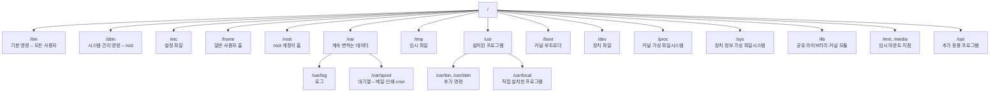
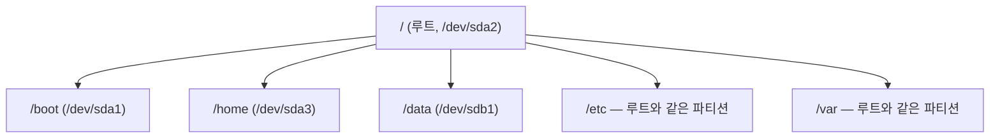

<Callout type="info">
  **이번 문서의 목표:** 이 파일을 다 읽으면 리눅스의 주요 디렉터리가 각각 무엇을 담는지 말할 수 있고, 장치 파일이 마운트를 통해 디렉터리 트리에 붙는 과정을 설명하며, `/etc/fstab` 한 줄의 여섯 필드를 전부 해석할 수 있게 된다.
</Callout>

## 왜 하나의 트리인가

윈도우는 `C:`, `D:` 처럼 **드라이브마다 별도의 최상위**를 둡니다. 리눅스는 다릅니다. 디스크가 몇 개든 파티션이 몇 개든, 사용자에게 보이는 것은 **`/`에서 시작하는 단 하나의 트리**입니다. 두 번째 디스크는 `/data`처럼 트리의 어느 지점에 **붙여서**(mount) 씁니다.

> **쉽게 말하면:** 윈도우는 서랍장마다 이름표를 붙이는 방식이고, 리눅스는 하나의 큰 나무에 서랍을 가지처럼 접붙이는 방식입니다.

이 설계 덕분에 프로그램은 "이 파일이 어느 디스크에 있는가"를 신경 쓰지 않아도 됩니다. 경로만 알면 됩니다. 대신 관리자는 **어느 지점에 무엇이 붙어 있는지** 정확히 알아야 하고, 시험은 바로 그것을 묻습니다.

## 1. FHS — 디렉터리 이름은 왜 다들 같은가

배포판이 달라도 `/etc`에 설정 파일이 있고 `/var/log`에 로그가 쌓이는 이유는 **FHS**(Filesystem Hierarchy Standard, 파일시스템 계층 표준)라는 약속 때문입니다. 리눅스 재단이 관리하는 문서로, 어떤 디렉터리에 무엇을 두는지 정해 놓았습니다.



### 헷갈리는 짝들 정리

시험은 "비슷해 보이는 두 디렉터리의 차이"를 묻습니다.

| 짝 | 차이 |
|----|------|
| `/bin` vs `/sbin` | `/bin`은 모든 사용자용 기본 명령(`ls`, `cp`), `/sbin`은 **관리자용**(`fdisk`, `ifconfig`) |
| `/bin` vs `/usr/bin` | `/bin`은 **단독 부팅과 복구에 필요한 최소 명령**, `/usr/bin`은 그 외 일반 명령 |
| `/root` vs `/` | `/root`는 root 계정의 홈 디렉터리, `/`는 최상위 루트 |
| `/tmp` vs `/var/tmp` | `/tmp`는 재부팅 시 삭제될 수 있고, `/var/tmp`는 재부팅 후에도 유지 |
| `/mnt` vs `/media` | `/mnt`는 관리자가 수동 마운트, `/media`는 USB 등 **자동 마운트** |
| `/proc` vs `/sys` | `/proc`은 프로세스·커널 정보, `/sys`는 **장치와 드라이버** 정보 |
| `/usr` vs `/usr/local` | `/usr`은 패키지로 설치된 것, `/usr/local`은 **직접 컴파일해 설치**한 것 |
| `/lib` vs `/lib64` | 32비트용과 64비트용 공유 라이브러리 |

### `/var`가 따로 있는 이유

`/var`는 variable, 곧 **계속 변하는 데이터**를 담습니다. 로그, 메일 대기열, 인쇄 대기열, 데이터베이스 파일, 웹 문서 등입니다.

`/var`를 별도 파티션으로 분리하는 것이 관리의 정석입니다. 로그가 폭주해 디스크가 가득 차더라도, `/var`만 꽉 차고 **루트 파티션은 멀쩡하기 때문**입니다. 루트가 가득 차면 시스템 자체가 동작하지 못합니다. 파티션 분할 전략은 13편에서 이어집니다.

| 경로 | 담는 것 |
|------|---------|
| `/var/log` | 시스템 로그 – `messages`, `secure`, `boot.log` |
| `/var/spool/mail` | 사용자별 메일함 |
| `/var/spool/cron` | 사용자 crontab 파일 |
| `/var/spool/lpd` | 인쇄 대기열 |
| `/var/www` | 웹 문서 루트(배포판에 따라) |
| `/var/lib` | 서비스가 관리하는 상태 데이터 – rpm DB 등 |

## 2. 장치 파일 — 디스크는 어떻게 이름이 붙는가

리눅스는 하드웨어를 `/dev` 아래의 **장치 파일**로 표현합니다.

| 장치 파일 | 무엇 |
|-----------|------|
| `/dev/sda` | 첫 번째 SATA/SCSI/USB 디스크 **전체** |
| `/dev/sda1` | 그 디스크의 **첫 번째 파티션** |
| `/dev/sdb2` | 두 번째 디스크의 두 번째 파티션 |
| `/dev/nvme0n1p1` | 첫 NVMe 디스크의 첫 파티션 |
| `/dev/hda` | 구형 IDE 디스크 (요즘은 거의 안 씀) |
| `/dev/sr0`, `/dev/cdrom` | 광학 드라이브 |
| `/dev/null` | 쓰면 사라지는 블랙홀 |
| `/dev/zero` | 읽으면 0이 무한히 나옴 |
| `/dev/random` | 난수 발생 장치 |

이름 규칙이 있습니다. **`sd` + 디스크 순서 알파벳 + 파티션 번호**입니다. `sdb3`는 "두 번째 디스크의 세 번째 파티션"입니다.

MBR 방식에서 파티션 번호에도 규칙이 있습니다. **1~4번은 기본(primary) 또는 확장(extended) 파티션**에 예약되어 있고, **5번부터가 논리(logical) 파티션**입니다. 그래서 기본 파티션이 두 개뿐이어도 논리 파티션의 첫 번호는 5입니다. 이 번호 규칙이 문항으로 나옵니다.

## 3. 마운트 — 트리에 접붙이기

### 마운트가 하는 일

**마운트**(mount)는 "이 장치의 파일시스템을 이 디렉터리 아래에서 보이게 하라"는 지시입니다.

```bash
# mount /dev/sdb1 /data
```

이 순간부터 `/data` 아래를 보면 `/dev/sdb1` 안의 내용이 나타납니다. 주의할 점은 **원래 `/data`에 있던 내용이 사라지는 것이 아니라 가려진다**는 것입니다. 마운트를 해제하면 원래 내용이 다시 보입니다.



> **쉽게 말하면:** 마운트는 새 서랍을 나무의 특정 가지에 걸어 두는 일입니다. 걸어 두면 그 가지 이름으로 접근되고, 떼면 원래 가지가 다시 보입니다.

### mount 명령의 사용법

```bash
# mount                              # 현재 마운트 상태 전부 출력
# mount -t xfs /dev/sdb1 /data       # 파일시스템 종류 지정
# mount -o ro /dev/sdb1 /data        # 읽기 전용으로
# mount -a                           # /etc/fstab의 모든 항목 마운트
# umount /data                       # 마운트 해제 (마운트 포인트로)
# umount /dev/sdb1                   # 마운트 해제 (장치명으로)
```

명령 이름이 `unmount`가 아니라 **`umount`** 라는 점이 함정으로 나옵니다. `n`이 없습니다.

`umount`가 실패하는 대표 원인은 **누군가 그 디렉터리를 쓰고 있을 때**입니다. 어떤 프로세스가 그 안을 현재 디렉터리로 삼고 있거나 파일을 열고 있으면 "device is busy" 오류가 납니다. 누가 쓰는지 확인하는 명령이 있습니다.

| 명령 | 하는 일 |
|------|---------|
| `fuser -cu /data` | 그 마운트 지점을 사용 중인 프로세스와 사용자 |
| `lsof /data` | 그 아래에서 열려 있는 파일 목록 |
| `umount -l /data` | lazy umount – 지금 분리하고 사용이 끝나면 정리 |

### 주요 마운트 옵션

| 옵션 | 의미 |
|------|------|
| `defaults` | `rw, suid, dev, exec, auto, nouser, async`를 한 번에 |
| `ro` / `rw` | 읽기 전용 / 읽기 쓰기 |
| `noexec` | 그 파일시스템의 실행 파일을 **실행 금지** |
| `nosuid` | setuid·setgid 비트를 **무시** |
| `nodev` | 장치 파일을 장치로 해석하지 않음 |
| `auto` / `noauto` | 부팅 시 자동 마운트 / 하지 않음 |
| `user` / `nouser` | 일반 사용자도 마운트 가능 / root만 |
| `sync` / `async` | 쓰기 즉시 반영 / 버퍼링 |
| `usrquota`, `grpquota` | 사용자·그룹 디스크 쿼터 활성화 |
| `remount` | 마운트를 해제하지 않고 옵션만 변경 |

보안 관점에서 `/tmp`나 사용자가 쓰는 파티션에 **`noexec,nosuid,nodev`** 를 거는 것이 정석입니다. 공격자가 `/tmp`에 악성 실행 파일을 올려도 실행되지 않게 막는 조치이며, 17편의 보안 기초에서 다시 나옵니다.

`remount`는 실전에서 자주 쓰입니다. 루트 파일시스템을 읽기 전용으로 부팅한 상태에서 다음처럼 쓰기 가능으로 바꿉니다.

```bash
# mount -o remount,rw /
```

## 4. `/etc/fstab` — 부팅 시 자동 마운트 명세

### 여섯 개의 필드

`/etc/fstab`(file system table)은 부팅할 때 무엇을 어디에 어떻게 마운트할지 적어 둔 파일입니다. 한 줄이 공백으로 구분된 **여섯 필드**로 이루어집니다.

```
UUID=8f3a-... /home  xfs  defaults  0  2
/dev/sdb1     /data  ext4 defaults,noexec 0 2
/dev/sda3     swap   swap defaults  0  0
```

| 순서 | 필드 이름 | 의미 |
|------|-----------|------|
| 1 | 장치(device) | 장치 파일 경로, UUID, 또는 LABEL |
| 2 | 마운트 포인트 | 어느 디렉터리에 붙일지. swap은 `swap` |
| 3 | 파일시스템 종류 | `xfs`, `ext4`, `swap`, `nfs`, `tmpfs` 등 |
| 4 | 마운트 옵션 | `defaults`, `ro`, `noexec` 등 쉼표로 나열 |
| 5 | dump 여부 | 1이면 `dump` 백업 대상, 0이면 제외 |
| 6 | fsck 순서 | 부팅 시 검사 순서. **0은 검사 안 함** |

**5번과 6번 필드의 의미**가 시험의 핵심입니다.

- 5번(dump) — 지금은 거의 0을 씁니다. `dump` 명령으로 백업할 대상인지 표시하는 낡은 필드입니다.
- 6번(fsck 순서) — **루트 파일시스템은 반드시 1**, 나머지 일반 파일시스템은 **2**, 검사하지 않을 것은 **0**입니다. 같은 번호끼리는 병렬로 검사됩니다. **swap과 네트워크 파일시스템은 0**입니다.

### 왜 UUID를 쓰는가

장치 이름 `/dev/sdb1`은 **고정된 이름이 아닙니다.** 디스크를 추가하거나 순서를 바꿔 꽂으면 `sdb`가 `sdc`가 될 수 있습니다. 그러면 fstab의 마운트가 엉뚱한 디스크를 가리키거나 부팅이 실패합니다.

**UUID**(Universally Unique Identifier, 범용 고유 식별자)는 파일시스템을 만들 때 부여되는 고유 번호로, 디스크를 어디에 꽂아도 변하지 않습니다. 그래서 현대 배포판은 fstab에 UUID를 씁니다. 확인 명령은 `blkid`입니다.

```bash
# blkid
/dev/sda1: UUID="9c2f3d1a-..." TYPE="xfs"
/dev/sdb1: UUID="a1b2c3d4-..." TYPE="ext4" LABEL="DATA"
```

### fstab을 잘못 쓰면 부팅이 안 된다

존재하지 않는 장치를 fstab에 적어 두면, 부팅 중 마운트에 실패해 **응급 모드**(emergency mode)로 떨어집니다. 그래서 편집 후에는 재부팅 전에 반드시 다음을 실행해 검증합니다.

```bash
# mount -a
```

오류 없이 끝나면 안전합니다. 이 습관 자체가 문항으로 나오기도 합니다.

## 5. 파일시스템 종류와 관리 명령

### 주요 파일시스템

| 이름 | 특징 |
|------|------|
| ext2 | 저널링 없음. 구형 |
| ext3 | ext2에 **저널링** 추가 |
| ext4 | 대용량·성능 개선. 데비안 계열 기본 |
| XFS | 대용량 파일에 강함. **RHEL 7 이후 기본** |
| Btrfs | 스냅샷·풀링 지원 |
| swap | 스왑 전용 |
| tmpfs | 메모리 기반 임시 파일시스템 |
| iso9660 | CD/DVD |
| NTFS, FAT32 | 윈도우 파일시스템 |
| NFS | 네트워크 파일시스템 (23편) |

**저널링**(journaling)은 파일을 쓰기 전에 "무엇을 쓸 것인지"를 저널 영역에 먼저 기록하는 기법입니다. 정전으로 작업이 중간에 끊겨도 저널을 보고 복구할 수 있어 `fsck` 시간이 극적으로 줄어듭니다. **ext2에는 저널링이 없고 ext3부터 있다**는 사실이 자주 출제됩니다.

### 생성·검사·확인 명령

| 목적 | 명령 | 비고 |
|------|------|------|
| 파일시스템 생성 | `mkfs -t ext4 /dev/sdb1`, `mkfs.xfs /dev/sdb1` | 포맷 |
| 스왑 생성 | `mkswap /dev/sda3` | 이후 `swapon`으로 활성화 |
| 파일시스템 검사 | `fsck -t ext4 /dev/sdb1` | **반드시 언마운트 후** |
| XFS 검사 | `xfs_repair /dev/sdb1` | XFS는 fsck 대신 |
| 디스크 사용량 | `df -h` | 파일시스템 단위 |
| 디렉터리 사용량 | `du -sh /var/log` | 경로 단위 |
| 파일시스템 정보 | `dumpe2fs`, `tune2fs -l` | ext 계열 |
| 블록 장치 목록 | `lsblk`, `blkid` | – |

`df`와 `du`의 구분이 자주 나옵니다. **`df`는 disk free — 파일시스템 전체의 남은 용량**, **`du`는 disk usage — 특정 디렉터리가 차지한 용량**입니다.

마운트된 파일시스템에 `fsck`를 돌리면 파일시스템이 손상될 수 있습니다. 반드시 **언마운트하거나 단일 사용자 모드**에서 실행해야 한다는 점이 함정 보기로 나옵니다.

## 핵심 정리

- 리눅스는 모든 장치를 **하나의 `/` 트리**에 마운트해 사용하며, 마운트는 원래 내용을 지우지 않고 가립니다.
- FHS 기준으로 `/etc` 설정, `/var` 가변 데이터, `/bin`과 `/sbin`은 일반·관리자 명령, `/usr/local`은 직접 설치한 프로그램입니다.
- 장치 이름은 **`sd` + 알파벳 + 파티션 번호**이며, MBR에서 **논리 파티션은 5번부터** 시작합니다.
- 마운트 해제 명령은 `unmount`가 아니라 **`umount`** 이고, 사용 중이면 실패하므로 `fuser`나 `lsof`로 확인합니다.
- `/etc/fstab`은 **장치, 마운트 포인트, 종류, 옵션, dump, fsck 순서**의 여섯 필드이며 **루트는 fsck 1, 일반은 2, 검사 안 함은 0**입니다.
- 장치 이름이 바뀔 수 있으므로 fstab에는 **UUID**를 쓰고, `blkid`로 확인합니다. 편집 후에는 `mount -a`로 검증합니다.
- **ext2에는 저널링이 없고 ext3부터 지원**하며, RHEL 7 이후 기본 파일시스템은 XFS입니다.

## 마무리 복습

<Quiz
  questionNumber={1}
  question="다음 중 etc fstab 파일의 필드 구성과 의미로 알맞은 것은?"
  options={['장치 마운트포인트 종류 옵션 dump fsck순서 의 6개 필드로 구성된다', '장치 마운트포인트 종류 옵션 의 4개 필드로 구성된다', '마운트포인트 장치 옵션 종류 순서로 구성된다', '장치 종류 옵션 마운트포인트 의 순서로 구성된다']}
  correctAnswer={1}
  explanation="fstab 한 줄은 장치, 마운트 포인트, 파일시스템 종류, 마운트 옵션, dump 대상 여부, fsck 검사 순서의 여섯 필드로 이루어진다."
  optionExplanations={['정답 — 여섯 필드의 순서까지 정확하다', 'dump와 fsck 순서 두 필드가 빠졌다', '첫 두 필드의 순서가 뒤바뀌었다', '마운트 포인트는 두 번째 필드다']}
/>

<Quiz
  questionNumber={2}
  question="etc fstab 파일의 여섯 번째 필드에 대한 설명으로 알맞은 것은?"
  options={['0이면 부팅 시 반드시 검사하고 1이면 검사하지 않는다', '루트 파일시스템은 1 일반 파일시스템은 2 검사하지 않을 것은 0으로 지정한다', '숫자가 클수록 먼저 검사한다', 'dump 백업 대상 여부를 지정하는 필드다']}
  correctAnswer={2}
  explanation="여섯 번째 필드는 부팅 시 fsck 검사 순서로 루트는 1 나머지 일반 파일시스템은 2 검사하지 않을 대상은 0을 지정한다. dump 여부는 다섯 번째 필드다."
  optionExplanations={['0이 검사하지 않음이고 1이 우선 검사이므로 반대로 설명했다', '정답 — 루트 우선 검사 후 나머지를 병렬 검사한다', '숫자가 작을수록 먼저 검사하며 0은 검사 제외다', 'dump 여부는 다섯 번째 필드의 역할이다']}
/>

<Quiz
  questionNumber={3}
  question="다음 설명에 해당하는 디렉터리로 알맞은 것은? 로그와 메일 대기열 인쇄 대기열처럼 시스템 운영 중 크기가 계속 변하는 데이터를 담으며 별도 파티션으로 분리하는 것이 권장된다."
  options={['/etc', '/var', '/usr', '/opt']}
  correctAnswer={2}
  explanation="variable을 뜻하는 var 디렉터리가 계속 변하는 데이터를 담는다. 로그 폭주로 디스크가 가득 차더라도 루트 파티션이 영향을 받지 않도록 분리하는 것이 관리 정석이다."
  optionExplanations={['etc는 설정 파일을 담는 디렉터리다', '정답 — 로그와 스풀 데이터가 여기에 쌓인다', 'usr는 설치된 프로그램과 라이브러리를 담는다', 'opt는 추가로 설치한 응용 프로그램용 디렉터리다']}
/>

<Quiz
  questionNumber={4}
  question="다음 중 df 명령과 du 명령의 차이에 대한 설명으로 알맞은 것은?"
  options={['df는 디렉터리 단위 사용량을 du는 파일시스템 단위 여유 공간을 보여 준다', 'df는 파일시스템 단위 여유 공간을 du는 디렉터리 단위 사용량을 보여 준다', '두 명령의 출력은 항상 동일하다', 'df는 마운트된 파일시스템에는 사용할 수 없다']}
  correctAnswer={2}
  explanation="df는 disk free의 약자로 파일시스템별 전체 용량과 남은 용량을 보여 주고 du는 disk usage의 약자로 지정한 디렉터리 이하가 차지한 용량을 계산한다."
  optionExplanations={['두 명령의 역할이 정확히 뒤바뀐 설명이다', '정답 — 이름의 free와 usage가 그대로 역할을 가리킨다', '삭제되었지만 열려 있는 파일 등의 이유로 두 결과는 다를 수 있다', 'df는 마운트된 파일시스템을 대상으로 하는 명령이다']}
/>

<Quiz
  questionNumber={5}
  question="MBR 방식으로 분할된 디스크에서 논리 파티션에 부여되는 첫 번째 번호로 알맞은 것은?"
  options={['1번', '4번', '5번', '기본 파티션 개수에 따라 달라진다']}
  correctAnswer={3}
  explanation="MBR 방식에서 1번부터 4번까지는 기본 파티션과 확장 파티션을 위해 예약되어 있으므로 논리 파티션은 기본 파티션 개수와 무관하게 항상 5번부터 시작한다."
  optionExplanations={['1번은 첫 번째 기본 파티션에 배정된다', '4번까지는 기본과 확장 파티션의 자리다', '정답 — 기본 파티션이 두 개뿐이어도 논리 파티션은 5번부터다', '기본 파티션 개수와 무관하게 5번으로 고정된다']}
/>

<Quiz
  questionNumber={6}
  question="다음 중 파일시스템 저널링에 대한 설명으로 틀린 것은?"
  options={['쓰기 작업을 미리 기록해 두어 비정상 종료 후 복구를 돕는다', '저널링이 있으면 fsck에 걸리는 시간이 크게 줄어든다', 'ext2는 저널링을 지원하고 ext3부터 저널링이 제거되었다', 'XFS도 저널링을 지원하는 파일시스템이다']}
  correctAnswer={3}
  explanation="저널링이 없는 것은 ext2이고 ext3부터 저널링이 추가되었다. 순서를 반대로 서술한 보기가 오답으로 자주 제시된다."
  optionExplanations={['저널링의 정의 그대로다', '복구 대상을 저널 기록으로 한정할 수 있어 검사 시간이 줄어든다', '정답(틀린 설명) — ext2에 없던 저널링이 ext3부터 추가되었다', 'XFS는 저널링 파일시스템이 맞다']}
/>

<Quiz
  questionNumber={7}
  question="마운트를 해제하려 했으나 device is busy 오류가 발생했다. 원인을 확인하기 위한 명령으로 가장 알맞은 것은?"
  options={['df -h 로 여유 공간을 확인한다', 'fuser -cu 마운트포인트 로 사용 중인 프로세스를 확인한다', 'blkid 로 UUID를 확인한다', 'mkfs 로 파일시스템을 다시 만든다']}
  correctAnswer={2}
  explanation="해당 마운트 지점을 현재 디렉터리로 쓰거나 파일을 열고 있는 프로세스가 있으면 언마운트가 실패한다. fuser나 lsof로 그 프로세스를 찾아 종료한 뒤 다시 시도한다."
  optionExplanations={['여유 공간과 언마운트 실패는 관련이 없다', '정답 — 사용 중인 프로세스와 사용자를 확인할 수 있다', 'UUID 확인은 원인 파악과 무관하다', '파일시스템을 다시 만들면 데이터가 모두 사라진다']}
/>

<Quiz
  questionNumber={8}
  question="다음 중 마운트 옵션에 대한 설명으로 알맞은 것은?"
  options={['noexec는 그 파일시스템의 실행 파일 실행을 금지한다', 'nosuid는 장치 파일을 인식하지 않게 한다', 'remount는 파일시스템을 새로 포맷한다', 'noauto는 일반 사용자의 마운트를 금지한다']}
  correctAnswer={1}
  explanation="noexec는 해당 파일시스템에 있는 실행 파일의 실행을 막는 옵션으로 tmp 같은 공개 쓰기 영역에 적용해 보안을 강화한다."
  optionExplanations={['정답 — 임시 디렉터리 보안 강화에 쓰이는 대표 옵션이다', 'nosuid는 setuid와 setgid 비트를 무시하는 옵션이며 장치 파일 무시는 nodev다', 'remount는 옵션만 다시 적용하는 것으로 포맷과 무관하다', 'noauto는 부팅 시 자동 마운트를 하지 않는 옵션이며 일반 사용자 마운트 금지는 nouser다']}
/>

## 참고 자료

- [Linux Foundation — Filesystem Hierarchy Standard 3.0](https://refspecs.linuxfoundation.org/FHS_3.0/fhs/index.html)
- [man7.org — mount(8) 매뉴얼 페이지](https://man7.org/linux/man-pages/man8/mount.8.html)
- [man7.org — fstab(5) 매뉴얼 페이지](https://man7.org/linux/man-pages/man5/fstab.5.html)
