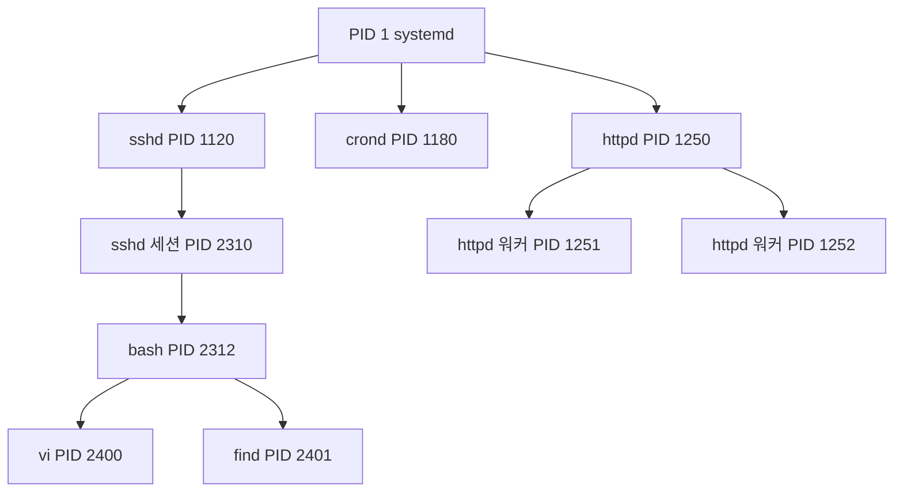
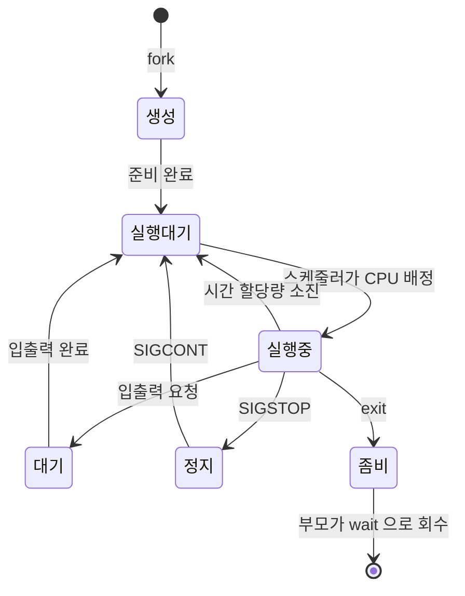

<Callout type="info">
  **이번 문서의 목표:** 이 파일을 다 읽으면 `ps`와 `top` 출력의 각 컬럼을 해석할 수 있고, 프로세스 상태 코드와 주요 시그널 번호를 말할 수 있으며, 잡 제어 명령과 우선순위 조정 명령을 상황에 맞게 고를 수 있게 된다.
</Callout>

## 왜 프로세스가 시험의 중심인가

프로세스는 1과목에서 가장 많은 문항이 나오는 주제입니다. 시그널 번호, 잡 제어, 우선순위, 프로세스 종료 명령이 매 회차 반복됩니다. 그런데 이 문항들의 보기는 항상 **역할이 비슷한 명령 넷**입니다.

- `kill`, `killall`, `pgrep`, `pkill`
- `bg`, `fg`, `jobs`, `nohup`
- `nice`, `renice`

즉 프로세스 문항은 **개별 명령의 존재가 아니라 명령들 사이의 경계**를 묻습니다. 그 경계를 만드는 것은 "PID를 받는가 이름을 받는가", "지금 실행 중인가 아직 실행 전인가" 같은 단순한 기준입니다. 이 편은 그 기준을 하나씩 세웁니다.

> **쉽게 말하면:** 프로세스 명령 문항은 "무엇을 인자로 받는가"만 정리하면 절반이 풀립니다.

## 1. 프로세스란 무엇인가

### 프로그램과 프로세스

- **프로그램**(program) — 디스크에 저장된 실행 파일. 정적인 명령어 덩어리입니다.
- **프로세스**(process) — 그 프로그램이 메모리에 올라가 **실행 중인 상태**. 자신만의 메모리 공간, 열린 파일 목록, 상태를 가집니다.

같은 프로그램 하나로 여러 프로세스를 만들 수 있습니다. 터미널 세 개에서 각각 `vi`를 실행하면 프로그램은 하나지만 프로세스는 셋입니다.

> **쉽게 말하면:** 프로그램은 요리 레시피이고, 프로세스는 그 레시피로 지금 요리하고 있는 한 판입니다. 레시피 하나로 여러 판을 동시에 만들 수 있습니다.

### 프로세스와 스레드

**스레드**(thread, 실)는 프로세스 안에서 실행되는 흐름의 단위입니다.

| 구분 | 프로세스 | 스레드 |
|------|----------|--------|
| 메모리 공간 | 각자 **독립** | 같은 프로세스 안에서 **공유** |
| 생성 비용 | 큼 | 작음 |
| 하나가 죽으면 | 다른 프로세스는 무사 | 프로세스 전체가 영향 |
| 통신 방법 | 파이프·소켓 등 IPC 필요 | 공유 메모리를 직접 사용 |

리눅스 커널은 스레드를 사실상 "메모리를 공유하는 프로세스"로 다루며, 이를 **LWP**(Light Weight Process, 경량 프로세스)라고 부릅니다.

### 데몬

**데몬**(daemon)은 백그라운드에서 조용히 돌면서 요청을 기다리는 서비스 프로세스입니다. 이름 끝에 `d`가 붙는 관례가 있습니다 — `sshd`, `httpd`, `crond`, `rsyslogd`. 터미널에 연결되지 않고, 부모가 보통 PID 1입니다.

데몬의 실행 방식은 두 가지로 나뉘며 이 구분이 출제됩니다.

| 방식 | 설명 | 예 |
|------|------|-----|
| **standalone** | 부팅 시 항상 떠 있으며 직접 요청을 받음. 빠르지만 메모리 상주 | `httpd`, `sshd` |
| **inetd/xinetd** (슈퍼 데몬) | 슈퍼 데몬이 대기하다 요청이 오면 그때 해당 데몬 실행. 메모리 절약, 응답 느림 | `telnet`, `tftp` |

TCP Wrapper와 `libwrap.so` 이야기가 여기 연결되며, 20편에서 다시 나옵니다.

## 2. 프로세스 트리 — PID와 PPID

### 모든 프로세스는 부모가 있다

02편에서 본 대로 프로세스는 `fork`로 복제되어 태어납니다. 그래서 각 프로세스는 두 개의 번호를 가집니다.

- **PID**(Process ID) — 자기 번호
- **PPID**(Parent Process ID) — 자신을 만든 부모의 번호

커널이 만든 최초의 프로세스가 **PID 1**(systemd 또는 init)이며, 나머지 모든 프로세스는 이 프로세스의 자손입니다.



`pstree` 명령이 이 트리를 그대로 그려 줍니다.

### 좀비와 고아

| 용어 | 상황 | 어떻게 되는가 |
|------|------|---------------|
| **좀비 프로세스**(zombie) | 자식은 끝났는데 부모가 `wait`으로 종료 상태를 회수하지 않음 | 프로세스 표에 `Z` 상태로 남아 자리만 차지 |
| **고아 프로세스**(orphan) | 부모가 먼저 죽음 | **PID 1이 입양**해서 나중에 정리 |

좀비는 이미 죽은 프로세스라 `kill`로 죽일 수 없습니다. **부모 프로세스를 종료해야** 고아가 되어 PID 1이 정리합니다. 이 논리가 문항으로 나옵니다.

## 3. 프로세스 상태 — ps 출력의 STAT 컬럼

프로세스는 살아 있는 동안 여러 상태를 오갑니다.



`ps` 출력의 STAT 컬럼에 나오는 문자는 다음과 같습니다.

| 코드 | 상태 | 뜻 |
|------|------|-----|
| `R` | Running / Runnable | 실행 중이거나 실행 대기 중 |
| `S` | Interruptible Sleep | 이벤트를 기다리는 중. 시그널로 깨울 수 있음 |
| `D` | Uninterruptible Sleep | 주로 디스크 입출력 대기. **시그널로도 못 깨움** |
| `T` | Stopped | 정지됨. `SIGSTOP`이나 Ctrl+Z |
| `Z` | Zombie | 종료했으나 회수되지 않음 |
| `s` | session leader | 세션 리더 |
| `+` | foreground | 포그라운드 작업 그룹 소속 |
| `<` | high priority | 우선순위 높음(음수 nice) |
| `N` | low priority | 우선순위 낮음(양수 nice) |

`D` 상태가 자주 나옵니다. 디스크가 고장 나서 응답이 없으면 프로세스가 `D` 상태로 굳고, `kill -9`로도 죽지 않습니다. **커널 안에서 입출력을 기다리는 중이라 시그널을 받을 수 없기 때문**입니다.

## 4. ps와 top — 출력 읽기

### ps의 두 문법 계열

`ps`는 역사적 이유로 두 계열의 옵션 표기를 모두 받습니다.

| 계열 | 표기 | 대표 조합 |
|------|------|-----------|
| BSD 계열 | 하이픈 없음 | `ps aux` |
| System V 계열 | 하이픈 있음 | `ps -ef` |

```
$ ps aux
USER  PID %CPU %MEM    VSZ   RSS TTY  STAT START   TIME COMMAND
root    1  0.0  0.3 128404  6720 ?    Ss   09:01   0:03 /usr/lib/systemd/systemd
posein 2312 0.0 0.1 116560  3216 pts/0 Ss  09:15   0:00 -bash
posein 2400 1.2 0.5 214880 10240 pts/0 S+  09:20   0:02 vi report.txt
```

| 컬럼 | 의미 |
|------|------|
| USER | 프로세스를 실행한 사용자 |
| PID | 프로세스 번호 |
| %CPU, %MEM | CPU와 메모리 점유율 |
| VSZ | 가상 메모리 크기(KB) |
| RSS | 실제 물리 메모리 점유(Resident Set Size) |
| TTY | 연결된 터미널. **물음표면 터미널 없음 = 데몬** |
| STAT | 프로세스 상태 |
| START | 시작 시각 |
| TIME | 누적 CPU 사용 시간 |
| COMMAND | 실행 명령 |

`ps -ef`는 컬럼 구성이 다릅니다. 여기서는 **PPID 컬럼이 함께 나온다**는 점이 중요합니다.

```
$ ps -ef
UID   PID  PPID  C STIME TTY      TIME CMD
root    1     0  0 09:01 ?    00:00:03 /usr/lib/systemd/systemd
posein 2400 2312 1 09:20 pts/0 00:00:02 vi report.txt
```

부모 자식 관계를 확인하려면 `ps -ef`(또는 `ps -ejH`, `pstree`)를 씁니다. `ps aux`에는 PPID가 없습니다.

### top 출력 첫 줄들

```
top - 22:42:18 up  9:01,  3 users,  load average: 0.00, 0.03, 0.05
Tasks: 180 total,   1 running, 179 sleeping,   0 stopped,   0 zombie
%Cpu(s):  1.3 us,  0.7 sy,  0.0 ni, 97.7 id,  0.3 wa,  0.0 hi,  0.0 si
KiB Mem : 3865284 total,  220156 free, 1109216 used, 2535912 buff/cache
```

| 항목 | 의미 |
|------|------|
| up | 부팅 후 경과 시간(uptime) |
| load average | 1분, 5분, 15분 평균 부하 |
| us (user) | 사용자 공간 코드 실행 비율 |
| sy (system) | **커널 공간 실행 비율** – 시스템 콜 부담 |
| ni (nice) | 우선순위가 조정된 프로세스 비율 |
| id (idle) | 유휴 비율 |
| wa (iowait) | **입출력 대기 비율** – 높으면 디스크 병목 |
| si, hi | 소프트웨어·하드웨어 인터럽트 |

**load average**는 "실행 대기 중이거나 입출력 대기 중인 프로세스의 평균 개수"입니다. CPU 코어가 4개인데 load average가 4.0이면 딱 포화 상태입니다. 백분율이 아니라는 점이 함정으로 나옵니다.

`wa` 값이 높으면 CPU가 놀면서 디스크를 기다리고 있다는 뜻이므로, CPU를 늘려도 소용이 없습니다. 성능 분석 관점은 16편에서 이어집니다.

### 접속 사용자 확인 명령

기출은 출력 화면을 주고 명령을 되묻습니다.

```
 22:42:18 up 9:01,  3 users,  load average: 0.00, 0.03, 0.05
USER     TTY      FROM             LOGIN@   IDLE   JCPU   PCPU WHAT
root     :0       :0               Mon21   7xdm?  1:19   0.20s /usr/libexec/gn
root     pts/0    :0               Mon21  10.00s  0.14s  0.07s -bash
```

| 명령 | 출력 특징 |
|------|-----------|
| `w` | **load average 줄 + WHAT 컬럼**. 무엇을 하고 있는지까지 |
| `who` | 사용자, 터미널, 로그인 시각 정도 |
| `users` | 사용자 이름만 한 줄로 나열 |
| `last` | `/var/log/wtmp` 기반 **과거 로그인 기록** |
| `lastb` | `/var/log/btmp` 기반 **실패한 로그인 기록** |
| `lastlog` | 사용자별 마지막 로그인 시각 |

위 출력의 정답은 `w`입니다. 판별 단서는 첫 줄의 load average와 마지막 `WHAT` 컬럼입니다.

## 5. 시그널 — 프로세스에 보내는 신호

### 시그널이란

**시그널**(signal)은 커널이나 다른 프로세스가 특정 프로세스에게 보내는 **비동기 알림**입니다. 프로세스는 시그널마다 기본 동작을 가지고 있으며, 대부분은 프로그램이 처리 방식을 바꿀 수 있습니다.

| 번호 | 이름 | 기본 동작 | 발생 상황 |
|------|------|-----------|-----------|
| 1 | SIGHUP | 종료 | 터미널 연결 끊김. 데몬에서는 **설정 재읽기** 관례 |
| 2 | SIGINT | 종료 | **Ctrl+C** |
| 3 | SIGQUIT | 종료 + 코어 덤프 | Ctrl+역슬래시 |
| 9 | SIGKILL | 강제 종료 | **가로채거나 무시할 수 없음** |
| 15 | SIGTERM | 정상 종료 요청 | `kill`의 **기본값** |
| 18 | SIGCONT | 계속 실행 | 정지된 프로세스 재개 |
| 19 | SIGSTOP | 정지 | **가로챌 수 없음** |
| 20 | SIGTSTP | 정지 | **Ctrl+Z** – 가로챌 수 있음 |

시험이 노리는 지점은 두 가지입니다.

**첫째, 번호 순서.** "번호가 가장 큰 시그널"을 묻는 문항이 나온 적이 있습니다. SIGINT(2), SIGQUIT(3), SIGKILL(9), SIGSTOP(19) 중에서는 **SIGSTOP이 19로 가장 큽니다.** 9번 SIGKILL이 "가장 강력하다"는 인상 때문에 큰 번호처럼 느껴지지만 번호는 9입니다.

**둘째, 가로챌 수 없는 시그널.** 프로그램이 무시하거나 처리 방식을 바꿀 수 없는 시그널은 **SIGKILL(9)과 SIGSTOP(19)** 둘뿐입니다.

**셋째, SIGSTOP과 SIGTSTP의 차이.** Ctrl+Z가 보내는 것은 19번이 아니라 **20번 SIGTSTP**입니다. 프로그램이 가로챌 수 있습니다.

### 시그널을 보내는 명령들

| 명령 | 인자로 받는 것 | 특징 |
|------|-----------------|------|
| `kill` | **PID** | 기본 시그널은 15(SIGTERM) |
| `killall` | **프로세스 이름** | 같은 이름 전부에게 |
| `pkill` | **프로세스 이름·패턴** | 이름 외에 사용자·터미널 조건도 가능 |
| `pgrep` | **프로세스 이름·패턴** | 죽이지 않고 **PID만 찾아 출력** |

```bash
$ kill 2400              # PID 2400에 SIGTERM
$ kill -9 2400           # SIGKILL로 강제 종료
$ kill -HUP 1120         # 이름으로도 지정 가능
$ killall httpd          # httpd라는 이름의 프로세스 전부
$ pkill -u posein        # posein 사용자의 프로세스 전부
$ pgrep -l httpd         # httpd 프로세스의 PID와 이름 출력
```

기출 문항입니다.

```bash
# ( 괄호 ) httpd
```

> 다음 ( 괄호 ) 안에 들어갈 수 있는 명령어와 **틀린** 것은?

정답은 `kill`입니다. `killall`, `pkill`, `pgrep`은 **프로세스 이름을 인자로 받지만**, `kill`은 **PID 숫자만** 받기 때문입니다. `kill httpd`는 오류가 납니다. 이 한 가지 기준이 문항 전체를 가릅니다.

`kill -9`를 습관적으로 쓰는 것은 좋지 않습니다. SIGTERM은 프로그램이 받아서 파일을 저장하고 정리한 뒤 종료할 기회를 주지만, SIGKILL은 그 기회 없이 커널이 즉시 제거하므로 데이터가 손상될 수 있습니다.

## 6. 잡 제어 — 포그라운드와 백그라운드

### 개념

- **포그라운드**(foreground) — 터미널을 점유하고 실행되는 작업. 끝날 때까지 다른 명령을 칠 수 없습니다.
- **백그라운드**(background) — 뒤에서 실행되는 작업. 프롬프트가 즉시 돌아옵니다.

명령 끝에 `&`를 붙이면 처음부터 백그라운드로 실행됩니다.

```bash
$ find / -name "*.log" > result.txt &
[1] 2401
```

`[1]`이 **작업 번호**(job number), `2401`이 PID입니다. 이 둘의 구분이 시험의 핵심입니다.

| 개념 | 범위 | 표기 |
|------|------|------|
| PID | **시스템 전체**에서 고유 | 숫자 |
| 작업 번호 | **현재 셸 안에서만** 유효 | `%1`, `%2` |

### 잡 제어 명령

| 명령 | 하는 일 | 인자 |
|------|---------|------|
| `jobs` | 현재 셸의 백그라운드·정지 작업 목록 | – |
| `bg %1` | 정지된 작업을 **백그라운드로** 재개 | **작업 번호** |
| `fg %1` | 작업을 **포그라운드로** 전환 | **작업 번호** |
| Ctrl+Z | 실행 중인 포그라운드 작업을 **정지** | – |
| Ctrl+C | 포그라운드 작업에 SIGINT 전송 | – |
| `nohup 명령 &` | 로그아웃해도 계속 실행 (SIGHUP 무시) | – |
| `disown` | 셸의 작업 목록에서 떼어 냄 | 작업 번호 |

```bash
$ jobs
[1]+  Stopped                 vi report.txt
[2]-  Running                 find / -name "*.log" &
```

기출 문항입니다.

> 프로세스 아이디가 513번이고 작업 번호는 3인 백그라운드 프로세스를 포그라운드로 전환하려고 한다.

정답은 `fg 3`입니다. `fg`와 `bg`는 **작업 번호를 받습니다.** PID인 513을 넣으면 안 됩니다. 문제에 PID와 작업 번호를 함께 제시하는 것 자체가 이 구분을 노린 함정입니다.

`nohup`도 자주 나옵니다. 터미널을 닫으면 그 터미널에 붙은 프로세스에게 **SIGHUP**(1번)이 전달되어 종료됩니다. `nohup`으로 실행하면 이 시그널을 무시하므로 로그아웃 후에도 살아남습니다. 출력은 기본적으로 `nohup.out` 파일에 쌓입니다.

## 7. 우선순위 — PRI와 NI

### 두 개의 숫자

| 항목 | 정체 | 범위 | 사용자가 바꿀 수 있는가 |
|------|------|------|--------------------------|
| **PRI** (Priority) | 커널이 계산한 **실제 우선순위** | 0–139 (표시 방식은 도구마다 다름) | **불가 – 커널이 계산** |
| **NI** (Nice) | 사용자가 주는 **양보 값** | **-20 – 19** | **가능** |

`nice` 값의 이름이 "친절함"인 이유가 재미있습니다. **값이 클수록 다른 프로세스에게 CPU를 잘 양보한다**는 뜻이므로, 값이 클수록 우선순위가 **낮습니다.** 반대로 -20은 가장 이기적이어서 우선순위가 가장 높습니다.

- **-20** — 가장 높은 우선순위 (root만 지정 가능)
- **0** — 기본값
- **19** — 가장 낮은 우선순위

일반 사용자는 **NI 값을 올릴 수만 있고 낮출 수 없습니다.** 자기 프로세스의 우선순위를 마음대로 높이면 시스템이 무너지기 때문입니다.

기출 문항입니다.

> 프로세스 우선순위와 관련된 항목에는 NI와 PRI가 있다. ( ㉠ )는 사용자가 명령어를 이용해 값을 변경할 수 있고, 지정할 수 있는 값의 범위는 ( ㉡ )이다.

정답은 **㉠ NI, ㉡ -20 ~ 19**입니다. 보기에는 `-19 ~ 20`이라는 뒤집힌 범위가 반드시 함께 나옵니다. **음수 쪽이 20, 양수 쪽이 19**임을 정확히 외우십시오.

### nice와 renice

| 명령 | 대상 | 문법 |
|------|------|------|
| `nice` | **아직 실행하지 않은** 명령 | `nice -n 10 명령` |
| `renice` | **이미 실행 중인** 프로세스 | `renice 5 -p 513` |

이 구분이 문항을 가릅니다. "PID가 513인 bash 프로세스의 NI 값을 변경하려면"이라는 문장에서 이미 실행 중임을 알 수 있으므로 `renice`입니다. 보기에 `nice -5 513`, `nice -5 bash`, `renice -5 513`, `renice -5 bash`가 나오면, **실행 중인 프로세스 + PID 지정**이라는 두 조건을 모두 만족하는 것은 `renice`에 PID를 준 형태뿐입니다.

우선순위를 **낮추려면** NI 값을 양수로 올려야 한다는 점도 함께 기억하십시오.

## 핵심 정리

- 프로세스는 실행 중인 프로그램이며, `fork`로 태어나 **PID와 PPID**로 트리를 이룹니다. 부모가 먼저 죽은 고아는 **PID 1이 입양**하고, 회수되지 않은 종료 프로세스는 **좀비**로 남습니다.
- 상태 코드는 `R` 실행, `S` 인터럽트 가능 대기, **`D` 인터럽트 불가 대기**, `T` 정지, `Z` 좀비입니다.
- 주요 시그널은 **SIGINT 2, SIGQUIT 3, SIGKILL 9, SIGTERM 15, SIGSTOP 19, SIGTSTP 20**이며, 가로챌 수 없는 것은 **9번과 19번**입니다.
- **`kill`은 PID를 받고, `killall`·`pkill`·`pgrep`은 프로세스 이름을 받습니다.**
- **`fg`와 `bg`는 작업 번호를 받습니다.** PID가 아닙니다. `nohup`은 SIGHUP을 무시해 로그아웃 후에도 실행을 유지합니다.
- 우선순위는 **NI만 사용자가 조정**할 수 있고 범위는 **-20에서 19**입니다. 실행 전은 `nice`, 실행 중은 `renice`이며 값이 클수록 우선순위가 낮습니다.

## 마무리 복습

<Quiz
  questionNumber={1}
  question="다음 중 시그널 번호가 가장 큰 것으로 알맞은 것은?"
  options={['SIGINT', 'SIGKILL', 'SIGSTOP', 'SIGQUIT']}
  correctAnswer={3}
  explanation="주요 시그널 번호는 SIGINT가 2 SIGQUIT가 3 SIGKILL이 9 SIGSTOP이 19이므로 번호가 가장 큰 것은 SIGSTOP이다. SIGKILL이 강력하다는 인상 때문에 번호도 클 것이라 오해하기 쉽다."
  optionExplanations={['SIGINT는 2번으로 Ctrl 키와 C 조합에 대응한다', 'SIGKILL은 9번으로 강제 종료 시그널이다', '정답 — SIGSTOP은 19번이다', 'SIGQUIT는 3번이다']}
/>

<Quiz
  questionNumber={2}
  question="다음 ( 괄호 ) 안에 들어갈 수 있는 명령어와 거리가 먼 것은? 명령 형식은 ( 괄호 ) httpd 처럼 프로세스 이름을 인자로 준다."
  options={['kill', 'killall', 'pgrep', 'pkill']}
  correctAnswer={1}
  explanation="killall pkill pgrep은 프로세스 이름을 인자로 받지만 kill은 프로세스 번호인 PID를 인자로 받아야 하므로 이름을 주면 동작하지 않는다."
  optionExplanations={['정답 — kill은 PID만 인자로 받는다', 'killall은 같은 이름의 프로세스 전부에 시그널을 보낸다', 'pgrep은 이름 패턴으로 PID를 찾아 출력한다', 'pkill은 이름 패턴으로 시그널을 보낸다']}
/>

<Quiz
  questionNumber={3}
  question="다음 설명에 해당하는 명령으로 알맞은 것은? 프로세스 아이디가 513번이고 작업 번호는 3인 백그라운드 프로세스를 포그라운드로 전환하려고 한다."
  options={['bg 513', 'bg 3', 'fg 513', 'fg 3']}
  correctAnswer={4}
  explanation="포그라운드로 전환하는 명령은 fg이며 이때 지정하는 값은 시스템 전체의 PID가 아니라 현재 셸 안에서만 유효한 작업 번호다."
  optionExplanations={['bg는 백그라운드로 재개하는 명령이며 인자도 PID가 아니다', 'bg는 포그라운드 전환 명령이 아니다', 'fg는 맞지만 PID가 아니라 작업 번호를 지정해야 한다', '정답 — 작업 번호 3을 지정한 fg 명령이다']}
/>

<Quiz
  questionNumber={4}
  question="다음 ( 괄호 ) 안에 들어갈 내용으로 알맞은 것은? 프로세스 우선순위 항목에는 NI와 PRI가 있는데 사용자가 명령으로 직접 변경할 수 있는 것은 ( ㉠ )이며 지정 가능한 값의 범위는 ( ㉡ )이다."
  options={['㉠ NI, ㉡ -19 에서 20', '㉠ NI, ㉡ -20 에서 19', '㉠ PRI, ㉡ -19 에서 20', '㉠ PRI, ㉡ -20 에서 19']}
  correctAnswer={2}
  explanation="PRI는 커널이 계산하는 값이고 사용자가 조정할 수 있는 것은 NI 값이며 범위는 음수 쪽이 20 양수 쪽이 19인 -20에서 19까지다."
  optionExplanations={['범위의 음수와 양수 한계가 뒤바뀌었다', '정답 — 사용자 조정 대상은 NI이고 범위는 -20에서 19다', 'PRI는 사용자가 직접 지정할 수 없다', 'PRI는 커널이 계산하는 값이다']}
/>

<Quiz
  questionNumber={5}
  question="다음 결과에 해당하는 명령어로 알맞은 것은? 출력 첫 줄에 up 시간과 load average가 표시되고 아래에 USER TTY FROM LOGIN 시각 IDLE JCPU PCPU WHAT 컬럼이 나타났다."
  options={['w', 'who', 'users', 'lslogins']}
  correctAnswer={1}
  explanation="접속 사용자 목록과 함께 부하 평균 그리고 각 사용자가 현재 수행 중인 작업을 뜻하는 WHAT 컬럼까지 보여 주는 명령은 w이다."
  optionExplanations={['정답 — load average 줄과 WHAT 컬럼이 결정적 단서다', 'who는 부하 평균과 WHAT 컬럼을 출력하지 않는다', 'users는 접속 사용자 이름만 나열한다', 'lslogins는 계정 정보를 정리해 보여 주는 다른 형태의 명령이다']}
/>

<Quiz
  questionNumber={6}
  question="다음 중 프로세스 상태 코드에 대한 설명으로 틀린 것은?"
  options={['R은 실행 중이거나 실행 대기 중인 상태다', 'S는 시그널로 깨울 수 있는 대기 상태다', 'D는 디스크 입출력 대기 등으로 시그널로도 깨울 수 없는 상태다', 'Z는 정지된 상태로 SIGCONT를 보내면 재개된다']}
  correctAnswer={4}
  explanation="Z는 좀비 상태로 이미 종료되었으나 부모가 종료 상태를 회수하지 않은 경우다. SIGCONT로 재개할 수 있는 정지 상태는 T로 표시된다."
  optionExplanations={['R은 실행 또는 실행 가능 상태가 맞다', 'S는 인터럽트 가능한 대기 상태가 맞다', 'D는 인터럽트 불가 대기 상태이며 kill -9로도 종료되지 않는다', '정답(틀린 설명) — Z는 좀비이고 정지 상태는 T다']}
/>

<Quiz
  questionNumber={7}
  question="다음 중 좀비 프로세스에 대한 설명으로 알맞은 것은?"
  options={['CPU를 계속 점유하므로 즉시 kill -9로 종료해야 한다', '이미 종료된 상태이므로 부모 프로세스를 종료해야 정리된다', '부모가 죽어 PID 1이 입양한 프로세스를 뜻한다', '메모리를 계속 할당받아 시스템 메모리를 고갈시킨다']}
  correctAnswer={2}
  explanation="좀비는 실행이 끝났지만 부모가 종료 상태를 회수하지 않아 프로세스 표에만 남아 있는 상태다. 이미 죽었으므로 시그널로 종료할 수 없고 부모를 종료하면 PID 1이 입양해 정리한다."
  optionExplanations={['좀비는 CPU를 사용하지 않으며 시그널로 종료되지 않는다', '정답 — 부모를 종료해 고아로 만들면 PID 1이 회수한다', '부모가 죽어 입양된 것은 고아 프로세스다', '좀비가 점유하는 것은 프로세스 표의 항목일 뿐 메모리를 계속 늘리지 않는다']}
/>

<Quiz
  questionNumber={8}
  question="다음 설명에 해당하는 명령으로 알맞은 것은? 원격 접속을 끊거나 로그아웃한 뒤에도 실행 중인 작업이 종료되지 않도록 SIGHUP 시그널을 무시하며 실행한다."
  options={['jobs', 'bg', 'nohup', 'disown']}
  correctAnswer={3}
  explanation="터미널이 닫히면 그 터미널에 붙은 프로세스에 SIGHUP이 전달되어 종료되는데 nohup으로 실행하면 이 시그널을 무시하므로 계속 실행된다."
  optionExplanations={['jobs는 현재 셸의 작업 목록을 보여 줄 뿐이다', 'bg는 정지된 작업을 백그라운드로 재개하는 명령이다', '정답 — 출력은 기본적으로 nohup.out 파일에 기록된다', 'disown은 이미 실행 중인 작업을 셸 목록에서 떼어 내는 명령으로 실행 시점부터 적용되는 방식은 아니다']}
/>

## 참고 자료

- [man7.org — ps(1) 매뉴얼 페이지](https://man7.org/linux/man-pages/man1/ps.1.html)
- [man7.org — signal(7) 매뉴얼 페이지](https://man7.org/linux/man-pages/man7/signal.7.html)
- [man7.org — nice(1) 매뉴얼 페이지](https://man7.org/linux/man-pages/man1/nice.1.html)
