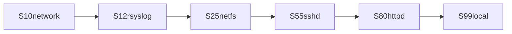
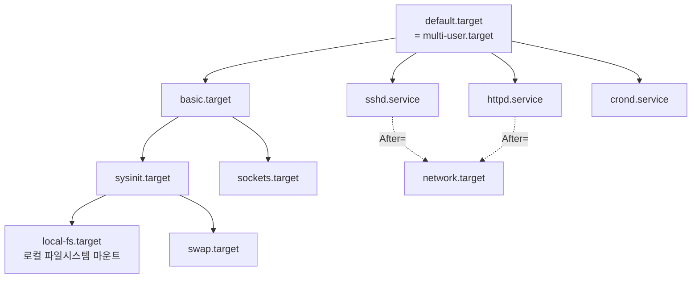

<Callout type="info">
  **이번 문서의 목표:** 이 파일을 다 읽으면 런레벨과 systemd 타깃의 대응 관계를 표로 재현할 수 있고, SysV의 `rc` 스크립트 구조와 systemd의 유닛 의존성이 어떻게 다른 방식으로 같은 일을 하는지 설명하며, 상태 전환·기본값 설정 명령을 정확히 고를 수 있게 된다.
</Callout>

## 왜 두 체계를 다 배워야 하는가

현대 리눅스는 거의 전부 systemd를 씁니다. 그런데 이 시험은 여전히 **SysV init을 함께 출제합니다.** 이유는 두 가지입니다.

1. 실무에 남아 있는 구형 시스템이 있고, 관리자는 둘 다 알아야 합니다.
2. systemd 자체가 SysV와의 **호환 계층**을 유지하고 있어서, `runlevel`이나 `service` 같은 옛 명령이 지금도 동작합니다.

그래서 이 편은 처음부터 끝까지 **대비표 형식**으로 갑니다. 03편에서 부팅의 큰 흐름을 봤다면, 여기서는 8단계(PID 1 실행) 이후에서 무슨 일이 벌어지는지 확대합니다.

> **쉽게 말하면:** SysV는 "정해진 순서대로 스크립트를 하나씩 실행"하고, systemd는 "필요한 것들의 의존 관계를 계산해 가능한 것부터 병렬로 실행"합니다.

## 1. SysV init — 순서대로 실행하는 방식

### `/etc/inittab`과 기본 런레벨

전통 SysV init은 `/etc/inittab`이라는 파일을 읽어 기본 런레벨을 결정했습니다.

```
id:3:initdefault:
```

이 한 줄이 "기본 런레벨은 3"이라는 뜻입니다. 텍스트 콘솔 다중 사용자 모드로 부팅한다는 의미입니다. 그래픽으로 부팅하려면 `5`로 고쳤습니다.

### rc 스크립트 구조

런레벨마다 실행할 서비스 목록이 디렉터리로 관리됩니다.

```
/etc/init.d/           실제 서비스 시작·중지 스크립트 (원본)
/etc/rc.d/rc0.d/       런레벨 0에서 처리할 링크들
/etc/rc.d/rc1.d/
/etc/rc.d/rc3.d/       런레벨 3에서 처리할 링크들
/etc/rc.d/rc5.d/
/etc/rc.d/rc.local     부팅 마지막에 실행할 사용자 정의 스크립트
```

각 `rcN.d` 디렉터리 안에는 `/etc/init.d/` 스크립트를 가리키는 **심볼릭 링크**가 들어 있고, 이름에 규칙이 있습니다.

```
/etc/rc.d/rc3.d/S55sshd   → ../init.d/sshd
/etc/rc.d/rc3.d/K30postfix → ../init.d/postfix
```

| 접두어 | 의미 | 인자 |
|--------|------|------|
| `S` | Start – 그 런레벨 진입 시 **시작** | `start` |
| `K` | Kill – 그 런레벨 진입 시 **중지** | `stop` |

`S` 뒤의 두 자리 숫자는 **실행 순서**입니다. `S10network`가 `S55sshd`보다 먼저 실행됩니다. 네트워크가 올라와야 SSH가 의미 있기 때문에 순서를 숫자로 강제한 것입니다.

여기에 SysV의 근본적 한계가 있습니다. **모든 것이 숫자로 정해진 한 줄짜리 순서**이므로, 서로 무관한 서비스도 앞의 것이 끝날 때까지 기다려야 합니다. 부팅이 느린 이유입니다.



### 서비스 관리 명령

```bash
# service sshd start          # 시작
# service sshd status         # 상태 확인
# /etc/init.d/sshd restart    # 직접 스크립트 호출
# chkconfig --list sshd       # 런레벨별 자동 시작 설정 확인
# chkconfig sshd on           # 부팅 시 자동 시작 등록
# chkconfig --level 35 sshd on  # 런레벨 3과 5에서만 등록
```

`service`는 **지금 당장** 시작·중지하는 명령이고, `chkconfig`는 **부팅 시 자동 시작 여부**를 등록하는 명령입니다. 이 구분이 systemd에서도 그대로 이어집니다.

## 2. systemd — 의존성으로 병렬 실행하는 방식

### 유닛이라는 통합 개념

systemd는 관리 대상을 전부 **유닛**(unit)이라는 한 가지 개념으로 통일했습니다. 서비스도, 마운트 지점도, 소켓도, 타이머도 전부 유닛입니다.

| 확장자 | 유닛 종류 | 관리하는 것 |
|--------|-----------|-------------|
| `.service` | 서비스 유닛 | 데몬 프로세스 |
| `.target` | 타깃 유닛 | **유닛들의 묶음** – 런레벨의 대체 |
| `.mount` | 마운트 유닛 | 마운트 지점 |
| `.socket` | 소켓 유닛 | 소켓 기반 활성화 |
| `.timer` | 타이머 유닛 | cron 대체 스케줄 |
| `.device` | 장치 유닛 | 커널이 인식한 장치 |
| `.swap` | 스왑 유닛 | 스왑 공간 |
| `.path` | 경로 유닛 | 파일 변화 감시 |

유닛 파일이 있는 위치도 세 곳이며 우선순위가 다릅니다.

| 경로 | 용도 | 우선순위 |
|------|------|----------|
| `/usr/lib/systemd/system/` | **패키지가 설치한 원본** | 낮음 |
| `/run/systemd/system/` | 런타임 생성 | 중간 |
| `/etc/systemd/system/` | **관리자가 만들거나 덮어쓴 것** | **가장 높음** |

패키지가 준 유닛 파일을 직접 고치면 패키지 업데이트 시 덮어써집니다. 그래서 `/etc/systemd/system/` 아래에 같은 이름으로 두거나 `.d` 디렉터리로 덮어씁니다.

### 서비스 유닛 파일의 구조

```ini
[Unit]
Description=OpenSSH server daemon
After=network.target sshd-keygen.service
Wants=sshd-keygen.service

[Service]
Type=notify
ExecStart=/usr/sbin/sshd -D $OPTIONS
ExecReload=/bin/kill -HUP $MAINPID
Restart=on-failure

[Install]
WantedBy=multi-user.target
```

| 섹션 | 역할 |
|------|------|
| `[Unit]` | 설명과 **의존 관계** |
| `[Service]` | 실행 방법 |
| `[Install]` | `enable` 했을 때 **어디에 연결할지** |

의존 관계 지시자가 시험 포인트입니다.

| 지시자 | 의미 |
|--------|------|
| `After=` | **순서** – 지정한 유닛보다 나중에 시작 |
| `Before=` | 순서 – 지정한 유닛보다 먼저 시작 |
| `Requires=` | **강한 의존** – 그 유닛이 실패하면 이 유닛도 실패 |
| `Wants=` | **약한 의존** – 함께 시작하려 하지만 실패해도 무관 |
| `Conflicts=` | 동시에 실행될 수 없음 |
| `WantedBy=` | `enable` 시 그 타깃의 `.wants` 디렉터리에 링크 생성 |

`After`와 `Requires`의 차이가 핵심입니다. **`After`는 순서만, `Requires`는 존재 여부**를 규정합니다. 둘은 독립적이므로 보통 함께 씁니다.

> **쉽게 말하면:** `Requires`는 "그 사람이 반드시 와야 한다", `After`는 "그 사람 다음에 들어간다"입니다. 둘 다 써야 "그 사람이 오고, 그다음에 내가 들어간다"가 됩니다.

### enable이 실제로 하는 일

`systemctl enable sshd`를 실행하면 무슨 일이 일어날까요? `[Install]` 섹션의 `WantedBy=multi-user.target`을 읽고, 다음 심볼릭 링크를 만듭니다.

```
/etc/systemd/system/multi-user.target.wants/sshd.service
   → /usr/lib/systemd/system/sshd.service
```

즉 **`multi-user.target`이 원하는 유닛 목록에 sshd를 추가**하는 것입니다. SysV에서 `rc3.d`에 `S55sshd` 링크를 만들던 것과 개념적으로 같습니다. 이름과 위치만 바뀌었을 뿐입니다.

## 3. 런레벨과 타깃 매핑 — 반드시 외울 표

| 런레벨 | SysV 의미 | systemd 타깃 | 별칭 파일 |
|--------|-----------|---------------|-----------|
| 0 | 시스템 종료 | `poweroff.target` | `runlevel0.target` |
| 1 | 단일 사용자 모드 | `rescue.target` | `runlevel1.target` |
| 2 | 다중 사용자, NFS 없음 | `multi-user.target` | `runlevel2.target` |
| 3 | 다중 사용자, 텍스트 | `multi-user.target` | `runlevel3.target` |
| 4 | 미사용 | `multi-user.target` | `runlevel4.target` |
| 5 | 다중 사용자, 그래픽 | `graphical.target` | `runlevel5.target` |
| 6 | 재부팅 | `reboot.target` | `runlevel6.target` |

`runlevelN.target`은 실제로는 해당 타깃을 가리키는 **심볼릭 링크**입니다. 이것이 systemd가 유지하는 호환 계층의 정체입니다.

여기에 몇 개의 타깃이 더 있습니다.

| 타깃 | 의미 |
|------|------|
| `emergency.target` | 루트 파일시스템만 읽기 전용 마운트한 **최소 응급 상태** |
| `rescue.target` | 로컬 파일시스템 마운트 + 단일 사용자 셸 |
| `basic.target` | 기본 시스템 초기화 완료 지점 |
| `default.target` | **부팅 시 도달할 기본 목표** (심볼릭 링크) |

`emergency`와 `rescue`의 차이가 출제됩니다. **응급(emergency)이 더 최소한**입니다. 파일시스템 마운트조차 하지 않은 상태여서 rescue로도 부팅되지 않을 때 씁니다.

## 4. 명령 대비표 — 이 편의 핵심

| 목적 | SysV | systemd |
|------|------|---------|
| 서비스 시작 | `service sshd start` | `systemctl start sshd` |
| 서비스 중지 | `service sshd stop` | `systemctl stop sshd` |
| 재시작 | `service sshd restart` | `systemctl restart sshd` |
| 설정만 다시 읽기 | `service sshd reload` | `systemctl reload sshd` |
| 상태 확인 | `service sshd status` | `systemctl status sshd` |
| 부팅 시 자동 시작 등록 | `chkconfig sshd on` | **`systemctl enable sshd`** |
| 자동 시작 해제 | `chkconfig sshd off` | `systemctl disable sshd` |
| 자동 시작 여부 확인 | `chkconfig --list sshd` | `systemctl is-enabled sshd` |
| 서비스 목록 | `chkconfig --list` | `systemctl list-units --type=service` |
| 현재 런레벨/타깃 확인 | `runlevel` | `systemctl get-default` |
| 상태 즉시 전환 | `init 5`, `telinit 5` | **`systemctl isolate graphical.target`** |
| 기본 상태 변경 | `/etc/inittab` 수정 | **`systemctl set-default multi-user.target`** |
| 종료 | `init 0`, `shutdown -h now` | `systemctl poweroff` |
| 재부팅 | `init 6`, `reboot` | `systemctl reboot` |

### 기출이 가장 좋아하는 네 쌍

**첫째, `start`와 `enable`.** 기출 문항입니다.

> 다음 중 ssh 데몬이 리눅스 부팅 시에 실행되도록 설정하는 명령으로 알맞은 것은?

정답은 `systemctl enable sshd`입니다. `start`는 **지금 한 번** 시작할 뿐 다음 부팅과는 무관합니다. 보기에는 `start`, `status`, `active`(존재하지 않는 하위 명령)가 함께 나옵니다. **"부팅 시에"라는 표현이 보이면 `enable`** 이라고 반사적으로 반응해야 합니다.

**둘째, `isolate`와 `set-default`.** `isolate`는 **지금 즉시** 그 타깃으로 전환하고 나머지를 중지합니다. `set-default`는 **다음 부팅부터** 적용됩니다. `init 5`에 대응하는 것은 `isolate`입니다.

**셋째, `restart`와 `reload`.** `restart`는 프로세스를 종료하고 다시 띄우므로 **연결이 끊깁니다.** `reload`는 프로세스를 유지한 채 설정 파일만 다시 읽습니다(대개 SIGHUP). 운영 중인 웹 서버 설정을 바꿨을 때는 `reload`가 안전합니다.

**넷째, `mask`.** `systemctl mask 서비스`는 그 유닛을 `/dev/null`로 연결해 **시작 자체를 불가능하게** 만듭니다. `disable`보다 강한 조치로, 다른 유닛이 의존성으로 끌어올리는 것까지 막습니다. 해제는 `unmask`입니다.

| 명령 | 지금 실행 | 부팅 시 | 다른 유닛이 끌어올림 |
|------|-----------|---------|----------------------|
| `start` | 시작됨 | 영향 없음 | 가능 |
| `enable` | 영향 없음 | 시작됨 | 가능 |
| `disable` | 영향 없음 | 시작 안 됨 | **가능** |
| `mask` | 불가 | 불가 | **불가** |

## 5. 단일 사용자 모드 진입 — 기출 함정 집중

root 패스워드 분실이나 시스템 복구를 위해 최소 상태로 부팅하는 방법이 여러 개이고, 시험은 그 차이를 묻습니다.

| 방법 | 커널 인자 또는 명령 | 결과 |
|------|---------------------|------|
| 런레벨 1 | `single` 또는 `1` | SysV 단일 사용자 모드 |
| rescue 타깃 | `systemd.unit=rescue.target` | 로컬 파일시스템 마운트 + 단일 셸 |
| emergency 타깃 | `systemd.unit=emergency.target` | 루트만 읽기 전용, 최소 상태 |
| init 대체 | **`rw init=/bin/sh`** | **systemd 자체를 실행하지 않고** 셸이 PID 1 |
| 실행 중 전환 | `systemctl isolate rescue.target` | 재부팅 없이 전환 |

`init=/bin/sh`가 특별한 이유는 **인증 절차가 아예 없다**는 점입니다. systemd가 실행되지 않으니 로그인 프롬프트도 없고, 곧바로 root 셸이 뜹니다. 그래서 물리적 접근이 가능한 서버는 GRUB에 비밀번호를 걸어야 한다는 보안 논점이 함께 출제됩니다.

이 방식으로 부팅한 뒤 비밀번호를 바꾸는 절차는 다음과 같습니다.

<Steps>
1. GRUB 메뉴에서 `e`를 눌러 편집 모드로 들어갑니다.
2. `linux16` 줄의 `ro`를 `rw init=/bin/sh`로 바꿉니다.
3. Ctrl+X로 부팅하면 root 셸이 뜹니다.
4. `passwd root`로 새 비밀번호를 지정합니다.
5. SELinux가 활성화되어 있으면 `touch /.autorelabel`을 실행해 재라벨링을 예약합니다.
6. `exec /sbin/init` 또는 강제 재부팅으로 정상 부팅합니다.
</Steps>

5번 단계가 자주 빠지는 함정입니다. SELinux 환경에서 이 과정을 건너뛰면 `/etc/shadow`의 보안 컨텍스트가 어긋나 로그인이 안 됩니다.

## 6. 부팅 성능 분석 — systemd의 강점

systemd는 부팅 시간을 유닛별로 측정합니다.

```bash
$ systemd-analyze
Startup finished in 1.234s (kernel) + 3.456s (initrd) + 12.345s (userspace) = 17.035s

$ systemd-analyze blame
     8.123s NetworkManager-wait-online.service
     2.045s firewalld.service
     0.987s postfix.service
```

| 명령 | 하는 일 |
|------|---------|
| `systemd-analyze` | 커널·initrd·사용자 공간별 부팅 시간 |
| `systemd-analyze blame` | **오래 걸린 유닛 순위** |
| `systemd-analyze critical-chain` | 임계 경로(의존성 사슬) 분석 |
| `systemctl list-dependencies 타깃` | 의존성 트리 출력 |

SysV에는 이런 도구가 없었습니다. 순차 실행이라 "누가 느린가"를 알아도 병렬화할 방법이 없었기 때문입니다. **의존성 그래프를 명시적으로 관리한 덕분에 분석과 병렬화가 가능해졌다**는 것이 systemd의 설계적 이점입니다.



## 핵심 정리

- SysV는 `/etc/inittab`의 기본 런레벨과 `/etc/rc.d/rcN.d/`의 **`S`·`K` 접두어 링크**를 순번대로 실행하는 **순차 구조**입니다.
- systemd는 모든 것을 **유닛**으로 다루며, `After`(순서)와 `Requires`(존재)를 구분해 **의존성 그래프**를 만들고 병렬로 실행합니다.
- 런레벨과 타깃 매핑에서 **0은 poweroff, 1은 rescue, 2·3·4는 multi-user, 5는 graphical, 6은 reboot**입니다.
- **`start`는 지금, `enable`은 부팅 시**입니다. "부팅 시에 실행되도록"이라는 문장이면 `enable`입니다.
- **`isolate`는 즉시 전환, `set-default`는 다음 부팅부터**이며, `mask`는 `disable`보다 강해 의존성에 의한 시작까지 막습니다.
- 최소 상태 진입은 rescue보다 **emergency가 더 최소**이고, `init=/bin/sh`는 systemd를 아예 실행하지 않아 인증 없이 root 셸을 줍니다.

## 마무리 복습

<Quiz
  questionNumber={1}
  question="다음 중 ssh 데몬이 리눅스 부팅 시에 자동으로 실행되도록 설정하는 명령으로 알맞은 것은?"
  options={['systemctl enable sshd', 'systemctl status sshd', 'systemctl active sshd', 'systemctl start sshd']}
  correctAnswer={1}
  explanation="부팅 시 자동 시작을 등록하는 것은 enable이며 이는 대상 타깃의 wants 디렉터리에 심볼릭 링크를 만든다. start는 현재 시점에 한 번 시작할 뿐 다음 부팅과는 무관하다."
  optionExplanations={['정답 — 부팅 시에라는 조건은 enable을 가리킨다', 'status는 현재 상태를 조회만 한다', 'active라는 하위 명령은 존재하지 않는다', 'start는 지금 한 번 시작하는 명령이다']}
/>

<Quiz
  questionNumber={2}
  question="다음 중 SysV 런레벨과 systemd 타깃의 대응으로 알맞은 것은?"
  options={['런레벨 1은 emergency.target 에 대응한다', '런레벨 3은 graphical.target 에 대응한다', '런레벨 5는 graphical.target 에 대응한다', '런레벨 6은 poweroff.target 에 대응한다']}
  correctAnswer={3}
  explanation="런레벨 5는 그래픽 로그인이 포함된 다중 사용자 모드이므로 graphical.target에 대응한다. 런레벨 1은 rescue.target 3은 multi-user.target 6은 reboot.target이다."
  optionExplanations={['런레벨 1에 대응하는 것은 rescue.target이다', '런레벨 3은 텍스트 모드이므로 multi-user.target이다', '정답 — 그래픽 모드가 곧 graphical.target이다', '런레벨 6은 재부팅이므로 reboot.target이다']}
/>

<Quiz
  questionNumber={3}
  question="SysV init의 런레벨 디렉터리에 있는 링크 파일 이름 S55sshd 에 대한 설명으로 알맞은 것은?"
  options={['S는 정지를 뜻하며 55는 우선순위가 낮음을 뜻한다', 'S는 시작을 뜻하며 55는 실행 순서를 뜻한다', 'S는 서비스를 뜻하며 55는 런레벨 번호를 뜻한다', 'S는 심볼릭 링크를 뜻하며 55는 파일 크기다']}
  correctAnswer={2}
  explanation="접두어 S는 그 런레벨 진입 시 서비스를 시작한다는 뜻이고 뒤의 숫자는 실행 순서를 나타내며 작을수록 먼저 실행된다. 중지 대상은 K 접두어를 사용한다."
  optionExplanations={['정지를 뜻하는 접두어는 K다', '정답 — 시작을 뜻하며 숫자는 순서를 강제한다', '런레벨 번호는 파일 이름이 아니라 디렉터리 이름에 들어간다', 'S는 시작을 뜻하며 숫자는 파일 크기가 아니다']}
/>

<Quiz
  questionNumber={4}
  question="다음 중 systemd 유닛 파일의 의존성 지시자에 대한 설명으로 틀린 것은?"
  options={['After 는 지정한 유닛보다 나중에 시작하도록 순서를 정한다', 'Requires 는 강한 의존으로 대상 유닛이 실패하면 함께 실패한다', 'Wants 는 약한 의존으로 대상이 실패해도 계속 진행한다', 'After 를 지정하면 대상 유닛이 없어도 자동으로 함께 시작된다']}
  correctAnswer={4}
  explanation="After는 순서만 규정하며 대상 유닛을 함께 시작시키지 않는다. 대상 유닛이 함께 시작되게 하려면 Requires나 Wants를 별도로 지정해야 한다."
  optionExplanations={['After의 정의 그대로다', 'Requires는 강한 의존 관계를 만든다', 'Wants는 약한 의존 관계를 만든다', '정답(틀린 설명) — After는 순서만 정하고 유닛을 끌어오지 않는다']}
/>

<Quiz
  questionNumber={5}
  question="다음 ( 괄호 ) 안에 들어갈 명령으로 알맞은 것은? 재부팅 없이 현재 시스템을 즉시 그래픽 모드로 전환하려고 한다. SysV의 init 5 에 대응하는 명령이다."
  options={['systemctl set-default graphical.target', 'systemctl isolate graphical.target', 'systemctl enable graphical.target', 'systemctl mask graphical.target']}
  correctAnswer={2}
  explanation="isolate는 지정한 타깃만 활성화하고 그에 속하지 않는 유닛을 중지시켜 즉시 상태를 전환한다. set-default는 다음 부팅부터 적용되는 기본 목표를 바꾸는 명령이다."
  optionExplanations={['set-default는 다음 부팅부터 적용된다', '정답 — init 명령으로 런레벨을 즉시 바꾸던 것의 대응이다', 'enable은 부팅 시 자동 시작 등록이다', 'mask는 유닛의 시작 자체를 차단하는 명령이다']}
/>

<Quiz
  questionNumber={6}
  question="다음 중 systemctl disable 과 systemctl mask 의 차이에 대한 설명으로 알맞은 것은?"
  options={['둘의 효과는 동일하다', 'disable은 부팅 자동 시작만 막고 mask는 수동 시작과 의존성에 의한 시작까지 막는다', 'mask는 부팅 자동 시작만 막고 disable은 모든 시작을 막는다', 'mask는 서비스 파일을 완전히 삭제한다']}
  correctAnswer={2}
  explanation="disable은 부팅 시 자동 시작 링크만 제거하므로 수동으로 start하거나 다른 유닛이 의존성으로 끌어올리면 실행된다. mask는 유닛을 dev null로 연결해 어떤 경로로도 시작되지 않게 한다."
  optionExplanations={['차단 강도가 다르므로 동일하지 않다', '정답 — mask가 더 강한 차단이다', '두 명령의 역할이 뒤바뀐 설명이다', 'mask는 파일을 삭제하지 않으며 unmask로 되돌릴 수 있다']}
/>

<Quiz
  questionNumber={7}
  question="다음 중 rescue.target 과 emergency.target 에 대한 설명으로 알맞은 것은?"
  options={['emergency 가 rescue 보다 더 많은 서비스를 시작한다', 'rescue 는 로컬 파일시스템을 마운트하고 emergency 는 루트만 읽기 전용으로 마운트한다', '두 타깃 모두 네트워크 서비스를 정상적으로 시작한다', 'emergency 는 그래픽 로그인 화면을 제공한다']}
  correctAnswer={2}
  explanation="rescue는 로컬 파일시스템을 마운트한 뒤 단일 사용자 셸을 제공하고 emergency는 루트 파일시스템만 읽기 전용으로 마운트한 최소 상태다. emergency가 더 최소한의 환경이다."
  optionExplanations={['emergency가 더 적은 것을 시작하는 최소 환경이다', '정답 — 마운트 범위가 두 타깃을 가르는 기준이다', '두 타깃 모두 네트워크 서비스를 시작하지 않는다', 'emergency는 텍스트 셸만 제공한다']}
/>

<Quiz
  questionNumber={8}
  question="운영 중인 웹 서버의 설정 파일만 수정한 뒤 접속을 끊지 않고 변경 사항을 반영하려 할 때 가장 알맞은 명령은?"
  options={['systemctl restart httpd', 'systemctl reload httpd', 'systemctl stop httpd', 'systemctl mask httpd']}
  correctAnswer={2}
  explanation="reload는 프로세스를 유지한 채 설정 파일만 다시 읽게 하므로 기존 연결이 끊기지 않는다. restart는 프로세스를 종료 후 재시작하므로 순간적인 서비스 중단이 발생한다."
  optionExplanations={['restart는 프로세스를 다시 띄우므로 연결이 끊긴다', '정답 — 설정만 다시 읽어 무중단으로 반영한다', 'stop은 서비스를 중지시킨다', 'mask는 서비스 시작 자체를 차단한다']}
/>

## 참고 자료

- [man7.org — runlevel(8) 매뉴얼 페이지](https://man7.org/linux/man-pages/man8/runlevel.8.html)
- [man7.org — systemd.unit(5) 매뉴얼 페이지](https://man7.org/linux/man-pages/man5/systemd.unit.5.html)
- [man7.org — systemctl(1) 매뉴얼 페이지](https://man7.org/linux/man-pages/man1/systemctl.1.html)
- [man7.org — systemd.target(5) 매뉴얼 페이지](https://man7.org/linux/man-pages/man5/systemd.target.5.html)
