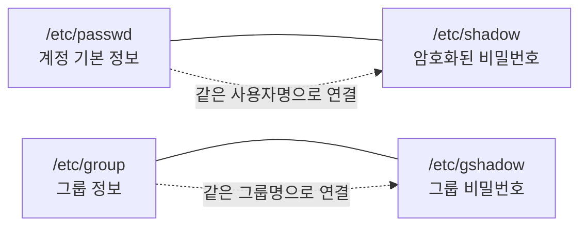
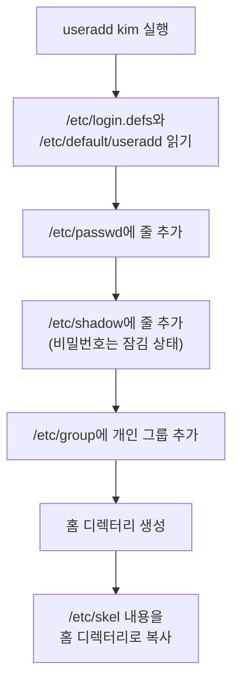
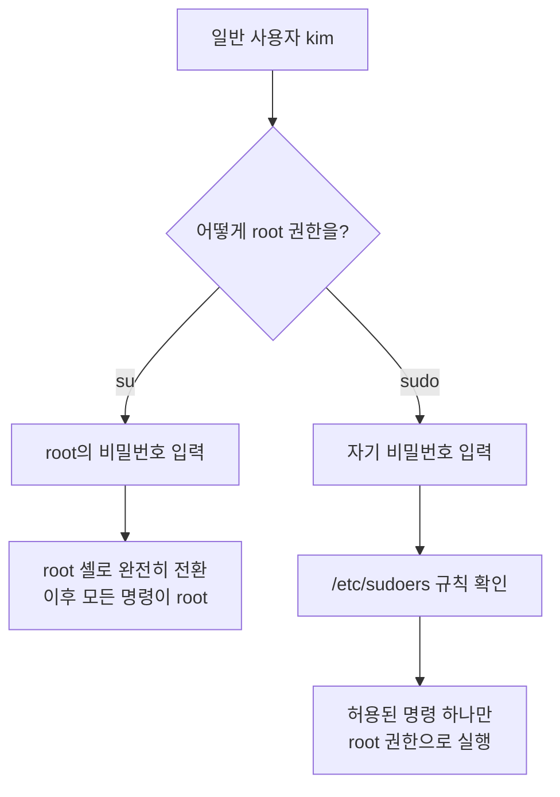
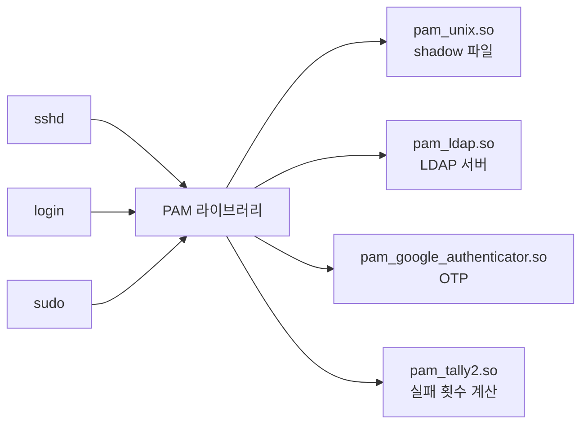

<Callout type="info">
  **이번 문서의 목표:** 이 파일을 다 읽으면 계정 관련 설정 파일의 각 필드를 보고 그 계정이 어떤 상태인지 판독할 수 있고, 계정 생성·수정·잠금 명령을 옵션 단위로 구분하며, su와 sudo와 PAM이 각각 인증의 어느 지점에서 작동하는지 설명할 수 있게 된다.
</Callout>

## 계정은 파일이다

리눅스에는 "사용자 데이터베이스"라는 별도의 프로그램이 없습니다. 계정 정보는 그냥 **텍스트 파일 네 개**에 들어 있습니다.



> **쉽게 말하면:** `passwd`와 `group`은 누구나 읽을 수 있는 명부이고, `shadow`와 `gshadow`는 root만 읽을 수 있는 금고입니다.

이 구조를 이해하면 "왜 passwd 파일에 비밀번호가 없는가" 같은 질문이 저절로 풀립니다. 원래는 `/etc/passwd`에 암호 해시가 들어 있었습니다. 그런데 이 파일은 **누구나 읽을 수 있어야 합니다.** `ls -l`이 UID를 사용자 이름으로 바꿔 보여 주려면 일반 사용자 프로세스도 이 파일을 읽어야 하기 때문입니다. 해시가 노출되면 오프라인 무차별 대입 공격이 가능해집니다. 그래서 해시만 떼어 root 전용 파일 `/etc/shadow`로 옮긴 것이 **섀도 패스워드**입니다.

| 파일 | 권한 | 소유자 | 누가 읽는가 |
|------|------|--------|-------------|
| `/etc/passwd` | `-rw-r--r--` (644) | root | 모든 사용자 |
| `/etc/shadow` | `----------` (000) 또는 `-r--------` | root | root만 |
| `/etc/group` | `-rw-r--r--` (644) | root | 모든 사용자 |
| `/etc/gshadow` | `----------` (000) | root | root만 |

`/etc/shadow`의 권한이 000인데 root가 읽을 수 있는 이유는 **root가 권한 검사를 건너뛰기 때문**입니다. 권한 비트는 root에게 적용되지 않습니다.

## 1. /etc/passwd — 일곱 개의 필드

한 줄을 콜론으로 잘라 봅시다.

```
posein:x:1000:1000:Linux Master:/home/posein:/bin/bash
```

| 순서 | 값 | 이름 | 의미 |
|------|-----|------|------|
| 1 | `posein` | 로그인명 | 사용자 이름 |
| 2 | `x` | 패스워드 자리 | `x`는 실제 해시가 shadow에 있다는 표시 |
| 3 | `1000` | UID | 사용자 식별 번호 |
| 4 | `1000` | GID | 기본 그룹 번호 |
| 5 | `Linux Master` | GECOS | 설명 필드 (이름·연락처 등) |
| 6 | `/home/posein` | 홈 디렉터리 | 로그인 직후 위치 |
| 7 | `/bin/bash` | 로그인 셸 | 로그인할 때 실행할 프로그램 |

### 두 번째 필드가 함정이다

| 값 | 의미 |
|----|------|
| `x` | 해시가 `/etc/shadow`에 있음 (정상) |
| 비어 있음 | **비밀번호 없이 로그인 가능** — 심각한 보안 취약점 |
| 해시 문자열 | 섀도를 쓰지 않는 구식 시스템 |

### UID 번호대의 관례

| UID | 용도 |
|-----|------|
| 0 | **root**. 이름이 아니라 UID 0이 관리자를 정의한다 |
| 1–200 | 시스템이 정적으로 할당한 계정 (RHEL 계열) |
| 201–999 | 데몬용 시스템 계정 |
| 1000 이상 | 일반 사용자 |

**핵심은 이것입니다. 관리자를 결정하는 것은 이름이 아니라 UID 0입니다.** 사용자 이름을 `admin`으로 바꿔도 UID가 0이면 root와 동일한 권한을 갖습니다. 반대로 이름이 `root`여도 UID가 1000이면 평범한 사용자입니다. 기출에서 "UID가 0인 계정이 두 개일 때"를 묻는 형태로 나옵니다.

### 일곱 번째 필드 — 로그인 셸이 곧 잠금 장치

```
ftp:x:14:50:FTP User:/var/ftp:/sbin/nologin
```

시스템 계정의 셸은 대부분 `/sbin/nologin` 또는 `/bin/false`입니다. 이 두 개는 미묘하게 다릅니다.

| 셸 | 동작 |
|----|------|
| `/sbin/nologin` | 로그인 거부 메시지를 출력하고 종료. `/etc/nologin.txt` 내용을 보여 줌 |
| `/bin/false` | 아무 메시지 없이 종료 코드 1로 즉시 종료 |

둘 다 "이 계정으로는 셸에 못 들어온다"는 결과는 같습니다. 데몬을 돌리는 데는 계정이 필요하지만 사람이 로그인할 필요는 없기 때문에 이렇게 막습니다.

## 2. /etc/shadow — 아홉 개의 필드

```
posein:$6$Xa9k...$Hj2...:19427:0:99999:7:::
```

| 순서 | 값 | 이름 | 의미 |
|------|-----|------|------|
| 1 | `posein` | 로그인명 | passwd와 연결하는 키 |
| 2 | `$6$...` | 암호화된 비밀번호 | 해시 |
| 3 | `19427` | 최종 변경일 | 1970-01-01부터 지난 **일수** |
| 4 | `0` | 최소 사용일 | 이 일수 전에는 다시 못 바꿈 |
| 5 | `99999` | 최대 사용일 | 이 일수가 지나면 변경 강제 |
| 6 | `7` | 경고일 | 만료 며칠 전부터 경고 |
| 7 | (빈칸) | 비활성일 | 만료 후 이 기간이 지나면 계정 잠금 |
| 8 | (빈칸) | 계정 만료일 | 이 날짜가 되면 계정 자체가 만료 |
| 9 | (빈칸) | 예약 | 미사용 |

### 두 번째 필드 앞의 달러 기호 숫자

해시 문자열은 `$id$salt$hash` 형태입니다. `id`가 알고리즘을 지정합니다.

| id | 알고리즘 |
|----|----------|
| `$1$` | MD5 |
| `$5$` | SHA-256 |
| `$6$` | **SHA-512** (현재 대부분의 배포판 기본값) |
| `$y$` | yescrypt (최신 데비안·페도라) |

### 계정 잠금의 실제 원리

두 번째 필드 앞에 `!` 또는 `*`이 붙으면 계정이 잠깁니다.

| 표기 | 의미 |
|------|------|
| `!` 또는 `!!` | **잠긴 계정.** 원래 해시 앞에 느낌표를 덧붙인 상태 |
| `*` | 비밀번호 로그인을 애초에 허용하지 않는 시스템 계정 |
| 빈 필드 | **비밀번호 없이 로그인 가능** — 위험 |

원리가 재미있습니다. 해시 앞에 `!`를 붙이면 그 문자열은 **어떤 비밀번호로도 만들어질 수 없는 해시**가 됩니다. 그래서 무슨 비밀번호를 입력해도 비교가 실패합니다. 잠금을 풀 때는 `!`만 떼면 원래 비밀번호가 그대로 살아납니다. 비밀번호를 지우지 않고 잠그는 영리한 방식입니다.

```bash
# usermod -L posein      # lock — 해시 앞에 ! 추가
# usermod -U posein      # unlock — ! 제거
# passwd -l posein       # lock (동일 효과)
# passwd -u posein       # unlock
# passwd -S posein       # 상태 확인
posein LK 2023-03-11 0 99999 7 -1
```

`passwd -S`의 두 번째 항목이 상태입니다. `PS`는 사용 가능, `LK`는 잠김, `NP`는 비밀번호 없음입니다.

<Callout type="warning">
  `usermod -L`은 **비밀번호 인증만** 막습니다. SSH 공개키 인증은 비밀번호를 보지 않으므로 잠긴 계정으로도 로그인이 됩니다. 완전히 막으려면 로그인 셸을 `/sbin/nologin`으로 바꾸거나 계정 만료일을 과거로 설정해야 합니다. 이 차이가 기출 함정으로 나옵니다.
</Callout>

## 3. 계정 생성 — useradd와 adduser의 차이

가장 많이 혼동되는 지점입니다. 배포판마다 정체가 다릅니다.

| 구분 | RHEL·CentOS 계열 | 데비안·우분투 계열 |
|------|-------------------|---------------------|
| `useradd` | 저수준 명령 (원본) | 저수준 명령 (원본) |
| `adduser` | `useradd`를 가리키는 **심볼릭 링크** | **대화형 펄 스크립트** (별개 프로그램) |
| 홈 디렉터리 | `-m` 옵션 필요 여부는 설정에 따름 | 자동 생성 |
| 비밀번호 | 별도로 `passwd` 실행 | 실행 중 물어봄 |

**RHEL 계열에서 `adduser`는 `useradd`와 완전히 같은 명령입니다.** 반면 데비안 계열의 `adduser`는 사람이 쓰기 편하도록 만든 별개의 래퍼로, 실행하면 비밀번호와 이름을 대화형으로 물어보고 홈 디렉터리를 알아서 만듭니다. 시험에서 "두 명령의 관계"를 물으면 배포판을 먼저 확인해야 합니다.

### useradd 주요 옵션

| 옵션 | 뜻 | 예 |
|------|-----|-----|
| `-u` | UID 지정 | `useradd -u 1500 kim` |
| `-g` | **기본 그룹** 지정 | `useradd -g users kim` |
| `-G` | **추가 그룹** 지정 (쉼표 구분) | `useradd -G wheel,devteam kim` |
| `-d` | 홈 디렉터리 경로 | `useradd -d /data/kim kim` |
| `-m` | 홈 디렉터리 생성 | |
| `-M` | 홈 디렉터리 생성 안 함 | |
| `-s` | 로그인 셸 | `useradd -s /sbin/nologin svc` |
| `-c` | GECOS 설명 | |
| `-e` | 계정 만료일 (YYYY-MM-DD) | `useradd -e 2026-12-31 temp` |
| `-D` | **기본값 조회·변경** | `useradd -D` |

소문자 `-g`와 대문자 `-G`의 구분이 단골 출제 포인트입니다. **소문자는 하나(기본 그룹), 대문자는 여러 개(2차 그룹)** 로 외웁니다.

### 계정 생성 시 실제로 벌어지는 일



`/etc/skel`(skeleton)은 **새 계정의 홈 디렉터리 원본**입니다. 여기에 `.bashrc`, `.bash_profile` 같은 파일을 두면 새로 만드는 모든 계정이 그 파일을 갖고 시작합니다. 회사 공통 환경 설정을 배포하는 표준 방법입니다.

| 설정 파일 | 역할 |
|-----------|------|
| `/etc/login.defs` | UID·GID 범위, 패스워드 만료 기본값, UMASK |
| `/etc/default/useradd` | 기본 셸·홈 디렉터리 경로·skel 위치 |
| `/etc/skel/` | 홈 디렉터리에 복사할 초기 파일 모음 |

### 삭제 — userdel의 -r

```bash
# userdel kim          # 계정만 삭제, 홈 디렉터리는 남음
# userdel -r kim       # 홈 디렉터리와 메일 스풀까지 삭제
```

`-r` 없이 지우면 홈 디렉터리가 **주인 없는 UID 번호로 남습니다.** `ls -l`에서 사용자 이름 대신 숫자가 보이는 것이 그 흔적입니다. 이후 같은 UID로 새 계정을 만들면 그 사람이 옛 파일을 전부 소유하게 되는 사고가 납니다.

## 4. 그룹 — 기본 그룹과 2차 그룹

`/etc/group` 한 줄은 네 필드입니다.

```
devteam:x:1001:kim,lee,park
```

| 순서 | 의미 |
|------|------|
| 1 | 그룹명 |
| 2 | 그룹 비밀번호 자리 (`x`는 gshadow에 있음) |
| 3 | GID |
| 4 | **2차 그룹 구성원 목록** |

여기서 결정적인 함정이 있습니다. **기본 그룹으로 소속된 사용자는 네 번째 필드에 나타나지 않습니다.** 기본 그룹 정보는 `/etc/passwd`의 네 번째 필드(GID)에만 있기 때문입니다. `/etc/group`을 보고 "kim은 devteam 소속이 아니다"라고 판단하면 틀립니다.

정확히 확인하려면 `id` 명령을 씁니다.

```bash
$ id kim
uid=1001(kim) gid=1001(kim) groups=1001(kim),1002(devteam),10(wheel)
```

| 항목 | 의미 |
|------|------|
| `uid=` | 사용자 식별 번호 |
| `gid=` | **기본 그룹** |
| `groups=` | 기본 그룹을 포함한 **모든 소속 그룹** |

### UPG — 사용자 개인 그룹

RHEL 계열은 `kim`이라는 사용자를 만들면 `kim`이라는 **동명의 그룹**을 함께 만들고 그것을 기본 그룹으로 지정합니다. 이것이 **UPG**(User Private Group, 사용자 개인 그룹) 정책입니다.

왜 이렇게 할까요? 모든 사용자를 `users` 같은 공통 그룹에 넣으면 umask 002로 만든 파일을 서로 읽고 쓸 수 있게 됩니다. 개인 그룹을 쓰면 그룹에 자기 자신만 있으므로 umask 002를 써도 안전합니다. 11편에서 본 RHEL의 조건부 umask 설정(UID 199 초과이고 사용자명과 그룹명이 같으면 002)이 정확히 이 정책과 맞물립니다.

### 그룹 명령 비교

| 명령 | 하는 일 |
|------|---------|
| `groupadd -g 1500 devteam` | 그룹 생성 |
| `groupmod -n newname oldname` | 그룹 이름 변경 |
| `groupdel devteam` | 그룹 삭제 (누군가의 기본 그룹이면 거부됨) |
| `usermod -G a,b kim` | kim의 2차 그룹을 a와 b로 **교체** |
| `usermod -aG c kim` | kim의 2차 그룹에 c를 **추가** |
| `gpasswd -a kim devteam` | devteam에 kim 추가 |
| `gpasswd -d kim devteam` | devteam에서 kim 제거 |
| `gpasswd -A kim devteam` | kim을 devteam의 **관리자**로 지정 |
| `newgrp devteam` | 현재 셸의 기본 그룹을 임시 변경 |

<Callout type="warning">
  `usermod -G`를 `-a` 없이 쓰면 기존 2차 그룹이 **전부 지워지고 지정한 그룹만 남습니다.** 관리자를 `wheel` 그룹에서 떨어뜨려 sudo를 못 쓰게 만드는 대표적인 사고입니다. 추가할 때는 반드시 `usermod -aG`를 씁니다.
</Callout>

## 5. 패스워드 정책 — chage

`/etc/shadow`의 3번부터 8번 필드를 다루는 전용 명령이 `chage`(change age)입니다.

| 옵션 | 대응 필드 | 뜻 |
|------|-----------|-----|
| `-m` | 4번 | 최소 사용일 |
| `-M` | 5번 | **최대 사용일** |
| `-W` | 6번 | 경고 시작일 |
| `-I` | 7번 | 만료 후 비활성 일수 |
| `-E` | 8번 | **계정 만료일** |
| `-d` | 3번 | 최종 변경일 |
| `-l` | – | 현재 설정 조회 |

```bash
# chage -M 90 -W 7 kim         # 90일마다 변경, 7일 전 경고
# chage -E 2026-12-31 temp     # 계정 만료일 지정
# chage -d 0 kim               # 다음 로그인 때 강제 변경
# chage -l kim
```

`chage -d 0`이 실무 필수 기술입니다. 최종 변경일을 1970년으로 되돌리면 시스템은 "비밀번호가 만료됐다"고 판단하고 **다음 로그인 즉시 변경을 강요합니다.** 신규 계정에 임시 비밀번호를 줄 때 씁니다.

`-M`(최대 사용일)과 `-E`(계정 만료일)의 차이를 정확히 구분해야 합니다. **`-M`은 비밀번호가 만료되는 것**이고 **`-E`는 계정 자체가 못 쓰게 되는 것**입니다.

## 6. su와 sudo — 권한 상승의 두 방식



| 항목 | `su` | `sudo` |
|------|------|--------|
| 입력하는 비밀번호 | **대상 계정의** 비밀번호 | **자기** 비밀번호 |
| 범위 | 셸 전체가 전환됨 | 명령 하나만 |
| 권한 통제 | 전부 아니면 전무 | 명령 단위로 세밀하게 |
| 로그 | 전환 사실만 기록 | **실행한 명령까지 기록** |
| root 비밀번호 공유 | 필요함 | 불필요 |
| 설정 파일 | 없음 | `/etc/sudoers` |

**sudo가 권장되는 이유는 감사 추적과 최소 권한 원칙 때문입니다.** su는 root 비밀번호를 여러 사람이 알아야 하고, 누가 무엇을 했는지 구분되지 않습니다. sudo는 각자 자기 비밀번호를 쓰므로 root 비밀번호를 공유할 필요가 없고, `/var/log/secure`에 누가 어떤 명령을 실행했는지 남습니다.

### su의 하이픈이 만드는 차이

```bash
$ su                # 사용자만 바뀌고 환경은 그대로
$ su -              # 로그인 셸로 전환 — 환경변수까지 root 것으로
$ su - kim          # kim으로 완전 전환
$ su -c "명령" -    # 명령 하나만 실행하고 복귀
```

| 형태 | 작업 디렉터리 | PATH 등 환경변수 |
|------|----------------|-------------------|
| `su` | 그대로 유지 | **원래 사용자 것 유지** |
| `su -` (또는 `su -l`) | 대상 사용자의 홈으로 이동 | 대상 사용자의 프로파일 적용 |

`su`만 쓰면 PATH에 `/sbin`이나 `/usr/sbin`이 없어서 관리 명령이 "command not found"로 나오는 일이 흔합니다. 04편에서 본 로그인 셸과 비로그인 셸의 차이가 여기에 그대로 적용됩니다. **관리 작업에는 `su -`를 씁니다.**

### sudoers 문법

`/etc/sudoers`는 반드시 **`visudo`로 편집합니다.** 저장할 때 문법을 검사하기 때문입니다. 문법이 깨진 sudoers 파일은 sudo 전체를 못 쓰게 만들고, sudo로만 root가 되는 시스템이라면 복구가 곤란해집니다.

```
kim     ALL=(ALL)       ALL
%wheel  ALL=(ALL)       ALL
lee     ALL=(root)      NOPASSWD: /usr/bin/systemctl restart httpd
```

한 줄의 구조는 이렇습니다.

| 위치 | 예 | 의미 |
|------|-----|------|
| 대상 | `kim` 또는 `%wheel` | 사용자, `%`가 붙으면 그룹 |
| 호스트 | `ALL` | 어느 호스트에서 접속했든 |
| 실행 권한 | `(ALL)` | 어떤 사용자 자격으로 실행할 수 있는지 |
| 명령 | `ALL` 또는 절대 경로 | 허용된 명령 |

`%`가 그룹을 뜻한다는 것, `NOPASSWD:`가 비밀번호 확인을 생략한다는 것이 자주 나옵니다. RHEL 계열은 `wheel`, 데비안·우분투 계열은 `sudo` 그룹이 관리자 그룹입니다.

## 7. PAM — 인증을 모듈로 쪼개기

### 왜 필요한가

`login`, `sshd`, `su`, `passwd`, `ftp` 등 인증이 필요한 프로그램은 아주 많습니다. 이들이 각자 `/etc/shadow`를 읽는 코드를 갖고 있다면 어떻게 될까요? LDAP 인증을 도입하려면 **모든 프로그램을 다시 컴파일**해야 합니다.

**PAM**(Pluggable Authentication Modules, 착탈식 인증 모듈)은 이 문제를 해결합니다. 프로그램은 "이 사용자를 인증해 줘"라고 PAM에 요청만 하고, 실제 인증 방법은 **설정 파일이 결정**합니다.



설정 파일은 `/etc/pam.d/` 아래에 **서비스 이름별로** 있습니다. `/etc/pam.d/sshd`, `/etc/pam.d/su` 같은 식입니다.

### 네 가지 관리 그룹

| 타입 | 담당 |
|------|------|
| `auth` | **본인 확인** — 비밀번호·지문·OTP 검증 |
| `account` | **계정 유효성** — 만료 여부, 접속 시간대, 접속 호스트 제한 |
| `password` | **비밀번호 변경** 시 규칙 — 복잡도·길이 |
| `session` | 로그인 **전후 처리** — 홈 디렉터리 마운트, 로그 기록, 자원 제한 |

`auth`와 `account`의 구분이 시험에 나옵니다. **비밀번호가 맞는지는 `auth`, 계정이 만료되지 않았는지는 `account`** 입니다.

### 컨트롤 플래그

```
auth     required     pam_unix.so
auth     sufficient   pam_ldap.so
account  requisite    pam_time.so
session  optional     pam_motd.so
```

| 플래그 | 동작 |
|--------|------|
| `required` | 실패해도 **나머지 모듈을 다 실행한 뒤** 최종 실패. 어느 단계에서 실패했는지 감추기 위함 |
| `requisite` | 실패하면 **즉시 중단**하고 실패 반환 |
| `sufficient` | 성공하면 **거기서 성공으로 끝냄** (앞의 required가 실패하지 않았다면) |
| `optional` | 결과가 전체 판정에 영향을 주지 않음 |

`required`와 `requisite`의 차이가 핵심 함정입니다. 둘 다 필수지만 **`required`는 끝까지 진행하고 `requisite`는 즉시 튕깁니다.** required가 끝까지 가는 이유는 공격자에게 "몇 번째 검사에서 걸렸는지"라는 정보를 주지 않기 위해서입니다.

### 자주 나오는 모듈

| 모듈 | 역할 |
|------|------|
| `pam_unix.so` | 전통적인 shadow 파일 기반 인증 |
| `pam_securetty.so` | root가 로그인할 수 있는 터미널을 `/etc/securetty` 목록으로 제한 |
| `pam_wheel.so` | **`wheel` 그룹 구성원만 `su` 사용 허용** |
| `pam_nologin.so` | `/etc/nologin` 파일이 있으면 일반 사용자 로그인 차단 |
| `pam_limits.so` | `/etc/security/limits.conf`의 자원 제한 적용 |
| `pam_tally2.so`, `pam_faillock.so` | 로그인 실패 횟수 누적, 계정 잠금 |
| `pam_pwquality.so` | 비밀번호 복잡도 검사 |
| `pam_listfile.so` | 특정 목록 파일 기준 허용·차단 |

`/etc/pam.d/su`에서 `pam_wheel.so` 줄의 주석을 풀면 `wheel` 그룹에 속하지 않은 사용자는 `su`로 root가 될 수 없게 됩니다. 이 설정이 sudo 중심 운영의 기초입니다.

## 8. 사용자 확인 명령 정리

| 명령 | 보여 주는 것 | 정보 출처 |
|------|---------------|-----------|
| `who` | 현재 로그인한 사용자 목록 | `/var/run/utmp` |
| `w` | 로그인 사용자 + **실행 중인 명령**과 부하 | `/var/run/utmp` |
| `users` | 로그인 사용자 이름만 나열 | `/var/run/utmp` |
| `whoami` | **현재 유효 사용자** 이름 하나 |  |
| `who am i` | 로그인 당시의 원래 사용자 |  |
| `last` | 최근 로그인 **기록** | `/var/log/wtmp` |
| `lastlog` | 각 계정의 **마지막 로그인 시각** | `/var/log/lastlog` |
| `lastb` | **실패한** 로그인 기록 | `/var/log/btmp` |
| `id` | UID·GID·소속 그룹 |  |
| `groups` | 소속 그룹 이름만 |  |

`whoami`와 `who am i`의 차이가 재미있는 출제 포인트입니다. `su - root`로 전환한 뒤 `whoami`는 `root`를 출력하지만, `who am i`는 처음 로그인한 원래 사용자를 보여 줍니다. **`whoami`는 유효 UID를, `who am i`는 터미널 소유자를** 보기 때문입니다.

로그 파일 세 개도 짝을 지어 외웁니다. **`wtmp`는 성공 기록(last), `btmp`는 실패 기록(lastb), `utmp`는 지금 접속 중(who)** 입니다.

## 핵심 정리

- 계정 정보는 `/etc/passwd`(7필드, 모두 읽기 가능)와 `/etc/shadow`(9필드, root 전용)로 나뉩니다. 해시를 분리한 것이 섀도 패스워드의 목적입니다.
- **관리자를 결정하는 것은 이름이 아니라 UID 0**입니다. 일반 사용자는 보통 UID 1000부터 시작합니다.
- 계정 잠금은 해시 앞에 `!`를 붙여 **어떤 입력으로도 일치할 수 없게** 만드는 방식이며, `usermod -L`은 비밀번호 인증만 막고 SSH 키 인증은 막지 못합니다.
- `useradd`의 **소문자 `-g`는 기본 그룹 하나, 대문자 `-G`는 2차 그룹 여러 개**입니다. `usermod -G`는 기존 2차 그룹을 교체하므로 추가할 때는 `-aG`를 씁니다.
- RHEL 계열에서 `adduser`는 `useradd`의 심볼릭 링크지만, 데비안 계열에서는 대화형 스크립트라는 **별개의 프로그램**입니다.
- `su`는 대상 계정의 비밀번호로 셸 전체를 전환하고, `sudo`는 자기 비밀번호로 명령 하나만 실행하며 로그에 명령까지 남깁니다. `su -`는 환경변수까지 전환합니다.
- PAM의 관리 그룹은 **auth(본인 확인)·account(계정 유효성)·password(변경 규칙)·session(전후 처리)** 네 가지이며, `required`는 끝까지 진행 후 실패, `requisite`는 즉시 중단입니다.

## 마무리 복습

<Quiz
  questionNumber={1}
  question="다음 ( 괄호 ) 안에 들어갈 내용으로 알맞은 것은? etc passwd 파일의 두 번째 필드에 x 가 기록되어 있다면 실제 암호화된 비밀번호는 ( ) 파일에 저장되어 있다는 뜻이다."
  options={['/etc/group', '/etc/shadow', '/etc/gshadow', '/etc/security/limits.conf']}
  correctAnswer={2}
  explanation="passwd 파일은 모든 사용자가 읽을 수 있어야 하므로 해시를 노출하면 오프라인 공격에 취약해진다. 그래서 해시만 root 전용 파일인 shadow로 분리했고 원래 자리에는 x 를 남긴다."
  optionExplanations={['group 파일은 그룹명과 GID 그리고 2차 그룹 구성원을 담는다', '정답 — 섀도 패스워드 방식의 핵심 파일이다', 'gshadow는 그룹 비밀번호를 담는 파일로 사용자 비밀번호와 무관하다', 'limits.conf는 PAM이 사용하는 자원 제한 설정 파일이다']}
/>

<Quiz
  questionNumber={2}
  question="사용자 kim 의 2차 그룹으로 devteam 을 추가하려고 한다. 기존에 속해 있던 다른 2차 그룹을 유지하면서 추가하는 명령으로 알맞은 것은?"
  options={['usermod -G devteam kim', 'usermod -aG devteam kim', 'usermod -g devteam kim', 'groupmod -a kim devteam']}
  correctAnswer={2}
  explanation="usermod 의 -G 는 2차 그룹 목록 전체를 지정한 값으로 교체하므로 기존 소속이 사라진다. -a 옵션을 함께 주어야 기존 목록에 덧붙이는 동작이 된다."
  optionExplanations={['기존 2차 그룹이 모두 사라지고 devteam만 남는다', '정답 — a는 append로 기존 목록을 유지한 채 추가한다', '소문자 g는 기본 그룹을 바꾸는 옵션이다', 'groupmod는 그룹 자체의 이름과 GID를 바꾸는 명령이며 이런 옵션이 없다']}
/>

<Quiz
  questionNumber={3}
  question="다음 설명에 해당하는 명령으로 알맞은 것은? 신규 계정에 임시 비밀번호를 부여한 뒤 사용자가 처음 로그인할 때 반드시 비밀번호를 변경하도록 강제한다."
  options={['chage -M 0 kim', 'chage -d 0 kim', 'passwd -l kim', 'usermod -e 0 kim']}
  correctAnswer={2}
  explanation="chage -d 0 은 shadow 파일의 최종 변경일 필드를 0으로 만들어 비밀번호가 이미 만료된 상태로 판정하게 하므로 다음 로그인 시 즉시 변경을 요구한다."
  optionExplanations={['-M은 최대 사용일을 지정하는 옵션으로 0을 주면 정책이 비정상 동작한다', '정답 — 최종 변경일을 1970년 기준점으로 되돌리는 방식이다', 'passwd -l은 계정을 잠가 로그인을 아예 막는다', 'usermod -e는 계정 만료일을 다루며 비밀번호 변경 강제와 다르다']}
/>

<Quiz
  questionNumber={4}
  question="su 명령과 sudo 명령의 차이에 대한 설명으로 틀린 것은?"
  options={['su는 전환할 대상 계정의 비밀번호를 입력해야 한다', 'sudo는 실행하는 사용자 자신의 비밀번호를 입력한다', 'sudo는 허용된 명령만 실행할 수 있도록 세밀하게 제한할 수 있다', 'sudo 설정 파일은 /etc/su.conf 이며 일반 편집기로 수정한다']}
  correctAnswer={4}
  explanation="sudo의 설정 파일은 /etc/sudoers 이며 문법 검사를 수행하는 visudo 명령으로 편집해야 한다. 문법 오류가 있는 sudoers 파일은 sudo 전체를 사용할 수 없게 만든다."
  optionExplanations={['su는 대상 계정의 비밀번호를 요구하는 것이 맞다', 'sudo는 자기 비밀번호를 쓰므로 root 비밀번호를 공유할 필요가 없다', '명령 단위 제한은 sudo의 대표적 장점이다', '정답(틀린 설명) — 설정 파일은 /etc/sudoers이고 visudo로 편집한다']}
/>

<Quiz
  questionNumber={5}
  question="etc shadow 파일에서 특정 사용자의 두 번째 필드가 느낌표로 시작하고 있다. 이 계정의 상태로 알맞은 것은?"
  options={['비밀번호가 설정되지 않아 누구나 로그인할 수 있다', '비밀번호 인증이 잠긴 상태다', '비밀번호 해시 알고리즘이 MD5로 지정되어 있다', '계정이 완전히 삭제된 상태다']}
  correctAnswer={2}
  explanation="잠금은 기존 해시 앞에 느낌표를 덧붙여 어떤 비밀번호로도 일치할 수 없는 문자열로 만드는 방식이다. 느낌표만 제거하면 원래 비밀번호가 그대로 복구된다."
  optionExplanations={['비밀번호가 없는 상태는 필드 자체가 비어 있는 경우다', '정답 — usermod -L 또는 passwd -l 의 결과다', 'MD5 지정은 달러 기호 1로 시작하는 표기다', '계정 삭제는 파일에서 줄 자체가 사라지는 것이다']}
/>

<Quiz
  questionNumber={6}
  question="PAM 설정에서 컨트롤 플래그 required 와 requisite 의 차이로 알맞은 것은?"
  options={['required는 실패해도 남은 모듈을 모두 실행한 뒤 실패를 반환하고 requisite는 즉시 중단한다', 'required는 실패해도 전체 인증이 성공하지만 requisite는 실패한다', 'required는 auth 타입에만 쓰이고 requisite는 session 타입에만 쓰인다', '두 플래그는 완전히 같은 동작을 하며 표기만 다르다']}
  correctAnswer={1}
  explanation="두 플래그 모두 통과가 필수라는 점은 같지만 실패했을 때의 흐름이 다르다. required는 어느 단계에서 실패했는지 감추기 위해 나머지 모듈을 계속 실행한 뒤 최종적으로 실패를 반환한다."
  optionExplanations={['정답 — 실패 시 즉시 중단 여부가 핵심 차이다', 'required가 실패하면 전체 인증도 실패한다', '두 플래그 모두 네 가지 타입 어디에나 사용할 수 있다', '동작이 명확히 다르므로 함정 보기다']}
/>

<Quiz
  questionNumber={7}
  question="사용자 kim 이 어떤 그룹들에 속해 있는지 기본 그룹까지 포함해 정확히 확인하는 방법으로 가장 알맞은 것은?"
  options={['/etc/group 파일에서 kim 이 나열된 줄을 찾는다', 'id kim 명령을 실행한다', '/etc/gshadow 파일을 확인한다', 'last kim 명령을 실행한다']}
  correctAnswer={2}
  explanation="기본 그룹으로 소속된 사용자는 /etc/group의 구성원 목록에 나타나지 않고 /etc/passwd의 GID 필드에만 기록된다. 두 정보를 합쳐 보여 주는 것이 id 명령이다."
  optionExplanations={['group 파일에는 2차 그룹 구성원만 나열되므로 기본 그룹 소속이 누락된다', '정답 — uid와 gid와 groups를 한 번에 보여 준다', 'gshadow는 그룹 비밀번호와 관리자 정보를 담는다', 'last는 로그인 기록을 보여 주는 명령이다']}
/>

<Quiz
  questionNumber={8}
  question="로그인에 실패한 기록을 확인할 때 사용하는 명령과 그 정보가 저장되는 파일의 조합으로 알맞은 것은?"
  options={['last 명령과 /var/log/wtmp', 'lastb 명령과 /var/log/btmp', 'who 명령과 /var/run/utmp', 'lastlog 명령과 /var/log/lastlog']}
  correctAnswer={2}
  explanation="실패한 로그인 시도는 btmp 파일에 기록되고 이를 읽는 명령이 lastb다. bad 의 b로 기억하면 구분이 쉽다."
  optionExplanations={['last와 wtmp는 성공한 로그인 이력을 다룬다', '정답 — btmp는 실패 기록 전용 파일이다', 'who와 utmp는 현재 접속 중인 사용자를 보여 준다', 'lastlog는 각 계정의 마지막 로그인 시각을 보여 준다']}
/>

## 참고 자료

- [man7.org — passwd(5) 매뉴얼 페이지](https://man7.org/linux/man-pages/man5/passwd.5.html)
- [man7.org — shadow(5) 매뉴얼 페이지](https://man7.org/linux/man-pages/man5/shadow.5.html)
- [man7.org — useradd(8) 매뉴얼 페이지](https://man7.org/linux/man-pages/man8/useradd.8.html)
- [man7.org — pam.conf(5) 매뉴얼 페이지](https://man7.org/linux/man-pages/man5/pam.conf.5.html)
- [Red Hat Enterprise Linux 문서 — Managing users and groups](https://docs.redhat.com/en/documentation/red_hat_enterprise_linux/9/html/configuring_basic_system_settings/)
