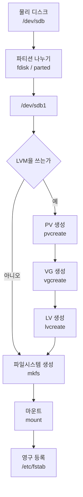
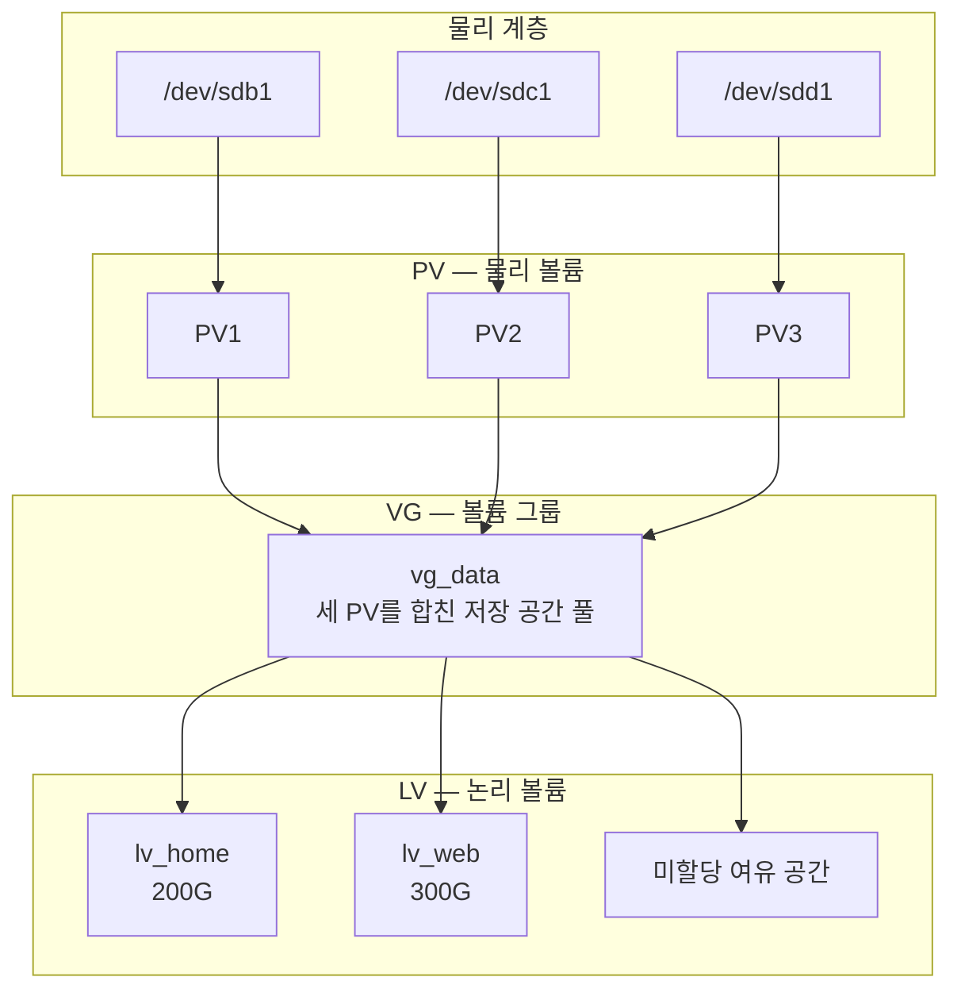
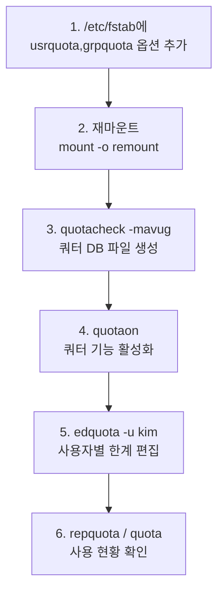

<Callout type="info">
  **이번 문서의 목표:** 이 파일을 다 읽으면 디스크 한 장이 파티션과 LVM을 거쳐 마운트된 디렉터리가 되기까지의 전 과정을 순서대로 설명할 수 있고, 각 단계에 쓰이는 명령을 계층별로 구분하며, 쿼터의 soft와 hard 한계가 어떻게 다르게 작동하는지 판단할 수 있게 된다.
</Callout>

## 디스크 한 장이 디렉터리가 되기까지

08편에서 마운트를 다뤘습니다. 그런데 마운트하려면 그전에 준비해야 할 것이 여럿 있습니다. 전체 흐름을 먼저 봅시다.



> **쉽게 말하면:** 디스크는 땅, 파티션은 필지 분할, 파일시스템은 건물, 마운트는 그 건물에 주소를 붙이는 일입니다. LVM은 여러 필지를 합쳐 놓고 원하는 크기로 다시 잘라 쓰는 재개발 조합입니다.

## 1. 장치 이름 읽는 법

리눅스는 저장 장치를 `/dev` 아래 파일로 표현합니다. 이름 규칙 자체가 출제 대상입니다.

| 장치명 | 종류 |
|--------|------|
| `/dev/sda`, `/dev/sdb` | SCSI·SATA·USB·SAS 디스크. 인식 순서대로 a, b, c |
| `/dev/nvme0n1` | NVMe SSD. 컨트롤러 0의 네임스페이스 1 |
| `/dev/vda` | 가상화 환경의 virtio 디스크 |
| `/dev/hda` | 구형 IDE·PATA 디스크 (현재는 거의 사용 안 함) |

파티션 번호는 뒤에 붙습니다.

| 번호 | 의미 (MBR 기준) |
|------|------------------|
| `sda1`–`sda4` | **주 파티션**(primary) 또는 확장 파티션(extended) |
| `sda5` 이상 | **논리 파티션**(logical). 확장 파티션 안에 만들어짐 |

**MBR에서 논리 파티션 번호가 반드시 5부터 시작한다**는 점이 함정으로 자주 나옵니다. 주 파티션을 두 개만 만들었더라도 논리 파티션은 3번이 아니라 5번부터입니다. 1번부터 4번 자리는 파티션 테이블 구조상 예약되어 있기 때문입니다.

NVMe는 규칙이 다릅니다. `/dev/nvme0n1p1`처럼 파티션 앞에 `p`가 붙습니다.

## 2. MBR과 GPT

| 항목 | MBR | GPT |
|------|-----|-----|
| 정식 이름 | Master Boot Record | GUID Partition Table |
| 등장 시기 | 1983년 | 2000년대 초 (UEFI와 함께) |
| 위치 | 디스크 **첫 512바이트** | 디스크 앞과 **뒤에 사본** |
| 최대 디스크 크기 | **2TB** | 사실상 무제한 (약 9.4ZB) |
| 파티션 개수 | 주 4개 (확장으로 우회) | **기본 128개** |
| 파티션 테이블 백업 | 없음 | **디스크 끝에 사본 보관** |
| 무결성 검사 | 없음 | CRC32 체크섬 |
| 짝이 되는 펌웨어 | BIOS | UEFI |

**MBR의 2TB 한계**가 GPT 등장의 결정적 이유입니다. MBR은 파티션의 시작 위치와 크기를 32비트로 저장합니다. 섹터 하나가 512바이트이므로 표현 가능한 최대 크기는 2의 32제곱 곱하기 512바이트, 곧 약 2TB입니다.

MBR 첫 512바이트의 내부 구조도 출제됩니다.

| 영역 | 크기 | 내용 |
|------|------|------|
| 부트 코드 | 446바이트 | 부트로더 1단계 |
| 파티션 테이블 | 64바이트 | 항목 4개 곱하기 16바이트 |
| 시그니처 | 2바이트 | `0xAA55` |

파티션 테이블이 64바이트이고 한 항목이 16바이트라서 **주 파티션이 4개로 제한**되는 것입니다. 숫자가 그냥 정해진 게 아니라 구조에서 나옵니다.

### 파티션 유형 ID

`fdisk`에서 파티션의 종류를 16진수 코드로 지정합니다.

| 코드 | 유형 |
|------|------|
| `83` | Linux (일반 파일시스템) |
| `82` | Linux swap |
| `8e` | **Linux LVM** |
| `fd` | Linux RAID autodetect |
| `ef` | EFI System Partition |

이 코드는 **파일시스템을 실제로 바꾸는 것이 아니라 표시일 뿐**입니다. 그래도 LVM으로 쓸 파티션은 `8e`로 표시해 두는 것이 관례이고, 시험에서는 `8e`와 `fd`의 구분을 묻습니다.

### 파티션 도구 비교

| 도구 | 특징 |
|------|------|
| `fdisk` | 대화형. 전통적으로 MBR 전용이었으나 최신 버전은 GPT도 지원 |
| `gdisk` | GPT 전용 대화형 도구 |
| `parted` | MBR·GPT 모두 지원. 대화형과 명령행 모두 가능, 온라인 크기 조정 지원 |
| `lsblk` | 블록 장치 **트리 구조 조회** |
| `blkid` | 장치의 **UUID와 파일시스템 종류** 조회 |
| `partprobe` | 커널에 파티션 테이블 변경을 다시 읽히기 |

```bash
# fdisk -l                # 전체 디스크와 파티션 목록
# fdisk /dev/sdb          # 대화형 편집
# lsblk
NAME          MAJ:MIN RM  SIZE RO TYPE MOUNTPOINT
sda             8:0     0  100G  0 disk
├─sda1          8:1     0    1G  0 part /boot
└─sda2          8:2     0   99G  0 part
  ├─vg00-root 253:0     0   50G  0 lvm  /
  └─vg00-swap 253:1     0    4G  0 lvm  [SWAP]
sdb             8:16    0  500G  0 disk
```

`lsblk` 출력에서 TYPE 열이 `disk`, `part`, `lvm`으로 계층을 보여 주는 것을 눈여겨봅시다. 물리 디스크 위에 파티션, 그 위에 LVM 논리 볼륨이 얹힌 구조가 그대로 드러납니다.

## 3. LVM — 왜 필요한가

파티션의 근본 문제는 **크기가 고정**이라는 점입니다. `/home`을 50GB로 잡았는데 나중에 부족해지면 어떻게 할까요? 전통적인 방식으로는 백업하고, 파티션을 다시 나누고, 복원해야 합니다. 서비스를 멈춰야 합니다.

**LVM**(Logical Volume Manager, 논리 볼륨 관리자)은 물리 디스크와 파일시스템 사이에 **추상화 계층**을 하나 넣어 이 문제를 해결합니다.

### 세 개의 계층



| 계층 | 이름 | 비유 |
|------|------|------|
| PV | Physical Volume, 물리 볼륨 | 창고에 넣을 **낱개의 상자** |
| VG | Volume Group, 볼륨 그룹 | 상자를 모두 쏟아부은 **공용 창고** |
| LV | Logical Volume, 논리 볼륨 | 창고에서 필요한 만큼 퍼 온 **양동이** |
| PE | Physical Extent, 물리 익스텐트 | 창고 안 물건을 세는 **최소 단위** (기본 4MB) |

**PE**(Physical Extent)가 핵심 개념입니다. VG는 공간을 바이트가 아니라 PE라는 균일한 조각 단위로 관리합니다. 기본 크기는 4MB입니다. LV를 만들면 필요한 개수의 PE가 배정되고, 그 PE들은 여러 PV에 흩어져 있어도 상관없습니다. **물리적으로 떨어져 있어도 논리적으로 연속인 것처럼 보이게 하는 것**이 LVM의 마술입니다.

### 계층별 명령 대응표

명령 이름이 계층 이름의 약자로 시작한다는 규칙만 알면 절반은 외운 셈입니다.

| 동작 | PV | VG | LV |
|------|-----|-----|-----|
| 생성 | `pvcreate` | `vgcreate` | `lvcreate` |
| 조회 (요약) | `pvs` | `vgs` | `lvs` |
| 조회 (상세) | `pvdisplay` | `vgdisplay` | `lvdisplay` |
| 확장 | – | `vgextend` | `lvextend` |
| 축소 | – | `vgreduce` | `lvreduce` |
| 삭제 | `pvremove` | `vgremove` | `lvremove` |
| 이름 변경 | – | `vgrename` | `lvrename` |
| 스캔 | `pvscan` | `vgscan` | `lvscan` |

**`vgextend`와 `lvextend`의 차이**가 대표 함정입니다.

| 명령 | 하는 일 |
|------|---------|
| `vgextend` | **볼륨 그룹에 새 PV를 추가** — 창고 자체를 키운다 |
| `lvextend` | **논리 볼륨의 크기를 늘림** — 창고에서 더 퍼 간다 |

VG에 여유 공간이 없으면 `lvextend`는 실패합니다. 그럴 때 먼저 `pvcreate`로 새 디스크를 준비하고 `vgextend`로 VG에 넣은 다음 `lvextend`를 해야 합니다.

### 실제 구축 순서

```bash
# pvcreate /dev/sdb1 /dev/sdc1              # 1. PV 생성
# vgcreate vg_data /dev/sdb1 /dev/sdc1      # 2. VG 생성
# lvcreate -L 200G -n lv_home vg_data       # 3. LV 생성 (크기 지정)
# lvcreate -l 100%FREE -n lv_rest vg_data   # 남은 공간 전부
# mkfs.xfs /dev/vg_data/lv_home             # 4. 파일시스템 생성
# mount /dev/vg_data/lv_home /home          # 5. 마운트
```

`lvcreate`의 대소문자 옵션 구분이 나옵니다.

| 옵션 | 단위 |
|------|------|
| `-L` | **용량** (200G, 512M 등) |
| `-l` | **PE 개수** 또는 백분율 (100%FREE 등) |
| `-n` | 논리 볼륨 이름 |
| `-s` | 스냅샷 생성 |

LV의 장치 경로는 두 가지로 표현됩니다. `/dev/볼륨그룹명/논리볼륨명`과 `/dev/mapper/볼륨그룹명-논리볼륨명`입니다. 둘 다 같은 장치를 가리킵니다. `lsblk`에서 보이는 `vg00-root` 형태가 후자입니다.

### 온라인 확장 — LVM의 진짜 가치

```bash
# lvextend -L +100G /dev/vg_data/lv_home    # LV를 100G 늘림
# xfs_growfs /home                          # XFS 파일시스템 확장
# resize2fs /dev/vg_data/lv_home            # ext4는 이 명령
```

**LV를 늘리는 것과 파일시스템을 늘리는 것은 별개의 두 단계**입니다. LV만 늘리면 그릇은 커졌지만 그 안의 파일시스템은 여전히 옛 크기라서 `df`에 반영되지 않습니다. 이 두 단계 구분이 반드시 출제됩니다.

`lvextend -r` 옵션을 주면 파일시스템 확장까지 한 번에 처리합니다.

| 파일시스템 | 확장 | 축소 |
|------------|------|------|
| ext4 | `resize2fs` | **가능** (언마운트 후) |
| XFS | `xfs_growfs` | **불가능** |

**XFS는 축소가 원천적으로 불가능합니다.** RHEL 7 이상의 기본 파일시스템이 XFS이므로 실무에서 중요한 제약이고, 시험에도 나옵니다. 줄여야 한다면 백업 후 새로 만드는 수밖에 없습니다.

### 스냅샷

```bash
# lvcreate -L 10G -s -n snap_home /dev/vg_data/lv_home
```

스냅샷은 **그 시점의 상태를 보존하는 논리 볼륨**입니다. 원리는 CoW(Copy on Write, 쓰기 시 복사)입니다. 원본이 바뀌려 할 때 **바뀌기 직전의 원래 블록만** 스냅샷 영역에 복사합니다. 그래서 스냅샷 크기는 원본 전체가 아니라 "변경될 양"만큼만 있으면 됩니다. 백업을 뜨는 동안 데이터가 흔들리지 않게 하는 용도로 씁니다.

스냅샷 영역이 가득 차면 스냅샷이 무효화됩니다. 이 점이 함정 보기로 나옵니다.

## 4. 파일시스템 생성과 확인

| 명령 | 하는 일 |
|------|---------|
| `mkfs -t ext4 /dev/sdb1` | 파일시스템 생성 (타입 지정) |
| `mkfs.xfs /dev/sdb1` | XFS 전용 형태 |
| `mkswap /dev/sdb2` | 스왑 영역 생성 |
| `swapon /dev/sdb2` | 스왑 활성화 |
| `fsck -t ext4 /dev/sdb1` | 파일시스템 검사·복구 |
| `xfs_repair /dev/sdb1` | XFS 전용 복구 |
| `df -h` | 마운트된 파일시스템의 **사용량** |
| `df -i` | **inode** 사용량 |
| `du -sh /home` | 디렉터리별 **실제 점유 용량** |
| `blkid` | UUID와 파일시스템 타입 |

**`df`와 `du`의 차이**를 정확히 구분해야 합니다.

| 명령 | 보는 대상 | 정보 출처 |
|------|-----------|-----------|
| `df` | **파일시스템 전체** 사용량 | 슈퍼블록의 통계 |
| `du` | **지정한 디렉터리** 아래 파일들의 합 | 파일을 직접 순회 |

`df`는 여유가 없다는데 `du`로 세어 보면 용량이 남는 경우가 있습니다. 삭제된 파일을 프로세스가 여전히 열고 있으면 파일 이름은 사라져도 블록은 반납되지 않기 때문입니다. `du`는 이름이 없는 파일을 세지 못하고 `df`는 셉니다.

**`fsck`는 반드시 언마운트 상태에서 실행**해야 합니다. 마운트된 채로 검사하면 파일시스템이 손상될 수 있습니다.

### /etc/fstab 여섯 필드

```
UUID=a1b2c3d4-...  /home  xfs  defaults        0 0
/dev/vg_data/lv_web  /var/www  ext4  defaults,noatime  0 2
```

| 순서 | 이름 | 의미 |
|------|------|------|
| 1 | 장치 | 장치 파일, **UUID**, 또는 LABEL |
| 2 | 마운트 지점 | 붙일 디렉터리 |
| 3 | 파일시스템 종류 | xfs, ext4, swap 등 |
| 4 | 옵션 | defaults, noatime, ro 등 |
| 5 | dump | 백업 대상이면 1, 아니면 **0** |
| 6 | fsck 순서 | 루트는 **1**, 나머지는 **2**, 검사 안 하면 **0** |

UUID를 쓰는 이유가 있습니다. 장치 이름 `/dev/sdb`는 **디스크를 꽂는 순서에 따라 바뀔 수 있습니다.** 디스크를 하나 추가했다가 이름이 밀리면 엉뚱한 장치를 마운트하게 됩니다. UUID는 파일시스템을 만들 때 부여되어 바뀌지 않으므로 안전합니다.

여섯 번째 필드에서 **루트 파일시스템만 1**이고 나머지는 2라는 점, 그리고 0이면 검사를 아예 하지 않는다는 점이 출제 포인트입니다.

## 5. 쿼터 — 사용량 제한

### 왜 필요한가

여러 사용자가 쓰는 서버에서 한 사람이 `/home`을 가득 채우면 나머지 전원이 파일을 못 만듭니다. **쿼터**(quota)는 사용자별·그룹별로 사용량 상한을 두어 이를 막습니다.

제한 대상은 두 가지입니다.

| 대상 | 뜻 |
|------|-----|
| 블록(block) | **용량** 제한 |
| 아이노드(inode) | **파일 개수** 제한 |

아이노드 제한이 필요한 이유는, 1바이트짜리 파일 수백만 개도 파일시스템을 마비시킬 수 있기 때문입니다.

### soft와 hard — 유예 기간이 관건

| 한계 | 동작 |
|------|------|
| **soft limit** | 넘어도 즉시 막지 않고 **경고**. 다만 **유예 기간**(grace period) 안에 줄이지 않으면 그때부터 차단 |
| **hard limit** | **절대 넘을 수 없음.** 즉시 쓰기 실패 |
| grace period | soft를 넘긴 상태로 허용되는 기간. 기본 7일 |

핵심은 이것입니다. **soft를 넘긴 채 유예 기간이 지나면 soft가 hard처럼 작동합니다.** "soft는 그냥 경고일 뿐"이라고 답하면 함정에 걸립니다.

### 설정 흐름



```
/dev/vg_data/lv_home  /home  ext4  defaults,usrquota,grpquota  0 2
```

`usrquota`는 사용자 쿼터, `grpquota`는 그룹 쿼터입니다. 이 옵션이 fstab에 없으면 나머지 단계가 모두 무의미합니다.

### 명령 비교

| 명령 | 하는 일 |
|------|---------|
| `quotacheck -mavug` | 파일시스템을 검사해 **쿼터 DB 파일 생성·갱신** |
| `quotaon /home` | 쿼터 활성화 |
| `quotaoff /home` | 쿼터 비활성화 |
| `edquota -u kim` | **편집기를 띄워** kim의 한계를 수정 |
| `edquota -g devteam` | 그룹 쿼터 편집 |
| `edquota -t` | **유예 기간** 설정 |
| `edquota -p kim lee` | kim의 설정을 lee에게 **복사**(prototype) |
| `setquota -u kim 100M 200M 0 0 /home` | **편집기 없이** 명령행에서 직접 설정 |
| `quota -u kim` | 특정 사용자의 사용량 조회 |
| `repquota -a` | **전체 사용자**의 쿼터 현황 보고 |
| `xfs_quota` | **XFS 전용** 쿼터 관리 도구 |

`quotacheck`의 옵션도 자주 나옵니다.

| 옵션 | 뜻 |
|------|-----|
| `-a` | fstab의 모든 대상 |
| `-u` | 사용자 쿼터 |
| `-g` | 그룹 쿼터 |
| `-m` | 재마운트하지 않고 강행 |
| `-v` | 진행 상황 출력 |

`edquota`와 `setquota`의 차이가 실무형 함정입니다. **`edquota`는 대화형 편집기를 띄우고, `setquota`는 명령행 한 줄로 끝냅니다.** 스크립트로 자동화하려면 `setquota`를 씁니다.

### edquota 편집 화면 읽기

```
Disk quotas for user kim (uid 1001):
  Filesystem   blocks   soft   hard   inodes   soft   hard
  /dev/sdb1     51200  102400 204800     120    500   1000
```

| 열 | 의미 |
|----|------|
| `blocks` | **현재 사용 중인** 용량 (1KB 단위) |
| 첫 soft·hard | 용량 제한 |
| `inodes` | 현재 파일 개수 |
| 둘째 soft·hard | 파일 개수 제한 |

**값을 0으로 두면 그 항목은 제한 없음**입니다. `blocks`와 `inodes`의 현재 값을 직접 고쳐도 소용없습니다. 실제 사용량이므로 다음 검사에서 원래 값으로 되돌아옵니다.

### XFS 쿼터는 다르다

XFS는 쿼터 정보를 파일시스템 내부 메타데이터로 관리하므로 `quotacheck`가 필요 없고, 별도의 DB 파일도 만들지 않습니다. 마운트 옵션도 `usrquota` 대신 `uquota`, `gquota`, `pquota`를 쓰는 것이 정식입니다. 관리 도구는 `xfs_quota` 하나로 통합되어 있습니다.

```bash
# xfs_quota -x -c "limit bsoft=100m bhard=200m kim" /home
# xfs_quota -x -c "report -h" /home
```

`-x`는 전문가 모드(expert), `-c`는 명령 지정입니다.

## 6. RAID를 잠깐

디스크 여러 장을 묶는 또 다른 방식이 RAID입니다. LVM과 목적이 다릅니다. **LVM은 유연한 크기 관리, RAID는 성능과 내결함성**입니다.

| 레벨 | 구성 | 최소 디스크 | 사용 가능 용량 | 내결함성 |
|------|------|--------------|------------------|-----------|
| RAID 0 | 스트라이핑 | 2 | 전체 | **없음** |
| RAID 1 | 미러링 | 2 | **절반** | 1개 고장 허용 |
| RAID 5 | 스트라이핑 + 분산 패리티 | 3 | (N 빼기 1) 곱하기 용량 | 1개 고장 허용 |
| RAID 6 | 이중 패리티 | 4 | (N 빼기 2) 곱하기 용량 | 2개 고장 허용 |
| RAID 10 | 1과 0의 결합 | 4 | 절반 | 그룹당 1개 허용 |

계산 문제가 기출로 나옵니다. 10GB 디스크 6개에서 하나를 스페어로 빼고 RAID 5를 구성하면, 실제 참여 디스크는 5개이므로 사용 가능 용량은 5에서 1을 뺀 4에 10GB를 곱한 **40GB**입니다. 스페어 디스크를 용량 계산에 포함하지 않는 것이 요점입니다.

리눅스 소프트웨어 RAID는 `mdadm`으로 관리하고, 상태는 `/proc/mdstat`에서 확인합니다.

## 핵심 정리

- MBR은 **주 파티션 4개, 최대 2TB** 제한이 있고 논리 파티션 번호는 **5번부터** 시작합니다. GPT는 기본 128개 파티션과 사실상 무제한 용량을 지원하며 파티션 테이블 사본을 디스크 끝에도 둡니다.
- LVM의 계층은 **PV → VG → LV**이며 공간은 **PE**(기본 4MB) 단위로 관리됩니다. `vgextend`는 VG에 디스크를 추가하고 `lvextend`는 LV 크기를 늘리는 서로 다른 명령입니다.
- LV를 늘린 뒤에는 **파일시스템도 따로 확장**해야 합니다. XFS는 `xfs_growfs`, ext4는 `resize2fs`이고 **XFS는 축소가 불가능**합니다.
- `df`는 파일시스템 통계를, `du`는 파일을 직접 순회한 합을 보여 주므로 결과가 다를 수 있습니다.
- `/etc/fstab` 6번 필드는 **루트가 1, 나머지가 2, 검사 안 함이 0**입니다.
- 쿼터의 **soft는 유예 기간이 지나면 hard처럼 작동**합니다. 제한 대상은 블록(용량)과 아이노드(파일 개수) 두 가지입니다.
- `edquota`는 편집기를 띄우고 `setquota`는 명령행에서 직접 지정하며, **XFS는 `xfs_quota`** 를 쓰고 `quotacheck` 단계가 필요 없습니다.

## 마무리 복습

<Quiz
  questionNumber={1}
  question="LVM 구성에서 물리 볼륨과 논리 볼륨 사이에 위치하며 여러 물리 볼륨을 하나의 저장 공간 풀로 묶는 계층으로 알맞은 것은?"
  options={['PE (Physical Extent)', 'VG (Volume Group)', 'LE (Logical Extent)', 'PV (Physical Volume)']}
  correctAnswer={2}
  explanation="LVM의 계층은 PV에서 VG로 그리고 VG에서 LV로 이어진다. VG는 여러 PV를 합쳐 하나의 공용 저장 공간으로 만들고 그 안에서 LV를 잘라 낸다."
  optionExplanations={['PE는 VG가 공간을 관리하는 최소 단위이지 계층 이름이 아니다', '정답 — 볼륨 그룹이 물리 볼륨을 묶는 중간 계층이다', 'LE는 논리 볼륨 쪽의 익스텐트 단위를 가리킨다', 'PV는 물리 디스크나 파티션을 LVM이 쓸 수 있게 초기화한 최하위 계층이다']}
/>

<Quiz
  questionNumber={2}
  question="볼륨 그룹 vg_data 에 여유 공간이 전혀 없는 상태에서 논리 볼륨 lv_home 의 크기를 늘리려고 한다. 가장 먼저 수행해야 할 작업으로 알맞은 것은?"
  options={['lvextend 명령으로 바로 크기를 늘린다', '새 디스크를 pvcreate 로 초기화한 뒤 vgextend 로 볼륨 그룹에 추가한다', 'resize2fs 명령으로 파일시스템을 먼저 늘린다', 'lvreduce 로 다른 논리 볼륨을 줄인 뒤 자동 반영되기를 기다린다']}
  correctAnswer={2}
  explanation="논리 볼륨은 볼륨 그룹의 여유 공간에서만 확장할 수 있다. 여유가 없으면 새 물리 볼륨을 만들어 vgextend 로 볼륨 그룹 자체를 키운 뒤에야 lvextend 가 가능하다."
  optionExplanations={['여유 PE가 없으므로 명령이 실패한다', '정답 — 창고를 먼저 키우고 그다음에 퍼 가는 순서다', '파일시스템 확장은 논리 볼륨을 늘린 다음 단계다', 'lvreduce로 공간을 회수할 수는 있으나 자동 반영되지 않으며 축소 자체가 위험한 작업이다']}
/>

<Quiz
  questionNumber={3}
  question="다음 ( 괄호 ) 안에 들어갈 내용으로 알맞은 것은? MBR 방식 디스크에서 주 파티션과 확장 파티션은 1번부터 4번까지의 번호를 사용하고 확장 파티션 안에 만드는 논리 파티션은 ( )번부터 번호가 부여된다."
  options={['3', '4', '5', '6']}
  correctAnswer={3}
  explanation="MBR의 파티션 테이블은 64바이트에 16바이트짜리 항목 네 개만 담을 수 있으므로 1번부터 4번 자리가 구조적으로 예약되어 있다. 따라서 논리 파티션은 실제 주 파티션 개수와 무관하게 항상 5번부터 시작한다."
  optionExplanations={['주 파티션을 두 개만 만들었어도 3번으로 내려오지 않는다', '4번까지는 파티션 테이블 항목 자리로 예약되어 있다', '정답 — 논리 파티션 번호는 항상 5부터 시작한다', '6번은 두 번째 논리 파티션의 번호다']}
/>

<Quiz
  questionNumber={4}
  question="디스크 쿼터에서 soft limit 에 대한 설명으로 가장 알맞은 것은?"
  options={['어떤 경우에도 초과할 수 없는 절대적인 한계다', '초과해도 유예 기간 안에는 사용할 수 있으나 기간이 지나면 더 이상 쓸 수 없다', '설정만 가능하고 실제 동작에는 아무 영향을 주지 않는 참고 값이다', '파일 개수에만 적용되고 용량에는 적용되지 않는다']}
  correctAnswer={2}
  explanation="soft limit은 초과 즉시 차단하지 않고 경고를 보내며 유예 기간 동안만 초과 사용을 허용한다. 유예 기간이 끝나도 사용량을 줄이지 않으면 hard limit과 같이 쓰기가 차단된다."
  optionExplanations={['절대 초과할 수 없는 것은 hard limit이다', '정답 — 유예 기간이 지나면 차단되는 것이 핵심이다', '실제로 차단 동작이 발생하므로 단순 참고 값이 아니다', 'soft와 hard 모두 용량과 파일 개수 양쪽에 설정할 수 있다']}
/>

<Quiz
  questionNumber={5}
  question="XFS 파일시스템에 대한 설명으로 틀린 것은?"
  options={['xfs_growfs 명령으로 마운트한 상태에서 크기를 늘릴 수 있다', 'CentOS 7 이상의 기본 파일시스템으로 채택되었다', 'resize2fs 명령으로 크기를 줄일 수 있다', '쿼터 관리에는 xfs_quota 명령을 사용한다']}
  correctAnswer={3}
  explanation="resize2fs는 ext 계열 전용 도구이며 XFS에는 사용할 수 없다. 또한 XFS는 설계상 축소 자체를 지원하지 않으므로 용량을 줄이려면 백업 후 새로 만들어야 한다."
  optionExplanations={['XFS는 온라인 확장을 지원하며 xfs_growfs를 사용한다', 'RHEL과 CentOS 7부터 기본 파일시스템이 XFS로 바뀌었다', '정답(틀린 설명) — resize2fs는 ext 계열용이고 XFS는 축소가 불가능하다', 'XFS 전용 쿼터 도구가 xfs_quota가 맞다']}
/>

<Quiz
  questionNumber={6}
  question="etc fstab 파일의 여섯 번째 필드에 대한 설명으로 알맞은 것은?"
  options={['dump 명령의 백업 대상 여부를 지정한다', '부팅 시 fsck 검사 순서를 지정하며 루트 파일시스템은 1을 사용한다', '마운트 옵션을 쉼표로 나열한다', '파일시스템의 종류를 지정한다']}
  correctAnswer={2}
  explanation="여섯 번째 필드는 부팅 시 파일시스템 검사 순서다. 루트 파일시스템은 1을 지정해 가장 먼저 검사하고 나머지 파일시스템은 2를 지정하며 검사하지 않으려면 0을 쓴다."
  optionExplanations={['dump 여부는 다섯 번째 필드다', '정답 — 루트가 1이고 나머지가 2라는 점이 출제 포인트다', '마운트 옵션은 네 번째 필드다', '파일시스템 종류는 세 번째 필드다']}
/>

<Quiz
  questionNumber={7}
  question="10GB 하드디스크 6개가 장착된 시스템에서 1개를 스페어 디스크로 지정하고 나머지를 RAID 5로 구성했을 때 실제 사용 가능한 용량으로 알맞은 것은?"
  options={['30GB', '40GB', '50GB', '60GB']}
  correctAnswer={2}
  explanation="스페어 디스크는 평소에는 대기 상태이므로 용량 계산에서 제외한다. RAID 5에 참여하는 디스크는 5개이고 그중 1개 분량이 패리티로 쓰이므로 사용 가능 용량은 4개 분량인 40GB가 된다."
  optionExplanations={['스페어를 2개로 계산했을 때 나오는 값이다', '정답 — 참여 디스크 5개에서 패리티 1개 분량을 뺀 값이다', '패리티 공간을 빼지 않은 값이다', '전체 디스크 용량으로 RAID 5의 패리티와 스페어를 모두 무시한 값이다']}
/>

<Quiz
  questionNumber={8}
  question="사용자별 쿼터 한계를 편집기를 띄우지 않고 명령행에서 한 번에 지정할 때 사용하는 명령으로 알맞은 것은?"
  options={['edquota', 'setquota', 'quotacheck', 'repquota']}
  correctAnswer={2}
  explanation="setquota는 사용자와 soft 및 hard 한계 값을 인자로 받아 대화형 편집 없이 설정을 완료하므로 스크립트 자동화에 적합하다."
  optionExplanations={['edquota는 vi 같은 편집기를 실행해 대화형으로 수정한다', '정답 — 명령행 한 줄로 한계를 지정한다', 'quotacheck는 쿼터 데이터베이스 파일을 생성하고 갱신하는 명령이다', 'repquota는 설정된 쿼터 현황을 보고하는 조회 명령이다']}
/>

## 참고 자료

- [man7.org — lvm(8) 매뉴얼 페이지](https://man7.org/linux/man-pages/man8/lvm.8.html)
- [man7.org — fstab(5) 매뉴얼 페이지](https://man7.org/linux/man-pages/man5/fstab.5.html)
- [man7.org — quotactl(2) 매뉴얼 페이지](https://man7.org/linux/man-pages/man2/quotactl.2.html)
- [Red Hat Enterprise Linux 문서 — Configuring and managing logical volumes](https://docs.redhat.com/en/documentation/red_hat_enterprise_linux/9/html/configuring_and_managing_logical_volumes/)
- [Red Hat Enterprise Linux 문서 — Managing file systems](https://docs.redhat.com/en/documentation/red_hat_enterprise_linux/9/html/managing_file_systems/)
