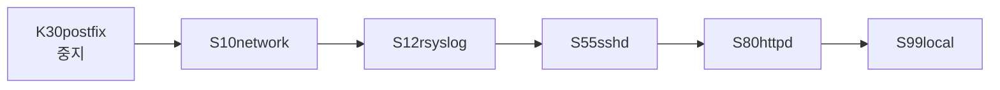
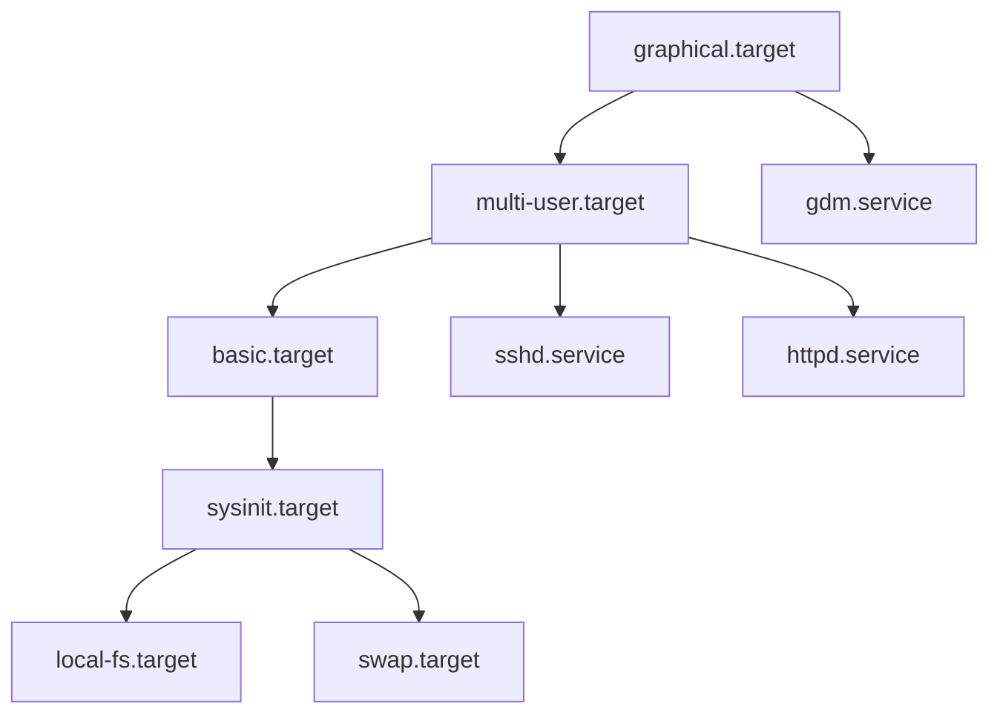

<Callout type="info">
  **이번 문서의 목표:** 이 파일을 다 읽으면 SysV의 `service`·`chkconfig` 명령과 systemd의 `systemctl` 하위 명령을 정확히 대응시킬 수 있고, 유닛 파일의 세 섹션이 각각 무엇을 결정하는지 읽어 낼 수 있으며, Wants와 Requires 같은 의존성 지시자와 After의 차이를 구분할 수 있게 된다.
</Callout>

## 서비스 관리가 왜 바뀌었는가

10편에서 부팅 흐름을 다뤘습니다. 여기서는 **서비스 하나를 시작하고 멈추고 부팅 시 자동 실행되게 하는 실무 작업**을 두 체계로 나누어 봅니다.

SysV init의 방식은 단순합니다. 셸 스크립트를 이름 순서대로 하나씩 실행합니다. 단순한 만큼 세 가지 문제가 있었습니다.

| 문제 | 내용 |
|------|------|
| **느림** | 스크립트를 하나씩 순차 실행. 앞의 것이 끝나야 다음 것이 시작됨 |
| **의존성 표현이 빈약** | `S10`, `S20` 같은 **숫자 접두어로만** 순서를 표현. "무엇이 필요한지"는 표현 못 함 |
| **프로세스 추적이 어려움** | 스크립트가 데몬을 띄우고 종료되면 그 뒤 자식 프로세스를 추적할 방법이 마땅치 않음 |

**systemd**는 이 셋을 모두 겨냥해 설계되었습니다.

| 해법 | 방식 |
|------|------|
| 병렬 기동 | 의존성이 없는 서비스는 **동시에** 시작 |
| 선언적 의존성 | `Requires=`, `After=` 등으로 **관계를 명시** |
| cgroup 추적 | 서비스가 만든 **모든 자식 프로세스를 cgroup으로 묶어** 확실히 관리 |

> **쉽게 말하면:** SysV는 "정해진 순서대로 한 명씩 입장"이고, systemd는 "필요한 사람만 기다리고 나머지는 동시에 입장"입니다.

## 1. SysV init 구조

### 스크립트가 있는 곳

```
/etc/init.d/          실제 서비스 제어 스크립트 원본
/etc/rc.d/rc0.d/      런레벨 0에서 실행할 것들 (심볼릭 링크)
/etc/rc.d/rc3.d/      런레벨 3에서 실행할 것들
/etc/rc.d/rc5.d/      런레벨 5에서 실행할 것들
```

각 런레벨 디렉터리 안의 파일은 **원본 스크립트를 가리키는 심볼릭 링크**입니다. 이름 규칙이 전부입니다.

```
/etc/rc.d/rc3.d/S55sshd -> ../init.d/sshd
/etc/rc.d/rc3.d/K30postfix -> ../init.d/postfix
```

| 요소 | 의미 |
|------|------|
| `S` | **Start** — 해당 런레벨 진입 시 `start` 인자로 실행 |
| `K` | **Kill** — 해당 런레벨 진입 시 `stop` 인자로 실행 |
| 숫자 | **실행 순서.** 작을수록 먼저. S는 오름차순, K도 오름차순 |
| 이름 | 서비스 이름 |



`S99local`이 마지막에 오는 이유가 있습니다. 이것은 `/etc/rc.d/rc.local`을 가리키고, 관리자가 부팅 마지막에 실행할 명령을 직접 적어 두는 자리입니다. **번호 99가 "가장 마지막"을 뜻한다**는 규칙 때문에 이 이름을 씁니다.

### SysV 명령 세 가지

```bash
# service sshd start           # 시작
# service sshd stop            # 중지
# service sshd restart         # 재시작
# service sshd status          # 상태 확인
# service --status-all         # 전체 상태

# /etc/init.d/sshd restart     # 스크립트 직접 호출 (동일)

# chkconfig --list sshd        # 런레벨별 자동 실행 설정 확인
sshd    0:off  1:off  2:on  3:on  4:on  5:on  6:off
# chkconfig sshd on            # 2,3,4,5 런레벨에 자동 실행 등록
# chkconfig --level 35 sshd on # 특정 런레벨만 지정
# chkconfig sshd off           # 자동 실행 해제
```

**`service`와 `chkconfig`의 역할 분담**이 핵심입니다.

| 명령 | 다루는 것 | 시점 |
|------|-----------|------|
| `service` | **지금 당장** 서비스를 켜고 끔 | 현재 |
| `chkconfig` | **부팅 시 자동 실행** 여부 등록 | 다음 부팅부터 |

`service httpd start`로 시작한 서비스는 **재부팅하면 꺼집니다.** `chkconfig httpd on`을 따로 해야 다음 부팅에도 살아납니다. 데비안 계열에서는 `chkconfig` 대신 `update-rc.d`를 씁니다.

## 2. systemd 유닛

systemd는 관리 대상을 **유닛**(unit)이라는 하나의 개념으로 통일했습니다. 서비스도, 마운트 지점도, 소켓도, 부팅 목표 상태도 전부 유닛입니다.

| 확장자 | 유닛 종류 | 관리 대상 |
|--------|-----------|-----------|
| `.service` | 서비스 | 데몬 프로세스 |
| `.target` | 타깃 | **유닛의 묶음.** 런레벨을 대체 |
| `.mount` | 마운트 | 마운트 지점 |
| `.automount` | 자동 마운트 | 접근할 때 마운트 |
| `.socket` | 소켓 | 소켓 활성화 (요청이 오면 서비스 기동) |
| `.timer` | 타이머 | **cron을 대체**하는 시간 기반 실행 |
| `.device` | 장치 | udev가 인식한 장치 |
| `.swap` | 스왑 | 스왑 영역 |
| `.path` | 경로 | 파일·디렉터리 변화 감시 |
| `.slice` | 슬라이스 | cgroup 자원 분배 그룹 |
| `.scope` | 스코프 | 외부에서 만들어진 프로세스 묶음 |

### 유닛 파일이 있는 곳 — 우선순위가 중요하다

| 경로 | 용도 | 우선순위 |
|------|------|----------|
| `/etc/systemd/system/` | **관리자가 만들거나 수정한** 유닛 | **가장 높음** |
| `/run/systemd/system/` | 런타임에 생성된 유닛 | 중간 |
| `/usr/lib/systemd/system/` | **패키지가 설치한** 원본 유닛 | 가장 낮음 |

같은 이름의 유닛이 여러 곳에 있으면 `/etc` 아래 것이 이깁니다. **패키지가 제공한 유닛을 고치고 싶을 때 `/usr/lib` 아래 원본을 직접 수정하면 안 됩니다.** 패키지를 업데이트하면 덮어써지기 때문입니다. `/etc/systemd/system/`에 복사해서 고치거나 `systemctl edit`로 덮어쓰기 조각을 만듭니다.

### 유닛 파일 세 섹션

```ini
[Unit]
Description=OpenSSH server daemon
Documentation=man:sshd(8)
After=network.target sshd-keygen.service
Wants=sshd-keygen.service

[Service]
Type=notify
EnvironmentFile=/etc/sysconfig/sshd
ExecStart=/usr/sbin/sshd -D $OPTIONS
ExecReload=/bin/kill -HUP $MAINPID
Restart=on-failure
RestartSec=42s

[Install]
WantedBy=multi-user.target
```

| 섹션 | 담당 |
|------|------|
| `[Unit]` | **설명과 의존 관계.** 어떤 유닛 다음에, 무엇을 필요로 하는지 |
| `[Service]` | **어떻게 실행할지.** 실행 명령, 재시작 정책, 프로세스 유형 |
| `[Install]` | **enable했을 때 어디에 연결할지.** 자동 실행 등록 정보 |

`[Install]` 섹션이 없는 유닛은 **`systemctl enable`이 불가능합니다.** 연결할 곳을 모르기 때문입니다. 이 점이 출제 포인트입니다.

### 의존성 지시자 — 가장 헷갈리는 부분

| 지시자 | 뜻 |
|--------|-----|
| `Requires=` | **강한 의존.** 대상이 실패하면 이 유닛도 함께 중지 |
| `Wants=` | **약한 의존.** 대상을 같이 시작하려 하지만 실패해도 무시 |
| `Requisite=` | 대상이 **이미 실행 중이 아니면** 즉시 실패 (시작을 시도하지 않음) |
| `BindsTo=` | Requires보다 강함. 대상이 멈추면 무조건 함께 멈춤 |
| `Conflicts=` | **동시에 실행될 수 없음.** 하나를 켜면 다른 하나가 꺼짐 |
| `After=` | **순서만** 지정 — 대상 뒤에 시작 |
| `Before=` | 순서만 지정 — 대상 앞에 시작 |

**결정적 구분: `Requires`는 "필요 여부", `After`는 "순서"입니다. 이 둘은 완전히 독립입니다.**

`Requires=b.service`만 쓰면 b를 함께 시작하긴 하지만 **순서는 보장되지 않아 동시에 시작될 수 있습니다.** b가 준비된 뒤에 시작해야 한다면 `After=b.service`를 같이 써야 합니다. 실무에서 "의존성을 걸었는데 왜 순서가 안 맞느냐"는 문제가 여기서 생기고, 시험에서도 이 조합을 묻습니다.

| 조합 | 결과 |
|------|------|
| `Requires=`만 | b를 같이 시작. 순서는 보장 안 됨 |
| `After=`만 | b가 시작될 예정이면 그 뒤에 시작. b를 시작시키지는 않음 |
| `Requires=` + `After=` | b를 시작시키고, b가 준비된 뒤에 시작 (**일반적인 조합**) |

`Wants=`가 실무에서 더 자주 쓰입니다. `Requires=`는 대상이 실패하면 연쇄적으로 끌려 내려가기 때문에, 반드시 필요한 것이 아니면 `Wants=`가 안전합니다.

### Type — 서비스 기동 완료를 어떻게 판단할까

systemd가 "이 서비스는 시작됐다"고 판단하는 시점이 `Type`에 따라 다릅니다.

| Type | 기동 완료 판단 시점 |
|------|---------------------|
| `simple` | `ExecStart` 프로세스를 **띄운 즉시** (기본값) |
| `forking` | 부모가 fork 후 **종료했을 때.** 전통적 데몬 방식 |
| `oneshot` | 프로세스가 **끝났을 때.** 일회성 작업 |
| `notify` | 서비스가 **준비됐다고 systemd에 신호를 보냈을 때** |
| `dbus` | D-Bus 이름을 획득했을 때 |
| `idle` | 다른 작업이 모두 끝난 뒤 실행 |

`forking`을 이해하면 SysV와의 연결이 보입니다. 전통적 데몬은 실행되면 자기 자신을 fork해 백그라운드로 보내고 부모는 종료합니다. systemd는 부모의 종료를 "준비 완료"로 해석합니다. 이때 실제 데몬 PID를 알기 위해 `PIDFile=`을 함께 씁니다.

## 3. systemctl — 명령 대응표

가장 중요한 표입니다. SysV 명령과 systemd 명령을 한 줄씩 짝지어 외웁니다.

| 하는 일 | SysV | systemd |
|---------|------|---------|
| 시작 | `service X start` | `systemctl start X` |
| 중지 | `service X stop` | `systemctl stop X` |
| 재시작 | `service X restart` | `systemctl restart X` |
| **설정만 다시 읽기** | `service X reload` | `systemctl reload X` |
| 상태 확인 | `service X status` | `systemctl status X` |
| **부팅 시 자동 실행 등록** | `chkconfig X on` | `systemctl enable X` |
| **자동 실행 해제** | `chkconfig X off` | `systemctl disable X` |
| 자동 실행 여부 확인 | `chkconfig --list X` | `systemctl is-enabled X` |
| 전체 목록 | `chkconfig --list` | `systemctl list-unit-files` |
| 실행 중 목록 | `service --status-all` | `systemctl list-units --type=service` |

**시험에서 가장 자주 나오는 것은 `enable`과 `start`의 구분**입니다.

| 명령 | 효과 |
|------|------|
| `systemctl start sshd` | **지금 시작.** 재부팅하면 꺼짐 |
| `systemctl enable sshd` | **부팅 시 자동 시작 등록.** 지금은 시작 안 됨 |
| `systemctl enable --now sshd` | 등록과 시작을 **한 번에** |

`start`만 하고 `enable`을 잊는 것이 실무의 대표적 실수이고, 시험에서는 "부팅 시 자동으로 시작되게 하려면?"이라는 문장으로 `enable`을 유도합니다.

### restart와 reload의 차이

| 명령 | 동작 |
|------|------|
| `reload` | **프로세스를 유지한 채** 설정 파일만 다시 읽음. 접속이 끊기지 않음 |
| `restart` | 프로세스를 **완전히 종료하고 다시 시작.** 기존 연결이 끊김 |
| `try-restart` | 실행 중일 때만 재시작 |
| `reload-or-restart` | reload를 지원하면 reload, 아니면 restart |

`reload`가 가능한 이유는 데몬이 `SIGHUP` 신호를 받으면 설정을 다시 읽도록 만들어져 있기 때문입니다. 앞의 sshd 유닛 예에서 `ExecReload=/bin/kill -HUP $MAINPID`가 정확히 그 동작입니다. 운영 중인 웹 서버 설정을 바꿀 때는 `restart`가 아니라 `reload`를 쓰는 것이 기본입니다.

### 그 밖의 유용한 하위 명령

| 명령 | 하는 일 |
|------|---------|
| `systemctl mask X` | **유닛을 `/dev/null`로 링크해 아예 시작 불가능하게** 만듦 |
| `systemctl unmask X` | mask 해제 |
| `systemctl daemon-reload` | **유닛 파일을 수정한 뒤** systemd에 다시 읽히기 |
| `systemctl list-dependencies X` | 의존성 트리 출력 |
| `systemctl cat X` | 유닛 파일 내용 출력 |
| `systemctl edit X` | 덮어쓰기 조각 파일 생성 |
| `systemctl get-default` | 기본 타깃 확인 |
| `systemctl set-default multi-user.target` | 기본 타깃 변경 |
| `systemctl isolate rescue.target` | **지금 즉시** 해당 타깃으로 전환 |

**`disable`과 `mask`의 차이**가 함정입니다.

| 명령 | 결과 |
|------|------|
| `disable` | 자동 실행만 해제. **수동으로는 시작 가능** |
| `mask` | 유닛을 `/dev/null`에 연결. **수동으로도 시작 불가** |

다른 서비스의 의존성 때문에 자꾸 살아나는 서비스를 완전히 봉인할 때 `mask`를 씁니다.

`daemon-reload`도 반드시 기억합니다. 유닛 파일을 편집한 뒤 `systemctl restart`만 하면 **systemd는 여전히 메모리에 캐시된 옛 내용을 씁니다.** `daemon-reload`로 다시 읽혀야 합니다.

### 상태 출력 읽기

```
● sshd.service - OpenSSH server daemon
   Loaded: loaded (/usr/lib/systemd/system/sshd.service; enabled; vendor preset: enabled)
   Active: active (running) since Sat 2023-03-11 09:12:04 KST; 3h 21min ago
 Main PID: 1123 (sshd)
    Tasks: 1 (limit: 11363)
   CGroup: /system.slice/sshd.service
           └─1123 /usr/sbin/sshd -D
```

| 항목 | 읽는 법 |
|------|---------|
| `Loaded:` 뒤의 경로 | 어느 유닛 파일이 쓰였는지 |
| `enabled` / `disabled` | **부팅 자동 실행 여부** |
| `Active: active (running)` | **현재 실행 상태** |
| `Main PID:` | 주 프로세스 번호 |
| `CGroup:` | 이 서비스에 속한 **모든 프로세스** |

**Loaded 줄의 enabled와 Active 줄의 running은 서로 다른 정보**입니다. `enabled`인데 `inactive`일 수도 있고(등록됐지만 지금은 꺼짐), `disabled`인데 `running`일 수도 있습니다(수동으로 켬). 이 두 축을 헷갈리면 상태 판독 문제를 틀립니다.

| Active 상태 | 뜻 |
|-------------|-----|
| `active (running)` | 정상 실행 중 |
| `active (exited)` | 한 번 실행하고 끝난 oneshot 유형이 정상 완료됨 |
| `active (waiting)` | 이벤트를 기다리는 중 |
| `inactive (dead)` | 실행되지 않음 |
| `failed` | 시작 실패 |

`active (exited)`가 오답 유도로 자주 쓰입니다. **프로세스가 남아 있지 않아도 정상**인 유닛이 있다는 뜻입니다.

## 4. 런레벨과 타깃의 대응

10편에서 다뤘지만 서비스 관리 관점에서 다시 정리합니다.

| 런레벨 | systemd 타깃 | 상태 |
|--------|--------------|------|
| 0 | `poweroff.target` | 종료 |
| 1 | `rescue.target` | 단일 사용자 모드 |
| 2 | `multi-user.target` | 텍스트 다중 사용자 (NFS 없음) |
| 3 | `multi-user.target` | **텍스트 다중 사용자** |
| 4 | `multi-user.target` | 미사용 |
| 5 | `graphical.target` | **그래픽 다중 사용자** |
| 6 | `reboot.target` | 재부팅 |

**런레벨 2, 3, 4가 모두 `multi-user.target` 하나로 통합**된 것이 요점입니다. systemd에서는 이 셋을 구분하지 않습니다.



`graphical.target`이 `multi-user.target`을 포함한다는 계층 구조를 봅시다. 그래픽 모드로 부팅하면 텍스트 모드의 서비스가 전부 포함된 상태에서 디스플레이 매니저가 추가로 올라갑니다.

```bash
# systemctl get-default
multi-user.target
# systemctl set-default graphical.target      # 다음 부팅부터
# systemctl isolate graphical.target          # 지금 즉시 전환
# runlevel                                    # 호환 명령 (이전 다음)
N 3
```

`runlevel` 명령은 systemd에서도 호환을 위해 남아 있습니다. 출력의 첫 값은 이전 런레벨, 둘째 값은 현재 런레벨이며 `N`은 이전 값이 없다는 뜻입니다.

## 5. journalctl — 로그 통합

systemd는 로그도 통합했습니다. 서비스의 표준 출력과 표준 에러를 systemd가 직접 받아 **저널**(journal)에 기록합니다.

| 항목 | 전통 syslog | systemd journal |
|------|--------------|------------------|
| 저장 형식 | **텍스트** | **바이너리** (구조화된 필드) |
| 위치 | `/var/log/messages` 등 | `/run/log/journal` 또는 `/var/log/journal` |
| 읽는 법 | `cat`, `tail`, `grep` | **`journalctl`** |
| 기본 지속성 | 영구 | **재부팅하면 소멸**(기본 설정) |
| 필터링 | grep으로 문자열 검색 | 유닛·우선순위·시간 등 **필드 단위 질의** |

저널이 바이너리인 이유는, 각 로그 항목에 유닛 이름·PID·UID·부팅 ID 같은 **메타데이터를 구조적으로 붙이기 위해서**입니다. 그래서 "sshd 서비스가 어제 오후에 남긴 에러만"처럼 정확한 질의가 가능합니다. 대신 `cat`으로는 읽히지 않습니다.

```bash
# journalctl -u sshd                    # 특정 유닛의 로그만
# journalctl -f                         # 실시간 추적 (tail -f 에 해당)
# journalctl -b                         # 이번 부팅 이후
# journalctl -b -1                      # 직전 부팅 때의 로그
# journalctl -p err                     # 우선순위 err 이상만
# journalctl --since "2023-03-11 09:00" --until "2023-03-11 10:00"
# journalctl -n 50                      # 최근 50줄
# journalctl --disk-usage               # 저널이 차지한 용량
# journalctl --vacuum-size=500M         # 500MB만 남기고 정리
```

| 옵션 | 뜻 |
|------|-----|
| `-u` | unit — 유닛 지정 |
| `-f` | follow — 실시간 |
| `-b` | boot — 부팅 세션 지정 |
| `-p` | priority — 우선순위 |
| `-n` | 줄 수 |
| `-k` | 커널 메시지만 (`dmesg`에 해당) |
| `-r` | 최신순으로 역순 출력 |

**저널을 영구 보존하려면 디렉터리를 만들어야 합니다.**

```bash
# mkdir -p /var/log/journal
# systemctl restart systemd-journald
```

`/var/log/journal`이 없으면 저널은 `/run` 아래 즉 **메모리에만** 기록되고 재부팅 시 사라집니다. "재부팅 후 이전 로그가 안 보인다"는 문제의 원인이 이것입니다. 대부분의 배포판은 기존 rsyslog를 함께 돌려 `/var/log/messages`에도 텍스트로 남기므로 두 체계가 공존합니다.

## 6. 두 체계를 한 표로

| 관점 | SysV init | systemd |
|------|-----------|---------|
| 첫 프로세스 | `/sbin/init` | `/usr/lib/systemd/systemd` (PID 1) |
| 설정 | `/etc/inittab` | 유닛 파일들 |
| 실행 단위 | 셸 **스크립트** | **유닛** 파일 (선언형) |
| 기동 방식 | **순차** | **병렬** |
| 상태 개념 | 런레벨 (숫자) | 타깃 (이름) |
| 순서 표현 | 파일명의 **숫자 접두어** | `After=`, `Before=` |
| 필요 관계 표현 | **불가능** | `Requires=`, `Wants=` |
| 프로세스 추적 | PID 파일 의존 | **cgroup** |
| 로그 | syslog 텍스트 | **journal** 바이너리 |
| 즉시 제어 | `service` | `systemctl start/stop` |
| 자동 실행 | `chkconfig` | `systemctl enable/disable` |
| 시간 기반 실행 | `cron` | `.timer` 유닛 (cron도 계속 사용 가능) |

RHEL·CentOS 7, 데비안 8, 우분투 15.04부터 systemd가 기본입니다. 다만 `service` 명령은 호환 계층으로 남아 있어서 `service sshd start`를 실행하면 systemd가 이를 `systemctl start sshd`로 **번역해 처리**합니다. 그래서 옛 명령이 여전히 동작하며, 이 사실 자체가 출제 소재가 됩니다.

## 핵심 정리

- SysV는 `/etc/init.d`의 스크립트를 런레벨 디렉터리의 **`S`·`K` 접두어와 숫자 순서**로 순차 실행했고, systemd는 유닛의 **선언적 의존성**을 계산해 병렬 기동합니다.
- **`service`는 지금 제어, `chkconfig`는 부팅 자동 실행 등록**이며 systemd에서는 각각 **`systemctl start`와 `systemctl enable`** 에 대응합니다.
- 유닛 파일은 `[Unit]`(의존 관계), `[Service]`(실행 방법), `[Install]`(자동 실행 등록 위치) 세 섹션으로 이루어지고, `[Install]`이 없으면 enable할 수 없습니다.
- **`Requires`는 필요 여부, `After`는 순서**로 서로 독립입니다. 둘을 함께 써야 "시작시키고 그 뒤에 실행"이 됩니다. `Wants`는 실패를 무시하는 약한 의존입니다.
- **`disable`은 수동 시작이 가능하지만 `mask`는 불가능**합니다. 유닛 파일을 고친 뒤에는 반드시 `systemctl daemon-reload`를 실행합니다.
- `reload`는 프로세스를 유지한 채 설정만 다시 읽고 `restart`는 프로세스를 재기동합니다.
- 런레벨 **2, 3, 4는 모두 `multi-user.target`** 이며 5는 `graphical.target`입니다.
- journal은 바이너리 형식이라 `journalctl`로만 읽으며, `/var/log/journal` 디렉터리가 없으면 **재부팅 시 로그가 사라집니다.**

## 마무리 복습

<Quiz
  questionNumber={1}
  question="시스템 부팅 시 httpd 서비스가 자동으로 시작되도록 등록하는 systemd 명령으로 알맞은 것은?"
  options={['systemctl start httpd', 'systemctl enable httpd', 'systemctl status httpd', 'systemctl active httpd']}
  correctAnswer={2}
  explanation="enable은 유닛의 Install 섹션에 지정된 타깃의 wants 디렉터리에 심볼릭 링크를 만들어 부팅 시 자동 시작되게 한다. SysV의 chkconfig on 에 해당한다."
  optionExplanations={['start는 지금 즉시 시작할 뿐 재부팅하면 꺼진다', '정답 — 부팅 시 자동 실행 등록이다', 'status는 현재 상태를 조회만 한다', 'active라는 하위 명령은 존재하지 않는다']}
/>

<Quiz
  questionNumber={2}
  question="systemd 유닛 파일에서 Requires 와 After 지시자의 관계에 대한 설명으로 알맞은 것은?"
  options={['Requires를 지정하면 순서도 자동으로 보장되므로 After는 불필요하다', 'Requires는 필요 여부를 After는 시작 순서를 지정하며 서로 독립적이다', 'After를 지정하면 대상 유닛이 자동으로 함께 시작된다', '두 지시자는 같은 의미이며 표기만 다르다']}
  correctAnswer={2}
  explanation="Requires는 대상 유닛을 함께 시작하고 실패 시 함께 중지되게 하는 의존 관계이고 After는 시작 순서만 지정한다. 두 축이 독립이므로 Requires만 쓰면 동시에 시작될 수 있어 순서가 필요하면 After를 함께 지정해야 한다."
  optionExplanations={['Requires만으로는 순서가 보장되지 않는 것이 핵심 함정이다', '정답 — 필요 여부와 순서는 별개의 축이다', 'After는 순서만 지정할 뿐 대상을 시작시키지 않는다', '동작이 명확히 다른 별개의 지시자다']}
/>

<Quiz
  questionNumber={3}
  question="다음 설명에 해당하는 systemctl 하위 명령으로 알맞은 것은? 해당 유닛을 dev null 로 연결해 수동으로도 시작할 수 없도록 완전히 봉인한다."
  options={['disable', 'mask', 'stop', 'isolate']}
  correctAnswer={2}
  explanation="mask는 유닛 이름을 /dev/null 로 심볼릭 링크해 어떤 경로로도 시작되지 않게 만든다. 다른 서비스의 의존성 때문에 계속 살아나는 서비스를 막을 때 사용한다."
  optionExplanations={['disable은 자동 시작만 해제하며 수동 시작은 여전히 가능하다', '정답 — unmask 명령으로만 해제할 수 있다', 'stop은 지금 실행 중인 것을 멈출 뿐 다시 시작될 수 있다', 'isolate는 지정한 타깃 상태로 즉시 전환하는 명령이다']}
/>

<Quiz
  questionNumber={4}
  question="다음 ( 괄호 ) 안에 들어갈 내용으로 알맞은 것은? SysV init 방식에서 런레벨 디렉터리 안의 파일명이 대문자 ( ㉠ )로 시작하면 해당 런레벨 진입 시 서비스를 시작하고 대문자 ( ㉡ )로 시작하면 중지한다."
  options={['㉠ S, ㉡ K', '㉠ K, ㉡ S', '㉠ R, ㉡ D', '㉠ A, ㉡ B']}
  correctAnswer={1}
  explanation="S는 Start이고 K는 Kill의 머리글자다. 뒤에 붙는 두 자리 숫자는 실행 순서를 나타내며 작을수록 먼저 처리된다."
  optionExplanations={['정답 — Start와 Kill의 머리글자를 그대로 쓴다', '두 글자의 역할이 뒤바뀐 보기다', 'R과 D는 이 규칙에서 사용하지 않는 문자다', 'A와 B도 사용하지 않는다']}
/>

<Quiz
  questionNumber={5}
  question="운영 중인 웹 서버의 설정 파일을 수정한 뒤 접속 중인 사용자의 연결을 끊지 않으면서 변경 내용을 적용하려고 한다. 가장 알맞은 명령은?"
  options={['systemctl restart httpd', 'systemctl reload httpd', 'systemctl mask httpd', 'systemctl daemon-reload']}
  correctAnswer={2}
  explanation="reload는 프로세스를 유지한 채 SIGHUP 신호 등을 보내 설정 파일만 다시 읽게 하므로 기존 연결이 끊기지 않는다. restart는 프로세스를 종료하고 다시 띄우므로 연결이 끊긴다."
  optionExplanations={['restart는 프로세스를 재기동하므로 연결이 끊긴다', '정답 — 무중단으로 설정을 반영하는 방법이다', 'mask는 서비스를 시작할 수 없게 봉인하는 명령이다', 'daemon-reload는 유닛 파일 자체를 수정했을 때 systemd에 다시 읽히는 명령이다']}
/>

<Quiz
  questionNumber={6}
  question="systemctl status 출력에서 Loaded 줄에 enabled 로 표시되고 Active 줄에 inactive (dead) 로 표시되었다. 이 서비스의 상태로 알맞은 것은?"
  options={['부팅 시 자동 시작되도록 등록되어 있으나 현재는 실행되고 있지 않다', '부팅 시 자동 시작이 해제되어 있고 현재 실행 중이다', '유닛 파일이 손상되어 읽을 수 없는 상태다', '서비스가 mask 처리되어 시작할 수 없는 상태다']}
  correctAnswer={1}
  explanation="Loaded 줄의 enabled와 disabled는 부팅 자동 실행 등록 여부이고 Active 줄은 현재 실행 상태다. 두 정보는 서로 독립이므로 등록은 되어 있으나 지금은 꺼져 있는 상태가 성립한다."
  optionExplanations={['정답 — 등록 여부와 현재 상태는 별개의 축이다', '표시된 값과 정반대의 해석이다', '유닛 파일이 손상되면 not-found나 bad-setting으로 표시된다', 'mask 상태는 Loaded 줄에 masked로 표시된다']}
/>

<Quiz
  questionNumber={7}
  question="유닛 파일을 직접 편집한 뒤 변경 내용을 systemd에 반영하기 위해 반드시 실행해야 하는 명령으로 알맞은 것은?"
  options={['systemctl daemon-reload', 'systemctl reload 유닛명', 'systemctl reset-failed', 'systemctl list-unit-files']}
  correctAnswer={1}
  explanation="systemd는 유닛 파일 내용을 메모리에 캐시하므로 파일을 고쳐도 daemon-reload를 실행하기 전에는 옛 내용을 계속 사용한다. reload는 서비스의 설정 파일을 다시 읽는 것으로 대상이 다르다."
  optionExplanations={['정답 — 유닛 파일 캐시를 갱신한다', '이것은 서비스 자신의 설정 파일을 다시 읽게 하는 명령이다', 'reset-failed는 실패 상태 기록을 초기화하는 명령이다', 'list-unit-files는 조회 명령일 뿐 반영과 무관하다']}
/>

<Quiz
  questionNumber={8}
  question="journalctl 로 sshd 서비스가 이번 부팅 이후에 남긴 로그만 확인하려고 한다. 사용할 옵션 조합으로 알맞은 것은?"
  options={['journalctl -f sshd', 'journalctl -u sshd -b', 'journalctl -p sshd', 'journalctl -k sshd']}
  correctAnswer={2}
  explanation="-u는 유닛을 지정하는 옵션이고 -b는 이번 부팅 세션으로 범위를 한정하는 옵션이다. 두 옵션을 함께 쓰면 특정 서비스의 이번 부팅 로그만 볼 수 있다."
  optionExplanations={['-f는 실시간 추적 옵션으로 유닛 이름을 인자로 받지 않는다', '정답 — 유닛 지정과 부팅 세션 한정의 조합이다', '-p는 우선순위를 지정하는 옵션이다', '-k는 커널 메시지만 보여 주는 옵션이다']}
/>

## 참고 자료

- [man7.org — systemctl(1) 매뉴얼 페이지](https://man7.org/linux/man-pages/man1/systemctl.1.html)
- [man7.org — systemd.unit(5) 매뉴얼 페이지](https://man7.org/linux/man-pages/man5/systemd.unit.5.html)
- [man7.org — systemd.service(5) 매뉴얼 페이지](https://man7.org/linux/man-pages/man5/systemd.service.5.html)
- [man7.org — journalctl(1) 매뉴얼 페이지](https://man7.org/linux/man-pages/man1/journalctl.1.html)
- [man7.org — runlevel(8) 매뉴얼 페이지](https://man7.org/linux/man-pages/man8/runlevel.8.html)
