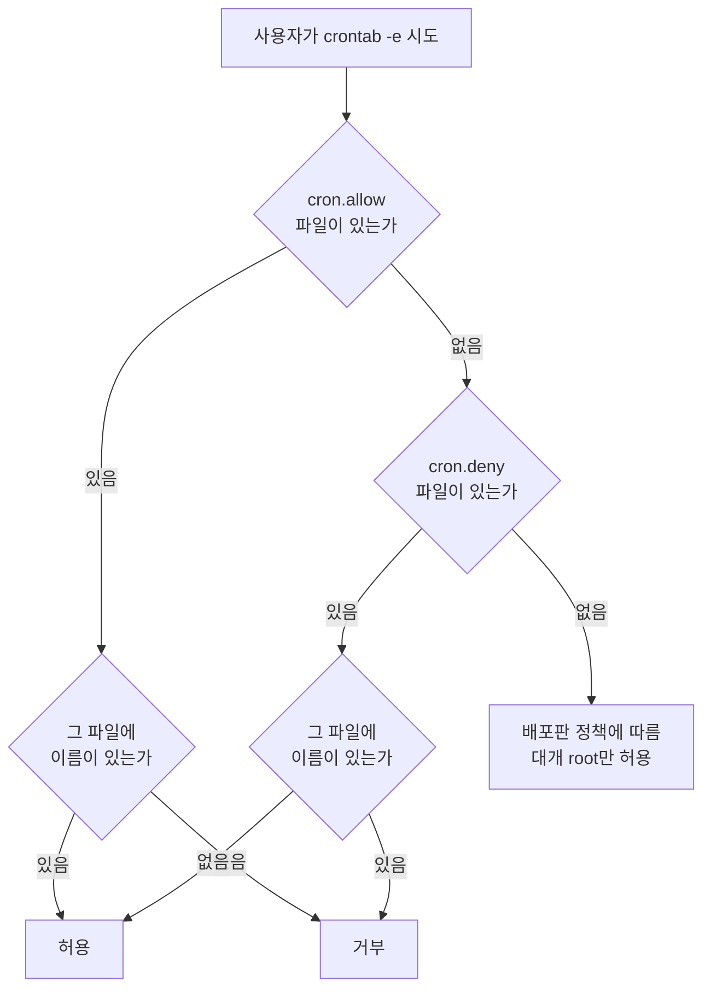

<Callout type="info">
  **이번 문서의 목표:** 이 파일을 다 읽으면 임의의 crontab 한 줄을 보고 정확히 언제 실행되는지 말할 수 있고, 시스템 crontab과 사용자 crontab의 필드 개수 차이를 구분하며, cron과 at과 anacron이 각각 어떤 상황을 위해 존재하는지 설명할 수 있게 된다.
</Callout>

## 반복이냐 한 번이냐

리눅스의 작업 예약 도구는 크게 셋입니다. 목적이 다릅니다.

| 도구 | 언제 쓰는가 | 반복 |
|------|--------------|------|
| **cron** | 정해진 시각에 **반복** 실행 | 반복 |
| **at** | 지정한 시각에 **딱 한 번** 실행 | 일회성 |
| **anacron** | 시스템이 꺼져 있어 놓친 작업을 **켜진 뒤 보충** 실행 | 반복(일 단위 이상) |

> **쉽게 말하면:** cron은 매일 울리는 알람, at은 내일 한 번만 울리는 알람, anacron은 알람을 못 들었으면 깨어난 뒤에라도 울려 주는 장치입니다.

cron의 결정적 약점이 anacron의 존재 이유입니다. **cron은 실행 시각에 시스템이 꺼져 있으면 그 작업을 영영 건너뜁니다.** 서버는 24시간 켜져 있으니 문제가 없지만, 노트북이나 데스크톱은 새벽 4시에 꺼져 있는 일이 흔합니다. 그래서 anacron이 나왔습니다.

## 1. crontab 다섯 필드

가장 기본이자 가장 자주 출제되는 형식입니다.

```
분  시  일  월  요일  실행할 명령
*   *   *   *   *     /usr/local/bin/backup.sh
```

| 순서 | 필드 | 허용 범위 |
|------|------|-----------|
| 1 | 분 (minute) | 0–59 |
| 2 | 시 (hour) | 0–23 |
| 3 | 일 (day of month) | 1–31 |
| 4 | 월 (month) | 1–12 (또는 jan–dec) |
| 5 | 요일 (day of week) | 0–7 (0과 7이 모두 일요일, 또는 sun–sat) |


**요일 필드의 0과 7이 모두 일요일**이라는 점이 함정으로 나옵니다. 그리고 **시간 필드가 24시간제**라는 점, **일요일이 0에서 시작**한다는 점을 함께 기억합니다.

### 특수 문자 다섯 가지

| 문자 | 이름 | 의미 | 예 |
|------|------|------|-----|
| `*` | 애스터리스크 | **모든 값** | 분 자리에 쓰면 매분 |
| `,` | 콤마 | **나열** | `1,15,30` |
| `-` | 하이픈 | **범위** | `9-18` |
| `/` | 슬래시 | **간격**(step) | `*/10`은 10 간격 |
| `?` | 물음표 | 값 없음 (일부 구현만) | |

`/`가 가장 헷갈립니다. **`*/10`은 "10분마다"이지 "10분에"가 아닙니다.** 범위와 조합해서 `0-30/10`처럼 쓰면 0, 10, 20, 30에 실행됩니다.

### 읽기 연습

| crontab 줄 | 언제 실행되는가 |
|------------|------------------|
| `0 4 * * * cmd` | 매일 새벽 4시 정각 |
| `30 2 * * 0 cmd` | 매주 일요일 새벽 2시 30분 |
| `0 0 1 * * cmd` | 매월 1일 자정 |
| `*/10 * * * * cmd` | 10분마다 |
| `0 9-18 * * 1-5 cmd` | 월요일부터 금요일까지, 9시부터 18시까지 매시 정각 |
| `0 0 1 1 * cmd` | 매년 1월 1일 자정 |
| `15,45 * * * * cmd` | 매시 15분과 45분 |
| `0 3 * * 6 cmd` | 매주 토요일 새벽 3시 |

**분 필드를 `*`로 두면 매분 실행된다**는 점을 주의합니다. `* 4 * * *`는 "새벽 4시에 한 번"이 아니라 **"새벽 4시대에 60번"** 실행됩니다. 초보자가 가장 흔히 내는 사고이고 시험 함정으로도 나옵니다.

### 일과 요일을 동시에 지정하면

```
0 0 13 * 5 cmd
```

이것은 "13일이면서 금요일"일까요, "13일 또는 금요일"일까요? 답은 **또는(OR)** 입니다.

**일 필드와 요일 필드가 둘 다 `*`가 아니면 두 조건은 OR로 결합됩니다.** 위 예는 매월 13일에도 실행되고 매주 금요일에도 실행됩니다. 다른 필드들이 AND로 결합되는 것과 다른 예외적 규칙이라 반드시 기억해야 합니다.

### 특수 문자열

숫자 대신 쓸 수 있는 축약형이 있습니다.

| 문자열 | 대응 |
|--------|------|
| `@reboot` | **부팅 시 한 번** |
| `@yearly`, `@annually` | `0 0 1 1 *` |
| `@monthly` | `0 0 1 * *` |
| `@weekly` | `0 0 * * 0` |
| `@daily`, `@midnight` | `0 0 * * *` |
| `@hourly` | `0 * * * *` |

`@reboot`은 부팅할 때 한 번 실행이라는 점에서 다른 것들과 성격이 다릅니다.

## 2. 사용자 crontab과 시스템 crontab

**필드 개수가 다릅니다.** 이것이 이 주제의 최대 함정입니다.

| 구분 | 위치 | 필드 개수 | 여섯째 필드 |
|------|------|-----------|--------------|
| 사용자 crontab | `/var/spool/cron/사용자명` | **5개** | 바로 명령 |
| 시스템 crontab | `/etc/crontab`, `/etc/cron.d/` | **6개** | **실행할 사용자** |

```
# 사용자 crontab (/var/spool/cron/kim)
0 4 * * * /home/kim/backup.sh

# 시스템 crontab (/etc/crontab)
0 4 * * * root /usr/local/bin/backup.sh
```

시스템 crontab은 **어떤 사용자 권한으로 실행할지**를 다섯 필드 뒤에 적습니다. 사용자 crontab은 파일 자체가 그 사용자 소유이므로 지정할 필요가 없습니다.

이 차이를 모르면 `/etc/crontab`에 사용자 이름 없이 명령을 적어 놓고 "왜 실행이 안 되냐"고 헤매게 됩니다. cron은 여섯 번째 자리를 사용자 이름으로 해석하므로, 거기에 명령이 오면 그런 사용자가 없다며 실패합니다.

### /etc/crontab 전문

```
SHELL=/bin/bash
PATH=/sbin:/bin:/usr/sbin:/usr/bin
MAILTO=root

# For details see man 4 crontabs

# .---------------- minute (0 - 59)
# |  .------------- hour (0 - 23)
# |  |  .---------- day of month (1 - 31)
# |  |  |  .------- month (1 - 12)
# |  |  |  |  .---- day of week (0 - 6)
# |  |  |  |  |
# *  *  *  *  * user-name  command to be executed
```

상단의 환경변수 세 개가 중요합니다.

| 변수 | 역할 |
|------|------|
| `SHELL` | 명령을 실행할 셸 |
| `PATH` | **명령 검색 경로** |
| `MAILTO` | **실행 결과를 보낼 메일 주소.** 비워 두면 메일을 보내지 않음 |

### cron 스크립트 디렉터리

```
/etc/cron.hourly/     매시간 실행할 스크립트
/etc/cron.daily/      매일 실행할 스크립트
/etc/cron.weekly/     매주 실행할 스크립트
/etc/cron.monthly/    매달 실행할 스크립트
/etc/cron.d/          개별 crontab 형식 파일 (패키지가 설치)
```

`/etc/cron.daily/`에 실행 권한이 있는 스크립트를 넣어 두기만 하면 매일 실행됩니다. crontab 문법을 쓸 필요가 없습니다. 패키지들이 로그 로테이션이나 정리 작업을 여기에 넣습니다.

**`/etc/cron.d/`는 성격이 다릅니다.** 여기에는 스크립트가 아니라 **시스템 crontab 형식(6필드) 파일**을 넣습니다.

| 경로 | 넣는 것 |
|------|---------|
| `/etc/cron.daily/` 등 | **실행 가능한 스크립트** |
| `/etc/cron.d/` | **6필드 crontab 형식 텍스트 파일** |

<Callout type="warning">
  `/etc/cron.d/`와 `run-parts`가 실행하는 디렉터리들은 파일 이름에 **점(`.`)이 들어가면 무시합니다.** `backup.sh`는 실행되지 않고 `backup`은 실행됩니다. 확장자를 붙였는데 왜 안 도느냐는 문제의 흔한 원인입니다.
</Callout>

## 3. crontab 명령

crontab 파일은 **직접 편집하지 않고 `crontab` 명령으로 다룹니다.** 문법 검사를 거치고 cron 데몬에 변경을 알려 주기 때문입니다.

| 명령 | 하는 일 |
|------|---------|
| `crontab -e` | **편집** (EDITOR 환경변수의 편집기 실행) |
| `crontab -l` | **목록 출력** |
| `crontab -r` | **전체 삭제** — 확인 없이 즉시 지움 |
| `crontab -i` | 삭제 전 확인 질문 |
| `crontab -u kim -l` | **다른 사용자**의 crontab 조회 (root만) |
| `crontab 파일명` | 파일 내용으로 crontab 교체 |

**`-e`와 `-r`이 키보드에서 붙어 있습니다.** `crontab -r`은 확인 없이 전부 지우므로 오타 한 번에 모든 예약이 날아갑니다. 습관적으로 `crontab -l > backup.txt`로 백업해 두는 이유입니다. 이 함정도 시험에 나옵니다.

`-u` 옵션은 root만 쓸 수 있으며, **자기 자신에게도 `-u`를 붙일 수 있습니다.** 스크립트에서 sudo로 특정 사용자의 crontab을 다룰 때 씁니다.

### cron 데몬 이름

| 배포판 계열 | 데몬·서비스 이름 |
|-------------|-------------------|
| RHEL·CentOS | `crond` |
| 데비안·우분투 | `cron` |

```bash
# systemctl status crond          # RHEL 계열
# systemctl status cron           # 데비안 계열
```

## 4. cron 실행 환경 — 가장 흔한 실패 원인

**"터미널에서는 되는데 cron에서는 안 된다"** 는 문제가 실무에서도 시험에서도 단골입니다. 원인은 환경이 다르기 때문입니다.

| 항목 | 대화형 셸 | cron 실행 환경 |
|------|-----------|-----------------|
| `PATH` | `/usr/local/bin` 등 **넓음** | `/usr/bin:/bin` 정도로 **매우 좁음** |
| 프로파일 | `~/.bashrc` 등이 **적용됨** | **적용되지 않음** |
| 홈 디렉터리 | 로그인 위치 | 해당 사용자의 홈 |
| 표준 출력 | 화면 | **메일로 발송** |
| 터미널 | 있음 | **없음** |

04편에서 본 로그인 셸과 비로그인 셸 구분이 여기서 결정적으로 작용합니다. cron은 어느 쪽도 아닌 **최소 환경**에서 실행합니다.

해결책은 세 가지입니다.

```bash
# 1. 명령을 절대 경로로
0 4 * * * /usr/local/bin/mysqldump ...

# 2. crontab 안에서 PATH를 직접 선언
PATH=/usr/local/bin:/usr/bin:/bin
0 4 * * * mysqldump ...

# 3. 스크립트 첫머리에서 프로파일을 읽어들이기
0 4 * * * . /home/kim/.bash_profile; /home/kim/job.sh
```

**`%` 기호도 함정입니다.** crontab에서 `%`는 **줄바꿈으로 해석**되고, 첫 `%` 뒤의 내용은 명령의 표준 입력으로 들어갑니다. `date +%Y%m%d`를 그대로 쓰면 깨집니다. 백슬래시로 이스케이프해야 합니다.

```bash
0 4 * * * /bin/tar czf /backup/db-$(date +\%Y\%m\%d).tar.gz /var/lib/mysql
```

### 실행 결과와 메일

cron은 작업의 표준 출력과 표준 에러를 **메일로 보냅니다.** 받는 사람은 `MAILTO` 값 또는 crontab 소유자입니다. 매분 도는 작업이 뭔가를 출력하면 메일함이 폭발합니다.

```bash
0 4 * * * /home/kim/job.sh > /dev/null 2>&1        # 출력 전부 버림
0 4 * * * /home/kim/job.sh >> /var/log/job.log 2>&1  # 로그 파일로
MAILTO=""                                            # 메일 아예 안 보냄
```

`2>&1`은 표준 에러를 표준 출력이 가는 곳으로 합치라는 뜻입니다. 순서가 중요해서 `2>&1 > /dev/null`로 쓰면 에러는 여전히 화면(메일)으로 갑니다. **리다이렉션을 먼저 하고 그다음에 합쳐야** 합니다.

cron 자체의 실행 기록은 로그에 남습니다.

| 배포판 | 로그 위치 |
|--------|-----------|
| RHEL·CentOS | `/var/log/cron` |
| 데비안·우분투 | `/var/log/syslog` |
| systemd 환경 | `journalctl -u crond` |

## 5. at — 일회성 예약

```bash
$ at 17:00
at> /home/kim/report.sh
at> <EOT>          # Ctrl+D 로 입력 종료
job 3 at Sat Mar 11 17:00:00 2023

$ at -f script.sh 17:00       # 파일로 지정
$ echo "명령" | at 17:00       # 파이프로 전달
```

### 시각 지정 형식

| 표기 | 뜻 |
|------|-----|
| `at 17:00` | 오늘 17시 (지났으면 내일) |
| `at 5pm` | 같은 의미 |
| `at now + 30 minutes` | 30분 뒤 |
| `at now + 2 hours` | 2시간 뒤 |
| `at now + 3 days` | 3일 뒤 |
| `at midnight` | 자정 |
| `at noon` | 정오 |
| `at teatime` | **오후 4시** |
| `at tomorrow` | 내일 같은 시각 |
| `at 10:00 2026-12-25` | 날짜 지정 |

`teatime`이 오후 4시라는 것은 영국식 유머에서 온 실제 예약어이고, 특이해서 출제됩니다.

### 관리 명령

| 명령 | 하는 일 |
|------|---------|
| `at -l` 또는 `atq` | **대기 중인 작업 목록** |
| `at -d 3` 또는 `atrm 3` | **작업 번호 3 삭제** |
| `at -c 3` | 작업 3의 **내용 확인** |
| `at -f 파일` | 파일 내용을 작업으로 등록 |
| `at -m` | 출력이 없어도 완료 메일 발송 |

예약된 작업은 `/var/spool/at/`(배포판에 따라 `/var/spool/cron/atjobs`)에 파일로 저장되고, `atd` 데몬이 시각을 확인해 실행합니다. **`atd` 서비스가 꺼져 있으면 예약해도 실행되지 않습니다.**

at은 예약 시점의 환경변수를 **저장해 두었다가 그대로 복원**합니다. 이 점이 cron과 다릅니다. 그래도 터미널은 없으므로 대화형 명령은 쓸 수 없습니다.

### batch

`at`과 짝을 이루는 `batch`도 있습니다. 시각을 지정하지 않고 **시스템 부하가 낮아지면**(평균 부하 0.8 미만이 기본) 실행합니다. 무거운 작업을 한가할 때 돌리는 용도입니다.

## 6. cron과 at 비교

| 항목 | cron | at |
|------|------|-----|
| 실행 횟수 | **반복** | **한 번** |
| 데몬 | `crond` (또는 `cron`) | **`atd`** |
| 등록 명령 | `crontab -e` | `at 시각` |
| 목록 확인 | `crontab -l` | `atq` 또는 `at -l` |
| 삭제 | `crontab -r` (전체) | `atrm 번호` (개별) |
| 저장 위치 | `/var/spool/cron/` | `/var/spool/at/` |
| 시각 지정 | 5필드 또는 6필드 | 자연어에 가까운 표기 |
| 환경변수 | **최소 환경** | 등록 시점 환경 복원 |
| 허용 파일 | `/etc/cron.allow` | `/etc/at.allow` |
| 거부 파일 | `/etc/cron.deny` | `/etc/at.deny` |

## 7. 접근 제어 — allow와 deny의 우선순위

일반 사용자가 예약 작업을 만들지 못하게 막을 수 있습니다. 규칙이 조금 까다롭습니다.



핵심 규칙은 셋입니다.

1. **`allow` 파일이 우선입니다.** `cron.allow`가 존재하면 `cron.deny`는 **완전히 무시**됩니다.
2. `allow` 파일이 있으면 **거기 적힌 사람만** 허용됩니다. 화이트리스트 방식입니다.
3. `allow` 파일이 없고 `deny` 파일만 있으면 **거기 적힌 사람만 금지**됩니다. 블랙리스트 방식입니다.

| 상황 | 결과 |
|------|------|
| `cron.allow`에 kim만 기재 | kim만 사용 가능. 나머지 전원 불가 |
| `cron.allow` 없음, `cron.deny`에 kim 기재 | kim만 불가. 나머지 전원 가능 |
| 둘 다 존재, `allow`에 kim | **`deny`는 무시**되고 kim만 가능 |
| 둘 다 없음 | 대부분의 배포판에서 root만 가능 |
| `cron.deny`가 **빈 파일** | 전원 사용 가능 |

빈 `cron.deny` 파일이 "아무도 금지하지 않음"이라는 뜻이 되어 전원 허용이 되는 것이 미묘한 지점입니다. 데비안 계열의 기본 설정이 이렇습니다.

파일 형식은 **한 줄에 사용자 이름 하나**입니다. `at.allow`와 `at.deny`도 똑같은 규칙으로 동작합니다.

## 8. anacron — 놓친 작업 보충

### 왜 필요한가

노트북에 "매일 새벽 3시 백업"을 걸어 두었는데 그 시각에 늘 꺼져 있다면, cron은 백업을 **한 번도 실행하지 않습니다.** anacron은 이 문제를 해결합니다.

anacron은 시각이 아니라 **"마지막 실행으로부터 며칠이 지났는가"** 를 봅니다. 실행할 때마다 `/var/spool/anacron/` 아래에 마지막 실행 날짜를 기록해 두고, 다음에 켜졌을 때 그 날짜와 오늘을 비교합니다.

### /etc/anacrontab

```
SHELL=/bin/sh
PATH=/sbin:/bin:/usr/sbin:/usr/bin
RANDOM_DELAY=45
START_HOURS_RANGE=3-22

# period  delay  job-identifier  command
1         5      cron.daily      nice run-parts /etc/cron.daily
7         25     cron.weekly     nice run-parts /etc/cron.weekly
@monthly  45     cron.monthly    nice run-parts /etc/cron.monthly
```

| 필드 | 의미 |
|------|------|
| period | **주기(일 단위).** 1이면 매일, 7이면 매주 |
| delay | 조건 충족 후 **몇 분 뒤에** 실행할지 |
| job-identifier | 마지막 실행 날짜를 기록할 파일 이름 |
| command | 실행할 명령 |

| 변수 | 역할 |
|------|------|
| `RANDOM_DELAY` | delay에 더할 **무작위 지연** 최댓값(분). 동시 실행 부하 분산 |
| `START_HOURS_RANGE` | 작업을 시작할 수 있는 **시간대** |

delay와 RANDOM_DELAY가 있는 이유는, 부팅 직후 모든 작업이 한꺼번에 시작되어 시스템이 버벅이는 일을 막기 위해서입니다.

### cron과 anacron 비교

| 항목 | cron | anacron |
|------|------|---------|
| 시간 단위 | **분 단위**까지 | **일 단위** 이상 |
| 정확한 시각 지정 | 가능 | **불가능** |
| 꺼져 있던 동안의 작업 | **건너뜀** | **켜진 뒤 보충 실행** |
| 실행 주체 | 상주 데몬 `crond` | 부팅 시나 하루 한 번 실행되는 프로그램 |
| 사용자별 설정 | 가능 | **root 전용**(기본) |
| 설정 파일 | `/etc/crontab`, 사용자 crontab | `/etc/anacrontab` |
| 적합한 환경 | **항상 켜진 서버** | **자주 꺼지는 데스크톱·노트북** |

현대 배포판에서는 두 도구가 **협력**합니다. cron이 `/etc/cron.daily/`를 돌리려 할 때 anacron이 설치되어 있으면 anacron에게 넘기고, anacron이 "이미 오늘 실행했는지"를 판단해 중복 실행을 막습니다.

### systemd 타이머라는 대안

14편에서 본 `.timer` 유닛이 cron과 anacron의 기능을 모두 대체할 수 있습니다.

| 항목 | cron | systemd timer |
|------|------|----------------|
| 설정 | crontab 한 줄 | `.timer` + `.service` **두 파일** |
| 놓친 작업 보충 | 불가 | `Persistent=true`로 가능 |
| 로그 | 메일 또는 별도 리다이렉션 | **journalctl로 통합** |
| 의존성 표현 | 없음 | 유닛 의존성 사용 가능 |
| 조회 | `crontab -l` | `systemctl list-timers` |

`Persistent=true`가 anacron의 보충 실행에 해당합니다. 다만 시험 범위에서는 cron이 여전히 중심이므로 타이머는 "systemd에 이런 대안이 있다"는 수준으로 알아 둡니다.

## 핵심 정리

- crontab의 다섯 필드는 **분·시·일·월·요일** 순이며 요일은 **0과 7이 모두 일요일**입니다. `*/n`은 "n 간격"이지 "n분에"가 아닙니다.
- **일 필드와 요일 필드가 둘 다 지정되면 두 조건은 OR로 결합**됩니다. 다른 필드가 AND인 것과 다른 예외입니다.
- **사용자 crontab은 5필드, 시스템 crontab(`/etc/crontab`, `/etc/cron.d/`)은 실행 사용자를 포함한 6필드**입니다.
- cron은 **PATH가 매우 좁고 프로파일이 적용되지 않는 최소 환경**에서 실행되므로 절대 경로를 쓰거나 PATH를 직접 선언해야 합니다. `%`는 줄바꿈으로 해석되므로 이스케이프가 필요합니다.
- `crontab -r`은 확인 없이 **전체를 삭제**합니다. `-e`와 붙어 있어 오타 사고가 잦습니다.
- at은 **일회성**이며 `atd` 데몬이 처리하고 `atq`로 조회, `atrm`으로 삭제합니다. `teatime`은 오후 4시입니다.
- 접근 제어는 **`allow` 파일이 있으면 `deny`가 완전히 무시**되며, `allow`는 화이트리스트, `deny`는 블랙리스트로 동작합니다.
- **anacron은 시각이 아니라 경과 일수로 판단**하여, 시스템이 꺼져 있어 놓친 작업을 켜진 뒤 보충 실행합니다. 분 단위 지정은 불가능합니다.

## 마무리 복습

<Quiz
  questionNumber={1}
  question="crontab 항목이 30 2 * * 0 으로 지정되어 있을 때 이 작업이 실행되는 시점으로 알맞은 것은?"
  options={['매일 오전 2시 30분', '매주 일요일 오전 2시 30분', '매월 30일 오전 2시', '매주 월요일 오전 2시 30분']}
  correctAnswer={2}
  explanation="필드 순서는 분 시 일 월 요일이므로 30분 2시이며 요일 필드의 0은 일요일을 뜻한다. 일과 월이 모두 애스터리스크이므로 매주 일요일이 된다."
  optionExplanations={['요일 필드가 0으로 지정되어 있어 매일이 아니다', '정답 — 요일 0은 일요일이다', '30은 분 필드의 값이지 일 필드의 값이 아니다', '월요일은 요일 필드 값 1에 해당한다']}
/>

<Quiz
  questionNumber={2}
  question="다음 ( 괄호 ) 안에 들어갈 내용으로 알맞은 것은? etc crontab 파일에 등록하는 시스템 crontab 항목은 사용자 crontab과 달리 시간 관련 다섯 필드 뒤에 ( )을 추가로 기재해야 한다."
  options={['실행할 셸의 경로', '작업을 실행할 사용자 이름', '작업의 우선순위 값', '결과를 받을 메일 주소']}
  correctAnswer={2}
  explanation="시스템 crontab은 여러 사용자의 작업을 한 파일에 모아 관리하므로 어떤 권한으로 실행할지 지정해야 한다. 그래서 여섯 번째 필드에 사용자 이름이 오고 그다음이 명령이다."
  optionExplanations={['셸은 파일 상단의 SHELL 변수로 지정한다', '정답 — 여섯 번째 필드가 실행 사용자다', '우선순위는 nice 명령으로 별도 지정한다', '메일 주소는 MAILTO 변수로 지정한다']}
/>

<Quiz
  questionNumber={3}
  question="cron 접근 제어와 관련하여 etc cron.allow 파일과 etc cron.deny 파일이 모두 존재할 때의 동작으로 알맞은 것은?"
  options={['두 파일의 내용이 합쳐져서 적용된다', 'cron.allow에 등록된 사용자만 허용되고 cron.deny는 무시된다', 'cron.deny가 우선하여 등록된 사용자가 차단된다', '두 파일이 충돌하므로 모든 사용자가 차단된다']}
  correctAnswer={2}
  explanation="allow 파일이 존재하면 화이트리스트 방식으로 동작하여 그 파일에 이름이 있는 사용자만 사용할 수 있고 deny 파일은 참조되지 않는다. deny는 allow가 없을 때만 의미를 갖는다."
  optionExplanations={['두 파일이 합쳐지는 동작은 없다', '정답 — allow 우선 원칙이다', 'deny가 우선한다는 것은 순서를 반대로 이해한 것이다', '충돌로 전원 차단되는 동작은 존재하지 않다']}
/>

<Quiz
  questionNumber={4}
  question="다음 설명에 해당하는 도구로 알맞은 것은? 시스템이 꺼져 있어 실행되지 못한 주기 작업을 다음에 시스템이 켜졌을 때 보충해서 실행하며 시각이 아니라 경과한 일수를 기준으로 판단한다."
  options={['cron', 'at', 'anacron', 'batch']}
  correctAnswer={3}
  explanation="anacron은 마지막 실행 날짜를 기록해 두고 지정한 주기만큼 일수가 지났으면 실행하므로 항상 켜져 있지 않은 시스템에 적합하다. 대신 분 단위 시각 지정은 할 수 없다."
  optionExplanations={['cron은 실행 시각에 꺼져 있으면 그 작업을 영영 건너뛴다', 'at은 지정한 시각에 한 번만 실행하는 일회성 도구다', '정답 — 경과 일수 기준의 보충 실행이 핵심이다', 'batch는 시스템 부하가 낮아질 때 실행하는 도구다']}
/>

<Quiz
  questionNumber={5}
  question="현재 사용자가 등록한 예약 작업 중 at 명령으로 등록한 대기 작업 목록을 확인하는 명령으로 알맞은 것은?"
  options={['crontab -l', 'atq', 'atrm', 'at -c']}
  correctAnswer={2}
  explanation="atq는 at 명령으로 등록되어 아직 실행되지 않은 작업의 번호와 예정 시각을 보여 준다. at -l 도 같은 동작을 한다."
  optionExplanations={['crontab -l은 cron에 등록된 반복 작업을 보여 준다', '정답 — at -l 과 동일한 조회 명령이다', 'atrm은 작업 번호를 지정해 삭제하는 명령이다', 'at -c는 지정한 작업의 실행 내용을 출력하는 옵션이다']}
/>

<Quiz
  questionNumber={6}
  question="crontab에 등록한 스크립트가 터미널에서는 정상 동작하는데 cron으로 실행하면 command not found 오류가 발생한다. 가장 유력한 원인으로 알맞은 것은?"
  options={['cron 데몬이 실행되고 있지 않기 때문이다', 'cron 실행 환경의 PATH가 좁고 사용자 프로파일이 적용되지 않기 때문이다', '스크립트에 실행 권한이 없기 때문이다', 'crontab 파일의 필드 개수가 잘못되었기 때문이다']}
  correctAnswer={2}
  explanation="cron은 로그인 셸도 비로그인 셸도 아닌 최소 환경에서 작업을 실행하므로 bashrc나 profile이 적용되지 않고 PATH도 매우 좁다. 명령을 절대 경로로 쓰거나 crontab 안에서 PATH를 선언하면 해결된다."
  optionExplanations={['데몬이 꺼져 있으면 작업 자체가 실행되지 않아 오류 메시지도 남지 않는다', '정답 — 환경변수 차이가 대표적 원인이다', '실행 권한이 없으면 permission denied 오류가 발생한다', '필드 개수가 틀리면 등록 단계나 파싱 단계에서 문제가 드러난다']}
/>

<Quiz
  questionNumber={7}
  question="crontab 항목의 분 필드에 애스터리스크를 두고 시 필드를 4로 지정했을 때의 실행 결과로 알맞은 것은?"
  options={['새벽 4시 정각에 한 번만 실행된다', '새벽 4시부터 4시 59분까지 매분 실행되어 총 60번 실행된다', '4분마다 반복 실행된다', '새벽 4시와 오후 4시에 각각 한 번씩 실행된다']}
  correctAnswer={2}
  explanation="분 필드의 애스터리스크는 모든 분을 뜻하므로 4시대의 60개 분 전부가 실행 대상이 된다. 4시 정각 한 번만 실행하려면 분 필드에 0을 명시해야 한다."
  optionExplanations={['그렇게 하려면 분 필드를 0으로 지정해야 한다', '정답 — 초보자가 가장 흔히 내는 실수다', '간격 지정은 슬래시를 사용해 표기한다', '시 필드는 24시간제이므로 4는 새벽 4시만 가리킨다']}
/>

<Quiz
  questionNumber={8}
  question="다음 중 crontab 명령의 옵션에 대한 설명으로 틀린 것은?"
  options={['-e 옵션은 crontab을 편집기로 연다', '-l 옵션은 등록된 항목을 출력한다', '-r 옵션은 등록된 항목을 확인 없이 모두 삭제한다', '-u 옵션은 일반 사용자가 다른 사용자의 crontab을 편집할 때 사용한다']}
  correctAnswer={4}
  explanation="-u 옵션으로 다른 사용자의 crontab을 다루는 것은 root 권한이 있어야 한다. 일반 사용자가 다른 사용자의 crontab에 접근하려 하면 권한 오류가 발생한다."
  optionExplanations={['-e는 EDITOR 환경변수가 가리키는 편집기를 실행하는 것이 맞다', '-l은 목록 출력 옵션이 맞다', '-r은 확인 절차 없이 전체를 삭제하므로 주의해야 한다', '정답(틀린 설명) — -u는 root만 사용할 수 있다']}
/>

## 참고 자료

- [man7.org — crontab(5) 매뉴얼 페이지](https://man7.org/linux/man-pages/man5/crontab.5.html)
- [man7.org — crontab(1) 매뉴얼 페이지](https://man7.org/linux/man-pages/man1/crontab.1.html)
- [man7.org — at(1) 매뉴얼 페이지](https://man7.org/linux/man-pages/man1/at.1.html)
- [man7.org — anacrontab(5) 매뉴얼 페이지](https://man7.org/linux/man-pages/man5/anacrontab.5.html)
- [man7.org — systemd.timer(5) 매뉴얼 페이지](https://man7.org/linux/man-pages/man5/systemd.timer.5.html)
