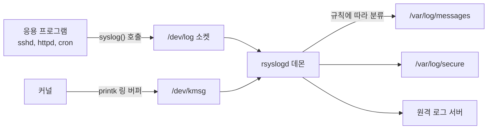
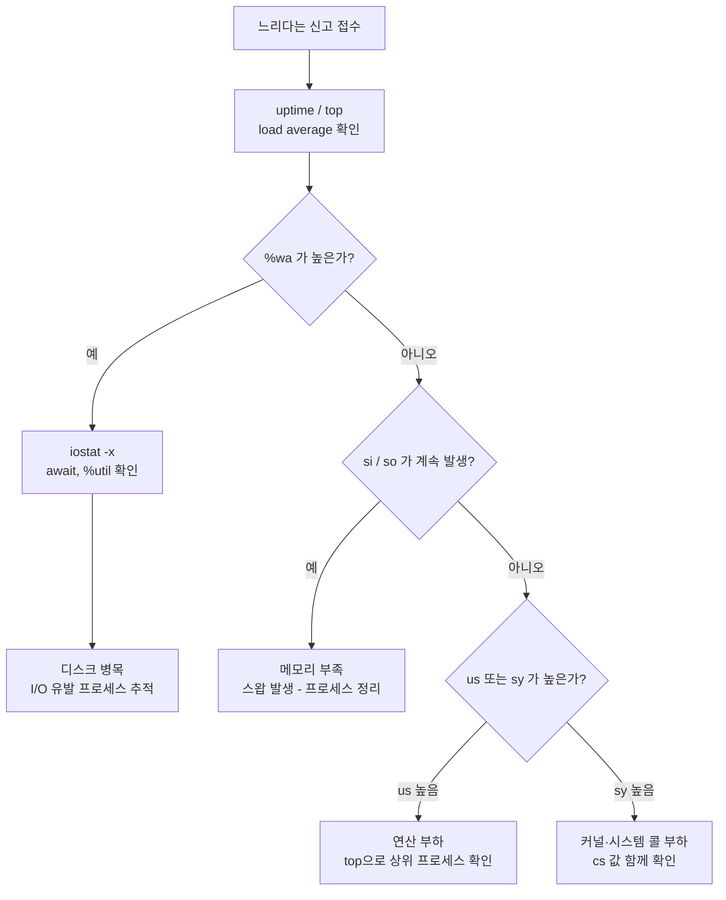

<Callout type="info">
  **이번 문서의 목표:** 로그가 어디에 왜 그렇게 기록되는지 `/etc/rsyslog.conf` 한 줄을 읽어 설명할 수 있고, `top`·`vmstat`·`iostat` 출력에서 "지금 병목이 CPU인지 메모리인지 디스크인지"를 근거를 대며 판단할 수 있게 된다.
</Callout>

## 왜 로그와 모니터링을 한 편에 묶는가

서버 관리자가 하는 일을 딱 두 가지로 줄이면 "**과거에 무슨 일이 있었는지 확인하는 일**"과 "**지금 무슨 일이 벌어지는지 확인하는 일**"입니다. 앞의 것이 로그(log, 기록)이고, 뒤의 것이 모니터링(monitoring, 감시)입니다. 둘은 짝입니다. 모니터링으로 "지금 CPU가 100퍼센트다"를 알아내면, 로그로 "언제부터, 어떤 프로세스가 그랬는지"를 확인해 원인을 좁힙니다.

1급 1차 필기에서 이 영역은 **암기 문제처럼 보이지만 실제로는 구조 문제**입니다. 예를 들어 "`*.warn;kern.none`이 무슨 뜻인가"는 외워서 푸는 게 아니라, facility(퍼실리티, 로그를 낸 주체)와 priority(프라이오리티, 중요도)라는 두 축을 이해하면 그 자리에서 읽어낼 수 있습니다. 이 편은 그 두 축을 세우는 데 집중합니다.

## 1. 리눅스 로그의 두 세계 — rsyslog와 journal

### 왜 로그 시스템이 따로 있는가

프로그램이 문제를 만났을 때 자기 화면에 메시지를 뿌리면 되지 않을까요? 안 됩니다. 서버 데몬(daemon, 백그라운드에서 계속 도는 상주 프로그램)은 화면이 없습니다. 터미널에서 떨어져 나와 도는 게 데몬의 정의니까요. 그렇다고 프로그램마다 자기 마음대로 파일에 쓰게 두면, 관리자는 수십 개 파일 형식을 각각 배워야 합니다.

그래서 유닉스는 아주 오래전부터 **로그를 받아주는 전담 서비스**를 하나 두는 방식을 택했습니다. 프로그램은 "이 메시지를 남겨줘"라고 표준화된 방식으로 던지기만 하고, 어디에 어떤 형식으로 쓸지는 로그 데몬이 정책에 따라 결정합니다.

> **쉽게 말하면:** 로그 데몬은 회사의 우편실입니다. 각 부서(프로그램)는 편지를 우편실에 던지기만 하고, 어느 보관함에 넣을지는 우편실 규정(설정 파일)이 정합니다.



현대 리눅스에는 이 전통적인 **rsyslog**(rsyslogd 데몬)와, systemd(시스템디)가 들고 온 **journald**(저널디)라는 두 체계가 **동시에** 존재합니다. 필기에서는 둘의 차이를 묻습니다.

### rsyslog와 journald 비교

| 구분 | rsyslog | systemd-journald |
|------|---------|------------------|
| 저장 형식 | 일반 텍스트 파일 | 바이너리 구조체(인덱스 포함) |
| 저장 위치 | `/var/log/` 아래 개별 파일 | `/run/log/journal`(휘발) 또는 `/var/log/journal`(영구) |
| 확인 방법 | `cat`, `tail`, `grep`, `vi` | `journalctl` 전용 명령 |
| 설정 파일 | `/etc/rsyslog.conf`, `/etc/rsyslog.d/` | `/etc/systemd/journald.conf` |
| 재부팅 후 보존 | 기본 보존 | 기본은 휘발 – `Storage=persistent` 지정 시 보존 |
| 메타데이터 | 시각·호스트·태그 정도 | PID·UID·유닛명·부팅 ID 등 구조화 필드 |

핵심 함정 하나. **journald의 기본 저장은 휘발성**입니다. `/var/log/journal` 디렉터리가 없으면 `/run` 아래(메모리 파일시스템)에만 쌓이므로 재부팅하면 사라집니다. 영구 보관하려면 그 디렉터리를 만들거나 `journald.conf`에서 `Storage=persistent`로 지정합니다.

그리고 둘은 **경쟁 관계가 아니라 연결 관계**입니다. 대부분의 배포판에서 journald가 먼저 메시지를 받고, 그중 필요한 것을 rsyslog로 넘겨 텍스트 파일로도 남깁니다. 그래서 `/var/log/messages`와 `journalctl` 양쪽에 같은 메시지가 보이는 것이 정상입니다.

## 2. facility와 priority — 로그 규칙 문법의 전부

### 두 축으로 메시지를 분류한다

syslog 규격은 모든 메시지에 두 개의 꼬리표를 붙입니다.

- **facility**(퍼실리티, 시설·출처): 이 메시지를 누가 냈는가. 커널인가, 메일 시스템인가, 인증 관련인가.
- **priority**(프라이오리티, 우선순위·심각도). severity(세버리티)라고도 부릅니다: 얼마나 급한가.

이 둘을 조합해 "누가 낸, 얼마나 급한 메시지를 어디에 쓸 것인가"를 한 줄로 적는 것이 rsyslog 규칙입니다.

주요 facility는 다음과 같습니다.

| facility | 의미 | 대표 기록 대상 |
|----------|------|----------------|
| `kern` | 커널 메시지 | 드라이버·하드웨어 오류, OOM Killer |
| `auth` / `authpriv` | 인증·보안 | 로그인 성공·실패, sudo 사용 |
| `cron` | 스케줄러 | cron·at 작업 실행 기록 |
| `daemon` | 일반 시스템 데몬 | facility가 따로 없는 서비스들 |
| `mail` | 메일 시스템 | sendmail, postfix |
| `lpr` | 프린터 | CUPS 인쇄 작업 |
| `news` / `uucp` | 뉴스·UUCP | 거의 쓰이지 않는 역사적 잔재 |
| `local0` – `local7` | 사용자 정의 | 직접 만든 애플리케이션 로그 |

### priority 8단계 — 순서를 외우지 말고 의미로 세우기

priority는 8단계입니다. **숫자가 작을수록 심각**합니다.

| 번호 | 이름 | 별칭 | 의미 |
|------|------|------|------|
| 0 | `emerg` | `panic` | 시스템을 쓸 수 없는 상태 |
| 1 | `alert` | – | 즉시 조치 필요 |
| 2 | `crit` | – | 치명적 상황(하드웨어 오류 등) |
| 3 | `err` | `error` | 일반 오류 |
| 4 | `warning` | `warn` | 경고 |
| 5 | `notice` | – | 정상이지만 눈여겨볼 일 |
| 6 | `info` | – | 정보성 메시지 |
| 7 | `debug` | – | 디버깅용 상세 메시지 |

여기서 시험이 노리는 표현이 "**낮은 수준의 priority**"입니다. 이 말은 **심각도가 낮은 쪽**, 즉 `debug`에 가까운 쪽을 뜻합니다. 그리고 rsyslog 규칙에서 `facility.priority`는 "**그 등급 이상(더 심각한 것 포함)**"을 의미하므로, 지정한 등급이 낮을수록 걸러지는 메시지가 적어 **기록량이 많아집니다.**

> **쉽게 말하면:** priority는 "이 정도 이상만 받겠다"는 그물코 크기입니다. `debug`로 잡으면 그물코가 촘촘해 전부 걸리고, `emerg`로 잡으면 큰 것만 걸립니다.

암기 대신 이렇게 기억하세요. `emerg`(0)에서 `debug`(7)로 갈수록 **덜 심각하고 더 수다스럽다.** 그래서 "보기 중 가장 많은 기록이 남는 낮은 수준"을 고르라면 번호가 큰 쪽을 고르면 됩니다.

### 규칙 한 줄 읽기

`/etc/rsyslog.conf`의 규칙 줄은 다음 형식입니다.

```
선택자(facility.priority)      대상(파일·사용자·원격서버)
```

실제 예를 하나씩 해석해 봅시다.

```
*.info;mail.none;authpriv.none;cron.none    /var/log/messages
authpriv.*                                  /var/log/secure
mail.*                                      -/var/log/maillog
cron.*                                      /var/log/cron
*.emerg                                     :omusrmsg:*
```

- 첫 줄: 모든 facility(`*`)의 `info` 등급 **이상**을 `/var/log/messages`에 쓰되, `mail`·`authpriv`·`cron`은 `none`으로 **제외**합니다. 이 세 가지는 아래에서 각자 전용 파일로 따로 빠지기 때문에 중복을 막는 것입니다.
- 두 번째 줄: `authpriv` facility의 **모든** 등급(`*`)을 `/var/log/secure`로. 로그인·sudo 기록이 여기 남습니다.
- 세 번째 줄 맨 앞의 하이픈(`-`)은 "**쓸 때마다 디스크에 강제로 동기화하지 말라**"는 뜻입니다. 메일 로그처럼 양이 많은 경우 성능을 위해 씁니다.
- 마지막 줄: `emerg` 등급은 로그인한 모든 사용자 터미널에 방송합니다.

여기서 시험 단골 문법 세 가지를 정리합니다.

| 표기 | 의미 | 예시 해석 |
|------|------|-----------|
| `facility.pri` | 해당 등급 이상 | `*.warn` – 모든 시설의 warning 이상 |
| `facility.=pri` | 딱 그 등급만 | `*.=warn` – warning 등급만, err는 제외 |
| `facility.!pri` | 그 등급 이상을 제외 | `*.!err` – err 이상은 빼고 |
| `facility.none` | 그 시설을 전부 제외 | `kern.none` – 커널 로그 제외 |
| `;` 구분 | 선택자 여러 개 결합 | `*.warn;kern.none` |

그래서 "모든 facility에서 warning **이상**을 기록하되 커널 로그는 제외"는 `*.warn;kern.none`입니다. `*.=warn`으로 쓰면 warning 하나만 기록되어 "이상"이라는 조건을 어기고, `kern.!=none`은 문법적으로도 의미가 성립하지 않습니다. 이 네 글자 차이가 실제 기출에서 정답을 가릅니다.

### 자주 틀리는 점

`auth`와 `authpriv`를 혼동하기 쉽습니다. 둘 다 인증 관련이지만 `authpriv`는 **패스워드 등 민감 정보를 포함할 수 있는** 메시지를 위한 별도 facility이고, RHEL 계열에서 `/var/log/secure`로 가는 것은 `authpriv`입니다. Debian/Ubuntu 계열에서는 같은 내용이 `/var/log/auth.log`에 쌓입니다. **배포판마다 파일명이 다르다**는 점 자체가 출제 포인트입니다.

## 3. 주요 로그 파일과 "cat으로 볼 수 없는 파일"

`/var/log` 아래 파일 중 상당수는 텍스트가 아니라 **바이너리(binary, 이진) 형식**입니다. 이걸 구분하는 문제가 반복 출제됩니다.

| 파일 | 형식 | 내용 | 전용 확인 명령 |
|------|------|------|----------------|
| `/var/log/messages` | 텍스트 | 일반 시스템 메시지 | `cat`, `tail -f` |
| `/var/log/secure` | 텍스트 | 인증·보안(RHEL 계열) | `cat`, `grep` |
| `/var/log/dmesg` | 텍스트 | 부팅 시 커널 메시지 | `dmesg` |
| `/var/log/wtmp` | 바이너리 | 로그인·로그아웃 성공 이력 | `last` |
| `/var/log/btmp` | 바이너리 | 로그인 실패 이력 | `lastb` |
| `/var/log/lastlog` | 바이너리 | 사용자별 마지막 로그인 | `lastlog` |
| `/var/run/utmp` | 바이너리 | 현재 로그인 중인 사용자 | `w`, `who`, `users` |

이름이 헷갈리면 이렇게 외우세요. **u**tmp는 "**u**sers now"(지금), **w**tmp는 "**w**ho was here"(과거 전체), **b**tmp는 "**b**ad login"(실패), lastlog는 "각자의 마지막 한 번".

`w` 명령의 출력을 실제로 보면 상단 한 줄에 부하 평균까지 함께 나옵니다.

```
 22:42:18 up 9:01,  3 users,  load average: 0.00, 0.03, 0.05
USER     TTY      FROM      LOGIN@   IDLE   JCPU   PCPU WHAT
root     :0       :0        Mon21    7xdm?  1:19   0.20s /usr/libexec/gnome
root     pts/0    :0        Mon21    10.00s 0.14s  0.07s -bash
```

`who`는 접속자 목록만, `users`는 이름만 한 줄로, `w`는 **부하 평균과 각자 실행 중인 명령(WHAT)까지** 보여줍니다. "load average와 작업 내용이 함께 보이면 `w`"라고 기억하면 됩니다.

### logger — 셸에서 직접 로그 남기기

내가 만든 백업 스크립트의 결과를 시스템 로그에 남기고 싶다면 `logger`를 씁니다.

```bash
logger "백업 스크립트 정상 종료"
logger -p local0.err -t backup "백업 실패: 대상 디렉터리 없음"
```

`-p`로 facility.priority를 지정하고, `-t`로 태그를 붙입니다. 아무 옵션 없이 쓰면 기본적으로 `user.notice`로 처리되어 `/var/log/messages`에 기록됩니다. "명령행에서 로그 시스템에 메시지를 보내는 명령"이라는 설명이 나오면 **logger**입니다. `last`(로그인 이력), `lastlog`(마지막 로그인), `dmesg`(커널 링 버퍼)와 헷갈리지 않도록 역할을 구분해 두세요.

### logrotate — 로그가 디스크를 채우지 않게

로그는 계속 쌓입니다. 그대로 두면 `/var` 파티션이 가득 차 서비스가 죽습니다. 그래서 주기적으로 잘라 보관하고 오래된 것을 지우는 **logrotate**(로그로테이트)가 돕니다.

```
/var/log/httpd/*log {
    weekly
    rotate 4
    missingok
    notifempty
    compress
}
```

`weekly`는 주 단위 회전, `rotate 4`는 네 세대까지 보관(그 이상은 삭제), `compress`는 회전된 파일을 gzip으로 압축한다는 뜻입니다. 설정은 `/etc/logrotate.conf`와 `/etc/logrotate.d/` 아래에 있고, 실행은 보통 cron이 담당합니다.

## 4. journalctl — 저널을 다루는 단일 창구

journald의 로그는 바이너리라 `cat`으로 못 봅니다. 대신 `journalctl` 하나로 필터링을 다 합니다.

| 명령 | 의미 |
|------|------|
| `journalctl -u sshd` | sshd 유닛의 로그만 |
| `journalctl -f` | 실시간 추적(`tail -f`에 해당) |
| `journalctl -b` | 이번 부팅 이후 로그만 |
| `journalctl -b -1` | 직전 부팅 때의 로그 |
| `journalctl -p err` | err 등급 이상만 |
| `journalctl --since "10:00"` | 시간 범위 지정 |
| `journalctl -k` | 커널 메시지만(dmesg에 해당) |
| `journalctl --disk-usage` | 저널이 차지하는 용량 |

rsyslog에서는 "어느 파일을 볼지"를 알아야 했지만, 저널에서는 "**어떤 조건으로 거를지**"만 알면 됩니다. 이것이 구조화 로그의 장점이고, 동시에 전용 명령 없이는 아무것도 못 본다는 단점이기도 합니다.

## 5. 성능 모니터링 — 숫자를 해석하는 법

### load average의 진짜 의미

`uptime`, `w`, `top` 맨 위에 나오는 세 숫자가 **load average**(로드 애버리지, 부하 평균)입니다.

```
load average: 0.52, 0.98, 1.35
```

각각 최근 **1분·5분·15분** 평균입니다. 흔한 오해는 "이게 CPU 사용률"이라는 것인데 아닙니다. 리눅스의 load average는 **실행 중이거나 실행을 기다리는 프로세스 수 + 디스크 입출력을 기다리며 잠들 수 없는 상태(D 상태)의 프로세스 수**의 이동 평균입니다.

그래서 해석 기준은 **CPU 코어 수**입니다.

$$
\text{부하율} = \frac{\text{load average}}{\text{CPU 코어 수}}
$$

- load average: 관측된 부하 평균값
- CPU 코어 수: `nproc` 또는 `/proc/cpuinfo`로 확인

4코어 시스템에서 load가 4.0이면 부하율은 1.0으로 "정확히 포화" 상태이고, 1코어 시스템에서 4.0이면 4.0으로 "네 배 밀려 있음"입니다. **같은 숫자라도 코어 수에 따라 의미가 정반대**가 됩니다.

세 숫자의 **추세**도 중요합니다. `0.52, 0.98, 1.35`처럼 앞이 작으면 부하가 줄어드는 중이고, 반대면 늘어나는 중입니다.

### top 출력 해부

```
top - 14:22:31 up 3 days,  2:14,  2 users,  load average: 1.20, 0.90, 0.75
Tasks: 210 total,   2 running, 208 sleeping,   0 stopped,   0 zombie
%Cpu(s):  12.5 us,  3.1 sy,  0.0 ni, 82.9 id,  1.2 wa,  0.0 hi,  0.3 si,  0.0 st
MiB Mem :   7823.4 total,   412.1 free,  2905.7 used,   4505.6 buff/cache
MiB Swap:   2048.0 total,   1990.0 free,     58.0 used.   4520.3 avail Mem

  PID USER      PR  NI    VIRT    RES    SHR S  %CPU  %MEM     TIME+ COMMAND
 1842 apache    20   0  512340  62120  12044 S   8.3   0.8   0:31.22 httpd
```

CPU 줄의 약어가 시험에 나옵니다.

| 약어 | 풀이 | 의미 |
|------|------|------|
| `us` | user | 사용자 공간 프로세스가 쓴 CPU |
| `sy` | system | 커널 모드에서 쓴 CPU(시스템 콜 처리 등) |
| `ni` | nice | nice 값이 조정된 프로세스가 쓴 CPU |
| `id` | idle | 놀고 있는 비율 |
| `wa` | iowait | 디스크 입출력 완료를 기다린 비율 |
| `hi` / `si` | hardware / software IRQ | 인터럽트 처리에 쓴 비율 |
| `st` | steal | 가상 머신에서 호스트에 빼앗긴 비율 |

진단의 핵심은 **`wa`가 높으면 CPU 문제가 아니라 디스크 문제**라는 점입니다. `id`가 낮고 `us`가 높으면 순수 연산 부하, `sy`가 비정상적으로 높으면 시스템 콜·컨텍스트 스위칭 폭주, `st`가 높으면 내 가상 머신이 아니라 호스트가 붐비는 것입니다.

프로세스 행에서는 `PR`(priority, 커널이 계산한 실제 우선순위)과 `NI`(nice, 사용자가 조정하는 값)를 구분해야 합니다. **사용자가 직접 바꿀 수 있는 것은 NI**이고 범위는 -20부터 19까지입니다. 값이 작을수록 우선순위가 높습니다. 이미 실행 중인 프로세스의 값을 바꾸려면 `renice`, 새로 실행하며 지정하려면 `nice`입니다. 자세한 프로세스 개념은 09편에서 다뤘습니다.

메모리 줄에서 초보자가 가장 많이 놀라는 것이 `free`가 작다는 점입니다. 리눅스는 남는 메모리를 **buff/cache**(버퍼·캐시)로 최대한 활용합니다. 캐시는 필요하면 즉시 회수되므로 실제 여유는 맨 오른쪽 `avail Mem`으로 판단합니다. "free가 400MB밖에 없으니 메모리 부족"이라는 결론은 틀렸습니다.

### vmstat — 시간축으로 보는 시스템

`top`이 스냅숏이라면 `vmstat`(virtual memory statistics, 가상 메모리 통계)은 시간 흐름을 봅니다.

```
$ vmstat 1 3
procs -----------memory---------- ---swap-- -----io---- -system-- ------cpu-----
 r  b   swpd   free   buff  cache   si   so    bi    bo   in   cs us sy id wa st
 2  0  59392 421832  95120 4611488    0    0    12    35  520 1105 12  3 84  1  0
 1  1  59392 420100  95120 4611600    0    0     0  2048  810 1900 15  6 60 19  0
```

`vmstat 1 3`은 1초 간격으로 3번 출력하라는 뜻입니다. 여기서 봐야 할 열은 다음과 같습니다.

- `r`: 실행 대기(run queue) 프로세스 수. 코어 수보다 지속적으로 크면 CPU 병목입니다.
- `b`: 블록(blocked) 상태 프로세스 수. 디스크를 기다리는 프로세스입니다.
- `si` / `so`: 스왑 인·아웃. **0이 아닌 값이 지속되면 메모리 부족**의 결정적 신호입니다.
- `bi` / `bo`: 블록 장치에서 읽고(in) 쓴(out) 양.
- `cs`: 컨텍스트 스위치 횟수. 비정상적으로 크면 프로세스가 너무 잘게 쪼개져 경합 중입니다.

**첫 번째 출력 줄은 부팅 이후 누적 평균**이라 현재 상태가 아닙니다. 두 번째 줄부터 봐야 한다는 것이 실무·시험 공통 함정입니다.

### iostat — 디스크가 진짜 병목인지 확인

`wa`가 높다는 심증을 물증으로 바꾸는 도구가 `iostat`(input/output statistics)입니다. `sysstat` 패키지에 들어 있습니다.

```
$ iostat -x 1
Device  r/s    w/s   rkB/s   wkB/s  await  %util
sda     2.10  85.40   16.8  3420.0  18.62   92.30
```

- `r/s`, `w/s`: 초당 읽기·쓰기 요청 수
- `await`: 요청 하나가 대기 포함 완료까지 걸린 평균 시간(밀리초). 수십 밀리초 이상이면 지연이 큽니다.
- `%util`: 장치가 요청을 처리하느라 바빴던 시간 비율. 100에 근접하면 포화입니다.

`%util`이 92이고 `await`가 18밀리초라면 이 디스크는 이미 한계입니다. 이때 CPU를 늘려도 소용없습니다.

### 병목 판별 흐름



이 흐름을 머릿속에 두면 "어떤 명령을 쓰느냐"가 아니라 "어떤 순서로 좁혀 가느냐"를 묻는 통합 문제도 풀 수 있습니다.

### 그 밖의 확인 도구

- `free -h`: 메모리와 스왑 사용량을 사람이 읽기 쉬운 단위로.
- `df -h`: 파일시스템별 디스크 **사용량**. `-i`를 붙이면 inode(아이노드) 사용량. 용량은 남는데 파일 생성이 안 되면 inode 고갈을 의심합니다.
- `du -sh 디렉터리`: 특정 디렉터리가 실제로 차지하는 크기.
- `sar`: sysstat이 주기적으로 수집한 과거 성능 데이터를 조회. "**지난 새벽 3시에 무슨 일이 있었나**"를 사후에 볼 수 있는 유일한 도구라는 점이 다른 명령과의 결정적 차이입니다.
- `ps aux`: 특정 시점의 전체 프로세스 스냅숏.
- `lsof`: 열린 파일과 소켓 목록. 삭제했는데 용량이 안 줄어들 때 원인을 찾습니다.

`df`와 `du`가 다른 값을 말하는 경우가 있는데, 삭제됐지만 프로세스가 아직 열고 있는 파일 때문입니다. `du`는 디렉터리를 훑어 계산하므로 사라진 파일을 못 세고, `df`는 파일시스템 메타데이터를 보므로 여전히 점유로 셉니다. `lsof | grep deleted`로 잡아냅니다.

## 핵심 정리

- rsyslog 규칙은 `facility.priority 대상` 한 줄 구조이며, `.`은 "이상", `.=`은 "그 등급만", `.none`은 "제외"를 뜻한다. `*.warn;kern.none`은 "모든 시설의 warning 이상, 커널 제외"다.
- priority는 `emerg`(0)에서 `debug`(7)로 갈수록 덜 심각하고 기록량이 많아진다. "낮은 수준"은 곧 "수다스럽다"는 뜻이다.
- `wtmp`·`btmp`·`lastlog`·`utmp`는 바이너리라 `cat`으로 못 보고 각각 `last`·`lastb`·`lastlog`·`w`/`who`가 필요하다. 텍스트로 바로 볼 수 있는 대표 파일은 `/var/log/secure`(RHEL 계열)다.
- journald는 바이너리 저널을 쓰고 `journalctl`로만 조회하며, 기본 저장이 휘발성이라 영구 보관하려면 `/var/log/journal` 또는 `Storage=persistent`가 필요하다.
- 병목 판별은 `%wa`와 `si/so`부터 본다. `%wa`가 높으면 `iostat -x`의 `await`·`%util`로, 스왑이 발생하면 메모리 부족으로 좁힌다. load average는 반드시 코어 수로 나눠 해석한다.

## 마무리 복습

<Quiz
  questionNumber={1}
  question="rsyslog 설정에서 모든 facility의 warning 등급 이상을 기록하되 커널 관련 로그는 제외하려고 한다. 알맞은 선택자는?"
  options={['*.=warn;kern.none', '*.warn;kern.none', '*.=warn;kern.!=none', '*.warn;kern.!none']}
  correctAnswer={2}
  explanation="선택자에서 facility.priority 형식은 그 등급 이상을 뜻하므로 warning 이상은 *.warn 이다. 특정 facility를 완전히 배제할 때는 none 키워드를 쓰므로 kern.none 을 세미콜론으로 이어 붙인다."
  optionExplanations={['등호를 붙인 .=warn 은 warning 등급 하나만 기록하므로 err, crit 등 더 심각한 로그가 빠진다. 이상 조건을 만족하지 못한다.', '정답. *.warn 으로 warning 이상을 잡고 kern.none 으로 커널 facility를 제외한다.', '앞부분이 등급 하나만 잡는 문제에 더해 kern.!=none 이라는 조합은 의미가 성립하지 않는다.', 'none 은 부정 연산자와 함께 쓰지 않는다. kern.!none 은 유효한 표기가 아니다.']}
/>

<Quiz
  questionNumber={2}
  question="다음 중 priority(중요도)가 가장 낮아 기록되는 로그의 양이 가장 많아지는 것은?"
  options={['emerg', 'alert', 'crit', 'debug']}
  correctAnswer={4}
  explanation="syslog priority는 emerg(0), alert(1), crit(2), err(3), warning(4), notice(5), info(6), debug(7) 순으로 번호가 커질수록 심각도가 낮다. 규칙에서 낮은 등급을 지정하면 그 이상 전부가 걸리므로 기록량이 가장 많아진다."
  optionExplanations={['emerg는 0번으로 가장 심각한 등급이며 해당 메시지만 걸리므로 기록량이 가장 적다.', 'alert는 1번으로 emerg 다음으로 심각하다. 기록량은 여전히 적다.', 'crit는 2번으로 상위 심각도에 속한다.', '정답. debug는 7번으로 심각도가 가장 낮고, 지정 시 모든 등급이 포함되어 기록량이 최대가 된다.']}
/>

<Quiz
  questionNumber={3}
  question="다음 중 vi 편집기나 cat 명령으로 내용을 바로 확인할 수 있는 로그 파일은?"
  options={['/var/log/btmp', '/var/log/wtmp', '/var/log/secure', '/var/log/lastlog']}
  correctAnswer={3}
  explanation="secure는 rsyslog가 authpriv facility의 메시지를 기록하는 일반 텍스트 파일이므로 cat이나 편집기로 바로 읽을 수 있다. 나머지 셋은 고정 길이 구조체가 담긴 바이너리 파일이다."
  optionExplanations={['btmp는 로그인 실패 기록을 담은 바이너리 파일로 lastb 명령이 필요하다.', 'wtmp는 로그인과 로그아웃 이력을 담은 바이너리 파일로 last 명령이 필요하다.', '정답. secure는 텍스트 로그 파일이며 RHEL 계열의 인증 로그가 여기에 남는다.', 'lastlog는 사용자별 마지막 로그인 시각을 담은 바이너리 파일로 lastlog 명령이 필요하다.']}
/>

<Quiz
  questionNumber={4}
  question="명령행이나 셸 스크립트에서 시스템 로그 데몬으로 임의의 메시지를 보낼 때 사용하는 명령은?"
  options={['dmesg', 'logger', 'lastlog', 'logrotate']}
  correctAnswer={2}
  explanation="logger는 syslog 인터페이스로 메시지를 전송하는 명령이다. 옵션 없이 사용하면 기본 facility와 priority로 처리되어 messages 파일에 기록되고, -p 로 facility.priority를, -t 로 태그를 지정할 수 있다."
  optionExplanations={['dmesg는 커널 링 버퍼의 내용을 출력하는 명령으로 메시지를 보내지 않는다.', '정답. logger가 명령행에서 로그를 남기는 전용 명령이다.', 'lastlog는 사용자별 마지막 로그인 정보를 조회한다.', 'logrotate는 쌓인 로그 파일을 주기적으로 회전, 압축, 삭제하는 관리 도구다.']}
/>

<Quiz
  questionNumber={5}
  question="top 명령의 CPU 상태 줄에서 wa 항목이 지속적으로 높게 나타날 때 가장 먼저 의심해야 할 병목은?"
  options={['CPU 연산 능력 부족', '디스크 입출력 지연', '네트워크 대역폭 포화', '커널 인터럽트 폭주']}
  correctAnswer={2}
  explanation="wa는 iowait의 약자로 CPU가 디스크 입출력 완료를 기다리며 놀고 있던 시간 비율이다. 이 값이 높다는 것은 연산 능력이 아니라 저장장치가 요청을 따라오지 못한다는 뜻이므로 iostat -x 로 await와 %util 을 확인해 검증한다."
  optionExplanations={['연산 부족이면 us 나 sy 가 높고 id 가 낮아진다. wa 는 CPU가 대기 중이었다는 뜻이라 반대 신호다.', '정답. wa 는 디스크 대기 시간이므로 저장장치 병목을 먼저 확인한다.', '네트워크 포화는 wa 로 직접 나타나지 않으며 sar 나 인터페이스 통계로 확인한다.', '인터럽트 부하는 hi 와 si 항목으로 나타난다.']}
/>

<Quiz
  questionNumber={6}
  question="systemd-journald가 기록한 로그에 대한 설명으로 옳지 않은 것은?"
  options={['바이너리 형식으로 저장되어 journalctl 명령으로 조회한다', '기본 설정에서는 재부팅하면 로그가 사라질 수 있다', 'journalctl -b 는 이번 부팅 이후의 로그만 출력한다', '설정 파일은 /etc/rsyslog.conf 이며 facility별 규칙을 적는다']}
  correctAnswer={4}
  explanation="journald의 설정 파일은 /etc/systemd/journald.conf 다. rsyslog.conf 는 전통적인 rsyslog 데몬의 설정 파일이며 facility.priority 규칙을 적는 곳으로, 두 체계는 서로 다른 설정 파일을 쓴다."
  optionExplanations={['맞는 설명이다. 저널은 인덱스를 포함한 바이너리라 전용 명령이 필요하다.', '맞는 설명이다. /var/log/journal 이 없으면 /run 아래에만 저장되어 휘발된다.', '맞는 설명이다. -b 는 부팅 단위로 로그를 필터링한다.', '정답. 이 설명이 틀렸다. journald의 설정 파일은 /etc/systemd/journald.conf 다.']}
/>

<Quiz
  questionNumber={7}
  question="vmstat 명령의 출력에서 si 와 so 값이 0이 아닌 상태로 계속 관측된다면 무엇을 의미하는가?"
  options={['네트워크 인터페이스에 오류가 발생하고 있다', '물리 메모리가 부족해 스왑 영역을 사용하고 있다', '디스크 파티션의 여유 공간이 부족하다', '프로세스가 좀비 상태로 쌓이고 있다']}
  correctAnswer={2}
  explanation="vmstat의 si는 swap in, so는 swap out으로 디스크의 스왑 영역과 메모리 사이에서 페이지가 오간 양이다. 이 값이 지속적으로 발생한다는 것은 물리 메모리가 부족해 커널이 페이지를 디스크로 밀어내고 있다는 뜻이며, 스왑은 메모리보다 훨씬 느리므로 전체 응답이 급격히 나빠진다."
  optionExplanations={['네트워크 오류는 vmstat의 si, so 와 무관하며 ip -s link 등으로 확인한다.', '정답. 스왑 인과 아웃이 지속되면 메모리 부족 상태다.', '디스크 여유 공간은 df 로 확인하며 si, so 와 직접 관련이 없다.', '좀비 프로세스는 ps 출력의 상태 값 Z 로 확인한다.']}
/>

<Quiz
  questionNumber={8}
  question="4코어 시스템에서 uptime 명령의 결과가 load average: 3.90, 2.10, 1.20 으로 나왔다. 해석으로 가장 알맞은 것은?"
  options={['코어 수 대비 아직 포화 이전이지만 부하가 급격히 증가하는 추세다', '이미 코어 수의 네 배에 달하는 심각한 과부하 상태다', '15분 평균이 가장 크므로 부하가 줄어드는 추세다', 'load average는 CPU 사용률이므로 390퍼센트를 의미한다']}
  correctAnswer={1}
  explanation="load average는 실행 중이거나 실행 및 입출력 대기 중인 프로세스 수의 이동 평균이며 1분, 5분, 15분 순으로 표시된다. 4코어에서 1분 평균 3.90은 포화 직전이고, 15분 1.20에서 1분 3.90으로 커졌으므로 부하가 증가하는 추세다."
  optionExplanations={['정답. 코어 수 4보다 아직 작지만 최근으로 올수록 값이 커져 상승 추세다.', '네 배 과부하로 보려면 load가 16 부근이어야 한다. 코어 수로 나누는 해석을 빠뜨린 오답이다.', '순서를 반대로 읽은 오답이다. 왼쪽이 1분, 오른쪽이 15분 평균이다.', 'load average는 백분율이 아니라 대기 프로세스 수의 평균이며 CPU 사용률과 다른 지표다.']}
/>

## 참고 자료

- [rsyslog.conf(5) 매뉴얼 페이지 (man7.org)](https://man7.org/linux/man-pages/man5/rsyslog.conf.5.html)
- [syslog(3) 매뉴얼 페이지 – facility와 priority 정의 (man7.org)](https://man7.org/linux/man-pages/man3/syslog.3.html)
- [journalctl(1) 매뉴얼 페이지 (freedesktop.org)](https://www.freedesktop.org/software/systemd/man/journalctl.html)
- [vmstat(8) 매뉴얼 페이지 (man7.org)](https://man7.org/linux/man-pages/man8/vmstat.8.html)
- [Red Hat Enterprise Linux 9 – Configuring logging (docs.redhat.com)](https://docs.redhat.com/en/documentation/red_hat_enterprise_linux/9/html/configuring_basic_system_settings/assembly_troubleshooting-problems-using-log-files_configuring-basic-system-settings)
