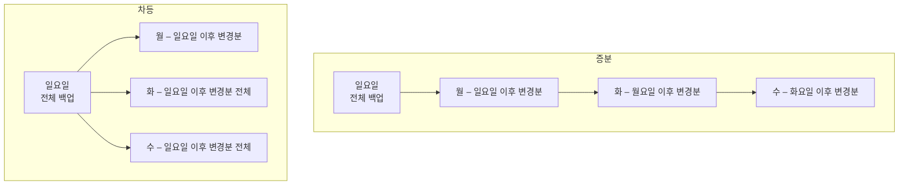

<Callout type="info">
  **이번 문서의 목표:** "증분 백업 7일치가 있는데 복구에 며칠이 걸리는가"를 계산으로 답할 수 있고, XFS에서 왜 `dump`가 안 되는지, `chattr +a`와 `+i`가 무엇을 막는지, SELinux의 세 가지 모드가 어떻게 다른지 설명할 수 있게 된다.
</Callout>

## 왜 백업과 보안을 한 편에서 다루는가

데이터를 지키는 방법은 두 갈래입니다. 하나는 **못 건드리게 막는 것**(보안), 다른 하나는 **망가져도 되돌리는 것**(백업)입니다. 어느 한쪽만으로는 부족합니다. 아무리 방화벽을 세워도 디스크는 물리적으로 고장 나고, 아무리 백업을 잘 받아도 권한이 새면 백업본까지 암호화당합니다.

1급 1차 필기에서 이 영역은 "**도구가 무엇을 할 수 있고 무엇을 못 하는가**"의 경계선을 묻습니다. 예를 들어 `dump`는 훌륭한 백업 도구지만 XFS 파일시스템에서는 아예 동작하지 않습니다. 이런 경계선을 이유와 함께 알아 두는 것이 이 편의 목표입니다.

## 1. 백업 전략 — 전체·증분·차등

### 왜 매번 전체를 받지 않는가

100기가바이트짜리 데이터를 매일 통째로 복사하면 안전하긴 합니다. 그런데 하루에 실제로 바뀌는 양이 500메가바이트라면, 나머지 99.5기가바이트는 어제와 똑같은 내용을 또 쓰는 셈입니다. 디스크도 시간도 낭비입니다. 그래서 "바뀐 것만 받자"는 발상이 나옵니다. 문제는 "**무엇을 기준으로 바뀐 것인가**"이고, 그 기준을 어떻게 잡느냐에 따라 세 가지 전략이 갈립니다.

> **쉽게 말하면:** 전체 백업은 매일 사진을 새로 찍는 것, 증분은 어제와 달라진 곳만 메모하는 것, 차등은 지난 일요일과 달라진 곳을 매일 다시 정리하는 것입니다.

### 세 가지 방식 정의

- **전체 백업**(full backup): 대상 전부를 복사합니다.
- **증분 백업**(incremental backup): **직전 백업**(전체든 증분이든) 이후 변경분만 복사합니다.
- **차등 백업**(differential backup): **직전 전체 백업** 이후 변경분을 매번 누적해 복사합니다.

차이는 "기준점이 계속 움직이느냐(증분), 고정이냐(차등)"입니다.



### 백업 시간과 복구 시간의 맞교환

일요일 전체 백업 후 월·화·수·목·금·토에 매일 백업하고 **일요일에 사고가 났다**고 합시다.

<Steps>
1. **증분으로 복구할 때**: 일요일 전체본을 먼저 풀고, 월→화→수→목→금→토 순서로 여섯 개를 **차례대로** 덮어써야 합니다. 총 7개 세트가 필요하며, 중간의 하나라도 손상되면 그 이후를 복원할 수 없습니다.
2. **차등으로 복구할 때**: 일요일 전체본을 풀고, **토요일 차등본 하나만** 덮어쓰면 끝입니다. 총 2개 세트면 됩니다.
</Steps>

즉 이런 대칭 관계가 성립합니다.

| 항목 | 증분 백업 | 차등 백업 |
|------|-----------|-----------|
| 기준점 | 직전 백업(계속 이동) | 직전 전체 백업(고정) |
| 백업 소요 시간 | 가장 짧다 | 날이 갈수록 길어진다 |
| 백업 저장 용량 | 가장 적다 | 날이 갈수록 커진다 |
| 복구에 필요한 세트 | 전체 1 + 증분 전부 | 전체 1 + 최신 차등 1 |
| 복구 소요 시간 | 가장 길다 | 짧다 |
| 세트 손상 시 위험 | 하나만 깨져도 이후 전부 불가 | 해당 차등본만 영향 |

**백업이 빠르면 복구가 느리고, 백업이 느리면 복구가 빠릅니다.** 시험에서 "복구가 가장 빠른 방식", "백업 용량이 가장 적은 방식"을 묻는 문제는 이 대칭만 이해하면 계산 없이 풀립니다.

### 자주 틀리는 점

"증분 백업이 무조건 좋다"고 생각하기 쉽습니다. 서비스 중단 시간(RTO, Recovery Time Objective, 복구 목표 시간)이 짧아야 하는 시스템에서는 차등이나 전체가 오히려 정답입니다. **좋고 나쁨이 아니라 무엇을 아끼느냐의 선택**입니다.

## 2. 백업 도구 — 무엇으로 무엇을 받는가

### tar — 가장 널리 쓰이는 아카이버

`tar`(tape archive, 테이프 아카이브)는 원래 테이프 장치에 파일을 순서대로 쌓기 위한 도구였습니다. 이름에 테이프가 남아 있는 이유입니다.

핵심 옵션 네 개는 **동작을 정하는 것**이고, 서로 배타적입니다.

| 옵션 | 이름 | 동작 |
|------|------|------|
| `-c` | create | 새 아카이브 생성 |
| `-x` | extract | 아카이브 풀기 |
| `-t` | list | 내용 목록만 보기 |
| `-r` | append | **기존 아카이브 뒤에 추가** |
| `-u` | update | 더 새로운 파일만 갱신 추가 |

여기에 보조 옵션이 붙습니다.

| 옵션 | 의미 |
|------|------|
| `-v` | 처리 과정 자세히 출력 |
| `-f` | 아카이브 파일명 지정(바로 뒤에 파일명이 와야 함) |
| `-z` | gzip 압축 동시 처리 |
| `-j` | bzip2 압축 동시 처리 |
| `-J` | xz 압축 동시 처리 |
| `-p` | 권한(permission) 보존 |
| `-C` | 지정 디렉터리로 이동 후 작업 |
| `-g` | 증분 백업용 스냅숏 파일 지정 |

시험에서 반복 출제되는 조합을 확인해 봅시다.

```bash
tar cvf backup.tar /home          # 새로 만들기
tar xvf backup.tar                # 풀기
tar tvf backup.tar                # 목록만 보기
tar rvf backup.tar *.c            # 기존 backup.tar에 .c 파일 추가
tar zcvf backup.tar.gz /home      # gzip 압축하며 생성
```

"**기존에 생성되어 있던 tar 파일에 파일을 묶는다**"는 문장이 나오면 `-c`가 아니라 `-r`입니다. `-c`는 기존 내용을 날리고 새로 만듭니다. 한 글자 차이로 데이터가 사라지므로 실무에서도 위험한 지점입니다.

증분 백업은 `-g`(`--listed-incremental`) 옵션으로 합니다.

```bash
tar -g /backup/snapshot.list -cvpf home_full.tar /home    # 1회차: 전체
tar -g /backup/snapshot.list -cvpf home_inc1.tar /home    # 2회차: 변경분만
```

지정한 스냅숏 파일에 "지난번에 무엇을 받았는지"가 기록되고, 다음 실행 때 그 파일을 참조해 변경분만 골라냅니다. **스냅숏 파일을 지우면 다시 전체 백업**이 됩니다.

### dump와 restore — 파일시스템 통째로

`dump`는 파일 단위가 아니라 **파일시스템 자체를 블록 수준에서** 읽어 백업합니다. 그래서 빠르고, 0부터 9까지의 **덤프 레벨**로 증분 백업을 자연스럽게 지원합니다. 레벨 0이 전체 백업이고, 레벨 n은 "그보다 낮은 레벨의 마지막 백업 이후 변경분"입니다.

```bash
dump -0u -f /backup/home.dump /dev/sda3    # 레벨 0 전체 백업
dump -1u -f /backup/home.d1 /dev/sda3      # 레벨 1 증분
restore -if /backup/home.dump              # 대화형 복원
```

`-u` 옵션은 백업 이력을 `/etc/dumpdates`에 기록합니다. 이 파일이 있어야 다음 레벨의 증분이 기준을 잡습니다.

여기서 **가장 중요한 함정**이 나옵니다. `dump`와 `restore`는 **ext2/ext3/ext4 전용**입니다. 파일시스템 내부 구조를 직접 읽는 방식이라 구조가 다른 파일시스템에서는 동작할 수 없습니다. CentOS 7 이후 기본 파일시스템인 **XFS에서는 `dump`를 쓸 수 없고**, 대신 `xfsdump`와 `xfsrestore`를 씁니다.

| 파일시스템 | 전용 백업 도구 | 비고 |
|------------|----------------|------|
| ext2/3/4 | `dump` / `restore` | `/etc/dumpdates`로 레벨 관리 |
| XFS | `xfsdump` / `xfsrestore` | RHEL 7 이상 기본 파일시스템 |
| 파일시스템 무관 | `tar`, `cpio`, `rsync`, `dd` | 파일 또는 블록 단위로 동작 |

`dd`는 블록을 그대로 복사하므로 어떤 파일시스템이든, 심지어 파일시스템이 없는 원시 장치도 복사할 수 있습니다. `rsync`와 `cpio`는 파일 단위로 접근하므로 역시 파일시스템을 가리지 않습니다. **오직 `dump`만 파일시스템을 가린다**는 것이 출제 포인트입니다.

### cpio — 표준 입력으로 목록을 받는 아카이버

`cpio`(copy in/out)는 특이하게 **백업할 파일 목록을 표준 입력으로 받습니다.** 그래서 `find`와 짝을 이룹니다.

| 옵션 | 이름 | 동작 |
|------|------|------|
| `-o` | copy-out | 아카이브 생성(백업) |
| `-i` | copy-in | 아카이브에서 추출(복원) |
| `-p` | pass-through | 다른 디렉터리로 바로 복사 |
| `-d` | make directories | 필요한 디렉터리 자동 생성 |
| `-v` | verbose | 과정 출력 |
| `-F` | file | 아카이브 파일명 지정 |

```bash
find /home -print | cpio -ocvF home.cpio     # 백업
cpio -icdvF home.cpio                        # 복원
```

**`-o`가 백업, `-i`가 복원**입니다. tar의 `-c`/`-x`와 글자가 달라 헷갈리기 쉬우니 "out은 밖으로 내보내 아카이브를 만든다, in은 안으로 들여와 되살린다"로 방향을 잡으세요. `restore -if`와 `cpio -iF`가 둘 다 `-i`를 쓴다는 점도 시험이 노리는 혼동 지점입니다. 함께 붙은 옵션과 파일명 형식으로 구분해야 합니다.

### rsync — 차이만 전송하는 동기화

`rsync`(remote sync, 원격 동기화)는 아카이브를 만드는 게 아니라 **원본과 대상을 같게 맞춥니다.** 파일 전체가 아니라 달라진 블록만 전송하는 알고리즘 덕에 원격 백업에 특히 강합니다.

```bash
rsync -avz --delete /home/ backup:/backup/home/
```

- `-a`: archive 모드. 권한·소유자·타임스탬프·심볼릭 링크를 보존하며 재귀 복사
- `-v`: 과정 출력
- `-z`: 전송 중 압축
- `--delete`: 원본에 없는 파일은 대상에서도 삭제(진짜 미러링)

주의할 점은 경로 끝의 슬래시입니다. `/home/`처럼 슬래시로 끝나면 "home 디렉터리의 **내용물**"을, `/home`이면 "home **디렉터리 자체**"를 복사합니다. 실무에서 디렉터리가 한 겹 더 생기는 사고의 원인입니다.

### 도구 선택 요약

| 상황 | 적합한 도구 | 이유 |
|------|-------------|------|
| 특정 디렉터리를 압축 보관 | `tar` | 압축·권한 보존이 한 번에 |
| ext4 파일시스템 레벨 증분 | `dump` | 덤프 레벨 지원 |
| XFS 파일시스템 레벨 백업 | `xfsdump` | XFS 전용 구조 대응 |
| find 조건에 맞는 파일만 | `cpio` | 목록을 표준 입력으로 받음 |
| 원격 서버와 주기적 동기화 | `rsync` | 변경분만 전송 |
| 디스크 전체를 이미지로 | `dd` | 블록 단위 원시 복사 |

## 3. 보안 기초 ① — 권한 상승과 sudo

### su와 sudo의 근본적 차이

`su`(substitute user)는 **다른 사용자로 아예 갈아탑니다.** 대상 사용자의 패스워드를 알아야 하고, 갈아탄 뒤에는 그 사용자가 할 수 있는 모든 일을 할 수 있습니다.

`sudo`(superuser do)는 **한 명령만 대신 실행시킵니다.** 자기 자신의 패스워드를 입력하고, `/etc/sudoers`에 허용된 명령만 실행됩니다.

| 항목 | `su` | `sudo` |
|------|------|--------|
| 입력하는 패스워드 | 대상 사용자의 것 | 자기 자신의 것 |
| 권한 범위 | 전환 후 전부 | 지정된 명령만 |
| 감사 기록 | 전환 사실만 | 실행한 명령 전체가 로그에 남음 |
| root 패스워드 공유 | 필요 | 불필요 |

운영 관점에서 `sudo`가 압도적으로 안전한 이유는 **root 패스워드를 아무에게도 알려주지 않아도 되고, 누가 무슨 명령을 했는지 로그로 남기 때문**입니다. `sudo` 사용 기록은 RHEL 계열에서 `/var/log/secure`, Debian 계열에서 `/var/log/auth.log`에 남습니다.

`su`와 `su -`의 차이도 자주 나옵니다. 하이픈을 붙이면 **로그인 셸**로 전환되어 대상 사용자의 환경변수와 프로파일을 새로 읽습니다. 붙이지 않으면 사용자만 바뀌고 환경은 원래 것이 남아, root로 전환했는데 `PATH`에 `/sbin`이 없어 명령을 못 찾는 상황이 벌어집니다.

### sudoers 파일 읽기

```
root    ALL=(ALL)       ALL
%wheel  ALL=(ALL)       ALL
kim     www=(root)      /usr/bin/systemctl restart httpd
```

형식은 `사용자 호스트=(실행할 사용자) 명령` 입니다. 세 번째 줄은 "kim은 www라는 호스트에서 root 권한으로 httpd 재시작 명령만 실행할 수 있다"는 뜻입니다. `%`로 시작하면 그룹이며, `wheel` 그룹은 관례적으로 관리자 그룹입니다.

이 파일은 반드시 **`visudo`로 편집**해야 합니다. 문법 오류가 있으면 저장을 막아 주는데, 그냥 `vi`로 편집하다 오타를 내면 아무도 sudo를 못 쓰는 상태가 되어 복구가 어려워집니다.

## 4. 보안 기초 ② — 파일 속성과 PAM

### chattr — 권한 위에 한 겹 더

`chmod`로 준 권한은 root가 마음대로 무시할 수 있습니다. 그보다 강하게, **root도 못 지우게** 만드는 것이 `chattr`(change attribute, 확장 속성 변경)입니다. ext 계열과 XFS 등에서 지원합니다.

| 속성 | 이름 | 효과 |
|------|------|------|
| `+i` | immutable | 수정·삭제·이름변경·링크 생성 모두 불가 |
| `+a` | append only | **추가만 가능**. 기존 내용 수정·삭제 불가 |
| `+A` | no atime | 접근 시각을 갱신하지 않음(성능용) |
| `+d` | no dump | `dump` 백업 대상에서 제외 |

```bash
chattr +a /etc/services      # 내용 추가만 허용
chattr +i /etc/passwd        # 완전 잠금
lsattr /etc/services         # 현재 속성 확인
```

**`+i`와 `+a`를 구분하는 문제**가 단골입니다. "수정은 불가하고 추가만 가능하게"라면 `+a`, "아예 아무것도 못 바꾸게"라면 `+i`입니다. 로그 파일에 `+a`를 걸어 두면 침입자가 흔적을 지우려 해도 지울 수 없다는 것이 실제 활용 예입니다. 속성 확인은 `ls`가 아니라 `lsattr`이라는 점도 기억하세요.

### PAM — 인증을 모듈로 갈아 끼우기

프로그램마다 "누가 로그인해도 되는가"를 각자 구현하면, 정책을 바꿀 때 모든 프로그램을 다시 컴파일해야 합니다. **PAM**(Pluggable Authentication Modules, 착탈식 인증 모듈)은 이 판단을 프로그램 밖으로 빼내 모듈로 만든 구조입니다.

> **쉽게 말하면:** PAM은 인증 절차를 레고 블록으로 만든 것입니다. 프로그램은 "인증해 줘"라고만 말하고, 어떤 블록을 어떤 순서로 쌓을지는 설정 파일이 정합니다.

설정은 `/etc/pam.d/` 아래에 서비스별 파일로 있습니다. 각 줄의 형식은 다음과 같습니다.

```
auth     required     pam_unix.so
account  required     pam_nologin.so
password requisite    pam_pwquality.so retry=3
session  optional     pam_motd.so
```

첫 칸이 **관리 그룹**입니다.

| 관리 그룹 | 담당 |
|-----------|------|
| `auth` | 신원 확인(패스워드 검증 등) |
| `account` | 계정 유효성(만료, 시간 제한) |
| `password` | 패스워드 변경 정책 |
| `session` | 세션 시작·종료 시 처리 |

둘째 칸이 **제어 플래그**로, 실패했을 때의 처리를 정합니다.

| 플래그 | 실패 시 동작 |
|--------|--------------|
| `required` | 실패해도 나머지 모듈은 계속 실행하되 최종 결과는 실패 |
| `requisite` | 즉시 중단하고 실패 반환 |
| `sufficient` | 성공하면 즉시 성공 반환(앞선 required 실패가 없을 때) |
| `optional` | 결과가 전체 판정에 영향 없음 |

필기 수준에서는 관리 그룹 네 개와 제어 플래그 네 개의 의미, 그리고 `pam_pwquality`(패스워드 복잡도), `pam_tally2`/`pam_faillock`(로그인 실패 횟수 제한), `pam_nologin`(`/etc/nologin` 존재 시 일반 사용자 차단) 정도를 알면 충분합니다.

## 5. 보안 기초 ③ — SELinux와 보안 도구

### 임의 접근 제어와 강제 접근 제어

전통적인 리눅스 권한은 **DAC**(Discretionary Access Control, 임의 접근 제어)입니다. 파일 소유자가 자기 파일의 권한을 마음대로 정할 수 있다는 뜻이고, 그래서 "임의"입니다. 문제는 웹 서버가 침해당하면 그 프로세스는 자기 소유 파일 전부에 접근할 수 있다는 점입니다.

**MAC**(Mandatory Access Control, 강제 접근 제어)은 시스템 전체 정책이 접근 가능 범위를 못 박습니다. 소유자라도 정책을 넘어설 수 없습니다. 리눅스에서 이를 구현한 대표가 RHEL 계열의 **SELinux**(Security-Enhanced Linux)와 Debian/Ubuntu 계열의 **AppArmor**입니다.

| 항목 | SELinux | AppArmor |
|------|---------|----------|
| 주 배포판 | RHEL, CentOS, Rocky, Fedora | Ubuntu, Debian, SUSE |
| 정책 기준 | 파일·프로세스에 붙은 **레이블**(컨텍스트) | 프로그램의 **경로** |
| 세밀함 | 매우 세밀하고 복잡 | 상대적으로 단순 |
| 확인 명령 | `getenforce`, `sestatus`, `ls -Z` | `aa-status` |

### SELinux의 세 가지 모드

| 모드 | 동작 | 용도 |
|------|------|------|
| `enforcing` | 정책 위반을 **차단하고 로그** | 운영 환경 |
| `permissive` | 차단하지 않고 **로그만 기록** | 정책 시험·문제 진단 |
| `disabled` | 아예 비활성 | 사용 권장 안 함 |

현재 모드는 `getenforce`로 확인하고, 임시 전환은 `setenforce 0`(permissive)/`setenforce 1`(enforcing)입니다. **영구 설정은 `/etc/selinux/config` 파일**이며 재부팅해야 반영됩니다. 특히 `disabled`로 바꾸거나 `disabled`에서 나올 때는 파일 전체에 레이블을 다시 붙여야 하므로 재부팅이 필수입니다.

"웹 서버가 특정 디렉터리를 못 읽는다"는 상황에서 권한(`ls -l`)은 멀쩡한데 접근이 막힌다면 SELinux 컨텍스트(`ls -Z`)를 의심합니다. 이것이 SELinux 관련 실무·시험 문제의 전형적인 구도입니다.

### 알아 둘 보안 도구

| 도구 | 분류 | 역할 |
|------|------|------|
| `nessus` | 취약점 스캐너 | 원격에서 서비스 취약점을 점검하고 대응 방안 제시 |
| `nmap` | 포트 스캐너 | 열린 포트와 서비스 종류 탐지 |
| `tripwire` | 무결성 검사 | 파일의 해시를 저장해 두고 변조 여부 탐지 |
| `AIDE` | 무결성 검사 | tripwire와 같은 목적의 오픈소스 도구 |
| `snort` | IDS | 시그니처 기반 침입 탐지, 단일 스레드 |
| `suricata` | IDS/IPS | 멀티스레드·GPU 가속 지원, OISF 개발 |
| `wireshark` | 패킷 분석 | 트래픽을 캡처해 프로토콜 단위로 해부 |
| `GnuPG` | 암호화 | 파일·메일 암호화와 전자서명 |
| `John the Ripper` | 패스워드 점검 | 취약한 패스워드를 사전·무차별 공격으로 탐지 |

역할이 겹쳐 보이는 셋을 구분해 두세요. 취약점을 찾아 주는 것은 **nessus**, 파일이 바뀌었는지 알려 주는 것은 **tripwire**, 패킷을 뜯어 보는 것은 **wireshark**입니다. IDS 두 개 중 "멀티코어·멀티스레딩·GPU 가속"이라는 설명이 붙으면 `suricata`입니다.

### TCP Wrapper — 서비스 단위 접근 제어

방화벽이 패킷을 보고 막는다면, **TCP Wrapper**는 서비스 데몬이 연결을 수락한 뒤 "이 호스트를 받아도 되는가"를 판단합니다. 설정은 두 파일입니다.

```
# /etc/hosts.allow
sshd: 192.168.10.

# /etc/hosts.deny
ALL: ALL
```

판단 순서는 **`hosts.allow`를 먼저 보고, 여기서 허용되면 끝**입니다. 여기 없으면 `hosts.deny`를 보고, 거기서도 안 걸리면 허용합니다. 그래서 "기본 차단 후 필요한 것만 열기"는 `hosts.deny`에 `ALL: ALL`을 두고 `hosts.allow`에 예외를 적는 방식이 됩니다.

원래 TCP Wrapper는 `inetd`/`xinetd` 같은 슈퍼 데몬이 관리하는 서비스에만 적용됐습니다. 지금은 독립(standalone) 데몬도 쓸 수 있는데, 조건은 그 데몬이 **`libwrap.so` 라이브러리와 링크되어 있는지**입니다. `ldd /usr/sbin/sshd | grep libwrap`으로 확인합니다. 이 라이브러리 이름이 그대로 출제됩니다.

## 핵심 정리

- 증분 백업은 직전 백업을, 차등 백업은 직전 전체 백업을 기준으로 삼는다. 증분은 백업이 빠르고 복구가 느리며, 차등은 그 반대다.
- `tar`의 `-c`는 새로 만들기, `-r`은 기존 아카이브에 추가, `-g`는 증분용 스냅숏 지정이다. `cpio`는 `-o`가 백업, `-i`가 복원이다.
- `dump`/`restore`는 ext 계열 전용이라 XFS에서는 쓸 수 없고 `xfsdump`/`xfsrestore`를 쓴다. `tar`·`cpio`·`rsync`·`dd`는 파일시스템을 가리지 않는다.
- `chattr +a`는 추가만 허용, `+i`는 완전 잠금이며 확인은 `lsattr`이다. sudo는 자기 패스워드로 지정된 명령만 실행하고 로그가 남는다.
- SELinux는 레이블 기반 MAC이며 모드는 enforcing·permissive·disabled 셋이다. 영구 설정은 `/etc/selinux/config`에서 하고 재부팅이 필요하다.

## 마무리 복습

<Quiz
  questionNumber={1}
  question="일요일에 전체 백업을 하고 월요일부터 토요일까지 매일 증분 백업을 수행했다. 일요일 아침에 장애가 발생했을 때 복구에 필요한 백업 세트는 몇 개인가?"
  options={['전체 백업 1개', '전체 백업 1개와 토요일 증분 1개, 합 2개', '전체 백업 1개와 월요일부터 토요일까지 증분 6개, 합 7개', '토요일 증분 1개']}
  correctAnswer={3}
  explanation="증분 백업은 직전 백업 이후의 변경분만 담으므로 각 요일의 백업이 서로 다른 변경분을 나눠 가지고 있다. 따라서 전체 백업을 먼저 복원한 뒤 월요일부터 토요일까지의 증분을 순서대로 모두 적용해야 한다. 차등 백업이었다면 전체 1개와 최신 차등 1개로 끝난다."
  optionExplanations={['전체 백업만으로는 월요일 이후의 변경 내용이 모두 누락된다.', '전체 백업과 최신 백업 하나로 끝나는 것은 차등 백업의 특성이다. 증분에는 해당하지 않는다.', '정답. 증분은 기준점이 계속 이동하므로 전체 1개와 증분 6개를 순서대로 모두 적용해야 한다.', '증분본 하나에는 금요일 이후의 변경분만 들어 있어 그것만으로는 복원이 불가능하다.']}
/>

<Quiz
  questionNumber={2}
  question="CentOS 7 이후 기본 파일시스템인 XFS 환경에서 사용할 수 없는 백업 도구는?"
  options={['dd', 'dump', 'cpio', 'rsync']}
  correctAnswer={2}
  explanation="dump와 restore는 ext2, ext3, ext4의 내부 구조를 직접 해석하는 방식이라 구조가 다른 XFS에서는 동작하지 않는다. XFS에서는 xfsdump와 xfsrestore를 사용한다. 나머지 셋은 블록 단위 또는 파일 단위로 접근하므로 파일시스템 종류를 가리지 않는다."
  optionExplanations={['dd는 장치의 블록을 그대로 복사하므로 파일시스템 종류와 무관하게 동작한다.', '정답. dump는 ext 계열 전용이며 XFS에서는 xfsdump를 써야 한다.', 'cpio는 표준 입력으로 받은 파일 목록을 아카이브하므로 파일시스템을 가리지 않는다.', 'rsync는 파일 단위로 동기화하므로 파일시스템 종류와 무관하다.']}
/>

<Quiz
  questionNumber={3}
  question="기존에 만들어져 있던 data.tar 아카이브에 현재 디렉터리의 로그 파일들을 추가로 묶으려고 한다. 알맞은 tar 옵션은?"
  options={['cvf', 'xvf', 'tvf', 'rvf']}
  correctAnswer={4}
  explanation="tar에서 기존 아카이브 뒤에 파일을 덧붙이는 동작은 -r 이며 append를 뜻한다. -c 는 새 아카이브를 만들면서 기존 내용을 덮어쓰고, -x 는 풀기, -t 는 목록 보기다."
  optionExplanations={['-c 는 새로 생성하는 옵션이라 기존 아카이브 내용이 사라진다.', '-x 는 아카이브를 푸는 옵션이다.', '-t 는 아카이브에 든 파일 목록만 출력한다.', '정답. -r 이 기존 아카이브에 추가하는 옵션이다.']}
/>

<Quiz
  questionNumber={4}
  question="/var/log/audit.log 파일을 기존 내용은 수정하거나 삭제할 수 없고 새로운 내용 추가만 가능하도록 설정하려고 한다. 알맞은 명령은?"
  options={['chattr +i /var/log/audit.log', 'chattr +a /var/log/audit.log', 'setfacl -m +a /var/log/audit.log', 'chmod a+w /var/log/audit.log']}
  correctAnswer={2}
  explanation="chattr의 +a 속성은 append only를 뜻해 파일 끝에 내용을 덧붙이는 것만 허용하고 기존 내용 변경이나 삭제는 root조차 막는다. 로그 파일 변조 방지에 쓰이는 대표적인 설정이며 확인은 lsattr 명령으로 한다."
  optionExplanations={['+i 는 immutable로 추가조차 불가능하게 완전히 잠근다. 추가는 허용해야 하므로 조건에 맞지 않는다.', '정답. +a 가 추가 전용 속성이다.', 'setfacl은 ACL을 다루는 명령이며 +a 라는 속성 표기는 setfacl 문법에 없다.', 'chmod로 준 쓰기 권한은 기존 내용 수정과 삭제도 함께 허용하므로 조건을 만족하지 못한다.']}
/>

<Quiz
  questionNumber={5}
  question="SELinux에 대한 설명으로 옳지 않은 것은?"
  options={['현재 동작 모드는 getenforce 명령으로 확인할 수 있다', 'permissive 모드는 정책 위반을 차단하지 않고 로그만 남긴다', 'setenforce 명령으로 변경한 모드는 재부팅 후에도 그대로 유지된다', '파일에 부여된 보안 컨텍스트는 ls -Z 옵션으로 확인한다']}
  correctAnswer={3}
  explanation="setenforce는 현재 실행 중인 커널의 동작 모드를 임시로 바꿀 뿐이므로 재부팅하면 원래 설정으로 돌아간다. 영구 변경은 /etc/selinux/config 파일의 SELINUX 항목을 수정하고 재부팅해야 한다."
  optionExplanations={['맞는 설명이다. getenforce는 현재 모드를 한 단어로 출력한다.', '맞는 설명이다. permissive는 정책 시험이나 문제 진단에 쓴다.', '정답. 이 설명이 틀렸다. setenforce는 임시 변경이며 영구 설정은 설정 파일에서 해야 한다.', '맞는 설명이다. -Z 옵션이 SELinux 컨텍스트를 보여 준다.']}
/>

<Quiz
  questionNumber={6}
  question="독립 실행형(standalone) 데몬이 TCP Wrapper의 접근 제어를 적용받으려면 어떤 라이브러리와 연동되어 있어야 하는가?"
  options={['libtcp.so', 'libwrap.so', 'libpam.so', 'libselinux.so']}
  correctAnswer={2}
  explanation="TCP Wrapper 기능은 libwrap.so 공유 라이브러리가 제공한다. 해당 데몬이 이 라이브러리와 링크되어 있어야 hosts.allow와 hosts.deny 정책을 참조하며, ldd 명령으로 의존 라이브러리 목록을 확인해 판단할 수 있다."
  optionExplanations={['libtcp.so 라는 라이브러리는 존재하지 않는다.', '정답. libwrap.so 가 TCP Wrapper 기능을 제공한다.', 'libpam.so 는 PAM 인증 모듈 체계를 위한 라이브러리다.', 'libselinux.so 는 SELinux 정책을 다루는 라이브러리로 접근 제어 방식이 다르다.']}
/>

<Quiz
  questionNumber={7}
  question="다음 설명에 해당하는 보안 도구로 알맞은 것은? 서버의 보안 취약점을 원격에서 점검해 문제가 되는 서비스 정보와 대처 방안을 알려 준다."
  options={['nessus', 'tripwire', 'GnuPG', 'wireshark']}
  correctAnswer={1}
  explanation="nessus는 대표적인 취약점 스캐너로 대상 시스템의 서비스와 버전을 조사해 알려진 취약점을 찾아내고 보고서로 대응 방안을 제시한다. 나머지는 각각 무결성 검사, 암호화, 패킷 분석이라는 다른 역할을 맡는다."
  optionExplanations={['정답. nessus가 취약점 스캐너다.', 'tripwire는 파일의 해시를 저장해 두고 변조 여부를 탐지하는 무결성 검사 도구다.', 'GnuPG는 파일과 메일을 암호화하고 서명하는 도구다.', 'wireshark는 네트워크 패킷을 캡처해 분석하는 도구다.']}
/>

<Quiz
  questionNumber={8}
  question="su 명령과 sudo 명령을 비교한 설명으로 알맞은 것은?"
  options={['su는 자기 자신의 패스워드를, sudo는 대상 사용자의 패스워드를 입력한다', 'sudo는 sudoers 설정에 허용된 명령만 실행되며 실행 내역이 로그로 남는다', 'su와 sudo 모두 root 패스워드를 모든 관리자에게 공유해야 한다', 'sudo는 셸 자체를 전환하므로 이후 모든 명령이 root 권한으로 실행된다']}
  correctAnswer={2}
  explanation="sudo는 자기 자신의 패스워드로 인증하고 /etc/sudoers 에 명시된 명령만 대신 실행하며, 누가 언제 어떤 명령을 실행했는지 인증 로그에 기록된다. 반면 su는 대상 사용자의 패스워드를 알아야 하고 전환 후에는 권한 범위에 제한이 없다."
  optionExplanations={['설명이 정확히 뒤바뀌었다. su가 대상 사용자의 패스워드를, sudo가 자기 패스워드를 요구한다.', '정답. 명령 단위 제한과 감사 기록이 sudo의 핵심 장점이다.', 'sudo를 쓰면 root 패스워드를 공유하지 않아도 되는 것이 도입 이유 중 하나다.', '셸 자체를 전환하는 것은 su의 동작이다. sudo는 지정한 명령 하나만 실행한다.']}
/>

## 참고 자료

- [tar(1) 매뉴얼 페이지 (man7.org)](https://man7.org/linux/man-pages/man1/tar.1.html)
- [dump(8) 매뉴얼 페이지 (man7.org)](https://man7.org/linux/man-pages/man8/dump.8.html)
- [chattr(1) 매뉴얼 페이지 (man7.org)](https://man7.org/linux/man-pages/man1/chattr.1.html)
- [Red Hat Enterprise Linux 9 – Using SELinux (docs.redhat.com)](https://docs.redhat.com/en/documentation/red_hat_enterprise_linux/9/html/using_selinux/index)
- [sudoers(5) 매뉴얼 페이지 (sudo.ws)](https://www.sudo.ws/docs/man/sudoers.man/)
- [hosts_access(5) 매뉴얼 페이지 – TCP Wrapper (man7.org)](https://man7.org/linux/man-pages/man5/hosts_access.5.html)
