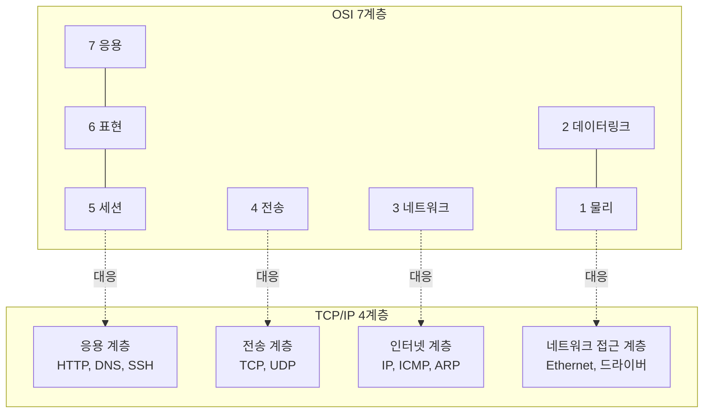
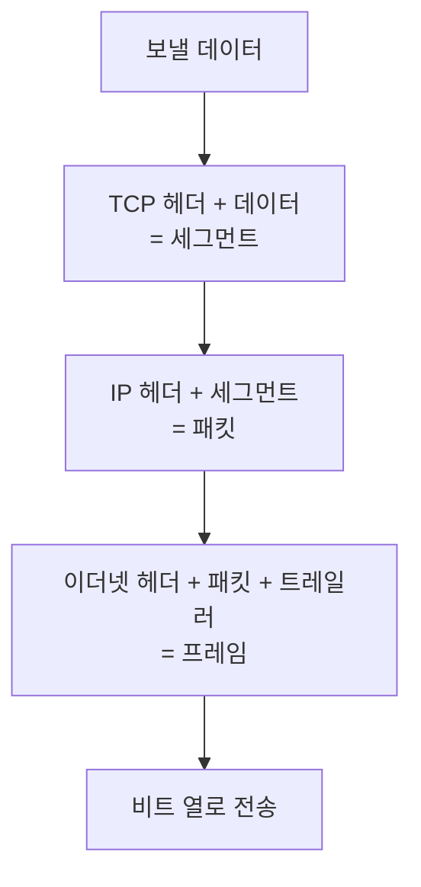
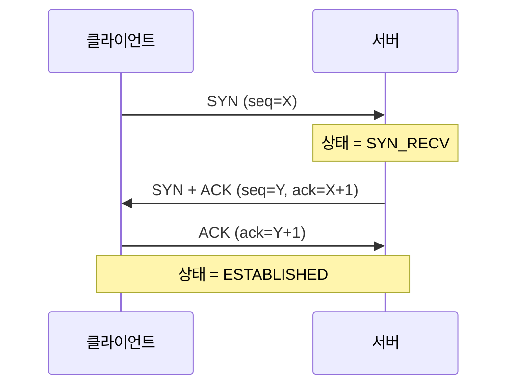
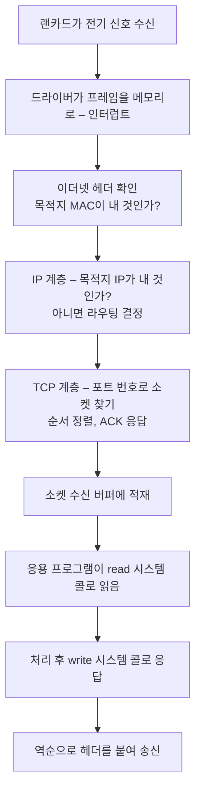

<Callout type="info">
  **이번 문서의 목표:** 계층 이름을 외우는 대신, 데이터가 내려가며 무엇이 붙고 올라가며 무엇이 떨어지는지를 그릴 수 있고, `ss` 출력의 `SYN_RECV`나 `TIME_WAIT`가 왜 거기 있는지 설명할 수 있게 된다.
</Callout>

## 왜 계층으로 나누는가

네트워크를 처음 배우면 "7계층"부터 외우게 됩니다. 그런데 왜 굳이 층을 나눴는지를 모르면 그냥 목록일 뿐입니다.

문제 상황부터 봅시다. 서울의 컴퓨터가 부산의 서버에 파일을 보낸다고 할 때, 해결해야 할 일이 한둘이 아닙니다. 전선에 전기 신호를 어떻게 실을지, 같은 사무실 안에서 어느 기계에 줄지, 지구 반대편까지 어떤 길로 갈지, 중간에 조각이 사라지면 어떻게 다시 보낼지, 받은 쪽에서 어느 프로그램에 넘길지, 내용을 어떤 형식으로 해석할지.

이걸 한 덩어리로 만들면 랜선을 광케이블로 바꿀 때 프로그램까지 다시 짜야 합니다. 그래서 **관심사를 층으로 쪼개고, 층 사이의 약속만 지키면 각 층을 독립적으로 갈아 끼울 수 있게** 만들었습니다.

> **쉽게 말하면:** 계층은 택배 회사의 분업입니다. 포장 담당은 트럭이 디젤인지 전기인지 몰라도 되고, 운전 담당은 상자 안에 무엇이 들었는지 몰라도 됩니다.

## 1. OSI 7계층 — 개념의 표준자

**OSI**(Open Systems Interconnection, 개방형 시스템 상호연결)는 ISO(국제표준화기구)가 만든 참조 모델입니다. 실제 인터넷은 이 모델대로 구현되지 않았지만, **네트워크를 설명하는 공용어**로 여전히 쓰입니다.

| 계층 | 이름 | 하는 일 | PDU | 대표 장비·프로토콜 |
|------|------|---------|-----|--------------------|
| 7 | 응용(Application) | 사용자에게 보이는 서비스 | Data | HTTP, FTP, SMTP, DNS, SSH |
| 6 | 표현(Presentation) | 인코딩·암호화·압축 | Data | ASCII, JPEG, TLS(일부 관점) |
| 5 | 세션(Session) | 대화의 시작·유지·종료 | Data | NetBIOS, RPC |
| 4 | 전송(Transport) | 종단 간 신뢰성, 포트 구분 | **Segment** | TCP, UDP |
| 3 | 네트워크(Network) | 논리 주소와 경로 선택 | **Packet** | IP, ICMP / 라우터 |
| 2 | 데이터링크(Data Link) | 인접 구간의 오류 제어, 물리 주소 | **Frame** | Ethernet, ARP / 스위치·브리지 |
| 1 | 물리(Physical) | 전기·광 신호로 비트 전송 | **Bit** | 케이블, 리피터, 허브 |

**PDU**(Protocol Data Unit, 프로토콜 데이터 단위)는 각 계층이 다루는 데이터 덩어리의 이름입니다. 시험에서 순서를 섞어 묻는 단골 항목이라 이렇게 붙여 외우세요. **전송은 세그먼트, 네트워크는 패킷, 데이터링크는 프레임, 물리는 비트.** "전송-네트워크-데이터링크" 순으로 나열하면 `segment - packet - frame`입니다.

계층 이름을 순서대로 외우는 방법으로는 아래에서 위로 "물-데-네-전-세-표-응"이 흔히 쓰입니다.

## 2. TCP/IP 4계층 — 실제로 구현된 모델

인터넷은 OSI가 표준으로 정리되기 전에 이미 굴러가고 있었습니다. 실제 구현 모델이 **TCP/IP 모델**이고, 4계층으로 봅니다.



- OSI의 5·6·7계층이 TCP/IP에서는 **응용 계층 하나**로 뭉쳐 있습니다.
- OSI의 1·2계층이 **네트워크 접근 계층**(network access, 링크 계층이라고도 함) 하나로 뭉쳐 있습니다.
- 4계층(전송)과 3계층(네트워크·인터넷)은 일대일로 대응합니다.

리눅스 커널의 구조도 TCP/IP 모델을 따릅니다. 소켓 인터페이스가 응용과 전송 사이의 창구이고, IP 계층이 라우팅을 결정하며, 네트워크 장치 드라이버가 실제 카드에 프레임을 밀어 넣습니다.

## 3. 캡슐화 — 층마다 봉투를 하나씩 더 씌운다

데이터가 내려갈 때 각 계층은 자기 헤더(header, 머리말)를 앞에 붙입니다. 이것이 **캡슐화**(encapsulation)입니다. 받는 쪽에서는 올라가며 자기 헤더를 떼어 냅니다(**역캡슐화**, decapsulation).



여기서 중요한 통찰이 있습니다. **상위 계층의 헤더는 하위 계층에게 그냥 데이터일 뿐**입니다. 이더넷 카드는 안에 든 것이 HTTP인지 SSH인지 모르고, 그냥 정해진 목적지 MAC 주소로 프레임을 보냅니다. 이 무관심이 계층 분리의 핵심입니다.

각 계층이 붙이는 주소도 다릅니다.

| 계층 | 주소 | 형태 | 유효 범위 |
|------|------|------|-----------|
| 데이터링크 | MAC 주소 | 48비트, 예: `08:00:27:26:c0:a5` | **같은 네트워크 구간 안에서만** |
| 네트워크 | IP 주소 | IPv4는 32비트, 예: `192.168.1.10` | **전 세계 종단 간** |
| 전송 | 포트 번호 | 16비트, 0에서 65535 | 한 호스트 안의 프로그램 구분 |

가장 자주 나오는 오해가 "MAC 주소로 인터넷을 건넌다"는 것입니다. 아닙니다. **IP 주소는 출발지에서 목적지까지 그대로 유지되지만, MAC 주소는 라우터를 하나 지날 때마다 바뀝니다.** 라우터가 프레임을 풀어 IP 패킷을 꺼내고, 다음 구간의 MAC 주소를 새로 붙여 다시 포장하기 때문입니다.

IP 주소와 MAC 주소를 이어 주는 것이 **ARP**(Address Resolution Protocol, 주소 결정 프로토콜)입니다. "192.168.1.1 쓰는 사람 누구야?"를 브로드캐스트로 묻고, 해당 호스트가 자기 MAC을 알려 줍니다. 결과는 ARP 캐시에 저장되며 `arp -a` 또는 `ip neigh`로 확인합니다. **로컬 네트워크에 있는 다른 호스트의 MAC 주소를 확인하는 명령은 arp**라는 문제가 반복 출제됩니다.

## 4. TCP와 UDP — 신뢰성을 살 것인가 속도를 살 것인가

### 왜 두 개가 필요한가

전송 계층이 하는 일은 두 가지입니다. 하나는 **어느 프로그램에게 줄지 정하는 것**(포트), 다른 하나는 **얼마나 확실하게 전달할지 정하는 것**입니다. 뒤엣것에서 두 갈래가 생깁니다.

파일을 받는데 중간 1바이트가 사라지면 파일이 깨집니다. 무조건 다시 받아야 합니다. 반면 영상 통화에서 0.5초 전 화면 조각을 지금 다시 받아 봐야 아무 쓸모가 없습니다. 차라리 버리고 다음 것을 받는 게 낫습니다. 전자를 위한 것이 **TCP**, 후자를 위한 것이 **UDP**입니다.

| 항목 | TCP | UDP |
|------|-----|-----|
| 이름 | Transmission Control Protocol | User Datagram Protocol |
| 연결 방식 | 연결 지향(connection-oriented) | 비연결형(connectionless) |
| 신뢰성 | 순서 보장·재전송·중복 제거 | 보장 없음 |
| 흐름·혼잡 제어 | 있음 | 없음 |
| 헤더 크기 | 20바이트 이상 | 8바이트 고정 |
| 속도·오버헤드 | 느리고 무겁다 | 빠르고 가볍다 |
| 대표 서비스 | HTTP, FTP, SSH, SMTP | DNS 질의, DHCP, TFTP, NTP, SNMP |

### TCP 3-way handshake

TCP는 데이터를 보내기 전에 "연결"을 만듭니다. 세 번의 인사를 주고받습니다.

<Steps>
1. 클라이언트가 **SYN**(synchronize, 동기화 요청)을 보냅니다. "내 시작 번호는 X야."
2. 서버가 **SYN + ACK**로 답합니다. "받았어(ACK). 내 시작 번호는 Y야(SYN)."
3. 클라이언트가 **ACK**를 보냅니다. "네 번호 받았어." 이제 연결 성립.
</Steps>



이 절차를 이해하면 보안 문제 하나가 자동으로 풀립니다. **SYN 플러딩**(SYN Flooding) 공격은 1단계 SYN만 잔뜩 보내고 3단계 ACK를 보내지 않는 공격입니다. 서버는 2단계까지 처리한 뒤 클라이언트의 ACK를 기다리며 자원을 잡아 둡니다. 이 상태가 바로 **SYN_RECV**이고, `netstat`이나 `ss` 출력에 `SYN_RECV`가 비정상적으로 많이 쌓여 있으면 SYN 플러딩을 의심합니다.

### 주요 TCP 소켓 상태

| 상태 | 의미 |
|------|------|
| `LISTEN` | 서버가 연결 요청을 기다리는 중 |
| `SYN_SENT` | 클라이언트가 SYN을 보내고 응답 대기 중 |
| `SYN_RECV` | 서버가 SYN을 받고 마지막 ACK 대기 중 |
| `ESTABLISHED` | 연결 성립, 데이터 송수신 중 |
| `FIN_WAIT1` / `FIN_WAIT2` | 종료 요청을 보내고 상대 응답 대기 |
| `CLOSE_WAIT` | 상대가 종료를 알렸고 내 쪽 종료를 기다리는 중 |
| `LAST_ACK` | 종료 요청을 보내고 마지막 ACK 대기 |
| `TIME_WAIT` | 종료 후 지연 패킷 대비로 잠시 유지 |

`TIME_WAIT`이 많은 것은 대체로 정상입니다. 연결을 먼저 끊은 쪽이 뒤늦게 도착할 패킷을 흡수하려고 잠시(보통 60초) 유지하는 상태니까요. 반면 **`CLOSE_WAIT`이 계속 쌓이면 애플리케이션이 소켓을 닫지 않는 버그**를 의심합니다. 이 구분이 실무형 문제로 나옵니다.

### TCP 4-way handshake로 끊기

연결을 만들 때는 세 번이지만 끊을 때는 네 번입니다. TCP는 양방향이라 각 방향을 따로 닫아야 하기 때문입니다. 한쪽이 FIN을 보내고 상대가 ACK로 받은 뒤, 상대도 자기 쪽 FIN을 보내고 다시 ACK를 받는 구조입니다.

## 5. 포트와 서비스 매핑

### 포트 번호 대역

포트는 16비트라 0부터 65535까지 있습니다. 용도에 따라 세 구간으로 나뉩니다.

| 구간 | 범위 | 이름 | 특징 |
|------|------|------|------|
| 잘 알려진 포트 | 0 – 1023 | Well-known Port | IANA가 지정, **root 권한이 있어야 바인딩 가능** |
| 등록된 포트 | 1024 – 49151 | Registered Port | 애플리케이션 벤더가 등록 |
| 동적·사설 포트 | 49152 – 65535 | Dynamic/Private Port | 클라이언트가 임시로 쓰는 포트 |

1023 이하를 특권 포트로 둔 이유는 **아무 일반 사용자나 80번 포트에 가짜 웹 서버를 띄우지 못하게** 하기 위해서입니다. 그래서 웹 서버를 80번에 띄우려면 root로 시작해 포트를 잡은 뒤 일반 사용자로 권한을 낮추는 방식을 씁니다.

### 반드시 외워야 할 포트

| 포트 | 프로토콜 | 서비스 |
|------|----------|--------|
| 20 | TCP | FTP 데이터 |
| 21 | TCP | FTP 제어 |
| 22 | TCP | SSH, SFTP, SCP |
| 23 | TCP | Telnet |
| 25 | TCP | SMTP(메일 발송) |
| 53 | **UDP/TCP** | DNS(질의는 UDP, 존 전송은 TCP) |
| 67 / 68 | UDP | DHCP 서버 / 클라이언트 |
| 69 | UDP | TFTP |
| 80 | TCP | HTTP |
| 110 | TCP | POP3 |
| 123 | UDP | NTP(시간 동기화) |
| 143 | TCP | IMAP |
| 161 / 162 | UDP | SNMP / SNMP Trap |
| 389 | TCP | LDAP |
| 443 | TCP | HTTPS |
| 445 | TCP | SMB(Samba, 직접 호스팅) |
| 514 | UDP | syslog 원격 전송 |
| 2049 | TCP/UDP | NFS |
| 3306 | TCP | MySQL/MariaDB |
| 5432 | TCP | PostgreSQL |
| 5900 | TCP | VNC |

`/etc/services` 파일이 바로 이 "포트 번호와 서비스 이름의 대응표"입니다. `ss`나 `netstat`이 포트 번호 대신 `ssh`, `http` 같은 이름을 보여 주는 것은 이 파일을 참조하기 때문이고, `-n` 옵션을 주면 조회를 건너뛰고 숫자로만 출력합니다.

```
ssh             22/tcp                          # SSH Remote Login Protocol
http            80/tcp          www www-http    # WorldWideWeb HTTP
https           443/tcp                         # http protocol over TLS/SSL
```

### 소켓 확인 명령

| 명령 | 설명 |
|------|------|
| `ss -tuln` | TCP·UDP 리스닝 소켓을 숫자로 출력 |
| `ss -tanp` | 모든 TCP 소켓과 소유 프로세스 |
| `netstat -tuln` | `ss`의 구형 대응 명령 |
| `netstat -rn` | 라우팅 테이블 출력 |
| `lsof -i :80` | 80번 포트를 쓰는 프로세스 |

`ss`(socket statistics)는 `netstat`을 대체하는 현대 명령입니다. 커널의 소켓 정보를 직접 읽어 훨씬 빠릅니다. **"SSH로 접속한 상대 호스트의 IP를 확인"** 같은 문제에서 답이 `ss`인 이유는, 이 명령이 각 연결의 로컬·원격 주소 쌍을 보여 주기 때문입니다. `arp`는 MAC 주소, `ethtool`은 랜카드의 물리 설정, `mii-tool`은 링크 상태를 다루므로 역할이 다릅니다.

옵션 글자는 이렇게 붙여 기억합니다. `-t`는 TCP, `-u`는 UDP, `-l`은 listening(대기 중), `-n`은 numeric(이름 변환 안 함), `-a`는 all, `-p`는 process(프로세스명 표시, root 필요).

## 6. 리눅스 네트워크 스택의 여정

패킷 하나가 웹 서버에 도착해 응답이 나가기까지를 계층으로 따라가 봅시다.



이 흐름에서 각 단계가 실패하면 증상이 다릅니다. C 단계 문제면 아예 아무 반응이 없고, D 단계에서 라우팅이 없으면 "Network is unreachable", E 단계에서 해당 포트를 듣는 프로그램이 없으면 "Connection refused", 방화벽이 조용히 버리면 아무 응답 없이 타임아웃이 납니다. **"거부됐다"와 "응답이 없다"는 다른 증상**이고, 전자는 서비스 미기동, 후자는 방화벽 DROP을 먼저 의심하는 것이 정석입니다.

### 관련 표준화 기구

시험에서 기구 이름을 설명으로 묻는 문제도 나옵니다.

| 기구 | 정식 명칭 | 역할 |
|------|-----------|------|
| IEEE | Institute of Electrical and Electronics Engineers | 전기·전자 전문가 조직, **LAN·MAN 표준**(802 시리즈) 제정 |
| ISO | International Organization for Standardization | 국제 표준화 기구, OSI 참조 모델 |
| IETF | Internet Engineering Task Force | 인터넷 프로토콜 표준(RFC 문서) 작성 |
| IANA | Internet Assigned Numbers Authority | 포트 번호·IP 주소 대역 등 **번호 자원 할당** |
| ICANN | Internet Corporation for Assigned Names and Numbers | 도메인 이름과 IP 주소 체계 총괄 관리 |
| ITU-T | International Telecommunication Union | 통신 분야 국제 표준 |

"LAN과 MAN 표준을 제정한 전기·전자 공학자 조직"이라는 설명이 나오면 IEEE입니다. 번호 자원 배분은 IANA, 도메인 정책 총괄은 ICANN으로 구분하세요.

## 핵심 정리

- PDU는 전송 계층이 세그먼트, 네트워크 계층이 패킷, 데이터링크 계층이 프레임, 물리 계층이 비트다.
- OSI 7계층 중 5·6·7이 TCP/IP의 응용 계층으로, 1·2가 네트워크 접근 계층으로 합쳐진다.
- IP 주소는 종단 간에 유지되지만 MAC 주소는 라우터를 지날 때마다 바뀐다. 둘을 잇는 것이 ARP다.
- TCP는 3-way handshake로 연결을 만들고 신뢰성을 보장하며, UDP는 헤더 8바이트로 가볍고 빠르다. `SYN_RECV`가 과다하면 SYN 플러딩을 의심한다.
- 0에서 1023은 잘 알려진 포트로 root만 바인딩할 수 있고, 포트와 서비스 이름의 대응은 `/etc/services`에 있다.

## 마무리 복습

<Quiz
  questionNumber={1}
  question="전송 계층, 네트워크 계층, 데이터링크 계층 순서로 각 계층의 PDU를 올바르게 나열한 것은?"
  options={['frame - packet - segment', 'segment - packet - frame', 'packet - frame - segment', 'packet - segment - frame']}
  correctAnswer={2}
  explanation="PDU는 각 계층이 다루는 데이터 단위의 이름이다. 전송 계층은 세그먼트, 네트워크 계층은 패킷, 데이터링크 계층은 프레임, 물리 계층은 비트다. 아래로 내려갈수록 헤더가 하나씩 더 붙는 캡슐화 순서와도 일치한다."
  optionExplanations={['프레임은 데이터링크, 세그먼트는 전송 계층이므로 순서가 뒤집혔다.', '정답. 전송은 세그먼트, 네트워크는 패킷, 데이터링크는 프레임이다.', '패킷과 프레임의 계층이 서로 바뀌었다.', '패킷과 세그먼트의 계층이 서로 바뀌었다.']}
/>

<Quiz
  questionNumber={2}
  question="TCP와 UDP를 비교한 설명으로 옳지 않은 것은?"
  options={['TCP는 연결 지향 방식이며 데이터의 순서를 보장한다', 'UDP는 헤더가 8바이트로 고정되어 오버헤드가 작다', 'UDP는 흐름 제어와 혼잡 제어를 수행해 안정적으로 전달한다', 'DNS 질의는 주로 UDP를 사용하고 존 전송에는 TCP를 사용한다']}
  correctAnswer={3}
  explanation="흐름 제어와 혼잡 제어는 TCP의 기능이다. UDP는 연결 설정도 재전송도 순서 보장도 하지 않는 비연결형 프로토콜이며, 그 대신 헤더가 작고 지연이 적어 실시간 전송이나 짧은 질의응답에 쓰인다."
  optionExplanations={['맞는 설명이다. TCP는 3-way handshake로 연결을 맺고 시퀀스 번호로 순서를 보장한다.', '맞는 설명이다. TCP 헤더가 최소 20바이트인 것과 대비된다.', '정답. 이 설명이 틀렸다. 흐름 제어와 혼잡 제어는 TCP의 기능이며 UDP에는 없다.', '맞는 설명이다. 응답이 큰 존 전송은 TCP 53번을 사용한다.']}
/>

<Quiz
  questionNumber={3}
  question="서버에서 ss 명령을 실행했을 때 State 항목에 특정 값이 과도하게 쌓여 있으면 SYN Flooding 공격을 의심할 수 있다. 그 상태 값은?"
  options={['SYN_SENT', 'SYN_RECV', 'TIME_WAIT', 'LAST_ACK']}
  correctAnswer={2}
  explanation="SYN Flooding은 3-way handshake의 첫 SYN만 대량으로 보내고 마지막 ACK를 보내지 않는 공격이다. 서버는 SYN에 대해 SYN과 ACK를 응답한 뒤 상대의 ACK를 기다리며 자원을 잡아 두는데, 이 대기 상태가 SYN_RECV 다."
  optionExplanations={['SYN_SENT는 연결을 시도한 클라이언트 쪽에서 나타나는 상태다.', '정답. 서버가 마지막 ACK를 기다리는 상태가 SYN_RECV 이며 공격 시 급증한다.', 'TIME_WAIT은 정상 종료 후 지연 패킷을 흡수하려 잠시 유지하는 상태로 많아도 대개 정상이다.', 'LAST_ACK는 종료 절차에서 마지막 ACK를 기다리는 상태다.']}
/>

<Quiz
  questionNumber={4}
  question="같은 로컬 네트워크에 연결된 다른 호스트의 MAC 주소를 확인하려고 한다. 알맞은 명령은?"
  options={['ip route', 'arp', 'ethtool', 'ss']}
  correctAnswer={2}
  explanation="arp 명령은 IP 주소와 MAC 주소의 대응 관계를 담은 ARP 캐시 테이블을 조회한다. 같은 브로드캐스트 도메인 안의 호스트에 대해 IP로 MAC을 확인할 수 있으며, 현대적인 대체 명령으로는 ip neigh 가 있다."
  optionExplanations={['ip route는 라우팅 테이블을 보여 주며 MAC 주소와 무관하다.', '정답. arp가 IP와 MAC의 대응을 담은 캐시를 조회한다.', 'ethtool은 랜카드의 속도와 듀플렉스 등 물리 계층 설정을 다룬다.', 'ss는 소켓 연결 상태와 IP 및 포트를 보여 줄 뿐 MAC 주소는 보여 주지 않는다.']}
/>

<Quiz
  questionNumber={5}
  question="포트 번호에 대한 설명으로 알맞은 것은?"
  options={['0번부터 1023번까지는 잘 알려진 포트로 일반적으로 root 권한이 있어야 바인딩할 수 있다', '포트 번호는 32비트 값이므로 최대 약 42억 개를 사용할 수 있다', '49152번 이상은 IANA가 서비스별로 고정 할당한 대역이다', '포트 번호와 서비스 이름의 대응은 /etc/protocols 파일에 정의되어 있다']}
  correctAnswer={1}
  explanation="0번부터 1023번까지는 well-known port로 IANA가 표준 서비스에 지정한 대역이며, 리눅스에서는 특권 포트로 취급되어 root 권한 없이는 바인딩할 수 없다. 일반 사용자가 80번에 가짜 웹 서버를 띄우는 것을 막기 위한 장치다."
  optionExplanations={['정답. 1023번 이하가 특권 포트라는 점이 핵심이다.', '포트 번호는 16비트라 0부터 65535까지 총 65536개다.', '49152번 이상은 동적 및 사설 포트로 클라이언트가 임시로 쓰는 대역이며 고정 할당이 아니다.', '포트와 서비스 이름의 대응은 /etc/services 에 있다. /etc/protocols 는 IP 상위 프로토콜 번호를 정의한다.']}
/>

<Quiz
  questionNumber={6}
  question="전기 및 전자공학 전문가로 구성된 국제 조직으로 LAN과 MAN 분야의 표준을 제정한 기관은?"
  options={['ICANN', 'IANA', 'IEEE', 'ISO']}
  correctAnswer={3}
  explanation="IEEE는 전기전자기술자협회로 802 시리즈 표준을 통해 이더넷과 무선 LAN 등 LAN 및 MAN 규격을 제정한다. ISO는 OSI 참조 모델을, IANA는 포트와 주소 같은 번호 자원 할당을, ICANN은 도메인 이름 체계를 담당한다."
  optionExplanations={['ICANN은 도메인 이름과 IP 주소 체계를 총괄 관리하는 기관이다.', 'IANA는 포트 번호와 IP 주소 대역 등 번호 자원을 할당한다.', '정답. IEEE가 802 시리즈로 LAN과 MAN 표준을 만든다.', 'ISO는 OSI 참조 모델을 만든 국제 표준화 기구다.']}
/>

<Quiz
  questionNumber={7}
  question="라우터를 여러 개 거쳐 원격지 서버로 패킷이 전달될 때의 주소 변화에 대한 설명으로 알맞은 것은?"
  options={['출발지와 목적지 IP 주소는 유지되고 MAC 주소는 구간마다 바뀐다', '출발지와 목적지 MAC 주소는 유지되고 IP 주소가 구간마다 바뀐다', 'IP 주소와 MAC 주소 모두 끝까지 그대로 유지된다', 'IP 주소와 MAC 주소 모두 구간마다 새로 만들어진다']}
  correctAnswer={1}
  explanation="IP 주소는 종단 간 논리 주소이므로 출발지에서 목적지까지 그대로 유지된다. 반면 MAC 주소는 같은 네트워크 구간 안에서만 의미가 있어, 라우터가 프레임을 풀고 다음 구간의 MAC 주소를 새로 붙여 재전송한다. NAT가 개입하면 IP도 바뀔 수 있지만 기본 원리는 이렇다."
  optionExplanations={['정답. IP는 종단 간 유지, MAC은 구간마다 교체가 원칙이다.', '설명이 정확히 뒤바뀌었다. MAC이 구간 주소, IP가 종단 주소다.', 'MAC 주소가 유지된다면 다른 네트워크로 전달될 수 없다.', 'IP 주소까지 매 구간 바뀐다면 응답을 돌려보낼 종단을 알 수 없게 된다.']}
/>

<Quiz
  questionNumber={8}
  question="ss -tuln 명령에서 각 옵션의 의미로 알맞은 것은?"
  options={['t는 TCP, u는 UDP, l은 대기 중인 소켓, n은 이름 대신 숫자로 표시', 't는 시간 정보, u는 사용자, l은 목록, n은 개수', 't는 트래픽, u는 UDP, l은 로그, n은 네트워크', 't는 TCP, u는 유닉스 소켓, l은 링크, n은 노드']}
  correctAnswer={1}
  explanation="ss 명령의 -t 는 TCP 소켓, -u 는 UDP 소켓을 대상으로 하고, -l 은 listening 상태의 소켓만 출력하며, -n 은 numeric 으로 /etc/services 조회를 생략하고 포트를 숫자로 표시한다. 여기에 -p 를 더하면 소켓을 점유한 프로세스까지 보인다."
  optionExplanations={['정답. TCP, UDP, listening, numeric의 첫 글자를 딴 옵션이다.', '시간이나 사용자 정보를 뜻하는 옵션이 아니다.', '트래픽이나 로그를 출력하는 옵션이 아니다.', '유닉스 도메인 소켓은 -x 옵션이며 -l 은 링크가 아니라 listening 이다.']}
/>

## 참고 자료

- [RFC 793 – Transmission Control Protocol (rfc-editor.org)](https://www.rfc-editor.org/rfc/rfc793)
- [RFC 768 – User Datagram Protocol (rfc-editor.org)](https://www.rfc-editor.org/rfc/rfc768)
- [IANA Service Name and Transport Protocol Port Number Registry](https://www.iana.org/assignments/service-names-port-numbers/service-names-port-numbers.xhtml)
- [ss(8) 매뉴얼 페이지 (man7.org)](https://man7.org/linux/man-pages/man8/ss.8.html)
- [services(5) 매뉴얼 페이지 (man7.org)](https://man7.org/linux/man-pages/man5/services.5.html)
