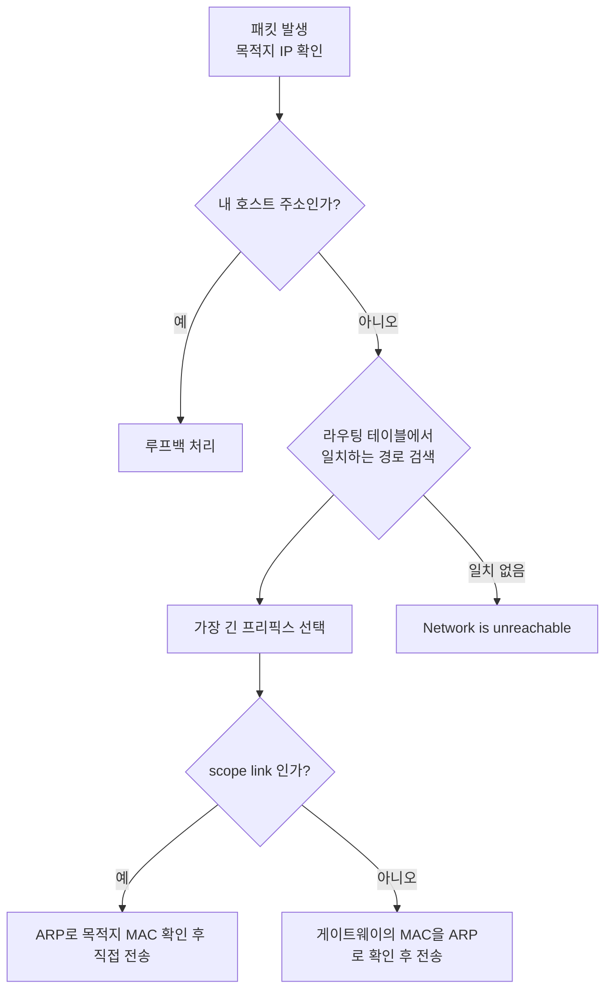
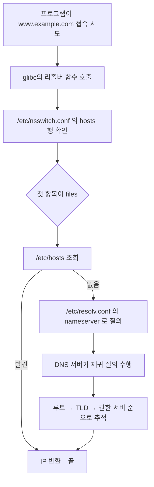

<Callout type="info">
  **이번 문서의 목표:** `192.168.3.150/26`이 주어졌을 때 네트워크·브로드캐스트·사용 가능 IP 범위를 손으로 계산할 수 있고, 호스트 이름 하나가 IP로 바뀌기까지 어떤 파일이 어떤 순서로 참조되는지 설명할 수 있게 된다.
</Callout>

## 왜 이 편이 네트워크 문제의 절반인가

네트워크가 안 될 때 원인은 거의 정해져 있습니다. IP가 잘못 잡혔거나, 게이트웨이가 없거나, 이름을 못 풀거나. 이 세 가지가 각각 **주소 설정·라우팅·이름 해석**입니다. 1급 1차 필기의 네트워크 문항 상당수가 이 셋 안에서 나옵니다.

특히 서브넷 계산은 **유일하게 손으로 풀어야 하는 계산 문제**라 준비하지 않으면 시간을 크게 잃습니다. 이 편은 계산 절차를 기계적으로 반복할 수 있게 만드는 데 지면을 많이 씁니다.

## 1. IP 주소와 서브넷 — 손으로 푸는 법

### IPv4 주소의 구조

**IPv4** 주소는 32비트입니다. 사람이 읽기 쉽게 8비트씩 네 덩어리로 끊어 점으로 잇습니다. 8비트는 0부터 255까지 표현하므로 각 덩어리(옥텟, octet)가 이 범위를 가집니다.

```
192  .  168  .    3  .  150
11000000 10101000 00000011 10010110
```

이 32비트는 두 부분으로 나뉩니다.

- **네트워크 부분**: "어느 동네인가"
- **호스트 부분**: "그 동네의 몇 번째 집인가"

어디까지가 네트워크 부분인지 알려 주는 것이 **서브넷 마스크**(subnet mask)입니다. 마스크는 네트워크 부분을 1로, 호스트 부분을 0으로 채운 32비트 값입니다.

`/26`이라는 표기(**CIDR** 표기, Classless Inter-Domain Routing)는 "**앞에서부터 1이 26개**"라는 뜻입니다.

```
/26 = 11111111 11111111 11111111 11000000 = 255.255.255.192
```

> **쉽게 말하면:** 서브넷 마스크는 주소를 위에서 덮는 가림판입니다. 1로 덮인 부분이 동네 이름, 0으로 뚫린 부분이 집 번호입니다.

### 주요 마스크 대응표

마지막 옥텟만 외워 두면 대부분 풀립니다.

| CIDR | 서브넷 마스크 | 호스트 비트 | 전체 주소 수 | 사용 가능 호스트 |
|------|---------------|-------------|--------------|------------------|
| /24 | 255.255.255.0 | 8 | 256 | 254 |
| /25 | 255.255.255.128 | 7 | 128 | 126 |
| /26 | 255.255.255.192 | 6 | 64 | 62 |
| /27 | 255.255.255.224 | 5 | 32 | 30 |
| /28 | 255.255.255.240 | 4 | 16 | 14 |
| /29 | 255.255.255.248 | 3 | 8 | 6 |
| /30 | 255.255.255.252 | 2 | 4 | 2 |

전체 주소 수와 사용 가능 호스트 수의 공식은 이렇습니다.

$$
\text{전체 주소 수} = 2^{h}
$$

$$
\text{사용 가능 호스트 수} = 2^{h} - 2
$$

- $h$: 호스트 비트 수, 즉 32에서 CIDR 값을 뺀 것
- 2를 빼는 이유: 맨 처음 주소는 **네트워크 주소**, 맨 마지막 주소는 **브로드캐스트 주소**로 예약되어 호스트에 줄 수 없기 때문

마지막 옥텟 값 192, 224, 240 같은 숫자는 "**256에서 블록 크기를 뺀 값**"입니다. /26이면 블록 크기 64이므로 256에서 64를 뺀 192입니다.

### 계산 절차 — 192.168.3.150/26

<Steps>
1. **호스트 비트 구하기**: 32에서 26을 빼면 6. 블록 크기는 $2^6 = 64$입니다.
2. **블록 경계 나열하기**: 마지막 옥텟을 64씩 끊습니다. 0, 64, 128, 192.
3. **주어진 주소가 속한 블록 찾기**: 150은 128 이상 192 미만이므로 **128번 블록**입니다.
4. **네트워크 주소**: 192.168.3.**128**
5. **브로드캐스트 주소**: 다음 블록 시작(192)에서 1을 뺀 192.168.3.**191**
6. **사용 가능 호스트 범위**: 192.168.3.**129** 부터 192.168.3.**190** 까지, 총 62개
</Steps>

게이트웨이는 관례적으로 사용 가능 범위의 **첫 주소** 129번 또는 **마지막 주소** 190번을 씁니다. 어느 쪽이든 네트워크 주소(128)나 브로드캐스트 주소(191)는 될 수 없다는 점이 확실합니다.

여기서 기출 한 문제를 짚고 갑니다. 2023년 3월 시행 회차에는 이 조건에서 게이트웨이를 `192.168.3.126`으로 처리한 문항이 있었습니다. **126은 192.168.3.128 블록에 속하지 않습니다.** 126은 바로 앞 블록(64에서 127)의 마지막 사용 가능 주소이므로, 같은 서브넷의 게이트웨이가 될 수 없습니다. 같은 서브넷에 있지 않은 주소를 게이트웨이로 지정하면 커널이 `SIOCADDRT: Network is unreachable` 오류를 냅니다. 이 편에서는 **정답을 129 또는 190으로 바로잡아** 이해하시기 바랍니다. 기출이라고 해서 계산 원리를 뒤집을 수는 없습니다.

### 사설 IP 대역

인터넷에 그대로 나갈 수 없고 내부망에서만 쓰는 주소가 정해져 있습니다(RFC 1918).

| 클래스 | 대역 | CIDR |
|--------|------|------|
| A | 10.0.0.0 – 10.255.255.255 | 10.0.0.0/8 |
| B | 172.16.0.0 – 172.31.255.255 | 172.16.0.0/12 |
| C | 192.168.0.0 – 192.168.255.255 | 192.168.0.0/16 |

이 밖에 `127.0.0.0/8`은 **루프백**(loopback, 자기 자신)이고, `169.254.0.0/16`은 DHCP 서버를 못 찾았을 때 자동으로 잡히는 **APIPA** 주소입니다. 인터페이스에 169.254로 시작하는 주소가 붙어 있으면 "DHCP를 못 받았다"는 신호입니다.

## 2. 인터페이스 설정 — 배포판마다 다른 지도

### 명령: ifconfig에서 ip로

전통적으로는 `ifconfig`, `route`, `arp`, `netstat`을 썼습니다. 지금은 `iproute2` 패키지의 `ip` 명령 하나로 통합되었습니다. 필기에서는 **양쪽 모두** 나옵니다.

| 작업 | 구형 명령 | 현대 명령 |
|------|-----------|-----------|
| 인터페이스 목록·주소 확인 | `ifconfig -a` | `ip addr show` |
| 주소 설정 | `ifconfig eth0 192.168.1.10 netmask 255.255.255.0` | `ip addr add 192.168.1.10/24 dev eth0` |
| 인터페이스 활성화 | `ifconfig eth0 up` | `ip link set eth0 up` |
| 라우팅 테이블 확인 | `route -n`, `netstat -rn` | `ip route show` |
| 기본 게이트웨이 추가 | `route add default gw 192.168.1.1` | `ip route add default via 192.168.1.1` |
| ARP 캐시 확인 | `arp -a` | `ip neigh show` |
| 소켓 상태 확인 | `netstat -tuln` | `ss -tuln` |

**이 명령들로 바꾼 설정은 재부팅하면 사라집니다.** 영구 설정은 반드시 설정 파일이나 관리 도구로 해야 합니다. 시험에서 "재부팅 후에도 유지되려면"이라는 단서가 붙으면 명령이 아니라 파일을 고르는 문제입니다.

### RHEL 계열 설정 파일

`/etc/sysconfig/network-scripts/ifcfg-<장치명>` 형식입니다.

```
DEVICE=eth0
BOOTPROTO=static
ONBOOT=yes
IPADDR=192.168.3.150
PREFIX=26
GATEWAY=192.168.3.129
DNS1=168.126.63.1
```

| 항목 | 의미 |
|------|------|
| `DEVICE` | 인터페이스 이름 |
| `BOOTPROTO` | `static`(또는 `none`)이면 고정 IP, `dhcp`면 자동 할당 |
| `ONBOOT` | `yes`면 부팅 시 자동 활성화 |
| `IPADDR` / `NETMASK` / `PREFIX` | 주소와 마스크 |
| `GATEWAY` | 기본 게이트웨이 |
| `DNS1`, `DNS2` | 네임서버(NetworkManager가 resolv.conf에 반영) |

RHEL 9 이후로는 이 형식 대신 NetworkManager의 키파일(`/etc/NetworkManager/system-connections/`)이 기본이며, `nmcli` 명령으로 다룹니다.

### Debian/Ubuntu 계열 설정 파일

전통적으로는 `/etc/network/interfaces` 한 파일에 모두 적습니다.

```
auto eth0
iface eth0 inet static
    address 192.168.3.150/26
    gateway 192.168.3.129
```

Ubuntu 18.04 이후에는 **netplan**을 씁니다. `/etc/netplan/*.yaml`에 적고 `netplan apply`로 반영합니다.

| 구분 | RHEL 계열 | Debian 계열 |
|------|-----------|-------------|
| 주 설정 파일 | `/etc/sysconfig/network-scripts/ifcfg-eth0` | `/etc/network/interfaces` 또는 `/etc/netplan/*.yaml` |
| 호스트명 | `/etc/hostname`, `hostnamectl` | 동일 |
| 서비스 재시작 | `systemctl restart NetworkManager` | `systemctl restart networking` 또는 `netplan apply` |
| 관리 도구 | `nmcli`, `nmtui` | `netplan`, `nmcli` |

`/etc/sysconfig/network` 파일에는 예전에는 `HOSTNAME`과 `GATEWAY`가 들어갔지만, 현재는 호스트명은 `/etc/hostname`으로 분리되었습니다. 이 변화도 출제 포인트입니다.

## 3. 라우팅 — 어느 문으로 내보낼 것인가

### 라우팅 테이블 읽기

패킷을 보낼 때 커널은 목적지 IP를 보고 "어느 인터페이스로, 어느 다음 홉(next hop)에게 넘길지"를 결정합니다. 그 판단 근거가 라우팅 테이블입니다.

```
$ ip route show
default via 192.168.3.129 dev eth0 proto static metric 100
192.168.3.128/26 dev eth0 proto kernel scope link src 192.168.3.150
10.0.0.0/8 via 192.168.3.200 dev eth0
```

- 첫 줄의 `default`는 **어디에도 해당하지 않는 모든 목적지**를 의미하며 구형 표기로는 `0.0.0.0/0`입니다. `via` 뒤가 게이트웨이입니다.
- 두 번째 줄은 **직접 연결된 네트워크**입니다. `scope link`는 게이트웨이 없이 같은 링크에서 바로 도달한다는 뜻이고, 인터페이스에 IP를 붙이면 커널이 자동으로 만듭니다(`proto kernel`).
- 세 번째 줄은 특정 대역만 다른 라우터로 보내는 **정적 경로**입니다.

### 선택 규칙 — 롱기스트 프리픽스 매치

목적지 하나에 여러 경로가 맞으면 어떻게 될까요? 규칙은 **가장 구체적인 경로가 이긴다**는 것입니다. 프리픽스 길이가 긴 쪽, 즉 `/26`이 `/24`보다, `/24`가 `/0`(default)보다 우선합니다. 이것을 **롱기스트 프리픽스 매치**(longest prefix match)라고 합니다.



프리픽스 길이가 같으면 **metric(메트릭)이 작은 경로**가 우선합니다. 인터페이스가 두 개 있고 기본 경로가 둘 다 있을 때 어느 쪽으로 나가는지를 이 값이 결정합니다.

### IP 포워딩

리눅스 호스트가 자기에게 온 것이 아닌 패킷을 다른 곳으로 전달하려면, 즉 **라우터 역할**을 하려면 커널 파라미터를 켜야 합니다.

```bash
sysctl -w net.ipv4.ip_forward=1      # 즉시 적용(재부팅 시 사라짐)
cat /proc/sys/net/ipv4/ip_forward    # 현재 값 확인
```

영구 적용은 `/etc/sysctl.conf` 또는 `/etc/sysctl.d/` 아래 파일에 `net.ipv4.ip_forward = 1`을 적고 `sysctl -p`로 읽어 들입니다.

`sysctl` 옵션에서 **`-w`가 값 쓰기, `-n`은 값만 출력**입니다. 인터넷 공유나 IP 마스커레이드를 설정하는 문제에서 `-n`을 고르면 틀립니다. `-n`은 이름 없이 값만 보여 달라는 조회 옵션이라 값을 바꾸지 못합니다.

### 경로 진단 명령

| 명령 | 확인하는 것 |
|------|-------------|
| `ping 대상` | ICMP로 도달 여부와 왕복 시간 |
| `traceroute 대상` | 거쳐 가는 라우터 목록(TTL을 1씩 늘려 확인) |
| `tracepath 대상` | traceroute 유사, 권한 불필요 |
| `mtr 대상` | ping과 traceroute를 합친 실시간 통계 |
| `ip route get 대상` | 이 목적지에 실제로 선택될 경로 |

`ping`이 안 되면 무조건 네트워크 장애라고 결론짓지 마세요. 많은 서버가 **ICMP를 방화벽에서 차단**합니다. `ping` 실패와 서비스 접속 실패는 별개의 사실입니다.

## 4. 이름 해석 — 순서가 전부다

### 왜 순서가 문제인가

`www.example.com`을 IP로 바꾸는 방법은 여러 가지입니다. 로컬 파일을 볼 수도 있고, DNS 서버에 물어볼 수도 있고, NIS 같은 디렉터리 서비스를 쓸 수도 있습니다. **어떤 것을 먼저 볼지**가 정해져 있어야 결과가 예측 가능합니다. 그 순서를 정하는 파일이 **`/etc/nsswitch.conf`**(Name Service Switch, 이름 서비스 전환)입니다.

```
hosts:      files dns myhostname
```

이 한 줄이 "먼저 파일(`/etc/hosts`)을 보고, 없으면 DNS에 묻고, 그래도 없으면 자기 호스트명 규칙을 적용하라"는 뜻입니다.

> **쉽게 말하면:** `nsswitch.conf`는 전화번호를 찾을 때 "먼저 내 수첩을 보고, 없으면 114에 전화해"라고 적어 둔 메모입니다.

### 세 파일의 역할 구분

| 파일 | 역할 |
|------|------|
| `/etc/nsswitch.conf` | **어떤 순서로 찾을지** 결정 |
| `/etc/hosts` | 로컬에 직접 적어 둔 이름과 IP 대응표 |
| `/etc/resolv.conf` | 질의를 보낼 **DNS 서버 주소**와 검색 도메인 |

`/etc/hosts`의 형식은 단순합니다.

```
127.0.0.1       localhost
192.168.3.10    web1.example.com  web1
```

`/etc/resolv.conf`는 이렇습니다.

```
search example.com
nameserver 168.126.63.1
nameserver 8.8.8.8
options timeout:2 attempts:3
```

- `nameserver`: 질의를 보낼 DNS 서버. **최대 3개까지** 유효하고, 위에서부터 순서대로 시도합니다.
- `search`: 점이 없는 짧은 이름을 입력했을 때 뒤에 붙여 볼 도메인. `ping web1`이 `web1.example.com`으로 확장됩니다.
- `domain`: `search`의 단일 버전. 둘이 함께 있으면 **뒤에 나온 것이 이깁니다.**

주의할 점 하나. 현대 배포판에서 `/etc/resolv.conf`는 **NetworkManager나 systemd-resolved가 자동으로 덮어씁니다.** 손으로 고쳐 두면 재부팅이나 인터페이스 재시작 때 사라집니다. 영구 설정은 `ifcfg` 파일의 `DNS1`, netplan의 `nameservers`처럼 상위 설정에서 해야 합니다.

### 전체 흐름



**`/etc/hosts`가 DNS보다 먼저**라는 점이 실무·시험 공통 함정입니다. DNS를 아무리 고쳐도 hosts 파일에 옛날 항목이 남아 있으면 그것이 이깁니다. 반대로 이 성질을 이용해 테스트 서버를 임시로 다른 IP에 물리기도 합니다.

### DNS 조회 도구

| 명령 | 특징 |
|------|------|
| `dig 도메인` | 가장 상세. 응답 섹션·TTL·질의 시간까지 표시 |
| `dig @8.8.8.8 도메인` | 특정 서버에 직접 질의 |
| `dig -x IP주소` | 역방향 조회(PTR) |
| `host 도메인` | 간결한 출력 |
| `nslookup 도메인` | 대화형도 가능한 구형 도구 |
| `getent hosts 도메인` | **nsswitch 순서를 그대로 따르는** 조회 |

여기 결정적인 차이가 있습니다. `dig`, `host`, `nslookup`은 **`/etc/hosts`를 보지 않고 DNS 서버에 바로 묻습니다.** 반면 실제 애플리케이션은 nsswitch 순서를 따르므로 hosts 파일의 영향을 받습니다. 그래서 "`dig`로는 잘 나오는데 프로그램은 엉뚱한 데로 간다"는 상황이 생기고, 이럴 때 `getent hosts`로 확인하면 원인이 바로 드러납니다.

### DNS 레코드 타입

| 타입 | 의미 |
|------|------|
| `A` | 도메인 이름을 IPv4 주소로 |
| `AAAA` | 도메인 이름을 IPv6 주소로 |
| `PTR` | IP 주소를 도메인 이름으로(**역방향 존 전용**) |
| `CNAME` | 다른 이름에 대한 별칭 |
| `MX` | 메일 서버 지정(우선순위 숫자 포함) |
| `NS` | 이 존을 관리하는 네임서버 |
| `SOA` | 존의 시작·관리 정보(시리얼, 갱신 주기 등) |
| `TXT` | 임의 텍스트(SPF 등 검증 용도) |

역방향 존 파일에서만 쓰이는 것이 `PTR`이라는 점, MX 레코드는 **우선순위 숫자와 마지막 점**이 필요하다는 점이 자주 출제됩니다. 존 파일에서 `mail MX 0 ihd.or.kr.` 처럼 끝에 점을 찍는 이유는, 점이 없으면 뒤에 현재 존 이름이 자동으로 덧붙어 `ihd.or.kr.ihd.or.kr`이 되어 버리기 때문입니다.

## 핵심 정리

- CIDR 값 뒤의 호스트 비트 수 $h$로 블록 크기 $2^h$를 구하고, 마지막 옥텟을 그 크기로 끊어 주어진 IP가 속한 블록을 찾으면 네트워크·브로드캐스트·호스트 범위가 한 번에 나온다.
- `ip`와 `ifconfig` 계열 명령으로 바꾼 설정은 휘발성이다. 영구 설정은 RHEL 계열이 `ifcfg-` 파일, Debian 계열이 `interfaces` 또는 netplan YAML이다.
- 라우팅은 가장 긴 프리픽스가 이기고, 같으면 metric이 작은 쪽이 이긴다. 라우터 역할을 하려면 `net.ipv4.ip_forward`를 1로 켜야 하며 쓰기 옵션은 `sysctl -w`다.
- 이름 해석 순서는 `/etc/nsswitch.conf`가 정하고, 기본값은 `/etc/hosts`가 DNS보다 먼저다. 질의할 DNS 서버는 `/etc/resolv.conf`에 있으며 최대 3개까지 유효하다.
- `dig`·`host`·`nslookup`은 hosts 파일을 무시하고 DNS에 직접 묻는다. 애플리케이션과 같은 경로로 확인하려면 `getent hosts`를 쓴다.

## 마무리 복습

<Quiz
  questionNumber={1}
  question="IP 주소와 서브넷 마스크가 192.168.3.150/26 으로 설정되어 있다. 이 호스트가 속한 서브넷의 네트워크 주소와 브로드캐스트 주소로 알맞은 것은?"
  options={['네트워크 192.168.3.128, 브로드캐스트 192.168.3.191', '네트워크 192.168.3.128, 브로드캐스트 192.168.3.255', '네트워크 192.168.3.64, 브로드캐스트 192.168.3.127', '네트워크 192.168.3.192, 브로드캐스트 192.168.3.255']}
  correctAnswer={1}
  explanation="/26 은 호스트 비트가 6개이므로 블록 크기가 64다. 마지막 옥텟을 0, 64, 128, 192 로 끊으면 150은 128 블록에 속한다. 따라서 네트워크 주소는 192.168.3.128, 브로드캐스트는 다음 블록 시작인 192에서 1을 뺀 192.168.3.191 이고, 사용 가능한 호스트는 129부터 190까지 62개다."
  optionExplanations={['정답. 블록 크기 64로 끊으면 128부터 191까지가 한 서브넷이다.', '브로드캐스트를 255로 본 것은 /24 로 착각한 결과다.', '150은 64 블록이 아니라 128 블록에 속한다.', '150은 192 블록보다 작으므로 192 블록에 속하지 않는다.']}
/>

<Quiz
  questionNumber={2}
  question="위 문제와 같은 192.168.3.150/26 환경에서 게이트웨이 주소로 사용할 수 없는 것은?"
  options={['192.168.3.129', '192.168.3.190', '192.168.3.126', '192.168.3.150 을 제외한 129부터 190 사이의 임의 주소']}
  correctAnswer={3}
  explanation="게이트웨이는 반드시 호스트 자신과 같은 서브넷 안의 사용 가능한 주소여야 한다. 이 서브넷의 사용 가능 범위는 129부터 190까지다. 126은 앞 블록인 64부터 127까지의 주소이므로 다른 서브넷에 속하며, 게이트웨이로 지정하면 커널이 경로를 추가하지 못한다."
  optionExplanations={['범위의 첫 주소로 게이트웨이에 가장 흔히 쓰인다.', '범위의 마지막 주소로 역시 게이트웨이로 쓸 수 있다.', '정답. 126은 다른 서브넷의 주소라 이 호스트의 게이트웨이가 될 수 없다.', '자기 주소만 아니라면 범위 안 어떤 주소든 게이트웨이로 지정할 수 있다.']}
/>

<Quiz
  questionNumber={3}
  question="호스트 이름을 IP 주소로 변환할 때 참조 순서를 결정하는 설정 파일은?"
  options={['/etc/hosts', '/etc/resolv.conf', '/etc/nsswitch.conf', '/etc/services']}
  correctAnswer={3}
  explanation="nsswitch.conf 의 hosts 항목이 files 와 dns 등 정보원의 참조 순서를 정한다. hosts 파일은 로컬 대응표를 담고, resolv.conf 는 질의할 DNS 서버를 지정할 뿐 순서를 결정하지는 않는다."
  optionExplanations={['hosts는 이름과 IP의 로컬 대응을 담은 데이터 파일이다.', 'resolv.conf는 어떤 DNS 서버에 물을지 지정하는 파일이다.', '정답. nsswitch.conf가 참조 순서를 정한다.', 'services는 포트 번호와 서비스 이름의 대응표다.']}
/>

<Quiz
  questionNumber={4}
  question="iptables로 인터넷 공유와 IP 마스커레이드를 구성하기 위해 커널의 IP 포워딩 기능을 활성화하려고 한다. 알맞은 명령은?"
  options={['sysctl -n net.ipv4.ip_forward=0', 'sysctl -n net.ipv4.ip_forward=1', 'sysctl -w net.ipv4.ip_forward=0', 'sysctl -w net.ipv4.ip_forward=1']}
  correctAnswer={4}
  explanation="포워딩을 켜려면 값을 1로 설정해야 하고, sysctl에서 값을 쓰는 옵션은 -w 다. -n 은 조회 결과에서 변수 이름을 생략하고 값만 출력하는 옵션이라 값을 변경하지 못한다. 재부팅 후에도 유지하려면 sysctl.conf 에 기록해야 한다."
  optionExplanations={['-n 은 값을 바꾸는 옵션이 아니고 0은 포워딩을 끄는 값이다.', '값은 맞지만 -n 은 쓰기 옵션이 아니다.', '-w 는 맞지만 0은 포워딩을 비활성화한다.', '정답. 쓰기 옵션 -w 와 활성화 값 1의 조합이다.']}
/>

<Quiz
  questionNumber={5}
  question="/etc/resolv.conf 파일에 대한 설명으로 옳지 않은 것은?"
  options={['nameserver 항목으로 질의할 DNS 서버를 지정하며 일반적으로 최대 3개까지 유효하다', 'search 항목은 점이 없는 짧은 이름 뒤에 붙일 도메인을 지정한다', 'NetworkManager 등이 이 파일을 자동으로 덮어쓸 수 있다', '이 파일에 등록된 이름과 IP 대응이 DNS 질의보다 먼저 사용된다']}
  correctAnswer={4}
  explanation="이름과 IP의 로컬 대응을 담고 DNS보다 먼저 참조되는 파일은 /etc/hosts 다. resolv.conf 는 대응표가 아니라 질의를 보낼 DNS 서버와 검색 도메인, 재시도 옵션을 지정하는 파일이다."
  optionExplanations={['맞는 설명이다. 위에서부터 순서대로 시도하며 개수 제한이 있다.', '맞는 설명이다. ping web1 이 web1.example.com 으로 확장되는 근거다.', '맞는 설명이다. 그래서 손으로 고친 내용이 사라질 수 있다.', '정답. 이 설명이 틀렸다. 로컬 대응표 역할은 /etc/hosts 가 한다.']}
/>

<Quiz
  questionNumber={6}
  question="라우팅 테이블에 192.168.0.0/16, 192.168.3.0/24, 0.0.0.0/0 세 경로가 모두 존재한다. 목적지가 192.168.3.150 인 패킷은 어느 경로로 전달되는가?"
  options={['가장 먼저 등록된 0.0.0.0/0 경로', '가장 넓은 범위인 192.168.0.0/16 경로', '가장 구체적인 192.168.3.0/24 경로', '세 경로에 부하가 균등하게 분산된다']}
  correctAnswer={3}
  explanation="라우팅은 롱기스트 프리픽스 매치 규칙을 따른다. 여러 경로가 목적지와 일치하면 프리픽스 길이가 가장 긴, 즉 가장 구체적인 경로가 선택된다. 24가 16보다, 16이 0보다 길므로 192.168.3.0/24 가 이긴다."
  optionExplanations={['등록 순서는 선택 기준이 아니며 0.0.0.0/0 은 가장 덜 구체적인 경로다.', '넓은 범위가 아니라 좁은 범위가 우선한다.', '정답. 프리픽스가 가장 긴 경로가 선택된다.', '기본 라우팅은 부하 분산을 하지 않으며 별도 설정이 필요하다.']}
/>

<Quiz
  questionNumber={7}
  question="dig 명령으로는 정상적인 IP가 조회되는데 브라우저나 애플리케이션은 다른 서버로 접속한다. 가장 먼저 확인해야 할 것은?"
  options={['/etc/hosts 파일에 해당 도메인의 항목이 남아 있는지', 'DNS 서버의 존 파일 시리얼 번호', '라우팅 테이블의 기본 게이트웨이', '방화벽의 53번 포트 정책']}
  correctAnswer={1}
  explanation="dig는 nsswitch 순서를 무시하고 DNS 서버에 직접 질의하지만, 애플리케이션은 nsswitch.conf 순서를 따르므로 /etc/hosts 를 먼저 본다. 따라서 hosts 파일에 오래된 항목이 남아 있으면 dig 결과와 실제 접속지가 달라진다. getent hosts 로 확인하면 원인이 드러난다."
  optionExplanations={['정답. dig와 애플리케이션의 조회 경로 차이가 원인이다.', '시리얼 번호 문제라면 dig 결과 자체가 옛 값으로 나온다.', '게이트웨이 문제라면 조회가 아니라 통신 자체가 실패한다.', '53번 포트가 막혔다면 dig 조회부터 실패한다.']}
/>

<Quiz
  questionNumber={8}
  question="역방향 조회를 위한 리버스 존 파일에서만 사용되는 레코드 타입은?"
  options={['PTR', 'CNAME', 'MX', 'NS']}
  correctAnswer={1}
  explanation="PTR은 pointer 레코드로 IP 주소를 도메인 이름으로 되돌리는 역방향 조회 전용 레코드다. 정방향 존에는 나타나지 않는다. CNAME은 별칭, MX는 메일 서버 지정, NS는 네임서버 지정으로 정방향 존에서 사용된다."
  optionExplanations={['정답. PTR이 역방향 존 전용 레코드다.', 'CNAME은 정방향 존에서 별칭을 만드는 레코드다.', 'MX는 메일 서버를 지정하는 정방향 존 레코드다.', 'NS는 존을 관리하는 네임서버를 지정한다.']}
/>

## 참고 자료

- [ip(8) 매뉴얼 페이지 (man7.org)](https://man7.org/linux/man-pages/man8/ip.8.html)
- [resolv.conf(5) 매뉴얼 페이지 (man7.org)](https://man7.org/linux/man-pages/man5/resolv.conf.5.html)
- [nsswitch.conf(5) 매뉴얼 페이지 (man7.org)](https://man7.org/linux/man-pages/man5/nsswitch.conf.5.html)
- [RFC 1918 – Address Allocation for Private Internets (rfc-editor.org)](https://www.rfc-editor.org/rfc/rfc1918)
- [Red Hat Enterprise Linux 9 – Configuring and managing networking (docs.redhat.com)](https://docs.redhat.com/en/documentation/red_hat_enterprise_linux/9/html/configuring_and_managing_networking/index)
