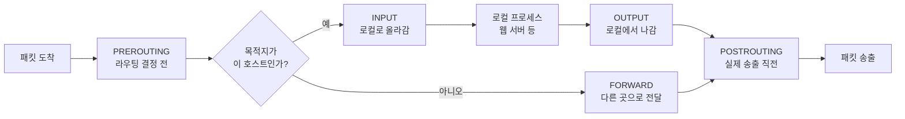
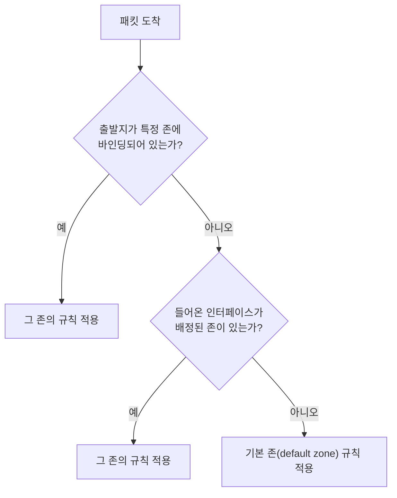

<Callout type="info">
  **이번 문서의 목표:** 패킷이 커널 안에서 어느 지점을 통과하며 검사받는지 그릴 수 있고, `iptables -A INPUT -s 주소 -j DROP` 같은 명령의 각 조각이 무엇을 정하는지, `-P`와 `-A`가 왜 문법이 다른지 설명할 수 있게 된다.
</Callout>

## 방화벽은 어디에 서 있는가

방화벽이라고 하면 서버 앞에 놓인 별도의 장비를 떠올리기 쉽지만, 리눅스의 방화벽은 **커널 네트워크 스택 안의 검문소**입니다. 별도 프로그램이 아니라 커널 기능이고, `iptables`나 `nft` 같은 명령은 그 검문소에 붙일 규칙을 등록하는 도구일 뿐입니다.

이 사실을 알면 헷갈리는 것 하나가 정리됩니다. **`iptables` 명령을 종료해도 규칙은 남아 있습니다.** 규칙은 커널 메모리에 있으니까요. 반대로 재부팅하면 규칙이 사라집니다. 메모리에만 있었으니까요. 그래서 `iptables-save`로 파일에 저장하고 부팅 시 복원하는 절차가 필요합니다.

> **쉽게 말하면:** netfilter는 도로 곳곳에 설치된 검문소이고, iptables는 검문소에 "이런 차는 돌려보내라"는 지시서를 붙이는 사람입니다.

## 1. netfilter — 커널 안의 다섯 검문소

**netfilter**(넷필터)는 리눅스 커널의 패킷 처리 경로에 마련된 **훅**(hook, 갈고리) 지점들의 이름입니다. 패킷이 이 지점을 지날 때마다 등록된 규칙이 실행됩니다. 훅은 다섯 개입니다.



| 훅 | 통과하는 패킷 |
|----|----------------|
| `PREROUTING` | 들어온 모든 패킷, 목적지 판단 **이전** |
| `INPUT` | 이 호스트가 최종 목적지인 패킷 |
| `FORWARD` | 이 호스트를 거쳐 다른 곳으로 가는 패킷 |
| `OUTPUT` | 이 호스트가 만들어 내보내는 패킷 |
| `POSTROUTING` | 나가는 모든 패킷, 송출 **직전** |

가장 흔한 오해가 "서버에 들어오는 패킷은 다 INPUT을 지난다"는 것입니다. 아닙니다. **목적지가 이 호스트일 때만** INPUT이고, 라우터 역할을 할 때 지나가는 패킷은 FORWARD입니다. 그래서 IP 공유기 설정에서 막히는 곳은 대개 FORWARD입니다.

## 2. iptables — 테이블과 체인

### 구조: 테이블 안에 체인, 체인 안에 규칙

`iptables`는 **테이블**(table) → **체인**(chain) → **규칙**(rule)의 3단 구조입니다.

- **테이블**은 "무슨 목적의 규칙인가"로 나눈 묶음입니다.
- **체인**은 "어느 훅에서 검사하는가"입니다.
- **규칙**은 "어떤 패킷을 어떻게 처리할지"입니다.

| 테이블 | 목적 | 사용 가능한 체인 |
|--------|------|------------------|
| `filter` | **허용·차단** (기본 테이블) | INPUT, FORWARD, OUTPUT |
| `nat` | 주소 변환(공유기, 포트 포워딩) | PREROUTING, POSTROUTING, OUTPUT |
| `mangle` | 패킷 헤더 값 변경(TOS, TTL 등) | 다섯 체인 전부 |
| `raw` | 연결 추적 제외 지정 | PREROUTING, OUTPUT |

**`-t` 옵션을 생략하면 `filter` 테이블**입니다. 그래서 평소 쓰는 `iptables -L`은 사실 `iptables -t filter -L`입니다. NAT 규칙을 보려면 `iptables -t nat -L PREROUTING`처럼 명시해야 합니다.

### 명령 구조 해부

```bash
iptables -A INPUT -p tcp --dport 22 -s 192.168.1.0/24 -j ACCEPT
```

이 한 줄을 조각내 봅시다.

| 조각 | 분류 | 의미 |
|------|------|------|
| `-A INPUT` | 명령 | INPUT 체인에 **추가**(Append) |
| `-p tcp` | 매칭 | 프로토콜이 TCP인 패킷 |
| `--dport 22` | 매칭 | 목적지 포트가 22 |
| `-s 192.168.1.0/24` | 매칭 | 출발지가 이 대역 |
| `-j ACCEPT` | 타깃 | 조건에 맞으면 허용 |

명령 옵션은 이렇습니다.

| 옵션 | 의미 |
|------|------|
| `-A 체인` | 체인 **끝에** 규칙 추가 |
| `-I 체인 [번호]` | 체인 **앞에**(또는 지정 위치에) 삽입 |
| `-D 체인 번호` | 규칙 삭제 |
| `-R 체인 번호` | 규칙 교체 |
| `-L` | 규칙 목록 출력 |
| `-F 체인` | 체인의 규칙 전부 비우기(flush) |
| `-P 체인 타깃` | 체인의 **기본 정책** 설정 |
| `-N 이름` | 사용자 정의 체인 생성 |

출력 보조 옵션으로 `-n`(이름 변환 없이 숫자로), `-v`(자세히), `--line-numbers`(규칙 번호 표시)가 있습니다. `iptables -nL INPUT --line-numbers`는 삭제할 규칙 번호를 찾을 때 쓰는 실무 조합입니다.

매칭 조건은 다음과 같습니다.

| 옵션 | 의미 |
|------|------|
| `-s 주소` | 출발지 IP 또는 대역 |
| `-d 주소` | 목적지 IP 또는 대역 |
| `-p tcp/udp/icmp` | 프로토콜 |
| `--sport` / `--dport` | 출발지 / 목적지 포트 |
| `-i 인터페이스` | 들어온 인터페이스(INPUT, FORWARD, PREROUTING에서만) |
| `-o 인터페이스` | 나가는 인터페이스(OUTPUT, FORWARD, POSTROUTING에서만) |
| `-m state --state` | 연결 상태 매칭 |
| `!` | 조건 부정(예: `! -s 10.0.0.1`) |

타깃(`-j` 뒤에 오는 것)은 이렇습니다.

| 타깃 | 동작 |
|------|------|
| `ACCEPT` | 통과시킨다 |
| `DROP` | **조용히 버린다**(응답 없음) |
| `REJECT` | 버리되 거부 응답을 보낸다 |
| `LOG` | 로그만 남기고 다음 규칙으로 계속 |
| `SNAT` | 출발지 주소 변환(POSTROUTING) |
| `DNAT` | 목적지 주소 변환(PREROUTING) |
| `MASQUERADE` | 출발지를 나가는 인터페이스 주소로(동적 IP용) |

`DROP`과 `REJECT`의 차이는 실무에서 중요합니다. `DROP`은 상대가 타임아웃까지 기다리므로 스캐너를 지연시키지만, 정상 사용자에게도 "먹통"으로 느껴집니다. `REJECT`는 즉시 "거부됐다"를 알려 줍니다.

### 문법 함정 — -P에는 -j를 쓰지 않는다

시험에서 가장 자주 나오는 문법 오류 문제입니다.

```bash
iptables -A INPUT -s 192.168.5.4 -j DROP     # 정상: 규칙 추가에는 -j 필요
iptables -P INPUT DROP                        # 정상: 정책 설정에는 -j 없음
iptables -P INPUT -j DROP                     # 오류: -P 뒤에는 타깃을 바로 쓴다
```

이유는 구조에 있습니다. `-A`는 "**조건에 맞으면**(match) **이렇게 하라**(jump)"는 규칙을 만드는 것이라 `-j`(jump)가 필요합니다. `-P`는 조건이 없습니다. "아무 규칙에도 안 걸린 패킷은 이렇게 하라"는 최종 처리 방침이므로 점프할 대상이 아니라 **정책 값 자체**를 씁니다. 게다가 기본 정책에는 `ACCEPT`와 `DROP`만 지정할 수 있고 `REJECT`는 쓸 수 없습니다.

### 규칙 순서 — 위에서부터, 처음 걸리는 것으로 끝

체인 안의 규칙은 **위에서부터 차례로** 검사되고, 처음 일치한 규칙의 타깃이 적용되면 그 체인에서의 검사는 끝납니다(`LOG` 같은 예외는 계속 진행). 그래서 순서가 잘못되면 뒤의 규칙이 영원히 실행되지 않습니다.

```bash
iptables -A INPUT -j DROP                          # (1) 전부 버림
iptables -A INPUT -p tcp --dport 22 -j ACCEPT      # (2) 절대 도달하지 않음
```

이런 실수를 피하려면 **구체적인 허용 규칙을 앞에, 포괄적인 차단을 뒤에** 두거나, 차단은 규칙이 아니라 기본 정책(`-P`)으로 처리합니다. 이미 잘못 넣었다면 `-I`로 앞에 삽입해 바로잡습니다.

### 상태 추적 — 응답 패킷은 어떻게 돌아오는가

INPUT을 전부 막으면 내가 보낸 요청의 응답도 못 들어옵니다. 그래서 **연결 추적**(connection tracking)을 씁니다.

```bash
iptables -A INPUT -m state --state ESTABLISHED,RELATED -j ACCEPT
```

| 상태 | 의미 |
|------|------|
| `NEW` | 새로 시작하는 연결 |
| `ESTABLISHED` | 이미 성립된 연결에 속한 패킷 |
| `RELATED` | 기존 연결과 관련된 새 연결(FTP 데이터 채널 등) |
| `INVALID` | 어디에도 속하지 않는 이상한 패킷 |

이 규칙 한 줄을 맨 앞에 두면 "내가 시작한 통신의 응답은 전부 허용"이 되어, 나머지는 필요한 서비스만 열면 됩니다. 이것이 현대 방화벽 설정의 기본 뼈대입니다.

### NAT 설정 예

사설망을 인터넷에 공유하는 최소 구성입니다.

```bash
sysctl -w net.ipv4.ip_forward=1
iptables -t nat -A POSTROUTING -s 192.168.0.0/24 -o eth0 -j MASQUERADE
iptables -A FORWARD -i eth1 -o eth0 -j ACCEPT
```

포워딩 커널 파라미터를 켜지 않으면 규칙이 아무리 완벽해도 패킷이 넘어가지 않습니다. **방화벽 규칙과 커널 포워딩은 별개**라는 점이 통합 문제의 단골 함정입니다.

### 규칙 저장과 복원

```bash
iptables-save > /etc/sysconfig/iptables      # 현재 규칙을 파일로
iptables-restore < /etc/sysconfig/iptables   # 파일에서 복원
```

RHEL 계열에서는 `iptables-services` 패키지를 설치하면 `service iptables save`로 저장하고 부팅 시 자동 복원합니다.

## 3. nftables — 넷필터가 내놓은 통합 후계자

### 왜 새로 만들었는가

문제는 도구가 넷으로 쪼개져 있다는 것이었습니다. IPv4는 `iptables`, IPv6는 `ip6tables`, ARP는 `arptables`, 이더넷 브리지는 `ebtables`. 문법도 내부 구현도 제각각이라 같은 정책을 네 번 써야 했습니다.

**nftables**는 netfilter 프로젝트가 이 넷을 **하나의 프레임워크로 대체**하려고 만든 것입니다. 명령은 `nft` 하나입니다.

### 구조 비교

| 항목 | iptables | nftables |
|------|----------|----------|
| 명령 | `iptables`, `ip6tables`, `arptables`, `ebtables` | `nft` 하나 |
| 테이블 | 미리 정해진 filter, nat, mangle, raw | **사용자가 이름과 주소 계열을 정해 생성** |
| 체인 | 테이블마다 고정된 내장 체인 | **사용자가 훅과 우선순위를 지정해 생성** |
| 기본 규칙 | 체인마다 기본 정책 존재 | 체인 생성 시 정책 지정 |
| 다중 조건 | 규칙을 여러 줄로 | **집합(set)과 맵으로 한 줄에** |
| 카운터 | 항상 존재 | 필요할 때만 지정 |

```bash
nft add table inet myfilter
nft add chain inet myfilter input { type filter hook input priority 0 \; policy drop \; }
nft add rule inet myfilter input tcp dport { 22, 80, 443 } accept
```

셋째 줄에서 포트 세 개를 중괄호 집합으로 한 번에 지정한 것이 nftables의 대표적인 개선점입니다. iptables였다면 세 줄이 필요합니다. `inet`이라는 주소 계열은 IPv4와 IPv6를 **동시에** 처리한다는 뜻입니다.

시험에서는 "iptables, ip6tables, arptables, ebtables를 대체하기 위해 netfilter 프로젝트가 새로 만든 것"이라는 설명으로 나옵니다. 답은 `nftables`입니다. `firewall-cmd`는 firewalld의 명령이고, `ipchains`는 iptables 이전 세대이며, `lokkit`은 RHEL 6 시절의 설정 도구입니다.

## 4. firewalld — 존 기반의 동적 관리자

### 무엇이 달라졌는가

iptables에는 구조적 불편이 있었습니다. 규칙을 하나 바꾸려면 전체를 다시 적용해야 했고, 그 순간 **연결이 끊어졌습니다.** 또 "SSH를 열어라"를 하려면 포트 번호를 알아야 했습니다.

**firewalld**는 그 위에 얹힌 관리 계층입니다. 규칙을 **동적으로 변경**하고, 포트 대신 **서비스 이름**으로 다루며, 인터페이스를 **존**(zone)에 배정해 신뢰 수준별로 정책을 묶습니다. 뒤에서 실제로 커널에 규칙을 넣는 것은 여전히 nftables(구버전은 iptables)입니다.

### 존 — 신뢰 수준의 묶음



| 존 | 기본 성격 |
|----|-----------|
| `drop` | 들어오는 것 전부 폐기, 응답 없음 |
| `block` | 들어오는 것 거부, 거부 응답 전송 |
| `public` | **기본 존.** 신뢰하지 않는 공용망. 지정한 서비스만 허용 |
| `external` | 외부망. 마스커레이드 활성 |
| `dmz` | 제한적 공개 서버 구역 |
| `work` / `home` / `internal` | 신뢰도가 높은 내부망 |
| `trusted` | **전부 허용** |

인터페이스 하나는 한 번에 하나의 존에만 속합니다. 존을 이해하면 "같은 규칙을 넣었는데 왜 적용이 안 되지"라는 상황이 풀립니다. 규칙을 넣은 존과 인터페이스가 속한 존이 다른 것입니다.

### firewall-cmd 주요 사용법

| 명령 | 의미 |
|------|------|
| `firewall-cmd --state` | 실행 여부 확인 |
| `firewall-cmd --get-default-zone` | 기본 존 확인 |
| `firewall-cmd --list-all` | 현재 존의 전체 설정 |
| `firewall-cmd --add-service=http` | HTTP 서비스 허용(임시) |
| `firewall-cmd --add-port=8080/tcp` | 포트 직접 허용(임시) |
| `firewall-cmd --permanent --add-service=https` | **영구 설정** |
| `firewall-cmd --reload` | 영구 설정을 현재에 반영 |
| `firewall-cmd --zone=public --add-interface=eth0` | 인터페이스를 존에 배정 |

여기 반드시 알아야 할 함정이 있습니다. **`--permanent`를 붙이면 설정 파일에만 기록되고 지금 당장은 적용되지 않습니다.** 반대로 안 붙이면 지금은 적용되지만 재시작하면 사라집니다. 그래서 실무 절차는 **`--permanent`로 넣고 `--reload`로 반영**하는 두 단계입니다.

서비스 정의는 `/usr/lib/firewalld/services/*.xml`에 있고, 사용자 정의는 `/etc/firewalld/services/`에 둡니다. `--add-service=http`가 80번을 여는 것은 이 XML에 포트가 적혀 있기 때문입니다.

### 세 세대 비교

| 항목 | iptables | nftables | firewalld |
|------|----------|----------|-----------|
| 위치 | 커널 규칙 직접 조작 | 커널 규칙 직접 조작 | 상위 관리 도구(백엔드로 nftables 사용) |
| 단위 | 테이블·체인·규칙 | 테이블·체인·규칙(사용자 정의) | 존·서비스 |
| 변경 시 | 전체 재적용, 연결 끊김 | 원자적 갱신 지원 | **동적 변경, 연결 유지** |
| 영구 저장 | `iptables-save` 별도 필요 | `nft list ruleset` 저장 | `--permanent` 옵션 |
| 주 사용 배포판 | 전 배포판(구세대) | 현대 배포판 기본 | RHEL 7 이상 기본 |

세 가지를 **동시에 켜 두면 안 됩니다.** 서로 같은 커널 자원을 두고 규칙을 덮어써 예측 불가능해집니다. RHEL 계열에서 iptables를 직접 쓰려면 firewalld를 중지하고 `iptables-services`를 쓰는 것이 원칙입니다.

## 핵심 정리

- netfilter의 훅은 PREROUTING, INPUT, FORWARD, OUTPUT, POSTROUTING 다섯이며, 목적지가 이 호스트인 패킷만 INPUT을 지난다.
- iptables는 테이블(filter·nat·mangle·raw) 안에 체인, 체인 안에 규칙 구조이고 `-t`를 생략하면 filter다.
- 규칙 추가에는 `-j` 타깃이 필요하지만 기본 정책 설정은 `iptables -P INPUT DROP`처럼 `-j` 없이 쓴다. 규칙은 위에서부터 처음 일치하는 것이 적용된다.
- nftables는 iptables·ip6tables·arptables·ebtables를 하나의 `nft` 명령으로 통합한 후계 프레임워크다.
- firewalld는 존과 서비스 단위로 동적 관리를 제공하며, `--permanent`로 넣은 설정은 `--reload` 해야 현재 세션에 반영된다.

## 마무리 복습

<Quiz
  questionNumber={1}
  question="다음 중 iptables 명령의 사용법으로 틀린 것은?"
  options={['iptables -nL INPUT', 'iptables -A INPUT -s 192.168.5.4 -j DROP', 'iptables -P INPUT -j DROP', 'iptables -t nat -L PREROUTING']}
  correctAnswer={3}
  explanation="-P 는 체인의 기본 정책을 지정하는 옵션으로 조건 매칭이 없기 때문에 점프를 뜻하는 -j 를 쓰지 않는다. 올바른 문법은 iptables -P INPUT DROP 이다. 반면 -A 로 규칙을 추가할 때는 조건에 맞으면 어디로 보낼지 정해야 하므로 -j 가 반드시 필요하다."
  optionExplanations={['정상이다. -n 은 숫자 표시, -L 은 목록 출력이다.', '정상이다. 조건과 -j 타깃이 모두 갖춰져 있다.', '정답. -P 뒤에는 -j 없이 정책 값을 바로 쓴다.', '정상이다. nat 테이블의 PREROUTING 체인 목록을 본다.']}
/>

<Quiz
  questionNumber={2}
  question="iptables, ip6tables, arptables, ebtables를 하나로 대체하기 위해 netfilter 프로젝트가 새로 만든 방화벽 프레임워크는?"
  options={['nftables', 'lokkit', 'ipchains', 'firewall-cmd']}
  correctAnswer={1}
  explanation="nftables는 네 갈래로 나뉘어 있던 패킷 필터링 도구를 nft 라는 단일 명령과 단일 프레임워크로 통합하기 위해 netfilter 프로젝트가 개발했다. 주소 계열을 inet 으로 지정하면 IPv4와 IPv6를 한 규칙으로 처리할 수 있다."
  optionExplanations={['정답. nftables가 통합 후계 프레임워크다.', 'lokkit은 예전 RHEL의 간이 방화벽 설정 도구다.', 'ipchains는 iptables 이전 세대의 필터링 도구다.', 'firewall-cmd는 firewalld를 조작하는 명령으로 별도 프레임워크가 아니다.']}
/>

<Quiz
  questionNumber={3}
  question="리눅스 라우터를 거쳐 다른 네트워크로 전달되는 패킷이 검사받는 netfilter 체인은?"
  options={['INPUT', 'OUTPUT', 'FORWARD', 'POSTROUTING만 통과하고 다른 체인은 거치지 않는다']}
  correctAnswer={3}
  explanation="라우팅 결정 결과 목적지가 이 호스트가 아니면 패킷은 INPUT이 아니라 FORWARD 체인을 지난다. INPUT은 이 호스트가 최종 목적지인 패킷만, OUTPUT은 이 호스트가 생성한 패킷만 통과한다. 통과 패킷은 PREROUTING, FORWARD, POSTROUTING 순으로 지난다."
  optionExplanations={['INPUT은 목적지가 자기 자신인 패킷만 지난다.', 'OUTPUT은 로컬 프로세스가 만들어 내보내는 패킷이 지난다.', '정답. 통과 패킷은 FORWARD 체인에서 검사된다.', 'POSTROUTING만 지나는 것이 아니라 PREROUTING과 FORWARD도 함께 지난다.']}
/>

<Quiz
  questionNumber={4}
  question="firewalld에서 firewall-cmd --permanent --add-service=http 를 실행했으나 웹 접속이 여전히 차단된다. 원인으로 가장 알맞은 것은?"
  options={['서비스 이름이 아니라 포트 번호로만 지정할 수 있기 때문', '--permanent 로 넣은 설정은 --reload 를 해야 현재 설정에 반영되기 때문', 'firewalld는 http 서비스를 지원하지 않기 때문', '--permanent 옵션은 재부팅 후에도 적용되지 않기 때문']}
  correctAnswer={2}
  explanation="--permanent 는 영구 설정 파일에만 기록하고 실행 중인 설정에는 반영하지 않는다. 즉시 적용하려면 firewall-cmd --reload 로 영구 설정을 다시 읽어 들이거나, --permanent 없이 한 번 더 실행해 현재 설정에도 추가해야 한다."
  optionExplanations={['firewalld는 서비스 이름 지정을 기본으로 제공하며 XML 정의에서 포트를 읽는다.', '정답. 영구 설정과 현재 설정은 분리되어 있어 reload가 필요하다.', 'http는 기본 제공 서비스 정의에 포함되어 있다.', '--permanent 는 오히려 재부팅 후에도 유지되게 하는 옵션이다.']}
/>

<Quiz
  questionNumber={5}
  question="iptables의 DROP 타깃과 REJECT 타깃의 차이로 알맞은 것은?"
  options={['DROP은 로그를 남기고 REJECT는 남기지 않는다', 'DROP은 응답 없이 패킷을 버리고 REJECT는 거부 응답을 보낸다', 'DROP은 filter 테이블에서만, REJECT는 nat 테이블에서만 쓸 수 있다', '둘은 동작이 같고 이름만 다르다']}
  correctAnswer={2}
  explanation="DROP은 패킷을 아무 응답 없이 폐기하므로 송신 측은 타임아웃까지 기다리게 된다. REJECT는 ICMP 도달 불가 메시지나 TCP RST 같은 거부 응답을 보내 즉시 실패를 알린다. 기본 정책에는 REJECT를 쓸 수 없다는 점도 함께 기억해야 한다."
  optionExplanations={['로그 기록은 별도의 LOG 타깃이 담당하며 두 타깃 모두 자동으로 로그를 남기지 않는다.', '정답. 응답을 보내는지가 결정적인 차이다.', '두 타깃 모두 filter 테이블에서 사용하며 테이블 제한이 그런 식으로 나뉘지 않는다.', '송신 측이 겪는 결과가 완전히 다르다.']}
/>

<Quiz
  questionNumber={6}
  question="다음 두 규칙을 순서대로 적용했을 때의 결과로 알맞은 것은? 첫째 iptables -A INPUT -j DROP, 둘째 iptables -A INPUT -p tcp --dport 22 -j ACCEPT"
  options={['22번 포트만 허용되고 나머지는 차단된다', '모든 접속이 차단되며 22번 허용 규칙은 적용되지 않는다', '두 규칙이 충돌해 오류가 발생한다', '나중에 추가한 규칙이 우선하므로 22번이 허용된다']}
  correctAnswer={2}
  explanation="체인 안의 규칙은 위에서부터 순서대로 검사되고 처음 일치하는 규칙에서 처리가 끝난다. 첫 규칙이 조건 없이 모든 패킷을 DROP 하므로 그 아래 규칙에는 어떤 패킷도 도달하지 못한다. 이럴 때는 -I 옵션으로 허용 규칙을 앞에 삽입하거나 포괄 차단을 기본 정책으로 처리해야 한다."
  optionExplanations={['허용 규칙이 뒤에 있어 도달하지 못하므로 22번도 차단된다.', '정답. 순서 때문에 두 번째 규칙이 무력화된다.', '문법상 오류는 없으며 정상적으로 등록된다.', 'iptables는 나중 규칙이 우선하지 않고 앞선 규칙이 우선한다.']}
/>

<Quiz
  questionNumber={7}
  question="firewalld의 존(zone)에 대한 설명으로 옳지 않은 것은?"
  options={['trusted 존은 들어오는 모든 연결을 허용한다', 'drop 존은 들어오는 패킷을 응답 없이 폐기한다', '하나의 인터페이스를 여러 존에 동시에 배정해 규칙을 합칠 수 있다', '기본 존은 일반적으로 public 이다']}
  correctAnswer={3}
  explanation="인터페이스는 한 번에 하나의 존에만 배정된다. 여러 존에 동시에 속할 수 없으며, 다른 존의 규칙을 적용하려면 인터페이스를 그 존으로 옮겨야 한다. 규칙을 넣은 존과 인터페이스가 속한 존이 달라 설정이 안 먹는 상황이 자주 발생한다."
  optionExplanations={['맞는 설명이다. trusted는 모든 연결을 신뢰한다.', '맞는 설명이다. block과 달리 거부 응답조차 보내지 않는다.', '정답. 이 설명이 틀렸다. 인터페이스는 하나의 존에만 속한다.', '맞는 설명이다. 대부분의 배포판에서 기본 존은 public 이다.']}
/>

<Quiz
  questionNumber={8}
  question="사설망 192.168.0.0/24 를 eth0 을 통해 인터넷에 공유하려고 한다. 반드시 함께 수행해야 하는 작업으로 알맞은 것은?"
  options={['nat 테이블 POSTROUTING 에 MASQUERADE 규칙을 넣고 커널의 ip_forward 를 활성화한다', 'filter 테이블 INPUT 에 ACCEPT 규칙만 추가하면 된다', 'mangle 테이블에서 TTL 값을 1 증가시킨다', 'raw 테이블에서 연결 추적을 비활성화한다']}
  correctAnswer={1}
  explanation="주소 변환은 nat 테이블의 POSTROUTING 체인에서 MASQUERADE 또는 SNAT로 처리한다. 그러나 규칙만으로는 부족하고, 자신이 목적지가 아닌 패킷을 다른 인터페이스로 넘기려면 커널 파라미터 net.ipv4.ip_forward 가 1이어야 한다. 이 둘은 별개의 설정이다."
  optionExplanations={['정답. NAT 규칙과 커널 포워딩 활성화가 모두 필요하다.', 'INPUT은 자기 자신이 목적지인 패킷용이라 통과 트래픽에 관여하지 않는다.', 'TTL 조작은 공유와 무관하며 오히려 문제를 일으킬 수 있다.', '연결 추적을 끄면 상태 기반 NAT가 동작하지 못한다.']}
/>

## 참고 자료

- [iptables(8) 매뉴얼 페이지 (man7.org)](https://man7.org/linux/man-pages/man8/iptables.8.html)
- [nftables 공식 위키 (netfilter.org)](https://wiki.nftables.org/wiki-nftables/index.php/Main_Page)
- [firewalld 공식 문서 (firewalld.org)](https://firewalld.org/documentation/)
- [Red Hat Enterprise Linux 9 – Using and configuring firewalld (docs.redhat.com)](https://docs.redhat.com/en/documentation/red_hat_enterprise_linux/9/html/configuring_firewalls_and_packet_filters/using-and-configuring-firewalld_firewall-packet-filters)
- [netfilter 프로젝트 홈페이지 (netfilter.org)](https://www.netfilter.org/)
