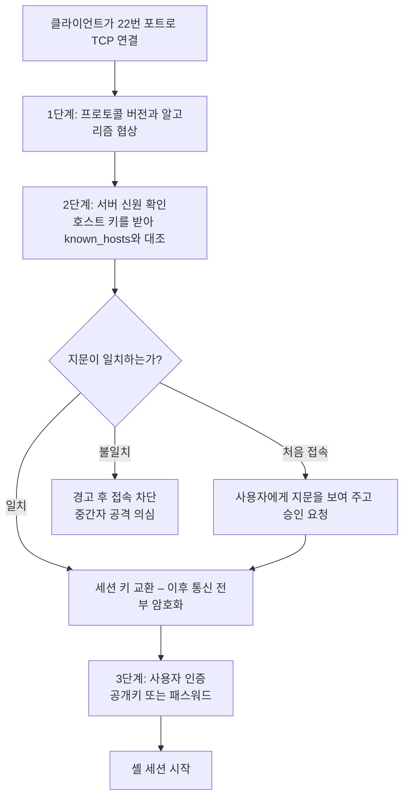
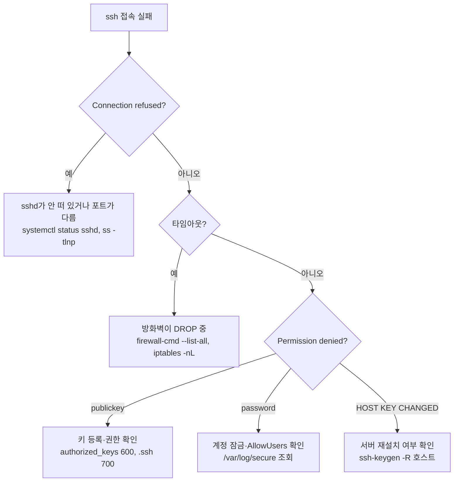

<Callout type="info">
  **이번 문서의 목표:** 처음 접속할 때 나오는 지문(fingerprint) 확인 메시지가 무엇을 막는 장치인지 설명할 수 있고, 공개키 인증에서 어느 키가 어느 쪽에 있어야 하는지 헷갈리지 않게 된다.
</Callout>

## 왜 SSH가 필요했는가

원격지 서버에 접속하는 일은 유닉스 시절부터 있었습니다. `telnet`, `rlogin`, `rsh`, `rcp` 같은 도구들이 그 역할을 했습니다. 문제는 **이들이 모든 것을 평문으로 보냈다**는 것입니다. 아이디도, 패스워드도, 입력한 명령어도, 화면에 나온 결과도 전부 그대로 흘렀습니다.

같은 네트워크에 있는 누군가가 패킷을 들여다보면(스니핑, sniffing) root 패스워드가 그대로 보입니다. 게다가 `rsh` 계열은 `.rhosts` 파일에 적힌 호스트를 **패스워드 없이 믿었기 때문에**, IP를 위조하면 그대로 뚫렸습니다.

**SSH**(Secure Shell, 보안 셸)는 이 문제를 정면으로 겨냥합니다. 1995년 핀란드의 타투 윌뢰넨(Tatu Ylönen)이 만들었고, 현재 리눅스에서 널리 쓰이는 구현은 OpenBSD 프로젝트가 만든 **OpenSSH**입니다.

| 항목 | Telnet / rsh | SSH |
|------|--------------|-----|
| 기본 포트 | 23 / 514 | **22** |
| 전송 내용 | 평문 | 암호화 |
| 서버 신원 확인 | 없음 | 호스트 키로 검증 |
| 인증 방식 | 패스워드 또는 호스트 신뢰 | 패스워드, 공개키, 기타 다수 |
| 부가 기능 | 없음 | 파일 전송, 포트 포워딩, X11 전달 |

> **쉽게 말하면:** Telnet은 엽서, SSH는 봉인된 등기우편입니다. 게다가 SSH는 우체부가 진짜 그 사람이 맞는지도 확인합니다.

## 1. 접속할 때 실제로 벌어지는 일

SSH 접속은 크게 세 단계로 진행됩니다. 이 순서를 알면 오류 메시지의 의미가 대부분 풀립니다.



### 2단계 — 호스트 키와 known_hosts

암호화만으로는 부족합니다. **암호화된 통로를 만들었는데 그 상대가 가짜라면** 아무 소용이 없기 때문입니다. 중간에 끼어든 공격자와 안전하게 통신하는 셈이 됩니다. 이것이 **중간자 공격**(MITM, Man-In-The-Middle)입니다.

그래서 SSH 서버는 자기만의 **호스트 키**(host key) 쌍을 가집니다. 개인키는 `/etc/ssh/ssh_host_*_key`에, 공개키는 `/etc/ssh/ssh_host_*_key.pub`에 있습니다. 접속할 때 서버는 공개키를 보내고, 그 키로만 풀 수 있는 방식으로 자기가 개인키 소유자임을 증명합니다.

클라이언트는 받은 공개키를 `~/.ssh/known_hosts`에 저장해 두고, 다음 접속 때 같은 키인지 대조합니다.

```
The authenticity of host 'server (192.168.1.10)' can't be established.
ED25519 key fingerprint is SHA256:aB3dEf...
Are you sure you want to continue connecting (yes/no)?
```

처음 접속할 때 나오는 이 메시지는 "**나는 이 서버를 처음 보므로 진짜인지 판단할 수 없다. 당신이 확인하라**"는 뜻입니다. 원칙대로라면 서버 관리자에게 지문 값을 미리 받아 대조해야 합니다.

반대로 이미 저장된 키와 다른 키가 오면 이렇게 경고합니다.

```
WARNING: REMOTE HOST IDENTIFICATION HAS CHANGED!
IT IS POSSIBLE THAT SOMEONE IS DOING SOMETHING NASTY!
```

이 경고가 나오는 흔한 원인은 두 가지입니다. 실제로 공격을 받고 있거나, **서버를 재설치해 호스트 키가 새로 생성되었거나.** 후자라면 `ssh-keygen -R 호스트명`으로 옛 항목을 지우고 다시 접속하면 됩니다. 무턱대고 known_hosts를 통째로 지우는 것은 검증 장치를 스스로 버리는 일이므로 권장되지 않습니다.

### 3단계 — 사용자 인증

이제 통로는 안전합니다. 남은 것은 "당신이 이 계정의 주인이 맞는가"입니다. 방법이 여럿이고, `sshd_config`의 설정 순서대로 시도됩니다.

## 2. 공개키 인증 — 어느 키가 어디에 있어야 하는가

### 비대칭 키의 원리

공개키 암호는 **한 쌍으로 만들어진 두 개의 키**를 씁니다. 하나로 잠근 것은 다른 하나로만 열립니다.

- **개인키**(private key): 나만 가진다. **절대 밖으로 나가면 안 된다.**
- **공개키**(public key): 누구에게나 줘도 된다.

이 성질에서 인증이 나옵니다. 서버가 "이 무작위 값에 서명해 보라"고 하고, 클라이언트가 개인키로 서명해 보내면, 서버는 등록된 공개키로 그 서명이 맞는지 확인합니다. **개인키 자체는 한 번도 네트워크를 건너지 않습니다.** 패스워드 인증과 결정적으로 다른 점입니다.

> **쉽게 말하면:** 공개키는 자물쇠, 개인키는 열쇠입니다. 자물쇠는 서버에 미리 걸어 두고, 열쇠는 내가 들고 다니며 그 자리에서 열어 보입니다.

### 설정 절차

<Steps>
1. **클라이언트에서 키 쌍 생성**: `ssh-keygen -t ed25519` 또는 `ssh-keygen -t rsa -b 4096`. 결과는 `~/.ssh/id_ed25519`(개인키)와 `~/.ssh/id_ed25519.pub`(공개키)입니다.
2. **암호구절 설정**: 키 생성 중 물어보는 passphrase는 개인키 파일 자체를 암호화합니다. 노트북을 잃어버려도 개인키를 바로 못 쓰게 하는 마지막 방어선입니다.
3. **공개키를 서버에 등록**: `ssh-copy-id user@server`를 쓰면 자동으로 서버의 `~/.ssh/authorized_keys`에 추가됩니다. 수동으로 하려면 공개키 내용을 그 파일에 한 줄로 붙여 넣습니다.
4. **권한 확인**: 서버의 `~/.ssh`는 700, `authorized_keys`는 600이어야 합니다. 권한이 느슨하면 sshd가 **조용히 키 인증을 거부**합니다.
</Steps>

권한 문제는 가장 흔한 실패 원인입니다. 이유는 명확합니다. `authorized_keys`가 다른 사용자에게 쓰기 가능하면, 그 사람이 자기 공개키를 몰래 추가해 이 계정으로 로그인할 수 있기 때문입니다. sshd는 그런 위험한 상태를 아예 신뢰하지 않습니다.

### 파일 정리

| 위치 | 파일 | 역할 |
|------|------|------|
| 클라이언트 | `~/.ssh/id_rsa` | 내 개인키 |
| 클라이언트 | `~/.ssh/id_rsa.pub` | 내 공개키 |
| 클라이언트 | `~/.ssh/known_hosts` | 접속했던 **서버들의 공개키** |
| 클라이언트 | `~/.ssh/config` | 호스트별 접속 설정 |
| **서버** | `~/.ssh/authorized_keys` | **접속을 허용할 사용자들의 공개키** |
| 서버 | `/etc/ssh/sshd_config` | 서버 데몬 설정 |
| 서버 | `/etc/ssh/ssh_host_*_key` | 서버의 호스트 개인키 |

혼동하기 쉬운 두 파일을 다시 짚습니다. **`known_hosts`는 "내가 아는 서버들"의 목록**이고, **`authorized_keys`는 "이 계정에 들어와도 되는 사람들"의 목록**입니다. 전자는 클라이언트 쪽, 후자는 서버 쪽에 있습니다.

또 하나. `/etc/ssh/ssh_config`(클라이언트 기본 설정)와 `/etc/ssh/sshd_config`(서버 데몬 설정)는 **글자 하나 차이**입니다. `d`가 붙은 쪽이 데몬, 즉 서버 설정입니다. 시험에서 이 한 글자로 정답을 가릅니다.

## 3. sshd_config 주요 옵션

서버 동작을 결정하는 파일입니다. 수정 후에는 `systemctl restart sshd`로 반영합니다.

| 옵션 | 기본값(대체로) | 의미 |
|------|----------------|------|
| `Port 22` | 22 | 대기 포트. 여러 줄로 다중 포트 가능 |
| `ListenAddress` | 모든 주소 | 특정 IP에서만 대기 |
| `PermitRootLogin` | `prohibit-password` | root 직접 로그인 허용 여부 |
| `PasswordAuthentication` | `yes` | 패스워드 인증 허용 여부 |
| `PubkeyAuthentication` | `yes` | 공개키 인증 허용 여부 |
| `AuthorizedKeysFile` | `.ssh/authorized_keys` | 공개키 목록 파일 경로 |
| `PermitEmptyPasswords` | `no` | 빈 패스워드 허용 여부 |
| `MaxAuthTries` | 6 | 인증 시도 횟수 제한 |
| `LoginGraceTime` | 120 | 인증 완료까지 허용 시간(초) |
| `AllowUsers` / `DenyUsers` | 없음 | 접속 허용·거부 사용자 목록 |
| `AllowGroups` / `DenyGroups` | 없음 | 그룹 단위 제어 |
| `X11Forwarding` | 배포판마다 다름 | 원격 GUI 전달 허용 |
| `Protocol` | 2 | 프로토콜 버전. **1은 취약해 폐기됨** |
| `UseDNS` | `no` | 접속자 IP의 역방향 조회 수행 여부 |

### 보안 강화의 정석

실무에서 권장되는 조합은 다음과 같습니다.

```
Port 2222
PermitRootLogin no
PasswordAuthentication no
PubkeyAuthentication yes
PermitEmptyPasswords no
AllowUsers deploy admin
MaxAuthTries 3
```

각 줄의 이유를 붙여 봅시다.

- **포트 변경**은 근본 대책이 아니라 **자동화된 대량 스캔을 줄이는 잡음 제거**입니다. 이것만 믿으면 안 됩니다. 그리고 SELinux가 켜진 시스템에서는 `semanage port -a -t ssh_port_t -p tcp 2222`로 포트를 등록해야 sshd가 뜹니다.
- **root 직접 로그인 차단**은 "누가 무엇을 했는지"를 남기기 위해서이기도 합니다. 개인 계정으로 들어와 `sudo`를 쓰면 로그에 실명이 남습니다.
- **패스워드 인증 끄기**가 가장 강력합니다. 무차별 대입(brute force) 공격의 표적 자체가 사라집니다. 단, 키를 잃어버리면 못 들어가므로 반드시 먼저 키 인증이 되는지 확인한 뒤 꺼야 합니다.

`PermitRootLogin` 값이 세 가지라는 점도 알아 두세요.

| 값 | 의미 |
|----|------|
| `yes` | root 로그인 전부 허용 |
| `no` | root 로그인 전부 금지 |
| `prohibit-password` | root는 **키 인증만** 허용, 패스워드 금지 |
| `forced-commands-only` | 지정된 명령 실행만 허용 |

### 설정 검증

수정 후 재시작 전에 문법을 확인할 수 있습니다.

```bash
sshd -t                      # 설정 파일 문법 검사
sshd -T                      # 최종 적용될 설정 전체 출력
```

원격으로 작업할 때는 **기존 세션을 끊지 말고 새 세션으로 접속이 되는지 먼저 확인**하는 것이 철칙입니다. 설정을 잘못 저장하고 세션을 닫으면 다시 못 들어갑니다.

## 4. SSH가 함께 제공하는 것들

### 파일 전송

| 명령 | 특징 |
|------|------|
| `scp 파일 user@host:경로` | 단순 복사. `-r`로 디렉터리, `-P`로 포트 지정 |
| `sftp user@host` | 대화형 파일 전송. `get`, `put`, `ls` 사용 |
| `rsync -e ssh` | 차이만 전송하는 동기화 |

`scp`의 포트 지정 옵션이 **대문자 P**라는 점이 함정입니다. `ssh` 명령은 소문자 `-p`를 쓰기 때문입니다. `scp`에서 소문자 `-p`는 타임스탬프와 권한을 보존하라는 뜻입니다.

### 포트 포워딩(터널링)

SSH 연결 안에 다른 TCP 연결을 실어 나르는 기능입니다. 방화벽 뒤의 서비스에 안전하게 접근할 때 씁니다.

| 종류 | 명령 형태 | 의미 |
|------|-----------|------|
| 로컬 포워딩 | `ssh -L 8080:내부호스트:80 user@중계서버` | 내 8080으로 오는 연결을 중계서버를 거쳐 내부호스트 80으로 |
| 원격 포워딩 | `ssh -R 9000:localhost:3000 user@원격` | 원격의 9000으로 오는 연결을 내 3000으로 |
| 동적 포워딩 | `ssh -D 1080 user@서버` | SOCKS 프록시로 동작 |

`-L`은 "내 쪽에서 문을 열어 저쪽으로 보낸다", `-R`은 "저쪽에 문을 열어 내 쪽으로 받는다"로 방향을 기억하면 됩니다.

### X11 전달

원격 서버의 GUI 프로그램 창을 내 화면에 띄우는 기능입니다. `ssh -X user@host`로 접속하면 서버 쪽 `X11Forwarding yes` 설정과 맞물려 동작합니다.

여기서 X 윈도 시스템의 용어가 뒤집혀 있다는 점을 짚고 갑니다. X에서는 **화면과 입력장치를 가진 쪽이 X 서버**이고, **그림을 그려 달라고 요청하는 프로그램이 X 클라이언트**입니다. 일반적인 서버·클라이언트 감각과 반대라 혼동하기 쉽습니다.

그래서 원격 프로그램의 화면을 내 앞의 모니터로 보내려면, **X 클라이언트(원격 프로그램) 쪽에서 `DISPLAY` 환경변수를 내 X 서버 주소로 지정**해야 합니다.

```bash
export DISPLAY=192.168.1.5:0.0
```

`xhost`는 X 서버 쪽에서 "어느 호스트의 접속을 허용할지" 정하는 명령이고, `xauth`는 쿠키 기반 인증 정보를 다루는 명령입니다. **클라이언트에서 해야 할 일은 `DISPLAY` 설정**이라는 점이 기출 문항의 핵심입니다.

## 5. 접속 문제 진단 순서



상세 진단에는 클라이언트의 `-v` 옵션이 결정적입니다. `ssh -vvv user@host`를 실행하면 어느 단계에서 무엇이 거부됐는지가 그대로 보입니다. 서버 쪽 근거는 RHEL 계열의 `/var/log/secure`, Debian 계열의 `/var/log/auth.log`, 또는 `journalctl -u sshd`에서 확인합니다.

## 핵심 정리

- SSH의 기본 포트는 22이며 서버 데몬 설정은 `/etc/ssh/sshd_config`, 클라이언트 기본 설정은 `/etc/ssh/ssh_config`다.
- 접속은 알고리즘 협상 → 호스트 키로 서버 신원 확인 → 사용자 인증 순으로 진행되며, `known_hosts`는 중간자 공격을 막는 장치다.
- 공개키 인증에서 개인키는 클라이언트에 남고, 공개키는 서버의 `~/.ssh/authorized_keys`에 등록한다. `.ssh`는 700, `authorized_keys`는 600이어야 한다.
- 보안 강화의 핵심은 `PermitRootLogin no`와 `PasswordAuthentication no`이며, 포트 변경은 보조 수단에 불과하다.
- 원격 GUI를 내 화면으로 보내려면 X 클라이언트 쪽에서 `DISPLAY` 환경변수를 X 서버 주소로 지정한다.

## 마무리 복습

<Quiz
  questionNumber={1}
  question="SSH 공개키 인증을 설정할 때 각 키가 위치해야 할 곳으로 알맞은 것은?"
  options={['개인키는 서버의 authorized_keys 에, 공개키는 클라이언트에 둔다', '공개키는 서버의 authorized_keys 에 등록하고 개인키는 클라이언트에 보관한다', '개인키와 공개키를 모두 서버에 복사해 두어야 한다', '공개키는 서버의 known_hosts 에 등록한다']}
  correctAnswer={2}
  explanation="공개키 인증은 서버가 등록된 공개키로 클라이언트의 서명을 검증하는 방식이다. 따라서 공개키를 서버의 해당 계정 홈에 있는 ~/.ssh/authorized_keys 에 등록하고, 개인키는 절대 밖으로 내보내지 않고 클라이언트에만 보관한다. known_hosts 는 반대로 클라이언트가 서버들의 호스트 공개키를 저장해 두는 파일이다."
  optionExplanations={['개인키를 서버로 보내면 인증의 전제가 무너진다.', '정답. 공개키는 서버로, 개인키는 클라이언트에 남는다.', '개인키는 어떤 경우에도 다른 곳으로 복사하지 않는다.', 'known_hosts 는 서버의 호스트 키를 클라이언트가 저장하는 파일이지 사용자 인증용이 아니다.']}
/>

<Quiz
  questionNumber={2}
  question="원격 SSH 서버에 접속했더니 REMOTE HOST IDENTIFICATION HAS CHANGED 경고가 출력되며 접속이 거부되었다. 원인으로 볼 수 없는 것은?"
  options={['서버를 재설치해 호스트 키가 새로 생성되었다', '중간자 공격으로 다른 장비가 서버 행세를 하고 있다', '같은 IP를 다른 서버가 넘겨받아 사용 중이다', '클라이언트의 개인키 암호구절을 잘못 입력했다']}
  correctAnswer={4}
  explanation="이 경고는 클라이언트의 known_hosts 에 저장된 서버 호스트 키와 실제로 제시된 호스트 키가 다를 때 나온다. 즉 서버 신원 확인 단계의 문제다. 개인키 암호구절 오류는 그 다음 단계인 사용자 인증에서 발생하며 전혀 다른 메시지가 나온다."
  optionExplanations={['재설치하면 호스트 키가 새로 만들어져 이 경고가 뜬다.', '실제 공격 상황에서도 같은 경고가 발생하므로 반드시 확인해야 한다.', 'IP 재할당도 흔한 원인이다.', '정답. 암호구절 오류는 사용자 인증 단계의 문제로 이 경고와 무관하다.']}
/>

<Quiz
  questionNumber={3}
  question="SSH 서버의 동작을 제어하는 설정 파일로 알맞은 것은?"
  options={['/etc/ssh/ssh_config', '/etc/ssh/sshd_config', '/etc/sshd.conf', '/etc/ssh/known_hosts']}
  correctAnswer={2}
  explanation="파일 이름에 d가 붙은 sshd_config 가 데몬, 즉 서버의 설정 파일이다. ssh_config 는 이 시스템에서 나가는 클라이언트 접속의 기본값을 정하는 파일이며, 두 파일은 이름이 한 글자만 달라 자주 혼동된다."
  optionExplanations={['ssh_config 는 클라이언트 측 기본 설정 파일이다.', '정답. 데몬을 뜻하는 d가 붙은 sshd_config 가 서버 설정이다.', '이런 경로의 파일은 존재하지 않는다.', 'known_hosts 는 접속했던 서버들의 호스트 키를 저장하는 클라이언트 파일이다.']}
/>

<Quiz
  questionNumber={4}
  question="sshd_config 에서 PermitRootLogin prohibit-password 로 설정했을 때의 동작은?"
  options={['root 로그인을 전면 금지한다', 'root는 공개키 인증으로만 로그인할 수 있고 패스워드 인증은 금지된다', 'root의 패스워드를 비워 두어야 로그인할 수 있다', '모든 사용자의 패스워드 인증을 금지한다']}
  correctAnswer={2}
  explanation="prohibit-password 는 root 계정에 대해 패스워드 기반 인증만 차단하고 키 기반 인증은 허용하는 값이다. 자동화 스크립트가 키로 root 작업을 수행해야 하면서도 무차별 대입 공격은 막고 싶을 때 쓰는 절충안이다."
  optionExplanations={['전면 금지는 no 값이다.', '정답. 키 인증만 허용하는 값이다.', '빈 패스워드 허용은 PermitEmptyPasswords 라는 별개 옵션이다.', '이 옵션은 root 계정에만 적용되며 전체 사용자는 PasswordAuthentication 이 담당한다.']}
/>

<Quiz
  questionNumber={5}
  question="공개키를 서버에 등록했는데도 계속 패스워드를 물어본다. 가장 먼저 확인해야 할 것은?"
  options={['서버의 ~/.ssh 디렉터리와 authorized_keys 파일의 권한', '클라이언트의 known_hosts 파일 크기', '서버의 DNS 설정', '클라이언트의 셸 종류']}
  correctAnswer={1}
  explanation="sshd는 홈 디렉터리와 .ssh 디렉터리, authorized_keys 파일의 권한이 다른 사용자에게 쓰기 가능한 상태이면 보안상 위험으로 판단해 키 인증을 조용히 거부한다. .ssh 는 700, authorized_keys 는 600이어야 하며 소유자도 해당 사용자여야 한다."
  optionExplanations={['정답. 권한 문제가 키 인증 실패의 가장 흔한 원인이다.', 'known_hosts 는 서버 신원 확인용이라 사용자 인증 실패와 무관하다.', 'DNS 문제라면 접속 자체가 지연되거나 실패한다.', '셸 종류는 인증 이후 단계의 문제다.']}
/>

<Quiz
  questionNumber={6}
  question="원격지 X 서버로 응용 프로그램의 화면을 전송하기 위해 X 클라이언트 쪽에서 해야 하는 작업은?"
  options={['xhost 명령으로 클라이언트 주소를 등록한다', 'xauth 명령으로 서버 주소를 등록한다', '환경변수 DISPLAY 의 값을 X 서버의 주소로 지정한다', '환경변수 TERM 의 값을 X 서버의 주소로 지정한다']}
  correctAnswer={3}
  explanation="X 윈도에서는 화면과 입력장치를 가진 쪽이 X 서버이고 그림을 요청하는 프로그램이 X 클라이언트다. 클라이언트가 어느 화면에 그릴지 알려면 DISPLAY 환경변수를 X 서버의 주소와 디스플레이 번호로 지정해야 한다. xhost 는 X 서버 쪽에서 접속 허용 호스트를 등록하는 명령이다."
  optionExplanations={['xhost 는 서버 쪽에서 실행하는 접근 제어 명령이다.', 'xauth 는 인증 쿠키를 다루는 명령이며 클라이언트가 화면을 지정하는 수단이 아니다.', '정답. DISPLAY 환경변수가 출력 대상 화면을 결정한다.', 'TERM은 터미널 종류를 나타내는 변수로 X 화면과 무관하다.']}
/>

<Quiz
  questionNumber={7}
  question="scp 명령으로 22번이 아닌 2222번 포트를 사용하는 서버에 파일을 전송하려고 한다. 포트를 지정하는 옵션은?"
  options={['소문자 p', '대문자 P', '소문자 r', '대문자 R']}
  correctAnswer={2}
  explanation="scp에서 포트를 지정하는 옵션은 대문자 P다. ssh 명령이 소문자 p를 쓰는 것과 달라 혼동하기 쉬운 지점이며, scp에서 소문자 p는 원본 파일의 수정 시각과 권한을 보존하라는 뜻이다."
  optionExplanations={['scp에서 소문자 p는 타임스탬프와 권한 보존 옵션이다.', '정답. scp는 대문자 P로 포트를 지정한다.', '소문자 r은 디렉터리를 재귀적으로 복사하는 옵션이다.', 'scp에는 대문자 R을 포트 지정에 사용하지 않는다.']}
/>

<Quiz
  questionNumber={8}
  question="SSH 서버 보안 설정에 대한 설명으로 옳지 않은 것은?"
  options={['PasswordAuthentication 을 no 로 설정하면 무차별 대입 공격의 표적을 크게 줄일 수 있다', '기본 포트를 변경하는 것만으로 근본적인 보안이 확보된다', 'AllowUsers 로 접속 가능한 사용자를 명시적으로 제한할 수 있다', '설정 변경 후 sshd -t 로 문법을 검사한 뒤 재시작하는 것이 안전하다']}
  correctAnswer={2}
  explanation="포트 변경은 자동화된 대량 스캔을 줄이는 효과는 있지만, 포트 스캔으로 쉽게 발견되므로 근본 대책이 아니다. 실질적인 방어는 패스워드 인증 비활성화, root 직접 로그인 차단, 접속 사용자 제한, 그리고 실패 횟수 제한 같은 조치에서 나온다."
  optionExplanations={['맞는 설명이다. 인증 수단 자체를 없애는 가장 강력한 조치다.', '정답. 이 설명이 틀렸다. 포트 변경은 보조 수단일 뿐이다.', '맞는 설명이다. 화이트리스트 방식으로 접속 계정을 제한한다.', '맞는 설명이다. 문법 오류로 sshd가 뜨지 않는 사고를 예방한다.']}
/>

## 참고 자료

- [sshd_config(5) 매뉴얼 페이지 (OpenBSD)](https://man.openbsd.org/sshd_config)
- [ssh(1) 매뉴얼 페이지 (OpenBSD)](https://man.openbsd.org/ssh)
- [OpenSSH 공식 홈페이지 (openssh.com)](https://www.openssh.com/)
- [scp(1) 매뉴얼 페이지 (OpenBSD)](https://man.openbsd.org/scp)
- [Red Hat Enterprise Linux 9 – Using secure communications between two systems with OpenSSH (docs.redhat.com)](https://docs.redhat.com/en/documentation/red_hat_enterprise_linux/9/html/configuring_basic_system_settings/assembly_using-secure-communications-between-two-systems-with-openssh_configuring-basic-system-settings)
