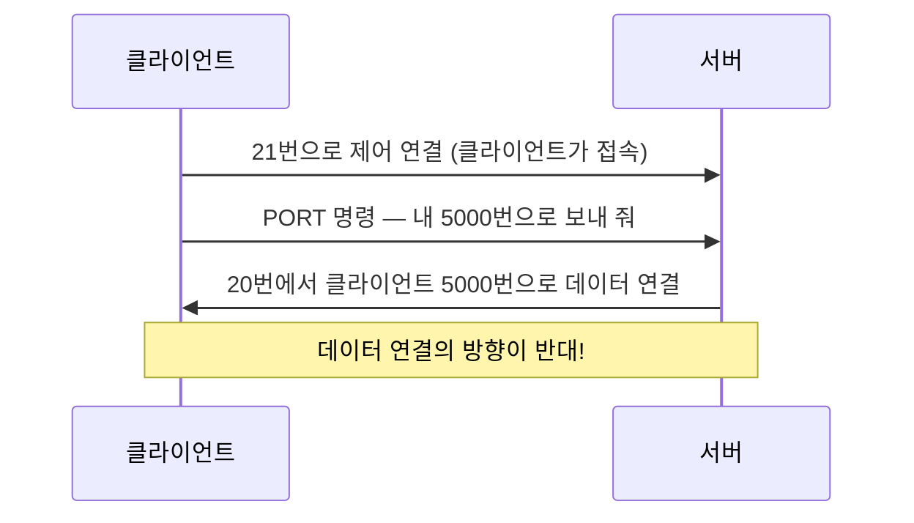
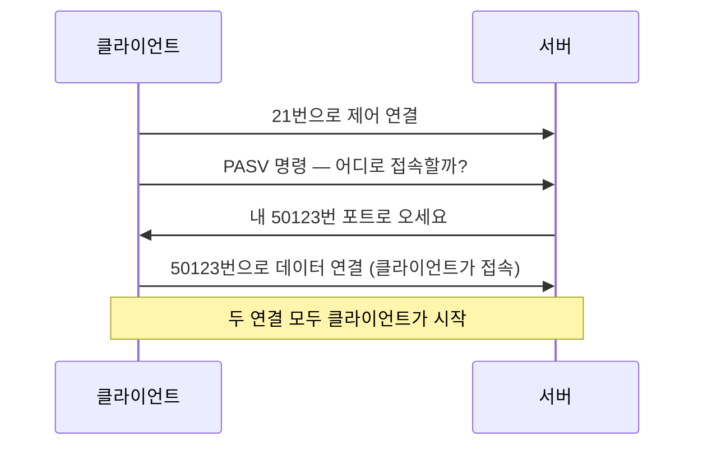
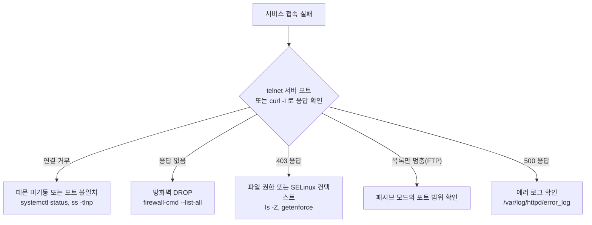

<Callout type="info">
  **이번 문서의 목표:** `DocumentRoot`와 `ServerRoot`를 헷갈리지 않고, FTP가 왜 포트를 두 개나 쓰는지, 방화벽 뒤에서 패시브 모드가 필요한 이유를 그림으로 설명할 수 있게 된다.
</Callout>

## 웹과 파일 전송, 가장 오래된 두 서비스

인터넷에서 가장 널리 쓰이는 서비스 두 가지가 웹(HTTP)과 파일 전송(FTP)입니다. 둘 다 1990년대 이전부터 있었고, 그만큼 설계에 시대의 흔적이 남아 있습니다.

특히 FTP는 **인터넷에 방화벽도 NAT도 없던 시절**에 설계되었습니다. 그래서 지금 환경에서는 이상해 보이는 동작을 합니다. 그 이상함을 이해하는 것이 이 편의 절반입니다.

## 1. HTTP와 웹 서버

### HTTP의 기본 성질

**HTTP**(HyperText Transfer Protocol, 하이퍼텍스트 전송 규약)는 클라이언트가 요청하면 서버가 응답하는 단순한 구조입니다. 기본 포트는 **80**이고, TLS로 암호화한 HTTPS는 **443**입니다.

핵심 성질은 **무상태**(stateless)라는 것입니다. 서버는 이전 요청을 기억하지 않습니다. 그래서 로그인 상태를 유지하려면 쿠키나 세션 같은 별도 장치가 필요합니다.

주요 메서드와 상태 코드는 다음과 같습니다.

| 메서드 | 의미 |
|--------|------|
| `GET` | 자원 조회 |
| `POST` | 자원 생성·데이터 전송 |
| `PUT` | 자원 전체 교체 |
| `DELETE` | 자원 삭제 |
| `HEAD` | 헤더만 조회(본문 없음) |

| 코드 대역 | 의미 | 대표 예 |
|-----------|------|---------|
| 2xx | 성공 | 200 OK |
| 3xx | 리다이렉션 | 301 영구 이동, 302 임시 이동 |
| 4xx | **클라이언트 잘못** | 401 인증 필요, 403 권한 없음, 404 없음 |
| 5xx | **서버 잘못** | 500 내부 오류, 502 게이트웨이 오류, 503 서비스 불가 |

403과 404를 구분하는 감각이 실무에 유용합니다. **404는 그런 것이 없다는 뜻, 403은 있지만 안 보여 준다는 뜻**입니다. 403이 뜨면 파일 권한이나 SELinux 컨텍스트를 먼저 확인합니다.

### Apache와 Nginx

| 항목 | Apache HTTP Server | Nginx |
|------|--------------------|-------|
| 처리 구조 | 프로세스·스레드 기반(prefork, worker, event) | **비동기 이벤트 기반** |
| 동시 접속 특성 | 접속마다 자원을 할당해 무거움 | 적은 자원으로 많은 접속 처리 |
| 모듈 | 동적 로드 가능(`LoadModule`) | 기본적으로 컴파일 시 포함 |
| 대표 용도 | 범용 웹 서버, `.htaccess` 활용 | 리버스 프록시, 로드 밸런서, 캐시 |
| 설정 파일 | `httpd.conf`, `apache2.conf` | `nginx.conf` |

시험에서 "가벼움과 높은 성능을 목표로 하며 리버스 프록시·로드 밸런서·HTTP 캐시 기능을 제공하고, 비동기 이벤트 기반 구조"라는 설명이 나오면 **Nginx**입니다. IIS는 마이크로소프트 제품, GWS는 구글 자체 서버입니다.

**리버스 프록시**(reverse proxy)라는 용어도 짚고 갑니다. 일반 프록시가 클라이언트를 대신해 밖으로 나간다면, 리버스 프록시는 **서버들 앞에 서서 클라이언트의 요청을 받아 뒤쪽 서버에 나눠 줍니다.** 방향이 반대라 "리버스"입니다.

### Apache 설정 — ServerRoot와 DocumentRoot

가장 자주 혼동되는 두 지시자입니다.

| 지시자 | 가리키는 것 | 예 |
|--------|-------------|-----|
| `ServerRoot` | **서버 프로그램의 설치·설정 기준 디렉터리** | `/etc/httpd` 또는 `/usr/local/apache` |
| `DocumentRoot` | **웹 문서가 저장되는 디렉터리** | `/var/www/html` |

브라우저가 `http://example.com/index.html`을 요청하면 서버는 `DocumentRoot` 아래에서 `index.html`을 찾습니다. `ServerRoot`는 설정 파일·모듈·로그 경로의 기준점이라 웹으로 노출되지 않습니다.

> **쉽게 말하면:** `ServerRoot`는 식당의 주방과 사무실, `DocumentRoot`는 손님에게 내보내는 진열장입니다.

주요 지시자를 정리합니다.

| 지시자 | 의미 |
|--------|------|
| `Listen 80` | 대기할 포트(또는 IP와 포트) |
| `ServerName` | 이 서버의 정식 호스트 이름 |
| `ServerAdmin` | 오류 페이지에 표시할 관리자 메일 |
| `DirectoryIndex index.html` | 디렉터리 요청 시 찾을 기본 문서 |
| `ErrorLog` / `CustomLog` | 오류·접근 로그 경로 |
| `LoadModule` | 동적 모듈 적재 |
| `Include` | 다른 설정 파일 포함 |
| `MaxRequestWorkers` | 동시 처리 가능한 요청 수 |
| `KeepAlive` | 연결 재사용 여부 |

디렉터리별 세부 설정은 `Directory` 블록에서 합니다.

```
<Directory "/var/www/html">
    Options Indexes FollowSymLinks
    AllowOverride None
    Require all granted
</Directory>
```

- `Options Indexes`: 기본 문서가 없을 때 **파일 목록을 보여 줍니다.** 보안상 대개 끕니다.
- `AllowOverride`: `.htaccess` 파일로 설정을 덮어쓸 수 있는 범위. `None`이면 `.htaccess`를 아예 읽지 않아 성능에도 유리합니다.
- `Require all granted`: 접근 허용(Apache 2.4 문법). 2.2 시절의 `Order`/`Allow`/`Deny`와 다릅니다.

### 사용자 디렉터리와 가상 호스트

개인 사용자의 홈 아래 `public_html`을 웹으로 공개하는 기능이 **UserDir**입니다. 이를 담당하는 모듈 파일명은 `mod_userdir.so`이고, 밑줄(`_`)을 쓴다는 점이 출제 포인트입니다. 하이픈이 아닙니다.

```
LoadModule userdir_module modules/mod_userdir.so
UserDir public_html
```

**가상 호스트**(VirtualHost)는 IP 하나로 여러 도메인을 서비스하는 기능입니다. 클라이언트가 보낸 `Host` 헤더를 보고 어느 사이트인지 구분합니다.

```
<VirtualHost *:80>
    ServerName www.site-a.com
    DocumentRoot /var/www/site-a
</VirtualHost>
```

### 설정 검사와 로그

```bash
httpd -t                # 설정 파일 문법 검사
apachectl configtest    # 위와 같은 동작
httpd -M                # 적재된 모듈 목록
httpd -S                # 가상 호스트 구성 확인
httpd -l                # 정적으로 컴파일된 모듈
```

**`-t`가 문법 검사**입니다. `-l`(소문자 L)은 컴파일된 모듈 목록이므로 혼동하지 마세요. 문법이 맞으면 `Syntax OK`가 출력됩니다.

| 계열 | 설정 파일 | 문서 루트 | 로그 |
|------|-----------|-----------|------|
| RHEL | `/etc/httpd/conf/httpd.conf` | `/var/www/html` | `/var/log/httpd/` |
| Debian | `/etc/apache2/apache2.conf` | `/var/www/html` | `/var/log/apache2/` |

Debian 계열은 `sites-available`에 설정을 두고 `a2ensite` 명령으로 `sites-enabled`에 심볼릭 링크를 걸어 활성화하는 방식이 특징입니다. 모듈도 `a2enmod`로 켭니다.

### 연계 스택 — LAMP

**LAMP**는 Linux, Apache, MySQL/MariaDB, PHP의 머리글자입니다. PHP에서 데이터베이스에 접속할 때 함수 이름이 시험에 나옵니다.

- PHP 5까지: `mysql_connect()`
- **PHP 7부터: `mysql_*` 함수 전면 제거.** `mysqli_connect()` 또는 PDO를 씁니다.

`mysqli`의 `i`는 improved(개선된)의 약자입니다. "PHP 7에서 MySQL에 접속" 문제의 답은 `mysqli_connect`입니다.

## 2. FTP — 왜 포트가 두 개인가

### 제어 채널과 데이터 채널

**FTP**(File Transfer Protocol, 파일 전송 규약)는 다른 프로토콜과 결정적으로 다른 점이 있습니다. **연결을 두 개 씁니다.**

| 채널 | 포트 | 역할 |
|------|------|------|
| 제어(control) 채널 | **21** | 로그인, 명령(`LIST`, `RETR`, `STOR`) 주고받기 |
| 데이터(data) 채널 | **20** 또는 임의 포트 | 실제 파일 내용과 목록 전송 |

왜 이렇게 만들었을까요? 파일을 전송하는 도중에도 명령을 주고받을 수 있게(예: 전송 중단) 하려는 설계였습니다. 당시로서는 합리적이었지만, **방화벽과 NAT가 등장하면서 이 구조가 골칫거리**가 됩니다.

### 액티브 모드 — 서버가 되돌아 연결한다



액티브(active) 모드에서는 데이터 연결을 **서버가 클라이언트 쪽으로 새로 맺습니다.** 여기서 문제가 생깁니다. 대부분의 클라이언트는 방화벽이나 공유기 뒤에 있고, **밖에서 안으로 들어오는 새 연결은 차단**됩니다. 그래서 제어 연결은 되는데 목록 조회에서 멈추는 현상이 벌어집니다.

### 패시브 모드 — 클라이언트가 두 번 연결한다



패시브(passive) 모드에서는 **데이터 연결도 클라이언트가 시작**합니다. 방화벽 입장에서는 모두 "안에서 밖으로 나가는 연결"이라 통과됩니다. 그래서 현대 환경에서는 패시브가 기본입니다.

| 항목 | 액티브 모드 | 패시브 모드 |
|------|-------------|-------------|
| 데이터 연결을 여는 쪽 | **서버** | **클라이언트** |
| 서버가 쓰는 데이터 포트 | 20번 고정 | 지정된 범위의 임의 포트 |
| 클라이언트 방화벽 | 들어오는 연결 허용 필요 | 추가 설정 불필요 |
| 서버 방화벽 | 21, 20만 열면 됨 | **21과 패시브 포트 범위**를 열어야 함 |
| 명령어 | `PORT` | `PASV` |

부담이 클라이언트에서 서버로 옮겨 간 셈입니다. 그래서 서버 관리자는 `pasv_min_port`와 `pasv_max_port`로 범위를 좁게 지정하고 그 범위만 방화벽에서 엽니다.

### vsftpd 설정

**vsftpd**(Very Secure FTP Daemon)는 리눅스에서 가장 널리 쓰이는 FTP 서버입니다. 설정 파일은 `/etc/vsftpd/vsftpd.conf`(RHEL 계열) 또는 `/etc/vsftpd.conf`(Debian 계열)입니다.

| 옵션 | 의미 |
|------|------|
| `anonymous_enable=YES` | **익명 사용자** 접속 허용 |
| `local_enable=YES` | **시스템 계정을 가진 일반 사용자** 접속 허용 |
| `write_enable=YES` | 업로드·삭제 등 쓰기 명령 허용 |
| `local_umask=022` | 업로드 파일의 umask |
| `chroot_local_user=YES` | 사용자를 자기 홈에 가둠(상위 접근 차단) |
| `listen=YES` | 독립 데몬으로 동작 |
| `pasv_min_port` / `pasv_max_port` | 패시브 포트 범위 |
| `userlist_enable` / `userlist_deny` | 사용자 목록 기반 접근 제어 |

`anonymous_enable`과 `local_enable`의 구분이 반복 출제됩니다. **`local_enable=YES`는 익명이 아니라 시스템 계정 사용자**의 접속을 허용하는 옵션입니다.

접근 제어 파일도 정리해 둡니다.

| 파일 | 역할 |
|------|------|
| `/etc/vsftpd/ftpusers` | 여기 적힌 계정은 **무조건 접속 금지**(root 등) |
| `/etc/vsftpd/user_list` | `userlist_deny` 값에 따라 거부 목록 또는 허용 목록으로 동작 |

`userlist_deny=YES`(기본)이면 `user_list`는 거부 목록, `NO`이면 **허용 목록**으로 뒤집힙니다. 이 반전이 함정입니다.

### chroot의 함정

`chroot_local_user=YES`로 사용자를 홈에 가두면 보안이 좋아집니다. 그런데 vsftpd는 **가둬 둔 최상위 디렉터리에 쓰기 권한이 있으면 실행을 거부**합니다.

```
500 OOPS: vsftpd: refusing to run with writable root inside chroot()
```

권한 상승 취약점을 막기 위한 의도적인 동작입니다. 해결은 홈 디렉터리에서 쓰기 권한을 빼고 그 아래에 업로드용 하위 디렉터리를 두거나, `allow_writeable_chroot=YES`를 설정하는 것입니다.

### 보안 관점과 대안

FTP의 근본 문제는 **제어 채널이 평문**이라는 점입니다. 아이디와 패스워드가 그대로 흐릅니다. 대안이 세 가지 있고, 이름이 비슷해 구분이 필요합니다.

| 이름 | 정체 | 포트 |
|------|------|------|
| **FTPS** | FTP에 TLS 암호화를 씌운 것 | 21(명시적) 또는 990(암시적) |
| **SFTP** | **SSH의 하위 기능.** FTP와 무관한 별개 프로토콜 | 22 |
| **TFTP** | Trivial FTP. UDP 기반, 인증 없음. 부팅 이미지 전송용 | UDP 69 |

**SFTP는 FTP의 보안 버전이 아니라 SSH의 일부**라는 점이 핵심입니다. 이름만 비슷할 뿐 프로토콜 자체가 다릅니다. `sshd`가 떠 있으면 대개 SFTP도 바로 쓸 수 있습니다.

## 3. 진단 흐름



FTP에서 "로그인은 되는데 `ls`에서 멈춘다"는 증상은 거의 언제나 **데이터 채널 문제**입니다. 모드를 패시브로 바꾸거나 서버의 패시브 포트 범위를 방화벽에서 여는 것이 해결책입니다. 이 증상과 원인의 연결은 통합 시나리오 문제로 자주 나옵니다.

## 핵심 정리

- `ServerRoot`는 서버 프로그램의 기준 디렉터리, `DocumentRoot`는 웹 문서가 놓이는 디렉터리다. 문법 검사는 `httpd -t` 또는 `apachectl configtest`다.
- Nginx는 비동기 이벤트 기반 구조로 리버스 프록시·로드 밸런서·캐시 역할에 강하고, Apache는 프로세스·스레드 기반의 범용 서버다.
- FTP는 제어 21번과 데이터 채널을 따로 쓰며, 액티브는 서버가 데이터 연결을 열고 패시브는 클라이언트가 연다. 방화벽 뒤 환경에서는 패시브가 필요하다.
- vsftpd에서 `local_enable=YES`는 시스템 계정 사용자, `anonymous_enable=YES`는 익명 접속을 허용한다.
- SFTP는 FTP의 확장이 아니라 SSH의 하위 기능이며 22번 포트를 쓴다. FTPS와 이름이 비슷하지만 다른 것이다.

## 마무리 복습

<Quiz
  questionNumber={1}
  question="아파치 웹 서버의 환경 설정 파일에서 웹 문서가 저장되는 디렉터리 위치를 지정하는 지시자는?"
  options={['DocumentRoot', 'ServerRoot', 'DirectoryIndex', 'ServerName']}
  correctAnswer={1}
  explanation="DocumentRoot는 클라이언트 요청 경로가 실제 파일 시스템의 어느 디렉터리에 대응하는지를 정하는 지시자다. ServerRoot는 서버 프로그램의 설정과 모듈이 놓인 기준 디렉터리로 웹에 노출되지 않는다."
  optionExplanations={['정답. 웹 문서 루트를 지정한다.', 'ServerRoot는 서버 설치 및 설정의 기준 디렉터리다.', 'DirectoryIndex는 디렉터리 요청 시 찾을 기본 문서 파일명을 정한다.', 'ServerName은 이 서버의 정식 호스트 이름을 지정한다.']}
/>

<Quiz
  questionNumber={2}
  question="가벼움과 높은 성능을 목표로 하며 리버스 프록시, 로드 밸런서, HTTP 캐시 기능을 제공하고 비동기 이벤트 기반 구조를 채택한 웹 서버는?"
  options={['IIS', 'GWS', 'Nginx', 'Apache HTTP Server']}
  correctAnswer={3}
  explanation="Nginx는 접속마다 프로세스나 스레드를 할당하지 않고 이벤트 루프로 다수의 연결을 처리하는 비동기 구조를 채택해 적은 자원으로 높은 동시성을 낸다. 리버스 프록시와 로드 밸런싱, 캐싱 기능도 기본 제공한다."
  optionExplanations={['IIS는 마이크로소프트의 윈도우용 웹 서버다.', 'GWS는 구글이 자체적으로 사용하는 웹 서버다.', '정답. Nginx가 비동기 이벤트 기반 구조의 대표다.', 'Apache는 프로세스와 스레드 기반 처리 구조를 사용한다.']}
/>

<Quiz
  questionNumber={3}
  question="아파치 웹 서버 설정 파일의 문법적 오류를 점검하는 명령으로 알맞은 것은?"
  options={['httpd -f', 'httpd -t', 'httpd -l', 'httpd -S']}
  correctAnswer={2}
  explanation="httpd -t 는 설정 파일을 파싱해 문법 오류가 있는지 검사하고 이상이 없으면 Syntax OK 를 출력한다. apachectl configtest 도 같은 동작을 한다. -l 은 컴파일된 모듈 목록, -S 는 가상 호스트 구성, -f 는 사용할 설정 파일을 지정하는 옵션이다."
  optionExplanations={['-f 는 사용할 설정 파일 경로를 직접 지정하는 옵션이다.', '정답. -t 가 문법 검사 옵션이다.', '-l 은 정적으로 컴파일된 모듈 목록을 출력한다.', '-S 는 가상 호스트 설정 구성을 보여 준다.']}
/>

<Quiz
  questionNumber={4}
  question="개인 사용자의 홈 디렉터리를 웹으로 서비스하기 위해 적재하는 아파치 모듈 파일명으로 알맞은 것은?"
  options={['mod-userdir.so', 'mod_userdir.so', 'httpd-userdir.so', 'httpd_userdir.so']}
  correctAnswer={2}
  explanation="아파치 모듈 파일은 mod_ 로 시작하고 단어 구분에 밑줄을 사용한다. 사용자 디렉터리 기능을 제공하는 모듈은 mod_userdir.so 이며 LoadModule userdir_module modules/mod_userdir.so 형태로 적재한다."
  optionExplanations={['아파치 모듈명은 하이픈이 아니라 밑줄을 사용한다.', '정답. mod_userdir.so 가 올바른 파일명이다.', '모듈 파일은 httpd- 가 아니라 mod_ 로 시작한다.', '접두어가 httpd_ 인 모듈 파일은 존재하지 않는다.']}
/>

<Quiz
  questionNumber={5}
  question="vsftpd 설정 파일에 local_enable=YES 로 지정되어 있다. 이 설정의 의미로 가장 알맞은 것은?"
  options={['익명 사용자의 접근을 허가한다', 'root 사용자의 접근을 허가한다', '시스템 계정을 가진 일반 사용자의 접근을 허가한다', '모든 사용자의 쓰기 작업을 허가한다']}
  correctAnswer={3}
  explanation="local_enable 은 리눅스 시스템에 계정을 가진 로컬 사용자의 FTP 로그인을 허용하는 옵션이다. 익명 접속은 anonymous_enable 이 담당하고, 업로드나 삭제 같은 쓰기 작업 허용은 write_enable 이 별도로 담당한다."
  optionExplanations={['익명 접속 허용은 anonymous_enable 옵션이다.', 'root는 ftpusers 파일에 등록되어 별도로 차단되는 것이 일반적이다.', '정답. 시스템 계정 사용자의 접속을 허용하는 옵션이다.', '쓰기 허용은 write_enable 이 담당하는 별개 옵션이다.']}
/>

<Quiz
  questionNumber={6}
  question="FTP의 액티브 모드와 패시브 모드에 대한 설명으로 알맞은 것은?"
  options={['액티브 모드는 데이터 연결을 서버가 클라이언트 쪽으로 맺어 클라이언트 방화벽에 막히기 쉽다', '패시브 모드는 서버가 20번 포트에서 클라이언트로 연결한다', '두 모드 모두 데이터 전송에 제어 채널인 21번 포트를 그대로 사용한다', '패시브 모드는 클라이언트 방화벽에서 들어오는 연결을 허용해야만 동작한다']}
  correctAnswer={1}
  explanation="액티브 모드에서는 클라이언트가 PORT 명령으로 알려 준 포트로 서버가 데이터 연결을 새로 맺는다. 이 연결은 밖에서 안으로 들어오는 방향이라 클라이언트 측 방화벽이나 NAT에 막히기 쉽다. 그래서 클라이언트가 두 연결을 모두 시작하는 패시브 모드가 현대 환경의 기본이 되었다."
  optionExplanations={['정답. 액티브 모드의 역방향 데이터 연결이 문제의 원인이다.', '20번에서 클라이언트로 연결하는 것은 액티브 모드의 동작이다.', 'FTP는 제어와 데이터를 별도 연결로 처리하는 것이 특징이다.', '설명이 반대다. 들어오는 연결 허용이 필요한 쪽은 액티브 모드다.']}
/>

<Quiz
  questionNumber={7}
  question="SFTP에 대한 설명으로 알맞은 것은?"
  options={['FTP 프로토콜에 TLS 암호화를 추가한 것으로 21번 포트를 사용한다', 'SSH의 하위 기능으로 동작하며 22번 포트를 사용한다', 'UDP 기반으로 인증 없이 파일을 전송하며 69번 포트를 사용한다', 'FTP 서버에 별도로 설치해야 하는 확장 모듈이다']}
  correctAnswer={2}
  explanation="SFTP는 SSH File Transfer Protocol로 SSH 연결 위에서 동작하는 별개의 프로토콜이며 22번 포트를 사용한다. 이름이 비슷한 FTPS가 FTP에 TLS를 씌운 것이고, TFTP는 UDP 69번을 쓰는 인증 없는 간이 전송 프로토콜이다."
  optionExplanations={['그 설명은 FTPS에 해당한다.', '정답. SFTP는 SSH의 하위 기능이다.', '그 설명은 TFTP에 해당한다.', 'SFTP는 FTP 서버의 확장이 아니라 sshd가 제공하는 기능이다.']}
/>

<Quiz
  questionNumber={8}
  question="웹 브라우저로 특정 페이지에 접속했더니 403 Forbidden 이 반환되었다. 확인 순서로 가장 알맞은 것은?"
  options={['해당 경로의 파일 권한과 SELinux 컨텍스트, 그리고 Directory 블록의 접근 제어 설정', '서버의 라우팅 테이블과 기본 게이트웨이', 'DNS 서버의 A 레코드 값', 'TCP 3-way handshake 완료 여부']}
  correctAnswer={1}
  explanation="403은 요청한 자원이 존재하지만 서버가 접근을 거부했다는 뜻이다. 즉 네트워크 계층은 정상적으로 동작한 것이므로 파일 시스템 권한, SELinux 보안 컨텍스트, 아파치의 Directory 블록 접근 제어 설정을 확인해야 한다. 자원이 없다면 404가 반환된다."
  optionExplanations={['정답. 403은 접근 권한 문제이므로 권한과 접근 제어를 확인한다.', '라우팅 문제라면 응답 코드 자체를 받지 못한다.', 'DNS 문제라면 서버에 도달하지도 못한다.', '응답 코드를 받았다는 것은 이미 연결이 성립했다는 뜻이다.']}
/>

## 참고 자료

- [Apache HTTP Server 2.4 – Core 지시자 문서 (httpd.apache.org)](https://httpd.apache.org/docs/2.4/mod/core.html)
- [Apache HTTP Server 2.4 – mod_userdir (httpd.apache.org)](https://httpd.apache.org/docs/2.4/mod/mod_userdir.html)
- [nginx 공식 문서 (nginx.org)](https://nginx.org/en/docs/)
- [vsftpd.conf(5) 매뉴얼 (security.appspot.com)](https://security.appspot.com/vsftpd/vsftpd_conf.html)
- [RFC 959 – File Transfer Protocol (rfc-editor.org)](https://www.rfc-editor.org/rfc/rfc959)
