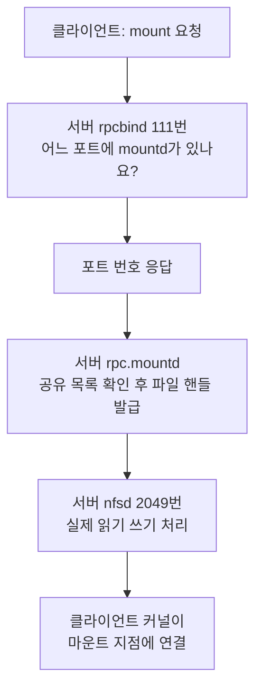
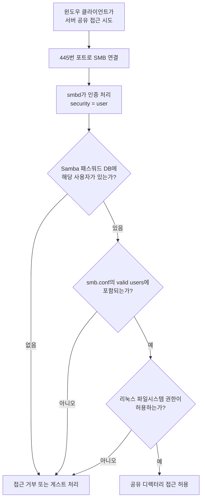

<Callout type="info">
  **이번 문서의 목표:** `root_squash`와 `all_squash`가 각각 누구의 권한을 어떻게 바꾸는지 정확히 말할 수 있고, NFS가 왜 `rpcbind` 없이는 동작하지 않는지, Samba의 `path`와 `valid users`가 무엇을 정하는지 설명할 수 있게 된다.
</Callout>

## 파일을 공유하는 두 가지 세계

한 서버의 디렉터리를 다른 컴퓨터에서 마치 자기 폴더처럼 쓰고 싶을 때가 있습니다. 웹 서버 여러 대가 같은 이미지 폴더를 봐야 한다거나, 사무실 직원들이 공용 문서함을 써야 한다거나.

이때 상대가 누구냐에 따라 답이 갈립니다.

- 상대가 **유닉스·리눅스**라면 → **NFS**(Network File System, 네트워크 파일 시스템)
- 상대가 **윈도우**라면 → **Samba**(삼바, SMB/CIFS 프로토콜 구현)

두 체계는 권한을 다루는 철학부터 다릅니다. NFS는 **UID와 GID 숫자를 그대로 믿는** 방식이고, Samba는 **사용자 이름과 별도 패스워드로 인증**하는 방식입니다. 이 차이가 대부분의 설정과 함정의 근원입니다.

## 1. NFS — UID를 그대로 믿는 공유

### 동작 구조와 RPC

NFS는 1984년 썬 마이크로시스템즈가 만들었습니다. 설계 사상은 "**원격 파일 접근을 로컬 시스템 콜처럼 보이게 하자**"입니다. 클라이언트가 마운트하고 나면 응용 프로그램은 그것이 원격인지 로컬인지 알 필요가 없습니다.

이를 위해 **RPC**(Remote Procedure Call, 원격 프로시저 호출)를 씁니다. RPC는 "함수를 원격에서 대신 실행해 주는 체계"입니다. 클라이언트가 `read()`를 부르면, 그 요청이 네트워크를 건너 서버에서 실행되고 결과가 돌아옵니다.

문제는 **RPC 서비스들이 고정 포트를 쓰지 않는다**는 점입니다. 그래서 "어느 서비스가 몇 번 포트에 있는지"를 알려 주는 안내 데스크가 필요합니다. 그 역할이 **`rpcbind`**(예전 이름 `portmap`)이고, 111번 포트에서 대기합니다.



| 데몬·서비스 | 역할 |
|-------------|------|
| `rpcbind` | RPC 서비스의 포트를 안내(111번) |
| `nfsd` | 실제 파일 입출력 처리(2049번) |
| `rpc.mountd` | 마운트 요청 처리와 권한 검사 |
| `rpc.statd` / `rpc.lockd` | 파일 잠금과 상태 복구 |
| `rpc.idmapd` | NFSv4에서 이름과 ID 매핑 |

"**NIS나 NFS를 쓰려면 먼저 `rpcbind`를 실행해야 한다**"는 문제가 반복 출제됩니다. CentOS 7 이후 서비스 이름이 `portmap`에서 `rpcbind`로 바뀌었다는 점도 함께 나옵니다.

NFSv4부터는 상황이 달라집니다. 필요한 기능을 2049번 하나로 통합해 `rpcbind` 의존이 사라졌습니다. 그래서 방화벽 설정이 훨씬 쉬워졌습니다. **v3까지는 rpcbind가 필수, v4부터는 2049번만**이라고 정리하세요.

### exports 파일 — 무엇을 누구에게

서버가 공유할 디렉터리는 `/etc/exports`에 적습니다.

```
/data    192.168.56.0/24(rw,sync,no_root_squash)
/backup  *.example.com(ro,sync,all_squash)
/pub     *(ro,sync)
```

형식은 `공유경로 클라이언트(옵션,옵션,...)`입니다. **클라이언트와 여는 괄호 사이에 공백이 있으면 안 됩니다.** 공백이 들어가면 "그 클라이언트에는 기본 옵션, 그리고 모든 호스트에 괄호 안 옵션"이라는 전혀 다른 의미가 되어 보안 사고로 이어집니다.

클라이언트 지정 방식은 다음과 같습니다.

| 표기 | 의미 |
|------|------|
| `192.168.1.10` | 특정 호스트 |
| `192.168.56.0/24` | 네트워크 대역 |
| `*.example.com` | 도메인 와일드카드 |
| `*` | 모든 호스트 |

### 주요 exports 옵션

| 옵션 | 의미 |
|------|------|
| `rw` / `ro` | 읽기·쓰기 / 읽기 전용 |
| `sync` | **쓰기를 디스크에 반영한 뒤** 응답. 안전하지만 느림 |
| `async` | 메모리에만 쓰고 바로 응답. 빠르지만 장애 시 유실 위험 |
| `wdelay` / `no_wdelay` | 쓰기를 모아서 처리할지 여부 |
| `subtree_check` / `no_subtree_check` | 하위 디렉터리 경로 검사 여부(성능상 보통 끔) |
| `secure` / `insecure` | 클라이언트가 1024 미만 포트를 쓰도록 요구할지 |
| `root_squash` | **클라이언트 root를 익명 계정으로 매핑**(기본값) |
| `no_root_squash` | 클라이언트 root를 서버 root로 인정 |
| `all_squash` | **모든 사용자를 익명 계정으로 매핑** |
| `no_all_squash` | 일반 사용자는 UID 그대로 매핑(기본값) |
| `anonuid` / `anongid` | 익명 매핑에 사용할 UID·GID 지정 |

### squash — 가장 중요한 개념

**squash**는 "짓누르다"라는 뜻입니다. 원격 사용자의 권한을 낮춰 눌러 버린다는 의미입니다.

왜 필요할까요? NFS는 UID 숫자를 그대로 믿습니다. 클라이언트에서 UID 0(root)으로 파일에 접근하면, 서버는 그 요청을 root의 요청으로 처리합니다. **클라이언트 관리자 권한만 있으면 서버 파일을 마음대로 건드릴 수 있다**는 뜻입니다.

그래서 기본값으로 `root_squash`가 켜져 있습니다. 클라이언트의 root를 `nobody`(또는 `nfsnobody`)로 바꿔 버립니다.

| 옵션 | root(UID 0) 사용자 | 일반 사용자 |
|------|--------------------|-------------|
| `root_squash`(기본) | **익명 계정으로 매핑** | UID 그대로 |
| `no_root_squash` | 서버 root로 인정 | UID 그대로 |
| `all_squash` | **익명 계정으로 매핑** | **익명 계정으로 매핑** |
| `no_all_squash`(기본) | root_squash 설정을 따름 | UID 그대로 |

시험에서 이렇게 묻습니다. "**root 사용자 및 일반 사용자의 권한을 모두 nobody 또는 nfsnobody로 매핑시킨다**"는 설명이면 답은 `all_squash`입니다. `root_squash`는 root만 매핑합니다. 이 한 글자 차이가 핵심입니다.

> **쉽게 말하면:** `root_squash`는 "손님 중 사장님만 일반인 취급", `all_squash`는 "손님 전원 일반인 취급"입니다.

`no_root_squash`는 편리하지만 매우 위험합니다. 클라이언트를 완전히 신뢰할 수 있는 경우가 아니면 쓰지 않는 것이 원칙입니다.

### UID 불일치 문제

NFS의 고질적인 함정입니다. 서버에서 `kim`의 UID가 1001이고 클라이언트에서 `lee`의 UID가 1001이면, **클라이언트의 lee가 서버의 kim 파일을 자기 것처럼 다룹니다.** 이름이 아니라 숫자를 보기 때문입니다.

해결책은 세 가지입니다. UID를 수동으로 맞추거나, LDAP·NIS 같은 중앙 계정 관리를 쓰거나, `all_squash`와 `anonuid`로 전부 하나의 계정으로 눌러 버리는 것입니다.

### 서버·클라이언트 명령

| 명령 | 역할 |
|------|------|
| `exportfs -v` | **서버에서** 현재 공유 중인 목록과 옵션 확인 |
| `exportfs -a` | `/etc/exports` 전체 반영 |
| `exportfs -r` | 설정 다시 읽기(재공유) |
| `exportfs -u 경로` | 특정 공유 해제 |
| `showmount -e 서버` | **클라이언트에서** 서버의 공유 목록 확인 |
| `showmount -a` | 어느 클라이언트가 무엇을 마운트했는지 |
| `nfsstat` | NFS 통계 |
| `rpcinfo -p 서버` | 서버에 등록된 RPC 서비스와 포트 |

`exportfs`와 `showmount`의 구분이 출제 포인트입니다. **서버 자신이 무엇을 내보내는지 보는 것이 `exportfs`**, **클라이언트가 서버에 물어보는 것이 `showmount -e`**입니다. 문제에 제시된 출력이 옵션까지 상세히 포함하고 있으면 `exportfs -v`입니다.

### 클라이언트 마운트

```bash
mount -t nfs 192.168.56.10:/data /mnt/data
mount -t nfs -o rw,hard,intr 192.168.56.10:/data /mnt/data
```

부팅 시 자동 마운트하려면 `/etc/fstab`에 적습니다.

```
192.168.56.10:/data  /mnt/data  nfs  defaults,_netdev  0 0
```

`_netdev` 옵션이 중요합니다. "이 마운트는 네트워크가 준비된 뒤에 하라"는 뜻이고, 빠뜨리면 부팅 중 네트워크가 뜨기 전에 마운트를 시도해 부팅이 멈출 수 있습니다.

클라이언트 마운트 옵션 중 두 가지를 구분해 둡니다.

| 옵션 | 서버 응답이 없을 때 |
|------|---------------------|
| `hard`(기본) | 서버가 응답할 때까지 **무한 대기.** 데이터 무결성 우선 |
| `soft` | 일정 시간 후 오류 반환. 응답성 우선이나 데이터 손상 위험 |
| `intr` | `hard`와 함께 써서 대기 중 인터럽트 허용 |

NFS 서버가 죽었을 때 클라이언트의 `df` 명령까지 멈추는 현상이 `hard` 마운트 때문입니다.

## 2. Samba — 윈도우와 말이 통하게

### SMB/CIFS와 Samba

윈도우는 파일과 프린터 공유에 **SMB**(Server Message Block) 프로토콜을 씁니다. 확장판이 **CIFS**(Common Internet File System)이고, 최신은 SMB2·SMB3입니다.

**Samba**는 이 프로토콜을 리눅스·유닉스에서 구현한 오픈소스 소프트웨어입니다. 덕분에 리눅스 서버가 윈도우 클라이언트에게 "네트워크 드라이브"로 보일 수 있습니다.

| 데몬 | 역할 |
|------|------|
| `smbd` | 파일·프린터 공유 처리, 사용자 인증 |
| `nmbd` | NetBIOS 이름 서비스, 네트워크 브라우징 |
| `winbindd` | 윈도우 도메인 사용자 정보 연동 |

포트도 정리해 둡니다.

| 포트 | 용도 |
|------|------|
| 137 (UDP) | NetBIOS 이름 서비스 |
| 138 (UDP) | NetBIOS 데이터그램 |
| 139 (TCP) | NetBIOS 세션 서비스(구형 SMB) |
| **445 (TCP)** | **SMB 직접 호스팅**(현대 방식) |

### smb.conf 구조

설정 파일은 `/etc/samba/smb.conf`이고, INI 형식으로 **전역 섹션과 공유 섹션**으로 나뉩니다.

```
[global]
    workgroup = WORKGROUP
    server string = Linux File Server
    security = user
    map to guest = Bad User

[homes]
    browseable = no
    writable = yes

[public]
    path = /srv/samba/public
    browseable = yes
    writable = yes
    valid users = @sales
    create mask = 0664
    directory mask = 0775
```

대괄호로 감싼 이름이 **공유 이름**이며, 윈도우에서 `\\서버\public` 형태로 보입니다.

| 지시자 | 의미 |
|--------|------|
| `path` | **실제 공유할 디렉터리의 절대 경로** |
| `browseable` | 네트워크 목록에 보일지 여부 |
| `writable` / `read only` | 쓰기 허용(서로 반대 의미) |
| `valid users` | 접근 허용 사용자·그룹(`@`는 그룹) |
| `write list` | 읽기 전용 공유에서 예외적으로 쓰기 허용할 사용자 |
| `guest ok` / `public` | 인증 없이 접근 허용 |
| `create mask` | 새로 만들어지는 파일의 권한 마스크 |
| `directory mask` | 새 디렉터리의 권한 마스크 |
| `security` | 인증 방식(`user`, `domain`, `ads`) |

**공유할 디렉터리 경로를 지정하는 지시자가 `path`**라는 것이 반복 출제됩니다. `share`나 `root`가 아닙니다. 특수 섹션인 `[homes]`는 각 사용자의 홈 디렉터리를 자동으로 공유해 주는 예약된 이름입니다.

### Samba 계정은 리눅스 계정과 별개다

여기가 가장 많이 막히는 지점입니다. Samba는 **자체 패스워드 데이터베이스**를 씁니다. 리눅스 계정이 있어도 Samba 패스워드를 따로 등록해야 접속됩니다.

```bash
useradd kim                 # 리눅스 계정 생성(선행 필요)
smbpasswd -a kim            # Samba 패스워드 등록
pdbedit -L                  # 등록된 Samba 사용자 목록
smbpasswd -x kim            # Samba 사용자 삭제
```

이유는 프로토콜에 있습니다. SMB는 리눅스의 `/etc/shadow`와 다른 방식으로 해시를 주고받기 때문에 같은 저장소를 쓸 수 없습니다. **리눅스 계정이 먼저 있어야 하고, 그 위에 Samba 패스워드를 얹는다**고 이해하면 됩니다.

### 관련 명령

| 명령 | 역할 |
|------|------|
| `testparm` | **smb.conf 문법 검사** |
| `smbclient //서버IP/공유명` | FTP처럼 대화형으로 접속 |
| `smbclient -L 서버IP` | 서버의 공유 목록 조회 |
| `smbstatus` | 현재 접속자와 잠금 상태 |
| `mount -t cifs //서버/공유 /mnt -o username=kim` | 리눅스에 마운트 |

`smbclient`의 경로 표기가 **슬래시 두 개로 시작**한다는 점을 기억하세요. 윈도우의 `\\서버\공유`를 리눅스식으로 옮긴 것입니다.

```bash
smbclient //192.168.5.13/data
```

`-L`은 목록 조회 옵션이라 특정 공유에 접속하는 용도가 아닙니다. 이 구분이 기출 선택지를 가릅니다.

### 접속 흐름



**Samba 설정과 리눅스 파일 권한이 이중으로 걸린다**는 점이 핵심입니다. `smb.conf`에서 `writable = yes`라도 리눅스 권한이 읽기 전용이면 쓸 수 없습니다. 둘 중 더 엄격한 쪽이 이깁니다. SELinux가 켜진 시스템이라면 `samba_share_t` 컨텍스트까지 세 겹이 됩니다.

## 3. NFS와 Samba 비교

| 항목 | NFS | Samba |
|------|-----|-------|
| 주 대상 | 유닉스·리눅스 간 | 윈도우와의 연동 |
| 프로토콜 | NFS(RPC 기반) | SMB/CIFS |
| 기본 포트 | 2049(v3는 rpcbind 111 추가) | 445, 139 |
| 인증 | **호스트 기반**(IP·도메인) | **사용자 기반**(계정·패스워드) |
| 권한 모델 | UID·GID 숫자를 그대로 사용 | 사용자 매핑 후 리눅스 권한 적용 |
| 설정 파일 | `/etc/exports` | `/etc/samba/smb.conf` |
| 서버 확인 명령 | `exportfs -v` | `testparm`, `smbstatus` |
| 클라이언트 조회 | `showmount -e` | `smbclient -L` |

가장 본질적인 차이는 **인증 주체**입니다. NFS는 "어느 컴퓨터에서 왔는가"를 보고, Samba는 "누구인가"를 봅니다. 그래서 NFS는 신뢰할 수 있는 내부망 전용으로 쓰고, Samba는 사용자별 접근 제어가 필요한 사무실 환경에 맞습니다.

## 핵심 정리

- NFSv3까지는 RPC 포트 안내를 위해 `rpcbind`(옛 `portmap`, 111번)가 필수이며, NFSv4는 2049번 하나로 통합되어 의존이 사라졌다.
- `root_squash`는 클라이언트 root만, `all_squash`는 root와 일반 사용자 전부를 익명 계정으로 매핑한다. `no_root_squash`는 위험하므로 신중히 쓴다.
- 서버가 내보내는 목록은 `exportfs -v`, 클라이언트가 서버에 묻는 것은 `showmount -e`다.
- Samba의 공유 디렉터리 경로는 `path` 지시자로 지정하고, 문법 검사는 `testparm`, 원격 접속은 `smbclient //서버/공유` 형식이다.
- Samba 계정은 리눅스 계정과 별개의 패스워드 DB를 쓰므로 `smbpasswd -a`로 따로 등록해야 하며, 최종 접근 여부는 Samba 설정과 리눅스 권한 중 더 엄격한 쪽이 결정한다.

## 마무리 복습

<Quiz
  questionNumber={1}
  question="NFS 서버 설정에서 root 사용자와 일반 사용자의 권한을 모두 nobody 또는 nfsnobody 계정으로 매핑시키는 옵션은?"
  options={['root_squash', 'no_root_squash', 'all_squash', 'no_all_squash']}
  correctAnswer={3}
  explanation="all_squash 는 접근하는 모든 사용자를 익명 계정으로 눌러 매핑한다. root_squash 는 클라이언트의 root만 익명으로 바꾸고 일반 사용자는 UID를 그대로 유지하므로 조건을 만족하지 못한다. 익명 계정의 UID와 GID는 anonuid, anongid 로 따로 지정할 수 있다."
  optionExplanations={['root_squash 는 root만 익명으로 매핑하고 일반 사용자는 그대로 둔다.', 'no_root_squash 는 클라이언트 root를 서버 root로 인정하는 위험한 설정이다.', '정답. all_squash 가 모든 사용자를 익명으로 매핑한다.', 'no_all_squash 는 기본값으로 일반 사용자의 UID를 그대로 유지한다.']}
/>

<Quiz
  questionNumber={2}
  question="NFS 서버에서 현재 공유 중인 디렉터리 목록과 상세 옵션을 확인하려고 한다. 알맞은 명령은?"
  options={['showmount', 'exportfs', 'nfsstat', 'rpcinfo']}
  correctAnswer={2}
  explanation="exportfs 는 서버 자신이 현재 내보내고 있는 공유 목록과 적용 중인 옵션을 출력하며 -v 를 붙이면 상세 옵션까지 보여 준다. showmount -e 는 클라이언트가 원격 서버에 공유 목록을 물어보는 명령으로 상세 옵션까지는 보여 주지 않는다."
  optionExplanations={['showmount는 주로 클라이언트에서 서버의 공유 목록을 조회할 때 쓴다.', '정답. 서버 자신의 공유 상태와 옵션 확인은 exportfs 다.', 'nfsstat은 NFS 요청 통계를 보여 준다.', 'rpcinfo는 등록된 RPC 서비스와 포트 정보를 보여 준다.']}
/>

<Quiz
  questionNumber={3}
  question="CentOS 7 이상에서 NFS나 NIS 서비스를 위해 RPC 포트 매핑을 담당하는 데몬을 실행하는 명령으로 알맞은 것은?"
  options={['systemctl start ypbind', 'systemctl start ypserv', 'systemctl start portmap', 'systemctl start rpcbind']}
  correctAnswer={4}
  explanation="RPC 기반 서비스는 고정 포트를 쓰지 않기 때문에 어느 서비스가 어느 포트에 있는지 안내하는 포트 매퍼가 필요하다. 예전에는 portmap 이라는 이름이었으나 CentOS 7 및 RHEL 7 이후로는 rpcbind 로 이름이 바뀌었으며 111번 포트를 사용한다."
  optionExplanations={['ypbind는 NIS 클라이언트 데몬이다.', 'ypserv는 NIS 서버 데몬이다.', 'portmap은 구버전의 이름으로 현재 서비스명이 아니다.', '정답. rpcbind가 현재의 RPC 포트 매퍼 서비스다.']}
/>

<Quiz
  questionNumber={4}
  question="삼바 설정 파일의 공유 섹션에서 실제로 공유할 디렉터리의 절대 경로를 지정하는 지시자는?"
  options={['data', 'path', 'share', 'root']}
  correctAnswer={2}
  explanation="smb.conf 의 각 공유 섹션에서 path 지시자가 실제 파일 시스템 경로를 지정한다. 대괄호 안의 이름은 클라이언트에게 보이는 공유 이름일 뿐이며 실제 위치와는 무관하므로 path 로 따로 지정해야 한다."
  optionExplanations={['data는 지시자가 아니라 흔히 쓰는 공유 이름 예시일 뿐이다.', '정답. path가 공유 디렉터리 경로를 지정한다.', 'share는 삼바 설정의 지시자가 아니다.', 'root는 경로 지정 지시자가 아니다.']}
/>

<Quiz
  questionNumber={5}
  question="IP 주소가 192.168.5.13 인 시스템에 공유된 data 디렉터리에 smbclient 로 접속하려고 한다. 알맞은 표기는?"
  options={['///192.168.5.13//data', '//192.168.5.13/data', '-L 192.168.5.13 -U data', '-L 192.168.5.13 -M data']}
  correctAnswer={2}
  explanation="smbclient에서 원격 공유를 지정하는 표기는 윈도우의 UNC 경로를 리눅스식으로 옮긴 것으로 슬래시 두 개로 시작해 서버 주소와 공유 이름을 잇는다. -L 은 특정 공유에 접속하는 것이 아니라 서버가 제공하는 공유 목록을 나열하는 옵션이다."
  optionExplanations={['슬래시 개수가 잘못되었다.', '정답. 서버 주소와 공유 이름을 슬래시 두 개로 시작해 표기한다.', '-L 은 목록 조회 옵션이고 -U 는 사용자명 지정 옵션이므로 접속 표기가 아니다.', '-M 은 메시지 전송 옵션으로 공유 접속과 무관하다.']}
/>

<Quiz
  questionNumber={6}
  question="/etc/exports 파일에 대한 설명으로 옳지 않은 것은?"
  options={['클라이언트 지정 뒤 여는 괄호 사이에 공백이 있으면 의미가 달라진다', 'sync 옵션은 디스크에 기록한 뒤 응답하므로 async 보다 안전하다', '기본값은 no_root_squash 이므로 클라이언트 root가 서버 root 권한을 갖는다', '네트워크 대역이나 도메인 와일드카드로 클라이언트를 지정할 수 있다']}
  correctAnswer={3}
  explanation="기본값은 root_squash 다. 클라이언트의 root를 익명 계정으로 매핑해 원격 관리자가 서버 파일을 임의로 조작하지 못하게 막는다. no_root_squash 는 명시적으로 지정해야 적용되며 보안상 매우 위험한 설정이다."
  optionExplanations={['맞는 설명이다. 공백이 들어가면 모든 호스트에 옵션이 적용되는 사고가 난다.', '맞는 설명이다. 성능과 안전성의 맞교환 관계다.', '정답. 이 설명이 틀렸다. 기본값은 root_squash 다.', '맞는 설명이다. 대역과 와일드카드 지정을 모두 지원한다.']}
/>

<Quiz
  questionNumber={7}
  question="리눅스 계정 kim 이 이미 존재하는 상태에서 삼바로 접속하려 했으나 인증에 실패했다. 가장 먼저 확인해야 할 것은?"
  options={['smbpasswd -a 명령으로 삼바 패스워드가 등록되어 있는지', '/etc/passwd 파일의 kim 항목이 올바른지', 'kim 의 로그인 셸이 bash 인지', 'NFS 서비스가 실행 중인지']}
  correctAnswer={1}
  explanation="삼바는 SMB 프로토콜의 인증 방식 때문에 리눅스의 shadow 패스워드를 그대로 쓸 수 없고 자체 패스워드 데이터베이스를 유지한다. 따라서 리눅스 계정이 있어도 smbpasswd -a 로 삼바 패스워드를 별도 등록하지 않으면 인증에 실패한다."
  optionExplanations={['정답. 삼바 계정은 리눅스 계정과 별도로 등록해야 한다.', '리눅스 계정이 이미 존재한다고 했으므로 이 부분은 문제가 아니다.', '셸 종류는 파일 공유 접속과 직접 관련이 없다.', 'NFS는 삼바와 무관한 별개의 서비스다.']}
/>

<Quiz
  questionNumber={8}
  question="NFS와 Samba의 차이에 대한 설명으로 알맞은 것은?"
  options={['NFS는 사용자 계정과 패스워드로 인증하고 Samba는 호스트 IP로 인증한다', 'NFS는 주로 호스트 기반으로 접근을 허용하고 Samba는 사용자 계정 기반으로 인증한다', '두 서비스 모두 445번 포트를 사용한다', 'Samba는 유닉스 계열 사이에서만 사용할 수 있다']}
  correctAnswer={2}
  explanation="NFS는 exports 파일에서 IP나 도메인 단위로 접근을 허용하는 호스트 기반 모델이고, 사용자 구분은 UID와 GID 숫자에 의존한다. 반면 Samba는 사용자 이름과 별도의 삼바 패스워드로 인증하는 사용자 기반 모델이다. 이 차이가 두 서비스의 설정과 함정 대부분을 설명한다."
  optionExplanations={['두 서비스의 인증 방식이 정확히 뒤바뀐 설명이다.', '정답. NFS는 호스트 기반, Samba는 사용자 기반이다.', 'NFS는 2049번, Samba는 445번과 139번을 사용한다.', 'Samba는 오히려 윈도우와의 연동을 위해 만들어졌다.']}
/>

## 참고 자료

- [exports(5) 매뉴얼 페이지 (man7.org)](https://man7.org/linux/man-pages/man5/exports.5.html)
- [smb.conf(5) 매뉴얼 페이지 (samba.org)](https://www.samba.org/samba/docs/current/man-html/smb.conf.5.html)
- [Samba 공식 위키 (wiki.samba.org)](https://wiki.samba.org/index.php/Main_Page)
- [Red Hat Enterprise Linux 9 – Deploying an NFS server (docs.redhat.com)](https://docs.redhat.com/en/documentation/red_hat_enterprise_linux/9/html/configuring_and_using_network_file_services/deploying-an-nfs-server_configuring-and-using-network-file-services)
- [RFC 7530 – Network File System (NFS) Version 4 Protocol (rfc-editor.org)](https://www.rfc-editor.org/rfc/rfc7530)
