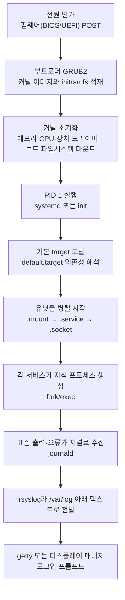
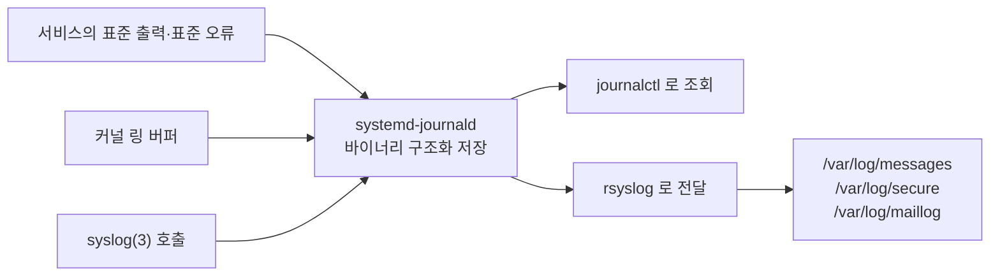
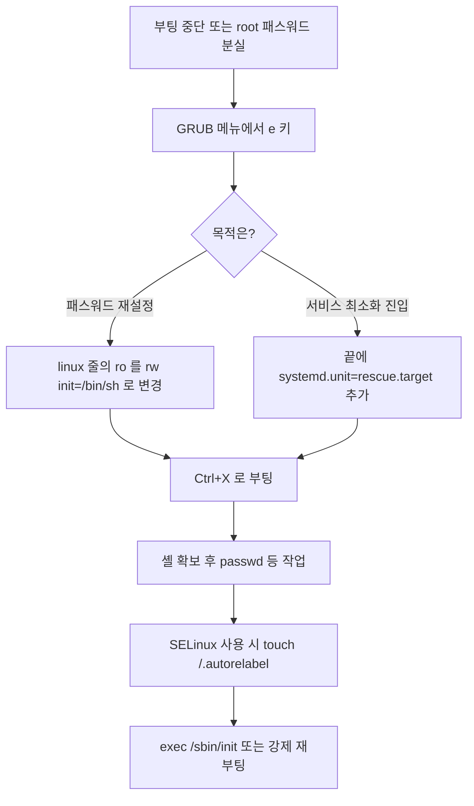
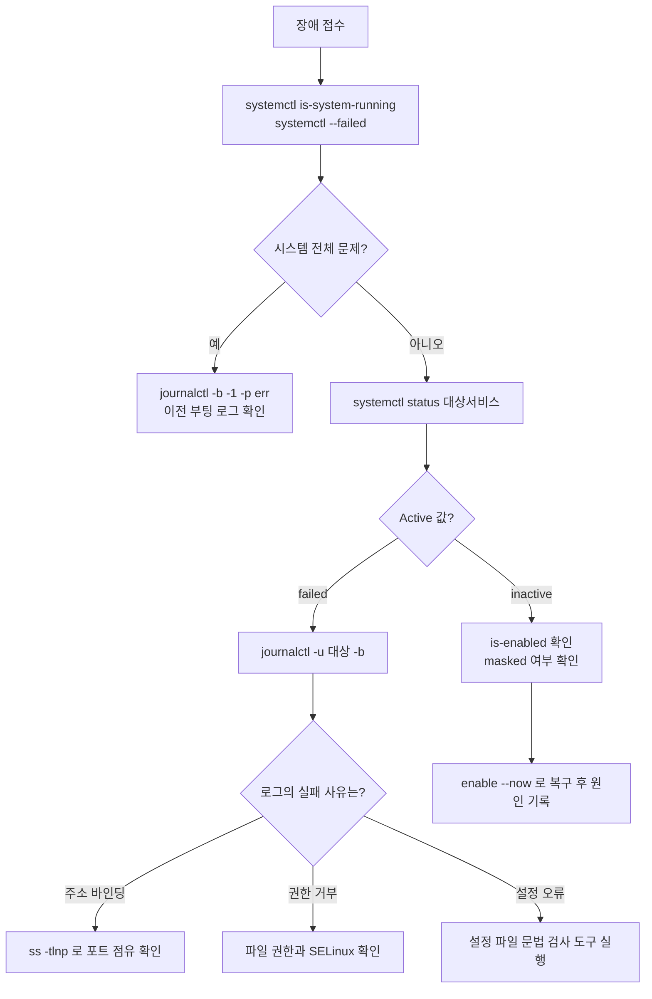

<Callout type="info">
  **이번 문서의 목표:** "웹 서버가 부팅 후에 안 떠 있다"는 한 줄짜리 장애 신고를 받았을 때, 부팅 단계 · 프로세스 상태 · 유닛 의존성 · 로그 위치를 순서대로 짚어 원인을 좁혀 갈 수 있게 된다.
</Callout>

## 왜 통합 정리가 필요한가

여기까지 우리는 부팅(03, 10편), 프로세스(09편), 서비스 관리(14편), 로그와 모니터링(16편)을 각각 따로 배웠습니다. 그런데 실제 시험 문제도, 실제 장애도 **한 영역 안에서만 일어나지 않습니다.**

기출을 보면 이런 식입니다. "GRUB 커널 인자에 `init=/bin/sh`를 넣는 이유는?"이라는 문제는 부팅 문제처럼 보이지만, 실은 **PID 1이 무엇이냐**는 프로세스 문제입니다. "`systemctl enable`과 `start`의 차이는?"은 서비스 문제처럼 보이지만, 실은 **부팅 시점 target의 의존성 그래프**에 무엇이 걸리느냐는 부팅 문제입니다.

그래서 이 편은 새 지식을 추가하지 않습니다. 대신 **하나의 시나리오를 따라가며 이미 배운 것들을 제자리에 다시 꽂아 넣습니다.**

> **쉽게 말하면:** 지금까지가 부품을 하나씩 뜯어본 시간이었다면, 이 편은 조립도를 펴 놓고 부품들이 어디에 끼워지는지 확인하는 시간입니다.

## 1. 전체 지도: 전원부터 로그까지

먼저 큰 그림을 한 장으로 봅니다. 앞으로의 모든 이야기가 이 그림 위에서 벌어집니다.



이 흐름에서 **경계선 세 개**를 기억하면 문제 풀이가 쉬워집니다.

| 경계 | 앞쪽 | 뒤쪽 | 이 경계가 시험에서 나오는 방식 |
|------|------|------|--------------------------------|
| 펌웨어와 부트로더 | POST, 부팅 장치 선택 | GRUB 메뉴, 커널 인자 | MBR과 GPT, `/boot/grub2/grub.cfg` 위치 |
| 커널과 사용자 공간 | 드라이버, 초기 램디스크 | PID 1, 모든 프로세스 | `dmesg`에 남는가, 저널에 남는가 |
| PID 1과 서비스 | target 결정 | 개별 데몬 | `systemctl` 대상이 되는가 아닌가 |

## 2. 시나리오: "부팅했는데 웹 서비스가 없다"

이제 실제 상황으로 들어갑니다. 다음 신고가 들어왔습니다.

```
서버를 재부팅했더니 웹사이트가 열리지 않습니다.
어제까지는 멀쩡했고, 어제 저녁에 방화벽 설정만 만졌습니다.
```

이 한 줄에서 확인해야 할 지점이 최소 다섯 군데입니다. 순서대로 좁혀 갑니다.

### 1단계 — 시스템이 목표 상태까지 갔는가

가장 먼저 볼 것은 개별 서비스가 아니라 **시스템 전체가 정상 상태에 도달했는지**입니다.

```bash
systemctl is-system-running     # running / degraded / maintenance
systemctl --failed              # 실패한 유닛만 나열
```

`degraded`가 나오면 "부팅은 끝났지만 실패한 유닛이 있다"는 뜻입니다. `maintenance`나 `emergency`라면 루트 파일시스템 마운트 자체가 실패했을 가능성이 큽니다.

여기서 03편과 10편의 개념이 걸립니다. systemd는 `default.target`이라는 **목표**를 정해 놓고, 그 target이 요구하는 유닛들을 의존성 순서에 맞춰 병렬로 올립니다.

| 전통 runlevel | systemd target | 상태 |
|---------------|----------------|------|
| 0 | `poweroff.target` | 종료 |
| 1 | `rescue.target` | 단일 사용자 모드 |
| 2, 3, 4 | `multi-user.target` | 텍스트 다중 사용자 |
| 5 | `graphical.target` | GUI 포함 다중 사용자 |
| 6 | `reboot.target` | 재부팅 |

```bash
systemctl get-default           # 현재 기본 target
systemctl set-default multi-user.target
systemctl isolate rescue.target # 지금 즉시 그 상태로 전환
```

**`set-default`는 다음 부팅부터, `isolate`는 지금 당장**입니다. 이 차이가 기출에서 반복적으로 나옵니다.

### 2단계 — 그 서비스가 부팅 시작 목록에 있는가

시스템은 정상인데 웹 서버만 없다면, 다음 질문은 "이 서비스가 애초에 자동 시작으로 등록되어 있었는가"입니다.

```bash
systemctl status httpd
systemctl is-enabled httpd      # enabled / disabled / static / masked
```

여기서 14편의 핵심이 나옵니다. **`start`와 `enable`은 완전히 다른 동작**입니다.

| 명령 | 하는 일 | 적용 시점 |
|------|---------|-----------|
| `systemctl start httpd` | 지금 프로세스를 띄운다 | 즉시. 재부팅하면 사라짐 |
| `systemctl enable httpd` | `WantedBy` 대상 target의 `.wants` 디렉터리에 심볼릭 링크를 만든다 | 다음 부팅부터 |
| `systemctl enable --now httpd` | 둘 다 | 즉시 + 다음 부팅 |
| `systemctl mask httpd` | 유닛을 `/dev/null`로 링크해 **시작 자체를 봉인** | 즉시. `start`도 거부됨 |

`enable`이 실제로 하는 일이 **심볼릭 링크 생성**이라는 점을 알면, 왜 이것이 "부팅 시 자동 시작"으로 이어지는지가 자연스럽게 설명됩니다. `multi-user.target`이 시작될 때 systemd는 `/etc/systemd/system/multi-user.target.wants/` 안의 링크들을 모두 읽어 함께 올리기 때문입니다.

그리고 **`masked`는 `disabled`보다 강한 상태**입니다. `disabled`는 수동으로 `start`하면 뜨지만, `masked`는 `start` 명령조차 거부합니다. "분명 `start`했는데 안 뜬다"는 상황의 흔한 정답입니다.

### 3단계 — 프로세스가 살아 있는가, 어떻게 죽었는가

`status` 출력의 형태를 읽는 법이 여기서 중요합니다.

```
● httpd.service - The Apache HTTP Server
   Loaded: loaded (/usr/lib/systemd/system/httpd.service; enabled)
   Active: failed (Result: exit-code) since Mon 2024-05-13 09:12:04 KST
  Process: 1832 ExecStart=/usr/sbin/httpd $OPTIONS (code=exited, status=1/FAILURE)
 Main PID: 1832 (code=exited, status=1/FAILURE)
```

읽는 순서는 이렇습니다.

<Steps>
1. **Loaded 줄**: 유닛 파일이 어디서 왔고, `enabled`인지 확인. `not-found`면 패키지가 없는 것입니다.
2. **Active 줄**: `failed`인지 `inactive`인지. `failed`는 시작을 시도했다가 죽은 것이고, `inactive`는 아예 시도조차 안 한 것입니다. 이 구분이 결정적입니다.
3. **Result 값**: `exit-code`는 프로그램이 스스로 오류 코드로 종료, `timeout`은 시간 초과, `signal`은 시그널로 강제 종료.
4. **status 숫자**: 종료 코드. `1/FAILURE`는 프로그램 자체 오류, `203/EXEC`는 실행 파일을 못 찾은 것입니다.
</Steps>

`inactive`라면 2단계로 되돌아갑니다. `failed`라면 프로그램이 뜨려다 실패한 것이므로 로그로 갑니다.

여기서 09편의 프로세스 개념이 연결됩니다. systemd는 서비스를 시작할 때 `fork()`로 자신을 복제한 뒤 `exec()`로 실제 데몬 프로그램을 덮어씌웁니다. 그 결과 데몬의 부모(PPID)는 **1번, 즉 systemd**가 됩니다.

```bash
ps -ef --forest | head -20
pstree -p 1 | head
```

전통적으로 데몬은 스스로 `fork()` 후 부모가 종료하는 방식으로 고아가 되어 init에 입양되었습니다. systemd 시대에는 그럴 필요가 없어서 `Type=simple`(포그라운드 유지)이 기본이 되었습니다. **`Type=forking`은 옛 방식의 데몬을 위한 호환 설정**입니다.

| Type 값 | 의미 | 주의점 |
|---------|------|--------|
| `simple` | 프로세스가 포그라운드에 계속 머문다 | 기본값 |
| `forking` | 프로그램이 스스로 자식을 만들고 부모는 종료 | `PIDFile` 지정이 필요할 수 있음 |
| `oneshot` | 한 번 실행하고 끝난다 | `RemainAfterExit`와 함께 자주 씀 |
| `notify` | 준비 완료를 systemd에 직접 알린다 | 의존 서비스 순서 제어에 유리 |

프로세스가 죽는 방식도 상태로 남습니다. 09편에서 본 프로세스 상태 코드를 다시 짚습니다.

| 코드 | 상태 | 뜻 |
|------|------|-----|
| `R` | Running | 실행 중이거나 실행 대기 |
| `S` | Sleeping | 이벤트를 기다리는 중단 가능 대기 |
| `D` | Uninterruptible sleep | 디스크 IO 등 중단 불가 대기. 이 상태가 쌓이면 IO 병목 |
| `T` | Stopped | 시그널로 정지됨 |
| `Z` | Zombie | 종료했으나 부모가 회수하지 않음 |

**좀비가 쌓이는 진짜 원인은 부모 프로세스**입니다. 좀비 자체는 `kill`로 없앨 수 없고, 부모를 종료시키면 PID 1이 입양해 정리합니다.

### 4단계 — 로그에서 근거를 찾는다

이제 16편의 영역입니다. systemd 환경에서 로그는 **두 갈래**로 흐릅니다.



이 구조가 시험에서 묻는 핵심입니다. **저널은 구조화된 바이너리이고, `/var/log` 아래 파일들은 텍스트**입니다. 그래서 `cat`으로 볼 수 있는 것과 없는 것이 갈립니다.

| 파일 | 형식 | 조회 방법 |
|------|------|-----------|
| `/var/log/messages` | 텍스트 | `cat`, `tail`, `grep` |
| `/var/log/secure` | 텍스트 | `cat`, `grep` (인증 관련) |
| `/var/log/wtmp` | 바이너리 | `last` |
| `/var/log/btmp` | 바이너리 | `lastb` (로그인 실패) |
| `/var/log/lastlog` | 바이너리 | `lastlog` |
| `/run/log/journal` 또는 `/var/log/journal` | 바이너리 | `journalctl` |

우리 시나리오에서 실제로 칠 명령은 이것들입니다.

```bash
journalctl -u httpd -b            # 이번 부팅의 httpd 로그만
journalctl -xe                    # 최근 로그 + 설명 힌트
journalctl -p err -b              # 이번 부팅의 err 이상만
journalctl --since "10 min ago"
```

`-b`는 "이번 부팅", `-b -1`은 "직전 부팅"입니다. 재부팅 후 장애를 볼 때 `-b -1`로 **죽기 직전의 로그**를 확인하는 것이 실무의 정석입니다.

한 가지 함정. 저널은 기본적으로 `/run` 아래에 저장되어 **재부팅하면 사라질 수 있습니다.** 영구 보존하려면 `/var/log/journal` 디렉터리를 만들거나 `journald.conf`에서 `Storage=persistent`로 설정해야 합니다.

로그 우선순위도 자주 나옵니다. **숫자가 작을수록 심각**합니다.

| 번호 | 이름 | 의미 |
|------|------|------|
| 0 | `emerg` (panic) | 시스템 사용 불가 |
| 1 | `alert` | 즉시 조치 필요 |
| 2 | `crit` | 심각한 오류 |
| 3 | `err` | 일반 오류 |
| 4 | `warning` | 경고 |
| 5 | `notice` | 정상이지만 주목할 사건 |
| 6 | `info` | 정보 |
| 7 | `debug` | 디버깅 |

rsyslog 설정에서 `*.warn`은 "**warning 이상 전부**"를 뜻하고, `*.=warn`은 "**warning만 정확히**"를 뜻합니다. 그리고 `kern.none`은 커널 시설을 제외하라는 뜻입니다. 세 기호의 조합이 그대로 문제로 나옵니다.

### 5단계 — 원인 확정

로그에서 이런 줄을 찾았다고 합시다.

```
httpd: could not bind to address 0.0.0.0:80
```

이제 퍼즐이 맞습니다. 어제 저녁에 만졌다는 방화벽 작업 중에 다른 프로세스가 80번을 쥐고 있거나, SELinux 정책이 바인딩을 막고 있는 것입니다.

```bash
ss -tlnp | grep :80              # 누가 80번을 쓰고 있나
getenforce                       # SELinux 상태
ausearch -m avc -ts recent       # SELinux 거부 기록
```

포인트는 **로그가 "무엇이 실패했는지"를 알려 주고, 그 실패의 문맥은 다른 영역의 지식으로 해석해야 한다**는 점입니다. 통합 이해가 필요한 이유가 여기 있습니다.

## 3. 부팅이 아예 안 될 때: 단일 사용자 모드

서비스 하나가 아니라 시스템 자체가 안 뜨는 경우도 자주 출제됩니다. root 패스워드를 잊었거나 `/etc/fstab`을 잘못 써서 부팅이 멈춘 상황입니다.



여기서 `init=/bin/sh`가 하는 일을 정확히 이해해야 합니다. 커널은 사용자 공간의 첫 프로세스를 실행할 때 **`init=` 인자로 지정된 프로그램을 PID 1로 띄웁니다.** 기본값은 systemd지만, 이것을 셸로 바꾸면 systemd도, 어떤 서비스도, 로그인 절차도 없이 곧바로 root 셸이 열립니다.

그래서 이 방법은 강력한 만큼 위험합니다. **물리적 접근이 가능하면 리눅스 root 패스워드는 사실상 방어선이 아니라는 뜻**이기 때문입니다. 그래서 실무에서는 GRUB에 패스워드를 걸고, 디스크를 암호화합니다.

| 커널 인자 | 효과 |
|-----------|------|
| `single` 또는 `1` | 단일 사용자 모드(SysV 계열 개념) |
| `systemd.unit=rescue.target` | 최소 서비스만 올린 상태 |
| `systemd.unit=emergency.target` | 루트만 읽기 전용 마운트, 거의 아무것도 안 올림 |
| `init=/bin/sh` | PID 1을 셸로 대체 |
| `rd.break` | initramfs 단계에서 멈춤 |

`rescue`와 `emergency`의 차이도 자주 묻습니다. **`rescue`는 로컬 파일시스템을 마운트하고 기본 서비스를 올리지만, `emergency`는 루트 파일시스템만 읽기 전용으로 붙인 최소 상태**입니다.

## 4. 한 문제에 여러 영역이 섞이는 방식

시험이 통합 문제를 만드는 전형적인 패턴 세 가지를 정리합니다.

### 패턴 1 — 명령은 서비스, 답은 부팅

"재부팅해도 유지되게 하려면?"이라는 조건이 붙으면 `start`가 아니라 `enable`, `sysctl -w`가 아니라 `/etc/sysctl.conf` 편집, `ip addr add`가 아니라 설정 파일 수정입니다. **"지금"과 "다음 부팅부터"를 가르는 축**입니다.

| 지금만 | 영구 |
|--------|------|
| `systemctl start` | `systemctl enable` |
| `sysctl -w net.ipv4.ip_forward=1` | `/etc/sysctl.conf`에 기재 |
| `ip addr add` | 배포판 네트워크 설정 파일 |
| `mount /dev/sdb1 /data` | `/etc/fstab`에 등록 |
| `swapon /swapfile` | `/etc/fstab`에 등록 |

### 패턴 2 — 증상은 로그, 답은 프로세스

"`/var/log/messages`가 갑자기 커졌다", "디스크가 꽉 찼다"는 문제의 답은 로그 파일 자체가 아니라 **로그를 쏟아내는 프로세스와 로그 순환 설정**입니다. `logrotate`가 여기서 등장합니다.

```bash
cat /etc/logrotate.conf
ls /etc/logrotate.d/
logrotate -d /etc/logrotate.conf   # 테스트 실행
```

한 가지 함정. **이미 삭제한 로그 파일이라도 프로세스가 그 파일을 열고 있으면 디스크 공간이 반환되지 않습니다.** `df`는 꽉 찼다는데 `du`로는 아무것도 안 나오는 고전적 상황입니다. 해당 프로세스를 재시작하거나 `lsof | grep deleted`로 찾아야 합니다.

### 패턴 3 — 조건은 성능, 답은 프로세스 상태

"부하가 높은데 CPU는 놀고 있다"는 조건이 나오면 답은 IO 대기입니다. `top`의 `wa` 값과 `ps`의 `D` 상태가 근거가 됩니다.

| 지표 | 의미 | 높을 때 의심할 곳 |
|------|------|-------------------|
| `us` | 사용자 공간 CPU | 애플리케이션 연산 |
| `sy` | 커널 CPU | 시스템 콜 과다, 컨텍스트 스위칭 |
| `wa` | IO 대기 | 디스크 병목 |
| `si` | 소프트 인터럽트 | 네트워크 폭주 |
| `load average` | 실행 대기 + 중단 불가 대기 프로세스 수 | CPU 코어 수와 비교해 판단 |

**load average는 CPU 사용률이 아닙니다.** 실행 대기 큐 길이에 `D` 상태 프로세스까지 포함한 값이라, 디스크가 느려도 치솟습니다. 코어가 4개인 시스템에서 load 4.0은 "딱 포화"를 뜻합니다.

## 5. 통합 점검 순서 한 장 요약

장애 신고를 받았을 때 어디부터 볼지 순서로 굳혀 둡니다.



## 핵심 정리

- 부팅은 펌웨어 → 부트로더 → 커널 → PID 1 → target 도달 → 유닛 시작 순으로 진행되며, 각 단계의 흔적이 남는 곳이 다르다. 커널 단계는 `dmesg`, 그 이후는 저널이다.
- `start`는 지금, `enable`은 다음 부팅부터다. `enable`의 실체는 target의 `.wants` 디렉터리에 심볼릭 링크를 만드는 것이며, `mask`는 `start`조차 거부하는 더 강한 차단이다.
- `systemctl status`에서 `inactive`와 `failed`는 다른 상황이다. 전자는 시작을 시도하지 않은 것, 후자는 시도했다가 죽은 것이므로 조사 방향이 갈린다.
- 로그는 journald가 구조화된 바이너리로 모으고 rsyslog가 텍스트 파일로 전달한다. `wtmp`·`btmp`·`lastlog`는 바이너리라 전용 명령이 필요하다.
- 단일 사용자 모드의 핵심은 PID 1을 교체하거나 최소 target으로 진입하는 것이며, `rescue`는 로컬 파일시스템까지, `emergency`는 루트만 읽기 전용으로 올린다.

## 마무리 복습

<Quiz
  questionNumber={1}
  question="서비스를 systemctl start 로 정상 기동했는데 재부팅 후에는 실행되어 있지 않다. 원인으로 가장 알맞은 것은?"
  options={['해당 유닛이 enable 되어 있지 않아 부팅 시 target 의 wants 목록에 포함되지 않았다', 'start 명령은 원래 일회성이라 15분 후 자동 종료된다', '유닛 파일이 손상되어 status 가 not-found 로 표시된다', '기본 target 이 poweroff.target 으로 설정되어 있다']}
  correctAnswer={1}
  explanation="systemctl start 는 현재 실행 중인 시스템에서 프로세스를 즉시 띄우는 명령이고, 부팅 시 자동 시작 여부와는 무관하다. 자동 시작은 systemctl enable 이 담당하며, 이 명령은 유닛의 WantedBy 가 가리키는 target 의 wants 디렉터리에 심볼릭 링크를 만든다. 부팅 때 systemd 는 그 디렉터리를 읽어 함께 올리므로 링크가 없으면 시작되지 않는다."
  optionExplanations={['정답. start 는 즉시 실행, enable 은 부팅 시 자동 시작으로 역할이 분리되어 있다.', 'start 로 띄운 서비스가 시간이 지나 스스로 종료되는 동작은 없다.', 'not-found 라면 방금 한 start 자체가 실패했을 것이므로 전제와 맞지 않는다.', 'poweroff.target 이 기본이면 부팅 즉시 종료되어 시스템 자체가 사용 불가 상태가 된다.']}
/>

<Quiz
  questionNumber={2}
  question="systemctl status 출력에서 Active 항목이 inactive (dead) 로 나올 때와 failed 로 나올 때의 차이로 알맞은 것은?"
  options={['inactive 는 유닛 파일이 없는 상태이고 failed 는 파일은 있는 상태다', 'inactive 는 시작을 시도하지 않은 상태이고 failed 는 시작을 시도했다가 비정상 종료된 상태다', 'inactive 는 마스크된 상태이고 failed 는 비활성화된 상태다', '둘은 표기만 다를 뿐 동일한 상태를 의미한다']}
  correctAnswer={2}
  explanation="inactive 는 현재 실행 중이 아니라는 뜻으로, 아직 시작을 시도하지 않았거나 정상적으로 정지된 상태다. failed 는 시작을 시도했지만 종료 코드나 시그널, 타임아웃으로 비정상 종료되었음을 뜻하며 Result 항목에 사유가 함께 표시된다. 따라서 inactive 는 왜 시작되지 않았는지를, failed 는 왜 죽었는지를 조사해야 한다."
  optionExplanations={['유닛 파일이 없으면 Loaded 항목이 not-found 로 표시되며 Active 값과는 별개의 정보다.', '정답. 시작 시도 여부가 두 상태를 가르는 기준이다.', '마스크 여부는 Loaded 항목에 masked 로 표시되며 Active 값과 다른 축이다.', '조사 방향이 완전히 달라지므로 동일한 상태로 볼 수 없다.']}
/>

<Quiz
  questionNumber={3}
  question="GRUB 편집 화면에서 커널 인자에 init=/bin/sh 를 추가해 부팅했을 때 일어나는 일로 알맞은 것은?"
  options={['systemd 가 먼저 실행된 뒤 셸이 추가로 열린다', '네트워크만 비활성화된 상태로 정상 부팅된다', 'GRUB 자체가 셸 모드로 전환되어 커널은 적재되지 않는다', '커널이 사용자 공간 첫 프로세스로 셸을 실행하므로 PID 1 이 셸이 된다']}
  correctAnswer={4}
  explanation="커널은 초기화를 마친 뒤 사용자 공간의 첫 프로세스를 실행하는데, 그 대상을 결정하는 것이 init= 인자다. 기본값은 systemd 지만 /bin/sh 로 지정하면 systemd 를 거치지 않고 셸이 곧바로 PID 1 로 실행된다. 따라서 어떤 서비스도 올라오지 않고 로그인 절차도 없이 root 셸이 열리며, 이 때문에 root 패스워드 재설정에 사용된다."
  optionExplanations={['init= 로 지정한 프로그램이 systemd 를 대체하므로 systemd 는 실행되지 않는다.', '네트워크만 꺼지는 것이 아니라 서비스 전체가 시작되지 않는다.', 'GRUB 은 커널을 정상적으로 적재하며 인자만 달라진다.', '정답. 사용자 공간의 첫 프로세스가 셸로 대체된다.']}
/>

<Quiz
  questionNumber={4}
  question="다음 중 텍스트 형식이 아니어서 cat 명령으로 내용을 확인할 수 없는 로그 파일은?"
  options={['/var/log/messages', '/var/log/secure', '/var/log/btmp', '/var/log/dmesg']}
  correctAnswer={3}
  explanation="btmp 는 로그인 실패 기록을 저장하는 바이너리 파일이며 lastb 명령으로 조회한다. 같은 계열인 wtmp 는 last, lastlog 는 lastlog 명령을 쓴다. 반면 messages 와 secure 는 rsyslog 가 기록하는 텍스트 파일이라 cat 이나 grep 으로 바로 읽을 수 있다."
  optionExplanations={['rsyslog 가 남기는 일반 시스템 로그로 텍스트 파일이다.', '인증 관련 로그를 담은 텍스트 파일이다.', '정답. 로그인 실패 기록을 담은 바이너리 파일로 lastb 로 조회한다.', '부팅 시 커널 메시지를 텍스트로 저장한 파일이다.']}
/>

<Quiz
  questionNumber={5}
  question="rsyslog 설정에서 모든 facility 의 warning 이상 로그를 기록하되 커널 로그는 제외하려고 한다. 알맞은 설정은?"
  options={['*.=warn;kern.none', '*.warn;kern.none', '*.warn;kern.!=none', '*.=warn;kern.!none']}
  correctAnswer={2}
  explanation="rsyslog 에서 facility.priority 표기의 기본 의미는 해당 우선순위 이상 전부다. 따라서 warning 이상은 별도 기호 없이 warn 으로 쓴다. 등호를 붙인 =warn 은 warning 등급만 정확히 기록하라는 뜻이므로 조건과 다르다. 특정 facility 를 제외할 때는 그 facility 에 none 을 지정한다."
  optionExplanations={['=warn 은 warning 등급만 기록하므로 이상 전부라는 조건에 맞지 않는다.', '정답. warn 이상 전부에서 kern facility 만 제외한다.', 'kern 을 제외하는 표기는 none 이며 느낌표와 등호 조합은 이 목적에 쓰지 않는다.', '앞부분이 warning 등급만으로 한정되어 조건에 어긋난다.']}
/>

<Quiz
  questionNumber={6}
  question="시스템 부하 평균(load average)이 8.0 으로 높은데 top 의 CPU 사용률에서 us 와 sy 는 낮고 wa 값이 매우 높다. 가장 먼저 의심해야 할 것은?"
  options={['CPU 코어 수 부족', '메모리 누수로 인한 스왑 부족', '네트워크 대역폭 포화', '디스크 입출력 병목']}
  correctAnswer={4}
  explanation="load average 는 실행 대기 중인 프로세스뿐 아니라 중단 불가 대기 상태인 D 상태 프로세스까지 포함한다. wa 는 CPU 가 디스크 입출력 완료를 기다리며 놀고 있는 비율이므로, 이 값이 높으면서 부하가 높다면 CPU 가 아니라 저장 장치가 병목이다. ps 로 D 상태 프로세스를 찾고 iostat 으로 디스크 지표를 확인하는 것이 다음 단계다."
  optionExplanations={['CPU 부족이라면 us 나 sy 값이 함께 높게 나타난다.', '스왑 문제라면 si 와 so 스왑 지표와 메모리 사용량에서 먼저 드러난다.', '네트워크 포화는 주로 소프트 인터럽트 지표와 인터페이스 통계에서 확인된다.', '정답. wa 값이 높다는 것은 디스크 입출력 대기가 부하의 원인임을 뜻한다.']}
/>

<Quiz
  questionNumber={7}
  question="systemctl mask 명령에 대한 설명으로 알맞은 것은?"
  options={['유닛을 /dev/null 로 링크해 수동 start 명령까지 거부되도록 봉인한다', 'disable 과 동일하게 자동 시작만 해제한다', '유닛 파일을 영구히 삭제한다', '유닛의 우선순위를 최하위로 조정한다']}
  correctAnswer={1}
  explanation="mask 는 해당 유닛 이름을 /etc/systemd/system 아래에서 /dev/null 로 심볼릭 링크해 유닛 자체를 존재하지 않는 것처럼 만든다. 그 결과 자동 시작은 물론 수동 start 명령도 거부된다. 다른 패키지가 의존성으로 서비스를 끌어올리는 것까지 막아야 할 때 사용하며, 해제는 unmask 로 한다."
  optionExplanations={['정답. disable 보다 강한 차단으로 수동 시작까지 막는다.', 'disable 은 수동 start 를 허용하므로 동일하지 않다.', '유닛 파일은 삭제되지 않으며 unmask 로 되돌릴 수 있다.', 'systemd 에는 유닛 우선순위를 이런 식으로 조정하는 개념이 없다.']}
/>

<Quiz
  questionNumber={8}
  question="rescue.target 과 emergency.target 의 차이로 알맞은 것은?"
  options={['rescue 는 네트워크까지 올리고 emergency 는 네트워크만 제외한다', '두 target 은 이름만 다르고 동작이 같다', 'rescue 는 로컬 파일시스템을 마운트하고 기본 서비스를 올리지만 emergency 는 루트만 읽기 전용으로 붙인 최소 상태다', 'emergency 는 GUI 를 포함하고 rescue 는 텍스트 모드다']}
  correctAnswer={3}
  explanation="rescue.target 은 전통적인 단일 사용자 모드에 대응하며 로컬 파일시스템을 마운트하고 최소한의 기본 서비스를 시작한 뒤 root 셸을 제공한다. emergency.target 은 그보다 더 아래 단계로, 루트 파일시스템만 읽기 전용으로 마운트한 거의 아무것도 없는 상태다. 따라서 파일을 수정하려면 먼저 읽기 쓰기로 다시 마운트해야 한다."
  optionExplanations={['두 target 모두 네트워크 서비스를 기본으로 올리지 않는다.', '복구 가능한 작업의 범위가 달라 동일하다고 볼 수 없다.', '정답. 마운트 범위와 시작 서비스의 양이 다르다.', '두 target 모두 GUI 와 무관한 텍스트 기반 복구 상태다.']}
/>

## 참고 자료

- [systemctl(1) 매뉴얼 페이지 (freedesktop.org)](https://www.freedesktop.org/software/systemd/man/latest/systemctl.html)
- [systemd.unit(5) — 유닛 파일과 의존성 (freedesktop.org)](https://www.freedesktop.org/software/systemd/man/latest/systemd.unit.html)
- [journalctl(1) 매뉴얼 페이지 (freedesktop.org)](https://www.freedesktop.org/software/systemd/man/latest/journalctl.html)
- [runlevel(8) 매뉴얼 페이지 (man7.org)](https://man7.org/linux/man-pages/man8/runlevel.8.html)
- [Red Hat Enterprise Linux 9 — Managing systemd (docs.redhat.com)](https://docs.redhat.com/en/documentation/red_hat_enterprise_linux/9/html/using_systemd_unit_files_to_customize_and_optimize_your_system/index)
