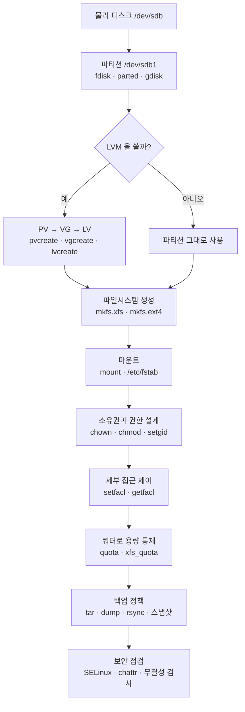
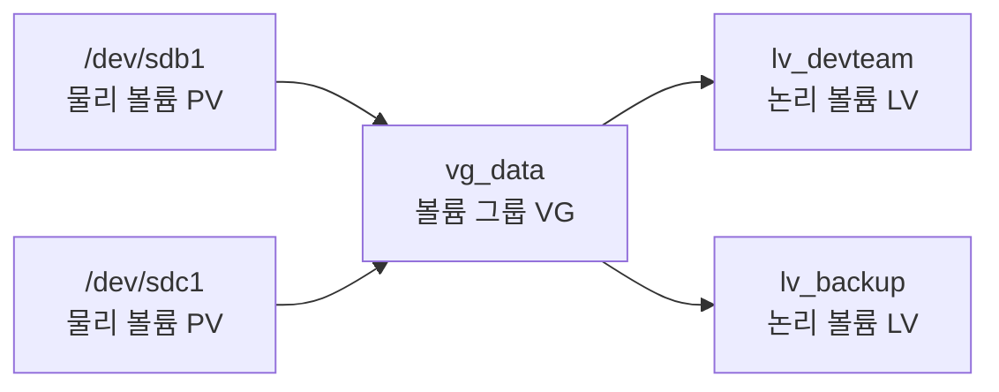
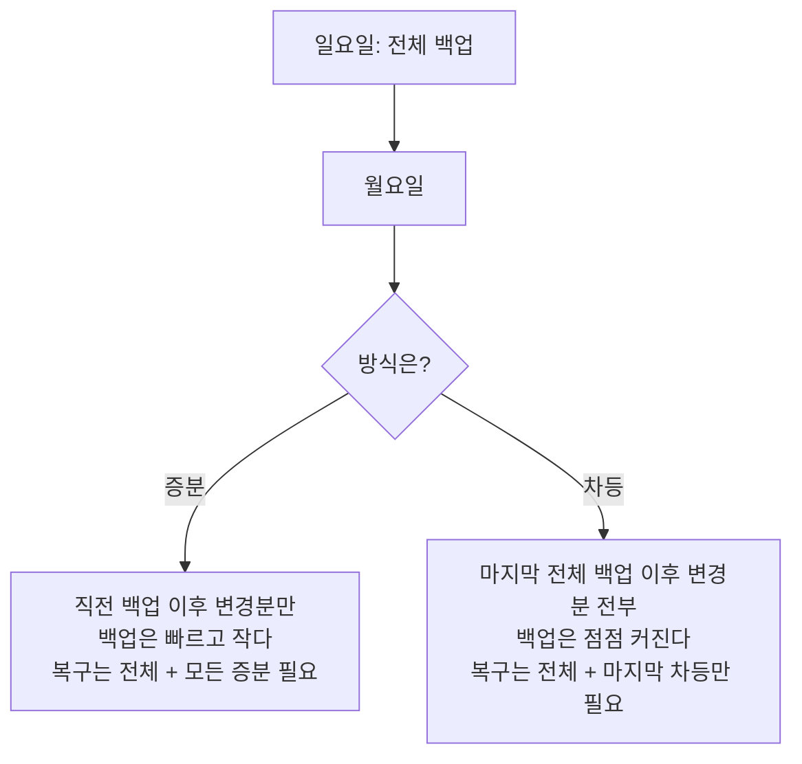
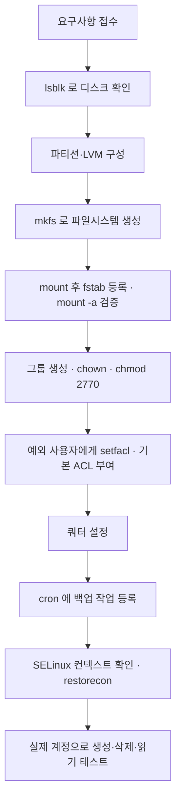

<Callout type="info">
  **이번 문서의 목표:** "부서 공유 디렉터리를 만들어 달라"는 요청 하나를 받았을 때 디스크 추가부터 마운트·권한 설계·ACL·백업·보안 점검까지 순서대로 설계할 수 있고, 각 단계에서 시험이 노리는 함정을 짚어낼 수 있게 된다.
</Callout>

## 이 편의 축: 데이터가 놓이고 지켜지는 길

앞의 24편이 "**시간의 축**"이었다면(전원 → 부팅 → 서비스 → 로그), 이 편은 "**공간의 축**"입니다. 물리 디스크라는 바닥에서 시작해 그 위에 논리 구조를 얹고, 그 위에 접근 제어를 걸고, 마지막에 사본을 떠서 보호하는 층층 구조입니다.



이 계단을 한 칸씩 올라가면서, 각 칸에서 배운 개념을 다시 꺼내 씁니다.

> **쉽게 말하면:** 땅을 나누고(파티션), 건물을 세우고(파일시스템), 주소를 붙이고(마운트), 열쇠를 나눠 주고(권한), 사본을 금고에 넣는(백업) 순서입니다. 순서가 바뀌면 아무것도 되지 않습니다.

## 1. 시나리오 시작: 부서 공유 디스크 만들기

요청은 이렇습니다.

```
개발팀 공유 저장소를 만들어 주세요.
- 새 디스크 100GB를 /data/devteam 으로 붙일 것
- 개발팀원만 읽고 쓸 수 있어야 함
- 그 안에 새로 만드는 파일도 자동으로 팀 소유가 되어야 함
- 감사 담당자 1명은 읽기만 가능해야 함
- 매일 밤 백업할 것
```

한 문단이지만 이 안에 13편(디스크·LVM·쿼터), 08편(마운트), 11편(권한·setgid·ACL), 17편(백업·보안)이 전부 들어 있습니다.

### 1단계 — 파티션과 파일시스템

먼저 디스크를 인식했는지 확인합니다.

```bash
lsblk
fdisk -l /dev/sdb
```

여기서 **MBR과 GPT의 차이**가 걸립니다.

| 항목 | MBR | GPT |
|------|-----|-----|
| 최대 디스크 크기 | 2TB | 사실상 제한 없음 |
| 파티션 개수 | 주 4개 (확장·논리로 우회) | 기본 128개 |
| 파티션 테이블 사본 | 1개 | 디스크 앞뒤 2개 |
| 대응 펌웨어 | 주로 BIOS | 주로 UEFI |
| 도구 | `fdisk` | `gdisk`, `parted` |

100GB니까 MBR도 가능하지만, 현대 시스템은 GPT가 기본입니다. 파티션을 만든 뒤 **타입 코드**를 지정하는데, 이 코드가 기출 단골입니다.

| 코드 | 의미 |
|------|------|
| `82` | Linux swap |
| `83` | Linux (일반 파일시스템) |
| `8e` | Linux LVM |
| `fd` | Linux raid autodetect |

타입 코드는 **커널에 힌트를 주는 표식**이지 강제력이 아닙니다. `83`으로 두고도 LVM에 넣을 수 있습니다. 다만 부팅 시 자동 감지와 도구의 동작이 달라지므로 맞춰 주는 것이 정석입니다.

### LVM을 쓸 것인가

공유 저장소는 나중에 용량이 늘어날 가능성이 큽니다. 그렇다면 LVM이 유리합니다.



```bash
pvcreate /dev/sdb1
vgcreate vg_data /dev/sdb1
lvcreate -L 100G -n lv_devteam vg_data
```

명령 이름의 접두사가 계층을 그대로 나타냅니다. **`pv`는 물리 볼륨, `vg`는 볼륨 그룹, `lv`는 논리 볼륨**이고, 뒤에 붙는 동사가 `create`·`display`·`scan`·`remove`·`extend`입니다. 이 조합을 알면 처음 보는 명령도 뜻을 유추할 수 있습니다.

| 계층 | 조회 | 확장 |
|------|------|------|
| PV | `pvs`, `pvdisplay`, `pvscan` | – |
| VG | `vgs`, `vgdisplay`, `vgscan` | `vgextend vg_data /dev/sdc1` |
| LV | `lvs`, `lvdisplay`, `lvscan` | `lvextend -L +50G /dev/vg_data/lv_devteam` |

**논리 볼륨을 늘린 뒤에는 파일시스템도 따로 늘려야 합니다.** 이 두 단계를 하나로 착각하는 것이 흔한 실수입니다.

```bash
lvextend -L +50G /dev/vg_data/lv_devteam
xfs_growfs /data/devteam         # XFS
resize2fs /dev/vg_data/lv_devteam # ext4
```

XFS는 **축소가 불가능**하다는 점도 기억해야 합니다. ext4는 언마운트 후 축소할 수 있습니다.

### 파일시스템 생성

```bash
mkfs.xfs /dev/vg_data/lv_devteam
```

| 파일시스템 | 특징 | 전용 도구 |
|------------|------|-----------|
| ext4 | 널리 쓰이는 저널링, 축소 가능 | `resize2fs`, `e2fsck`, `dumpe2fs`, `tune2fs` |
| XFS | RHEL 7 이후 기본, 대용량에 강함, 축소 불가 | `xfs_growfs`, `xfs_repair`, `xfs_quota`, `xfsdump` |
| Btrfs | 스냅샷·서브볼륨 내장 | `btrfs` 하위 명령 |
| swap | 스왑 영역 | `mkswap`, `swapon` |

**파일시스템이 다르면 쓸 수 있는 도구가 달라진다**는 점이 시험의 핵심 함정입니다. XFS에서 `resize2fs`는 안 되고, XFS에서 `dump`도 안 됩니다. `xfsdump`를 써야 합니다.

### 2단계 — 마운트와 fstab

```bash
mkdir -p /data/devteam
mount /dev/vg_data/lv_devteam /data/devteam
```

이건 지금만 유효합니다. 재부팅해도 유지하려면 `/etc/fstab`에 등록합니다.

```
/dev/vg_data/lv_devteam  /data/devteam  xfs  defaults,noatime  0 0
```

fstab의 여섯 필드를 순서대로 짚습니다.

| 필드 | 내용 | 주의점 |
|------|------|--------|
| 1 | 장치 | 이름이 바뀔 수 있으므로 `UUID=` 권장 |
| 2 | 마운트 지점 | 미리 디렉터리가 있어야 함 |
| 3 | 파일시스템 종류 | `xfs`, `ext4`, `swap`, `nfs` 등 |
| 4 | 마운트 옵션 | `defaults`는 rw·suid·dev·exec·auto·nouser·async 묶음 |
| 5 | dump 대상 여부 | 보통 0 |
| 6 | fsck 검사 순서 | 루트는 1, 나머지는 2, 검사 안 함은 0 |

**장치 이름 대신 UUID를 쓰는 이유**가 자주 출제됩니다. 디스크를 추가하거나 순서가 바뀌면 `/dev/sdb`가 `/dev/sdc`가 될 수 있고, 그러면 부팅이 실패합니다. UUID는 파일시스템에 새겨진 값이라 바뀌지 않습니다. `blkid`로 확인합니다.

보안과 직결되는 마운트 옵션도 정리합니다.

| 옵션 | 효과 |
|------|------|
| `ro` | 읽기 전용 |
| `noexec` | 이 파일시스템의 실행 파일 실행 금지 |
| `nosuid` | setuid·setgid 비트 무시 |
| `nodev` | 장치 파일 해석 금지 |
| `noatime` | 접근 시각 기록 안 함(성능 향상) |

`/tmp`나 사용자 업로드 디렉터리에 `noexec,nosuid,nodev`를 거는 것이 보안 관례입니다. **업로드된 파일이 실행되는 경로 자체를 막는** 조치입니다.

fstab을 잘못 쓰면 부팅이 멈춥니다. 그래서 편집 후 재부팅 전에 반드시 검증합니다.

```bash
mount -a          # fstab 전체를 지금 시도해 본다
findmnt --verify  # 문법과 대상 검증
```

## 2. 권한 설계: 요구사항을 비트로 번역하기

이제 11편의 영역입니다. 요구사항을 다시 봅니다.

- 개발팀원만 읽고 쓴다
- 새로 만든 파일도 자동으로 팀 소유가 된다
- 감사 담당자 1명은 읽기만 한다

### 기본 권한 설계

```bash
groupadd devteam
chown root:devteam /data/devteam
chmod 2770 /data/devteam
```

`2770`을 한 자리씩 해석합니다.

| 자리 | 값 | 의미 |
|------|-----|------|
| 특수 | 2 | setgid |
| 소유자 | 7 | 읽기·쓰기·실행 |
| 그룹 | 7 | 읽기·쓰기·실행 |
| 기타 | 0 | 접근 없음 |

여기서 **디렉터리에 걸린 setgid**가 요구사항 2번을 정확히 해결합니다. 디렉터리에 setgid가 있으면 **그 안에서 새로 만들어지는 파일과 하위 디렉터리의 그룹이 부모 디렉터리의 그룹을 상속**합니다. 그렇지 않으면 각자의 기본 그룹이 붙어 팀원끼리 서로 접근하지 못하는 상황이 생깁니다.

특수 비트 세 가지를 다시 정리합니다. **파일에 걸릴 때와 디렉터리에 걸릴 때 의미가 다릅니다.**

| 비트 | 8진수 | 파일에 걸리면 | 디렉터리에 걸리면 |
|------|-------|---------------|-------------------|
| setuid | 4000 | 실행 시 소유자 권한으로 동작 | 리눅스에서는 효과 없음 |
| setgid | 2000 | 실행 시 그룹 권한으로 동작 | 내부 생성물이 그룹을 상속 |
| sticky | 1000 | 현대 리눅스에서 무의미 | 소유자만 자기 파일을 삭제 가능 |

기호 표기에서 읽는 법도 중요합니다.

| 표기 | 뜻 |
|------|-----|
| `-rwsr-xr-x` | setuid 있고 소유자 실행 권한도 있음 |
| `-rwSr--r--` | setuid 있으나 소유자 실행 권한 없음(대문자 S) |
| `drwxrwsr-x` | 디렉터리에 setgid |
| `drwxrwxrwt` | sticky (전형적인 `/tmp`) |

**대문자는 "해당 비트는 켜졌으나 실행 권한이 없다"는 경고 신호**입니다. `passwd` 명령이 `-rwsr-xr-x`인 이유도 다시 짚어 둘 만합니다. 일반 사용자가 `/etc/shadow`를 직접 못 여는데도 자기 패스워드를 바꿀 수 있는 것은, 실행되는 순간 root 권한을 빌리기 때문입니다.

### umask가 개입하는 지점

파일과 디렉터리가 새로 만들어질 때의 권한은 **기준값에서 umask 비트를 빼서** 정해집니다.

| 대상 | 기준값 | umask 022 | umask 027 | umask 077 |
|------|--------|-----------|-----------|-----------|
| 파일 | 666 | 644 | 640 | 600 |
| 디렉터리 | 777 | 755 | 750 | 700 |

**파일 기준값이 777이 아니라 666인 이유**는 새로 만든 데이터 파일에 실행 권한을 주지 않기 위해서입니다. 이 한 줄이 계산 문제의 절반입니다.

계산 방식은 뺄셈이 아니라 **비트 제거**(AND NOT)입니다. 대개는 뺄셈과 결과가 같지만, umask에 실행 비트가 들어가면 어긋납니다. umask 003이면 파일은 666에서 실행 비트가 아닌 쓰기 비트만 걸려 664가 됩니다. 단순 뺄셈으로 663이라 답하면 틀립니다.

공유 디렉터리 환경이라면 팀원들의 umask도 조정해야 합니다.

```bash
umask 007        # 현재 셸에만
```

영구 적용은 `/etc/profile`, `/etc/bashrc`, 또는 사용자별 `~/.bashrc`에 기록합니다. 여기서 04편의 프로파일 로딩 순서가 다시 걸립니다.

### 3단계 — ACL로 예외 처리

요구사항 3번, "감사 담당자 1명은 읽기만"은 소유자·그룹·기타 세 칸으로는 해결되지 않습니다. 세 칸이 이미 다 쓰였기 때문입니다. 이럴 때가 ACL이 필요한 정확한 지점입니다.

```bash
setfacl -m u:auditor:rx /data/devteam
setfacl -m d:u:auditor:rx /data/devteam    # 기본(default) ACL
getfacl /data/devteam
```

**`d:` 접두사가 붙은 것이 기본 ACL**입니다. 디렉터리에만 설정할 수 있고, **그 안에서 새로 만들어지는 항목이 자동으로 물려받을 규칙**을 정합니다. setgid가 그룹 소유를 상속시킨다면, 기본 ACL은 권한 규칙 자체를 상속시킵니다.

`getfacl` 출력을 읽는 법입니다.

```
# file: data/devteam
# owner: root
# group: devteam
user::rwx
user:auditor:r-x
group::rwx
mask::rwx
other::---
default:user::rwx
default:user:auditor:r-x
```

여기서 **`mask` 항목**이 함정입니다. mask는 "**이름이 붙은 사용자·그룹 항목과 그룹 소유자 항목에 허용되는 상한선**"입니다. mask가 `r--`이면 ACL에 `rwx`를 줬더라도 실제로는 `r--`만 유효합니다.

그리고 `ls -l`에서 권한 문자열 끝에 **`+` 기호**가 붙으면 그 파일에 ACL이 있다는 신호입니다.

```
drwxrws---+ 2 root devteam 6 May 13 10:00 devteam
```

ACL과 umask의 관계도 자주 묻습니다. **기본 ACL이 설정된 디렉터리에서는 새 파일 권한을 umask가 아니라 기본 ACL이 결정합니다.** umask 077인 사용자가 만들어도 기본 ACL 규칙대로 그룹 권한이 붙습니다.

### 4단계 — 쿼터로 폭주 막기

공유 저장소는 한 사람이 다 채워 버리는 사고가 잦습니다.

```bash
# ext4 계열
mount -o remount,usrquota,grpquota /data/devteam
quotacheck -cugm /data/devteam
quotaon /data/devteam
edquota -u devuser

# XFS
mount -o remount,uquota,gquota /data/devteam
xfs_quota -x -c "limit bsoft=8g bhard=10g devuser" /data/devteam
```

| 개념 | 의미 |
|------|------|
| soft limit | 넘어도 즉시 막지 않고 유예 기간 동안 경고 |
| hard limit | 절대 넘을 수 없는 상한 |
| grace period | soft를 넘은 뒤 허용되는 유예 시간 |
| block 한도 | 용량 기준 제한 |
| inode 한도 | 파일 개수 기준 제한 |

**XFS 쿼터는 전용 도구인 `xfs_quota`를 쓰고, 마운트 시점에 활성화해야 한다**는 점이 기출 포인트입니다. ext 계열에서 쓰던 `quotacheck` 방식이 XFS에는 적용되지 않습니다.

## 3. 데이터를 지키는 층: 백업

권한은 "잘못 보는 것"을 막지만 "**사라지는 것**"은 막지 못합니다. 그래서 백업이 별도 층으로 존재합니다.

### 백업 유형



| 유형 | 백업 시간 | 저장 용량 | 복구 절차 |
|------|-----------|-----------|-----------|
| 전체(full) | 길다 | 크다 | 가장 단순 |
| 증분(incremental) | 짧다 | 작다 | 전체 + 그 이후 모든 증분 순서대로 |
| 차등(differential) | 중간 | 중간 | 전체 + 마지막 차등 하나 |

**증분은 백업이 싸고 복구가 비싸며, 차등은 그 반대**입니다. 이 대칭 관계가 문제로 나옵니다.

### 도구별 역할

| 도구 | 성격 | 대표 사용 |
|------|------|-----------|
| `tar` | 아카이브 묶기 | `tar cvfz backup.tar.gz /data` |
| `tar -g` | 증분 백업(스냅샷 파일 사용) | `tar -g snap.list -cvf inc.tar /data` |
| `dump` / `restore` | ext 계열 전용 파일시스템 백업 | `dump -0u -f /dev/st0 /dev/sda1` |
| `xfsdump` / `xfsrestore` | XFS 전용 | 레벨 0–9 지정 |
| `cpio` | 목록을 받아 아카이브 | 파이프로 `find` 결과를 받아 `cpio -o`로 생성, 복원은 `cpio -i` |
| `dd` | 블록 단위 그대로 복사 | 디스크 이미지, 파일시스템 무관 |
| `rsync` | 차이만 전송하는 동기화 | `rsync -avz /data/ backup:/data/` |

여기서 **파일시스템 종류가 도구를 제약한다**는 규칙이 다시 등장합니다.

| 백업 도구 | ext4 | XFS |
|-----------|------|-----|
| `tar` | 가능 | 가능 |
| `cpio` | 가능 | 가능 |
| `rsync` | 가능 | 가능 |
| `dd` | 가능 | 가능 |
| `dump` | 가능 | **불가** |
| `xfsdump` | 불가 | 가능 |

`dump`가 XFS에서 안 되는 이유는 이 도구가 **ext 계열의 내부 구조를 직접 읽는 방식**이기 때문입니다. `tar`나 `rsync`처럼 파일 단위로 접근하는 도구는 파일시스템을 가리지 않습니다.

`tar` 옵션도 정리해 둡니다. **`c`는 생성, `x`는 추출, `t`는 목록, `r`은 기존 아카이브에 추가**입니다. 압축 없이 만든 `.tar`에 파일을 덧붙일 때 `r`을 씁니다. 압축된 아카이브에는 덧붙일 수 없다는 점도 알아 두세요.

| 옵션 | 의미 |
|------|------|
| `c` | 새 아카이브 생성 |
| `x` | 추출 |
| `t` | 내용 목록 보기 |
| `r` | 기존 아카이브에 추가 |
| `v` | 진행 상황 출력 |
| `f` | 아카이브 파일 이름 지정 |
| `z` / `j` / `J` | gzip / bzip2 / xz 압축 |
| `p` | 권한 보존 |
| `g` | 증분 백업 스냅샷 파일 지정 |

### LVM 스냅샷

LVM을 썼다면 **정지 없이 일관된 시점 사본**을 만들 수 있습니다.

```bash
lvcreate -L 10G -s -n snap_devteam /dev/vg_data/lv_devteam
mount -o ro /dev/vg_data/snap_devteam /mnt/snap
tar cvzf /backup/devteam.tar.gz -C /mnt/snap .
lvremove /dev/vg_data/snap_devteam
```

스냅샷은 **원본과 달라진 블록만 저장**하므로 처음에는 거의 공간을 쓰지 않습니다. 다만 변경이 많아져 할당한 크기를 넘으면 스냅샷이 무효화됩니다. 스냅샷은 백업이 아니라 **백업을 뜨기 위한 정지 화면**이라는 점을 기억해야 합니다.

## 4. 보안 층: 권한 위에 한 겹 더

### 파일 속성(chattr)

권한과는 별개로 파일시스템 수준의 속성을 걸 수 있습니다.

| 속성 | 효과 |
|------|------|
| `+i` | 불변(immutable). root조차 수정·삭제·이름변경 불가 |
| `+a` | 추가 전용(append only). 내용 추가만 가능 |
| `+A` | atime 갱신 안 함 |

```bash
chattr +a /var/log/audit.log
lsattr /var/log/audit.log
```

**로그 파일에 `+a`를 걸면 공격자가 침입 흔적을 지우는 것을 막을 수 있습니다.** 반대로 `+i`가 걸린 파일은 root 계정으로도 수정할 수 없어, "권한은 분명 root인데 왜 안 되지"라는 상황의 정답이 됩니다.

### SELinux

권한(DAC, 임의 접근 제어) 위에 얹히는 **강제 접근 제어(MAC)** 층입니다.

| 모드 | 동작 |
|------|------|
| `enforcing` | 정책 위반을 차단하고 기록 |
| `permissive` | 차단하지 않고 기록만 |
| `disabled` | 완전 비활성 |

```bash
getenforce
setenforce 0                 # 일시적으로 permissive
ls -Z /data/devteam          # 보안 컨텍스트 확인
restorecon -Rv /data/devteam # 기본 정책대로 라벨 복구
```

**DAC와 MAC의 순서**가 시험 포인트입니다. 먼저 일반 권한을 통과해야 하고, 그다음 SELinux 정책을 통과해야 합니다. 둘 중 하나라도 막으면 접근이 거부됩니다. 그래서 "권한은 777인데도 안 된다"는 증상의 유력한 범인이 SELinux입니다.

`setenforce`는 **일시적**이고, 영구 변경은 `/etc/selinux/config`를 고쳐야 합니다. 24편에서 본 "지금 vs 다음 부팅" 축이 여기서도 그대로 작동합니다.

### 무결성과 취약점 점검

| 도구 | 역할 |
|------|------|
| `tripwire`, `AIDE` | 파일 무결성 검사(변조 탐지) |
| `nessus`, `OpenVAS` | 원격 취약점 스캔 |
| `nmap` | 포트·서비스 스캔 |
| `wireshark`, `tcpdump` | 패킷 분석 |
| `john`, `hydra` | 패스워드 강도 점검 |

**"변조를 탐지"는 tripwire·AIDE, "취약점을 알려 주고 대처 방안을 제시"는 nessus**라는 대응이 그대로 문제로 나옵니다.

## 5. 최종 점검 순서



마지막 칸이 중요합니다. **설계대로 되었는지는 실제 계정으로 파일을 만들어 봐야 확인됩니다.** `su - devuser`로 전환해 파일을 만들고, 그룹이 상속되는지, 감사 계정으로는 쓰기가 막히는지 직접 봐야 합니다.

## 핵심 정리

- 저장 구조는 물리 디스크 → 파티션(또는 LVM) → 파일시스템 → 마운트 순으로 쌓이며, LV를 늘린 뒤에는 파일시스템도 `xfs_growfs`나 `resize2fs`로 따로 늘려야 한다.
- fstab은 장치·마운트지점·종류·옵션·dump·fsck 순 여섯 필드이며, 장치는 이름이 바뀔 수 있으므로 UUID로 적는다. 편집 후 `mount -a`로 검증한다.
- 공유 디렉터리의 정석은 `chmod 2770`이다. 디렉터리 setgid가 내부 생성물의 그룹을 상속시키고, 예외 사용자는 ACL로 처리하며 기본 ACL은 `d:` 접두사로 준다.
- 새 파일 권한은 파일 666·디렉터리 777에서 umask 비트를 제거해 정해지고, 기본 ACL이 있는 디렉터리에서는 umask 대신 기본 ACL이 결정한다.
- 증분은 백업이 가볍고 복구가 무거우며 차등은 그 반대다. `dump`는 ext 전용이라 XFS에서는 `xfsdump`를 써야 하고, `tar`·`cpio`·`rsync`·`dd`는 파일시스템을 가리지 않는다.
- 접근 제어는 DAC(권한·ACL) 통과 후 MAC(SELinux)까지 통과해야 하며, `chattr +i`나 `+a`는 root 권한보다도 앞서 작동한다.

## 마무리 복습

<Quiz
  questionNumber={1}
  question="여러 사용자가 함께 쓰는 공유 디렉터리에서 새로 생성되는 파일의 그룹 소유자가 자동으로 디렉터리의 그룹과 같아지게 하려면 어떤 설정이 필요한가?"
  options={['디렉터리에 sticky bit 를 설정한다', '디렉터리에 setgid 비트를 설정한다', '디렉터리에 setuid 비트를 설정한다', '디렉터리 권한을 777 로 변경한다']}
  correctAnswer={2}
  explanation="디렉터리에 setgid 비트가 설정되면 그 안에서 새로 만들어지는 파일과 하위 디렉터리가 생성자의 기본 그룹이 아니라 부모 디렉터리의 그룹을 상속받는다. 이 설정이 없으면 팀원마다 자기 기본 그룹이 붙어 서로 접근하지 못하는 문제가 생긴다. 8진수로는 2000 자리이며 chmod 2770 형태로 함께 지정한다."
  optionExplanations={['sticky bit 는 자기 파일만 삭제할 수 있게 제한하는 비트로 그룹 상속과 무관하다.', '정답. 디렉터리 setgid 가 그룹 소유 상속을 담당한다.', '리눅스에서 디렉터리에 걸린 setuid 는 효과가 없다.', '권한 숫자를 넓히는 것은 소유 그룹 상속과 관계가 없고 보안만 나빠진다.']}
/>

<Quiz
  questionNumber={2}
  question="umask 값이 027 인 사용자가 새 디렉터리를 만들었을 때 부여되는 권한으로 알맞은 것은?"
  options={['755', '700', '640', '750']}
  correctAnswer={4}
  explanation="디렉터리의 기준 권한은 777 이고 여기서 umask 에 지정된 비트가 제거된다. 027 은 소유자에서 0, 그룹에서 2(쓰기), 기타에서 7(전부)을 제거하라는 뜻이므로 결과는 7, 5, 0 즉 750 이 된다. 파일이라면 기준값이 666 이므로 640 이 된다."
  optionExplanations={['755 는 umask 022 일 때의 디렉터리 권한이다.', '700 은 umask 077 일 때의 디렉터리 권한이다.', '640 은 같은 umask 에서 파일에 적용되는 권한이다.', '정답. 777 에서 027 비트를 제거하면 750 이다.']}
/>

<Quiz
  questionNumber={3}
  question="XFS 파일시스템으로 구성된 파티션을 백업하려고 한다. 사용할 수 없는 도구는?"
  options={['tar', 'rsync', 'dump', 'dd']}
  correctAnswer={3}
  explanation="dump 와 restore 는 ext2, ext3, ext4 파일시스템의 내부 구조를 직접 읽어 백업하는 전용 도구이므로 XFS 에서는 사용할 수 없다. XFS 에는 같은 역할을 하는 xfsdump 와 xfsrestore 가 별도로 존재한다. 반면 tar 와 rsync 는 파일 단위로 접근하고 dd 는 블록 단위로 복사하므로 파일시스템 종류를 가리지 않는다."
  optionExplanations={['파일 단위로 묶는 아카이브 도구라 파일시스템과 무관하게 동작한다.', '파일 단위 동기화 도구이므로 XFS 에서도 문제없이 쓸 수 있다.', '정답. ext 계열 전용 도구이며 XFS 에서는 xfsdump 를 사용해야 한다.', '블록 장치를 그대로 복사하므로 파일시스템 종류에 영향받지 않는다.']}
/>

<Quiz
  questionNumber={4}
  question="ls -l 결과에서 권한 문자열이 -rwSr--r-- 로 표시되었다. 이에 대한 설명으로 알맞은 것은?"
  options={['setuid 비트가 설정되어 있으나 소유자의 실행 권한이 없는 상태다', 'setgid 비트가 설정되어 있고 그룹 실행 권한도 있다', 'sticky bit 가 설정된 디렉터리다', 'ACL 이 추가로 설정되어 있다는 표시다']}
  correctAnswer={1}
  explanation="소유자 실행 권한 자리에 s 가 오면 setuid 와 실행 권한이 모두 있는 상태이고, 대문자 S 가 오면 setuid 비트는 켜졌지만 실행 권한이 없는 상태다. 실행할 수 없는 파일에 setuid 만 걸려 있으므로 실질적으로 의미가 없고 설정 실수일 가능성이 크다. ACL 이 있으면 문자열 끝에 더하기 기호가 붙는다."
  optionExplanations={['정답. 대문자 S 는 비트는 켜졌으나 실행 권한이 없음을 뜻한다.', 'setgid 는 그룹 실행 권한 자리에 표시되며 여기서는 소유자 자리다.', '디렉터리라면 맨 앞이 d 여야 하고 sticky 는 기타 실행 권한 자리에 표시된다.', 'ACL 존재는 권한 문자열 끝의 더하기 기호로 표시된다.']}
/>

<Quiz
  questionNumber={5}
  question="논리 볼륨을 lvextend 로 50GB 늘렸는데 df 로 확인한 사용 가능 용량이 그대로다. 이유로 알맞은 것은?"
  options={['볼륨 그룹에 여유 공간이 없어 명령이 실패했다', 'df 명령은 LVM 볼륨의 크기를 표시하지 못한다', '재부팅해야만 용량 변경이 반영된다', '논리 볼륨 크기만 늘어났을 뿐 그 위의 파일시스템은 아직 확장되지 않았다']}
  correctAnswer={4}
  explanation="LVM 의 논리 볼륨은 블록 장치이고 그 위에 파일시스템이 별도로 올라가 있다. lvextend 는 블록 장치의 크기만 늘리므로 파일시스템은 여전히 이전 크기를 자기 영역으로 인식한다. XFS 는 마운트된 상태에서 xfs_growfs 로, ext4 는 resize2fs 로 파일시스템을 따로 확장해야 실제 사용 가능 용량이 늘어난다."
  optionExplanations={['여유 공간이 없었다면 lvextend 자체가 오류로 끝나 크기가 늘지 않는다.', 'df 는 마운트된 파일시스템의 크기를 정상적으로 표시한다.', '파일시스템 확장은 온라인으로 가능하며 재부팅과 무관하다.', '정답. 파일시스템 확장은 별도 단계다.']}
/>

<Quiz
  questionNumber={6}
  question="/etc/services 파일을 root 사용자도 수정하거나 삭제할 수 없도록 완전히 잠그려고 한다. 알맞은 명령은?"
  options={['chmod 400 /etc/services', 'chattr +a /etc/services', 'chattr +i /etc/services', 'setfacl -m u:root:r /etc/services']}
  correctAnswer={3}
  explanation="chattr +i 는 불변 속성으로, 이 속성이 걸린 파일은 root 권한으로도 내용 수정, 삭제, 이름 변경, 링크 생성이 모두 차단된다. 해제하려면 먼저 chattr -i 로 속성을 제거해야 한다. chattr +a 는 추가만 허용하는 속성이라 로그 파일 보호에 쓰이며 수정 자체를 막지는 못한다."
  optionExplanations={['권한 설정은 root 에게 적용되지 않아 root 는 여전히 수정할 수 있다.', '추가 전용 속성이므로 내용 덧붙이기가 가능하다.', '정답. 불변 속성은 root 의 수정과 삭제까지 차단한다.', 'ACL 역시 root 를 제약하지 못한다.']}
/>

<Quiz
  questionNumber={7}
  question="디렉터리에 setfacl -m d:g:devteam:rwx 를 실행했다. d 접두사의 의미로 알맞은 것은?"
  options={['해당 항목을 즉시 삭제하라는 뜻이다', '디렉터리 자신에게만 적용하고 하위에는 적용하지 말라는 뜻이다', '이 디렉터리 안에서 새로 생성되는 항목이 상속할 기본 ACL 을 정의한다', '기존 권한을 무시하고 강제로 덮어쓰라는 뜻이다']}
  correctAnswer={3}
  explanation="d 는 default 를 뜻하며 디렉터리에만 설정할 수 있는 기본 ACL 이다. 이 규칙은 디렉터리 자신의 접근 판정에는 쓰이지 않고, 그 안에서 새로 만들어지는 파일과 하위 디렉터리가 물려받을 초기 ACL 이 된다. 기본 ACL 이 있는 디렉터리에서는 새 파일의 권한을 umask 가 아니라 이 규칙이 결정한다."
  optionExplanations={['ACL 항목 삭제는 x 옵션 또는 b 옵션으로 수행한다.', '기본 ACL 은 오히려 하위 생성물에 적용되는 규칙이다.', '정답. 새로 생성되는 항목이 상속하는 기본 ACL 이다.', 'ACL 은 기존 권한 체계를 대체하지 않고 함께 판정에 참여한다.']}
/>

<Quiz
  questionNumber={8}
  question="일요일에 전체 백업을 하고 평일에는 차등(differential) 백업을 수행하는 정책에서 목요일에 장애가 발생했다. 복구에 필요한 백업본은?"
  options={['일요일 전체 백업과 수요일 차등 백업', '일요일 전체 백업과 월·화·수 차등 백업 전부', '수요일 차등 백업만', '일요일 전체 백업만']}
  correctAnswer={1}
  explanation="차등 백업은 언제나 마지막 전체 백업 시점 이후에 변경된 모든 내용을 담는다. 따라서 수요일 차등 백업 안에 월요일과 화요일의 변경분이 이미 포함되어 있어 전체 백업 하나와 가장 최근 차등 백업 하나만 있으면 복구된다. 반면 증분 백업이었다면 전체 백업과 그 이후의 모든 증분본을 순서대로 적용해야 한다."
  optionExplanations={['정답. 차등은 전체 백업 하나와 마지막 차등 하나만 있으면 된다.', '모든 중간 백업이 필요한 것은 증분 방식의 특징이다.', '전체 백업이 없으면 기준이 되는 원본이 없어 복구할 수 없다.', '전체 백업만으로는 이후 변경분이 모두 유실된다.']}
/>

<Quiz
  questionNumber={9}
  question="파일 권한이 777 로 설정되어 있는데도 특정 서비스가 그 파일에 접근하지 못하고 있다. 확인해야 할 항목으로 가장 알맞은 것은?"
  options={['파일의 소유자 계정 이름', 'SELinux 의 보안 컨텍스트와 동작 모드', '파일의 확장자', '파일시스템의 UUID']}
  correctAnswer={2}
  explanation="리눅스의 접근 판정은 일반 권한과 ACL 로 이루어진 임의 접근 제어를 먼저 통과한 뒤, SELinux 같은 강제 접근 제어 정책까지 통과해야 최종 허용된다. 권한이 완전히 열려 있는데도 거부된다면 SELinux 컨텍스트가 서비스의 정책과 맞지 않을 가능성이 크다. ls -Z 로 라벨을 확인하고 restorecon 으로 기본 라벨을 복구하거나 감사 로그에서 거부 기록을 조회한다."
  optionExplanations={['권한이 777 이면 소유자가 누구든 접근 자체는 허용된다.', '정답. 권한 위에 얹힌 강제 접근 제어가 차단하고 있을 수 있다.', '리눅스에서 확장자는 접근 권한 판정에 관여하지 않는다.', 'UUID 는 파일시스템 식별자일 뿐 접근 제어와 무관하다.']}
/>

<Quiz
  questionNumber={10}
  question="/etc/fstab 에서 장치를 /dev/sdb1 대신 UUID 로 지정하는 주된 이유는?"
  options={['UUID 표기가 마운트 속도를 높이기 때문이다', '장치 이름 표기는 최신 커널에서 더 이상 지원되지 않기 때문이다', 'UUID 를 쓰면 파일시스템 검사를 건너뛸 수 있기 때문이다', '디스크 추가나 인식 순서 변화로 장치 이름이 바뀌어도 올바른 파일시스템을 찾기 위해서다']}
  correctAnswer={4}
  explanation="sda, sdb 같은 장치 이름은 커널이 장치를 인식한 순서에 따라 붙으므로 디스크를 추가하거나 케이블 위치를 바꾸면 다른 디스크에 할당될 수 있다. 이 상태로 부팅하면 엉뚱한 파일시스템을 마운트하거나 마운트에 실패해 부팅이 멈춘다. UUID 는 파일시스템 생성 시 기록되는 고유 식별자라 이런 변동에 영향받지 않으며 blkid 로 확인한다."
  optionExplanations={['UUID 사용은 성능과 관계가 없다.', '장치 이름 표기도 여전히 유효하며 다만 권장되지 않을 뿐이다.', 'fsck 수행 여부는 fstab 의 여섯 번째 필드가 결정한다.', '정답. 장치 이름의 가변성 문제를 해결하기 위한 표기다.']}
/>

## 참고 자료

- [Red Hat Enterprise Linux 9 — Managing file system permissions (docs.redhat.com)](https://docs.redhat.com/en/documentation/red_hat_enterprise_linux/9/html/managing_file_systems/index)
- [umask(2) 매뉴얼 페이지 (man7.org)](https://man7.org/linux/man-pages/man2/umask.2.html)
- [acl(5) 매뉴얼 페이지 (man7.org)](https://man7.org/linux/man-pages/man5/acl.5.html)
- [openSUSE Security Guide — Access Control Lists in Linux (doc.opensuse.org)](https://doc.opensuse.org/documentation/leap/security/html/book-security/cha-security-acls.html)
- [lvm(8) 매뉴얼 페이지 (man7.org)](https://man7.org/linux/man-pages/man8/lvm.8.html)
- [GNU tar 공식 매뉴얼 (gnu.org)](https://www.gnu.org/software/tar/manual/tar.html)
