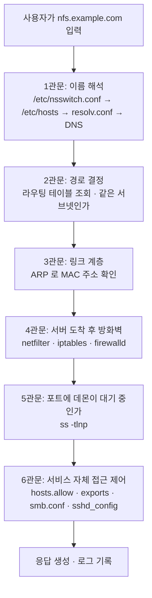
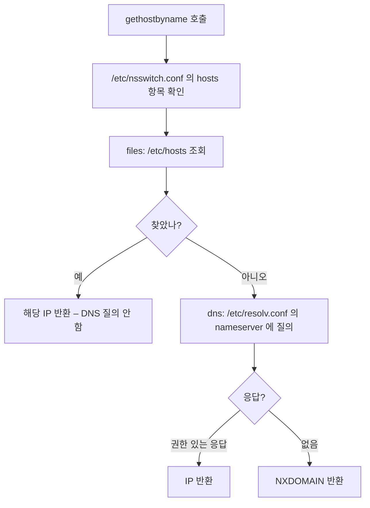
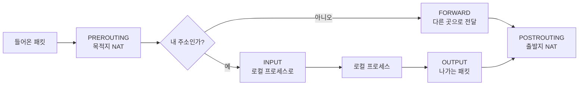
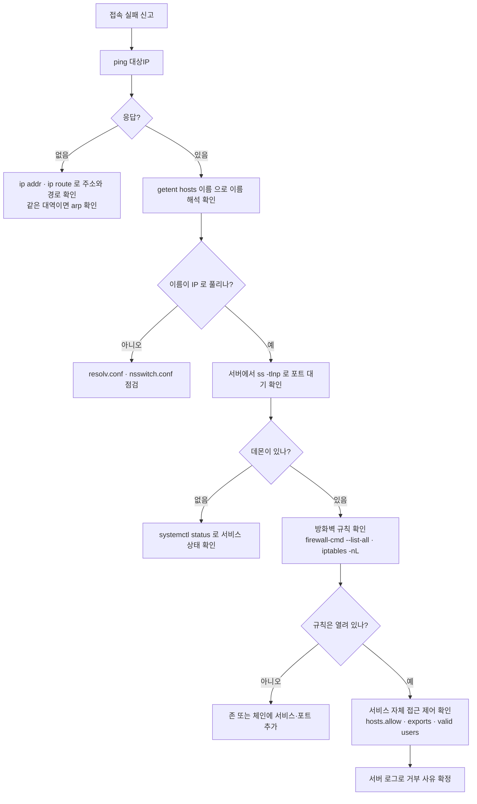

<Callout type="info">
  **이번 문서의 목표:** "서버에 접속이 안 된다"는 신고 하나로부터 이름 해석 → 라우팅 → 방화벽 → 데몬 → 서비스 자체 접근 제어라는 다섯 관문을 순서대로 짚어 어디서 막혔는지 특정할 수 있게 된다.
</Callout>

## 이 편의 축: 패킷 한 개의 여행

24편이 시간의 축, 25편이 공간의 축이었다면 이 편은 "**경로의 축**"입니다. 클라이언트가 주소를 입력한 순간부터 서버의 데몬이 응답을 돌려줄 때까지, 패킷이 통과해야 하는 관문을 순서대로 세워 놓고 각 관문에서 배운 지식을 다시 씁니다.



**진단은 언제나 이 순서를 거꾸로가 아니라 앞에서부터** 밟아야 합니다. 이름 해석이 안 되는데 방화벽을 뜯어 봐야 소용이 없기 때문입니다.

> **쉽게 말하면:** 편지가 도착하려면 주소를 알아내고(DNS), 길을 찾고(라우팅), 문패를 확인하고(ARP), 정문 경비를 지나(방화벽), 담당 부서가 근무 중이어야 하고(데몬), 그 부서가 나를 응대해야(서비스 접근 제어) 합니다.

## 1. 계층 모델을 다시 세우는 이유

각 관문이 어느 계층에서 일하는지 알아야 도구를 고를 수 있습니다.

| OSI 계층 | TCP/IP 계층 | PDU | 대표 프로토콜 | 확인 도구 |
|----------|-------------|-----|---------------|-----------|
| 7 응용 | 응용 | 데이터 | HTTP, DNS, SSH, SMB | `curl`, `dig` |
| 6 표현 | 응용 | 데이터 | TLS, 인코딩 | – |
| 5 세션 | 응용 | 데이터 | 세션 관리 | – |
| 4 전송 | 전송 | 세그먼트 | TCP, UDP | `ss`, `netstat` |
| 3 네트워크 | 인터넷 | 패킷 | IP, ICMP | `ping`, `ip route`, `traceroute` |
| 2 데이터링크 | 네트워크 접근 | 프레임 | Ethernet, ARP | `arp`, `ip neigh`, `ethtool` |
| 1 물리 | 네트워크 접근 | 비트 | 케이블, 신호 | `mii-tool`, `ethtool` |

**전송 계층이 세그먼트, 네트워크 계층이 패킷, 데이터링크 계층이 프레임**이라는 순서는 그대로 기출입니다. 순서를 섞어 놓고 고르게 하는 유형이 반복됩니다.

증상별로 어느 계층을 먼저 볼지도 정리해 둡니다.

| 증상 | 의심 계층 | 첫 확인 |
|------|-----------|---------|
| 이름은 안 되는데 IP로는 된다 | 응용(DNS) | `dig`, `/etc/resolv.conf` |
| 같은 대역은 되는데 밖은 안 된다 | 네트워크(라우팅) | `ip route` 기본 경로 |
| ping은 되는데 서비스는 안 된다 | 전송·방화벽 | `ss -tlnp`, 방화벽 규칙 |
| 아예 링크가 없다 | 물리·데이터링크 | `ip link`, `ethtool` |

## 2. 1관문 — 이름 해석

리눅스에서 이름을 IP로 바꾸는 절차는 **`/etc/nsswitch.conf`가 지휘합니다.**

```
hosts:  files dns myhostname
```

이 줄이 "먼저 파일(`/etc/hosts`)을 보고, 없으면 DNS에 물어보라"는 순서를 정합니다. 그래서 흔히 말하는 "hosts 파일이 DNS보다 우선"이라는 규칙의 근거는 nsswitch.conf입니다. 순서를 바꾸면 우선순위도 바뀝니다.



관련 파일을 정리합니다.

| 파일 | 역할 |
|------|------|
| `/etc/nsswitch.conf` | 이름 해석 소스와 순서 결정 |
| `/etc/hosts` | 로컬 정적 매핑 |
| `/etc/resolv.conf` | `nameserver`, `search`, `domain` 지정 |
| `/etc/host.conf` | 구형 리졸버 설정 |

`resolv.conf`의 `search` 항목도 시험 포인트입니다. `search example.com`이 있으면 `www`만 입력해도 `www.example.com`으로 보완해 질의합니다. 그리고 **`nameserver`는 최대 3개까지 유효**하며, 앞의 것이 응답하지 않을 때 순차적으로 넘어갑니다.

DNS 자체의 구조도 다시 짚습니다.

| 레코드 | 의미 | 주의 |
|--------|------|------|
| `A` | 이름 → IPv4 | |
| `AAAA` | 이름 → IPv6 | |
| `PTR` | IP → 이름 | **역방향 존에서만 사용** |
| `CNAME` | 별칭 | 다른 이름을 가리킴 |
| `MX` | 메일 서버 | 우선순위 숫자를 함께 씀 |
| `NS` | 존의 네임서버 | |
| `SOA` | 존의 권한 정보 | 시리얼·갱신주기 포함 |

존 파일에서 **FQDN 끝에 점을 찍지 않으면 뒤에 도메인이 덧붙습니다.** `mail MX 0 ihd.or.kr`이라고 쓰면 실제로는 `ihd.or.kr.ihd.or.kr`이 되어 버립니다. 그래서 정답은 `mail MX 0 ihd.or.kr.`처럼 마지막 점이 있는 형태입니다.

BIND 설정 파일에서 자주 나오는 지시자도 함께 봅니다.

| 지시자 | 의미 |
|--------|------|
| `forwarders` | 질의를 넘길 상위 서버 목록 |
| `forward only` | 자체 재귀 없이 넘기기만 함 |
| `allow-query` | 질의를 허용할 대상 |
| `allow-transfer` | 존 전송을 허용할 대상(슬레이브) |
| `listen-on` | 대기할 주소와 포트 |

진단 도구는 이렇습니다.

```bash
dig www.example.com
dig @8.8.8.8 www.example.com    # 특정 서버에 직접 질의
host www.example.com
nslookup www.example.com
getent hosts www.example.com    # nsswitch 순서를 그대로 따름
```

**`dig`는 DNS만 물어보고 `getent hosts`는 nsswitch 순서를 그대로 밟습니다.** 그래서 "`dig`는 되는데 접속은 안 된다"거나 그 반대인 상황에서 두 도구의 차이가 결정적 단서가 됩니다.

## 3. 2관문 — 주소와 경로

### 주소 체계와 서브넷 계산

IP 주소는 네트워크 부분과 호스트 부분으로 나뉘고, 그 경계를 넷마스크가 정합니다.

| 프리픽스 | 넷마스크 | 블록 크기 | 사용 가능 호스트 |
|----------|----------|-----------|------------------|
| /24 | 255.255.255.0 | 256 | 254 |
| /25 | 255.255.255.128 | 128 | 126 |
| /26 | 255.255.255.192 | 64 | 62 |
| /27 | 255.255.255.224 | 32 | 30 |
| /28 | 255.255.255.240 | 16 | 14 |
| /30 | 255.255.255.252 | 4 | 2 |

계산 절차를 고정해 둡니다.

<Steps>
1. **블록 크기**를 구한다. 256에서 마지막 옥텟 넷마스크 값을 뺀다. /26이면 256에서 192를 빼 64.
2. **네트워크 주소**를 구한다. 해당 옥텟 값을 블록 크기로 나눈 몫에 블록 크기를 곱한다. 150이면 64로 나눠 몫 2, 2 곱하기 64는 128.
3. **브로드캐스트 주소**는 다음 네트워크 주소 바로 앞. 128 더하기 64 빼기 1은 191.
4. **호스트 범위**는 네트워크 주소 다음부터 브로드캐스트 앞까지. 129부터 190.
5. **게이트웨이**는 관례적으로 그 범위의 첫 주소 또는 마지막 주소. 대개 129.
</Steps>

192.168.3.150/26을 이 절차로 풀면 네트워크 192.168.3.128, 브로드캐스트 192.168.3.191, 호스트 129부터 190입니다. 게이트웨이 후보는 129 또는 190이며, **다른 서브넷에 속한 주소는 게이트웨이가 될 수 없다**는 점이 이 유형의 핵심입니다.

사설 주소 대역도 함께 외웁니다.

| 클래스 | 대역 | 프리픽스 |
|--------|------|----------|
| A | 10.0.0.0 – 10.255.255.255 | /8 |
| B | 172.16.0.0 – 172.31.255.255 | /12 |
| C | 192.168.0.0 – 192.168.255.255 | /16 |

### 라우팅

```bash
ip route show
ip route add 10.10.0.0/16 via 192.168.1.254
ip route add default via 192.168.1.1
```

라우팅 테이블은 **가장 구체적인(프리픽스가 긴) 경로가 우선**입니다. `0.0.0.0/0`은 가장 덜 구체적이므로 다른 어떤 경로에도 해당하지 않을 때만 쓰이며, 이것이 기본 게이트웨이입니다.

| 구형 명령 | 현대 명령 |
|-----------|-----------|
| `ifconfig` | `ip addr`, `ip link` |
| `route` | `ip route` |
| `arp` | `ip neigh` |
| `netstat` | `ss` |
| `netstat -rn` | `ip route show` |

**`net-tools` 계열은 유지보수가 중단되었고 `iproute2` 계열이 표준**입니다. 다만 시험에는 양쪽이 모두 나오므로 대응 관계를 알아야 합니다.

영구 설정은 배포판마다 다릅니다.

| 계열 | 설정 위치 | 도구 |
|------|-----------|------|
| RHEL 7·8 | `/etc/sysconfig/network-scripts/ifcfg-이름` | `nmcli`, `nmtui` |
| RHEL 9 | NetworkManager 키파일 | `nmcli` |
| Debian 구형 | `/etc/network/interfaces` | `ifup`, `ifdown` |
| Ubuntu 현대 | `/etc/netplan/*.yaml` | `netplan apply` |

여기서 24편의 "지금 vs 다음 부팅" 축이 또 나옵니다. **`ip addr add`는 재부팅하면 사라지고, 설정 파일에 쓴 것만 남습니다.**

### 3관문 — ARP

같은 서브넷 안이면 라우터를 거치지 않고 직접 프레임을 보냅니다. 그러려면 상대의 MAC 주소가 필요하고, 그것을 물어보는 것이 ARP입니다.

```bash
arp -a
ip neigh show
```

**ARP는 브로드캐스트로 물어보므로 같은 브로드캐스트 도메인 안에서만 동작합니다.** 다른 대역의 MAC 주소는 알 수 없고, 알 필요도 없습니다. 그 방향의 패킷은 게이트웨이의 MAC으로 보내면 되기 때문입니다.

## 4. 4관문 — 방화벽

패킷이 서버에 도착했습니다. 이제 커널의 netfilter가 검사합니다.



체인의 역할을 확실히 구분해야 합니다.

| 체인 | 대상 |
|------|------|
| `INPUT` | 이 시스템이 최종 목적지인 패킷 |
| `OUTPUT` | 이 시스템에서 나가는 패킷 |
| `FORWARD` | 이 시스템을 거쳐 가는 패킷(라우터 역할) |
| `PREROUTING` | 라우팅 결정 전. 목적지 NAT |
| `POSTROUTING` | 라우팅 결정 후. 출발지 NAT, 마스커레이드 |

테이블도 함께 봅니다.

| 테이블 | 용도 |
|--------|------|
| `filter` | 허용·차단 (기본 테이블) |
| `nat` | 주소 변환 |
| `mangle` | 패킷 헤더 변경 |
| `raw` | 연결 추적 제외 |

iptables 문법에서 자주 틀리는 지점입니다.

```bash
iptables -L -n -v                       # 규칙 조회
iptables -A INPUT -p tcp --dport 22 -j ACCEPT
iptables -I INPUT 1 -s 10.0.0.5 -j DROP # 맨 앞에 삽입
iptables -D INPUT 3                     # 3번 규칙 삭제
iptables -P INPUT DROP                  # 기본 정책 변경
iptables -t nat -L PREROUTING
```

**기본 정책을 바꾸는 `-P`에는 `-j`를 붙이지 않습니다.** `iptables -P INPUT -j DROP`은 틀린 문법이고 `iptables -P INPUT DROP`이 맞습니다. 이 한 글자가 기출에서 정답을 가릅니다.

`-A`(뒤에 추가)와 `-I`(앞에 삽입)의 차이도 중요합니다. **규칙은 위에서 아래로 검사되고 먼저 일치하는 규칙에서 판단이 끝나므로**, 차단 규칙을 `-A`로 넣으면 그 위의 허용 규칙에 걸려 무의미해질 수 있습니다.

그리고 `DROP`과 `REJECT`의 차이.

| 타깃 | 동작 | 발신자가 보는 것 |
|------|------|------------------|
| `ACCEPT` | 허용 | 정상 응답 |
| `DROP` | 조용히 버림 | 타임아웃 |
| `REJECT` | 거부 응답을 보냄 | 즉시 연결 거부 |

"접속이 즉시 거부된다"면 `REJECT`나 포트에 데몬이 없는 것이고, "한참 기다리다 실패한다"면 `DROP`입니다. **증상만으로 방화벽 정책을 추정할 수 있는 단서**입니다.

### firewalld

RHEL 7 이후의 기본 관리 계층입니다. 규칙을 직접 쓰지 않고 **존(zone)과 서비스** 이름으로 다룹니다.

```bash
firewall-cmd --get-active-zones
firewall-cmd --list-all
firewall-cmd --zone=public --add-service=http --permanent
firewall-cmd --zone=public --add-port=8080/tcp --permanent
firewall-cmd --reload
```

| 존 | 성격 |
|----|------|
| `drop` | 들어오는 모든 것을 버림 |
| `block` | 거부 응답과 함께 차단 |
| `public` | 기본. 명시적으로 연 것만 허용 |
| `internal` / `home` | 신뢰도가 높은 내부망 |
| `trusted` | 전부 허용 |

**`--permanent` 없이 준 명령은 재시작하면 사라지고, `--permanent`를 붙인 명령은 `--reload` 전까지 현재 동작에 반영되지 않습니다.** 그래서 실무에서는 두 번 실행하거나 `--permanent` 후 `--reload`를 붙입니다. 여기서도 "지금 vs 영구"의 축이 반복됩니다.

nftables는 netfilter 프로젝트가 iptables·ip6tables·arptables·ebtables를 **하나로 통합해 대체**하려고 만든 후속 프레임워크입니다. 테이블과 체인을 사용자가 직접 정의하고, 주소 패밀리를 `inet`으로 묶어 IPv4와 IPv6를 함께 다룰 수 있다는 점이 큰 차이입니다.

## 5. 5관문과 6관문 — 데몬과 서비스별 접근 제어

방화벽을 통과했어도 **그 포트에서 대기하는 프로세스가 없으면** 연결은 거부됩니다.

```bash
ss -tlnp                  # TCP 리스닝 소켓과 프로세스
ss -tunap                 # TCP·UDP 전부
netstat -tlnp             # 구형 도구
lsof -i :80
```

포트와 서비스 매핑은 `/etc/services`에 정의되어 있고, 시험에 자주 나오는 것들은 이렇습니다.

| 포트 | 서비스 | 비고 |
|------|--------|------|
| 20, 21 | FTP | 20은 데이터, 21은 제어 |
| 22 | SSH | scp, sftp 포함 |
| 23 | Telnet | 평문 |
| 25 | SMTP | 메일 발송 |
| 53 | DNS | TCP·UDP 모두 사용 |
| 67, 68 | DHCP | 서버 67, 클라이언트 68 |
| 80 | HTTP | |
| 110 | POP3 | |
| 111 | rpcbind | NFS·NIS 전제 |
| 123 | NTP | |
| 137–139 | NetBIOS | Samba 구형 |
| 143 | IMAP | |
| 389 | LDAP | |
| 443 | HTTPS | |
| 445 | SMB over TCP | 현대 Samba |
| 465, 587 | SMTPS, submission | |
| 993, 995 | IMAPS, POP3S | |
| 2049 | NFS | |
| 3306 | MySQL, MariaDB | |
| 5432 | PostgreSQL | |

**53번이 TCP와 UDP를 모두 쓰는 이유**도 알아 두면 좋습니다. 일반 질의는 UDP로 가볍게 처리하고, 응답이 크거나 존 전송을 할 때는 TCP를 씁니다.

### 서비스마다 자기 문지기가 있다

방화벽을 통과하고 데몬도 살아 있는데 여전히 거부된다면, 그 서비스 자체의 접근 제어입니다.

| 서비스 | 설정 파일 | 접근 제어 지점 |
|--------|-----------|----------------|
| SSH | `/etc/ssh/sshd_config` | `AllowUsers`, `DenyUsers`, `PermitRootLogin` |
| Apache | `httpd.conf` | `Require`, `Directory` 블록 |
| vsftpd | `/etc/vsftpd/vsftpd.conf` | `local_enable`, `anonymous_enable`, `userlist` |
| NFS | `/etc/exports` | 클라이언트 대역, `ro`·`rw`, squash 옵션 |
| Samba | `/etc/samba/smb.conf` | `valid users`, `hosts allow`, `path` |
| 공통 | `/etc/hosts.allow`, `/etc/hosts.deny` | TCP Wrapper |

TCP Wrapper는 별도로 짚습니다. 원래 `inetd`가 관리하는 서비스용이었지만, **`libwrap.so` 라이브러리에 연결된 standalone 데몬도 통제받습니다.** 확인은 `ldd` 명령으로 합니다.

```bash
ldd /usr/sbin/sshd | grep libwrap
```

판정 순서는 **`hosts.allow`를 먼저 보고, 거기서 허용되면 끝. 아니면 `hosts.deny`를 보고 거기에 걸리면 거부, 어디에도 없으면 허용**입니다. 이 순서가 그대로 문제로 나옵니다.

NFS의 squash 옵션도 정리합니다.

| 옵션 | 의미 |
|------|------|
| `root_squash` | 클라이언트 root를 nobody로 매핑 (기본값) |
| `no_root_squash` | root 권한을 그대로 인정 (위험) |
| `all_squash` | **모든 사용자**를 익명 계정으로 매핑 |
| `no_all_squash` | 일반 사용자는 UID 그대로 |
| `sync` / `async` | 쓰기 완료 보장 여부 |

**`root_squash`는 root만, `all_squash`는 전원**이라는 대비가 핵심입니다.

## 6. 통합 진단 순서



**`ping`이 실패해도 서버가 죽은 것은 아니라는 점**은 반드시 짚어야 합니다. 많은 환경이 ICMP를 차단하기 때문입니다. `ping` 실패는 단서일 뿐 결론이 아닙니다. 이럴 때는 `telnet 대상 포트`나 `nc -zv 대상 포트`로 해당 포트를 직접 두드려 봅니다.

## 핵심 정리

- 이름 해석 순서는 `/etc/nsswitch.conf`의 `hosts` 항목이 결정하며, 기본 설정에서 `/etc/hosts`가 DNS보다 먼저 조회된다. `getent hosts`는 이 순서를 그대로 따르고 `dig`는 DNS만 묻는다.
- 서브넷 계산은 블록 크기 → 네트워크 주소 → 브로드캐스트 → 호스트 범위 순으로 고정해서 푼다. 게이트웨이는 반드시 그 호스트 범위 안에 있어야 한다.
- iptables 체인은 목적지에 따라 INPUT·FORWARD·OUTPUT으로 갈리며, 기본 정책 변경은 `-P 체인 타깃` 형식으로 `-j` 없이 쓴다. `DROP`은 타임아웃, `REJECT`는 즉시 거부라는 증상 차이가 있다.
- firewalld는 존과 서비스 이름으로 다루며 `--permanent`와 `--reload`의 조합을 이해해야 한다. nftables는 iptables 계열 도구들을 하나로 통합한 후속 프레임워크다.
- 방화벽을 통과해도 데몬이 대기 중이 아니거나 서비스별 접근 제어에 걸리면 연결은 실패한다. TCP Wrapper는 `hosts.allow`를 먼저 보고 `hosts.deny`를 나중에 본다.
- NFS의 `root_squash`는 root만, `all_squash`는 모든 사용자를 익명 계정으로 매핑한다.

## 마무리 복습

<Quiz
  questionNumber={1}
  question="리눅스에서 호스트 이름을 IP 주소로 변환할 때 참조 순서를 결정하는 파일로 알맞은 것은?"
  options={['/etc/resolv.conf', '/etc/nsswitch.conf', '/etc/hosts', '/etc/host.conf']}
  correctAnswer={2}
  explanation="nsswitch.conf 의 hosts 항목에 나열된 소스와 그 순서가 이름 해석 절차를 결정한다. 흔히 쓰이는 files dns 설정은 로컬 hosts 파일을 먼저 보고 없으면 DNS 에 질의하라는 뜻이다. resolv.conf 는 그중 dns 단계에서 사용할 네임서버 주소를 정하는 파일이고, hosts 는 실제 정적 매핑 데이터를 담는 파일이다."
  optionExplanations={['질의할 네임서버와 검색 도메인을 지정할 뿐 순서를 정하지 않는다.', '정답. 이름 해석 소스와 그 순서를 정의한다.', '정적 매핑 데이터를 담은 파일이며 순서 결정과는 별개다.', '구형 리졸버가 참조하던 파일로 현대 시스템에서는 주 역할이 아니다.']}
/>

<Quiz
  questionNumber={2}
  question="IP 주소가 192.168.10.100/27 인 호스트가 속한 네트워크의 브로드캐스트 주소로 알맞은 것은?"
  options={['192.168.10.95', '192.168.10.159', '192.168.10.128', '192.168.10.127']}
  correctAnswer={4}
  explanation="/27 은 넷마스크 255.255.255.224 이고 블록 크기는 256 빼기 224 로 32 다. 100 을 32 로 나누면 몫이 3 이므로 네트워크 주소는 3 곱하기 32 인 96 이다. 다음 블록의 시작은 128 이므로 브로드캐스트는 그 바로 앞인 127 이 된다. 사용 가능한 호스트는 97 부터 126 까지다."
  optionExplanations={['95 는 이전 블록인 64 대역의 브로드캐스트 주소다.', '159 는 128 부터 시작하는 그다음 블록의 브로드캐스트 주소다.', '128 은 다음 블록의 네트워크 주소다.', '정답. 96 부터 시작하는 블록의 마지막 주소다.']}
/>

<Quiz
  questionNumber={3}
  question="iptables 에서 INPUT 체인의 기본 정책을 DROP 으로 변경하는 명령으로 알맞은 것은?"
  options={['iptables -P INPUT DROP', 'iptables -P INPUT -j DROP', 'iptables -A INPUT -P DROP', 'iptables -t filter -D INPUT DROP']}
  correctAnswer={1}
  explanation="기본 정책 변경은 체인 이름 뒤에 타깃을 바로 적는 형식이며 -j 플래그를 쓰지 않는다. -j 는 개별 규칙을 추가하거나 삽입할 때 그 규칙의 처리 대상을 지정하는 옵션이라 -P 와 함께 쓰면 문법 오류가 된다. -A 는 규칙 추가, -D 는 규칙 삭제 옵션이므로 정책 변경과 무관하다."
  optionExplanations={['정답. -P 는 체인과 타깃만 이어 쓴다.', '-P 와 -j 를 함께 쓰면 문법 오류가 발생한다.', '-A 는 규칙을 덧붙이는 옵션이며 정책 변경 옵션이 아니다.', '-D 는 규칙을 삭제하는 옵션이다.']}
/>

<Quiz
  questionNumber={4}
  question="특정 서비스로 접속을 시도했을 때 즉시 거부되지 않고 오랫동안 대기하다가 타임아웃으로 실패했다. 원인으로 가장 유력한 것은?"
  options={['방화벽이 REJECT 로 응답하고 있다', '해당 포트에 데몬이 대기하고 있지 않다', '방화벽이 패킷을 DROP 으로 조용히 버리고 있다', 'DNS 이름 해석이 실패했다']}
  correctAnswer={3}
  explanation="DROP 은 패킷을 아무 응답 없이 폐기하므로 클라이언트는 응답을 계속 기다리다가 재전송 끝에 타임아웃으로 실패한다. 반면 REJECT 는 거부 메시지를 돌려주므로 즉시 실패하고, 포트에 데몬이 없을 때도 커널이 RST 를 보내 즉시 연결 거부가 발생한다. 따라서 타임아웃 증상은 조용한 폐기를 강하게 시사한다."
  optionExplanations={['REJECT 는 거부 응답을 보내므로 즉시 실패한다.', '데몬이 없으면 커널이 즉시 거부 응답을 보낸다.', '정답. 응답 없이 버리므로 타임아웃까지 대기하게 된다.', '이름 해석 실패는 접속 시도 전에 별도 오류로 즉시 드러난다.']}
/>

<Quiz
  questionNumber={5}
  question="NFS 서버의 exports 설정에서 root 를 포함한 모든 접속 사용자의 권한을 익명 계정으로 매핑하는 옵션은?"
  options={['root_squash', 'no_root_squash', 'all_squash', 'no_all_squash']}
  correctAnswer={3}
  explanation="all_squash 는 클라이언트에서 접속하는 모든 사용자를 nobody 또는 nfsnobody 같은 익명 계정으로 일괄 매핑한다. root_squash 는 root 만 익명으로 낮추고 일반 사용자는 자신의 UID 를 유지하며 이것이 기본값이다. no_root_squash 는 원격 root 를 서버의 root 로 그대로 인정하므로 보안상 매우 위험하다."
  optionExplanations={['root 만 익명 계정으로 매핑하며 일반 사용자는 그대로다.', '원격 root 권한을 그대로 인정하는 옵션이다.', '정답. root 를 포함한 전원을 익명 계정으로 매핑한다.', '일반 사용자의 UID 를 유지하도록 하는 옵션이다.']}
/>

<Quiz
  questionNumber={6}
  question="firewalld 에서 firewall-cmd 로 규칙을 추가할 때 --permanent 옵션의 동작으로 알맞은 것은?"
  options={['즉시 적용되며 재부팅 후에도 유지된다', '영구 설정에만 기록되므로 --reload 를 해야 현재 동작에 반영된다', '현재 동작에만 적용되고 재부팅하면 사라진다', '기존 규칙을 모두 지우고 새로 설정한다']}
  correctAnswer={2}
  explanation="firewalld 는 실행 중 설정과 영구 설정을 분리해 관리한다. --permanent 없이 준 명령은 즉시 적용되지만 재시작하면 사라지고, --permanent 를 붙이면 영구 설정 파일에만 기록되므로 firewall-cmd --reload 로 다시 읽어야 현재 동작에 반영된다. 그래서 실무에서는 --permanent 를 준 뒤 곧바로 --reload 를 실행한다."
  optionExplanations={['즉시 적용까지 되려면 reload 가 필요하다.', '정답. 영구 설정에만 기록되고 reload 로 반영된다.', '이것은 --permanent 를 붙이지 않았을 때의 동작이다.', '기존 규칙을 초기화하는 동작은 하지 않는다.']}
/>

<Quiz
  questionNumber={7}
  question="standalone 으로 동작하는 데몬이 TCP Wrapper 의 접근 제어를 받을 수 있는지 확인하는 방법으로 알맞은 것은?"
  options={['ldd 명령으로 실행 파일이 libwrap.so 에 연결되어 있는지 확인한다', 'ps 명령으로 데몬의 부모 프로세스가 inetd 인지 확인한다', 'netstat 으로 대기 포트를 확인한다', 'rpm 명령으로 패키지 버전을 확인한다']}
  correctAnswer={1}
  explanation="TCP Wrapper 는 원래 inetd 계열 슈퍼 서버가 관리하는 서비스를 위한 접근 제어 도구였지만, 데몬 자체가 libwrap 라이브러리를 사용하도록 빌드되어 있으면 standalone 으로 동작하더라도 hosts.allow 와 hosts.deny 의 통제를 받는다. 따라서 ldd 로 공유 라이브러리 의존성 목록에 libwrap.so 가 있는지 확인하면 된다."
  optionExplanations={['정답. libwrap 라이브러리 연결 여부가 판단 기준이다.', 'standalone 데몬은 애초에 inetd 를 부모로 갖지 않는다.', '대기 포트 정보는 접근 제어 지원 여부와 관계가 없다.', '패키지 버전만으로는 빌드 옵션을 확인할 수 없다.']}
/>

<Quiz
  questionNumber={8}
  question="DNS 존 파일에 메일 서버 레코드를 mail MX 0 ihd.or.kr 로 작성했다. 이 설정의 문제점은?"
  options={['MX 레코드에는 우선순위 값을 쓸 수 없다', '호스트 이름을 mail 로 지정할 수 없다', 'MX 레코드는 역방향 존 파일에만 쓸 수 있다', 'FQDN 끝에 점이 없어 존 이름이 뒤에 덧붙어 잘못된 이름이 된다']}
  correctAnswer={4}
  explanation="존 파일에서 이름이 점으로 끝나지 않으면 상대 이름으로 간주되어 현재 존의 이름이 뒤에 자동으로 붙는다. 따라서 ihd.or.kr 이라고만 쓰면 실제로는 ihd.or.kr.ihd.or.kr 을 가리키게 된다. 완전한 도메인 이름을 지정할 때는 반드시 마지막에 점을 찍어 mail MX 0 ihd.or.kr. 형태로 작성해야 한다."
  optionExplanations={['MX 레코드는 우선순위 숫자를 반드시 포함한다.', 'mail 은 호스트 이름으로 아무 문제가 없다.', 'MX 는 정방향 존에서 사용하며 역방향 전용은 PTR 이다.', '정답. 마지막 점이 없으면 존 이름이 덧붙는다.']}
/>

<Quiz
  questionNumber={9}
  question="같은 서브넷에 있는 다른 호스트의 MAC 주소를 확인하려고 한다. 사용할 명령으로 알맞은 것은?"
  options={['ethtool', 'arp', 'ss', 'traceroute']}
  correctAnswer={2}
  explanation="arp 명령은 IP 주소와 MAC 주소의 매핑을 담은 ARP 캐시 테이블을 조회한다. 현대 iproute2 계열에서는 ip neigh show 가 같은 역할을 한다. ethtool 은 자기 인터페이스의 속도와 링크 상태를 다루는 도구이고, ss 는 소켓 연결 상태를, traceroute 는 목적지까지의 경로를 확인하는 도구다."
  optionExplanations={['자기 네트워크 인터페이스의 하드웨어 설정과 링크 상태를 다룬다.', '정답. ARP 캐시에서 IP 와 MAC 매핑을 조회한다.', '소켓 및 연결 상태를 확인하는 명령이다.', '목적지까지 거치는 라우터 경로를 추적하는 명령이다.']}
/>

<Quiz
  questionNumber={10}
  question="TCP Wrapper 의 접근 판정 순서에 대한 설명으로 알맞은 것은?"
  options={['hosts.deny 를 먼저 확인하고 거기 없으면 hosts.allow 를 확인한다', '양쪽 모두에 없으면 기본적으로 거부한다', '두 파일 중 규칙이 더 많은 쪽을 우선 적용한다', 'hosts.allow 를 먼저 확인해 일치하면 허용하고, 아니면 hosts.deny 를 확인하며, 양쪽 모두에 없으면 허용한다']}
  correctAnswer={4}
  explanation="판정은 hosts.allow 를 먼저 읽어 일치하는 규칙이 있으면 그 시점에 허용으로 확정하고 종료한다. 일치하는 규칙이 없으면 hosts.deny 를 읽어 일치하면 거부한다. 어느 파일에도 해당하지 않으면 기본 동작은 허용이다. 따라서 화이트리스트 방식으로 운영하려면 hosts.deny 에 전체 거부 규칙을 두고 hosts.allow 에 예외를 나열한다."
  optionExplanations={['순서가 반대이며 allow 를 먼저 확인한다.', '기본 동작은 거부가 아니라 허용이다.', '규칙 개수는 판정 순서와 아무 관련이 없다.', '정답. allow 우선, deny 다음, 둘 다 없으면 허용이다.']}
/>

## 참고 자료

- [nsswitch.conf(5) 매뉴얼 페이지 (man7.org)](https://man7.org/linux/man-pages/man5/nsswitch.conf.5.html)
- [resolv.conf(5) 매뉴얼 페이지 (man7.org)](https://man7.org/linux/man-pages/man5/resolv.conf.5.html)
- [iptables(8) 매뉴얼 페이지 (netfilter.org)](https://ipset.netfilter.org/iptables.man.html)
- [firewalld 공식 문서 (firewalld.org)](https://firewalld.org/documentation/)
- [nftables 위키 (netfilter.org)](https://wiki.nftables.org/wiki-nftables/index.php/Main_Page)
- [exports(5) 매뉴얼 페이지 (man7.org)](https://man7.org/linux/man-pages/man5/exports.5.html)
- [hosts_access(5) — TCP Wrapper 접근 제어 (man7.org)](https://man7.org/linux/man-pages/man5/hosts_access.5.html)
