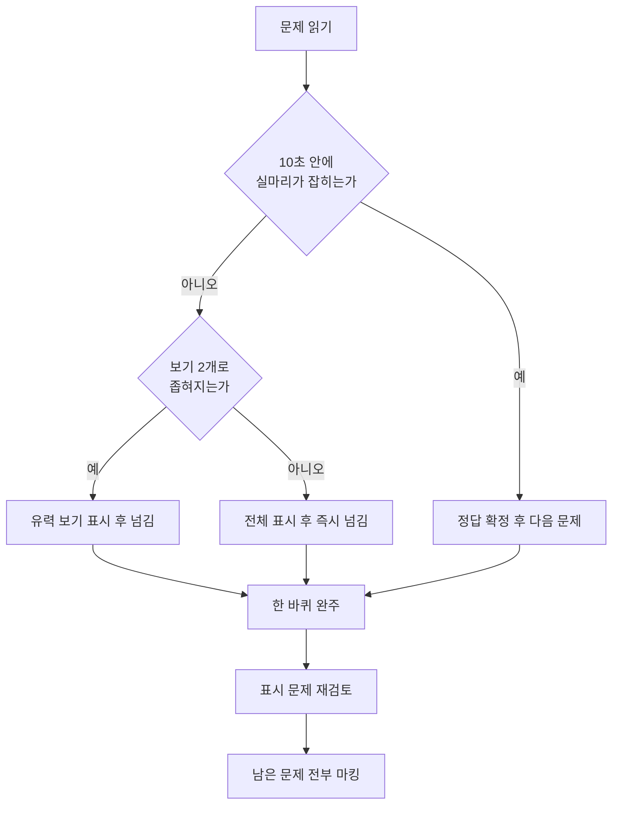

<Callout type="warning">
  **이 문서의 문제는 실제 기출문제의 복제가 아닙니다.** 공개된 기출 1회분의 출제 형식·개념·난이도를 그대로 따르되, **같은 개념을 다른 조건으로 다시 출제한 재구성 문항**입니다. 원 기출 중 정답 근거가 모호했던 문항(게이트웨이 주소, XFS 쿼터 도구, renice 옵션 부호 등)은 **조건을 명확히 다듬어 새로 만들었습니다.**
</Callout>

<Callout type="info">
  **이번 문서의 목표:** 지금 실력으로 시험장에 들어가면 어느 과목에서 과락이 나는지, 어느 문제에서 시간을 흘리는지를 한 번의 모의고사로 진단한다.
</Callout>

## 실전 구조부터 몸에 넣는다

1급 1차 필기는 다음 구조로 치러집니다. 문제를 풀기 전에 이 표부터 외워야 시간 배분이 가능합니다.

| 항목 | 내용 |
|------|------|
| 문항 수 | 100문항 4지선다 |
| 시험 시간 | 100분 (문항당 평균 60초) |
| 과목 구성 | 1과목 리눅스 실무의 이해, 2과목 리눅스 시스템 관리, 3과목 네트워크 및 서비스 활용(리눅스 네트워크의 이해) |
| 실제 배점 비중 | 1과목 40문항, 2과목 20문항, 3과목 40문항 |
| 합격 기준 | 전 과목 평균 60점 이상 |
| 과락 기준 | 한 과목이라도 만점의 40퍼센트 미만이면 불합격 |

과락 계산이 특히 중요합니다. 2과목은 20문항뿐이라 **8문항 미만이면 그것만으로 탈락**합니다. 1과목과 3과목은 각 40문항이므로 16문항이 경계선입니다. 평균 60점을 넘겨도 한 과목이 무너지면 끝난다는 점이 1급 1차의 가장 큰 함정입니다.

### 이 모의고사의 배분

실전은 40 대 20 대 40이지만, **진단이 목적일 때는 과목별 균등 표본이 더 정확합니다.** 문항 수가 적은 과목을 그대로 축소하면 표본이 너무 작아 실력을 재지 못하기 때문입니다.

| 구분 | 실전 | 이 모의고사 | 과락 환산 경계 |
|------|------|-------------|----------------|
| 1과목 리눅스 실무의 이해 | 40문항 | 8문항 | 4문항 미만 위험 |
| 2과목 리눅스 시스템 관리 | 20문항 | 8문항 | 4문항 미만 위험 |
| 3과목 네트워크 및 서비스 활용 | 40문항 | 8문항 | 4문항 미만 위험 |
| 합계 | 100문항 100분 | 24문항 24분 | 평균 15문항 이상 목표 |

**24분을 타이머로 걸고 푸십시오.** 시간을 재지 않으면 이 문서는 그냥 문제집이 되고, 진단 기능을 잃습니다.

### 풀이 순서 안내

<Steps>

1. **타이머 24분을 켜고 1번부터 순서대로 푼다.** 과목을 건너뛰지 않습니다. 실전에서도 문제는 과목 순서로 나옵니다.

2. **10초 안에 실마리가 안 잡히면 표시하고 넘어간다.** 1급 1차에서 한 문제에 2분을 쓰는 순간 뒤쪽 서너 문제를 통째로 잃습니다. 계산 문제(서브넷, RAID 용량, umask)가 대표적인 시간 도둑입니다.

3. **한 바퀴를 다 돌고 나서 표시한 문제로 돌아온다.** 뒤쪽 문제를 읽는 동안 앞 문제의 단서가 떠오르는 경우가 잦습니다.

4. **끝까지 모르겠으면 반드시 찍는다.** 감점이 없으므로 빈칸은 손해입니다. 다만 찍은 문제는 별도로 표시해 두어야 채점 후 착시가 생기지 않습니다.

5. **채점은 과목별로 따로 낸다.** 총점보다 **과목별 정답 수**가 이 모의고사의 진짜 결과값입니다.

</Steps>

## 채점 후 해야 할 일

채점이 끝나면 아래 기준으로 자기 상태를 판정합니다.

| 과목별 정답 수 | 판정 | 다음 행동 |
|----------------|------|-----------|
| 7–8문항 | 안정권 | 해당 과목은 오답만 정리하고 다른 과목에 시간을 쓴다 |
| 5–6문항 | 경계 | 틀린 개념의 본편으로 돌아가 원리부터 다시 읽는다 |
| 3–4문항 | 위험 | 과락 후보 과목이다. 학습 시간의 절반 이상을 여기에 배정한다 |
| 0–2문항 | 과락 확정 | 문제 풀이를 멈추고 해당 과목 본편을 처음부터 다시 읽는다 |

전체 24문항 중 15문항 미만이면 아직 실전 응시 단계가 아닙니다. **총점이 아니라 가장 낮은 과목이 합격 여부를 결정합니다.**

## 마무리 복습

<Quiz
  questionNumber={1}
  question="[1과목] 다음 라이선스 중 파생 저작물에 같은 라이선스를 강제하는 카피레프트 성격이 가장 약한 것은?"
  options={['GPLv3', 'AGPLv3', 'Apache License 2.0', 'LGPLv3']}
  correctAnswer={3}
  explanation="정답 근거: 아파치 라이선스는 퍼미시브(permissive) 계열로, 수정본을 배포할 때 소스 코드를 공개할 의무도 같은 라이선스를 물려줄 의무도 없다. 저작권 표시와 변경 사실 고지, 특허 조항 준수만 요구한다. 오답 정리: GPLv3 는 파생물 전체에 같은 라이선스를 강제하는 강한 카피레프트이고, AGPLv3 는 여기에 네트워크로 서비스만 제공해도 소스를 공개해야 한다는 조항을 더해 가장 강하며, LGPLv3 는 라이브러리를 링크만 한 프로그램은 풀어 주되 라이브러리 자체의 수정본에는 공개 의무를 남기는 약한 카피레프트다. 함정: 네 보기가 모두 오픈소스 라이선스라 이름만으로는 갈리지 않고, 카피레프트의 강약이라는 축을 세워야 답이 나온다. 특히 LGPL 을 퍼미시브로 착각하는 실수가 흔한데 LGPL 은 여전히 카피레프트다. 변형 대처: 대표 프로그램으로 묶어 두면 어떤 방향으로 물어도 대응된다. 아파치는 Hadoop 과 Tomcat, GPL 은 리눅스 커널과 GNU 도구, LGPL 은 glibc, BSD 와 MIT 는 공개 의무가 아예 없는 퍼미시브 계열이다. 강도 순서는 AGPL 이 가장 강하고 GPL, LGPL, 아파치, BSD 순으로 약해진다."
  optionExplanations={['파생물 전체에 같은 라이선스를 강제하는 강한 카피레프트다.', '네트워크 서비스 제공에도 공개 의무를 부과하는 가장 강한 카피레프트다.', '정답. 공개 의무도 라이선스 승계 의무도 없는 퍼미시브 라이선스다.', '라이브러리 수정본에는 공개 의무가 남는 약한 카피레프트다.']}
/>

<Quiz
  questionNumber={2}
  question="[1과목] RHEL 계열 서버에서 이미 설치된 httpd 패키지가 제공하는 환경 설정 파일 목록만 빠르게 확인하려고 한다. 알맞은 옵션은?"
  options={['rpm -ql httpd', 'rpm -qc httpd', 'rpm -qd httpd', 'rpm -qi httpd']}
  correctAnswer={2}
  explanation="정답 근거: q 뒤의 c 는 configuration 의 머리글자로, 해당 패키지가 설치한 파일 중 환경 설정 파일로 표시된 것만 걸러 보여 준다. 설정 파일 경로를 모를 때 가장 빠른 수단이다. 오답 정리: l 은 패키지가 설치한 모든 파일을 나열해 설정 파일만 골라 주지 않고, d 는 문서 파일만 보여 주며, i 는 패키지의 요약과 버전과 라이선스 같은 메타 정보를 출력할 뿐 파일 목록이 아니다. 함정: 네 옵션이 모두 q 로 시작해 형태가 비슷하고, 특히 l 과 c 는 결과가 겹치기 때문에 목록이 나온다는 이유만으로 l 을 고르게 만든다. 질문이 요구한 것은 전체 목록이 아니라 설정 파일만이라는 조건이다. 변형 대처: q 계열을 한 묶음으로 정리한다. a 는 설치된 전체 패키지, i 는 패키지 정보, l 은 파일 전체 목록, c 는 설정 파일, d 는 문서 파일, f 는 파일에서 소속 패키지 역추적, R 은 의존성이다. 아직 설치하지 않은 패키지 파일을 대상으로 물으려면 p 를 함께 붙인다."
  optionExplanations={['설치한 모든 파일을 나열하므로 설정 파일만 걸러 주지 않는다.', '정답. 설정 파일로 표시된 항목만 출력한다.', '문서 파일만 출력하는 옵션이다.', '패키지의 메타 정보를 출력할 뿐 파일 목록이 아니다.']}
/>

<Quiz
  questionNumber={3}
  question="[1과목] root 패스워드를 분실한 RHEL 7 계열 시스템에서 GRUB2 편집 화면에 진입해 커널 인자를 고쳐 셸로 직접 부팅하려고 한다. 기존의 ro 를 대체할 인자로 알맞은 것은?"
  options={['ro single', 'rw rescue', 'rw systemd=/bin/sh', 'rw init=/bin/sh']}
  correctAnswer={4}
  explanation="정답 근거: init 인자는 커널이 사용자 공간에서 가장 먼저 실행할 프로그램을 지정한다. 여기에 셸을 지정하면 systemd 를 거치지 않고 곧바로 셸이 뜨므로 인증 없이 패스워드를 바꿀 수 있다. 이때 파일시스템을 읽기 전용으로 마운트하면 패스워드 파일을 쓸 수 없으므로 ro 를 rw 로 함께 바꿔야 한다. 오답 정리: 첫 번째는 ro 를 그대로 두어 쓰기가 불가능하고 systemd 환경에서 single 만으로는 root 패스워드를 요구하는 경우가 많다. 두 번째의 rescue 는 systemd 의 rescue.target 을 부르는 별도 인자 형식이 아니며 역시 인증을 요구할 수 있다. 세 번째의 systemd 는 커널 인자 이름 자체가 존재하지 않는다. 함정: rw 와 ro 라는 마운트 모드와 init 지정이라는 두 조건이 한 보기 안에 섞여 있어, 둘 중 하나만 맞는 보기가 정답처럼 보인다. 두 조건을 모두 만족하는지 확인해야 한다. 변형 대처: 부팅 개입 수단을 계층으로 정리한다. 셸을 직접 띄우는 것이 init 지정, systemd 상태를 지정하는 것이 systemd.unit 인자, 복구 환경으로 가는 것이 설치 매체의 rescue 모드다. 최신 RHEL 계열에서는 셸 부팅 후 SELinux 재라벨링을 위해 autorelabel 파일을 만들어야 재부팅이 정상 진행된다는 조건이 함께 출제된다."
  optionExplanations={['읽기 전용 상태라 패스워드 파일을 수정할 수 없다.', 'rescue 는 이런 형태의 커널 인자가 아니며 인증을 요구할 수 있다.', 'systemd 라는 이름의 커널 인자는 존재하지 않는다.', '정답. 셸을 첫 프로세스로 지정하고 쓰기 가능하게 마운트한다.']}
/>

<Quiz
  questionNumber={4}
  question="[1과목] 새 프로세스를 만들지 않고 현재 프로세스의 메모리 이미지를 다른 프로그램으로 통째로 덮어써 실행하는 시스템 호출은?"
  options={['fork', 'exec', 'wait', 'clone']}
  correctAnswer={2}
  explanation="정답 근거: exec 계열 호출은 호출한 프로세스의 코드와 데이터 영역을 새 프로그램으로 교체한다. PID 는 그대로 유지되고 새 프로세스는 생기지 않으므로 성공하면 원래 코드로 돌아오지 않는다. 오답 정리: fork 는 부모를 복제해 자식 프로세스를 새로 만들고 PID 가 하나 늘어난다. wait 는 부모가 자식의 종료를 기다리며 종료 상태를 회수하는 호출이다. clone 은 fork 보다 세밀하게 자원 공유 범위를 지정해 프로세스나 스레드를 새로 만드는 호출로, 역시 새 실행 흐름을 생성한다. 함정: 셸이 명령을 실행하는 과정이 fork 와 exec 의 연속이라는 사실 때문에 둘을 하나로 뭉뚱그려 기억하게 된다. 새로 만드는 것이 fork, 갈아 끼우는 것이 exec 다. 변형 대처: 셸의 명령 실행 흐름을 문장으로 붙잡는다. 셸이 fork 로 자신을 복제하고 자식이 exec 로 명령 프로그램을 덮어쓰며 부모는 wait 로 기다린다. 자식이 끝났는데 부모가 회수하지 않으면 좀비, 부모가 먼저 죽으면 고아가 되어 1번 프로세스가 입양한다는 후속 개념까지 한 세트다."
  optionExplanations={['부모를 복제해 새 프로세스를 만드는 호출이다.', '정답. 새 프로세스 없이 현재 프로세스를 새 프로그램으로 교체한다.', '자식의 종료를 기다려 종료 상태를 회수하는 호출이다.', '자원 공유 범위를 지정해 새 실행 흐름을 만드는 호출이다.']}
/>

<Quiz
  questionNumber={5}
  question="[1과목] 다음 중 프로세스가 핸들러로 가로채거나 무시할 수 없는 시그널 두 개의 번호 조합으로 알맞은 것은?"
  options={['2번과 3번', '9번과 15번', '9번과 19번', '15번과 19번']}
  correctAnswer={3}
  explanation="정답 근거: 9번 SIGKILL 과 19번 SIGSTOP 은 커널이 직접 처리하며 프로세스가 핸들러를 등록하거나 무시하거나 블록할 수 없는 두 시그널이다. 그래서 응답하지 않는 프로세스를 확실히 끝낼 때 9번을 쓴다. 오답 정리: 2번 SIGINT 와 3번 SIGQUIT 은 키보드 인터럽트로 발생하며 프로그램이 얼마든지 가로챌 수 있다. 15번 SIGTERM 은 종료 요청 신호이지만 프로세스가 받아서 뒷정리를 하거나 아예 무시할 수 있다. 함정: 강제 종료라는 인상 때문에 15번도 가로챌 수 없다고 착각하게 만든다. 15번은 요청이고 9번은 통보다. 변형 대처: 번호 순서를 통째로 외워 두면 여러 변형에 대응된다. 1번 SIGHUP 은 터미널 연결 끊김이며 데몬에서는 설정 재적용 용도로 관례적으로 쓰이고, 2번 SIGINT, 3번 SIGQUIT, 9번 SIGKILL, 15번 SIGTERM, 18번 SIGCONT, 19번 SIGSTOP, 20번 SIGTSTP 이다. kill 의 기본 시그널이 15번이라는 점도 단골이다."
  optionExplanations={['둘 다 프로그램이 핸들러로 가로챌 수 있는 시그널이다.', '15번은 무시하거나 가로챌 수 있는 종료 요청이다.', '정답. 커널이 직접 처리해 가로챌 수 없는 두 시그널이다.', '15번이 포함되어 조건에 맞지 않는다.']}
/>

<Quiz
  questionNumber={6}
  question="[1과목] 셸에서 문자열 안의 변수 확장과 명령 치환이 모두 일어나지 않고 글자 그대로 출력되게 하는 인용 방식으로 알맞은 것은?"
  options={['작은따옴표로 감싼다', '큰따옴표로 감싼다', '역따옴표로 감싼다', '달러 기호와 괄호를 함께 사용한다']}
  correctAnswer={1}
  explanation="정답 근거: 작은따옴표는 강한 인용으로, 안에 들어간 모든 문자를 특수 의미 없이 문자 그대로 취급한다. 달러 기호가 붙은 변수도 역따옴표로 감싼 명령도 치환되지 않는다. 오답 정리: 큰따옴표는 약한 인용이라 공백과 별표 같은 글로빙은 막지만 변수 확장과 명령 치환은 그대로 일어난다. 역따옴표는 오히려 안의 내용을 명령으로 실행해 결과로 바꾸는 명령 치환 기호다. 달러 기호와 괄호 조합도 같은 명령 치환의 현대적 표기다. 함정: 따옴표는 다 비슷하게 묶어 준다는 인상을 이용한다. 큰따옴표와 작은따옴표의 차이가 바로 이 치환 여부이며, 기출은 이 차이를 결과 출력으로 물어 온다. 변형 대처: 출력 결과를 묻는 형태로 바뀌어도 규칙 하나로 풀린다. 큰따옴표 안에서 pwd 를 역따옴표로 감싸면 실제 경로가 찍히고, 같은 문장을 작은따옴표로 감싸면 기호와 글자가 그대로 찍힌다. 역슬래시는 바로 뒤 한 글자만 특수 의미를 해제한다는 세 번째 규칙까지 함께 정리한다."
  optionExplanations={['정답. 모든 문자를 그대로 취급하는 강한 인용이다.', '변수 확장과 명령 치환이 그대로 일어난다.', '안의 내용을 명령으로 실행해 결과로 바꾸는 기호다.', '역따옴표와 같은 명령 치환 표기다.']}
/>

<Quiz
  questionNumber={7}
  question="[1과목] 일반 사용자가 passwd 명령으로 자기 비밀번호를 바꾸면 root 소유이고 다른 사용자에게 아무 권한도 없는 /etc/shadow 파일이 갱신된다. 이를 가능하게 하는 메커니즘으로 알맞은 것은?"
  options={['passwd 실행 파일에 setuid 가 걸려 있어 실행 중에는 소유자인 root 권한으로 동작하기 때문', 'shadow 파일에 기타 사용자 쓰기 권한이 열려 있기 때문', 'passwd 명령이 내부적으로 sudo 를 호출하기 때문', 'PAM 모듈이 파일 권한 검사를 건너뛰게 만들기 때문']}
  correctAnswer={1}
  explanation="정답 근거: passwd 의 권한 표기는 소유자 실행 자리에 s 가 놓인 형태이며 이것이 setuid 비트다. setuid 가 걸린 실행 파일은 누가 실행하든 실행되는 동안 실효 사용자 ID 가 파일 소유자로 바뀌므로, 일반 사용자가 실행해도 그 순간에는 root 권한으로 shadow 파일을 쓸 수 있다. 오답 정리: 두 번째는 사실이 아니며 shadow 는 기타 사용자에게 읽기조차 허용하지 않는다. 세 번째의 sudo 는 별도의 인증과 설정을 요구하는 도구로 passwd 가 자동 호출하지 않는다. 네 번째의 PAM 은 인증 정책을 결정할 뿐 파일시스템 권한 검사를 무력화하지 않는다. 함정: 권한이 없는데 파일이 바뀐다는 상황을 설명할 수단을 여러 개 늘어놓아 보안 기능이면 아무거나 답이 될 것처럼 만든다. 권한 상승의 주체가 파일 자체인지 별도 도구인지가 갈림길이다. 변형 대처: 특수 비트 세 개를 위치와 함께 정리한다. 소유자 실행 자리의 s 는 setuid 로 8진수 4000, 그룹 실행 자리의 s 는 setgid 로 2000, 기타 실행 자리의 t 는 sticky 로 1000 이다. 대문자로 보이면 실행 권한 없이 비트만 켜진 상태이며 setuid 는 스크립트에는 적용되지 않고 디렉터리에도 효과가 없다는 예외가 자주 출제된다."
  optionExplanations={['정답. setuid 비트가 실행 중 실효 사용자 ID 를 소유자로 바꾼다.', 'shadow 는 기타 사용자에게 읽기 권한조차 주지 않는다.', 'passwd 는 sudo 를 자동으로 호출하지 않는다.', 'PAM 은 인증 정책을 다룰 뿐 파일 권한 검사를 우회시키지 않는다.']}
/>

<Quiz
  questionNumber={8}
  question="[1과목] 다음 중 touch 명령의 옵션으로 값을 직접 지정해 바꿀 수 없는 시각으로 알맞은 것은?"
  options={['Access Time', 'Modify Time', 'Access Time 과 Modify Time 을 동시에 지정하는 경우', 'Change Time']}
  correctAnswer={4}
  explanation="정답 근거: Change Time 은 아이노드의 메타데이터가 바뀐 시각을 커널이 자동으로 기록하는 값이다. 사용자가 임의로 지정할 수 없고, 오히려 touch 로 다른 시각을 바꾸는 행위 자체가 메타데이터 변경이라 Change Time 은 현재 시각으로 갱신된다. 오답 정리: 소문자 a 옵션은 접근 시각만, 소문자 m 옵션은 수정 시각만 지정하며, 옵션 없이 실행하면 두 값을 모두 현재 시각으로 바꾼다. 대문자 d 나 t 옵션으로 임의의 시각을 지정하는 것도 이 두 값에 대해서만 가능하다. 함정: 세 가지 시각이 모두 시간 정보라는 이유로 동등하게 다뤄질 것이라 착각하게 만든다. 두 개는 사용자가 정하는 값이고 하나는 커널이 정하는 값이라는 비대칭이 핵심이다. 변형 대처: 세 시각의 의미를 구분해 둔다. 접근 시각은 파일 내용을 읽었을 때, 수정 시각은 파일 내용이 바뀌었을 때, 변경 시각은 권한이나 소유자나 링크 수 같은 아이노드 정보가 바뀌었을 때 갱신된다. touch 는 없는 파일을 크기 0 으로 새로 만드는 용도로도 출제되며 대문자 c 옵션을 주면 파일이 없을 때 새로 만들지 않는다는 점이 함께 나온다."
  optionExplanations={['소문자 a 옵션으로 지정할 수 있다.', '소문자 m 옵션으로 지정할 수 있다.', '옵션 없이 실행하거나 t 옵션으로 함께 지정할 수 있다.', '정답. 커널이 자동으로만 갱신하며 사용자가 지정할 수 없다.']}
/>

<Quiz
  questionNumber={9}
  question="[2과목] 새 커널 모듈을 배치한 뒤 모듈 간 의존성 정보 파일을 다시 만들어 modprobe 가 의존 모듈을 찾을 수 있게 하려고 한다. 알맞은 명령은?"
  options={['depmod', 'modprobe', 'insmod', 'modinfo']}
  correctAnswer={1}
  explanation="정답 근거: depmod 는 모듈 디렉터리를 훑어 모듈 사이의 의존 관계를 계산하고 그 결과를 modules.dep 파일에 기록한다. modprobe 는 바로 이 파일을 읽어 필요한 모듈을 순서대로 적재하므로, 의존성 정보가 갱신되지 않으면 적재가 실패한다. 오답 정리: modprobe 는 의존성 정보를 이용해 모듈을 적재하는 쪽이지 만드는 쪽이 아니다. insmod 는 의존성을 전혀 고려하지 않고 지정한 모듈 파일 하나만 그대로 밀어 넣는다. modinfo 는 모듈 파일의 작성자와 라이선스와 파라미터 같은 정보를 보여 줄 뿐이다. 함정: 네 명령이 모두 모듈 관련이라 이름만으로는 갈리지 않고, 정보를 만드는 쪽과 쓰는 쪽의 방향을 뒤집어 놓았다. depmod 가 만들고 modprobe 가 읽는다. 변형 대처: 적재와 제거를 짝으로 묶는다. 의존성을 고려해 적재하는 것이 modprobe 이고 제거는 modprobe 에 소문자 r 을 붙인다. 의존성 없이 적재하는 것이 insmod 이고 제거는 rmmod 다. 현재 적재 상태 조회는 lsmod 이며 그 원본은 proc 아래 modules 파일이다."
  optionExplanations={['정답. 의존성 정보 파일을 계산해 갱신한다.', '의존성 정보를 읽어 모듈을 적재하는 쪽이다.', '의존성을 고려하지 않고 모듈 파일 하나만 적재한다.', '모듈 파일의 메타 정보만 출력한다.']}
/>

<Quiz
  questionNumber={10}
  question="[2과목] 내려받은 커널 소스로 처음부터 커널을 컴파일한다. 다음 세 명령을 실행 순서대로 바르게 나열한 것은?"
  options={['make menuconfig 다음 make mrproper 다음 make bzImage', 'make mrproper 다음 make menuconfig 다음 make bzImage', 'make bzImage 다음 make mrproper 다음 make menuconfig', 'make mrproper 다음 make bzImage 다음 make menuconfig']}
  correctAnswer={2}
  explanation="정답 근거: 먼저 mrproper 로 이전 빌드의 오브젝트 파일과 설정 파일까지 완전히 지워 깨끗한 상태를 만들고, 그다음 menuconfig 로 어떤 기능을 넣을지 설정 파일을 만들며, 마지막으로 bzImage 로 압축 커널 이미지를 빌드한다. 설정이 없으면 빌드할 대상이 정해지지 않고, 청소를 나중에 하면 방금 만든 설정이 지워진다. 오답 정리: 첫 번째는 설정을 만든 뒤 청소를 해서 설정을 날려 버린다. 세 번째는 설정 없이 빌드부터 시도한다. 네 번째는 빌드한 뒤에 설정을 하므로 순서가 뒤집혀 있다. 함정: 세 명령의 이름만 보면 어느 것이 청소인지 드러나지 않아서, 청소를 마지막 정리 작업으로 착각하게 만든다. mrproper 는 시작 전 초기화다. 변형 대처: 전체 흐름을 끝까지 이어 둔다. mrproper 로 초기화하고 menuconfig 로 설정하고 bzImage 로 커널 이미지를 만들고 modules 로 모듈을 빌드한 뒤 modules_install 로 모듈을 설치하고 install 로 커널과 부트로더 항목을 설치한다. X 윈도가 없는 환경에서 쓸 수 있는 설정 도구는 config 와 menuconfig 이고 xconfig 와 gconfig 는 그래픽 환경을 요구한다는 점이 함께 출제된다."
  optionExplanations={['설정을 만든 뒤 청소해 설정이 지워진다.', '정답. 초기화, 설정, 빌드 순서가 맞다.', '설정 없이 빌드부터 시도하는 순서다.', '빌드한 뒤에 설정하므로 순서가 뒤집혔다.']}
/>

<Quiz
  questionNumber={11}
  question="[2과목] 10GB 하드디스크 6개가 장착된 시스템이다. 이 중 하나를 스페어 디스크로 남기고 나머지로 RAID-5 를 구성했을 때 실제로 사용할 수 있는 용량은?"
  options={['20GB', '30GB', '40GB', '50GB']}
  correctAnswer={3}
  explanation="정답 근거: 스페어 디스크는 평소에는 놀고 있다가 장애가 났을 때 투입되는 예비 디스크이므로 용량 계산에서 먼저 빼야 한다. 6개에서 1개를 빼면 어레이에 참여하는 디스크는 5개이고, RAID-5 는 패리티를 디스크 한 개 분량만큼 분산 저장하므로 5개에서 1개를 뺀 4개 분량인 40GB 를 쓸 수 있다. 오답 정리: 20GB 는 RAID-6 을 5개로 구성했을 때보다도 작은 값이라 어떤 조합으로도 나오지 않고, 30GB 는 5개로 RAID-6 을 구성했을 때의 값이며, 50GB 는 스페어를 빼지 않고 6개로 RAID-5 를 계산했을 때의 값이다. 함정: 스페어를 계산에 포함시키게 만드는 것이 이 문제의 전부다. 스페어는 용량이 아니라 보험이다. 변형 대처: 레벨별 계산식을 표처럼 외운다. RAID-0 은 전체 합이고 최소 2개, RAID-1 은 절반이고 최소 2개, RAID-5 는 디스크 개수에서 1을 뺀 만큼이고 최소 3개, RAID-6 은 2를 뺀 만큼이고 최소 4개다. RAID-1과 RAID-0을 겹친 10 과 01 은 절반이며 최소 4개다. 스페어가 언급되면 항상 개수에서 먼저 제외한다."
  optionExplanations={['어떤 조합으로도 나오지 않는 값이다.', '남은 5개로 RAID-6 을 구성했을 때의 값이다.', '정답. 스페어를 뺀 5개로 RAID-5 를 구성한 결과다.', '스페어를 빼지 않고 6개로 계산한 값이다.']}
/>

<Quiz
  questionNumber={12}
  question="[2과목] fdisk 로 파티션을 만든 뒤 이 파티션을 LVM 의 물리 볼륨으로 쓰려고 파티션 타입 코드를 바꾸려 한다. 지정할 코드로 알맞은 것은?"
  options={['82', '83', 'fd', '8e']}
  correctAnswer={4}
  explanation="정답 근거: 8e 는 Linux LVM 을 뜻하는 파티션 타입 코드다. 타입 코드 자체가 데이터 배치를 바꾸지는 않지만, 커널과 각종 도구가 이 파티션의 용도를 인식하고 자동 활성화하는 근거가 되므로 LVM 구성 전에 반드시 지정한다. 오답 정리: 82 는 Linux swap 이고, 83 은 일반 Linux 파일시스템 파티션이며, fd 는 Linux raid autodetect 로 소프트웨어 RAID 구성원 파티션에 지정하는 코드다. 함정: 8e 와 fd 를 뒤바꿔 외우게 만드는 것이 핵심이다. LVM 과 RAID 는 둘 다 여러 디스크를 묶는 기술이라 개념적으로 붙어 있어서 코드까지 섞인다. 변형 대처: 네 코드를 용도와 함께 한 줄로 붙잡는다. 82 는 스왑, 83 은 리눅스 기본, 8e 는 LVM, fd 는 RAID 자동 인식이다. LVM 계층 순서인 물리 볼륨과 볼륨 그룹과 논리 볼륨, 그리고 각 계층의 생성 명령인 pvcreate 와 vgcreate 와 lvcreate, 조회 명령인 pvscan 과 vgscan 과 lvscan 이 함께 묶여 출제된다."
  optionExplanations={['Linux swap 파티션 코드다.', '일반 Linux 파일시스템 파티션 코드다.', '소프트웨어 RAID 자동 인식용 코드다.', '정답. Linux LVM 을 뜻하는 코드다.']}
/>

<Quiz
  questionNumber={13}
  question="[2과목] rsyslog 설정에서 모든 시설의 err 등급 이상 메시지를 기록하되 mail 시설의 메시지는 이 파일에서 완전히 제외하려고 한다. 알맞은 표기는?"
  options={['*.err;mail.none', '*.=err;mail.none', '*.err;mail.!=none', '*.=err;mail.!none']}
  correctAnswer={1}
  explanation="정답 근거: 점 뒤에 등급만 적으면 그 등급 이상 전부를 뜻하므로 err 이상이라는 조건은 앞부분으로 충족되고, 세미콜론으로 조건을 이어 붙인 뒤 시설에 none 을 지정하면 그 시설의 메시지를 전부 배제한다. 오답 정리: 두 번째의 등호는 정확히 그 등급만 기록하라는 뜻이라 이상 전부라는 조건과 어긋난다. 세 번째와 네 번째는 none 앞에 부정 기호를 붙인 형태인데 none 자체가 이미 배제를 뜻하므로 성립하지 않는 표기다. 함정: 조건이 두 개라서 앞부분과 뒷부분 중 하나만 맞는 보기가 정답처럼 보인다. 등급 범위와 시설 배제를 따로 검사해야 한다. 변형 대처: 기호 네 가지를 묶어 외운다. 아무 기호 없이 등급만 적으면 그 등급 이상 전부, 등호는 그 등급만, 느낌표는 그 범위 제외, none 은 해당 시설 완전 배제다. 등급 순서는 emerg 와 panic 이 가장 높고 alert, crit, err, warning, notice, info, debug 순으로 낮아지며, 낮은 등급을 지정할수록 기록되는 양이 많아진다는 점이 계속 출제된다."
  optionExplanations={['정답. err 이상 전부를 기록하고 mail 시설은 배제한다.', '등호는 err 등급만 기록하므로 이상 전부라는 조건과 다르다.', 'none 앞에 부정 기호를 붙인 성립하지 않는 표기다.', '등급 조건과 배제 표기가 모두 어긋난다.']}
/>

<Quiz
  questionNumber={14}
  question="[2과목] 다음 로그 파일 중 cat 이나 편집기로 바로 내용을 읽을 수 없어 전용 명령이 필요한 것은?"
  options={['/var/log/secure', '/var/log/wtmp', '/var/log/messages', '/var/log/maillog']}
  correctAnswer={2}
  explanation="정답 근거: wtmp 는 로그인과 로그아웃 기록을 고정 길이 구조체로 저장하는 바이너리 파일이라 텍스트 도구로 읽으면 깨진 문자가 나온다. 내용을 보려면 last 명령을 써야 한다. 오답 정리: secure 는 인증과 권한 관련 메시지를 담은 텍스트 파일이고, messages 는 일반 시스템 메시지를 담은 텍스트 파일이며, maillog 는 메일 관련 메시지를 담은 텍스트 파일이다. 셋 다 rsyslog 가 사람이 읽는 형식으로 기록한다. 함정: 네 경로가 모두 같은 디렉터리 아래에 있어 형식도 같을 것이라 짐작하게 만든다. 로그 디렉터리 안에는 텍스트 로그와 바이너리 계정 기록이 섞여 있다. 변형 대처: 바이너리 세 개와 전용 명령을 짝으로 외운다. wtmp 는 로그인 이력이며 last 로 보고, btmp 는 로그인 실패 기록이며 lastb 로 보고, lastlog 는 사용자별 마지막 로그인 시각이며 lastlog 명령으로 본다. 현재 접속자 정보를 담은 utmp 는 w 와 who 로 본다. 커널 링 버퍼는 파일이 아니라 dmesg 로 조회한다는 점도 함께 나온다."
  optionExplanations={['인증 관련 메시지를 담은 텍스트 파일이다.', '정답. 로그인 이력을 담은 바이너리 파일이라 last 명령이 필요하다.', '일반 시스템 메시지를 담은 텍스트 파일이다.', '메일 관련 메시지를 담은 텍스트 파일이다.']}
/>

<Quiz
  questionNumber={15}
  question="[2과목] XFS 파일시스템으로 운영 중인 시스템이다. 다음 중 이 파일시스템의 백업에 사용할 수 없는 도구는?"
  options={['dd', 'rsync', 'dump', 'cpio']}
  correctAnswer={3}
  explanation="정답 근거: dump 는 ext2 와 ext3 와 ext4 의 내부 구조를 직접 읽어 백업하는 파일시스템 전용 도구다. XFS 는 구조가 전혀 다르므로 dump 로는 백업할 수 없고 대신 xfsdump 를 쓴다. 오답 정리: dd 는 블록 단위로 그대로 복사하므로 파일시스템 종류를 가리지 않는다. rsync 와 cpio 는 파일 단위로 읽고 쓰는 도구라 마운트만 되어 있으면 어떤 파일시스템에서도 동작한다. 함정: 백업 도구라는 공통점만 보고 넷을 같은 층위로 취급하게 만든다. 파일시스템 내부 구조에 의존하는 도구인지 파일이나 블록만 다루는 도구인지가 갈림길이다. 변형 대처: XFS 전용 도구 묶음을 통째로 외운다. 백업은 xfsdump 이고 복원은 xfsrestore 이며 확장은 xfs_growfs 이고 검사와 복구는 xfs_repair 이며 쿼터는 xfs_quota 다. XFS 는 온라인 확장은 되지만 축소는 지원하지 않는다는 점, ext4 의 대응 도구가 resize2fs 와 e2fsck 라는 점이 짝으로 출제된다."
  optionExplanations={['블록 단위 복사라 파일시스템 종류를 가리지 않는다.', '파일 단위로 동기화하므로 문제없이 쓸 수 있다.', '정답. ext 계열 전용 도구라 XFS 에서는 쓸 수 없다.', '파일 단위로 아카이브하므로 문제없이 쓸 수 있다.']}
/>

<Quiz
  questionNumber={16}
  question="[2과목] 감사용 기록 파일을 기존 내용은 수정하거나 삭제하지 못하게 하고 내용 추가만 가능하도록 만들려고 한다. 알맞은 명령은?"
  options={['setfacl -m a::rw 파일명', 'chattr +i 파일명', 'chattr +A 파일명', 'chattr +a 파일명']}
  correctAnswer={4}
  explanation="정답 근거: chattr 로 부여하는 소문자 a 속성은 append only 를 뜻한다. 이 속성이 걸린 파일은 끝에 덧붙이는 쓰기만 허용되고 기존 내용 수정과 삭제와 이름 변경이 모두 차단되며, root 조차 속성을 먼저 해제해야 지울 수 있다. 오답 정리: 첫 번째의 setfacl 은 사용자별 접근 권한을 세분화할 뿐 수정과 추가를 구분하지 못한다. 두 번째의 소문자 i 는 immutable 로 추가조차 막아 버려 조건과 다르다. 세 번째의 대문자 A 는 파일을 읽어도 접근 시각을 갱신하지 않는다는 성능 관련 속성으로 접근 제어와 무관하다. 함정: 대소문자만 다른 a 와 A 를 나란히 놓고, 여기에 성격이 비슷한 i 까지 붙여 세 겹으로 헷갈리게 만든다. 조건이 추가는 되고 수정은 안 된다는 것이므로 완전 잠금인 i 는 과하다. 변형 대처: 속성 조회 명령이 lsattr 이라는 점과 해제 표기가 더하기 대신 빼기라는 점을 함께 외운다. 로그 파일에 소문자 a 를 걸면 로그는 계속 쌓이면서 변조는 막을 수 있어 감사 목적에 쓰이고, 설정 파일에 소문자 i 를 걸면 실수로 인한 수정을 원천 차단할 수 있다는 용도 차이가 출제 포인트다."
  optionExplanations={['접근 권한을 세분화할 뿐 수정과 추가를 구분하지 못한다.', 'immutable 속성이라 내용 추가까지 막아 버린다.', '접근 시각을 갱신하지 않는 성능 관련 속성이다.', '정답. 내용 추가만 허용하는 append only 속성이다.']}
/>

<Quiz
  questionNumber={17}
  question="[3과목] 비동기 이벤트 기반 구조로 설계되어 적은 자원으로 많은 동시 접속을 처리하며 리버스 프록시와 로드 밸런서 기능을 함께 제공하는 웹 서버 프로그램은?"
  options={['Nginx', 'Apache HTTP Server', 'IIS', 'Tomcat']}
  correctAnswer={1}
  explanation="정답 근거: Nginx 는 연결 하나마다 프로세스나 스레드를 만드는 대신 소수의 워커가 이벤트 루프로 다수의 연결을 돌아가며 처리하는 구조다. 그래서 동시 접속이 많아져도 메모리 사용이 급격히 늘지 않고, 리버스 프록시와 로드 밸런서와 캐시 역할로도 널리 쓰인다. 오답 정리: Apache 는 전통적으로 프로세스나 스레드 기반 처리 모델을 써 왔고 이벤트 방식은 나중에 선택 가능한 모듈로 추가된 것이라 이 설명의 대표 사례가 아니다. IIS 는 마이크로소프트의 윈도우 전용 웹 서버다. Tomcat 은 자바 서블릿과 JSP 를 실행하는 애플리케이션 서버로 층위 자체가 다르다. 함정: 웹 서버라는 범주 안에 애플리케이션 서버와 운영체제가 다른 제품을 섞어 넣어, 이름을 아는지만 물어보는 것처럼 보이게 만든다. 실제 판단 기준은 처리 구조라는 조건이다. 변형 대처: 아파치 쪽 설정 지시자까지 함께 정리해 두면 짝 문항에 대응된다. 웹 문서 루트는 DocumentRoot, 서버 설치 경로는 ServerRoot, 사용자 홈 디렉터리 서비스 모듈은 mod_userdir 이며, 설정 파일 문법 검사는 httpd 에 소문자 t 옵션을 붙이거나 apachectl configtest 를 쓴다."
  optionExplanations={['정답. 비동기 이벤트 기반 구조의 대표 웹 서버다.', '전통적으로 프로세스나 스레드 기반 모델을 사용해 왔다.', '윈도우 환경 전용 웹 서버다.', '자바 서블릿을 실행하는 애플리케이션 서버로 층위가 다르다.']}
/>

<Quiz
  questionNumber={18}
  question="[3과목] 다음 DNS 자원 레코드 중 역방향 조회를 위한 리버스 존 파일에서만 사용되는 것은?"
  options={['CNAME', 'PTR', 'MX', 'NS']}
  correctAnswer={2}
  explanation="정답 근거: PTR 은 IP 주소를 도메인 이름으로 되돌리는 포인터 레코드로, in-addr.arpa 형태의 역방향 존에서만 의미를 갖는다. 오답 정리: CNAME 은 한 이름을 다른 이름의 별칭으로 지정하는 정방향 레코드이고, MX 는 도메인의 메일 서버를 지정하는 정방향 레코드이며, NS 는 존을 위임받은 네임 서버를 지정하는 레코드로 정방향과 역방향 양쪽 존 파일에 모두 등장한다. 함정: NS 와 SOA 처럼 양쪽 존에 공통으로 들어가는 레코드를 섞어 놓아, 역방향 존에서 본 적이 있다는 이유만으로 고르게 만든다. 조건은 양쪽에 있느냐가 아니라 역방향에서만 쓰이느냐다. 변형 대처: 주요 레코드를 역할로 묶는다. A 는 이름에서 IPv4 주소, AAAA 는 이름에서 IPv6 주소, PTR 은 주소에서 이름, CNAME 은 별칭, MX 는 메일 서버와 우선순위, NS 는 네임 서버, SOA 는 존의 권한 정보와 일련번호다. MX 레코드는 우선순위 숫자가 반드시 들어가고 숫자가 작을수록 우선한다는 점이 함께 출제된다."
  optionExplanations={['이름의 별칭을 지정하는 정방향 레코드다.', '정답. IP 주소를 이름으로 되돌리는 역방향 전용 레코드다.', '도메인의 메일 서버를 지정하는 정방향 레코드다.', '네임 서버를 지정하며 양쪽 존 파일에 모두 쓰인다.']}
/>

<Quiz
  questionNumber={19}
  question="[3과목] NFS 서버의 exports 설정에서 root 를 포함한 모든 접속 사용자의 권한을 익명 계정으로 매핑하려고 한다. 알맞은 옵션은?"
  options={['root_squash', 'no_root_squash', 'all_squash', 'no_all_squash']}
  correctAnswer={3}
  explanation="정답 근거: squash 는 짓눌러 낮춘다는 뜻이고 all 이 붙으면 대상이 모든 사용자다. all_squash 를 지정하면 root 를 포함해 접속하는 모든 사용자의 UID 와 GID 가 익명 계정으로 바뀌어, 클라이언트 쪽 계정 체계와 무관하게 동일한 최소 권한만 갖는다. 오답 정리: root_squash 는 root 만 익명으로 낮추고 일반 사용자는 자신의 UID 를 그대로 유지하므로 조건에 미치지 못한다. no_root_squash 는 root 를 낮추지 않아 클라이언트 root 가 서버에서도 root 로 동작하게 만드는 위험한 설정이다. no_all_squash 는 all_squash 를 끄는 기본값이다. 함정: 네 옵션이 부정 접두어 하나로만 갈려 눈으로 훑으면 구분이 안 된다. squash 앞의 대상이 root 인지 all 인지, 그리고 no 가 붙었는지를 두 단계로 읽어야 한다. 변형 대처: 매핑되는 계정과 관련 명령까지 정리한다. 익명 계정은 보통 nobody 또는 nfsnobody 이며 UID 를 직접 지정하려면 anonuid 와 anongid 옵션을 쓴다. 설정 파일은 /etc/exports 이고 변경 사항을 즉시 반영하려면 exportfs 에 대문자 R 이나 소문자 a 옵션을 쓰며, 서버가 내보내는 목록 확인은 exportfs 이고 클라이언트에서 원격 서버의 공유 목록을 보는 것은 showmount 다."
  optionExplanations={['root 만 익명으로 낮추고 일반 사용자는 그대로 둔다.', 'root 를 낮추지 않아 오히려 권한이 그대로 유지된다.', '정답. root 를 포함한 모든 사용자를 익명 계정으로 매핑한다.', 'all_squash 를 적용하지 않는 기본 설정이다.']}
/>

<Quiz
  questionNumber={20}
  question="[3과목] 도메인이 ihd.or.kr 이고 mail 이라는 호스트 이름으로 메일 서버를 운영하려 한다. 존 파일에 넣을 MX 레코드 표기로 알맞은 것은?"
  options={['mail MX ihd.or.kr', 'mail MX ihd.or.kr.', 'mail MX 0 ihd.or.kr', 'mail MX 0 ihd.or.kr.']}
  correctAnswer={4}
  explanation="정답 근거: MX 레코드는 이름과 레코드 타입 뒤에 우선순위 숫자가 반드시 들어가고 그 뒤에 메일 서버의 도메인 이름이 온다. 또 존 파일에서 도메인 이름을 완전한 형태로 적을 때는 끝에 점을 찍어야 하며, 점을 빠뜨리면 뒤에 현재 존 이름이 자동으로 덧붙어 엉뚱한 이름이 된다. 오답 정리: 첫 번째와 두 번째는 우선순위 숫자가 없어 문법 자체가 성립하지 않고, 세 번째는 숫자는 있지만 끝점이 없어 이름이 ihd.or.kr.ihd.or.kr 로 확장된다. 함정: 두 가지 오류를 한 문항에 겹쳐 두어, 하나만 검사하면 틀린 보기를 고르게 만든다. 숫자가 있는지와 끝점이 있는지를 각각 확인해야 한다. 변형 대처: 끝점 규칙은 MX 만의 문제가 아니라 존 파일 전체에 적용된다. 완전한 도메인 이름에는 끝점을 찍고, 점 없이 적은 이름에는 존 이름이 자동으로 붙는다는 원칙 하나로 A 와 CNAME 과 NS 레코드 문항까지 함께 풀린다. MX 우선순위는 숫자가 작을수록 먼저 시도되며 같은 값이면 부하가 분산된다는 점도 자주 나온다."
  optionExplanations={['우선순위 숫자가 없어 문법이 성립하지 않는다.', '끝점은 있지만 우선순위 숫자가 없다.', '숫자는 있지만 끝점이 없어 존 이름이 덧붙는다.', '정답. 우선순위 숫자와 끝점을 모두 갖춘 표기다.']}
/>

<Quiz
  questionNumber={21}
  question="[3과목] 다음 메일 관련 프로그램 중 성격이 나머지 셋과 다른 하나는?"
  options={['postfix', 'evolution', 'mutt', 'Outlook']}
  correctAnswer={1}
  explanation="정답 근거: postfix 는 메일을 다른 서버로 전달하는 MTA 로 서버 쪽 프로그램이다. 나머지 셋은 사용자가 직접 메일을 읽고 쓰는 데 쓰는 MUA 로 클라이언트 쪽 프로그램이다. 오답 정리: evolution 은 그놈 데스크톱의 그래픽 메일 클라이언트이고, mutt 는 터미널에서 동작하는 텍스트 기반 메일 클라이언트이며, Outlook 은 마이크로소프트의 그래픽 메일 클라이언트다. 셋 다 사용자 인터페이스를 제공한다는 공통점이 있다. 함정: 그래픽과 텍스트, 리눅스와 윈도우처럼 겉모습이 다른 클라이언트를 섞어 놓아 그 차이가 답의 기준인 것처럼 보이게 만든다. 실제 기준은 화면 유무나 운영체제가 아니라 메일 전달자인지 사용자 도구인지다. 변형 대처: 메일 처리 단계별로 프로그램을 배치한다. 사용자가 쓰는 MUA 는 mail 과 mutt 와 evolution 과 Outlook 이고, 서버 간 전송을 담당하는 MTA 는 sendmail 과 postfix 와 qmail 과 exim 이며, 도착한 메일을 사서함에 넣고 분류하는 MDA 는 procmail 이고, 사용자가 사서함을 가져가게 해 주는 POP3 와 IMAP 서버는 dovecot 이다. 프로토콜은 발신이 SMTP 25번, 수신이 POP3 110번과 IMAP 143번이다."
  optionExplanations={['정답. 메일을 서버 간에 전달하는 MTA 다.', '그놈 환경의 그래픽 메일 클라이언트다.', '터미널에서 동작하는 텍스트 기반 메일 클라이언트다.', '윈도우 환경의 그래픽 메일 클라이언트다.']}
/>

<Quiz
  questionNumber={22}
  question="[3과목] DHCP 서버 설정 파일에서 특정 MAC 주소를 가진 장비에 고정 IP 를 할당하려 한다. MAC 주소를 지정하는 지시자로 알맞은 것은?"
  options={['mac address', 'hardware ethernet', 'ethernet address', 'hardware address']}
  correctAnswer={2}
  explanation="정답 근거: dhcpd 설정 파일의 host 블록 안에서 물리 주소를 지정하는 지시자는 hardware 뒤에 하드웨어 종류를 적는 형식이며, 이더넷 환경에서는 hardware ethernet 이 된다. 여기에 고정 주소를 뜻하는 fixed-address 지시자를 짝으로 써야 예약이 완성된다. 오답 정리: 나머지 셋은 모두 일상적으로 쓰는 표현을 조합한 형태라 자연스럽게 읽히지만 dhcpd 설정 문법에는 존재하지 않는다. 함정: 네 보기가 모두 물리 주소를 뜻하는 그럴듯한 영어라서 의미로는 구분되지 않는다. 실제 문법을 본 적이 있는지만 갈라내는 문항이며, 이런 유형은 고민해도 답이 나오지 않으므로 빠르게 판단하고 넘어가야 한다. 변형 대처: 예약 블록의 두 줄을 한 쌍으로 외운다. hardware ethernet 으로 MAC 주소를 적고 fixed-address 로 IP 를 적는다. 함께 나오는 전역 지시자로는 임대 기간을 정하는 default-lease-time 과 max-lease-time, 주소 대역을 정하는 range, 게이트웨이를 알려 주는 option routers, DNS 를 알려 주는 option domain-name-servers 가 있으며, 임대 현황 파일은 dhcpd.leases 다."
  optionExplanations={['dhcpd 설정 문법에 없는 표기다.', '정답. host 블록에서 MAC 주소를 지정하는 지시자다.', '자연스러워 보이지만 존재하지 않는 표기다.', '하드웨어 종류를 빠뜨린 형태로 성립하지 않는다.']}
/>

<Quiz
  questionNumber={23}
  question="[3과목] 서버에서 소켓 상태를 확인했더니 특정 상태의 연결이 비정상적으로 많이 쌓여 있었다. SYN Flooding 공격을 의심할 수 있는 상태 표시로 알맞은 것은?"
  options={['TIME_WAIT', 'LAST_ACK', 'SYN_RECV', 'ESTABLISHED']}
  correctAnswer={3}
  explanation="정답 근거: SYN Flooding 은 3방향 핸드셰이크의 첫 단계인 SYN 만 잔뜩 보내고 마지막 ACK 를 보내지 않는 공격이다. 서버는 SYN 에 응답한 뒤 상대의 ACK 를 기다리는 반열림 상태로 대기 큐를 채우게 되며, 이 상태의 표시가 SYN_RECV 다. 오답 정리: TIME_WAIT 는 연결을 정상 종료한 쪽이 지연 패킷을 처리하려고 잠시 남겨 두는 상태로 트래픽이 많으면 자연히 늘어난다. LAST_ACK 는 종료 과정의 마지막 응답을 기다리는 상태다. ESTABLISHED 는 정상적으로 연결이 맺힌 상태이며 이것이 많은 것은 공격이 아니라 부하다. 함정: 넷 다 실제로 대량 관측될 수 있는 상태라서 개수만으로는 갈리지 않는다. 상태가 연결 수립 과정 중인지 종료 과정 중인지를 구분해야 한다. 변형 대처: 상태 이름을 흐름 위에 배치한다. 클라이언트가 SYN 을 보내면 SYN_SENT, 서버가 받아 응답하면 SYN_RECV, 마지막 ACK 로 ESTABLISHED, 종료를 시작하면 FIN_WAIT 계열, 마무리 대기가 LAST_ACK 와 TIME_WAIT 다. 조회 명령은 netstat 과 ss 이며 두 명령 모두 소문자 n 으로 이름 변환을 끄고 소문자 a 로 전체를 보며 소문자 t 로 TCP 만 거른다. 대응책으로 SYN 쿠키를 켜는 커널 파라미터가 함께 출제된다."
  optionExplanations={['정상 종료 후 잠시 남는 상태로 부하가 크면 자연히 늘어난다.', '종료 과정의 마지막 응답을 기다리는 상태다.', '정답. SYN 을 받고 ACK 를 기다리는 반열림 상태다.', '정상적으로 연결이 맺힌 상태다.']}
/>

<Quiz
  questionNumber={24}
  question="[3과목] 다음 iptables 명령 중 문법이 잘못된 것은?"
  options={['iptables -nL INPUT', 'iptables -A INPUT -s 192.168.5.4 -j DROP', 'iptables -t nat -L PREROUTING', 'iptables -P INPUT -j DROP']}
  correctAnswer={4}
  explanation="정답 근거: 대문자 P 는 체인의 기본 정책을 바꾸는 옵션이며 체인 이름 뒤에 정책을 바로 적는 형식이다. 규칙에 대상을 지정할 때 쓰는 소문자 j 를 여기에 붙이면 문법 오류가 된다. 올바른 표기는 정책 이름만 뒤에 붙이는 형태다. 오답 정리: 첫 번째는 소문자 n 으로 이름 변환을 끄고 대문자 L 로 INPUT 체인의 규칙을 나열하는 정상 표기다. 두 번째는 대문자 A 로 규칙을 맨 뒤에 추가하고 소문자 s 로 출발지를 지정하며 소문자 j 로 처리 방식을 지정하는 정상 표기다. 세 번째는 소문자 t 로 nat 테이블을 지정하고 그 안의 PREROUTING 체인을 나열하는 정상 표기다. 함정: 규칙 추가와 정책 변경이 둘 다 결국 무엇을 할지 정하는 일이라서 같은 문법일 것이라 착각하게 만든다. 규칙에는 소문자 j 가 필요하고 정책에는 필요 없다. 변형 대처: 옵션을 역할별로 묶는다. 대문자 A 는 뒤에 추가, 대문자 I 는 앞에 삽입, 대문자 D 는 삭제, 대문자 L 은 나열, 대문자 F 는 비우기, 대문자 P 는 기본 정책이다. 테이블은 filter 와 nat 와 mangle 이 있고 기본은 filter 이며, filter 의 체인은 INPUT 과 FORWARD 와 OUTPUT, nat 의 체인은 PREROUTING 과 POSTROUTING 과 OUTPUT 이다. 저장하지 않으면 재부팅 시 규칙이 사라진다는 지금과 영구의 구분도 함께 나온다."
  optionExplanations={['이름 변환을 끄고 규칙을 나열하는 정상 표기다.', '출발지 기준 규칙을 추가하는 정상 표기다.', 'nat 테이블의 체인을 나열하는 정상 표기다.', '정답. 기본 정책 지정에는 소문자 j 를 붙이지 않는다.']}
/>

## 참고 자료

- [한국정보통신진흥협회 리눅스마스터 자격 안내 (ihd.or.kr)](https://www.ihd.or.kr/introducesubject1.do)
- [mdadm(8) 매뉴얼 페이지 (man7.org)](https://man7.org/linux/man-pages/man8/mdadm.8.html)
- [chattr(1) 매뉴얼 페이지 (man7.org)](https://man7.org/linux/man-pages/man1/chattr.1.html)
- [exports(5) 매뉴얼 페이지 (man7.org)](https://man7.org/linux/man-pages/man5/exports.5.html)
- [iptables(8) 매뉴얼 페이지 (netfilter.org)](https://ipset.netfilter.org/iptables.man.html)
- [rsyslog 공식 문서 — 필터 조건 (rsyslog.com)](https://www.rsyslog.com/doc/configuration/filters.html)
- [Red Hat Enterprise Linux 문서 — Managing file system permissions (docs.redhat.com)](https://docs.redhat.com/en/documentation/red_hat_enterprise_linux/9/html/managing_file_systems/index)
- [dhcpd.conf(5) 매뉴얼 페이지 (linux.die.net)](https://linux.die.net/man/5/dhcpd.conf)
