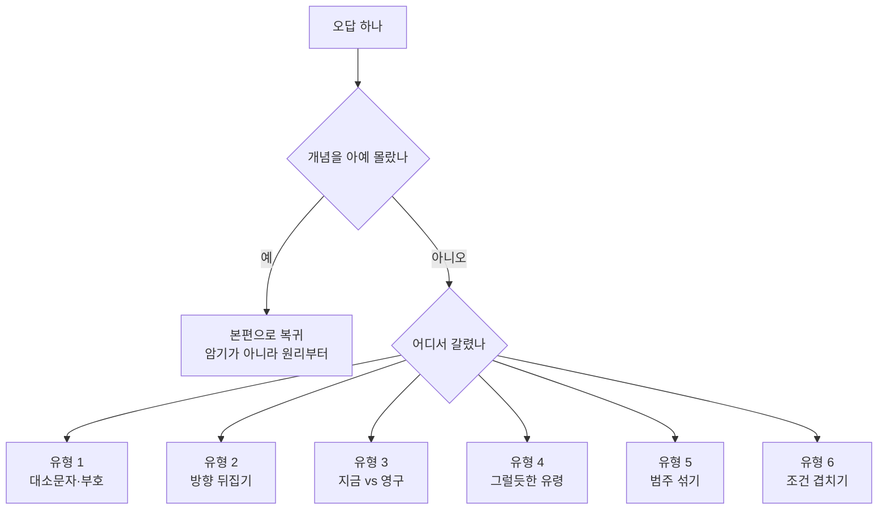

<Callout type="warning">
  **이 문서에 실린 문제는 실제 기출문제의 복제가 아닙니다.** 공개된 기출 1회분을 대조 분석해 **반복 출제 지점만 뽑아 같은 개념·같은 난이도로 다시 출제한 재구성 문항**입니다. 본문의 경향 분석 역시 공개 기출을 근거로 하되, 정답 근거가 모호했던 원 문항은 조건을 다듬어 다시 서술했습니다.
</Callout>

<Callout type="info">
  **이번 문서의 목표:** 앞의 30편에서 무엇을 틀렸는지가 아니라 **왜 그 유형에서 반복해 틀리는지**를 알아내고, 남은 기간에 무엇을 볼지 목록으로 확정한다.
</Callout>

## 기출 1회분을 뜯어 보면 보이는 것

공개된 기출 1회분(100문항)을 과목별로 분해하면, 문제 100개가 실은 서른 몇 개의 개념 위에서 돌고 있다는 사실이 드러납니다. 같은 개념이 다른 조건으로 반복되는 것이지 매번 새로운 지식을 묻는 것이 아닙니다.

### 과목별 반복 출제 키워드

**1과목 리눅스 실무의 이해** — 40문항으로 비중이 가장 큽니다. 인물·라이선스·배포판 같은 암기형과 셸·프로세스·권한 같은 원리형이 섞여 나옵니다.

| 영역 | 반복 출제 키워드 | 실제 물어보는 방식 |
|------|------------------|--------------------|
| 역사·인물 | 리누스 토발즈, 앤드루 타넨바움, 리처드 스톨먼, 미닉스, GNU | 괄호 두 곳을 비우고 인물을 짝지어 넣기 |
| 라이선스 | GPL, LGPL, Apache, BSD, MPL | 설명문을 주고 해당 라이선스 고르기, 대표 프로그램이 단서 |
| 배포판 | Debian, Ubuntu, RHEL, CentOS, Rocky, Kali | 패키지 도구 이름으로 계열 역추적 |
| 셸 | 파이프, 리다이렉션, 인용 부호 세 종류, 종료 상태값 | 명령 결과 출력값을 그대로 묻기 |
| 프로세스 | fork, exec, PID, 시그널 번호, 포그라운드 전환, NI 값 | 상황 설명 후 명령이나 값 고르기 |
| 패키지 | rpm 질의 옵션, yum 서브명령, dpkg, apt | 옵션 한 글자 차이로 사지선다 |
| 파일·권한 | setuid, 심볼릭 링크 인자 순서, touch 시각, locate 와 find | 표기를 보여 주고 의미 설명 고르기 |
| 아카이브·라이브러리 | tar 옵션, ldd, ldconfig | 명령 출력 화면을 주고 명령 이름 맞히기 |

**2과목 리눅스 시스템 관리** — 20문항뿐이지만 과락 위험이 가장 높은 구간입니다. 커널·저장장치·로그·백업·보안이 각각 서너 문항씩 고정 출제됩니다.

| 영역 | 반복 출제 키워드 | 실제 물어보는 방식 |
|------|------------------|--------------------|
| 커널 모듈 | insmod, rmmod, modprobe, depmod, modinfo, lsmod | 괄호 안에 들어갈 명령 고르기 |
| 커널 컴파일 | mrproper, menuconfig, bzImage, xconfig | 순서 나열, 텍스트 환경 가능 여부 |
| 저장장치 | fdisk 타입 코드, RAID 레벨과 용량, mdadm 옵션, `/proc/mdstat` | 계산 문제 또는 옵션 조합 |
| LVM | pvcreate, vgcreate, lvcreate, vgscan | 출력 화면을 주고 명령 맞히기 |
| 로그 | rsyslog 시설과 등급, none 표기, 바이너리 로그 파일, logger | 설정 한 줄 고르기, 도구 짝짓기 |
| 백업 | tar 증분 옵션, dump 와 restore, cpio, XFS 전용 도구 | 사용할 수 없는 도구 고르기 |
| 보안 | chattr, nessus, tripwire, TCP Wrapper | 설명문에 맞는 도구 고르기 |
| 주변장치 | lp, lpr, lpstat, lpc | 역할이 다른 하나 고르기 |

**3과목 네트워크 및 서비스 활용** — 40문항이며 서비스별로 두세 문항씩 고르게 배분됩니다. 설정 파일의 지시자 이름을 직접 묻는 비중이 특히 높습니다.

| 영역 | 반복 출제 키워드 | 실제 물어보는 방식 |
|------|------------------|--------------------|
| 네트워크 기초 | OSI 계층별 PDU, IEEE, 서브넷 계산, arp, ss | 계층 순서대로 나열, 주소 계산 |
| 웹 | Nginx 구조, DocumentRoot, ServerRoot, `mod_userdir.so`, httpd 문법 검사 | 설정 지시자 이름 고르기 |
| DNS | BIND 와 ISC 와 named, forwarders, PTR, MX 표기, named.conf 주석 | 존 파일 한 줄 고르기 |
| 파일 공유 | NFS exports 옵션, exportfs 와 showmount, smb.conf 의 path, smbclient 표기 | 옵션 의미 고르기 |
| 메일 | MTA 와 MUA 와 MDA 구분, dovecot, `/etc/aliases`, `/etc/mail/access`, m4 | 프로그램 분류, 파일 용도 |
| 계정 서비스 | NIS 의 ypserv 와 ypbind, yp-tools, yppush, rpcbind, LDAP 의 dn 과 cn | 서버용과 클라이언트용 구분 |
| 인프라 서비스 | DHCP 의 hardware ethernet, NTP 의 ntpdate, VNC | 설정 문법 고르기 |
| 가상화·컨테이너 | XEN 반가상화, KVM 과 QCOW2, virt-top, Kubernetes | 설명문에 맞는 이름 고르기 |
| 보안·방화벽 | iptables 옵션, nftables, SYN Flooding 상태값, Suricata 와 Snort | 잘못된 사용법 고르기 |

### 경향에서 읽어야 할 것

세 표를 겹쳐 보면 세 가지가 드러납니다.

1. **설정 파일의 지시자 이름을 직접 묻는 비중이 매우 높습니다.** DocumentRoot, path, forwarders, hardware ethernet, fixed-address 같은 것들은 원리로 유추할 수 없고 본 적이 있어야 풉니다. 남은 기간에 각 서비스의 설정 파일 대표 지시자 대여섯 개씩만 눈에 익혀도 3과목 점수가 크게 움직입니다.
2. **옵션은 한 글자 차이로 갈립니다.** rpm 의 질의 옵션, tar 의 동작 옵션, iptables 의 대문자 옵션이 대표적입니다. 명령 이름을 아는 것과 옵션을 아는 것은 완전히 다른 준비입니다.
3. **2과목은 문항이 적어 실수 한 번의 무게가 두 배입니다.** 40문항짜리 과목에서 두 개 틀리는 것과 20문항짜리 과목에서 두 개 틀리는 것은 과락 계산에서 전혀 다릅니다.

## 반복해서 틀리는 함정 여섯 유형

오답을 모아 보면 개념을 몰라서 틀린 것보다 **알면서 걸린 것**이 훨씬 많습니다. 걸리는 방식은 여섯 가지로 분류됩니다.

### 유형 1. 대소문자와 부호 뒤집기

같은 글자의 대소문자가 정반대 기능을 갖는 짝을 노립니다. `usermod`의 대문자 L 은 계정 잠금이고 소문자 l 은 로그인 이름 변경입니다. `scp`의 대문자 P 는 포트이고 소문자 p 는 보존입니다. `chattr`의 소문자 a 는 추가 전용이고 대문자 A 는 접근 시각 미갱신입니다. `renice`에서 앞에 붙는 빼기 부호는 옵션 구분자가 아니라 음수 값이라 우선순위를 오히려 높입니다.

**대처법:** 대소문자로 갈리는 짝은 반드시 **둘을 나란히** 적어 외웁니다. 하나만 외우면 시험장에서 어느 쪽이었는지 확신이 서지 않습니다.

### 유형 2. 방향 뒤집기

원본과 대상, 서버와 클라이언트, 만드는 쪽과 읽는 쪽이 뒤바뀝니다. `ln -s`는 원본을 먼저 링크 이름을 나중에 씁니다. `rpm`의 소문자 l 은 패키지에서 파일을 보고 소문자 f 는 파일에서 패키지를 봅니다. `depmod`가 의존성 파일을 만들고 `modprobe`가 그것을 읽습니다. NIS 에서 `yppush`는 서버 전용이고 `ypbind`는 클라이언트용입니다.

**대처법:** 화살표로 방향을 그려 정리합니다. 왼쪽에서 오른쪽으로 무엇이 흘러가는지를 한 번만 그려 두면 보기를 읽는 순간 방향이 어긋난 것이 눈에 걸립니다.

### 유형 3. 지금과 영구를 섞기

즉시 적용과 재부팅 후 유지가 서로 다른 명령이라는 점을 노립니다.

| 대상 | 지금만 | 재부팅 후에도 유지 |
|------|--------|--------------------|
| 서비스 | `systemctl start` | `systemctl enable` |
| 커널 파라미터 | `sysctl -w` 또는 `/proc` 직접 쓰기 | `/etc/sysctl.conf` 기재 후 `sysctl -p` |
| IP 주소 | `ip addr add` | 배포판 네트워크 설정 파일 |
| 마운트 | `mount` | `/etc/fstab` 등재 |
| 방화벽 | `firewall-cmd` 단독 실행 | permanent 지정 후 reload |
| iptables 규칙 | 명령 실행 | 규칙 저장 후 부팅 시 복원 |

**대처법:** 문제에 재부팅, 영구, 계속, 자동이라는 단어가 보이면 **즉시 이 표를 떠올립니다.** 반대로 그런 단어가 없으면 영구 설정 보기를 골라서도 안 됩니다.

### 유형 4. 그럴듯한 유령

존재하지 않는 파일이나 옵션을 자연스러운 이름으로 만들어 냅니다. `/proc/mdadm`, `/proc/raidtools`, `mac address`, `libtcp.so`, `allow-forwarder` 같은 것들입니다. 의미로만 읽으면 넷 다 맞아 보입니다.

**대처법:** 이 유형은 **고민해도 답이 나오지 않습니다.** 본 적이 있는지 없는지가 전부이므로, 10초 안에 확신이 없으면 표시하고 넘어가는 것이 시간 관리상 정답입니다. 대신 오답 노트에는 실제 문법을 한 줄 그대로 적어 둡니다.

### 유형 5. 범주 섞기

역할이 다른 도구를 같은 목록에 늘어놓습니다. MTA 사이에 MUA 하나를 끼워 넣거나, 상태 조회 명령 사이에 설정 파일을 넣거나, 서버 명령 사이에 클라이언트 명령을 넣는 방식입니다. 웹 서버 보기에 애플리케이션 서버인 Tomcat 을 넣는 것도 같은 수법입니다.

**대처법:** 보기 넷을 읽고 **먼저 분류부터 합니다.** 세 개가 한 무리이고 하나가 혼자라면 그 하나가 답인 경우가 압도적으로 많습니다. 질문이 거리가 먼 것을 고르라는 형태면 특히 그렇습니다.

### 유형 6. 조건 겹치기

한 보기 안에 검사해야 할 조건이 둘 이상 들어 있고, 각각 하나씩만 맞는 보기를 함정으로 배치합니다. MX 레코드 문항이 전형적입니다. 우선순위 숫자가 있는지와 끝점이 있는지를 각각 봐야 하는데, 하나만 확인하면 틀린 보기를 고르게 됩니다. GRUB 커널 인자 문항도 마운트 모드와 init 지정이라는 두 조건이 겹칩니다. rsyslog 필터도 등급 범위와 시설 배제라는 두 조건이 겹칩니다.

**대처법:** 보기의 구성 요소가 둘 이상이면 **조건을 나눠 표를 그리듯 검사합니다.** 머릿속으로 한 번에 판단하려 하면 반드시 하나를 놓칩니다.

## 오답 노트 작성법

틀린 문제를 다시 풀어 보는 것은 오답 노트가 아닙니다. 같은 문제는 다시 나오지 않기 때문입니다. **다시 나오는 것은 개념과 함정 유형**이므로 그 둘을 기록해야 합니다.

<Steps>

1. **문제를 옮겨 적지 않는다.** 문제 지문을 베끼는 데 쓰는 시간이 오답 노트 실패의 가장 큰 원인입니다. 편 번호와 문항 번호만 적습니다.

2. **한 줄로 개념을 적는다.** 무엇을 묻는 문제였는지를 명사 하나나 짧은 구로 씁니다. 예를 들어 XFS 백업 도구, MX 레코드 끝점, 스페어 디스크 제외 같은 식입니다.

3. **여섯 유형 중 어디에 걸렸는지 번호를 적는다.** 이것이 오답 노트의 핵심입니다. 유형 번호가 쌓이면 자기 약점이 통계로 드러납니다. 유형 4가 많으면 암기량 부족이고, 유형 6이 많으면 문제를 급하게 읽는 습관 문제입니다.

4. **정답 근거를 한 문장으로 쓴다.** 해설을 옮기지 말고 자기 말로 씁니다. 자기 말로 쓸 수 없으면 아직 이해하지 못한 것이므로 본편으로 돌아갈 신호입니다.

5. **짝이 되는 개념을 옆에 붙인다.** 대소문자 짝, 반대 방향 명령, 같은 계열의 다른 도구를 함께 적습니다. 이 한 줄이 다음 시험에서 변형 문항을 잡아 줍니다.

6. **일주일에 한 번, 유형 번호만 세어 본다.** 어떤 유형이 줄지 않는지 확인하고, 줄지 않는 유형에 남은 학습 시간을 몰아줍니다.

</Steps>

한 문제당 노트는 **네 줄을 넘기지 않습니다.** 길어지면 다시 읽지 않게 되고, 다시 읽지 않는 노트는 존재하지 않는 것과 같습니다.

## 시험 직전 최종 점검 목록

시험 전날과 당일 아침에 훑을 항목입니다. 새 개념을 넣는 시간이 아니라, 이미 아는 것 중 흔들리는 것을 고정하는 시간입니다.

**숫자로 외워야 하는 것**

- 시그널 번호: 1번 HUP, 2번 INT, 3번 QUIT, 9번 KILL, 15번 TERM, 18번 CONT, 19번 STOP
- NI 값 범위: 마이너스 20 부터 19 까지, 작을수록 우선순위가 높음
- 기본 권한: 파일 666, 디렉터리 777 에서 umask 비트를 제거
- 특수 비트: setuid 4000, setgid 2000, sticky 1000
- 파티션 타입 코드: 82 스왑, 83 리눅스, 8e LVM, fd RAID
- RAID 최소 디스크 수: 0 은 2개, 1 은 2개, 5 는 3개, 6 은 4개
- RAID 용량: 5 는 개수에서 1을 뺀 만큼, 6 은 2를 뺀 만큼, 스페어는 먼저 제외
- 주요 포트: SSH 22, SMTP 25, DNS 53, HTTP 80, POP3 110, IMAP 143, HTTPS 443
- `/etc/passwd` 필드 순서: 이름, 암호 표시, UID, GID, 주석, 홈 디렉터리, 로그인 셸
- `/etc/gshadow` 필드 순서: 그룹명, 암호, 그룹 관리자, 소속 사용자
- cron 필드 순서: 분, 시, 일, 월, 요일

**파일 위치로 외워야 하는 것**

- 현재 상태는 `/proc` 아래, 설정은 `/etc` 아래라는 대원칙
- `/proc/mdstat` RAID 상태, `/proc/modules` 적재 모듈, `/proc/cpuinfo`, `/proc/meminfo`, `/proc/mounts`
- 텍스트 로그: `/var/log/messages`, `/var/log/secure`, `/var/log/maillog`
- 바이너리 로그와 전용 명령: `wtmp`는 last, `btmp`는 lastb, `lastlog`는 lastlog
- 서비스 설정 파일: `sshd_config`, `httpd.conf`, `vsftpd.conf`, `/etc/exports`, `smb.conf`, `named.conf`, `dhcpd.conf`

**한 글자 차이 옵션**

- rpm 질의: a 전체, i 정보, l 파일 목록, c 설정 파일, d 문서, f 역추적, R 의존성
- tar: c 생성, x 해제, t 목록, r 추가, g 증분, C 디렉터리 이동
- iptables: A 추가, I 삽입, D 삭제, L 나열, F 비우기, P 기본 정책
- systemctl: start 지금, enable 부팅 시, status 상태, isolate 타깃 전환
- NFS squash 옵션 네 가지의 대상과 부정 접두어

**마지막 확인**

- 과락 계산을 다시 해 본다. 가장 약한 과목이 40퍼센트를 넘길 수 있는가
- 계산 문제(서브넷, RAID 용량, umask)는 시간을 잡아먹으므로 뒤로 미룰 준비가 되어 있는가
- 모르는 문제를 10초 만에 넘기는 연습이 되어 있는가
- 빈칸 없이 전부 마킹할 시간을 남겨 두었는가

## 마무리 복습

<Quiz
  questionNumber={1}
  question="sshd 서비스를 다음 부팅부터 자동으로 시작되게 등록하되 지금 당장은 실행하지 않으려고 한다. 알맞은 명령은?"
  options={['systemctl enable sshd', 'systemctl start sshd', 'systemctl restart sshd', 'systemctl status sshd']}
  correctAnswer={1}
  explanation="정답 근거: enable 은 해당 유닛을 부팅 시 활성화되는 타깃의 의존성으로 등록하는 명령이며 현재 실행 상태에는 손대지 않는다. 그래서 지금은 멈춰 있는 채로 다음 부팅부터 자동 시작하게 만들 수 있다. 오답 정리: start 는 지금 실행할 뿐 부팅 등록이 되지 않는다. restart 는 실행 중인 서비스를 멈췄다 다시 시작하는 것이라 조건과 다르다. status 는 현재 상태를 보여 주기만 한다. 함정: 지금과 영구를 구분하지 않게 만드는 전형적인 문항이다. 지금 실행하지 않는다는 조건이 붙어 있어 start 를 포함한 보기가 모두 탈락한다. 변형 대처: 지금과 영구를 동시에 요구하는 변형이 더 자주 나온다. 그때는 enable 뒤에 now 를 붙이거나 enable 과 start 를 함께 실행한다. 반대로 자동 시작만 끊고 지금은 계속 돌리려면 disable 만 실행한다. 부팅 시 활성 여부는 is-enabled 로, 현재 실행 여부는 is-active 로 따로 확인한다. 함정 유형: 지금 vs 영구."
  optionExplanations={['정답. 부팅 시 자동 시작만 등록하고 현재 상태는 건드리지 않는다.', '지금 실행할 뿐 부팅 등록이 되지 않는다.', '실행 중인 서비스를 다시 시작하는 명령이다.', '현재 상태를 보여 줄 뿐 아무것도 바꾸지 않는다.']}
/>

<Quiz
  questionNumber={2}
  question="휴직한 ihduser 계정을 삭제하지 않고 로그인만 일시적으로 막으려고 한다. usermod 명령으로 수행할 때 알맞은 것은?"
  options={['usermod -l ihduser', 'usermod -L ihduser', 'usermod -d ihduser', 'usermod -e ihduser']}
  correctAnswer={2}
  explanation="정답 근거: usermod 의 대문자 L 은 lock 을 뜻하며 암호 필드 앞에 느낌표를 붙여 어떤 입력으로도 인증이 통과되지 않게 만든다. 계정과 홈 디렉터리는 그대로 남으므로 복직 시 소문자 U 로 해제하면 된다. 오답 정리: 소문자 l 은 로그인 이름을 바꾸는 옵션으로 새 이름 인자가 필요하다. 소문자 d 는 홈 디렉터리 경로를 바꾸는 옵션이다. 소문자 e 는 계정 만료일을 지정하는 옵션이라 날짜 인자가 필요하며, 인자 없이 쓰면 의도한 잠금이 되지 않는다. 함정: 대문자 L 과 소문자 l 이 완전히 다른 기능이라는 점 하나로 만든 문항이다. 소문자 쪽이 lock 의 머리글자처럼 보이는 것이 노림수다. 변형 대처: 잠금과 해제를 다루는 명령을 함께 묶는다. usermod 는 대문자 L 로 잠그고 대문자 U 로 푼다. passwd 는 소문자 l 로 잠그고 소문자 u 로 푼다. 같은 잠금인데 도구에 따라 대소문자가 반대라는 점이 이 짝의 핵심이며, 잠긴 계정은 암호 필드의 느낌표로 확인한다. 함정 유형: 대소문자 뒤집기."
  optionExplanations={['로그인 이름을 바꾸는 옵션으로 새 이름 인자가 필요하다.', '정답. 계정 암호를 잠가 로그인을 차단한다.', '홈 디렉터리 경로를 변경하는 옵션이다.', '계정 만료일을 지정하는 옵션으로 날짜 인자가 필요하다.']}
/>

<Quiz
  questionNumber={3}
  question="특정 그룹의 그룹 관리자가 누구인지 확인하려고 한다. 확인해야 할 파일과 필드로 알맞은 것은?"
  options={['/etc/group 파일의 3번째 필드', '/etc/group 파일의 4번째 필드', '/etc/gshadow 파일의 3번째 필드', '/etc/gshadow 파일의 4번째 필드']}
  correctAnswer={3}
  explanation="정답 근거: gshadow 파일은 그룹명, 암호, 그룹 관리자, 소속 사용자 목록의 네 필드로 이루어져 있으므로 그룹 관리자는 3번째 필드다. 그룹 관리자는 그 그룹에 사용자를 추가하거나 뺄 수 있는 권한을 갖는다. 오답 정리: group 파일은 그룹명, 암호 표시, GID, 소속 사용자 목록의 네 필드로 되어 있어 3번째는 GID 이고 4번째는 소속 사용자다. gshadow 의 4번째는 관리자가 아니라 소속 사용자 목록이다. 함정: 두 파일의 필드 수가 넷으로 같고 마지막 필드가 둘 다 소속 사용자라서, 파일만 맞히고 필드를 틀리거나 그 반대가 되기 쉽다. 파일과 필드를 각각 확인해야 하는 조건 겹치기 문항이다. 변형 대처: 네 파일의 필드 구조를 한 번에 정리한다. passwd 는 일곱 필드로 이름, 암호 표시, UID, GID, 주석, 홈 디렉터리, 셸이다. shadow 는 아홉 필드로 이름과 암호 다음이 마지막 변경일이다. group 은 네 필드로 GID 가 3번째이고, gshadow 는 네 필드로 관리자가 3번째다. 함정 유형: 조건 겹치기."
  optionExplanations={['이 자리는 GID 다.', '이 자리는 소속 사용자 목록이다.', '정답. gshadow 의 3번째 필드가 그룹 관리자다.', '이 자리는 소속 사용자 목록이다.']}
/>

<Quiz
  questionNumber={4}
  question="점검 스크립트를 매주 수요일과 금요일 오전 1시 2분에 실행하도록 crontab 에 등록하려 한다. 알맞은 시간 필드는?"
  options={['1 2 * * 3,5', '1 2 * * 3-5', '2 1 * * 3-5', '2 1 * * 3,5']}
  correctAnswer={4}
  explanation="정답 근거: crontab 의 필드 순서는 분, 시, 일, 월, 요일이다. 오전 1시 2분이므로 분 자리가 2 이고 시 자리가 1 이며, 일과 월은 제한이 없으므로 별표를 쓰고, 요일은 수요일 3 과 금요일 5 를 쉼표로 나열한다. 오답 정리: 첫 번째와 두 번째는 분과 시가 뒤바뀌어 오전 2시 1분이 된다. 두 번째와 세 번째의 빼기 기호는 연속 범위를 뜻하므로 수요일부터 금요일까지, 즉 목요일까지 포함되어 조건과 다르다. 함정: 시간 표기를 읽는 순서가 사람의 습관과 반대라는 점, 그리고 쉼표와 빼기 기호의 의미 차이라는 두 조건이 겹쳐 있다. 하나만 확인하면 반드시 틀린다. 변형 대처: 특수 기호를 함께 정리한다. 별표는 모든 값, 쉼표는 나열, 빼기는 연속 범위, 빗금은 간격이다. 요일은 0 과 7 이 모두 일요일이며 3 이 수요일이다. 시스템 크론 파일에는 시간 필드 다음에 실행 사용자 필드가 하나 더 들어가지만 사용자 크론에는 없다는 차이도 자주 출제된다. 함정 유형: 조건 겹치기."
  optionExplanations={['분과 시가 뒤바뀌어 오전 2시 1분이 된다.', '분과 시가 뒤바뀌었고 범위 기호라 목요일도 포함된다.', '범위 기호라 목요일까지 포함되어 조건과 다르다.', '정답. 분 2, 시 1, 요일은 수요일과 금요일을 나열했다.']}
/>

<Quiz
  questionNumber={5}
  question="프로세스 우선순위와 관련된 NI 값에 대한 설명으로 알맞은 것은?"
  options={['마이너스 20 부터 19 까지 지정할 수 있고 값이 작을수록 우선순위가 높다', '마이너스 19 부터 20 까지 지정할 수 있고 값이 클수록 우선순위가 높다', '0 부터 39 까지 지정할 수 있고 값이 작을수록 우선순위가 낮다', '마이너스 20 부터 20 까지 지정할 수 있고 일반 사용자도 음수를 지정할 수 있다']}
  correctAnswer={1}
  explanation="정답 근거: NI 값의 범위는 마이너스 20 부터 19 까지 총 40단계이며, 값이 작을수록 커널이 더 자주 CPU 를 배정하므로 우선순위가 높다. 양수로 올리면 양보하겠다는 뜻이 되어 우선순위가 낮아진다. 오답 정리: 두 번째는 범위의 양 끝을 뒤집었고 방향도 반대다. 세 번째의 0 부터 39 는 NI 가 아니라 PRI 계열 값의 표현 범위에 가깝고 방향 설명도 틀렸다. 네 번째는 상한값이 틀렸고, 일반 사용자는 우선순위를 낮추기만 할 수 있으며 음수 지정은 root 권한이 필요하다. 함정: 마이너스 20 과 19 라는 비대칭 범위를 대칭으로 착각하게 만들고, 값이 작을수록 높다는 역방향 관계를 뒤집어 놓는다. 두 조건이 동시에 걸린다. 변형 대처: NI 와 PRI 의 관계까지 함께 잡는다. 사용자가 직접 바꾸는 값은 NI 이고 PRI 는 커널이 계산해 표시하는 값이다. 새로 실행하는 명령의 값을 정하는 것이 nice 이고 이미 실행 중인 프로세스의 값을 바꾸는 것이 renice 다. 함정 유형: 방향 뒤집기."
  optionExplanations={['정답. 마이너스 20 부터 19 까지이며 작을수록 우선순위가 높다.', '범위의 양 끝과 방향이 모두 뒤집혔다.', 'NI 의 범위가 아니며 방향 설명도 틀렸다.', '상한값이 틀렸고 일반 사용자는 음수를 지정할 수 없다.']}
/>

<Quiz
  questionNumber={6}
  question="이미 실행 중인 PID 513 프로세스의 NI 값이 0 이다. 이 프로세스의 우선순위를 낮추려고 할 때 알맞은 명령은?"
  options={['nice -n 5 513', 'renice 5 513', 'nice 5 bash', 'renice -5 513']}
  correctAnswer={2}
  explanation="정답 근거: 이미 실행 중인 프로세스의 NI 값을 바꾸는 명령은 renice 이며, 우선순위를 낮추려면 NI 를 양수로 올려야 하므로 5 를 지정한다. 오답 정리: 첫 번째와 세 번째의 nice 는 새로 실행할 명령의 NI 를 정하는 명령이라 이미 돌고 있는 PID 를 대상으로 삼을 수 없다. 네 번째는 명령은 맞지만 앞의 빼기 기호가 옵션 구분자가 아니라 음수 값으로 해석되어 NI 가 마이너스 5 가 되고, 결과적으로 우선순위가 오히려 올라가며 root 권한도 필요하다. 함정: 명령을 고르는 축과 부호를 고르는 축이 겹쳐 있고, 특히 네 번째는 명령만 보면 정답처럼 보인다. 다른 명령에서 빼기 기호가 늘 옵션이었던 습관이 그대로 함정이 된다. 변형 대처: 두 명령의 대상과 방향을 함께 외운다. nice 는 새로 실행할 명령이 대상이고 renice 는 실행 중인 프로세스가 대상이며 PID 외에 사용자나 그룹 단위로도 지정할 수 있다. 방향은 양수가 양보이고 음수가 우선이며 음수 지정은 root 만 가능하다. 함정 유형: 대소문자·부호."
  optionExplanations={['새로 실행할 명령의 값을 정하는 명령이라 PID 를 대상으로 할 수 없다.', '정답. 실행 중인 프로세스의 NI 를 양수로 올려 우선순위를 낮춘다.', 'PID 가 아니라 명령 이름을 대상으로 하며 조건과 맞지 않는다.', '빼기 기호가 음수 값으로 해석되어 우선순위가 오히려 올라간다.']}
/>

<Quiz
  questionNumber={7}
  question="어떤 호스트의 IP 주소와 서브넷마스크가 192.168.3.150/26 이다. 이 호스트가 속한 서브넷의 브로드캐스트 주소로 알맞은 것은?"
  options={['192.168.3.127', '192.168.3.128', '192.168.3.191', '192.168.3.255']}
  correctAnswer={3}
  explanation="정답 근거: 프리픽스 26 이면 호스트 비트가 6 개이므로 서브넷 하나의 크기는 64 다. 마지막 옥텟은 0, 64, 128, 192 로 끊기며 150 은 128 부터 191 까지의 구간에 속한다. 그 구간의 첫 주소인 128 이 네트워크 주소이고 마지막 주소인 191 이 브로드캐스트 주소이며 사용 가능한 호스트는 129 부터 190 까지 62 개다. 오답 정리: 127 은 바로 앞 서브넷의 브로드캐스트 주소다. 128 은 이 서브넷의 네트워크 주소다. 255 는 프리픽스가 24 일 때의 브로드캐스트 주소다. 함정: 128 과 127 이 한 칸 차이로 붙어 있어, 구간을 잘못 잡으면 앞 서브넷의 값을 고르게 된다. 또 네트워크 주소와 브로드캐스트 주소를 묻는 문제를 서로 바꿔 출제하는 경우가 많다. 변형 대처: 프리픽스에서 블록 크기를 바로 뽑는 훈련을 한다. 25 는 128, 26 은 64, 27 은 32, 28 은 16, 29 는 8, 30 은 4 이며, 주소를 블록 크기로 나눈 몫에 블록 크기를 곱하면 네트워크 주소가 나오고 거기에 블록 크기에서 1 을 뺀 값을 더하면 브로드캐스트 주소가 된다. 사용 가능한 호스트 수는 블록 크기에서 2 를 뺀 값이다. 함정 유형: 조건 겹치기."
  optionExplanations={['바로 앞 서브넷의 브로드캐스트 주소다.', '이 서브넷의 네트워크 주소다.', '정답. 128 부터 191 구간의 마지막 주소다.', '프리픽스가 24 일 때의 브로드캐스트 주소다.']}
/>

<Quiz
  questionNumber={8}
  question="locate 명령에 대한 설명으로 알맞은 것은?"
  options={['텍스트 파일 안에서 특정 패턴과 일치하는 줄을 찾아 출력한다', '소유자와 허가권 같은 다양한 조건을 지정해 검색할 수 있다', '방금 생성한 파일도 별다른 조치 없이 즉시 검색된다', '미리 구축해 둔 데이터베이스를 검색하므로 find 보다 훨씬 빠르다']}
  correctAnswer={4}
  explanation="정답 근거: locate 는 파일시스템을 그때그때 훑는 대신 주기적으로 만들어 둔 색인 데이터베이스를 조회하므로 결과가 즉시 나온다. 속도가 빠른 이유가 알고리즘이 아니라 미리 만들어 둔 색인이라는 점이 핵심이다. 오답 정리: 첫 번째는 grep 의 설명이다. 두 번째는 find 의 설명으로, find 는 소유자와 권한과 크기와 시각 등 다양한 조건을 조합할 수 있다. 세 번째는 정확히 반대다. 데이터베이스가 갱신되기 전에 만든 파일은 검색되지 않으며 updatedb 를 실행해야 반영된다. 함정: 빠르다는 장점만 기억하고 그 대가인 최신성 문제를 잊게 만드는 것이 노림수다. 색인 방식의 장점과 단점은 항상 한 쌍이다. 변형 대처: 세 도구의 역할을 나눠 둔다. 파일 이름을 빠르게 찾는 것이 locate, 조건을 조합해 정확히 찾는 것이 find, 파일 내용에서 패턴을 찾는 것이 grep 이다. 실행 파일의 경로를 찾는 which 와 whereis 까지 묶어 두면 검색 도구 문항 전체가 정리된다. 함정 유형: 범주 섞기."
  optionExplanations={['grep 에 대한 설명이다.', 'find 에 대한 설명이다.', '데이터베이스 갱신 전에는 검색되지 않는다.', '정답. 미리 만든 색인을 조회하므로 빠르다.']}
/>

<Quiz
  questionNumber={9}
  question="아직 설치하지 않은 telnet-server 패키지의 버전과 요약과 설명 같은 상세 정보를 저장소에서 확인하려고 한다. 알맞은 명령은?"
  options={['yum info telnet-server', 'yum list telnet-server', 'yum search telnet-server', 'yum check telnet-server']}
  correctAnswer={1}
  explanation="정답 근거: info 는 패키지 하나의 이름과 아키텍처와 버전과 릴리스와 크기와 저장소와 요약과 설명까지 상세히 출력한다. 설치 여부와 무관하게 저장소 메타데이터를 읽어 보여 준다. 오답 정리: list 는 패키지 이름과 버전과 저장소만 한 줄로 나열해 설명이 나오지 않는다. search 는 키워드로 여러 패키지를 찾아 이름과 요약만 나열하는 검색 명령이다. check 는 로컬 rpm 데이터베이스의 문제를 점검하는 명령으로 패키지 정보 조회와 무관하다. 함정: 네 서브명령이 모두 조회 계열이라 결과가 비슷할 것처럼 보인다. 요구된 것이 목록인지 상세 정보인지 검색인지를 구분해야 한다. 변형 대처: 상세 정보의 형태로 명령을 역추적하는 문항이 자주 나온다. Name 과 Arch 와 Version 과 Summary 와 Description 이 세로로 나열된 화면은 info 의 결과다. 설치 관련 서브명령으로는 install 과 remove 와 update 와 그룹 단위의 groupinstall 이 있고, 파일이 어느 패키지에 속하는지 찾는 provides 도 함께 출제된다. 함정 유형: 범주 섞기."
  optionExplanations={['정답. 패키지 하나의 상세 정보를 출력한다.', '이름과 버전과 저장소만 한 줄로 나열한다.', '키워드로 여러 패키지를 찾아 요약만 나열한다.', '로컬 패키지 데이터베이스를 점검하는 명령이다.']}
/>

<Quiz
  questionNumber={10}
  question="이미 만들어 둔 text.tar 아카이브에 현재 디렉터리의 C 언어 소스 파일들을 추가로 묶어 넣으려고 한다. tar 에 지정할 옵션 조합으로 알맞은 것은?"
  options={['cvf', 'rvf', 'tvf', 'xvf']}
  correctAnswer={2}
  explanation="정답 근거: 소문자 r 은 append 를 뜻하며 기존 아카이브 끝에 파일을 덧붙인다. 여기에 진행 상황을 보여 주는 소문자 v 와 대상 파일명을 지정하는 소문자 f 를 붙여 rvf 가 된다. 오답 정리: c 는 아카이브를 새로 만드는 옵션이라 기존 내용을 덮어써 버린다. t 는 내용 목록만 보여 준다. x 는 아카이브를 푸는 옵션이다. 함정: c 가 create 라는 사실은 대부분 알고 있어서 묶는다는 표현만 보고 반사적으로 c 를 고르게 만든다. 조건은 새로 만드는 것이 아니라 기존 파일에 추가하는 것이다. 변형 대처: tar 옵션을 동작과 보조로 나눠 정리한다. 동작 옵션은 c 생성, x 해제, t 목록, r 추가, u 갱신이며 이 중 하나만 쓸 수 있다. 보조 옵션은 v 진행 표시, f 파일 지정, p 권한 보존, C 작업 디렉터리 이동, g 증분 백업용 스냅샷 파일 지정이다. 압축은 z 가 gzip, j 가 bzip2, J 가 xz 다. 함정 유형: 범주 섞기."
  optionExplanations={['아카이브를 새로 만들어 기존 내용을 덮어쓴다.', '정답. 기존 아카이브에 파일을 덧붙인다.', '아카이브 내용 목록만 출력한다.', '아카이브를 푸는 옵션이다.']}
/>

<Quiz
  questionNumber={11}
  question="standalone 으로 동작하는 데몬이 TCP Wrapper 의 접근 제어를 받으려면 특정 라이브러리에 연결되어 있어야 한다. ldd 명령으로 확인할 그 라이브러리는?"
  options={['libtcp.so', 'tcpwrap.so', 'libwrap.so', 'inetdwrap.so']}
  correctAnswer={3}
  explanation="정답 근거: TCP Wrapper 의 접근 제어 판정 코드는 libwrap 라이브러리에 들어 있다. 데몬이 이 공유 라이브러리에 링크되어 있어야 hosts.allow 와 hosts.deny 를 참조하며, 링크 여부는 ldd 로 실행 파일의 의존 라이브러리를 출력해 확인한다. 오답 정리: 나머지 셋은 TCP 와 wrapper 라는 단어를 자연스럽게 조합한 이름일 뿐 실제로 존재하지 않는 파일이다. 함정: 네 이름이 모두 그럴듯해서 의미로는 전혀 갈리지 않는다. 본 적이 있는지만 묻는 유형이므로 확신이 없으면 오래 붙들 문제가 아니다. 변형 대처: TCP Wrapper 관련 사실을 한 묶음으로 저장한다. 원래는 inetd 같은 슈퍼 데몬이 관리하는 서비스만 통제했으나 libwrap 에 링크된 standalone 데몬도 통제할 수 있고, 판정은 hosts.allow 를 먼저 보고 없으면 hosts.deny 를 보며 양쪽 모두에 없으면 허용이 기본이다. 확인 명령이 ldd 라는 점도 짝으로 나온다. 함정 유형: 그럴듯한 유령."
  optionExplanations={['존재하지 않는 이름이다.', '존재하지 않는 이름이다.', '정답. TCP Wrapper 의 판정 코드를 담은 공유 라이브러리다.', '존재하지 않는 이름이다.']}
/>

<Quiz
  questionNumber={12}
  question="넷필터 프로젝트가 iptables 와 ip6tables 와 arptables 와 ebtables 를 하나의 프레임워크로 대체하기 위해 새로 만든 방화벽 소프트웨어는?"
  options={['firewall-cmd', 'ipchains', 'lokkit', 'nftables']}
  correctAnswer={4}
  explanation="정답 근거: nftables 는 프로토콜별로 나뉘어 있던 네 도구를 하나의 문법과 하나의 커널 서브시스템으로 통합한 후속 프레임워크다. 테이블과 체인과 규칙이라는 구조는 유지하되 사용자가 테이블과 체인을 직접 정의한다는 점이 다르다. 오답 정리: firewall-cmd 는 firewalld 를 조작하는 프런트엔드 명령으로, 내부적으로 nftables 나 iptables 를 호출할 뿐 그것을 대체하는 프레임워크가 아니다. ipchains 는 iptables 이전 세대의 도구라 방향이 반대다. lokkit 은 오래된 방화벽 설정 도우미 도구다. 함정: 프런트엔드와 프레임워크를 같은 층위에 놓아 섞는 것이 노림수다. 문제가 요구한 것은 사용자가 쓰는 명령이 아니라 대체된 하부 구조다. 변형 대처: 방화벽 도구의 세대와 층위를 함께 정리한다. 세대 순서는 ipfwadm 다음 ipchains 다음 iptables 다음 nftables 다. 층위는 하부 프레임워크가 넷필터이고 그 위에 iptables 와 nftables 가 있으며 그 위의 관리 도구가 firewalld 와 그 명령인 firewall-cmd 이고 우분투 쪽 대응이 ufw 다. firewalld 의 zone 과 service 개념도 함께 출제된다. 함정 유형: 범주 섞기."
  optionExplanations={['firewalld 를 조작하는 프런트엔드 명령이다.', 'iptables 이전 세대의 도구로 방향이 반대다.', '오래된 방화벽 설정 도우미 도구다.', '정답. 네 도구를 통합 대체한 후속 프레임워크다.']}
/>

## 참고 자료

- [한국정보통신진흥협회 리눅스마스터 자격 안내 (ihd.or.kr)](https://www.ihd.or.kr/introducesubject1.do)
- [crontab(5) 매뉴얼 페이지 (man7.org)](https://man7.org/linux/man-pages/man5/crontab.5.html)
- [usermod(8) 매뉴얼 페이지 (man7.org)](https://man7.org/linux/man-pages/man8/usermod.8.html)
- [gshadow(5) 매뉴얼 페이지 (man7.org)](https://man7.org/linux/man-pages/man5/gshadow.5.html)
- [renice(1) 매뉴얼 페이지 (man7.org)](https://man7.org/linux/man-pages/man1/renice.1.html)
- [tar(1) 매뉴얼 페이지 (man7.org)](https://man7.org/linux/man-pages/man1/tar.1.html)
- [hosts_access(5) 매뉴얼 페이지 (man7.org)](https://man7.org/linux/man-pages/man5/hosts_access.5.html)
- [nftables 공식 위키 (netfilter.org)](https://wiki.nftables.org/wiki-nftables/index.php/Main_Page)
- [systemctl(1) 매뉴얼 페이지 (freedesktop.org)](https://www.freedesktop.org/software/systemd/man/latest/systemctl.html)
