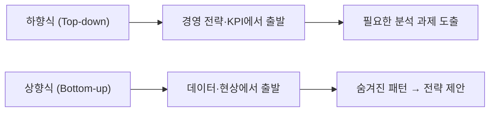

<Callout type="info">
  **이번 문서의 목표:** 막연한 "데이터를 분석하자"를, 실제로 답할 수 있는 분석 질문으로 바꾸는 방법을 익힙니다.
</Callout>

## 분석은 "데이터가 있어서"가 아니라 "결정이 필요해서" 시작한다

현업에서 가장 흔하게 들리는 요청은 다음과 같습니다.

> "이번 달 매출이 줄었어요. 데이터 분석 좀 해 주세요."

하지만 이 문장만으로는 분석을 시작할 수 없습니다. **매출 감소는 현상**이고, 분석 과제는 그 현상을 개선하기 위해 내려야 할 **의사결정**에서 출발해야 합니다.

분석의 목적을 한 줄로 정리하면 다음과 같습니다.

> **"누가, 어떤 결정을 더 잘 내리도록 도울 것인가?"**

이 질문에 답할 수 없다면, 분석을 시작하지 않는 것이 낫습니다.

## 분석 과제의 4가지 요소

잘 정의된 분석 과제에는 반드시 4가지 요소가 포함됩니다.

| 요소 | 설명 | 예시 |
|------|------|------|
| **의사결정 대상** | 누가 어떤 결정을 내리는가 | 마케팅팀이 혜택 제공 대상 회원을 선정 |
| **분석 목표(KPI)** | 어떤 수치로 성공을 판단하는가 | 해지율 5%p 감소 |
| **대상·기간** | 어떤 데이터를, 언제 기준으로 | 최근 6개월 활성 회원, 30일 행동 로그 |
| **성공 기준** | 언제 완료로 볼 것인가 | 모델 정확도 AUC 0.75 이상 |

## 현상 vs 분석 과제: 무엇이 다른가

"현상"은 이미 일어난 결과입니다. "분석 과제"는 그 결과를 바꾸기 위해 **지금 결정해야 할 것**을 묻는 질문입니다.

```
현상: 회원 수가 줄고 있다.
분석 과제: 해지 위험이 높은 회원을 사전에 식별하여, 어떤 혜택을 제공해야 이탈을 막을 수 있는가?
```

## 비즈니스 질문 → 분석 가능한 질문 변환

현업 담당자가 던지는 질문을 분석이 가능한 형태로 바꾸는 것이 분석가의 첫 번째 역할입니다.

| 비즈니스 질문 (현상) | 분석 가능한 질문 (과제) |
|---|---|
| "왜 매출이 떨어졌을까?" | "어떤 고객 세그먼트에서 구매 빈도가 감소했으며, 그 시점은 언제부터인가?" |
| "우리 앱 사용자가 이탈하는 것 같아요" | "최근 30일 로그인이 없는 사용자의 마지막 세션 행동 패턴은 무엇인가?" |
| "신제품이 잘 팔릴까요?" | "기존 구매 이력과 인구통계 데이터를 기반으로, 신제품 구매 가능성이 높은 고객 집단은 어느 세그먼트인가?" |

## 하향식(Top-down) vs 상향식(Bottom-up) 접근법

분석 과제를 발굴하는 방법은 두 가지로 나뉩니다.



| 구분 | 하향식(Top-down) | 상향식(Bottom-up) |
|------|-----------------|-------------------|
| **출발점** | 경영 목표, KPI | 데이터, 현장 현상 |
| **주도자** | 경영진, 기획팀 | 데이터 분석가 |
| **장점** | 전략 정합성 높음 | 새로운 기회 발견 가능 |
| **단점** | 데이터 가용성 미고려 | 비즈니스 연결이 약할 수 있음 |
| **적합 상황** | 명확한 목표가 있을 때 | 탐색적 분석, 데이터 기반 혁신 |

실제 분석 프로젝트에서는 두 접근법을 병행하는 것이 가장 효과적입니다. 경영 전략에서 과제를 내려받고(Top-down), 동시에 데이터를 탐색하며 새로운 기회를 발굴(Bottom-up)합니다.

## 분석 과제 정의 문장 틀

분석 과제를 명확하게 서술하는 문장 틀을 활용하면 이해 관계자 간 오해를 줄일 수 있습니다.

> **[대상]의 [문제]를 [데이터]로 분석하여 [의사결정]에 활용한다. 성공은 [KPI]로 확인한다.**

예시:

> 음악 스트리밍 앱의 **유료 구독자 이탈 문제**를 **최근 90일 청취 이력·결제 로그**로 분석하여, **고위험 회원 대상 혜택 제공 의사결정**에 활용한다. 성공은 **해지율 3%p 감소**로 확인한다.

## 실전 사례: 음악 앱 이탈 분석 전 과정

실제 분석 프로젝트가 어떻게 흘러가는지 처음부터 끝까지 따라가 보겠습니다.

**Step 1 — 현상 파악**
- 유료 구독 해지율이 전년 대비 8% 상승
- CS팀 문의 중 "쓸 콘텐츠가 없다"는 응답이 증가

**Step 2 — 의사결정 주체 확인**
- CRM팀: 이탈 위험 고객에게 어떤 혜택을 제공할지 결정
- 콘텐츠팀: 어떤 장르·아티스트를 보강할지 결정

**Step 3 — 분석 과제 정의 (문장 틀 적용)**
> 유료 구독자의 해지 문제를, 최근 3개월 청취 로그와 구독 이력 데이터로 분석하여, CRM팀의 이탈 방지 혜택 대상 선정에 활용한다. 성공은 다음 분기 해지율 5%p 감소로 확인한다.

**Step 4 — 분석 실행 및 결과**
- 해지 30일 전부터 청취 시간이 주당 평균 70% 감소
- 특정 장르(인디·재즈) 청취자의 이탈률이 2.3배 높음
- 이탈 예측 모델 AUC 0.81 달성

**Step 5 — 의사결정 반영**
- 해지 위험 고객에게 30일 무료 프리미엄 제공
- 인디·재즈 장르 큐레이션 강화

## 핵심 정리

- 분석은 **현상**이 아니라 **의사결정**에서 출발한다
- 잘 정의된 분석 과제는 **의사결정 대상, 분석 목표(KPI), 대상·기간, 성공 기준** 4가지를 포함한다
- **현상 → 분석 가능한 질문**으로 변환하는 것이 분석가의 핵심 역할이다
- 하향식은 전략 정합성, 상향식은 새로운 기회 발굴에 강하다
- 분석 과제 정의 문장 틀: **[대상]의 [문제]를 [데이터]로 분석하여 [의사결정]에 활용. 성공은 [KPI]로 확인**

## 마무리 복습

<Quiz
  questionNumber={1}
  question="다음 중 '분석 과제'로 올바르게 정의된 것은?"
  options={[
    '최근 3개월간 고객 이탈률이 증가했다.',
    '매출이 감소하고 있으니 데이터를 분석해야 한다.',
    '해지 위험 고객을 30일 행동 패턴으로 예측하여 CRM팀의 혜택 제공 대상 선정에 활용하고, 해지율 5%p 감소로 성공을 확인한다.',
    '데이터가 많이 쌓였으니 분석을 시작해야 한다.'
  ]}
  correctAnswer={3}
  explanation="분석 과제는 의사결정 대상, 분석 목표(KPI), 대상·기간, 성공 기준 4가지를 포함해야 합니다. 선택지 3번만 의사결정 주체(CRM팀), 분석 방법(30일 행동 패턴), 활용처(혜택 대상 선정), 성공 기준(5%p 감소)을 모두 포함합니다."
  optionExplanations={[
    '이탈률 증가는 현상 기술입니다. 분석 과제가 아닙니다.',
    '의사결정 방향이 없는 막연한 표현입니다.',
    '맞습니다. 의사결정 주체, 분석 목표, 성공 기준이 모두 명확히 포함되어 있습니다.',
    '데이터 가용성만 언급할 뿐 분석 목적과 의사결정이 없습니다.'
  ]}
/>

<Quiz
  questionNumber={2}
  question="하향식(Top-down) 접근법에 대한 설명으로 옳은 것은?"
  options={[
    '데이터에서 출발하여 새로운 패턴을 발견하는 방식이다.',
    '경영 전략과 KPI에서 출발하여 필요한 분석 과제를 도출하는 방식이다.',
    '현장 데이터 분석가가 주도하는 방식이다.',
    '탐색적 데이터 분석(EDA)을 중심으로 한다.'
  ]}
  correctAnswer={2}
  explanation="하향식(Top-down) 접근법은 경영 목표와 KPI에서 출발하여 필요한 분석 과제를 도출하는 방식입니다. 전략 정합성이 높지만 데이터 가용성을 미처 고려하지 못할 수 있습니다. 반대로 데이터에서 출발하여 패턴을 찾는 것은 상향식(Bottom-up) 접근법입니다."
  optionExplanations={[
    '데이터에서 출발하는 것은 상향식(Bottom-up) 접근법의 특징입니다.',
    '맞습니다. 하향식은 경영 전략·KPI → 분석 과제 도출의 흐름을 따릅니다.',
    '현장 분석가 주도는 상향식 접근법에 더 가깝습니다.',
    '탐색적 분석(EDA)은 상향식 접근법에 가깝습니다.'
  ]}
/>

<Quiz
  questionNumber={3}
  question="분석 과제 정의의 4가지 요소가 아닌 것은?"
  options={[
    '의사결정 대상',
    '분석 목표(KPI)',
    '데이터 수집 도구',
    '성공 기준'
  ]}
  correctAnswer={3}
  explanation="분석 과제의 4가지 요소는 ① 의사결정 대상, ② 분석 목표(KPI), ③ 대상·기간, ④ 성공 기준입니다. '데이터 수집 도구'는 과제 정의 단계가 아닌 실행 계획 단계에서 결정하는 사항입니다."
  optionExplanations={[
    '의사결정 대상은 4가지 요소 중 하나입니다.',
    '분석 목표(KPI)는 4가지 요소 중 하나입니다.',
    '맞습니다. 데이터 수집 도구는 과제 정의 4요소에 포함되지 않습니다.',
    '성공 기준은 4가지 요소 중 하나입니다.'
  ]}
/>

## 참고 자료

- [KDATA 데이터자격시험 - 빅데이터분석기사](https://www.dataq.or.kr/www/sub/a_07.do)
- [NIST/SEMATECH e-Handbook of Statistical Methods](https://www.itl.nist.gov/div898/handbook/)
